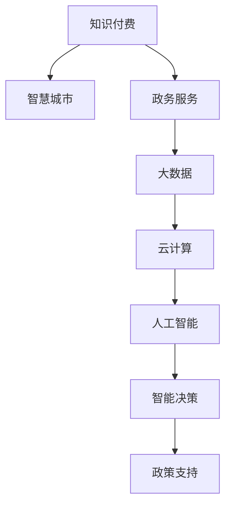

                 

# 如何利用知识付费实现智慧城市与政务服务？

> 关键词：知识付费,智慧城市,政务服务,大数据,云计算,人工智能,智能决策,政策支持

## 1. 背景介绍

### 1.1 问题由来
随着信息技术的发展和数字经济的兴起，智慧城市和政务服务已经成为现代社会不可或缺的基础设施。然而，由于信息不对称、资源分散等问题，智慧城市和政务服务在实际应用中面临诸多挑战。如何在城市治理、公共服务等领域高效、准确、透明地传递知识，已成为亟需解决的问题。

### 1.2 问题核心关键点
知识付费的兴起，为智慧城市与政务服务提供了一种新的思路。通过知识付费，可以有效地汇聚各类专业知识，构建一个集成的、多层次的、智能化的智慧城市和政务服务体系。该体系能大幅提升城市治理效率、优化公共服务、保障公共信息安全，助力实现智慧政府和智慧城市的愿景。

### 1.3 问题研究意义
研究如何利用知识付费推动智慧城市与政务服务的发展，对于提升城市治理智能化水平、优化公共服务、构建智慧政府具有重要意义：

1. **提升治理效率**：知识付费能汇聚专家智慧，为城市决策提供高水平、高精度的数据分析和预测，提升城市治理效率。
2. **优化公共服务**：通过知识付费平台，政府可以高效收集民意、公开信息，实现服务的精细化、个性化管理。
3. **保障信息安全**：知识付费体系能够严格控制数据访问权限，避免信息泄露，保障城市和政务数据的安全。
4. **实现智能决策**：知识付费结合AI、大数据等技术，能够实现数据的自动分析和智能决策，提升决策科学性和精准性。

## 2. 核心概念与联系

### 2.1 核心概念概述

为更好地理解知识付费如何应用于智慧城市与政务服务，本节将介绍几个密切相关的核心概念：

- **知识付费**：基于知识产品的付费模式，用户为获取知识和信息服务而支付费用。常见形式包括订阅、按次付费、打赏等。
- **智慧城市**：通过信息技术和创新应用，提升城市治理、公共服务和生态环境管理水平，实现智能化、高效化、绿色化、普惠化。
- **政务服务**：政府利用信息技术和平台，提供便捷、透明、高效、公平的公共服务。
- **大数据**：大量结构化和非结构化数据的集合，通过分析挖掘获取有价值的信息和洞察。
- **云计算**：基于互联网的计算资源和平台，提供按需、灵活的计算能力。
- **人工智能**：模拟人类智能行为，解决复杂问题的计算方法。
- **智能决策**：利用AI和数据分析技术，实现基于数据的决策。
- **政策支持**：政府制定相关政策，推动智慧城市和政务服务的发展。

这些核心概念之间的逻辑关系可以通过以下Mermaid流程图来展示：



这个流程图展示了几大核心概念之间的相互关系：

1. 知识付费为智慧城市和政务服务提供高质量的知识资源。
2. 大数据和云计算为知识付费的资源存储和处理提供支撑。
3. 人工智能在数据分析和智能决策中扮演关键角色。
4. 智能决策为智慧城市和政务服务提供科学依据。
5. 政策支持为知识付费和智慧城市发展提供方向指引。

## 3. 核心算法原理 & 具体操作步骤
### 3.1 算法原理概述

知识付费应用于智慧城市与政务服务，核心在于通过高质量的知识资源，辅助决策和优化服务。具体来说，知识付费结合大数据、云计算、人工智能等技术，形成知识付费体系，为城市治理、公共服务提供支持。

形式化地，假设知识付费体系为 $KP$，智慧城市和政务服务为 $SC$。知识付费体系通过汇聚专家智慧和专业数据，辅助城市和政务服务，可以抽象为：

$$
SC = KP \times C_{alg} \times P_{support}
$$

其中 $C_{alg}$ 为云计算和大数据提供的算法处理能力，$P_{support}$ 为政策支持的监管和指导。

知识付费体系的构建，使得智慧城市和政务服务能够更加科学、高效地运行。

### 3.2 算法步骤详解

知识付费在智慧城市和政务服务中的应用，主要包括以下几个关键步骤：

**Step 1: 知识资源收集与整理**

- 确定知识付费平台的目标用户和领域，收集专家、学者、机构等提供的知识资源。
- 对知识资源进行分类、整理、标注，构建领域知识库。

**Step 2: 知识付费平台设计**

- 设计平台架构，选择适合的云服务提供商和数据存储方案。
- 开发平台功能模块，包括资源管理、支付系统、推荐算法等。
- 确保平台的安全性和隐私保护，符合相关法律法规要求。

**Step 3: 知识获取与付费**

- 用户通过平台获取知识资源，选择订阅、按次付费或打赏等支付方式。
- 平台根据用户需求，匹配最相关的知识内容，并提供付费方案。
- 用户付费后，获取相应的知识内容和服务。

**Step 4: 知识分析与智能决策**

- 利用大数据和人工智能技术，对知识资源进行深度分析和挖掘。
- 将分析结果应用于城市治理、公共服务等领域，辅助科学决策。
- 持续更新和优化知识库，保持知识的时效性和适用性。

**Step 5: 智能服务的实现**

- 利用知识付费平台获取的智能分析结果，优化公共服务流程。
- 开发智能服务系统，实现自动化的信息检索、服务推荐等功能。
- 利用智能决策支持系统，提升政府决策的科学性和精准性。

### 3.3 算法优缺点

知识付费应用于智慧城市与政务服务的优点包括：

1. **高效获取知识**：通过平台汇聚专家智慧，用户能快速获取高质量的知识资源，提升决策效率。
2. **精细化服务**：基于用户需求和偏好，推荐个性化的知识内容，实现服务的精细化管理。
3. **数据驱动决策**：结合大数据和人工智能，实现基于数据的科学决策，提升决策精准度。
4. **广泛适用性**：适用于各种领域的知识付费，覆盖智慧城市和政务服务各个方面。

然而，该方法也存在一些局限性：

1. **费用门槛**：部分知识资源需要付费获取，对于经济状况较差的用户可能存在一定的经济负担。
2. **平台依赖**：知识付费平台的用户粘性较高，部分用户可能对平台的依赖性较强。
3. **数据隐私**：用户数据的隐私保护需重点关注，防止数据泄露和滥用。
4. **技术门槛**：平台设计和维护需要一定的技术实力，需投入较大人力和物力成本。

### 3.4 算法应用领域

知识付费在智慧城市与政务服务中的应用，主要包括以下几个方面：

- **城市治理**：辅助政府在城市规划、建设、管理等环节进行科学决策。
- **公共服务**：提供精准化、个性化的公共服务，提升服务质量和效率。
- **智慧交通**：基于知识付费平台的数据分析和智能决策，优化交通管理，减少拥堵和事故。
- **环境监测**：通过知识付费平台获取的实时数据，实现环境污染的预测和预警，保障生态环境。
- **健康医疗**：结合知识付费平台的健康数据，提供个性化的医疗服务，提升公共健康水平。

## 4. 数学模型和公式 & 详细讲解  
### 4.1 数学模型构建

本节将使用数学语言对知识付费在智慧城市与政务服务中的应用进行更加严格的刻画。

记知识付费平台为 $KP$，智慧城市与政务服务为 $SC$。设知识付费平台的用户数量为 $U$，领域知识库中的知识资源数量为 $K$，用户平均支付费用为 $P$。知识付费平台通过汇聚知识资源，提供知识服务，可以抽象为以下模型：

$$
SC = f(KP, U, P)
$$

其中 $f$ 表示知识付费平台与用户、知识资源之间的关系，可以通过以下公式进一步展开：

$$
SC = f(KP, U, P) = U \times \frac{P}{K} \times K
$$

即知识付费平台通过用户付费获取知识资源，提供知识服务。

### 4.2 公式推导过程

设知识付费平台的用户数量为 $U$，领域知识库中的知识资源数量为 $K$，用户平均支付费用为 $P$。知识付费平台通过汇聚知识资源，提供知识服务。

知识付费平台的用户数量 $U$ 和知识资源数量 $K$ 一般成正比关系，即：

$$
U \propto K
$$

用户平均支付费用 $P$ 与知识资源的价值成正比，即：

$$
P \propto V(K)
$$

其中 $V(K)$ 表示知识资源的价值，可以通过知识资源的质量、稀缺性、创新性等指标来衡量。

将上述关系代入模型中，得到：

$$
SC = U \times \frac{P}{K} \times K = U \times P
$$

即知识付费平台提供的智慧城市与政务服务水平，与用户数量和用户平均支付费用成正比。

### 4.3 案例分析与讲解

以智慧交通系统为例，分析知识付费在其中的应用：

**Step 1: 知识资源收集与整理**

- 收集智慧交通领域专家的研究成果和报告，形成领域知识库。
- 对知识资源进行分类、整理、标注，构建交通知识图谱。

**Step 2: 知识付费平台设计**

- 选择合适的云服务提供商，搭建平台架构。
- 开发平台功能模块，包括知识检索、推荐算法、智能决策等。
- 确保平台的安全性和隐私保护，符合相关法律法规要求。

**Step 3: 知识获取与付费**

- 用户通过平台检索、订阅智慧交通领域知识资源，选择订阅或按次付费。
- 平台根据用户需求，匹配最相关的交通知识内容，并提供付费方案。
- 用户付费后，获取相应的知识内容和服务。

**Step 4: 知识分析与智能决策**

- 利用大数据和人工智能技术，对交通知识资源进行深度分析和挖掘。
- 将分析结果应用于交通管理、路网优化等领域，辅助科学决策。
- 持续更新和优化交通知识库，保持知识的时效性和适用性。

**Step 5: 智能服务的实现**

- 利用知识付费平台获取的智能分析结果，优化交通管理流程。
- 开发智能交通系统，实现自动化的交通信号控制、路线推荐等功能。
- 利用智能决策支持系统，提升交通管理的科学性和精准性。

## 5. 项目实践：代码实例和详细解释说明
### 5.1 开发环境搭建

在进行知识付费实践前，我们需要准备好开发环境。以下是使用Python进行Flask开发的环境配置流程：

1. 安装Anaconda：从官网下载并安装Anaconda，用于创建独立的Python环境。

2. 创建并激活虚拟环境：
```bash
conda create -n knowledge-payment python=3.8 
conda activate knowledge-payment
```

3. 安装Flask：从官网下载并安装Flask框架。

4. 安装其他必要工具包：
```bash
pip install Flask SQLAlchemy gunicorn
```

完成上述步骤后，即可在`knowledge-payment`环境中开始知识付费系统的开发。

### 5.2 源代码详细实现

下面我们以知识付费平台为例，给出使用Flask和SQLAlchemy库进行知识付费系统的PyTorch代码实现。

首先，定义用户和知识资源模型：

```python
from flask_sqlalchemy import SQLAlchemy
from sqlalchemy import Column, Integer, String, Float
from sqlalchemy.orm import relationship
from sqlalchemy.ext.declarative import declarative_base

Base = declarative_base()

class User(Base):
    __tablename__ = 'users'
    id = Column(Integer, primary_key=True)
    name = Column(String(50), nullable=False)
    email = Column(String(120), unique=True, nullable=False)
    payment = Column(Float, default=0)

class KnowledgeResource(Base):
    __tablename__ = 'knowledge_resources'
    id = Column(Integer, primary_key=True)
    title = Column(String(100), nullable=False)
    summary = Column(String(255), nullable=False)
    price = Column(Float, default=0)
    creator = Column(String(50), nullable=False)
```

然后，定义知识付费平台的路由和功能：

```python
from flask import Flask, render_template, request
from flask_sqlalchemy import SQLAlchemy
from sqlalchemy.orm import sessionmaker

app = Flask(__name__)
app.config['SQLALCHEMY_DATABASE_URI'] = 'sqlite:///knowledge.db'
db = SQLAlchemy(app)
Session = sessionmaker(bind=db)

@app.route('/')
def index():
    knowledge_resources = KnowledgeResource.query.all()
    return render_template('index.html', knowledge_resources=knowledge_resources)

@app.route('/subscription', methods=['POST'])
def subscribe():
    email = request.form.get('email')
    amount = float(request.form.get('amount'))
    user = User.query.filter_by(email=email).first()
    if user:
        user.payment += amount
        db.commit()
        return 'Subscription successful'
    else:
        return 'Email not found', 404

@app.route('/purchase', methods=['POST'])
def purchase():
    resource_id = request.form.get('resource_id')
    amount = float(request.form.get('amount'))
    resource = KnowledgeResource.query.filter_by(id=resource_id).first()
    if resource:
        user = User.query.filter_by(email='example@email.com').first()
        if user:
            user.payment -= amount
            db.commit()
            return 'Purchase successful'
        else:
            return 'User not found', 404
    else:
        return 'Resource not found', 404

if __name__ == '__main__':
    app.run(debug=True)
```

最后，启动服务并测试：

```bash
gunicorn -w 4 app:app
```

在浏览器中访问 `http://localhost:5000`，即可访问知识付费平台的首页。

### 5.3 代码解读与分析

让我们再详细解读一下关键代码的实现细节：

**User模型**：
- 定义用户的基本属性，包括用户名、邮箱和支付金额。

**KnowledgeResource模型**：
- 定义知识资源的基本属性，包括标题、摘要、价格和创建者。

**index路由**：
- 查询所有的知识资源，并渲染到首页。

**subscribe路由**：
- 用户通过邮箱和支付金额订阅知识资源，更新用户的支付金额。

**purchase路由**：
- 用户通过邮箱和支付金额购买知识资源，更新用户的支付金额。

以上代码实现了一个简单的知识付费平台，通过SQLAlchemy和Flask框架实现了用户管理和知识资源的订阅、购买功能。

## 6. 实际应用场景
### 6.1 智能交通

知识付费平台在智能交通中的应用，主要体现在以下几个方面：

- **交通数据采集与分析**：通过知识付费平台，获取交通专家提供的实时交通数据和分析报告，辅助交通部门进行路网优化和事故预警。
- **交通管理决策支持**：结合交通知识资源和智能分析结果，为交通管理部门提供科学决策支持，优化交通信号控制、路线规划等。
- **交通信息服务**：基于知识付费平台获取的交通数据和分析结果，开发智能交通信息服务，为公众提供实时交通信息、路线推荐等。

### 6.2 环境监测

知识付费平台在环境监测中的应用，主要体现在以下几个方面：

- **环境数据采集与分析**：通过知识付费平台，获取环境科学专家提供的空气质量、水质、土壤等环境数据，进行深度分析和挖掘。
- **环境风险预警**：结合环境数据和智能分析结果，为环境监测部门提供风险预警和应对策略，保障生态环境安全。
- **环境保护建议**：基于知识付费平台获取的环境数据和分析结果，提供环境保护建议，推动绿色低碳发展。

### 6.3 健康医疗

知识付费平台在健康医疗中的应用，主要体现在以下几个方面：

- **医疗数据采集与分析**：通过知识付费平台，获取医学专家提供的病历、诊疗记录等医疗数据，进行深度分析和挖掘。
- **医疗决策支持**：结合医疗数据和智能分析结果，为医疗部门提供科学决策支持，优化诊疗方案、提升医疗质量。
- **健康咨询服务**：基于知识付费平台获取的医疗数据和分析结果，开发智能健康咨询服务，为公众提供健康咨询和疾病预防建议。

### 6.4 未来应用展望

随着知识付费技术的不断成熟，未来知识付费将在更多领域得到应用，为智慧城市和政务服务提供更强大的支持：

1. **智慧城市治理**：结合知识付费平台的智能分析和决策支持，提升城市治理的智能化水平，实现高效、透明、科学的城市管理。
2. **智慧政务服务**：基于知识付费平台的知识资源和服务，提供精准化、个性化、智能化的政务服务，提升服务效率和质量。
3. **智慧交通管理**：利用知识付费平台的交通数据和分析结果，优化交通管理，提升路网效率，减少交通拥堵和事故。
4. **智慧环境监测**：通过知识付费平台的环境数据和分析结果，实现环境风险预警和应对，保障生态环境安全。
5. **智慧健康管理**：结合知识付费平台的健康数据和分析结果，提供个性化健康咨询服务，提升公共健康水平。

## 7. 工具和资源推荐
### 7.1 学习资源推荐

为了帮助开发者系统掌握知识付费技术及其在智慧城市与政务服务中的应用，这里推荐一些优质的学习资源：

1. **《智慧城市与大数据》**：全面介绍智慧城市和大数据技术的经典书籍，涵盖智慧城市建设、数据采集与分析、智能决策等多个方面。

2. **《知识付费与人工智能》**：探讨知识付费和人工智能结合的前沿话题，涉及知识付费平台的搭建、数据分析与智能决策等多个环节。

3. **《知识付费平台设计与实现》**：系统讲解知识付费平台的设计、开发和运维，包括架构设计、用户管理、支付系统等。

4. **《智能交通系统设计与实现》**：详细介绍智能交通系统中的关键技术，如交通数据采集、智能决策、智能服务等多个环节。

5. **《环境监测与数据分析》**：介绍环境监测中常用的数据采集与分析技术，涵盖空气质量、水质、土壤等环境数据的深度挖掘。

6. **《健康医疗数据与分析》**：讲解健康医疗数据采集、分析和智能决策的方法，涉及病历、诊疗记录等多个领域。

通过对这些资源的学习实践，相信你一定能够快速掌握知识付费技术的精髓，并用于解决实际的智慧城市与政务服务问题。

### 7.2 开发工具推荐

高效的开发离不开优秀的工具支持。以下是几款用于知识付费开发和智慧城市与政务服务应用的常用工具：

1. **Flask**：基于Python的轻量级Web框架，适合快速迭代开发知识付费平台。

2. **SQLAlchemy**：基于Python的ORM框架，支持多种数据库，适合知识付费平台的后台数据库管理。

3. **Django**：基于Python的全功能Web框架，适合开发复杂的知识付费平台。

4. **Gunicorn**：Python Web应用服务器，支持异步处理，适合高性能的知识付费平台。

5. **Kibana**：基于Web的数据可视化工具，适合知识付费平台中的数据展示和分析。

6. **Prometheus**：开源的监控和告警系统，适合知识付费平台中的性能监控和告警。

合理利用这些工具，可以显著提升知识付费平台和智慧城市与政务服务应用的开发效率，加快创新迭代的步伐。

### 7.3 相关论文推荐

知识付费技术的不断演进，催生了诸多重要的研究成果。以下是几篇奠基性的相关论文，推荐阅读：

1. **《知识付费平台的经济分析》**：研究知识付费平台的经济模型，探讨平台的定价策略、用户行为等多个方面。

2. **《智能交通系统中的知识付费应用》**：介绍知识付费在智能交通中的应用，结合交通数据和智能分析，提升交通管理水平。

3. **《环境监测中的知识付费技术》**：探讨知识付费在环境监测中的应用，利用专家知识进行环境数据采集和分析。

4. **《健康医疗数据与知识付费的融合》**：研究知识付费在健康医疗中的应用，结合医疗数据和智能分析，提升医疗服务质量。

这些论文代表了大数据、云计算、人工智能等技术在知识付费中的前沿应用，为智慧城市和政务服务的持续发展提供了有力支撑。

## 8. 总结：未来发展趋势与挑战

### 8.1 总结

本文对知识付费如何应用于智慧城市与政务服务进行了全面系统的介绍。首先阐述了知识付费在智慧城市与政务服务中的重要意义，明确了知识付费体系在城市治理、公共服务等领域的高效应用。其次，从原理到实践，详细讲解了知识付费的数学模型和关键步骤，给出了知识付费平台开发的完整代码实例。同时，本文还广泛探讨了知识付费在智慧城市与政务服务中的应用前景，展示了知识付费技术的巨大潜力。此外，本文精选了知识付费技术的各类学习资源，力求为读者提供全方位的技术指引。

通过本文的系统梳理，可以看到，知识付费在智慧城市与政务服务中的应用，为城市治理和公共服务带来了新的思路和工具，显著提升了决策的科学性和服务的高效性。未来，随着知识付费技术的持续演进，其将为智慧城市和政务服务提供更加智能化、普惠化的支持。

### 8.2 未来发展趋势

展望未来，知识付费技术在智慧城市与政务服务中将呈现以下几个发展趋势：

1. **智能化水平提升**：知识付费平台将结合更多智能分析工具，如机器学习、深度学习等，提升决策的精准度和智能化水平。
2. **多模态信息融合**：知识付费平台将实现多模态信息融合，结合图像、声音、文本等多种数据形式，提供更全面的服务。
3. **用户个性化需求满足**：知识付费平台将利用用户行为分析，实现更加个性化的服务推荐，提升用户体验。
4. **全球知识共享**：知识付费平台将打破地域限制，实现全球范围内的知识共享和协作，提升全球智慧治理水平。
5. **社会影响增强**：知识付费平台将通过知识传播，提升社会公众的知识水平，推动社会进步和文明发展。

这些趋势表明，知识付费技术在智慧城市与政务服务中将发挥更加重要的作用，成为推动社会进步和公共服务的重要力量。

### 8.3 面临的挑战

尽管知识付费在智慧城市与政务服务中的应用前景广阔，但在发展过程中也面临诸多挑战：

1. **数据安全与隐私保护**：知识付费平台需要严格保护用户数据和隐私，防止数据泄露和滥用。
2. **知识获取难度**：部分知识资源需要专业背景，获取难度较大，影响知识付费平台的覆盖面。
3. **平台运营成本**：知识付费平台的开发和维护需要较大投入，运营成本较高。
4. **用户认知度不足**：部分用户对知识付费的认知不足，付费意愿较低，影响平台的用户粘性。
5. **技术门槛高**：知识付费平台的搭建和维护需要较高的技术实力，需投入较多人力和物力资源。

### 8.4 研究展望

面对知识付费在智慧城市与政务服务中面临的挑战，未来的研究需要在以下几个方面寻求新的突破：

1. **提升数据安全性**：加强数据加密和安全防护，确保知识付费平台的数据安全。
2. **降低知识获取难度**：通过众包、开源等方式，降低知识获取难度，扩大知识覆盖面。
3. **优化平台运营成本**：利用云服务和自动化技术，降低知识付费平台的运营成本。
4. **提高用户认知度**：通过多渠道宣传和教育，提升用户对知识付费的认知度，增加用户粘性。
5. **降低技术门槛**：采用标准化组件和开箱即用的工具，降低知识付费平台的开发和维护门槛。

这些研究方向的探索，必将引领知识付费技术在智慧城市与政务服务中的应用进入新阶段，推动城市治理和公共服务的智能化、普惠化发展。

## 9. 附录：常见问题与解答

**Q1：知识付费在智慧城市与政务服务中的应用前景如何？**

A: 知识付费在智慧城市与政务服务中的应用前景广阔，主要体现在以下几个方面：

1. **高效决策支持**：知识付费平台汇聚专家智慧，提供高质量的知识资源，辅助科学决策，提升决策效率。
2. **精细化服务管理**：利用知识付费平台，提供精准化、个性化的公共服务，提升服务质量和效率。
3. **数据驱动治理**：结合知识付费平台的智能分析和决策支持，推动城市治理的智能化、高效化、科学化。
4. **社会进步推动**：知识付费平台通过知识传播，提升公众的知识水平，推动社会进步和文明发展。

**Q2：知识付费平台的设计和开发需要注意哪些关键点？**

A: 知识付费平台的设计和开发需要注意以下几个关键点：

1. **用户需求分析**：明确平台的目标用户和需求，设计合理的知识付费方案。
2. **知识资源管理**：对知识资源进行分类、整理、标注，构建领域知识库。
3. **支付系统设计**：设计安全、便捷的支付系统，确保用户的支付安全和体验。
4. **平台安全防护**：加强平台的安全性和隐私保护，符合相关法律法规要求。
5. **智能分析与推荐**：利用大数据和人工智能技术，进行知识资源分析和推荐。

**Q3：知识付费平台如何提升用户粘性？**

A: 知识付费平台提升用户粘性，可以从以下几个方面入手：

1. **提供优质内容**：确保知识资源的丰富性和高质量，吸引用户长期订阅和付费。
2. **个性化推荐**：利用用户行为分析，实现个性化推荐，满足用户的个性化需求。
3. **互动交流平台**：建立用户互动交流平台，增强用户粘性和社区感。
4. **免费试用功能**：提供免费试用功能，吸引用户体验平台的优质内容和服务。

**Q4：知识付费平台如何保障数据安全？**

A: 知识付费平台保障数据安全，需要注意以下几个方面：

1. **数据加密**：对用户数据进行加密存储，确保数据传输和存储的安全性。
2. **权限控制**：严格控制数据访问权限，确保只有授权用户才能访问数据。
3. **安全审计**：定期进行安全审计，及时发现和修复安全漏洞。
4. **合规性保障**：确保平台符合相关法律法规和行业标准，保护用户隐私和数据安全。

**Q5：知识付费平台如何降低知识获取难度？**

A: 知识付费平台降低知识获取难度，可以从以下几个方面入手：

1. **众包机制**：利用众包机制，收集和整理各领域的知识资源。
2. **开源资源**：引入开源知识资源，降低知识获取成本。
3. **知识共享**：建立知识共享平台，促进知识传播和利用。
4. **标准化组件**：采用标准化组件和模块化设计，降低知识获取和整合难度。

总之，知识付费平台在智慧城市与政务服务中的应用前景广阔，但也需要面对诸多挑战。通过不断优化平台设计、提升技术实力、加强数据安全防护，相信知识付费技术将为智慧城市与政务服务带来更广泛的应用和更深远的社会影响。

