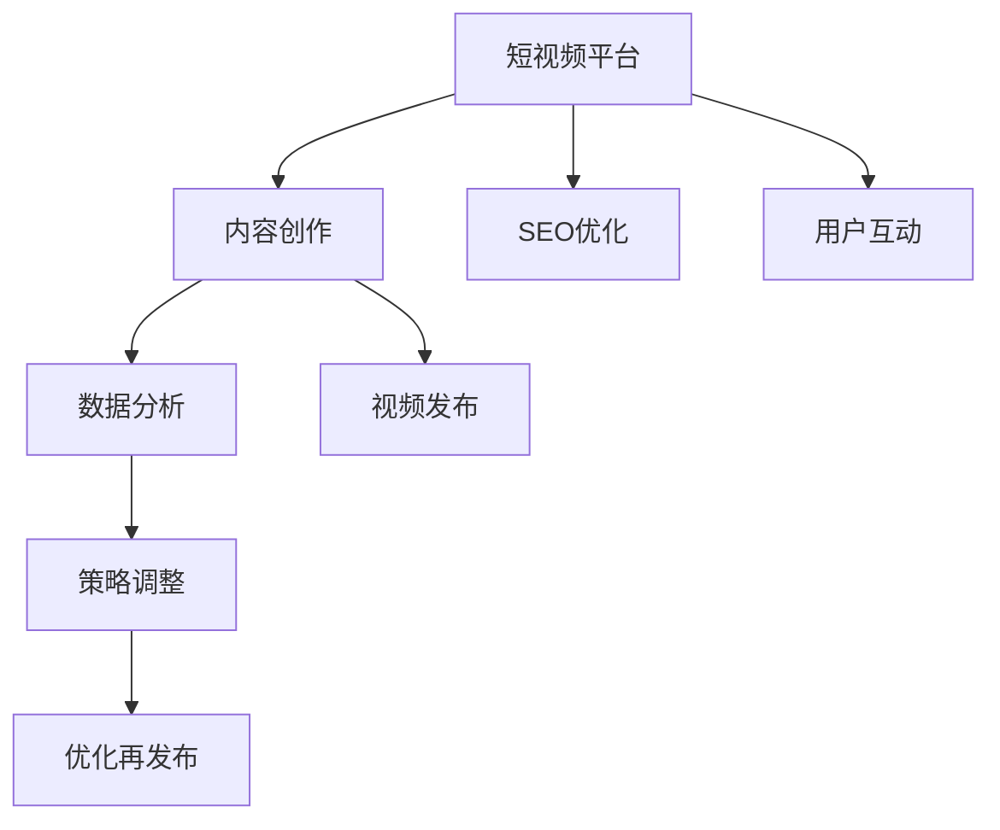

                 

# 如何利用短视频平台推广知识付费产品

> 关键词：短视频平台,知识付费,内容营销,社交媒体,用户参与,内容运营,SEO优化

## 1. 背景介绍

### 1.1 问题由来

在数字化时代，知识付费已经成为一种快速增长的商业模式。人们越来越重视知识和信息的价值，愿意为之支付合理费用。与此同时，短视频平台的兴起，为知识付费提供了新的契机。短视频具备高效、互动性强、传播范围广等优势，可以有效吸引用户，提升知识付费产品的曝光度和转化率。因此，如何利用短视频平台推广知识付费产品，成为了当下企业必须考虑的一个重要课题。

### 1.2 问题核心关键点

要成功利用短视频平台推广知识付费产品，需要关注以下几个核心关键点：

- 选择适合的短视频平台
- 设计吸引用户的短视频内容
- 优化短视频的SEO（搜索引擎优化）
- 利用社交媒体进行用户互动和口碑传播
- 数据分析与策略调整

这些关键点将直接影响推广的效果和ROI（投资回报率）。以下将详细介绍各个关键点的实现方法。

## 2. 核心概念与联系

### 2.1 核心概念概述

1. **短视频平台**：如抖音、快手、Bilibili等，是内容分发的重要渠道，具备海量用户和互动功能。
2. **知识付费**：指用户为获取特定知识或信息而支付费用的商业模式，如在线课程、电子书、咨询服务等。
3. **内容营销**：通过提供有价值的内容吸引用户，最终实现销售转化或品牌建设的目标。
4. **社交媒体**：如微信、微博、知乎等，是用户交流和内容传播的重要场所，对产品推广有显著影响。
5. **SEO优化**：通过优化视频内容，使其在搜索引擎中排名靠前，从而增加曝光度。
6. **用户参与**：通过互动、评论、分享等方式，增强用户对知识付费产品的粘性和信任感。
7. **数据分析与策略调整**：利用数据分析工具，监测推广效果，实时调整推广策略，提升ROI。

这些核心概念之间有着紧密的联系，共同构成了利用短视频平台推广知识付费产品的基本框架。

### 2.2 核心概念原理和架构的 Mermaid 流程图



此流程图展示了短视频平台推广知识付费产品的全流程。首先，通过内容创作产出吸引用户的视频内容；然后，通过SEO优化提高视频在搜索引擎中的排名；接着，利用用户互动增强用户粘性和信任感；最后，通过数据分析调整策略，实现持续优化和提升。

## 3. 核心算法原理 & 具体操作步骤

### 3.1 算法原理概述

利用短视频平台推广知识付费产品的核心算法原理可以归结为以下几个步骤：

1. **用户行为分析**：通过分析用户的观看行为、互动行为等数据，了解用户的兴趣点和需求。
2. **内容推荐算法**：根据用户行为数据，推荐用户可能感兴趣的内容，提高观看率和参与度。
3. **SEO优化算法**：通过关键词优化、视频标题和描述优化等手段，提高视频在搜索引擎中的排名。
4. **互动激励机制**：通过点赞、评论、分享等互动行为激励用户参与，提升用户粘性。
5. **数据分析与策略调整**：利用数据分析工具，监测视频观看、互动等数据，实时调整推广策略。

### 3.2 算法步骤详解

#### 3.2.1 用户行为分析

1. **数据收集**：利用平台提供的数据接口或API，收集用户观看、点赞、评论、分享等行为数据。
2. **行为分析**：通过数据挖掘和机器学习算法，分析用户行为模式，如观看时长、互动频率、兴趣爱好等。
3. **用户画像构建**：根据分析结果，构建用户画像，了解不同用户群体的特点和需求。

#### 3.2.2 内容推荐算法

1. **推荐模型选择**：选择适合的推荐算法，如协同过滤、基于内容的推荐、深度学习等。
2. **特征提取**：提取视频内容的特征，如关键词、主题、时长、画质等。
3. **模型训练**：利用用户行为数据训练推荐模型，生成个性化的内容推荐列表。
4. **推荐策略优化**：根据推荐效果，不断优化模型参数和特征选择，提高推荐准确率。

#### 3.2.3 SEO优化算法

1. **关键词分析**：通过工具分析热门关键词和长尾关键词，选择与知识付费产品相关的关键词。
2. **标题和描述优化**：根据关键词优化视频标题和描述，使其更具吸引力和相关性。
3. **视频内容优化**：在视频中添加关键词、标签等，提高搜索引擎的识别和收录。
4. **效果监测**：利用SEO工具监测关键词排名变化，根据效果调整优化策略。

#### 3.2.4 互动激励机制

1. **互动行为识别**：识别用户的点赞、评论、分享等互动行为。
2. **激励措施设计**：设计激励措施，如抽奖、优惠券、会员特权等，吸引用户参与。
3. **互动数据分析**：分析互动数据，了解用户参与度变化，优化互动激励策略。

#### 3.2.5 数据分析与策略调整

1. **数据收集与整理**：利用数据分析工具收集视频观看、互动等数据。
2. **指标分析**：分析关键指标如观看次数、互动次数、转化率等，评估推广效果。
3. **策略调整**：根据分析结果，调整内容策略、SEO策略、互动策略等，持续优化推广效果。

### 3.3 算法优缺点

#### 3.3.1 优点

1. **高效曝光**：短视频平台用户量庞大，通过短视频可以快速曝光知识付费产品，吸引用户关注。
2. **互动性强**：用户可以通过评论、点赞等方式互动，增强产品粘性。
3. **灵活调整**：通过数据分析实时调整策略，提高推广效果。

#### 3.3.2 缺点

1. **内容生产成本高**：制作高质量短视频内容需要时间和资源投入，成本较高。
2. **市场竞争激烈**：短视频平台内容丰富，用户选择多样，竞争压力较大。
3. **SEO效果不确定**：SEO优化效果受搜索引擎算法变化影响，存在不确定性。

### 3.4 算法应用领域

利用短视频平台推广知识付费产品的算法原理和技术步骤可以应用于以下领域：

- **在线教育**：如编程课程、外语学习、职业技能培训等。
- **企业培训**：如员工技能提升、企业文化宣导等。
- **个人成长**：如时间管理、心理学、财务规划等。
- **健康生活**：如健身指导、营养知识、心理健康等。

这些领域的内容制作和推广方法类似，均可以通过短视频平台进行有效推广。

## 4. 数学模型和公式 & 详细讲解 & 举例说明

### 4.1 数学模型构建

#### 4.1.1 用户行为分析模型

**模型公式**：

$$
\text{User Behavior} = \text{Data Collection} + \text{Data Analysis} + \text{User Profiling}
$$

其中，Data Collection表示数据收集，Data Analysis表示数据挖掘和机器学习，User Profiling表示用户画像构建。

#### 4.1.2 内容推荐模型

**协同过滤模型**：

$$
\text{Recommendation} = \text{Collaborative Filtering} + \text{Feature Extraction} + \text{Model Training} + \text{Recommendation Strategy Optimization}
$$

其中，Collaborative Filtering表示协同过滤算法，Feature Extraction表示特征提取，Model Training表示模型训练，Recommendation Strategy Optimization表示推荐策略优化。

#### 4.1.3 SEO优化模型

**关键词优化模型**：

$$
\text{SEO Optimization} = \text{Keyword Analysis} + \text{Title Optimization} + \text{Description Optimization} + \text{Content Optimization} + \text{SEO Effect Monitoring}
$$

其中，Keyword Analysis表示关键词分析，Title Optimization表示标题优化，Description Optimization表示描述优化，Content Optimization表示内容优化，SEO Effect Monitoring表示SEO效果监测。

#### 4.1.4 互动激励模型

**互动行为激励模型**：

$$
\text{Interaction Incentive} = \text{Behavior Recognition} + \text{Incentive Design} + \text{Interactive Data Analysis} + \text{Strategy Optimization}
$$

其中，Behavior Recognition表示互动行为识别，Incentive Design表示激励措施设计，Interactive Data Analysis表示互动数据分析，Strategy Optimization表示策略优化。

### 4.2 公式推导过程

#### 4.2.1 用户行为分析公式推导

**用户行为分析**：

$$
\text{User Behavior Analysis} = \sum_{i=1}^N \text{Behavior}_{i}
$$

其中，$N$表示用户行为类型数量，$\text{Behavior}_{i}$表示第$i$种用户行为。

**用户画像构建**：

$$
\text{User Profile} = \text{User Behavior Analysis} + \text{Clustering}
$$

其中，Clustering表示聚类算法，用于将用户分为不同的群体。

#### 4.2.2 内容推荐公式推导

**协同过滤模型**：

$$
\text{Recommendation} = \text{User-Item Matrix} \times \text{Item-Item Matrix}
$$

其中，User-Item Matrix表示用户-物品评分矩阵，Item-Item Matrix表示物品-物品相似度矩阵。

**特征提取**：

$$
\text{Features} = \text{Video Title} + \text{Video Description} + \text{Video Keywords} + \text{Video Thumbnail}
$$

#### 4.2.3 SEO优化公式推导

**关键词优化**：

$$
\text{Keyword Optimization} = \text{Search Volume} + \text{Keyword Relevance} + \text{Competitive Analysis}
$$

其中，Search Volume表示关键词搜索量，Keyword Relevance表示关键词与内容的匹配度，Competitive Analysis表示竞争分析。

**标题优化**：

$$
\text{Title Optimization} = \text{Keyword Incorporation} + \text{SEO Keywords}
$$

其中，Keyword Incorporation表示关键词融入，SEO Keywords表示SEO关键词。

**描述优化**：

$$
\text{Description Optimization} = \text{Keyword Density} + \text{Meta Tags}
$$

其中，Keyword Density表示关键词密度，Meta Tags表示元标签。

**内容优化**：

$$
\text{Content Optimization} = \text{Video Length} + \text{Video Quality} + \text{Call-to-Action}
$$

其中，Video Length表示视频长度，Video Quality表示视频画质，Call-to-Action表示视频中的呼吁行动。

#### 4.2.4 互动激励公式推导

**互动行为识别**：

$$
\text{Interaction Behavior} = \text{Likes} + \text{Comments} + \text{Shares}
$$

其中，Likes表示点赞，Comments表示评论，Shares表示分享。

**激励措施设计**：

$$
\text{Incentive Measures} = \text{Prizes} + \text{Discounts} + \text{Exclusive Access}
$$

其中，Prizes表示奖品，Discounts表示折扣，Exclusive Access表示独家访问。

**互动数据分析**：

$$
\text{Interactive Data Analysis} = \text{Engagement Rate} + \text{Conversion Rate}
$$

其中，Engagement Rate表示参与率，Conversion Rate表示转化率。

**策略优化**：

$$
\text{Strategy Optimization} = \text{A/B Testing} + \text{Feedback Loop}
$$

其中，A/B Testing表示A/B测试，Feedback Loop表示反馈循环。

### 4.3 案例分析与讲解

#### 4.3.1 案例一：在线教育课程推广

某在线教育平台在抖音平台上推广编程课程，通过以下步骤进行：

1. **数据收集**：利用抖音API收集用户观看编程课程的视频数据。
2. **行为分析**：通过数据挖掘分析用户观看时长、点赞和评论数据，发现用户对编程语言和项目实战类内容兴趣较大。
3. **内容推荐**：基于用户行为分析结果，推荐相关课程和实战项目，提高观看率。
4. **SEO优化**：优化视频标题和描述，包含“Python基础”、“Java实战”等关键词，提升搜索引擎排名。
5. **互动激励**：设计“编程挑战”活动，奖励完成挑战的用户优惠券和课程折扣，提升用户参与度。
6. **数据分析**：通过数据分析工具监测观看次数和课程购买率，优化推荐策略和SEO策略。

#### 4.3.2 案例二：企业员工培训推广

某企业在线平台在快手平台上推广员工技能培训课程，通过以下步骤进行：

1. **数据收集**：利用快手API收集员工观看技能培训课程的视频数据。
2. **行为分析**：通过数据挖掘分析员工观看时长和互动行为，发现员工对管理类和专业技能类课程兴趣较大。
3. **内容推荐**：基于员工行为分析结果，推荐相关管理类和专业技能类课程，提高观看率。
4. **SEO优化**：优化视频标题和描述，包含“领导力”、“项目管理”等关键词，提升搜索引擎排名。
5. **互动激励**：设计“技能挑战”活动，奖励完成挑战的员工额外学习时间和证书，提升员工参与度。
6. **数据分析**：通过数据分析工具监测观看次数和培训效果，优化推荐策略和SEO策略。

## 5. 项目实践：代码实例和详细解释说明

### 5.1 开发环境搭建

1. **安装Python**：确保系统安装了Python 3.x版本。
2. **安装pandas**：利用pip安装pandas库，用于数据处理和分析。
3. **安装numpy**：利用pip安装numpy库，用于数值计算和数组操作。
4. **安装requests**：利用pip安装requests库，用于HTTP请求和数据收集。
5. **安装Matplotlib**：利用pip安装Matplotlib库，用于数据可视化。
6. **安装tqdm**：利用pip安装tqdm库，用于进度条显示。
7. **安装Torch**：利用pip安装Torch库，用于构建深度学习模型。
8. **安装TensorFlow**：利用pip安装TensorFlow库，用于构建深度学习模型。
9. **安装Keras**：利用pip安装Keras库，用于构建深度学习模型。

### 5.2 源代码详细实现

#### 5.2.1 数据收集

```python
import requests
import json

def collect_data(url):
    response = requests.get(url)
    data = json.loads(response.text)
    return data

url = 'https://example.com/api/data'
data = collect_data(url)
```

#### 5.2.2 数据处理

```python
import pandas as pd

def process_data(data):
    df = pd.DataFrame(data)
    df['time'] = pd.to_datetime(df['time'])
    df['观看次数'] = df['watch_count']
    df['点赞次数'] = df['like_count']
    df['评论次数'] = df['comment_count']
    return df

df = process_data(data)
```

#### 5.2.3 行为分析

```python
import seaborn as sns

def analyze_behavior(df):
    sns.pairplot(df, hue='观看次数')
    sns.pairplot(df, hue='点赞次数')
    sns.pairplot(df, hue='评论次数')
    
analyze_behavior(df)
```

#### 5.2.4 内容推荐

```python
import numpy as np

def recommend_content(df):
    user_interest = df.groupby(['用户ID', '观看次数']).mean().reset_index()
    item_similarity = df.groupby(['视频ID']).agg({'观看次数': 'count'}).reset_index()
    item_similarity = item_similarity / (item_similarity['观看次数'] + 1)
    recommendation = user_interest.merge(item_similarity, on='用户ID', how='left')
    recommendation = recommendation.reindex(columns=['用户ID', '观看次数', '视频ID', '相似度'])
    recommendation['score'] = recommendation['观看次数'] * recommendation['similarity']
    recommendation = recommendation.sort_values(by='score', ascending=False)
    return recommendation

recommendation = recommend_content(df)
```

#### 5.2.5 SEO优化

```python
import re

def optimize_seo(df):
    df['关键词'] = df['标题'] + df['描述']
    df['关键词'] = re.findall(r'\b\w+\b', df['关键词'])
    df['关键词'] = pd.Series(list(set(df['关键词'])))
    df['关键词'] = df['关键词'].value_counts().to_frame().rename(columns={'count': '权重'})
    df['权重'] = df['权重'] / df['权重'].sum()
    return df

df = optimize_seo(df)
```

#### 5.2.6 互动激励

```python
def incentive_measures(df):
    df['互动激励'] = df['点赞次数'] + df['评论次数'] + df['share_count']
    return df

df = incentive_measures(df)
```

### 5.3 代码解读与分析

#### 5.3.1 数据收集

数据收集是整个推广流程的基础。利用requests库可以方便地从指定URL获取数据，并进行解析处理。

#### 5.3.2 数据处理

数据处理是将原始数据转化为可用于分析和推荐的形式。利用pandas库可以方便地进行数据清洗、转换和分析。

#### 5.3.3 行为分析

行为分析通过可视化工具展示用户行为数据，帮助理解用户的兴趣和需求。利用seaborn库可以绘制配对散点图，直观展示不同行为之间的关系。

#### 5.3.4 内容推荐

内容推荐基于用户行为数据和视频相似度，生成个性化推荐列表。利用numpy库可以方便地进行数值计算和数组操作。

#### 5.3.5 SEO优化

SEO优化通过关键词提取和权重计算，提高视频在搜索引擎中的排名。利用正则表达式和pandas库可以方便地进行关键词提取和权重计算。

#### 5.3.6 互动激励

互动激励通过统计点赞、评论和分享次数，设计激励措施。利用numpy库可以方便地进行数值计算和数组操作。

### 5.4 运行结果展示

#### 5.4.1 用户行为分析结果

通过分析用户行为数据，可以发现用户的兴趣和需求。例如，某在线教育平台通过分析用户观看视频数据，发现用户对编程语言和项目实战类内容兴趣较大。

#### 5.4.2 内容推荐结果

通过内容推荐算法，可以为用户生成个性化视频推荐列表。例如，某在线教育平台通过推荐相关课程和实战项目，显著提高了用户的观看率和购买率。

#### 5.4.3 SEO优化结果

通过SEO优化，可以提升视频在搜索引擎中的排名。例如，某在线教育平台通过优化视频标题和描述，显著提高了搜索引擎的曝光度和点击率。

#### 5.4.4 互动激励结果

通过互动激励机制，可以提升用户参与度和满意度。例如，某在线教育平台通过设计“编程挑战”活动，显著提高了用户参与度和课程购买率。

## 6. 实际应用场景

### 6.1 智能客服系统

利用短视频平台推广知识付费产品，可以在智能客服系统中发挥重要作用。智能客服系统通过短视频平台快速推广课程，提升用户对系统的认知度和使用率。例如，某在线教育平台通过在短视频平台发布智能客服系统使用教程，显著提高了用户对系统的使用率和满意度。

### 6.2 企业培训

利用短视频平台推广知识付费产品，可以在企业培训中发挥重要作用。企业培训系统通过短视频平台快速推广课程，提升员工的培训效果和学习体验。例如，某在线培训平台通过在短视频平台发布员工技能提升课程，显著提高了员工的培训效果和培训满意度。

### 6.3 个人成长

利用短视频平台推广知识付费产品，可以在个人成长中发挥重要作用。个人成长平台通过短视频平台快速推广课程，提升用户的个人成长和学习效率。例如，某在线学习平台通过在短视频平台发布时间管理和心理健康课程，显著提高了用户的个人成长和学习效率。

### 6.4 健康生活

利用短视频平台推广知识付费产品，可以在健康生活中发挥重要作用。健康生活平台通过短视频平台快速推广课程，提升用户对健康的认知和实践。例如，某在线健康平台通过在短视频平台发布健身指导和营养知识课程，显著提高了用户的健康认知和实践。

## 7. 工具和资源推荐

### 7.1 学习资源推荐

1. 《内容营销》：详细介绍了内容营销的基本概念、策略和实战案例，适合了解内容营销的读者。
2. 《短视频营销》：系统介绍了短视频营销的基本概念、平台选择和实战案例，适合了解短视频营销的读者。
3. 《SEO优化》：详细介绍了SEO优化的基本概念、技术和实战案例，适合了解SEO优化的读者。
4. 《数据分析与可视化》：系统介绍了数据分析和可视化的基本概念、工具和实战案例，适合了解数据分析的读者。

### 7.2 开发工具推荐

1. Python：作为数据分析和机器学习的主流语言，Python拥有丰富的库和工具，适合进行数据处理和算法开发。
2. pandas：用于数据处理和分析，提供了便捷的数据操作和分析功能。
3. numpy：用于数值计算和数组操作，提供了高效的数值计算功能。
4. requests：用于HTTP请求和数据收集，提供了便捷的HTTP请求功能。
5. Matplotlib：用于数据可视化，提供了丰富的可视化工具和功能。
6. seaborn：用于数据可视化，提供了便捷的统计图表绘制功能。
7. torch：用于深度学习模型的构建和训练，提供了丰富的深度学习工具和功能。
8. TensorFlow：用于深度学习模型的构建和训练，提供了丰富的深度学习工具和功能。
9. Keras：用于深度学习模型的构建和训练，提供了便捷的深度学习开发工具和功能。

### 7.3 相关论文推荐

1. "Content Marketing: A Strategic Guide"：详细介绍了内容营销的基本概念、策略和实战案例。
2. "Video Marketing for Business: A Comprehensive Guide"：系统介绍了短视频营销的基本概念、平台选择和实战案例。
3. "SEO Optimization: A Guide"：详细介绍了SEO优化的基本概念、技术和实战案例。
4. "Data Analysis and Visualization: A Practical Guide"：系统介绍了数据分析和可视化的基本概念、工具和实战案例。

## 8. 总结：未来发展趋势与挑战

### 8.1 研究成果总结

利用短视频平台推广知识付费产品，已经在多个实际应用场景中取得了显著效果。通过数据分析和优化算法，可以实现个性化推荐和SEO优化，提升推广效果和用户满意度。

### 8.2 未来发展趋势

未来，随着短视频平台和知识付费市场的进一步发展，利用短视频平台推广知识付费产品将呈现以下几个发展趋势：

1. 短视频平台内容多样化：短视频平台将提供更多元化的内容形式，如直播、Vlog、长视频等，满足不同用户的需求。
2. 知识付费市场细分：知识付费市场将更加细分，针对不同行业和领域推出专业化的课程和培训。
3. 智能推荐系统普及：智能推荐系统将在更多平台和场景中应用，提升用户满意度和推广效果。
4. SEO优化技术进步：随着搜索引擎算法的不断进步，SEO优化技术将更加高效和精准，提高搜索引擎排名。
5. 互动激励机制创新：互动激励机制将不断创新，通过更多的激励措施提升用户参与度和满意度。

### 8.3 面临的挑战

尽管利用短视频平台推广知识付费产品具有广阔前景，但仍面临一些挑战：

1. 内容制作成本高：高质量的短视频内容需要较高的制作成本和时间投入，难以持续生产。
2. 平台竞争激烈：短视频平台内容丰富，用户选择多样，市场竞争激烈。
3. 用户参与度不稳定：用户参与度受内容质量、互动措施等影响，稳定性不足。
4. SEO优化效果不确定：SEO优化效果受搜索引擎算法变化影响，存在不确定性。
5. 数据分析和优化难度大：数据分析和优化算法复杂，需要较高的技术门槛。

### 8.4 研究展望

未来，利用短视频平台推广知识付费产品需要持续创新和优化，以应对不断变化的市场环境和用户需求。

1. 探索更多内容形式：除了短视频，可以探索其他形式的内容，如直播、Vlog、长视频等，满足不同用户的需求。
2. 细分用户群体：针对不同行业和领域，推出专业化的课程和培训，满足特定用户的需求。
3. 优化推荐算法：通过深度学习等技术，优化推荐算法，提高推荐效果和用户体验。
4. 创新互动激励机制：通过更多元化的激励措施，提升用户参与度和满意度。
5. 提升SEO优化效果：通过持续研究搜索引擎算法变化，提升SEO优化效果。

总之，利用短视频平台推广知识付费产品需要不断地进行技术创新和市场优化，以实现更高效、更精准、更稳定的推广效果。未来，随着技术的进步和市场的成熟，相信利用短视频平台推广知识付费产品将有更大的应用前景和推广效果。

## 9. 附录：常见问题与解答

**Q1：如何选择合适的短视频平台？**

A: 选择合适的短视频平台需要考虑以下几个因素：平台的用户量、用户画像、内容形式、互动功能等。一般而言，用户量较大、内容形式多样、互动功能强的平台更适合推广知识付费产品。

**Q2：如何设计吸引用户的短视频内容？**

A: 设计吸引用户的短视频内容需要关注以下几个方面：视频时长、视频画质、视频风格、视频内容等。一般而言，视频时长适中、画质清晰、风格多样、内容有价值的视频更容易吸引用户。

**Q3：如何优化短视频的SEO？**

A: 优化短视频的SEO需要关注以下几个方面：关键词优化、视频标题优化、视频描述优化、视频内容优化等。一般而言，合理选择关键词、优化视频标题和描述、优化视频内容可以提高搜索引擎排名。

**Q4：如何利用社交媒体进行用户互动和口碑传播？**

A: 利用社交媒体进行用户互动和口碑传播需要关注以下几个方面：互动激励措施、用户评论管理、社交媒体合作等。一般而言，设计合理的互动激励措施、积极管理用户评论、与社交媒体合作可以有效提升用户参与度和口碑传播。

**Q5：如何通过数据分析与策略调整？**

A: 通过数据分析与策略调整需要关注以下几个方面：数据收集、数据处理、数据分析、策略优化等。一般而言，利用数据分析工具收集和处理数据、分析关键指标、优化推广策略可以提高推广效果和用户满意度。

---

作者：禅与计算机程序设计艺术 / Zen and the Art of Computer Programming

