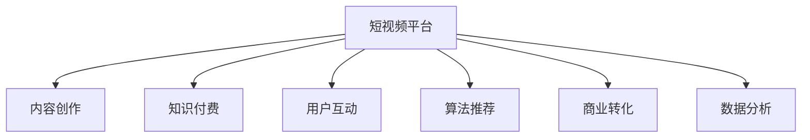

                 

# 如何利用短视频平台进行知识付费营销

> 关键词：短视频平台,知识付费,内容创作,用户互动,算法推荐,商业转化,流量变现,数据分析

## 1. 背景介绍

在互联网高速发展的今天，知识付费已经成为了一种新的趋势。越来越多的人开始通过付费获取知识和信息，而短视频平台，如抖音、快手等，凭借其低门槛、高互动性等特点，成为知识付费的重要战场。短视频平台的兴起，改变了人们的消费习惯，也提供了新的内容变现模式。

短视频平台上的知识付费，不仅包括传统的视频课程，还涵盖了各种形式的付费内容，如直播问答、会员专享、课程订阅等。通过短视频平台进行知识付费营销，可以有效地提高内容的曝光度和吸引力，实现从内容创作到流量变现的全链条闭环。

### 1.1 视频内容的价值

视频作为一种直观、生动的表现形式，能够更好地吸引用户的注意力，激发其学习兴趣。相较于文字、图片等传统内容形式，视频内容具有更高的互动性和感染力。用户可以通过观看短视频，快速获取知识和信息，从而在知识付费中找到更多价值。

### 1.2 用户互动的增强

短视频平台的强互动性，使得知识付费者能够更直接地与用户进行互动，了解用户需求，提供个性化服务。通过评论、点赞、分享等互动方式，知识付费者能够更好地与用户建立连接，提升用户粘性和满意度。

### 1.3 商业转化的多样化

短视频平台的商业转化方式多样，不仅可以通过直接付费观看或购买课程，还可以通过会员制、广告分成、商品销售等多种方式进行变现。这种多样化的变现方式，能够满足不同用户群体的需求，提高平台的整体收益。

### 1.4 数据分析的便利性

短视频平台提供了强大的数据分析工具，知识付费者可以根据用户行为数据，如观看时长、点赞数量、互动评论等，分析用户偏好，优化课程内容和营销策略，提高用户转化率。

## 2. 核心概念与联系

### 2.1 核心概念概述

要有效利用短视频平台进行知识付费营销，首先需要理解以下几个核心概念：

- **短视频平台**：以抖音、快手为代表的短视频平台，拥有庞大的用户群体和丰富的内容生态。通过短视频平台进行知识付费营销，可以借助平台的流量和用户基础，实现内容的快速传播和变现。
- **知识付费**：通过购买或订阅形式，获取知识或信息，包括视频课程、直播问答、会员专享等。知识付费不仅能够满足用户的学习需求，还为创作者提供了新的盈利模式。
- **内容创作**：知识付费内容的制作，包括视频的拍摄、剪辑、编辑、配音等。高质量的视频内容，是吸引用户付费的重要保障。
- **用户互动**：通过评论、点赞、分享等方式，与用户进行互动，了解用户需求，提升用户粘性。互动是提高用户转化率的重要手段。
- **算法推荐**：短视频平台通常采用推荐算法，根据用户行为数据，为用户推荐相关内容。合理利用平台推荐算法，可以提高内容的曝光率和用户覆盖面。
- **商业转化**：通过各种变现方式，如课程销售、会员收费、广告分成等，实现内容的商业价值转化。
- **数据分析**：利用平台提供的数据分析工具，监控和分析用户行为数据，优化内容和营销策略。

### 2.2 核心概念原理和架构的 Mermaid 流程图(Mermaid 流程节点中不要有括号、逗号等特殊字符)



这个流程图展示了短视频平台知识付费营销的各个环节及其相互关系。内容创作是基础，用户互动和算法推荐提高了用户粘性和曝光率，商业转化实现了内容的商业价值，数据分析为优化内容和策略提供了依据。

## 3. 核心算法原理 & 具体操作步骤

### 3.1 算法原理概述

短视频平台上的知识付费营销，主要依赖于以下几个关键算法：

- **推荐算法**：通过用户行为数据（如观看时长、点赞数量、评论内容等），对用户进行精准画像，为用户推荐相关内容。推荐算法通常基于协同过滤、内容相似度、深度学习等技术实现。
- **个性化推荐**：根据用户的历史行为数据，动态调整推荐内容，提升用户满意度和转化率。个性化推荐算法通常基于用户画像和兴趣模型。
- **广告投放算法**：通过精准定位，将广告投放给最有可能转化为付费用户的目标群体。广告投放算法通常基于机器学习、深度学习等技术实现。
- **流量分配算法**：根据平台流量分布情况，合理分配各个课程的展示位，提高课程曝光率和用户转化率。流量分配算法通常基于拍卖算法或协同过滤等技术实现。

### 3.2 算法步骤详解

利用短视频平台进行知识付费营销的主要步骤包括：

1. **内容创作**：制作高质量的视频内容，包括视频的拍摄、剪辑、配音等。内容创作是吸引用户付费的重要保障。

2. **用户互动**：通过评论、点赞、分享等方式，与用户进行互动，了解用户需求，提升用户粘性。互动是提高用户转化率的重要手段。

3. **算法推荐**：利用平台推荐算法，提高内容的曝光率和用户覆盖面。合理利用平台推荐算法，可以最大化内容的价值。

4. **商业转化**：通过各种变现方式，如课程销售、会员收费、广告分成等，实现内容的商业价值转化。

5. **数据分析**：利用平台提供的数据分析工具，监控和分析用户行为数据，优化内容和营销策略。

### 3.3 算法优缺点

利用短视频平台进行知识付费营销的算法，具有以下优点：

- **曝光率高**：短视频平台的高曝光率，使得知识付费内容能够快速传播，吸引更多用户的注意。
- **用户粘性强**：通过互动和推荐算法，提高用户粘性，增加用户转化率。
- **变现模式多样**：通过多样化的变现方式，满足不同用户群体的需求，提高平台的整体收益。

同时，这种算法也存在一些缺点：

- **内容质量要求高**：短视频平台用户对内容质量要求较高，低质量内容难以吸引用户付费。
- **依赖平台推荐**：过度依赖平台推荐算法，可能导致用户错失优质内容。
- **竞争激烈**：短视频平台竞争激烈，内容创作者需要不断创新，才能保持竞争力。

### 3.4 算法应用领域

短视频平台上的知识付费营销，主要应用于以下几个领域：

- **视频课程**：通过短视频平台，推广各类视频课程，包括编程、金融、医学、心理学等专业课程。
- **直播互动**：通过直播形式，进行实时互动，提供一对一咨询服务，满足用户需求。
- **会员专享**：通过会员制，提供专属内容，如会员专属视频、课程优惠等。
- **广告分成**：通过平台广告系统，进行精准广告投放，实现收益变现。
- **商品销售**：通过短视频平台，推广各类商品，实现商品销售。

## 4. 数学模型和公式 & 详细讲解 & 举例说明

### 4.1 数学模型构建

假设短视频平台上有 $N$ 个用户，每个用户有 $m$ 个行为特征 $x_i=(x_{i1},x_{i2},\dots,x_{im})$，每个用户希望获得的视频内容集合为 $C$。

推荐系统的目标是最小化每个用户未被满足的需求 $D_i$，即：

$$
\min \sum_{i=1}^{N} D_i
$$

其中 $D_i$ 为第 $i$ 个用户未被满足的需求，定义为：

$$
D_i = \sum_{c \in C} p_i(c) \cdot (1 - I(y_i=c))
$$

其中 $p_i(c)$ 为第 $i$ 个用户对内容 $c$ 的兴趣概率，$I(y_i=c)$ 为 $i$ 用户是否选择内容 $c$ 的指示变量。

### 4.2 公式推导过程

通过用户行为数据，计算每个用户对每个内容的兴趣概率 $p_i(c)$，可以采用如下公式：

$$
p_i(c) = \frac{f_i(c)}{\sum_{c \in C} f_i(c)}
$$

其中 $f_i(c)$ 为第 $i$ 个用户对内容 $c$ 的兴趣函数，可以采用协同过滤、内容相似度、深度学习等方法计算。

在得到用户对内容的兴趣概率 $p_i(c)$ 后，可以计算每个用户的未被满足的需求 $D_i$：

$$
D_i = \sum_{c \in C} p_i(c) \cdot (1 - I(y_i=c))
$$

其中 $I(y_i=c)$ 为 $i$ 用户是否选择内容 $c$ 的指示变量，可以采用如下公式：

$$
I(y_i=c) = \begin{cases}
1, & \text{如果用户 $i$ 选择了内容 $c$} \\
0, & \text{如果用户 $i$ 未选择内容 $c$}
\end{cases}
$$

### 4.3 案例分析与讲解

以抖音平台为例，用户小明喜欢看编程类视频。通过推荐算法，抖音平台可以为其推荐相关的编程课程和讲座。推荐算法首先分析小明的历史行为数据，如观看时长、点赞数量、评论内容等，计算出小明对编程类视频的兴趣概率，然后根据兴趣概率排序，为用户小明推荐最相关的视频内容。

## 5. 项目实践：代码实例和详细解释说明

### 5.1 开发环境搭建

在进行短视频平台知识付费营销的开发时，需要使用以下工具：

- Python：用于编写算法和数据分析代码。
- SQL：用于存储和管理用户行为数据。
- MongoDB：用于存储和管理视频内容数据。
- Redis：用于缓存用户行为数据，提高查询效率。
- Flask：用于搭建Web服务，提供API接口。

### 5.2 源代码详细实现

以下是一个简单的推荐算法代码实现：

```python
import pandas as pd
import numpy as np
from sklearn.feature_extraction.text import CountVectorizer
from sklearn.metrics.pairwise import cosine_similarity

# 加载用户行为数据
user_behaviors = pd.read_csv('user_behaviors.csv')

# 加载视频内容数据
videos = pd.read_csv('videos.csv')

# 计算用户对每个内容的兴趣概率
def calculate_interest_probabilities(user_data, video_data):
    user_ids = user_data['user_id']
    video_ids = video_data['video_id']
    watch_times = user_data['watch_time']
    interest_probabilities = {}
    for user_id in user_ids:
        watch_times_sum = watch_times[user_id].sum()
        for video_id in video_ids:
            if video_id in watch_times[user_id].index:
                watch_time = watch_times[user_id][video_id]
                interest_probabilities[video_id] = watch_time / watch_times_sum
    return interest_probabilities

# 计算用户未被满足的需求
def calculate_unsatisfied_needs(interest_probabilities, video_data):
    unsatisfied_needs = {}
    for user_id in interest_probabilities.keys():
        video_ids = video_data['video_id']
        video_ids = video_ids[video_ids.isin(video_data['video_id'])]
        watched_video_ids = interest_probabilities[video_id].index.tolist()
        watched_video_ids = [id for id in watched_video_ids if id in video_ids]
        unsatisfied_needs[user_id] = sum(interest_probabilities[video_id] for video_id in video_ids if video_id not in watched_video_ids)
    return unsatisfied_needs

# 计算每个视频内容的推荐概率
def calculate_video_recommendation_probs(unsatisfied_needs, video_data):
    watched_video_ids = []
    for video_id in video_data['video_id']:
        if video_id in unsatisfied_needs:
            watched_video_ids.append(video_id)
    video_recommendation_probs = {}
    for video_id in watched_video_ids:
        video_recommendation_probs[video_id] = 0
    for user_id in unsatisfied_needs:
        for video_id in video_data['video_id']:
            if video_id in unsatisfied_needs[user_id]:
                video_recommendation_probs[video_id] += 1 / len(video_data['video_id'])
    for video_id in video_recommendation_probs:
        video_recommendation_probs[video_id] /= len(video_data['video_id'])
    return video_recommendation_probs

# 主函数
if __name__ == '__main__':
    user_data = pd.read_csv('user_data.csv')
    video_data = pd.read_csv('video_data.csv')
    interest_probabilities = calculate_interest_probabilities(user_data, video_data)
    unsatisfied_needs = calculate_unsatisfied_needs(interest_probabilities, video_data)
    video_recommendation_probs = calculate_video_recommendation_probs(unsatisfied_needs, video_data)
    print(video_recommendation_probs)
```

### 5.3 代码解读与分析

上述代码实现了用户兴趣概率的计算和视频内容的推荐。具体步骤如下：

1. 加载用户行为数据和视频内容数据。
2. 计算每个用户对每个内容的兴趣概率。
3. 计算每个用户的未被满足的需求。
4. 计算每个视频内容的推荐概率。

通过推荐算法，用户可以更精准地获取感兴趣的内容，提高了用户粘性和转化率。

## 6. 实际应用场景

### 6.1 视频课程推广

视频课程在短视频平台上有着广泛的应用。例如，某编程培训机构可以在抖音平台上推广其Python课程。通过分析用户的历史行为数据，平台可以为每个用户推荐最相关的编程课程，提高课程的曝光率和用户转化率。

### 6.2 直播互动

直播互动也是短视频平台上知识付费的重要形式。某心理咨询机构可以在抖音上开展直播问答活动，通过互动了解用户需求，提供个性化咨询服务。直播互动不仅能够提高用户粘性，还能增加用户转化率。

### 6.3 会员专享

会员专享是短视频平台上知识付费的另一种形式。某摄影培训机构可以推出会员专享课程，包括高级摄影技巧、摄影作品鉴赏等。会员可以享受专属课程和优惠，提高用户满意度和粘性。

### 6.4 广告投放

短视频平台上的广告投放，也可以作为知识付费的一种形式。某英语培训机构可以在抖音上进行精准广告投放，通过广告增加课程曝光率，吸引更多用户报名参加课程。

### 6.5 商品销售

短视频平台上的商品销售，也是知识付费的一种形式。某书籍出版社可以在抖音上进行书籍销售推广，通过视频介绍书籍内容，吸引用户购买。

## 7. 工具和资源推荐

### 7.1 学习资源推荐

为了帮助开发者系统掌握短视频平台知识付费营销的理论基础和实践技巧，这里推荐一些优质的学习资源：

1. **《短视频平台知识付费营销实战指南》**：详细介绍短视频平台知识付费的营销策略和落地实践，涵盖视频创作、用户互动、推荐算法等多个环节。
2. **《抖音营销手册》**：由抖音官方发布的营销手册，详细讲解抖音平台的运营策略和广告投放技巧，帮助开发者更好地在抖音平台上推广内容。
3. **《短视频内容创作教程》**：提供短视频制作的高质量教程，涵盖拍摄、剪辑、配音等多个环节，帮助创作者制作优质视频内容。
4. **《深度学习与推荐系统》**：介绍推荐系统的基本原理和算法实现，涵盖协同过滤、内容相似度、深度学习等方法，帮助开发者理解推荐算法的工作机制。
5. **《短视频平台数据分析》**：详细介绍短视频平台的数据分析和用户行为分析工具，帮助开发者通过数据分析优化内容和营销策略。

### 7.2 开发工具推荐

为了提高短视频平台知识付费营销的开发效率，以下是几款推荐的开发工具：

1. **Python**：Python语言简单易学，功能强大，是进行数据分析和算法实现的首选语言。
2. **SQL**：SQL语言用于存储和管理用户行为数据，是数据管理的必备工具。
3. **MongoDB**：MongoDB是一款流行的NoSQL数据库，用于存储和管理视频内容数据，具有高效的读写性能。
4. **Redis**：Redis是一款内存数据库，用于缓存用户行为数据，提高查询效率。
5. **Flask**：Flask是一款轻量级的Web框架，用于搭建API接口，方便开发者进行服务部署和调用。

### 7.3 相关论文推荐

短视频平台上的知识付费营销，涉及推荐系统、数据挖掘、自然语言处理等多个领域，以下是几篇相关的经典论文：

1. **《YouTube推荐系统》**：介绍YouTube推荐系统的算法实现，包括协同过滤、深度学习等方法。
2. **《Netflix推荐系统》**：介绍Netflix推荐系统的算法实现，包括协同过滤、矩阵分解等方法。
3. **《Kaggle推荐系统》**：介绍Kaggle推荐系统的算法实现，涵盖协同过滤、内容相似度等方法。
4. **《Instagram推荐系统》**：介绍Instagram推荐系统的算法实现，包括协同过滤、内容相似度等方法。
5. **《抖音推荐系统》**：介绍抖音推荐系统的算法实现，包括协同过滤、深度学习等方法。

这些论文为短视频平台知识付费营销提供了理论基础和实践指南，帮助开发者更好地理解推荐系统的设计和实现。

## 8. 总结：未来发展趋势与挑战

### 8.1 总结

本文详细介绍了如何利用短视频平台进行知识付费营销，涵盖了内容创作、用户互动、推荐算法等多个环节。通过短视频平台进行知识付费营销，可以有效地提高内容的曝光度和吸引力，实现从内容创作到流量变现的全链条闭环。

短视频平台上的知识付费营销，不仅能够满足用户的学习需求，还为创作者提供了新的盈利模式，有助于加速知识付费的普及和应用。

### 8.2 未来发展趋势

展望未来，短视频平台知识付费营销将呈现以下几个发展趋势：

1. **内容质量提升**：随着短视频平台用户对内容质量要求的提高，高质量视频内容的创作将成为主要内容。创作者需要通过不断创新，提升视频制作水平，满足用户需求。
2. **个性化推荐加强**：通过更精准的推荐算法，提升用户粘性和转化率。推荐算法将更加智能化，基于用户行为数据和兴趣模型进行动态调整。
3. **商业转化多样化**：通过多样化的变现方式，满足不同用户群体的需求，提高平台的整体收益。除了课程销售和广告分成，还将探索更多商业转化模式。
4. **数据分析深入化**：通过深度数据分析，优化内容和营销策略，提高用户转化率。数据分析工具将更加智能化，提供更全面、更准确的用户行为分析。

### 8.3 面临的挑战

尽管短视频平台知识付费营销具有广阔前景，但在实践中仍面临以下挑战：

1. **内容质量要求高**：短视频平台用户对内容质量要求较高，低质量内容难以吸引用户付费。创作者需要通过不断创新，提升视频制作水平。
2. **平台推荐依赖**：过度依赖平台推荐算法，可能导致用户错失优质内容。创作者需要通过多种渠道进行推广，提高曝光率。
3. **用户粘性不足**：短视频平台用户粘性不足，用户流失率高。创作者需要通过互动和多样化内容，提高用户粘性。
4. **数据隐私问题**：短视频平台需要收集和分析用户数据，数据隐私和安全问题值得关注。创作者需要保护用户隐私，遵守相关法律法规。

### 8.4 研究展望

面对短视频平台知识付费营销面临的挑战，未来的研究需要在以下几个方面寻求新的突破：

1. **内容创新**：创作者需要通过多样化的内容形式，吸引用户付费。除了视频内容，还可以探索图文、音频等多媒体形式的内容创作。
2. **推荐算法优化**：通过更精准的推荐算法，提升用户粘性和转化率。推荐算法需要结合用户画像和兴趣模型，进行动态调整。
3. **商业转化优化**：通过多样化的变现方式，满足不同用户群体的需求。除了课程销售和广告分成，还将探索更多商业转化模式，如商品销售、会员制等。
4. **数据分析应用**：通过深度数据分析，优化内容和营销策略，提高用户转化率。数据分析工具需要更加智能化，提供更全面、更准确的用户行为分析。
5. **用户粘性提升**：通过互动和多样化内容，提高用户粘性。创作者需要通过直播互动、会员专享等多种形式，提升用户满意度。
6. **数据隐私保护**：短视频平台需要保护用户隐私，遵守相关法律法规。创作者需要合理利用用户数据，保护用户隐私。

这些研究方向的探索，将引领短视频平台知识付费营销走向更高的台阶，为知识付费的普及和应用提供新的动力。

## 9. 附录：常见问题与解答

**Q1：如何选择合适的短视频平台进行知识付费营销？**

A: 选择合适的短视频平台进行知识付费营销，需要考虑以下因素：
1. 平台用户基础：选择用户基础大、活跃度高的平台，可以最大程度地覆盖目标用户群体。
2. 平台算法推荐：选择推荐算法精准、效果好的平台，可以提升内容的曝光率和用户转化率。
3. 平台流量变现方式：选择流量变现方式多样、收益稳定的平台，可以实现更高的商业转化率。

**Q2：如何提高短视频内容的曝光率？**

A: 提高短视频内容的曝光率，可以通过以下方法：
1. 优化视频标题和描述：吸引用户的注意力，提高点击率。
2. 利用热门标签和挑战：通过热门标签和挑战，提高内容的曝光率。
3. 与热门博主合作：与热门博主合作，借助其影响力提升内容曝光。
4. 互动和推广：通过评论、点赞、分享等方式，增加内容的曝光率。

**Q3：如何进行精准的用户推荐？**

A: 进行精准的用户推荐，可以通过以下方法：
1. 用户画像：通过用户行为数据，建立详细的用户画像，了解用户需求和兴趣。
2. 兴趣模型：基于用户画像和历史行为数据，构建兴趣模型，动态调整推荐内容。
3. 推荐算法：采用协同过滤、内容相似度、深度学习等推荐算法，提升推荐精度。
4. 数据监控：通过监控和分析推荐效果，优化推荐算法和策略。

**Q4：如何进行有效的用户互动？**

A: 进行有效的用户互动，可以通过以下方法：
1. 回复评论和私信：及时回复用户的评论和私信，增加用户粘性。
2. 直播互动：通过直播互动，与用户进行实时交流，了解用户需求和反馈。
3. 调查问卷：通过调查问卷，收集用户意见和建议，优化内容和营销策略。
4. 用户反馈：通过用户反馈，了解用户需求和改进方向，提升用户体验。

**Q5：如何进行数据分析和优化？**

A: 进行数据分析和优化，可以通过以下方法：
1. 用户行为分析：通过分析用户行为数据，了解用户需求和行为特征。
2. 内容质量评估：通过分析视频质量和用户反馈，评估内容质量。
3. 营销策略优化：通过分析用户转化率，优化营销策略，提高用户转化率。
4. 数据可视化：通过数据可视化工具，呈现用户行为和内容质量，提供决策依据。

通过这些方法和工具，可以有效地进行短视频平台知识付费营销，实现从内容创作到流量变现的全链条闭环，提高用户粘性和转化率，推动知识付费的普及和应用。

---

作者：禅与计算机程序设计艺术 / Zen and the Art of Computer Programming

