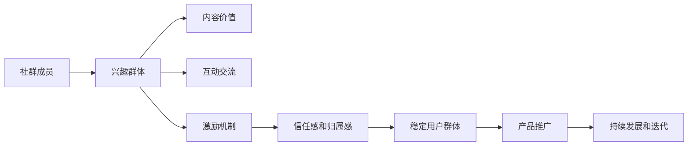

                 

## 1. 背景介绍

### 1.1 问题由来
在当前信息爆炸的时代，知识和信息无处不在，然而高价值、高质量的精准内容却显得愈发稀缺。知识付费产品作为一种新兴的商业模式，通过将专业、深度、系统的知识内容产品化，为寻求快速获取知识的职场人士和终身学习者提供了新的选择。

然而，如何有效推广这些知识付费产品，使其被广大用户认知和接受，成为了知识付费平台的一大挑战。传统广告、推广活动虽然有效，但成本高昂且效果难以持久。社群营销作为一种低成本、高互动性的推广方式，近年来在知识付费领域中崭露头角。本文旨在探讨如何利用社群营销来推广知识付费产品，帮助平台和用户共同成长。

### 1.2 问题核心关键点
社群营销是一种通过建立线上或线下的兴趣群体，以用户自发互动和推荐为主要传播方式，从而达到产品推广目的的营销手段。其主要特点包括：

- **低成本高互动**：用户自愿参与，自发传播，极大地降低了推广成本，同时增强了用户黏性和互动性。
- **精准目标受众**：社群成员往往具有相似的知识兴趣和需求，目标定位精准，推广效果显著。
- **可信度高**：用户基于社群内部推荐信任度更高，减少用户决策过程中的犹豫和不确定性。

本节将详细介绍社群营销的基本概念和核心要素，并通过一个具体的案例分析，展示社群营销如何高效地推广知识付费产品。

## 2. 核心概念与联系

### 2.1 核心概念概述
社群营销（Community Marketing）是指通过建立和管理兴趣群体，实现产品或服务的高效推广。其核心要素包括：

- **兴趣群体**：基于共同兴趣和需求，形成稳定活跃的社群。
- **内容价值**：提供有价值、有深度的内容，满足社群成员的知识需求。
- **互动交流**：促进成员之间的互动和交流，增强社群粘性。
- **激励机制**：通过奖励、积分、排名等方式，激励成员积极参与社群活动。

社群营销的本质是通过内容价值和互动机制，逐步建立社群成员的信任感和归属感，形成稳定的用户群体。这种模式不仅降低了推广成本，还能提高用户的参与度和满意度。

### 2.2 核心概念原理和架构的 Mermaid 流程图



通过上述流程，可以清晰地看到社群营销如何通过内容价值、互动交流和激励机制，逐步构建社群成员的信任感和归属感，形成稳定的用户群体，进而实现产品推广的目标。

## 3. 核心算法原理 & 具体操作步骤
### 3.1 算法原理概述

社群营销的算法原理主要基于以下几个方面：

- **用户行为分析**：通过分析社群成员的行为数据，如参与度、活跃度、购买行为等，优化内容推荐和互动策略。
- **内容推荐系统**：根据用户的兴趣和需求，推荐有价值的相关内容，增强用户体验。
- **激励机制设计**：设计合理的激励机制，如积分、排名、徽章等，鼓励用户积极参与社群活动。

### 3.2 算法步骤详解

以下是社群营销推广知识付费产品的具体操作步骤：

#### 第一步：目标社群定位
1. **市场调研**：分析目标市场和用户需求，确定目标社群的基本特征，如年龄、职业、兴趣等。
2. **用户画像**：通过问卷调查、数据分析等方式，进一步细化目标社群的用户画像，为后续内容设计和互动策略提供依据。

#### 第二步：内容设计
1. **知识内容制作**：根据目标社群的兴趣和需求，设计制作有价值、有深度的知识内容，如视频课程、音频讲座、电子书等。
2. **内容发布计划**：制定内容发布计划，合理安排内容的发布节奏和频率，确保内容持续输出。

#### 第三步：社群建设与管理
1. **社群平台选择**：选择合适的社群平台，如微信群、QQ群、知乎、微博等，根据目标社群的特点和需求，选择适合的线上或线下社群形式。
2. **社群管理**：建立社群规则，设立管理员团队，保证社群的有序管理和互动质量。

#### 第四步：互动策略设计
1. **内容互动**：通过讨论区、问答环节等方式，促进社群成员之间的互动和交流，增强内容的价值和深度。
2. **激励机制设计**：设计合理的激励机制，如积分、排名、徽章等，激励用户积极参与社群活动。

#### 第五步：效果评估与迭代
1. **效果评估**：通过数据分析和用户反馈，评估社群营销的效果，找出问题和不足。
2. **迭代优化**：根据评估结果，优化社群内容、互动策略和激励机制，持续提升社群营销的效果。

### 3.3 算法优缺点

社群营销推广知识付费产品的优点：

- **成本低、效果显著**：用户自愿参与，自发传播，极大地降低了推广成本，同时增强了用户黏性和互动性。
- **精准目标受众**：社群成员往往具有相似的知识兴趣和需求，目标定位精准，推广效果显著。
- **可信度高**：用户基于社群内部推荐信任度更高，减少用户决策过程中的犹豫和不确定性。

社群营销的缺点：

- **需要持续维护**：社群营销需要持续投入时间和精力进行内容创作和社群管理，短期内难以见效。
- **管理难度大**：社群成员数量和背景复杂，管理和维护难度较大，需要建立有效的规则和机制。

### 3.4 算法应用领域

社群营销在知识付费领域的应用非常广泛，具体如下：

- **课程推广**：通过社群营销，快速提升课程的曝光率和销售量，吸引新学员加入。
- **品牌建设**：利用社群影响力，树立品牌形象，增强品牌认知度和美誉度。
- **社区活动**：组织线上或线下的社区活动，如公开课、讲座、线下交流等，增强用户参与感和归属感。
- **用户反馈**：通过社群成员的反馈，优化产品和服务，提升用户体验和满意度。

## 4. 数学模型和公式 & 详细讲解 & 举例说明

### 4.1 数学模型构建

社群营销的数学模型主要基于用户行为分析和内容推荐系统的构建。以下是具体的数学模型构建过程：

#### 用户行为分析模型
用户行为分析模型主要通过统计分析用户的参与度、活跃度和购买行为等数据，构建用户画像，为内容推荐和互动策略提供依据。模型公式如下：

$$
\text{用户画像} = f(\text{用户行为数据})
$$

其中，$f$为特征提取和建模函数，根据用户行为数据的不同维度，提取相关特征，建立用户画像。

#### 内容推荐模型
内容推荐模型通过计算用户对不同内容的兴趣度，推荐最有价值的相关内容。模型公式如下：

$$
\text{内容推荐} = \max_i (\text{兴趣度}_i)
$$

其中，$\text{兴趣度}_i$为第$i$个内容的推荐度，可以通过用户行为数据、内容特征、用户画像等多种因素计算得出。

### 4.2 公式推导过程

#### 用户行为分析
用户行为分析模型的推导过程如下：

1. **数据采集**：采集用户的参与度、活跃度和购买行为等数据。
2. **特征提取**：根据不同的用户行为数据，提取相关特征，如观看时长、阅读量、互动次数等。
3. **用户画像建立**：通过统计分析，建立用户画像，描述用户的基本特征和行为偏好。

具体数学公式如下：

$$
\text{用户画像} = \begin{cases}
\text{年龄} & \text{年龄特征} \\
\text{职业} & \text{职业特征} \\
\text{兴趣} & \text{兴趣特征} \\
\text{活跃度} & \text{活跃度特征} \\
\text{购买行为} & \text{购买行为特征}
\end{cases}
$$

#### 内容推荐
内容推荐模型的推导过程如下：

1. **内容特征提取**：对每个内容提取相关特征，如标题、摘要、关键词等。
2. **用户兴趣计算**：计算用户对不同内容的兴趣度，可以通过用户画像、用户行为数据等计算得出。
3. **内容推荐**：根据用户兴趣度，推荐最有价值的相关内容。

具体数学公式如下：

$$
\text{兴趣度}_i = \text{用户画像} \times \text{内容特征}_i
$$

$$
\text{内容推荐} = \max_i (\text{兴趣度}_i)
$$

### 4.3 案例分析与讲解

以某知识付费平台的“编程课程推广”为例，分析社群营销的效果。

1. **目标社群定位**：平台分析市场调研数据，确定目标社群为“编程初学者”，用户画像为：年龄在18-30岁之间，具备基础计算机知识，对编程有浓厚兴趣，但缺乏系统学习路径。
2. **内容设计**：平台根据用户画像，设计制作“Python入门教程”视频课程，并制定发布计划，每周推出一集新课程。
3. **社群建设与管理**：平台在微信群中建立社群，设立管理员团队，制定社群规则，吸引“编程初学者”加入。
4. **互动策略设计**：每周在社群中组织“编程难题解答”活动，邀请资深程序员在线解答学员疑问，并通过积分、排名等方式激励用户积极参与。
5. **效果评估与迭代**：通过数据分析，评估社群营销的效果，发现学员参与度显著提升，课程报名量翻倍。根据学员反馈，优化课程内容和互动策略，进一步提升效果。

## 5. 项目实践：代码实例和详细解释说明

### 5.1 开发环境搭建

在社群营销的实践中，需要搭建一个完整的开发环境，以下是具体的搭建步骤：

1. **服务器选择**：选择一台高性能的服务器，支持社群平台的运行。
2. **数据库搭建**：搭建关系型数据库，用于存储社群成员信息、互动记录、内容数据等。
3. **开发工具选择**：选择适合的开发工具，如Python、Node.js等，用于社群平台的开发和维护。
4. **测试环境搭建**：搭建测试环境，用于测试社群平台的功能和性能。

### 5.2 源代码详细实现

以下是一个简单的社群平台开发实例，包括内容发布、互动管理和激励机制等功能的实现：

```python
from flask import Flask, request, jsonify

app = Flask(__name__)

# 定义内容发布函数
@app.route('/content/publish', methods=['POST'])
def publish_content():
    data = request.get_json()
    content_id = data['id']
    author = data['author']
    title = data['title']
    description = data['description']
    # 内容发布逻辑
    # ...

# 定义互动管理函数
@app.route('/interaction', methods=['POST'])
def manage_interaction():
    data = request.get_json()
    content_id = data['content_id']
    user_id = data['user_id']
    action = data['action']
    # 互动管理逻辑
    # ...

# 定义激励机制函数
@app.route('/incentive', methods=['POST'])
def incentive():
    data = request.get_json()
    user_id = data['user_id']
    # 激励机制逻辑
    # ...

if __name__ == '__main__':
    app.run(debug=True)
```

### 5.3 代码解读与分析

在上述代码中，主要实现了内容发布、互动管理和激励机制三个核心功能：

1. **内容发布函数**：接受用户提交的内容数据，包括内容ID、作者、标题、描述等，实现内容的发布逻辑。
2. **互动管理函数**：接受用户提交的互动数据，包括内容ID、用户ID、互动类型等，实现互动管理逻辑。
3. **激励机制函数**：接受用户提交的激励数据，包括用户ID等，实现激励机制逻辑。

### 5.4 运行结果展示

在开发完成后，可以在本地运行上述代码，并模拟社群平台的互动过程。通过数据分析工具，可以实时监控用户的行为数据，评估社群营销的效果，并进行迭代优化。

## 6. 实际应用场景

### 6.4 未来应用展望

社群营销在知识付费领域有着广阔的应用前景，未来有望在以下方面进一步发展：

1. **多渠道推广**：结合线上线下多种渠道，提升推广效果，扩大社群覆盖面。
2. **个性化推荐**：通过深度学习等技术，实现更加精准的内容推荐，提升用户满意度和参与度。
3. **智能互动**：引入AI技术，实现智能聊天机器人、内容生成等智能互动功能，提升社群互动质量。
4. **跨平台整合**：将社群平台与其他社交平台、学习平台等整合，实现数据互通，提升用户覆盖面。

## 7. 工具和资源推荐

### 7.1 学习资源推荐

为了帮助开发者系统掌握社群营销的理论基础和实践技巧，这里推荐一些优质的学习资源：

1. **《社群营销：构建品牌影响力》**：详细介绍了社群营销的基本概念和操作步骤，结合实际案例进行讲解，帮助读者全面理解社群营销的精髓。
2. **《社交媒体营销实战》**：讲解社交媒体营销的策略和技巧，结合社群营销的内容，提供全面的营销解决方案。
3. **《用户行为分析》**：深入浅出地介绍了用户行为分析的基本原理和数学模型，帮助开发者构建用户画像和内容推荐系统。
4. **《机器学习与数据挖掘》**：结合数据挖掘技术，讲解内容推荐系统的实现方法，提供丰富的实际案例和代码示例。

### 7.2 开发工具推荐

在社群营销的开发实践中，选择合适的工具可以大大提升开发效率。以下是几款常用的开发工具：

1. **Flask**：轻量级的Python Web框架，简单易用，适合构建社群平台的API接口。
2. **MongoDB**：开源的文档型数据库，适合存储社群成员信息、互动记录等。
3. **MySQL**：关系型数据库，适合存储内容数据等结构化数据。
4. **Elasticsearch**：基于Lucene的开源搜索引擎，适合存储和搜索大量非结构化数据。

### 7.3 相关论文推荐

社群营销的深入研究，离不开学界和业界的不断探索。以下是几篇经典的相关论文，推荐阅读：

1. **《User-Generated Content and Social Media: Conceptualizing and Researching Online Communities》**：详细介绍了用户生成内容与社交媒体在社群营销中的应用，提供了丰富的理论框架和实际案例。
2. **《Community Building and Engagement in Online Learning Communities》**：讨论了在线学习社区的建设和管理策略，结合社群营销的方法，提供了实用的社群管理建议。
3. **《Content Recommendation in Online Communities》**：讲解了内容推荐系统的基本原理和实现方法，结合社群营销的内容推荐需求，提供了丰富的算法和模型。
4. **《Incentive Design in Online Communities》**：讨论了在线社区中的激励机制设计，结合社群营销的用户激励策略，提供了详细的激励机制设计和评估方法。

## 8. 总结：未来发展趋势与挑战

### 8.1 总结

本文详细探讨了如何利用社群营销来推广知识付费产品，从基本概念到具体操作步骤，再到具体实现，全面展示了社群营销在知识付费领域的应用潜力。通过案例分析和代码实现，帮助读者深入理解社群营销的精髓。

社群营销不仅降低了推广成本，还能有效提升用户黏性和互动性，有助于形成稳定的用户群体，快速提升产品曝光率和销售量。未来，随着技术的不断进步和市场需求的日益增长，社群营销必将在知识付费领域大放异彩。

### 8.2 未来发展趋势

社群营销在知识付费领域的应用前景广阔，未来有望在以下几个方面进一步发展：

1. **技术创新**：引入AI、大数据等技术，提升内容推荐和互动管理的效果，增强用户体验和满意度。
2. **多渠道整合**：将社群营销与社交媒体、学习平台等整合，实现数据互通，提升用户覆盖面。
3. **跨领域应用**：将社群营销应用于更多行业领域，如医疗、教育、旅游等，提供多维度的营销解决方案。
4. **新模式探索**：探索社群营销与其他新兴模式（如Web3.0、NFT等）的结合，提供更加丰富多样的营销手段。

### 8.3 面临的挑战

尽管社群营销在知识付费领域展现出巨大的潜力，但在实际应用中仍面临诸多挑战：

1. **用户管理难度**：社群成员数量和背景复杂，管理和维护难度较大，需要建立有效的规则和机制。
2. **内容质量保障**：社群内容质量参差不齐，需要定期审核和筛选，确保内容的高价值和高质量。
3. **用户行为预测**：社群成员的行为预测较为困难，需要结合多种数据和算法，实现精准的内容推荐和互动管理。
4. **激励机制设计**：激励机制设计不当，容易导致用户参与度下降，影响社群的活跃度。
5. **隐私和安全问题**：社群平台需要确保用户数据的隐私和安全，避免数据泄露和滥用。

### 8.4 研究展望

面对社群营销所面临的挑战，未来的研究需要在以下几个方面寻求新的突破：

1. **数据挖掘与算法优化**：利用大数据和深度学习等技术，提升用户行为分析和内容推荐的精度，增强社群营销的效果。
2. **智能互动与个性化推荐**：引入智能聊天机器人和个性化推荐系统，提升用户互动质量和满意度。
3. **激励机制设计**：设计更加公平、合理的激励机制，增强用户的参与度和忠诚度。
4. **隐私与安全保障**：加强用户数据隐私保护和安全防护，构建可信、安全的社群平台。

## 9. 附录：常见问题与解答

**Q1: 社群营销适用于哪些知识付费产品？**

A: 社群营销适用于知识深度、结构性较强的产品，如视频课程、电子书、在线讲座等，用户对内容有较高的期待和需求，适合通过社群形式进行推广。

**Q2: 如何选择合适的社群平台？**

A: 选择合适的社群平台需要考虑目标社群的特点和需求，如年轻人偏好微信、QQ等社交平台，专业人士喜欢LinkedIn等专业平台。选择适合的社群平台，可以更好地吸引目标用户。

**Q3: 如何设计合理的激励机制？**

A: 设计合理的激励机制需要考虑用户心理和社群特点，如积分、排名、徽章等。激励机制的合理设计可以增强用户参与度和忠诚度，提升社群营销的效果。

**Q4: 社群营销是否需要持续维护？**

A: 社群营销需要持续维护，不断更新和优化社群内容、互动策略和激励机制，才能保持社群的活跃度和用户黏性。

**Q5: 社群营销在推广初期需要注意哪些问题？**

A: 社群营销在推广初期需要注意的问题包括：1)明确社群定位和目标用户，2)精心设计社群内容和互动策略，3)积极引入核心成员和管理团队，4)定期评估社群营销效果，及时优化策略。

总之，社群营销作为一种低成本、高互动性的推广方式，在知识付费领域有着广阔的应用前景。通过合理的设计和实施，社群营销可以有效提升知识付费产品的曝光率和销售量，帮助平台和用户共同成长。

