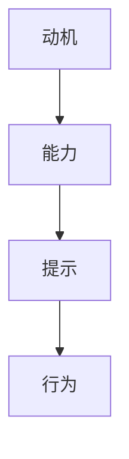

                 

# 如何利用福格模型提高团队效率

> 关键词：福格模型,行为心理学,目标设定,团队管理,行为改变,效率提升,动机驱动

## 1. 背景介绍

### 1.1 问题由来

在当今这个快速变化、充满竞争的工作环境中，提升团队效率和生产力成为了企业管理者最迫切的需求之一。然而，提高效率并非易事，团队成员的工作动力和参与度常常受到诸多因素的影响。为此，行为心理学家B.J.福格（B.J. Fogg）提出了一种有效的理论模型——福格模型（Fogg Model），旨在通过理解行为心理学原理，帮助组织设计更有效的目标设定和行为干预策略，从而提升团队整体效率。

### 1.2 问题核心关键点

福格模型是行为心理学中一种著名的行为改变模型，主要由三个核心要素构成：动机（ Motivation）、能力（Ability）和提示（Prompts）。只有当动机足够强、能力足够高且得到了适当的提示，人们才会采取行动。福格模型的提出，不仅为个人行为改变提供了指导，也为团队效率的提升提供了理论依据和方法。

## 2. 核心概念与联系

### 2.1 核心概念概述

福格模型由行为心理学专家B.J.福格提出，主要包括三个核心要素：动机、能力和提示。模型认为，行为的发生需要同时满足这三个要素。动机是指个人采取某一行为的意愿和期望；能力是个人完成某一行为所需具备的技能、资源和时间等条件；提示是指触发某一行为的物理或环境线索。

- **动机（Motivation）**：内在的愿望或外部的激励，驱动个人采取某项行动的意愿。
- **能力（Ability）**：完成特定任务所需的技能、资源和时间等条件。
- **提示（Prompts）**：外部环境提供的触发行为发生的线索，如时间、地点、通知等。

### 2.2 核心概念原理和架构的 Mermaid 流程图



该流程图展示了福格模型的核心逻辑：动机驱动能力与提示，从而促使行为发生。

## 3. 核心算法原理 & 具体操作步骤

### 3.1 算法原理概述

福格模型的核心在于，通过对动机的管理和能力的优化，利用提示设计合理的行为触发机制，从而高效地引导团队成员实现目标。在团队管理中，我们可以应用福格模型来设定明确、可行的目标，并通过设计适当的提示和反馈机制，激励团队成员持续保持高昂的工作动力。

### 3.2 算法步骤详解

1. **明确团队目标和期望**：根据团队的核心业务目标，设定清晰、可量化的短期和长期目标。目标应具备SMART原则（Specific, Measurable, Achievable, Relevant, Time-bound），确保每个人对期望的结果有明确的认识。

2. **评估团队成员的能力**：识别团队成员的技能、资源和时间约束，确保目标的设定既具有挑战性，又不过于困难。可以使用360度反馈、绩效评估等方式获取成员的自我认知和团队反馈。

3. **设计合理的提示和触发机制**：针对目标和任务，设计具体的提示策略。提示可以是时间安排、邮件通知、任务提醒等，确保在适当的时间、地点和情境下，团队成员能够被有效触发，执行预定行为。

4. **实施和调整**：启动目标达成计划，定期监测进展，根据实际效果和团队反馈，调整目标和提示策略。采用正向激励和即时反馈，保持团队成员的持续动力。

### 3.3 算法优缺点

**优点**：
- **可操作性强**：福格模型简单易懂，操作性强，易于在团队中推广实施。
- **目标明确**：通过明确设定短期和长期目标，确保团队成员知道自己的任务和期望，提高工作焦点。
- **提示设计灵活**：提示设计可以根据实际情况灵活调整，适用于各种任务和场景。

**缺点**：
- **过度依赖提示**：如果提示设计不当，可能导致团队成员过度依赖外部触发，而忽视内在动机和能力的提升。
- **缺乏动态调整**：模型在应用过程中需要不断调整，根据实际情况进行优化，如果调整不及时，可能影响效果。
- **忽视个体差异**：福格模型假设所有团队成员对同一提示的反应相同，但实际上个体差异显著，需要个性化调整。

### 3.4 算法应用领域

福格模型在各种管理场景中都有广泛应用，尤其适合以下领域：

1. **项目管理**：通过设定明确的里程碑和任务提示，提高团队成员的执行力，确保项目按时完成。
2. **销售团队**：设定客户访问目标和跟进计划，通过任务提醒和绩效激励，提升销售业绩。
3. **客户服务**：设定服务响应时间和问题解决目标，通过自动提示和跟进机制，改善客户体验。
4. **软件开发**：设定代码提交频率和代码质量标准，通过代码审核和版本控制提示，提高开发效率和代码质量。
5. **培训和发展**：设定学习和成长目标，通过课程提醒和进度跟踪，提升团队成员的技能水平。

## 4. 数学模型和公式 & 详细讲解 & 举例说明

### 4.1 数学模型构建

福格模型不涉及复杂的数学公式，其核心在于行为心理学原理的运用。模型的应用更多依赖于实践操作和行为分析，而非数学计算。

### 4.2 公式推导过程

由于福格模型的核心不在于数学推导，这里不再详细展开，但可以简单描述一下模型如何通过动机、能力和提示这三个要素来驱动行为发生。

**动机**：通常由内在需求（如成就感、归属感）和外在激励（如奖金、表扬）构成。可以通过调查问卷、访谈等方式评估动机水平。

**能力**：需要结合具体任务，评估团队成员所需具备的技能、资源和时间。可以通过任务分析、绩效评估等方式获取能力评估数据。

**提示**：设计触发行为的提示策略，包括时间、地点、方式等。通过A/B测试等方法，优化提示设计和实施效果。

### 4.3 案例分析与讲解

假设某软件公司希望提升其开发团队的效率，应用福格模型进行如下操作：

1. **明确目标**：团队每月需发布一个新的功能模块，并在上线后一个月内达到50%的用户使用率。

2. **评估能力**：识别团队成员的技术水平、开发工具的熟练度、项目管理的效率等，确定月发布一个功能模块是合理的挑战。

3. **设计提示**：每周二上午9点召开例会，检查项目进度，讨论遇到的问题，并分配具体的任务和提醒。此外，使用即时通讯工具提醒成员检查代码审查，确保代码质量和进度同步。

4. **实施和调整**：在实施过程中，团队发现每周二上午的例会时间安排不合理，导致部分成员迟到。通过调整例会时间，提升会议的参与度和效果，最终实现了目标。

## 5. 项目实践：代码实例和详细解释说明

### 5.1 开发环境搭建

为便于实际操作和演示，这里假设团队已使用JIRA进行项目管理，且已整合了Slack作为即时通讯工具。

1. **安装JIRA**：确保JIRA已经安装并配置好，可以集成到Slack中，方便任务分配和进度跟踪。

2. **整合Slack**：通过JIRA插件，将JIRA任务与Slack集成，确保任务提醒和进度通知可以实时传达给团队成员。

### 5.2 源代码详细实现

以下是福格模型在JIRA和Slack中应用的简单实现示例：

```python
import jira
import slack
import time

# 配置JIRA和Slack客户端
jira_client = jira.Client(server='https://jira.example.com')
slack_client = slack.WebClient(token='your_slack_token')

# 获取当前用户
current_user = jira_client.get_current_user()

# 创建任务和提醒函数
def create_task(task_title, task_desc, priority='medium'):
    # 创建任务并返回任务ID
    task = jira_client.create_issue(project='your_project_key', issuetype='Task', summary=task_title, description=task_desc, priority=priority)
    return task.id

def set_task_reminder(task_id, time, message):
    # 设置任务提醒
    task = jira_client.get_issue(task_id)
    issue_properties = task.fields
    issue_properties['Assigned To'] = current_user.id
    issue_properties['Time Estimate'] = 8
    jira_client.update_issue(task_id, fields=issue_properties)
    # 发送Slack通知
    slack_client.chat_postMessage(channel='your_channel_id', text=message)

# 创建并分配任务
task_id = create_task('发布新功能模块', '设计、实现并测试新功能模块，上线后达到50%用户使用率', 'high')
set_task_reminder(task_id, time.time() + 72 * 3600, '提醒：新功能模块发布时间已到')

# 定期检查任务进度
while True:
    time.sleep(60)
    tasks = jira_client.search_issues(project='your_project_key', status='In Progress')
    for task in tasks:
        if task.id == task_id:
            remaining_time = (task.fields['Due Date'] - time.time()).seconds / 3600
            message = f'剩余时间：{remaining_time:.2f}小时'
            set_task_reminder(task.id, task.fields['Due Date'].timestamp() - 60 * 60, message)
```

### 5.3 代码解读与分析

以上代码示例展示了如何使用Python脚本和JIRA API、Slack API实现福格模型的提示设计功能。具体步骤如下：

1. **创建任务**：使用JIRA API创建新任务，并设置任务的优先级、时间估计等属性。
2. **设置提醒**：使用JIRA API更新任务的属性，将任务分配给当前用户，并设置任务提醒时间。
3. **定时检查任务进度**：使用Python定时器循环，定期检查任务的进度和剩余时间，并通过Slack发送通知，提醒团队成员。

### 5.4 运行结果展示

使用上述代码后，团队成员可以通过JIRA查看任务进度，并通过Slack接收即时提醒，确保按时完成任务。通过这种方式，团队可以更好地协调工作，提高整体效率。

## 6. 实际应用场景

### 6.1 智能客服系统

福格模型可以应用于智能客服系统的设计和优化，提升客服人员的效率和客户满意度。通过设定清晰的客户响应时间和问题解决目标，使用适当的提示和激励机制，客服人员可以更快地响应客户需求，解决客户问题。

### 6.2 金融舆情监测

在金融领域，福格模型可以帮助监测团队实时跟踪舆情动态，通过设定任务和提示机制，确保团队成员能够及时响应舆情变化，采取适当的措施。

### 6.3 个性化推荐系统

在推荐系统中，福格模型可以用于设定个性化推荐任务和提醒，确保推荐引擎能够持续地根据用户行为数据进行学习和优化。

### 6.4 未来应用展望

随着技术的不断发展，福格模型在团队管理中的应用将更加广泛和深入。未来的发展方向可能包括：

1. **自动化调整**：通过AI和机器学习技术，自动优化任务分配和提醒策略，提高管理效率。
2. **多渠道集成**：将福格模型的应用扩展到更多渠道，如电子邮件、手机应用等，实现全面覆盖。
3. **数据驱动**：利用大数据和人工智能技术，分析团队行为和绩效数据，提供个性化的目标设定和提示策略。
4. **实时反馈**：建立实时反馈机制，根据任务完成情况和团队反馈，动态调整目标和提示，确保团队始终保持高昂的积极性。

## 7. 工具和资源推荐

### 7.1 学习资源推荐

1. **《行为设计学》（B.J. Fogg）**：福格教授的经典著作，深入讲解行为心理学原理和应用。
2. **Coursera上的《行为心理学》课程**：斯坦福大学的在线课程，提供系统的行为心理学知识。
3. **Udemy上的《设计思维》课程**：涵盖行为设计学和福格模型的具体应用方法。

### 7.2 开发工具推荐

1. **JIRA**：广泛用于项目管理，支持任务分配、进度跟踪、提醒等功能。
2. **Slack**：强大的即时通讯工具，支持多渠道集成和自定义提醒功能。
3. **Trello**：简单易用的项目管理工具，适合小团队使用。

### 7.3 相关论文推荐

1. **《行为设计学：如何扩展影响力的100个原则》（B.J. Fogg）**：福格教授的另一本著作，详细介绍行为心理学和行为设计学。
2. **《行为设计：创建改变习惯的捷径》（B.J. Fogg）**：系统讲解行为改变的方法和策略。
3. **《目标导向的行为设计》（M. Neal）**：介绍如何通过目标设定来驱动行为改变。

## 8. 总结：未来发展趋势与挑战

### 8.1 总结

本文详细介绍了福格模型及其在团队管理中的应用。通过理解动机的驱动作用、能力的优化和提示的设计，团队管理者可以更好地设定目标和行为干预策略，提升团队整体效率。福格模型简单易懂、操作性强，已广泛应用于各种管理场景，展现出其广泛的应用价值。

### 8.2 未来发展趋势

1. **技术自动化**：随着人工智能和机器学习技术的发展，福格模型的应用将更加自动化和智能化。
2. **多渠道融合**：福格模型将更多地应用于多渠道环境，如社交媒体、电子邮件等，提供全面的行为引导。
3. **个性化定制**：通过大数据分析和AI技术，为每个团队成员提供个性化的目标设定和提示策略。
4. **实时反馈系统**：建立实时反馈和调整机制，确保团队始终处于高效状态。

### 8.3 面临的挑战

1. **数据隐私和安全**：在收集和分析团队行为数据时，必须严格遵守数据隐私和安全法规。
2. **系统集成复杂性**：将福格模型应用于多渠道环境时，需要考虑系统集成和数据同步的复杂性。
3. **跨文化差异**：不同文化和地区的团队可能需要不同的提示和激励策略，需要考虑跨文化适应性。

### 8.4 研究展望

未来，福格模型在团队管理中的应用将更加深入和广泛。以下研究方向值得探索：

1. **混合模型研究**：探索将传统管理方法和福格模型结合的混合模型，发挥各自优势。
2. **长期行为激励**：研究如何通过持续的正向激励，保持团队成员的长期积极性。
3. **跨领域应用**：将福格模型应用到更广泛的领域，如教育、公共健康等。

福格模型的应用将为团队管理带来新的思路和方法，推动管理科学的发展和应用。希望本文能为团队管理者提供实用的指导，帮助他们更好地利用行为心理学原理，提升团队效率和绩效。

## 9. 附录：常见问题与解答

**Q1：福格模型适用于所有团队吗？**

A: 福格模型适用于大部分团队，特别是需要明确目标和有效行为引导的团队。然而，对于非常规团队或高度自由职业化团队，可能需要结合其他管理方法。

**Q2：如何评估团队成员的能力？**

A: 评估团队成员的能力需要多方面的考虑，包括技能、经验、资源和时间等。可以通过问卷调查、绩效评估、360度反馈等方式获取全面的数据。

**Q3：如何设置合适的提示？**

A: 提示应具有明确性和及时性，能够有效触发团队成员的行为。可以根据具体任务和团队成员的偏好，灵活设计提示方式和时间。

**Q4：如何处理跨文化差异？**

A: 跨文化差异需要通过深入了解团队成员的文化背景，灵活设计提示和激励策略。避免使用可能引起误解或不适的提示和激励方式。

**Q5：如何平衡动机的内在和外在激励？**

A: 内在激励通常比外在激励更持久有效。应结合任务的特点，综合使用内在激励（如成就感、归属感）和外在激励（如奖金、表扬），确保团队成员持续保持高昂的积极性。

---

作者：禅与计算机程序设计艺术 / Zen and the Art of Computer Programming

