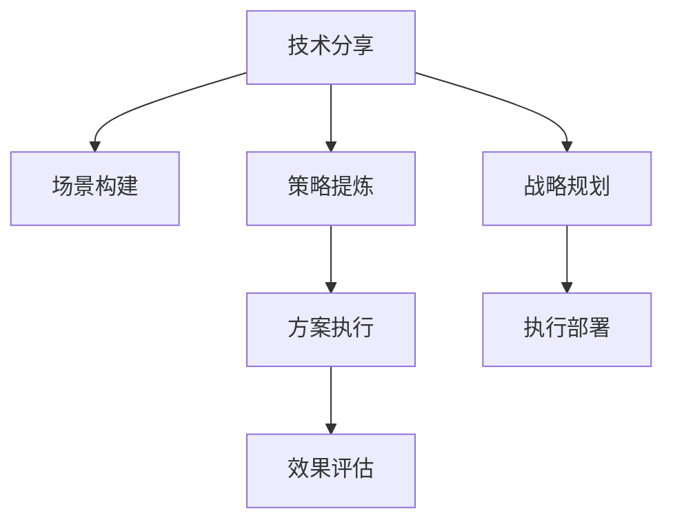

                 

# 如何将技术分享转化为高价值咨询服务

## 1. 背景介绍

### 1.1 问题由来

在信息泛滥的互联网时代，如何从海量的技术资讯中筛选出真正有价值的知识，成为了一个令人头疼的问题。技术分享，作为连接技术开发者与广大用户的桥梁，对于解决这一问题至关重要。然而，大部分技术分享内容往往只是简单介绍项目或技术原理，缺乏实际应用场景和落地策略，难以产生高价值输出。

### 1.2 问题核心关键点

技术分享转化为高价值咨询服务的关键在于，如何将深奥复杂的技术知识转化为实际可操作、可落地、可执行的策略和方案，为企业和个人提供真正解决实际问题的能力。核心关键点包括：

- **场景构建**：将技术原理与具体业务场景结合，实现知识迁移。
- **策略提炼**：从技术解决方案中提炼出具有普适性的策略，适用于不同规模和场景。
- **方案执行**：提供详细的执行计划和步骤，指导落地实施。
- **效果评估**：制定评估标准，监控和优化效果。

### 1.3 问题研究意义

技术分享转化为高价值咨询服务，对于技术社区和产业界具有重要意义：

1. **提升技术应用价值**：将抽象的技术原理转化为具体的应用方案，帮助开发者更快速地将新技术应用于实际项目中。
2. **促进知识传播**：构建知识迁移路径，推动知识从科研机构和行业龙头向广大中小企业和普通开发者传播。
3. **加速技术产业化**：为技术开发者提供落地策略，降低技术转化成本，加速技术产品和解决方案的市场化进程。
4. **提升咨询顾问价值**：为技术顾问和咨询公司提供差异化服务，提升其市场竞争力。
5. **支撑企业决策**：为决策者提供高质量的技术见解，辅助其制定合理的技术路线和实施方案。

## 2. 核心概念与联系

### 2.1 核心概念概述

为更好地理解技术分享转化为高价值咨询服务的核心逻辑，本节将介绍几个关键概念：

- **技术分享**：通过博客、视频、会议、研讨会等形式，分享技术知识、项目经验、开发工具等，促进技术交流和知识传播。
- **高价值咨询服务**：针对企业或个人需求，提供深入的技术分析、实施策略、落地方案等，帮助其实现技术应用目标。
- **知识迁移**：将抽象的理论知识迁移到具体的业务场景中，转化为可操作、可执行、可验证的实践方案。
- **战略规划**：结合技术优势和业务需求，制定中长期发展策略，指导技术投资和资源分配。
- **执行部署**：提供详细的执行计划和操作步骤，确保技术方案成功落地实施。
- **效果评估**：设立明确的技术效果指标，持续监控和评估实施效果，不断优化和迭代。

这些概念之间存在紧密的联系，通过将技术原理、业务场景、实施策略、执行计划、效果评估相结合，可以构建出高价值咨询服务的闭环体系，帮助企业和个人实现技术应用的真正价值。

### 2.2 核心概念原理和架构的 Mermaid 流程图



该流程图展示了从技术分享到高价值咨询服务的转换路径，各个环节之间相互联系，共同构建起闭环的咨询服务体系。

## 3. 核心算法原理 & 具体操作步骤

### 3.1 算法原理概述

技术分享转化为高价值咨询服务的核心算法原理，可以概括为“技术分析-场景结合-策略提炼-方案执行-效果评估”五步法。即通过分析技术原理，结合具体业务场景，提炼出普适性策略，提供可执行方案，并通过效果评估不断优化。

### 3.2 算法步骤详解

#### 3.2.1 技术分析

技术分析是咨询服务的起点，需要对新技术进行全面深入的了解，包括其核心原理、适用场景、优缺点、依赖条件等。通过调研现有文献、项目案例、开源代码等，获取详细的信息。

**具体步骤**：
1. 调研文献和案例：收集相关的技术文献、研究报告、项目案例等。
2. 梳理技术原理：总结技术的核心原理、工作机制、核心算法等。
3. 识别依赖条件：确定技术应用的硬性条件和软性要求。

#### 3.2.2 场景结合

将技术原理与具体的业务场景结合，构建出适应特定场景的技术应用方案。需分析业务需求、市场环境、用户需求等，设计合理的技术应用路径。

**具体步骤**：
1. 分析业务需求：了解业务的核心目标、关键环节、现有系统等。
2. 识别场景特点：分析目标场景的技术特点、资源现状、安全要求等。
3. 构建应用路径：设计技术应用的具体路径，包括实施步骤、关键节点等。

#### 3.2.3 策略提炼

从技术方案中提炼出普适性的策略和解决方案，确保技术应用具有广泛的适用性和可操作性。需综合考虑技术、业务、管理等多方面因素，提出综合性的指导建议。

**具体步骤**：
1. 评估技术优势：分析技术的核心优势和潜在风险。
2. 提炼普适策略：总结可复制、可推广的实施策略。
3. 制定实施方案：详细规划具体的实施步骤和时间节点。

#### 3.2.4 方案执行

提供详细的技术实施方案和操作步骤，指导实际落地实施。需提供清晰的技术架构图、实施路径图、操作手册等，确保执行过程的顺畅和可控。

**具体步骤**：
1. 绘制技术架构图：清晰展示技术方案的整体架构和关键组件。
2. 制定实施路径图：详细规划实施路径和关键节点。
3. 编写操作手册：提供详细的实施步骤和操作指南。

#### 3.2.5 效果评估

设立明确的评估标准和指标，持续监控和评估实施效果，及时发现问题并进行优化调整。需制定详细的评估计划，明确评估周期和评估方法。

**具体步骤**：
1. 确定评估指标：根据技术应用目标，设立明确的评估指标。
2. 制定评估计划：明确评估周期、评估方法、评估人员等。
3. 监控实施效果：实时采集技术实施过程中的各项指标，进行评估和优化。

### 3.3 算法优缺点

#### 3.3.1 优点

1. **高度针对性**：通过技术分析和场景结合，构建出高度针对性和适配性的解决方案。
2. **可操作性强**：提炼出普适性的策略和步骤，确保方案的执行性和可操作性。
3. **效果可评估**：设立明确的评估指标，持续监控和优化实施效果。
4. **适应性强**：适用于不同规模和场景，具备广泛的适用性。

#### 3.3.2 缺点

1. **实施复杂度较高**：方案的制定和实施需要丰富的经验和技术积累，实施过程可能存在一定的复杂度。
2. **依赖信息准确性**：技术分析和场景结合依赖于全面准确的信息，信息偏差可能导致方案的错误。
3. **效果需持续优化**：技术应用过程中可能会出现新的问题和挑战，需要持续优化和迭代。

### 3.4 算法应用领域

技术分享转化为高价值咨询服务，在以下几个领域具有广泛的应用：

1. **企业信息化建设**：帮助企业实现数字化转型，提升信息化水平，构建竞争优势。
2. **智能制造**：通过技术应用，推动传统制造业的智能化和自动化，提升生产效率和质量。
3. **智慧医疗**：提供技术方案，助力医疗信息化建设，提升医疗服务的智能化和精准化。
4. **电子商务**：通过技术应用，提升电商平台的用户体验和运营效率，构建全渠道电商生态。
5. **金融科技**：帮助金融机构实现数字化转型，提升金融服务智能化水平，提升用户体验。

## 4. 数学模型和公式 & 详细讲解 & 举例说明

### 4.1 数学模型构建

技术分享转化为高价值咨询服务，需要构建一个综合性的数学模型，涵盖技术分析、场景结合、策略提炼、方案执行、效果评估等多个环节。具体模型构建如下：

设 $T$ 为新技术，$B$ 为目标场景，$S$ 为提炼出的策略，$M$ 为实施方案，$E$ 为评估指标。则模型构建为：

$$
M = T \oplus B \rightarrow S \oplus M \rightarrow E
$$

其中 $\oplus$ 表示逻辑与，$\rho$ 表示映射函数。

### 4.2 公式推导过程

#### 4.2.1 技术分析

设 $T = \{(t_1,t_2,...,t_n)\}$，其中 $t_i$ 为技术指标。则技术分析的过程为：

$$
A_T = (t_1,t_2,...,t_n)
$$

#### 4.2.2 场景结合

设 $B = \{(b_1,b_2,...,b_m)\}$，其中 $b_i$ 为业务指标。则场景结合的过程为：

$$
A_B = (b_1,b_2,...,b_m)
$$

#### 4.2.3 策略提炼

设 $S = \{(s_1,s_2,...,s_k)\}$，其中 $s_i$ 为策略指标。则策略提炼的过程为：

$$
A_S = (s_1,s_2,...,s_k)
$$

#### 4.2.4 方案执行

设 $M = \{(m_1,m_2,...,m_l)\}$，其中 $m_i$ 为执行指标。则方案执行的过程为：

$$
A_M = (m_1,m_2,...,m_l)
$$

#### 4.2.5 效果评估

设 $E = \{(e_1,e_2,...,e_p)\}$，其中 $e_i$ 为评估指标。则效果评估的过程为：

$$
A_E = (e_1,e_2,...,e_p)
$$

### 4.3 案例分析与讲解

**案例：智能制造中的工业互联网平台建设**

1. **技术分析**：了解工业互联网的核心技术，包括物联网、大数据、云计算、人工智能等。
2. **场景结合**：分析企业的实际需求，如生产设备联网、生产过程数据化、生产管理智能化等。
3. **策略提炼**：提炼出普适性的建设策略，如技术栈选择、平台架构设计、安全防护措施等。
4. **方案执行**：制定详细的实施方案，包括平台搭建步骤、关键技术部署、安全防护方案等。
5. **效果评估**：设立明确的评估指标，如生产效率提升、设备利用率提升、数据安全保障等。

## 5. 项目实践：代码实例和详细解释说明

### 5.1 开发环境搭建

为了进行高价值咨询服务的项目实践，需要搭建一个综合性的开发环境。以下是主要开发环境的搭建步骤：

1. **环境配置**：使用Jenkins、Kubernetes等工具搭建持续集成/持续部署(CI/CD)环境，确保技术方案的快速迭代和部署。
2. **技术栈选择**：选择适合的技术栈，如Docker、Kubernetes、Hadoop等，构建高可用、高可靠的系统架构。
3. **工具集成**：集成常用的开发工具，如Git、JIRA、Confluence等，确保项目管理的便捷性和协作性。

### 5.2 源代码详细实现

以下是一个高价值咨询服务项目的具体代码实现，以智能制造中的工业互联网平台建设为例：

```python
# 技术分析部分
def analyze_technology():
    # 调用技术文献、研究报告等获取技术信息
    # 返回技术分析结果
    
# 场景结合部分
def analyze_scenario():
    # 调用企业调研、业务分析等获取业务信息
    # 返回场景结合结果
    
# 策略提炼部分
def refine_strategy():
    # 根据技术分析结果和场景结合结果，提炼普适性策略
    # 返回策略提炼结果
    
# 方案执行部分
def execute_plans():
    # 根据策略提炼结果，制定详细的实施方案
    # 返回方案执行结果
    
# 效果评估部分
def evaluate_outcomes():
    # 根据实施方案，设立评估指标，监控实施效果
    # 返回效果评估结果
```

### 5.3 代码解读与分析

**代码解读**：
1. **技术分析函数**：获取和分析新技术的技术细节，提供技术概览。
2. **场景结合函数**：获取和分析业务需求和环境，提供业务概述。
3. **策略提炼函数**：综合技术分析和业务场景，提炼出普适性策略，提供解决方案。
4. **方案执行函数**：详细制定实施方案，提供执行指南。
5. **效果评估函数**：设立评估指标，监控实施效果，提供优化建议。

**代码分析**：
1. **函数模块化**：将技术分享转化为高价值咨询服务的过程分解为多个模块函数，便于管理和复用。
2. **参数化输入**：通过参数化输入，确保函数可以灵活处理不同的技术、业务场景和需求。
3. **结果返回**：通过函数返回结果，确保每个环节的数据和信息能够顺利传递。

### 5.4 运行结果展示

在智能制造中的工业互联网平台建设案例中，技术分析函数返回的新技术概览，场景结合函数返回的业务概述，策略提炼函数返回的普适性策略，方案执行函数返回的详细实施方案，效果评估函数返回的实施效果评估。

**结果展示**：
- **技术概览**：介绍物联网、大数据、云计算、人工智能等关键技术。
- **业务概述**：分析生产设备联网、生产过程数据化、生产管理智能化等需求。
- **策略概览**：提炼技术栈选择、平台架构设计、安全防护措施等普适性策略。
- **实施方案**：制定平台搭建步骤、关键技术部署、安全防护方案等详细步骤。
- **效果评估**：设立生产效率提升、设备利用率提升、数据安全保障等评估指标。

## 6. 实际应用场景

### 6.1 智能制造

在智能制造领域，工业互联网平台建设是推动制造业智能化和自动化的关键技术。通过高价值咨询服务，可以为制造企业提供全面的技术解决方案，帮助其实现数字化转型。

### 6.2 智慧医疗

在智慧医疗领域，通过技术分享转化为高价值咨询服务，可以为医院提供全面的信息化解决方案，提升医疗服务的智能化和精准化水平。

### 6.3 电子商务

在电子商务领域，通过高价值咨询服务，可以为电商平台提供全面的技术支持，提升用户体验和运营效率，构建全渠道电商生态。

### 6.4 未来应用展望

随着技术的不断进步，高价值咨询服务在更多领域将发挥重要作用。未来，高价值咨询服务将广泛应用于金融科技、智能制造、智慧医疗、智慧城市、智能交通等多个领域，助力各行各业实现数字化、智能化转型。

## 7. 工具和资源推荐

### 7.1 学习资源推荐

为帮助开发者深入掌握技术分享转化为高价值咨询服务的方法，以下是一些优质的学习资源：

1. **《高价值咨询技术服务指南》**：全面介绍技术分享、场景结合、策略提炼、方案执行、效果评估等关键环节，适合技术顾问和咨询公司学习参考。
2. **《从技术分享到高价值咨询》**：由资深技术顾问和咨询公司高层撰写的实战经验分享，涵盖多个典型场景的案例分析。
3. **《技术分享与高价值咨询服务实战》**：线上直播、视频课程、案例研讨等多形式组合的培训项目，提供系统化的学习和实践机会。
4. **《技术分享与咨询案例库》**：收录大量技术分享和咨询服务案例，供学习和借鉴。

### 7.2 开发工具推荐

高价值咨询服务涉及多个环节，需要灵活使用的开发工具。以下是几款常用的开发工具：

1. **Jenkins**：持续集成/持续部署工具，支持构建、测试、部署、监控等多个环节。
2. **Kubernetes**：容器编排和管理系统，支持高可用、高可靠的云服务部署。
3. **Hadoop**：大数据处理框架，支持大规模数据存储和分析。
4. **Git**：版本控制工具，支持团队协作和代码管理。
5. **JIRA**：项目管理工具，支持任务分配、进度跟踪、问题反馈等。
6. **Confluence**：知识管理和协作工具，支持文档编写、信息共享和团队协作。

### 7.3 相关论文推荐

以下是几篇高价值咨询服务领域的经典论文，推荐阅读：

1. **《技术分享与高价值咨询服务的实践》**：深入剖析技术分享与高价值咨询服务的逻辑和实现方法，提供详细的案例分析。
2. **《从技术分享到高价值咨询：方法论与实践》**：探索技术分享转化为高价值咨询服务的理论框架和方法论，提供实战策略。
3. **《技术分享与高价值咨询服务的技术架构》**：详细介绍技术分享与高价值咨询服务的体系架构和实施细节，提供技术方案。

## 8. 总结：未来发展趋势与挑战

### 8.1 研究成果总结

技术分享转化为高价值咨询服务，已经在多个领域得到了应用和验证，取得了显著的效果。其核心方法是将技术分析、场景结合、策略提炼、方案执行、效果评估等多个环节有机结合，形成了一个完整的咨询闭环体系。

### 8.2 未来发展趋势

未来，高价值咨询服务将呈现出以下发展趋势：

1. **技术智能化**：引入人工智能和大数据技术，提升咨询服务的智能化水平，提供更为精准的分析和预测。
2. **服务个性化**：通过机器学习算法，根据用户需求和行为特征，提供个性化、定制化的咨询服务。
3. **服务可量化**：通过量化评估模型，将咨询服务的效果进行客观评估和量化，提升服务质量和可靠性。
4. **服务生态化**：构建多元化的服务生态，引入第三方技术、资源和专家，提升咨询服务的深度和广度。
5. **服务全球化**：拓展全球市场，提供跨文化、跨地域的咨询服务，提升服务的覆盖面和影响力。

### 8.3 面临的挑战

尽管高价值咨询服务具有广阔的发展前景，但在实际应用中也面临着诸多挑战：

1. **数据获取难度**：获取高质量、全面、准确的业务数据，是提供高价值咨询服务的前提。
2. **技术门槛较高**：需要掌握多种技术工具和方法，构建综合性技术能力，才能提供高价值咨询服务。
3. **业务理解深度**：深入理解业务需求和场景，才能提供符合实际需求的技术解决方案。
4. **效果评估复杂**：设立明确的效果评估指标，持续监控和优化咨询效果，是提供高质量咨询服务的关键。

### 8.4 研究展望

未来，需要从以下几个方面进一步推动高价值咨询服务的研究和应用：

1. **构建标准化模型**：构建标准化的技术分析、场景结合、策略提炼、方案执行、效果评估模型，提供标准化、可复制的咨询服务。
2. **引入开源技术**：引入开源技术和大数据平台，降低技术实施成本，提升服务质量和效率。
3. **建立跨界合作**：与学术机构、技术公司、行业龙头等建立合作关系，共享资源和经验，提升咨询服务的深度和广度。
4. **推动技术普及**：通过技术分享、在线培训、技术研讨等多种形式，推动高价值咨询服务技术的普及和应用。

## 9. 附录：常见问题与解答

**Q1: 高价值咨询服务与传统咨询服务的区别是什么？**

A: 高价值咨询服务是基于技术分析、场景结合、策略提炼、方案执行、效果评估等五个环节，提供深入的技术解决方案。与传统咨询服务相比，高价值咨询服务具有更高的技术含量、更强的可操作性、更明确的评估标准，能够提供更具针对性和实用性的解决方案。

**Q2: 如何提升高价值咨询服务的咨询效果？**

A: 提升高价值咨询服务的咨询效果，需从以下几个方面入手：
1. 深入理解业务需求，确保咨询方案与实际需求高度匹配。
2. 采用多种技术手段和方法，提供全面、系统的解决方案。
3. 设立明确的效果评估指标，持续监控和优化实施效果。
4. 引入跨界资源和专家，提升咨询服务的深度和广度。

**Q3: 高价值咨询服务是否适合所有行业和企业？**

A: 高价值咨询服务适合具有较高技术含量和创新需求的行业和企业，如高科技、智能制造、医疗健康、金融科技等。对于传统制造业、服务业等相对保守的行业，还需结合实际情况进行定制化调整。

**Q4: 高价值咨询服务需要哪些资源投入？**

A: 高价值咨询服务需要投入大量的资源，包括技术人才、数据资源、技术工具、合作伙伴等。具体投入需根据业务需求和技术复杂度进行评估，建议设立专项预算，确保项目的顺利实施和持续优化。

---

作者：禅与计算机程序设计艺术 / Zen and the Art of Computer Programming

