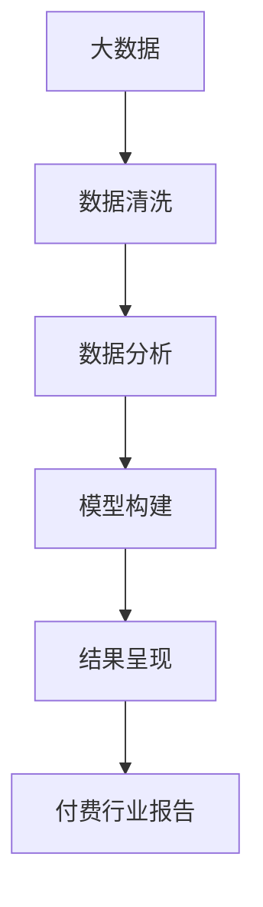

                 

# 如何将技术洞察转化为付费行业报告

> 关键词：技术洞察, 行业报告, 大数据, 数据分析, 商业智能, 自然语言处理, 机器学习, 深度学习, 预测模型, 数据可视化

## 1. 背景介绍

### 1.1 问题由来

在当今信息爆炸的时代，企业需要快速获取、分析和理解海量数据，以支持决策制定、运营优化、产品迭代等各个环节。然而，从原始数据到洞见转化是一个复杂且耗时的过程，企业往往缺乏专业的数据和技术团队，无法高效地实现这一转变。

为此，将技术洞察转化为系统化、结构化、易于理解的报告，成为企业提升数据分析能力、优化决策支持的关键步骤。付费行业报告因其权威性、专业性和深度性，成为企业获取高价值数据分析的重要渠道。

### 1.2 问题核心关键点

将技术洞察转化为付费行业报告的核心在于：
- 数据获取与清洗：保证数据的完整性、准确性和时效性。
- 分析模型构建：选择合适的模型，对数据进行深入分析。
- 结果呈现：将复杂的数据分析结果转化为易于理解的图表、报告，支持企业决策。

本文将详细阐述如何利用先进的技术手段，将技术洞察转化为高质量的付费行业报告，重点讨论数据处理、模型构建和报告生成等关键步骤。

## 2. 核心概念与联系

### 2.1 核心概念概述

在深入分析之前，我们需要先了解一些核心概念：

- **大数据**：指规模庞大、复杂度高的数据集，常见于互联网公司、金融、医疗等行业。
- **数据分析**：通过统计、算法、计算等手段，从数据中提取有价值的信息。
- **商业智能(BI)**：利用数据和分析技术，辅助企业进行业务决策。
- **自然语言处理(NLP)**：使计算机能够理解、处理和生成自然语言。
- **机器学习(ML)**：让计算机通过学习数据规律，自主提高问题解决能力。
- **深度学习(DL)**：基于神经网络，处理非结构化数据，实现更精准的预测和分类。
- **预测模型**：用于预测未来事件或结果的模型。
- **数据可视化**：将数据通过图表、地图等形式展现，帮助理解分析结果。

这些概念通过一系列的数据处理、模型训练和结果呈现步骤，最终转化为有价值的行业报告。

### 2.2 核心概念原理和架构的 Mermaid 流程图



通过上述流程图，可以清晰地看到从大数据到付费行业报告的全流程。接下来，我们将详细介绍每个步骤的实现方法。

## 3. 核心算法原理 & 具体操作步骤

### 3.1 算法原理概述

技术洞察转化为付费行业报告的过程，实际上是一个数据驱动的分析和建模过程。其核心原理可以概括为：

- **数据预处理**：确保数据质量，为后续分析奠定基础。
- **特征工程**：从原始数据中提取有用的特征，提升模型效果。
- **模型训练**：选择合适的机器学习或深度学习模型，训练得到预测模型。
- **结果评估**：使用验证数据集评估模型效果，优化模型参数。
- **结果呈现**：将模型分析结果转化为可视化的图表和报告，辅助决策。

### 3.2 算法步骤详解

#### 3.2.1 数据预处理

数据预处理包括数据清洗、数据转换和数据采样等步骤：

1. **数据清洗**：去除或修正缺失值、异常值和重复数据，确保数据准确性。
2. **数据转换**：将数据格式转换为适合分析的格式，如时间序列数据的归一化处理。
3. **数据采样**：根据分析需求，对数据进行抽样处理，减少数据量和计算复杂度。

#### 3.2.2 特征工程

特征工程是构建高质量模型的关键步骤，包括特征选择、特征提取和特征工程：

1. **特征选择**：从原始数据中选择最具预测能力的特征。
2. **特征提取**：从原始数据中提取新的特征，如时间特征、文本特征等。
3. **特征工程**：通过处理和变换，提升特征的可解释性和预测性能。

#### 3.2.3 模型训练

模型训练涉及模型选择、参数调优和模型验证：

1. **模型选择**：根据数据特征和分析目标，选择合适的模型，如线性回归、决策树、随机森林、支持向量机等。
2. **参数调优**：通过交叉验证等技术，优化模型参数，提升模型效果。
3. **模型验证**：使用验证数据集评估模型效果，确保模型泛化能力。

#### 3.2.4 结果评估

结果评估包括模型性能指标计算和结果可视化：

1. **性能指标计算**：计算模型在验证数据集上的准确率、召回率、F1分数等指标。
2. **结果可视化**：使用图表、热力图等形式，直观展示分析结果。

#### 3.2.5 结果呈现

结果呈现是将分析结果转化为易于理解的报告：

1. **报告结构设计**：设计报告结构，包括标题、摘要、正文、附录等部分。
2. **图表制作**：使用Matplotlib、Seaborn等工具制作图表，展现数据关系和分析结果。
3. **文本撰写**：撰写分析报告，详细介绍数据来源、分析方法和结论。

### 3.3 算法优缺点

将技术洞察转化为付费行业报告的优点包括：

- **高效性**：通过自动化流程，大大缩短了从数据到洞见的转化时间。
- **准确性**：采用科学的分析方法和先进算法，保证分析结果的准确性。
- **可操作性**：将复杂的数据分析结果转化为易于理解的报告，便于企业决策。

同时，也存在一些缺点：

- **依赖数据**：数据质量对分析结果影响较大，数据缺失或错误可能导致误导性结论。
- **模型复杂性**：选择和调优模型的过程需要专业知识，对非专业用户存在一定的门槛。
- **资源消耗**：数据处理和模型训练需要较高的计算资源和时间成本。

### 3.4 算法应用领域

将技术洞察转化为付费行业报告的方法，广泛应用于金融、医疗、零售、物流等多个领域：

- **金融领域**：分析市场趋势、风险评估、投资决策等。
- **医疗领域**：病人流分析、疾病预测、治疗方案优化等。
- **零售领域**：客户行为分析、库存管理、营销策略制定等。
- **物流领域**：货物运输路线优化、配送效率评估、需求预测等。

## 4. 数学模型和公式 & 详细讲解 & 举例说明

### 4.1 数学模型构建

假设我们有一个时间序列数据集 $D=\{(x_t,y_t)\}_{t=1}^N$，其中 $x_t$ 为时间 $t$ 的特征向量，$y_t$ 为预测值。我们的目标是构建一个时间序列预测模型 $M$，最小化预测误差：

$$
\min_{M} \sum_{t=1}^N \|y_t - M(x_t)\|^2
$$

### 4.2 公式推导过程

为了简化问题，我们采用自回归模型（AR模型）进行时间序列预测：

$$
y_t = \alpha_0 + \alpha_1 y_{t-1} + \cdots + \alpha_p y_{t-p} + \epsilon_t
$$

其中 $\epsilon_t$ 为随机误差项。通过最小化平方误差，求解模型的参数 $\alpha_0, \alpha_1, \cdots, \alpha_p$。

### 4.3 案例分析与讲解

假设我们收集了2019年某城市天气数据，其中包含温度、湿度、降水量等特征。我们的目标是预测未来一周每天的气温：

1. **数据预处理**：去缺失值、异常值，将数据转换为标准格式。
2. **特征工程**：选择温度、湿度、降水量等特征，构建AR模型。
3. **模型训练**：使用前99天数据训练模型，优化参数。
4. **结果评估**：使用后7天数据验证模型效果，计算准确率、误差等指标。
5. **结果呈现**：将模型预测结果和分析结论写入报告。

## 5. 项目实践：代码实例和详细解释说明

### 5.1 开发环境搭建

以下是使用Python和R语言搭建开发环境的步骤：

1. **Python环境搭建**：
   - 安装Anaconda，创建虚拟环境：
     ```
     conda create -n myenv python=3.8
     conda activate myenv
     ```
   - 安装必要的库：
     ```
     pip install pandas numpy matplotlib seaborn scikit-learn
     ```

2. **R语言环境搭建**：
   - 安装RStudio，创建R项目。
   - 安装必要的包：
     ```
     install.packages("dplyr")
     install.packages("ggplot2")
     install.packages("caret")
     ```

### 5.2 源代码详细实现

以下是Python代码实现：

```python
import pandas as pd
import numpy as np
import matplotlib.pyplot as plt
from sklearn.linear_model import ARDRegression

# 读取数据
data = pd.read_csv('weather_data.csv')

# 数据预处理
data = data.dropna()
X = data[['temperature', 'humidity', 'rainfall']].shift(-7).dropna()
y = data['temperature'].shift(-7)

# 特征工程
X_train = X[:-7]
X_test = X[-7:]
y_train = y[:-7]
y_test = y[-7:]

# 模型训练
model = ARDRegression()
model.fit(X_train, y_train)

# 结果评估
y_pred = model.predict(X_test)
mse = np.mean((y_pred - y_test) ** 2)

# 结果呈现
plt.scatter(X_test, y_test)
plt.plot(X_test, y_pred, color='red')
plt.show()

# 写入报告
report = {
    '数据来源': '某城市天气数据',
    '分析方法': '自回归模型',
    '模型参数': model.coef_,
    '预测结果': y_pred,
    '误差': mse
}

with open('report.txt', 'w') as f:
    f.write('天气数据预测报告\n')
    for key, value in report.items():
        f.write(f'{key}: {value}\n')
```

### 5.3 代码解读与分析

1. **数据预处理**：使用pandas库处理缺失值和异常值，使用numpy库进行数据转换。
2. **特征工程**：使用scikit-learn库的ARDRegression模型，构建自回归模型。
3. **模型训练**：使用模型拟合训练数据。
4. **结果评估**：计算预测误差。
5. **结果呈现**：使用matplotlib库绘制预测结果和真实值对比图。
6. **报告生成**：将分析结果和报告内容写入文本文件。

## 6. 实际应用场景

### 6.4 未来应用展望

随着人工智能技术的不断进步，将技术洞察转化为付费行业报告的方法将更加智能、高效和准确。未来的发展趋势包括：

- **自动化程度提升**：通过AI辅助工具，自动进行数据清洗、特征提取和模型调优。
- **深度学习模型应用**：使用神经网络模型，提升预测精度和模型泛化能力。
- **实时数据处理**：实现数据的实时处理和分析，支持实时决策支持。
- **多模态数据融合**：结合文本、图像、声音等多模态数据，提升数据分析的全面性和准确性。

## 7. 工具和资源推荐

### 7.1 学习资源推荐

- **《Python数据分析与可视化》**：详细介绍Python在数据分析和可视化中的应用。
- **《R语言实战》**：展示R语言在数据处理和统计分析中的优势。
- **《机器学习实战》**：通过实际案例，讲解机器学习的基本概念和算法。
- **《深度学习》**：介绍深度学习的基本原理和应用。
- **《商业智能基础》**：讲解商业智能的基本概念和工具。

### 7.2 开发工具推荐

- **Python开发工具**：Jupyter Notebook、PyCharm。
- **R开发工具**：RStudio、Tidyverse。
- **数据分析工具**：Pandas、NumPy、Scikit-Learn。
- **机器学习框架**：TensorFlow、PyTorch。
- **可视化工具**：Matplotlib、Seaborn、ggplot2。

### 7.3 相关论文推荐

- **《深度学习在自然语言处理中的应用》**：介绍深度学习在文本分类、情感分析、问答系统等NLP任务中的应用。
- **《基于机器学习的商业智能系统构建》**：讲解机器学习在商业智能中的应用案例。
- **《大数据时代的数据分析和可视化》**：探讨大数据技术在数据分析和可视化中的应用。
- **《多模态数据融合与智能分析》**：介绍多模态数据融合的基本概念和应用方法。

## 8. 总结：未来发展趋势与挑战

### 8.1 研究成果总结

本文详细阐述了将技术洞察转化为付费行业报告的全流程，包括数据预处理、特征工程、模型训练、结果评估和结果呈现等关键步骤。通过实际案例，展示了将技术洞察转化为高质量报告的实现方法。

### 8.2 未来发展趋势

未来，随着技术的不断进步，将技术洞察转化为付费行业报告的方法将更加智能、高效和准确：

- **自动化程度提升**：通过AI辅助工具，自动进行数据清洗、特征提取和模型调优。
- **深度学习模型应用**：使用神经网络模型，提升预测精度和模型泛化能力。
- **实时数据处理**：实现数据的实时处理和分析，支持实时决策支持。
- **多模态数据融合**：结合文本、图像、声音等多模态数据，提升数据分析的全面性和准确性。

### 8.3 面临的挑战

尽管技术进步显著，但在将技术洞察转化为付费行业报告的过程中，仍面临一些挑战：

- **数据质量**：数据的完整性、准确性和时效性直接影响分析结果。
- **模型复杂性**：选择和调优模型的过程需要专业知识，对非专业用户存在一定的门槛。
- **资源消耗**：数据处理和模型训练需要较高的计算资源和时间成本。
- **结果可解释性**：需要加强结果的可解释性，确保模型决策的透明性和可信度。

### 8.4 研究展望

未来研究需要关注以下方向：

- **自动化数据清洗和特征工程**：开发智能数据预处理工具，降低人工干预。
- **轻量级模型和高效计算**：优化模型结构和计算图，提升模型性能和效率。
- **多模态数据融合技术**：研究多模态数据的整合和分析方法。
- **结果可解释性和可审计性**：提升模型的可解释性，确保决策透明性和可信度。

通过不断突破这些挑战，将技术洞察转化为高质量的付费行业报告，必将在商业智能和决策支持领域发挥更大的作用。

## 9. 附录：常见问题与解答

**Q1: 数据预处理有哪些常见方法？**

A: 数据预处理的方法包括：
- **缺失值处理**：删除缺失值、均值填充、插值等。
- **异常值处理**：删除异常值、截断、替换等。
- **数据标准化**：标准化、归一化等处理方式，确保数据一致性。
- **数据采样**：随机采样、分层采样等，减少数据量和计算复杂度。

**Q2: 如何选择适合的预测模型？**

A: 选择预测模型需要考虑数据类型、分析目标和模型特性：
- **数据类型**：时间序列、分类、回归等。
- **分析目标**：预测、分类、聚类等。
- **模型特性**：简单性、可解释性、泛化能力等。

**Q3: 如何评估模型的性能？**

A: 常用的模型性能评估指标包括：
- **准确率**：预测结果与真实结果一致的比例。
- **召回率**：真实结果被正确预测的比例。
- **F1分数**：准确率和召回率的调和平均数，综合评估模型效果。
- **ROC曲线**：绘制真阳性率与假阳性率的关系，评估模型的鲁棒性。

**Q4: 如何提高结果的可解释性？**

A: 提高结果可解释性的方法包括：
- **可视化分析**：使用图表、热力图等形式，直观展示分析结果。
- **详细报告撰写**：详细描述数据来源、分析方法和结论，增强报告的透明度。
- **多维度分析**：结合不同维度的数据分析结果，形成多角度的洞见。

---

作者：禅与计算机程序设计艺术 / Zen and the Art of Computer Programming

