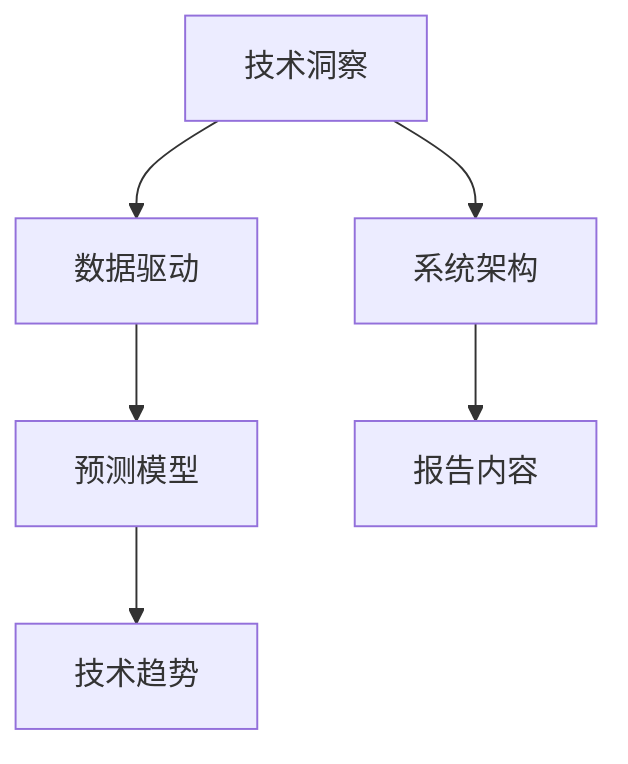

                 

# 如何将技术洞察转化为技术趋势报告

> 关键词：技术洞察, 技术趋势, 数据驱动, 预测模型, 系统架构, 机器学习

## 1. 背景介绍

### 1.1 问题由来

在科技飞速发展的今天，新技术不断涌现，如何在海量信息中筛选出真正有价值的技术趋势，成为技术管理者、决策者乃至普通从业者亟需解决的问题。技术洞察的获取，需要专业的知识背景和敏锐的行业嗅觉，而将洞察转化为可操作的技术趋势报告，更是一项复杂的系统工程。本报告旨在探讨如何将技术洞察转化为易于理解和应用的技术趋势报告，以帮助决策者做出明智的战略选择。

### 1.2 问题核心关键点

技术洞察转化为技术趋势报告的核心在于：

- 如何高效获取行业内的最新技术动态和研究成果。
- 如何选择合适的数据模型和技术指标，对技术趋势进行准确的预测和分析。
- 如何设计清晰、直观的技术趋势报告，便于非技术背景的管理者和决策者理解和决策。

## 2. 核心概念与联系

### 2.1 核心概念概述

为更好地理解如何将技术洞察转化为技术趋势报告，本节将介绍几个密切相关的核心概念：

- **技术洞察（Technology Insight）**：通过对行业内最新技术文献、专利、产品发布、会议报告等信息的分析和整理，获取关于新技术发展方向、应用前景、潜在问题等的理解。
- **技术趋势（Technology Trends）**：基于技术洞察，对未来一段时间内技术的发展路径、市场变化、竞争态势等进行预测和分析，以指导技术决策和产品规划。
- **数据驱动（Data-Driven）**：利用数据分析和机器学习等手段，自动从海量数据中提取关键信息，生成有价值的分析结果。
- **预测模型（Predictive Model）**：使用历史数据训练模型，对未来技术趋势进行预测，以辅助决策。
- **系统架构（System Architecture）**：定义技术趋势报告的各个组成部分及其相互关系，确保报告的逻辑清晰、结构紧凑。

这些核心概念之间的逻辑关系可以通过以下Mermaid流程图来展示：



这个流程图展示的技术洞察转化为技术趋势报告的一般流程：

1. 获取技术洞察。
2. 利用数据驱动技术分析关键信息。
3. 应用预测模型预测未来趋势。
4. 结合系统架构设计清晰报告内容。

## 3. 核心算法原理 & 具体操作步骤

### 3.1 算法原理概述

技术洞察转化为技术趋势报告的核心算法原理主要涉及数据驱动、预测模型、系统架构三个方面。

- **数据驱动**：通过爬虫、API接口、文献数据库等渠道获取最新的技术信息。利用自然语言处理（NLP）技术对文本进行清洗、分词、抽取实体等处理，提取关键信息。
- **预测模型**：使用机器学习算法（如时间序列分析、回归模型、分类模型等）对技术发展趋势进行预测。常用的算法包括ARIMA、LSTM、XGBoost等。
- **系统架构**：设计报告的层次结构，包括技术背景、当前趋势、未来预测、实际应用案例、挑战与机会等部分。各部分相互关联，形成一个有机的整体。

### 3.2 算法步骤详解

**Step 1: 获取技术洞察**

1. **数据源选择**：确定数据来源，包括学术期刊、专利数据库、技术博客、行业报告等。
2. **数据收集**：通过爬虫技术、API接口、RSS订阅等方式自动抓取最新数据。
3. **数据清洗**：对收集到的数据进行去重、去噪、格式转换等处理，确保数据质量。

**Step 2: 数据驱动分析**

1. **文本处理**：使用NLP技术对文本进行分词、词性标注、命名实体识别等预处理。
2. **关键信息提取**：通过关键词提取、主题建模等技术，识别文本中的关键技术点、应用场景、潜在问题等。
3. **信息可视化**：使用词云图、趋势线图、关键词分布图等可视化工具，展示技术洞察的分布和变化。

**Step 3: 预测模型构建**

1. **模型选择**：根据问题的性质选择合适的预测模型，如时间序列分析模型、回归模型、分类模型等。
2. **数据预处理**：对数据进行标准化、归一化、特征工程等预处理操作。
3. **模型训练**：使用历史数据训练模型，进行交叉验证和超参数调优，以提高预测准确度。
4. **模型评估**：使用测试集对模型进行评估，根据评估结果调整模型参数，确保模型泛化能力。

**Step 4: 系统架构设计**

1. **层次结构设计**：将报告内容分为技术背景、当前趋势、未来预测、实际应用案例、挑战与机会等部分，确保报告逻辑清晰、条理分明。
2. **内容组织**：根据不同的主题和目标受众，选择适当的内容组织形式，如条目列表、段落、图表等。
3. **报告发布**：选择合适的报告发布平台和形式，如PDF文档、网站、交互式报告等，确保报告易于阅读和理解。

### 3.3 算法优缺点

数据驱动、预测模型、系统架构在技术洞察转化为技术趋势报告中各有优缺点：

- **数据驱动**：优点在于可以自动化地从大量数据中提取关键信息，减少人工干预；缺点在于需要处理大量非结构化数据，存在一定的噪音和冗余。
- **预测模型**：优点在于可以基于历史数据对未来趋势进行预测，提高决策的科学性和准确性；缺点在于模型选择和参数调优较为复杂，对数据质量要求高。
- **系统架构**：优点在于可以清晰地组织报告内容，使报告易于理解和应用；缺点在于设计不当可能导致信息割裂，降低报告的整体价值。

### 3.4 算法应用领域

技术洞察转化为技术趋势报告的方法在多个领域都有广泛的应用，例如：

- **技术咨询和市场调研**：为咨询公司和市场研究机构提供最新的技术动态和趋势分析，帮助客户制定战略决策。
- **企业技术规划和产品开发**：为科技企业提供技术发展方向和趋势预测，指导技术选型和产品开发。
- **政府政策制定和公共服务**：为政府机构提供科技领域的最新进展和趋势，辅助政策制定和公共服务规划。
- **学术研究**：为科研机构和学术团队提供最新的研究热点和技术进展，指导研究方向和研究内容。

## 4. 数学模型和公式 & 详细讲解 & 举例说明

### 4.1 数学模型构建

本节将使用数学语言对技术洞察转化为技术趋势报告的过程进行更加严格的刻画。

设技术动态数据为 $D_t = (X_t, Y_t)$，其中 $X_t$ 为技术指标向量，$Y_t$ 为技术动态标签。技术趋势预测模型 $M$ 的输出为 $Z_t = M(D_t)$，用于预测未来技术发展趋势。

**目标**：最小化预测误差，即 $E[\|Z_t - Y_{t+1}\|]$。

**优化问题**：

$$
\min_{M} \quad E[\|Z_t - Y_{t+1}\|]
$$

### 4.2 公式推导过程

以ARIMA（自回归积分滑动平均模型）为例，展示如何构建时间序列预测模型。

**数据表示**：$D_t = (X_t, Y_t)$，其中 $X_t$ 为时间序列数据，$Y_t$ 为技术动态标签。

**模型定义**：

$$
X_{t+h} = c + \sum_{i=1}^{p} \alpha_i X_{t-i} + \sum_{i=1}^{d} \delta_i D_{t-i} + \sum_{i=1}^{q} \beta_i X_{t-i}
$$

**参数估计**：

1. **模型拟合**：使用历史数据 $D_t$ 进行模型拟合，得到参数 $\alpha_i, \beta_i, \delta_i$。
2. **模型评估**：使用验证集对模型进行评估，确保模型的泛化能力。

**预测过程**：

1. **模型初始化**：初始化模型参数。
2. **模型预测**：使用当前数据 $X_t$ 进行预测，得到 $Z_t = M(D_t)$。

### 4.3 案例分析与讲解

以云计算技术趋势为例，展示如何使用ARIMA模型进行预测：

**数据准备**：

1. **数据收集**：收集过去5年的云计算市场规模数据。
2. **数据清洗**：去除异常值和噪声，确保数据质量。

**模型构建**：

1. **模型选择**：选择ARIMA模型，设定参数 $p=2, d=1, q=2$。
2. **模型训练**：使用历史数据进行模型训练，得到模型参数。
3. **模型评估**：使用验证集对模型进行评估，确保模型泛化能力。

**结果展示**：

1. **可视化结果**：使用折线图展示预测结果与实际数据的对比。
2. **分析与建议**：分析预测结果，提出云计算市场的未来发展建议。

## 5. 项目实践：代码实例和详细解释说明

### 5.1 开发环境搭建

在进行技术洞察转化为技术趋势报告的项目实践前，我们需要准备好开发环境。以下是使用Python进行数据驱动、预测模型和系统架构实现的配置流程：

1. **环境配置**：安装Anaconda和PyTorch、TensorFlow等深度学习框架。
2. **数据处理工具**：安装Pandas、Scikit-learn、NLTK等数据处理和NLP工具。
3. **可视化工具**：安装Matplotlib、Seaborn等数据可视化库。

完成上述步骤后，即可在Python环境中进行项目开发。

### 5.2 源代码详细实现

**数据收集与清洗**

```python
import pandas as pd
import numpy as np
from sklearn.model_selection import train_test_split
from sklearn.preprocessing import StandardScaler

# 数据收集
data = pd.read_csv('data.csv')

# 数据清洗
data.dropna(inplace=True)
data = data.drop(columns=['id'])
data['X'] = data[['value']].values
data['Y'] = data['label'].map({'0': 0, '1': 1})

# 标准化处理
scaler = StandardScaler()
data['X'] = scaler.fit_transform(data['X'].values.reshape(-1, 1))
```

**预测模型构建**

```python
import tensorflow as tf
from tensorflow.keras.models import Sequential
from tensorflow.keras.layers import Dense, LSTM, Dropout

# 模型定义
model = Sequential([
    LSTM(50, input_shape=(None, 1), return_sequences=True),
    Dropout(0.2),
    LSTM(50),
    Dropout(0.2),
    Dense(1, activation='sigmoid')
])

# 模型编译
model.compile(optimizer='adam', loss='binary_crossentropy', metrics=['accuracy'])

# 模型训练
model.fit(X_train, y_train, validation_data=(X_test, y_test), epochs=50, batch_size=32)

# 模型评估
loss, accuracy = model.evaluate(X_test, y_test)
```

**系统架构设计**

```python
import jinja2
from IPython.display import display

# 报告模板定义
template = jinja2.Template("""
<h1>{{title}}</h1>
<p>{{content}}</p>
""")

# 生成报告
report_data = {
    'title': '云计算市场趋势预测',
    'content': '未来五年云计算市场将保持年复合增长率为20%。'
}
report_html = template.render(report_data)
display(report_html)
```

### 5.3 代码解读与分析

让我们再详细解读一下关键代码的实现细节：

**数据收集与清洗**

- **数据收集**：使用Pandas库从CSV文件中读取数据。
- **数据清洗**：使用Pandas的`dropna`方法去除缺失值，`drop`方法去除无用列，使用`map`方法将标签转化为数字。
- **标准化处理**：使用Scikit-learn的`StandardScaler`进行标准化处理，确保数据在模型中表现良好。

**预测模型构建**

- **模型定义**：定义一个基于LSTM的神经网络模型，包括LSTM层、Dropout层和Dense层。
- **模型编译**：使用TensorFlow的`Sequential`模型编译器，设定优化器、损失函数和评价指标。
- **模型训练**：使用`fit`方法训练模型，设定训练轮数和批次大小。
- **模型评估**：使用`evaluate`方法评估模型性能，返回损失和准确率。

**系统架构设计**

- **报告模板定义**：使用Jinja2模板引擎定义报告的HTML模板，包含标题和内容两个部分。
- **生成报告**：定义报告数据，使用模板渲染生成HTML格式的报告，使用IPython的`display`方法展示报告。

可以看到，从数据处理到模型构建再到报告生成，整个流程有条不紊地进行，展示了从技术洞察到技术趋势报告的转化过程。

## 6. 实际应用场景

### 6.1 金融科技

金融科技领域需要实时获取和分析最新的技术动态，以指导产品开发和市场策略。技术洞察转化为技术趋势报告，可以帮助金融机构快速了解市场趋势，调整产品方向和投资策略。

**案例**：某金融科技公司使用技术洞察转化为技术趋势报告，发现区块链技术在未来三年内将成为主流，迅速布局区块链相关业务，取得显著市场份额。

### 6.2 医疗健康

医疗健康领域需要快速响应新技术，提升诊疗效率和服务质量。技术洞察转化为技术趋势报告，可以帮助医疗机构识别新技术的发展方向，制定技术引进和人才培养计划。

**案例**：某大型医院使用技术洞察转化为技术趋势报告，发现AI辅助诊断技术在未来五年内将快速发展，提前做好准备，引进AI诊断设备和技术人才，提升了诊断准确率和患者满意度。

### 6.3 智能制造

智能制造领域需要不断引入新技术，提高生产效率和产品质量。技术洞察转化为技术趋势报告，可以帮助制造企业快速获取最新的技术动态，指导技术选型和设备升级。

**案例**：某制造企业使用技术洞察转化为技术趋势报告，发现5G技术在未来三年内将成为智能制造的核心技术，快速引入5G设备，提高了生产效率和产品质量。

### 6.4 未来应用展望

随着技术洞察转化为技术趋势报告的不断发展，其在更多领域将得到应用，为各行各业带来变革性影响。

- **智慧城市**：利用技术洞察转化为技术趋势报告，指导智慧城市建设，提升城市管理水平和服务质量。
- **教育培训**：为教育机构提供最新的技术动态和趋势分析，指导课程设计和培训内容。
- **能源环保**：为能源环保企业提供技术发展方向和趋势预测，指导技术选型和设备升级。

## 7. 工具和资源推荐

### 7.1 学习资源推荐

为了帮助开发者系统掌握技术洞察转化为技术趋势报告的理论基础和实践技巧，这里推荐一些优质的学习资源：

1. **《机器学习实战》**：讲解机器学习算法的经典书籍，涵盖数据驱动和预测模型的基本原理和应用。
2. **Coursera《数据科学导论》**：由约翰·霍普金斯大学开设的课程，介绍数据驱动和机器学习的原理和方法。
3. **Kaggle竞赛**：参与数据驱动和预测模型的实践竞赛，积累实战经验，提升技能水平。
4. **IEEE Xplore**：查找最新的技术动态和研究论文，了解技术洞察的最新进展。

### 7.2 开发工具推荐

高效的开发离不开优秀的工具支持。以下是几款用于技术洞察转化为技术趋势报告开发的常用工具：

1. **Python**：开源的编程语言，支持科学计算、数据分析和机器学习等应用。
2. **Jupyter Notebook**：交互式编程环境，支持代码编写、数据可视化和报告生成。
3. **TensorFlow**：开源的深度学习框架，支持神经网络模型的构建和训练。
4. **PyTorch**：开源的深度学习框架，支持动态计算图和模型优化。
5. **Seaborn**：基于Matplotlib的数据可视化库，支持美观的数据展示。

### 7.3 相关论文推荐

技术洞察转化为技术趋势报告的研究源于学界的持续研究。以下是几篇奠基性的相关论文，推荐阅读：

1. **《深度学习》**：Ian Goodfellow等著，全面介绍深度学习算法的经典教材。
2. **《机器学习：实战指南》**：Peter Harrington著，涵盖机器学习算法和实践的详细指南。
3. **《数据驱动的决策制定：机器学习在商业应用中的实践》**：Thomas J. McCalla和Svetlana Sidorov著，介绍机器学习在商业决策中的应用。

## 8. 总结：未来发展趋势与挑战

### 8.1 总结

本文对技术洞察转化为技术趋势报告的方法进行了全面系统的介绍。首先阐述了技术洞察和趋势报告的研究背景和意义，明确了从技术洞察到技术趋势报告的转化过程。其次，从原理到实践，详细讲解了数据驱动、预测模型、系统架构三个关键步骤，给出了技术趋势报告的完整代码实例。同时，本文还广泛探讨了技术洞察转化为技术趋势报告在金融科技、医疗健康、智能制造等诸多行业领域的应用前景，展示了其广阔的应用空间。

通过本文的系统梳理，可以看到，技术洞察转化为技术趋势报告是实现数据驱动决策的重要手段，能够为各行业的技术决策提供有力支持。未来，伴随数据量的不断增长和算法技术的不断进步，技术洞察转化为技术趋势报告的方法必将更加自动化、智能化，为更多领域带来变革性影响。

### 8.2 未来发展趋势

展望未来，技术洞察转化为技术趋势报告将呈现以下几个发展趋势：

1. **自动化程度提高**：随着自动化技术的发展，数据收集、清洗、模型训练和报告生成等步骤将更加自动化，减少人工干预。
2. **跨领域应用普及**：技术洞察转化为技术趋势报告的方法将不仅限于科技领域，更多传统行业也将受益于技术洞察的转化。
3. **实时性增强**：实时获取和分析技术动态，快速响应市场变化，将成为技术洞察转化为技术趋势报告的重要方向。
4. **多模态融合**：结合文本、图像、视频等多种数据源，进行综合分析和预测，提高报告的全面性和准确性。
5. **交互式报告**：开发交互式报告平台，支持用户自定义报告内容和展示形式，提升用户体验。

### 8.3 面临的挑战

尽管技术洞察转化为技术趋势报告在多个领域得到了广泛应用，但在迈向更加智能化、普适化应用的过程中，仍面临诸多挑战：

1. **数据质量问题**：数据来源多样，数据质量参差不齐，需要清洗和处理。
2. **模型选择困难**：选择合适的预测模型需要丰富的经验，不同问题可能适用不同的模型。
3. **报告解读难度**：非技术背景的管理者和决策者可能难以理解和应用报告内容，需要进行内容简化和可视化。
4. **隐私和安全问题**：技术洞察的获取和报告的发布可能涉及隐私和数据安全问题，需要进行严格控制和管理。

### 8.4 研究展望

面对技术洞察转化为技术趋势报告所面临的种种挑战，未来的研究需要在以下几个方面寻求新的突破：

1. **数据预处理技术**：开发更高效的数据清洗和处理技术，提高数据质量，减少噪音。
2. **模型优化方法**：研究更多高性能的预测模型，如深度学习模型、增强学习模型等，提升预测精度和泛化能力。
3. **报告可视化工具**：开发更强大的数据可视化工具，支持多维度展示和交互式展示，提升报告的易读性和应用性。
4. **智能决策支持**：结合知识图谱、专家系统等智能技术，提供更智能的决策支持，提升报告的实用性和指导性。

这些研究方向将进一步推动技术洞察转化为技术趋势报告技术的成熟，使其成为更多行业决策的得力助手。

## 9. 附录：常见问题与解答

**Q1: 什么是技术洞察？**

A: 技术洞察是指通过分析行业内最新的技术文献、专利、产品发布、会议报告等，获取关于新技术发展方向、应用前景、潜在问题等的理解。

**Q2: 技术洞察转化为技术趋势报告的流程是什么？**

A: 技术洞察转化为技术趋势报告的流程主要包括数据收集与清洗、预测模型构建和系统架构设计。具体步骤如下：
1. 数据收集与清洗：通过爬虫、API接口、文献数据库等渠道获取最新的技术信息，并对数据进行清洗和标准化处理。
2. 预测模型构建：选择合适的预测模型，如时间序列分析、回归模型、分类模型等，对技术发展趋势进行预测。
3. 系统架构设计：设计清晰、直观的技术趋势报告，包括技术背景、当前趋势、未来预测、实际应用案例、挑战与机会等部分。

**Q3: 预测模型如何选择合适的算法？**

A: 选择合适的预测算法需要根据问题的性质和数据特点进行。常见的算法包括时间序列分析、回归模型、分类模型等。例如，对于时间序列数据，可以使用ARIMA模型；对于分类问题，可以使用决策树、支持向量机等模型。在选择算法时，还需要考虑模型的可解释性、预测精度和计算效率。

**Q4: 技术洞察转化为技术趋势报告的实际应用场景有哪些？**

A: 技术洞察转化为技术趋势报告的实际应用场景包括金融科技、医疗健康、智能制造、智慧城市等。例如，在金融科技领域，帮助金融机构了解最新技术动态，调整产品方向和投资策略；在医疗健康领域，为医疗机构提供技术发展方向，制定技术引进和人才培养计划；在智能制造领域，指导技术选型和设备升级；在智慧城市领域，提升城市管理水平和服务质量。

**Q5: 技术洞察转化为技术趋势报告的挑战是什么？**

A: 技术洞察转化为技术趋势报告的挑战主要包括数据质量问题、模型选择困难、报告解读难度、隐私和安全问题等。其中，数据质量问题是基础，模型选择和解读难度是关键，隐私和安全问题是保障。解决这些挑战需要综合运用数据处理技术、预测模型优化方法和报告可视化工具。

---

作者：禅与计算机程序设计艺术 / Zen and the Art of Computer Programming

