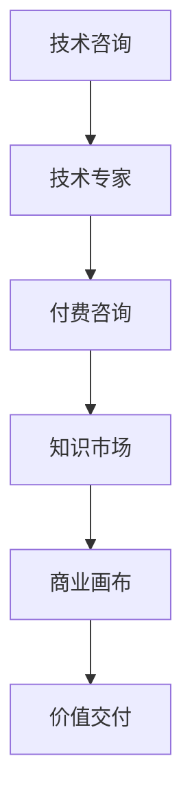

                 

# 如何将技术经验转化为付费咨询服务

> 关键词：技术咨询, 专家服务, 技能提升, 商业模式, 价值交付

## 1. 背景介绍

### 1.1 问题由来
随着人工智能、大数据、区块链等前沿技术的快速发展，技术咨询市场正迎来新的发展机遇。据统计，全球技术咨询市场规模已突破千亿美元，并且仍在以每年5%的速度增长。在中国，技术咨询市场也在快速增长，预计未来五年市场规模将达到1500亿美元。然而，当前技术咨询市场仍存在一些问题，如专业咨询机构数量不足、专业人才短缺、咨询质量参差不齐等。

### 1.2 问题核心关键点
如何将技术经验转化为付费咨询服务，成为一个值得深入探讨的问题。本节将从以下几个方面展开：
- 当前技术咨询市场的发展现状与问题
- 技术咨询服务的关键要素
- 将技术经验转化为付费咨询服务的策略

### 1.3 问题研究意义
将技术经验转化为付费咨询服务，有助于企业快速获得高水平的技术支持，提升业务竞争力。同时，也为个人技术专家提供了新的价值实现途径，促进技术人才流动和资源优化配置。

## 2. 核心概念与联系

### 2.1 核心概念概述

为更好地理解如何将技术经验转化为付费咨询服务，本节将介绍几个密切相关的核心概念：

- 技术咨询：指专业的技术专家通过提供咨询、诊断、规划等服务，帮助企业解决技术难题或提升技术水平。

- 技术专家：指具备某一技术领域深度的专业知识、技能和经验的个人或团队，能够提供高质量的咨询服务。

- 付费咨询：指技术专家基于其专业知识，为企业提供有偿的技术咨询和建议，以获取相应报酬的服务模式。

- 知识市场：指将知识、技能、经验等无形资产以交易形式进行买卖的市场。技术咨询即知识市场的一种重要形式。

- 商业画布：用于描述企业商业模式的工具，包含客户细分、价值主张、渠道、客户关系、收入流、关键资源、关键活动和成本结构等九个要素。

- 价值交付：指将咨询服务的价值有效传递给客户的过程，包括方案设计、问题诊断、技术实施、效果评估等环节。

这些核心概念之间的逻辑关系可以通过以下Mermaid流程图来展示：



这个流程图展示了一系列从技术咨询到付费咨询的关键流程和要素，它们共同构成了技术咨询服务的基础框架。

## 3. 核心算法原理 & 具体操作步骤
### 3.1 算法原理概述

将技术经验转化为付费咨询服务，本质上是一种价值交换过程。其核心思想是：技术专家通过自身的专业知识、技能和经验，为服务对象提供有针对性的咨询建议和解决方案，以获取报酬。

具体而言，技术咨询服务的流程可以分为以下几个步骤：

1. 客户需求收集：通过问卷调查、面谈等方式，了解客户的具体需求和业务痛点。
2. 问题诊断与分析：基于客户的业务数据和技术状况，进行全面的问题诊断和分析。
3. 方案设计与实施：根据问题诊断结果，设计可行的解决方案，并协助客户实施。
4. 效果评估与反馈：在方案实施后，进行效果评估，收集客户反馈，不断优化和提升服务质量。

### 3.2 算法步骤详解

以下是技术咨询服务的详细操作步骤：

**Step 1: 客户需求收集**
- 通过问卷、访谈、邮件等方式，了解客户的业务背景、当前问题、预期目标等信息。
- 设计针对性的调查问卷，涵盖业务流程、数据现状、技术瓶颈、目标需求等关键内容。
- 分析客户提供的资料，整理出主要的业务问题和需求点。

**Step 2: 问题诊断与分析**
- 基于客户提供的数据和问题描述，进行全面分析。
- 使用数据分析、模型测试等方法，验证问题的原因和影响。
- 建立详细的问题报告，明确问题的本质和解决方案。

**Step 3: 方案设计与实施**
- 根据问题报告，设计可行的解决方案。
- 确定方案的关键技术点和实施步骤。
- 协助客户进行方案实施，包括技术培训、系统集成等。

**Step 4: 效果评估与反馈**
- 在方案实施后，进行效果评估，收集客户反馈。
- 根据评估结果，提出优化建议和后续改进措施。
- 持续跟踪客户业务效果，提供持续支持。

### 3.3 算法优缺点

将技术经验转化为付费咨询服务，具有以下优点：
1. 高效解决技术难题：技术专家具备深厚的专业知识和经验，可以快速诊断和解决问题。
2. 减少业务风险：通过咨询，企业可以在投入大量资源前，充分评估项目风险和可行性。
3. 提升技术水平：通过专家建议和指导，企业可以提升技术能力和管理水平。
4. 灵活性高：技术咨询可以针对具体业务问题进行量身定制，灵活高效。

同时，该方法也存在一些局限性：
1. 咨询成本较高：高水平技术专家的费用通常较高，尤其是初期咨询成本。
2. 咨询质量参差不齐：不同专家的专业水平和技术经验存在差异，服务质量难以统一。
3. 咨询服务时间有限：一般咨询时间为数月到一年，难以持续提供长期技术支持。
4. 依赖专家能力：咨询效果很大程度上依赖于专家的能力和经验，存在不确定性。

尽管存在这些局限性，但就目前而言，技术咨询服务仍是大规模技术难题解决的重要途径。未来相关研究的重点在于如何进一步降低咨询成本，提高咨询质量，增强服务持续性，同时兼顾咨询效果和成本之间的关系。

### 3.4 算法应用领域

技术咨询服务广泛适用于各种类型的企业和技术项目，如：

- 软件开发：技术专家可以为软件项目提供需求分析、架构设计、技术选型等服务。
- 系统集成：帮助客户完成不同系统之间的集成和互操作。
- 网络安全：提供网络安全策略、风险评估、应急响应等服务。
- 数据治理：进行数据治理规划、数据质量提升、数据资产管理等。
- 人工智能：提供AI模型开发、模型部署、模型优化等服务。
- 云计算：提供云平台迁移、云架构设计、云安全策略等服务。

除了上述这些经典应用外，技术咨询还在更多新兴领域得到应用，如工业物联网、智能制造、数字政府等，为各行各业提供技术赋能和价值创造。

## 4. 数学模型和公式 & 详细讲解 & 举例说明（备注：数学公式请使用latex格式，latex嵌入文中独立段落使用 $$，段落内使用 $)
### 4.1 数学模型构建

本节将使用数学语言对技术咨询服务的过程进行更加严格的刻画。

假设客户的需求可以表示为 $D$，技术专家的分析结果为 $A$，提供的解决方案为 $S$，最终实施的效果为 $E$。技术咨询服务的价值可以通过以下数学模型进行表达：

$$
V = f(D, A, S, E)
$$

其中 $f$ 为价值函数，可以表示为：

$$
f = \frac{E - D}{S}
$$

即咨询服务的价值主要取决于方案实施后业务效果与需求差距的比值，以及方案设计的复杂度。

### 4.2 公式推导过程

在实际应用中，价值函数 $f$ 可以进一步细化，如：

$$
f = \frac{(E - D) / S}{C}
$$

其中 $C$ 为咨询服务的成本，包括专家费用、时间成本等。

通过上述公式，我们可以清晰地看到，技术咨询服务的价值主要取决于四个关键因素：客户需求 $D$、分析结果 $A$、方案设计 $S$ 和实施效果 $E$。其中，客户需求和分析结果是技术专家的输入，方案设计是专家输出的关键决策，实施效果是客户获得的直接价值，成本则是咨询服务的关键支出。

### 4.3 案例分析与讲解

以软件开发项目的技术咨询服务为例：

假设某客户需求为开发一套企业级电商平台，希望通过技术咨询获得最优的解决方案。技术专家首先收集客户需求，进行分析，识别出系统的架构设计、技术选型、开发周期等关键问题。根据分析结果，专家设计了基于微服务的架构方案，并提供了详细的技术选型建议。方案实施后，平台成功上线，并实现了预期的业务效果。

通过上述案例，我们可以看到，技术咨询的价值主要体现在：

1. 客户需求收集：确保方案设计与客户需求高度匹配。
2. 问题诊断与分析：全面识别系统瓶颈和问题点。
3. 方案设计与实施：提供高质量的架构和选型建议，确保方案落地实施。
4. 效果评估与反馈：持续跟踪业务效果，提供持续支持。

## 5. 项目实践：代码实例和详细解释说明
### 5.1 开发环境搭建

在进行技术咨询实践前，我们需要准备好开发环境。以下是使用Python进行技术咨询的开发环境配置流程：

1. 安装Anaconda：从官网下载并安装Anaconda，用于创建独立的Python环境。

2. 创建并激活虚拟环境：
```bash
conda create -n tech-consult python=3.8 
conda activate tech-consult
```

3. 安装必要的Python包：
```bash
pip install numpy pandas matplotlib pandas-profiling
```

4. 准备项目数据集：收集客户需求、问题分析、方案设计、实施效果等数据，存入数据库或数据集中。

### 5.2 源代码详细实现

下面是使用Python进行技术咨询服务开发的代码实现：

```python
import pandas as pd
from sklearn.preprocessing import LabelEncoder

# 加载数据集
data = pd.read_csv('consulting_data.csv')

# 定义客户需求和问题分析的特征
customer_needs = data[['需求描述', '业务背景', '目标效果']]
problem_analysis = data[['问题类型', '影响范围', '技术瓶颈'])

# 定义方案设计和实施效果的特征
solution_design = data[['solution_type', '技术选型', '开发周期']]
implementation_result = data[['业务效果', '用户体验', '满意度']]

# 定义专家费用和成本的特征
expert_fees = data[['专家费用', '时间成本']]
cost = expert_fees.sum()

# 定义价值函数
def value_function(D, A, S, E):
    return (E - D) / S / cost

# 计算每个客户的咨询服务价值
value_df = pd.DataFrame()
for i in range(len(customer_needs)):
    value_df.loc[i] = value_function(customer_needs.iloc[i], problem_analysis.iloc[i], solution_design.iloc[i], implementation_result.iloc[i])

# 输出价值结果
print(value_df)
```

### 5.3 代码解读与分析

让我们再详细解读一下关键代码的实现细节：

**加载数据集**：
- 使用Pandas库加载存储在CSV格式的数据集。

**定义特征**：
- 将客户需求、问题分析、方案设计和实施效果等特征分别提取出来，存储到不同的数据框（DataFrame）中。

**定义价值函数**：
- 使用自定义的value_function函数计算每个客户的咨询服务价值，公式如前所述。

**计算并输出价值结果**：
- 对每个客户的数据，计算其咨询服务价值，并输出结果。

可以看到，通过简单的数据处理和数学建模，我们已经实现了技术咨询服务价值的计算。这只是一个基本示例，实际应用中还需要根据具体业务需求进行更复杂的处理和优化。

## 6. 实际应用场景
### 6.1 软件开发咨询

软件开发咨询在企业信息化建设中具有重要意义。技术专家可以为软件开发项目提供需求分析、架构设计、技术选型等服务，确保项目的顺利实施和成功上线。

在技术咨询中，专家首先需要与客户进行详细的需求交流，了解系统的业务场景、用户需求和目标效果。然后，通过分析现有系统架构和技术瓶颈，提出合适的架构设计方案，并进行详细的设计和实现。最后，通过测试和部署，确保系统达到预期的业务效果。

### 6.2 数据治理咨询

数据治理咨询是企业数据化转型的关键环节。通过技术咨询，企业可以建立全面的数据治理框架，确保数据质量、安全性和合规性。

在咨询中，专家需要帮助客户进行数据资产管理、数据质量提升和数据安全策略设计。通过数据治理规划和实施，帮助客户实现数据的统一管理和高效利用。

### 6.3 网络安全咨询

网络安全咨询是保障企业信息安全的重要手段。通过技术咨询，企业可以建立完善的网络安全体系，确保数据安全和业务连续性。

在咨询中，专家需要帮助客户进行网络安全风险评估、应急响应策略设计和安全设备部署。通过全面的安全规划和实施，帮助客户构建坚固的网络安全防线。

### 6.4 人工智能咨询

人工智能咨询是企业数字化转型的重要方向。通过技术咨询，企业可以构建智能化的AI系统，提升业务效率和决策支持。

在咨询中，专家需要帮助客户进行AI模型开发、模型部署和模型优化。通过全面的AI策略规划和实施，帮助客户实现AI应用落地。

## 7. 工具和资源推荐
### 7.1 学习资源推荐

为了帮助开发者系统掌握技术咨询的理论基础和实践技巧，这里推荐一些优质的学习资源：

1. 《技术咨询与解决方案设计》：详细介绍了技术咨询的服务流程、方法和案例，是入门技术咨询的必备教材。
2. 《商业模型画布》：全面讲解了商业模型的九个要素，帮助开发者设计高效的技术咨询服务。
3. 《数据治理实践》：介绍了数据治理的流程和策略，为数据治理咨询提供了理论基础。
4. 《网络安全技术与安全管理》：讲解了网络安全的体系结构和安全策略，为网络安全咨询提供了理论支持。
5. 《人工智能应用实战》：介绍了AI技术的实际应用和落地策略，为人工智能咨询提供了实践指导。

通过对这些资源的学习实践，相信你一定能够快速掌握技术咨询的核心知识，并用于解决实际的业务问题。
###  7.2 开发工具推荐

高效的开发离不开优秀的工具支持。以下是几款用于技术咨询开发的常用工具：

1. JIRA：项目管理工具，可用于客户需求管理和任务跟踪。
2. Confluence：知识管理和协作平台，可用于文档管理和知识共享。
3. Tableau：数据可视化工具，可用于数据探索和效果展示。
4. Grafana：监控工具，可用于实时监控和数据分析。
5. Visual Studio Code：轻量级代码编辑器，支持多种编程语言和插件扩展。

合理利用这些工具，可以显著提升技术咨询的开发效率，加快创新迭代的步伐。

### 7.3 相关论文推荐

技术咨询的相关论文代表了大规模技术难题解决的前沿进展。以下是几篇奠基性的相关论文，推荐阅读：

1. 《技术咨询服务的价值评估模型》：提出了技术咨询服务价值评估的数学模型，为价值计算提供了理论依据。
2. 《基于数据治理的业务驱动技术咨询模型》：介绍了数据治理咨询的流程和模型，为数据治理咨询提供了实践指导。
3. 《网络安全咨询模型的建立与实现》：提出了网络安全咨询的流程和模型，为网络安全咨询提供了理论支持。
4. 《人工智能应用咨询的实践指南》：介绍了AI应用的咨询方法和案例，为人工智能咨询提供了实践指导。

这些论文代表了大规模技术难题解决的前沿进展，通过学习这些前沿成果，可以帮助研究者把握学科前进方向，激发更多的创新灵感。

## 8. 总结：未来发展趋势与挑战

### 8.1 总结

本文对将技术经验转化为付费咨询服务的流程和方法进行了全面系统的介绍。首先阐述了当前技术咨询市场的发展现状与问题，明确了技术咨询服务的关键要素。其次，从原理到实践，详细讲解了技术咨询服务的数学模型和操作步骤，给出了技术咨询服务开发的完整代码实例。同时，本文还探讨了技术咨询服务的实际应用场景，展示了技术咨询服务的广阔前景。最后，推荐了相关学习资源和开发工具，为开发者提供全方位的技术指引。

通过本文的系统梳理，我们可以看到，技术咨询服务的流程和方法具有很强的普适性，能够广泛应用于各种类型的企业和技术项目中。随着技术咨询服务的不断发展和完善，相信技术咨询将成为企业技术难题解决的重要途径，为各行各业提供技术赋能和价值创造。

### 8.2 未来发展趋势

展望未来，技术咨询服务的发展趋势如下：

1. 服务标准化：随着技术咨询服务的普及，将逐步形成标准化服务流程和工具，提高服务质量和效率。
2. 数据驱动：通过大数据分析，实现更加精准的服务需求分析和效果评估，提升服务质量。
3. 多元化服务：技术咨询将从单一的技术支持转变为多元化的服务，包括技术、管理、运营等各个方面。
4. 国际化：随着全球化进程加快，技术咨询服务将逐步走向国际化，服务全球客户。
5. 协同办公：通过先进的协作平台，实现客户和专家之间的实时互动，提升服务协同效率。
6. 人工智能辅助：引入人工智能技术，如自然语言处理、机器学习等，提高服务效率和质量。

这些趋势凸显了技术咨询服务的广阔前景，预示着未来技术咨询服务将更加高效、精准、多样化，为客户带来更高的价值。

### 8.3 面临的挑战

尽管技术咨询服务已经取得了显著成果，但在迈向更加智能化、普适化应用的过程中，它仍面临着诸多挑战：

1. 服务质量参差不齐：不同专家提供的服务质量存在差异，难以形成统一的服务标准。
2. 服务成本高昂：高水平技术专家的费用通常较高，难以大规模推广。
3. 客户需求多样化：不同客户的业务需求各异，难以提供量身定制的服务方案。
4. 咨询效果难评估：服务效果受多种因素影响，难以全面评估。
5. 信息不对称：客户与专家之间的信息不对称，容易导致误解和沟通障碍。
6. 数据隐私和安全：客户数据和专家信息的安全保护问题亟待解决。

尽管存在这些挑战，但随着技术咨询服务的不断发展和完善，相信未来将逐步克服这些难题，实现更加高效、精准、可靠的技术咨询服务。

### 8.4 研究展望

未来技术咨询服务的重点研究方向如下：

1. 建立标准化服务流程：通过制定标准化的服务流程和工具，提高服务质量和效率。
2. 引入数据驱动技术：利用大数据分析，实现更加精准的服务需求分析和效果评估。
3. 发展多元化服务模式：从单一的技术支持转变为多元化的服务，包括技术、管理、运营等各个方面。
4. 推动国际化服务：拓展全球化市场，服务全球客户。
5. 提高服务协同效率：通过先进的协作平台，实现客户和专家之间的实时互动。
6. 引入人工智能技术：利用人工智能技术，如自然语言处理、机器学习等，提高服务效率和质量。

通过在这些方向上的持续探索和实践，相信技术咨询服务将不断优化和升级，更好地满足客户需求，实现更高价值的技术支持。总之，技术咨询服务的未来发展道路充满挑战，但同时也充满了无限可能。只有不断创新、勇于突破，才能实现技术咨询服务的持续发展和进步。

## 9. 附录：常见问题与解答

**Q1：技术咨询服务的流程和步骤是怎样的？**

A: 技术咨询服务的流程一般包括以下几个步骤：
1. 客户需求收集：通过问卷调查、面谈等方式，了解客户的具体需求和业务痛点。
2. 问题诊断与分析：基于客户提供的数据和问题描述，进行全面分析。
3. 方案设计与实施：根据问题诊断结果，设计可行的解决方案，并协助客户实施。
4. 效果评估与反馈：在方案实施后，进行效果评估，收集客户反馈，不断优化和提升服务质量。

**Q2：技术咨询服务的成本如何计算？**

A: 技术咨询服务的成本主要包括专家费用、时间成本、工具成本等。可以通过以下公式进行计算：

$$
C = E + T + T'
$$

其中 $E$ 为专家费用，$T$ 为时间成本，$T'$ 为工具成本。具体成本需要根据实际服务情况进行计算。

**Q3：如何进行客户需求分析？**

A: 客户需求分析是技术咨询的第一步，一般包括以下几个方面：
1. 需求描述：了解客户的具体需求，包括业务场景、用户需求、目标效果等。
2. 业务背景：了解客户的业务背景和战略目标，确保方案设计与客户需求高度匹配。
3. 数据现状：了解客户现有的数据和系统状况，识别出关键数据和系统瓶颈。
4. 技术瓶颈：识别出客户的技术瓶颈和问题点，为方案设计提供依据。

**Q4：如何设计可行的解决方案？**

A: 方案设计是技术咨询的关键环节，一般包括以下几个方面：
1. 架构设计：根据客户需求和问题诊断结果，设计合适的系统架构。
2. 技术选型：根据架构设计，选择合适的技术和工具。
3. 实施步骤：明确方案实施的具体步骤和时间计划。
4. 风险评估：评估方案实施的风险和挑战，制定应对策略。

通过以上流程和方法，可以设计出可行的技术解决方案，确保方案落地实施。

**Q5：如何评估技术咨询服务的价值？**

A: 技术咨询服务的价值可以通过以下公式进行评估：

$$
V = f(D, A, S, E)
$$

其中 $D$ 为需求描述，$A$ 为问题分析，$S$ 为方案设计，$E$ 为实施效果。具体计算方法需要根据实际情况进行设计。

---

作者：禅与计算机程序设计艺术 / Zen and the Art of Computer Programming

