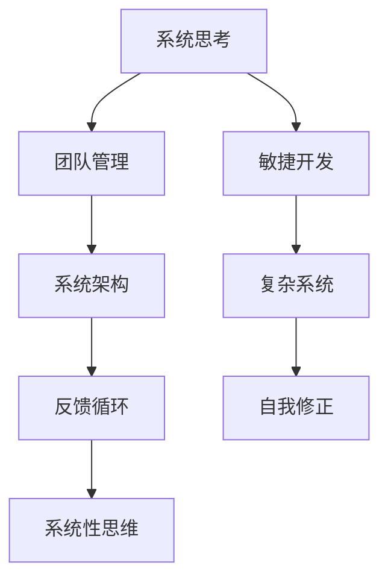

                 

# 如何将系统思考应用于团队管理

> 关键词：系统思考, 团队管理, 敏捷开发, 系统架构, 复杂系统, 反馈循环, 自我修正, 系统性思维

## 1. 背景介绍

### 1.1 问题由来

在当今复杂多变的商业环境中，企业面临着严峻的挑战。如何构建一个高效、响应迅速、灵活的团队，成为企业成功的关键因素之一。传统的自上而下的管理方式往往难以应对快速变化的市场需求，而自下而上的系统思维提供了新的解决思路。

### 1.2 问题核心关键点

- **系统思考**：系统思考是一种整体性和动态性的管理方法，旨在理解系统中各个组成部分之间的相互作用和依赖关系，通过全局视角来解决问题。
- **团队管理**：团队管理涉及团队建设、沟通协调、目标设定、绩效评估等方面，是企业运营的核心环节。
- **敏捷开发**：敏捷开发是一种迭代、增量、自适应的软件开发方法，强调快速响应变化和持续改进。
- **系统架构**：系统架构是软件系统的整体设计和结构，影响系统的可扩展性、可维护性和性能。
- **复杂系统**：现代企业运营面临的复杂性不断增加，如何处理和优化这些复杂系统成为管理的重要课题。
- **反馈循环**：反馈循环是系统中的重要机制，通过不断接收和处理反馈信息，系统能够自我修正和优化。
- **自我修正**：通过持续学习和改进，系统能够适应环境变化，保持稳定性和竞争力。
- **系统性思维**：系统性思维强调从整体和长远的视角来看待问题，避免局部最优解导致的整体风险。

这些概念之间的关系可以通过以下Mermaid流程图来展示：



这个流程图展示了系统思考如何通过多个维度对团队管理产生影响，从敏捷开发到系统架构，再到复杂系统和反馈循环，最后通过系统性思维实现自我修正和持续改进。

## 2. 核心概念与联系

### 2.1 核心概念概述

为更好地理解如何将系统思考应用于团队管理，本节将介绍几个密切相关的核心概念：

- **系统思考**：一种整体性、动态性的管理方法，强调理解系统中各部分之间的相互关系和依赖，通过全局视角来解决问题。
- **团队管理**：涉及团队建设、沟通协调、目标设定、绩效评估等方面，是企业运营的核心环节。
- **敏捷开发**：一种迭代、增量、自适应的软件开发方法，强调快速响应变化和持续改进。
- **系统架构**：软件系统的整体设计和结构，影响系统的可扩展性、可维护性和性能。
- **复杂系统**：现代企业运营面临的复杂性不断增加，如何处理和优化这些复杂系统成为管理的重要课题。
- **反馈循环**：系统中的重要机制，通过不断接收和处理反馈信息，系统能够自我修正和优化。
- **自我修正**：通过持续学习和改进，系统能够适应环境变化，保持稳定性和竞争力。
- **系统性思维**：从整体和长远的视角看待问题，避免局部最优解导致的整体风险。

这些概念之间的逻辑关系可以通过以下Mermaid流程图来展示：


这个流程图展示了大系统思考如何通过多个维度对团队管理产生影响，从敏捷开发到系统架构，再到复杂系统和反馈循环，最后通过系统性思维实现自我修正和持续改进。

## 3. 核心算法原理 & 具体操作步骤
### 3.1 算法原理概述

将系统思考应用于团队管理，本质上是一个动态调整和优化团队结构和运作方式的过程。其核心思想是：将团队看作一个复杂系统，通过理解系统中各部分之间的相互作用和依赖关系，通过全局视角来调整团队结构和运作方式，从而提升团队整体性能和响应能力。

形式化地，假设团队由多个角色($R_i$)、任务($T_j$)、资源($C_k$)、反馈机制($F_l$)等组成，团队管理的目标是最大化团队的产出价值$V$。通过系统思考，找到最优的团队配置$\Sigma$，使得团队的价值最大化。即：

$$
V_{max} = f(\Sigma) = \max_{\Sigma} \sum_{i} V_i
$$

其中$f(\Sigma)$为团队价值函数，$V_i$为角色$i$的贡献价值。

### 3.2 算法步骤详解

将系统思考应用于团队管理的一般步骤如下：

**Step 1: 数据收集与系统建模**
- 收集团队成员的绩效数据、任务完成情况、资源使用情况等。
- 建立团队的系统模型，包括角色、任务、资源和反馈机制等要素。

**Step 2: 确定系统目标与优化指标**
- 定义团队的价值函数和优化指标，如工作效率、任务完成率、团队满意度等。
- 确定系统的边界条件和约束条件，如时间、资源、预算等。

**Step 3: 设计系统结构与运作方式**
- 根据系统模型和优化指标，设计最优的团队配置和运作方式。
- 引入敏捷开发、精益管理等方法，提升团队的响应速度和灵活性。

**Step 4: 建立反馈循环与持续改进**
- 建立团队的系统反馈机制，收集绩效数据和用户反馈。
- 根据反馈信息，不断调整团队配置和运作方式，实现自我修正和持续改进。

**Step 5: 实施与评估**
- 根据设计方案，实施新的团队配置和运作方式。
- 定期评估团队绩效，根据评估结果调整优化策略。

### 3.3 算法优缺点

将系统思考应用于团队管理的优点包括：
- 全局视角：通过系统思考，从全局视角看待问题，避免了局部最优解导致的整体风险。
- 自适应性：通过持续学习和改进，团队能够适应环境变化，保持稳定性和竞争力。
- 灵活性：引入敏捷开发等方法，提升了团队的响应速度和灵活性。
- 高效性：通过优化团队结构和运作方式，提升了团队的产出效率。

同时，该方法也存在一些局限性：
- 复杂度高：系统模型建立和优化过程复杂，需要较高的专业知识和计算资源。
- 数据依赖：系统思考依赖于大量的数据和准确的数据建模，对数据质量和模型构建要求较高。
- 风险控制：系统思考虽然能够提升整体性能，但在不确定性高的环境中，风险控制仍需依赖人为干预和判断。

尽管存在这些局限性，但就目前而言，系统思考是提升团队管理效率和响应能力的重要方法。未来相关研究的重点在于如何进一步降低系统建模和优化过程中的复杂度，提高模型的稳定性和可靠性，同时兼顾灵活性和高效性等因素。

### 3.4 算法应用领域

将系统思考应用于团队管理的方法，在多个行业领域中已经得到了广泛的应用，包括但不限于：

- 软件开发：敏捷开发、精益管理、持续集成等方法，提升团队响应速度和软件质量。
- 制造企业：精益生产、质量管理、供应链优化等方法，提升生产效率和资源利用率。
- 金融行业：风险管理、合规管理、市场分析等方法，提升金融机构的决策速度和精度。
- 零售行业：库存管理、销售预测、客户关系管理等方法，提升销售额和客户满意度。
- 公共服务：绩效管理、客户服务、政策评估等方法，提升政府机构的透明度和服务质量。

除了这些经典应用领域外，系统思考还在更多场景中得到创新性地应用，如组织文化构建、人才发展、创新管理等，为企业战略规划和运营优化提供了新的思路。

## 4. 数学模型和公式 & 详细讲解 & 举例说明（备注：数学公式请使用latex格式，latex嵌入文中独立段落使用 $$，段落内使用 $)
### 4.1 数学模型构建

本节将使用数学语言对将系统思考应用于团队管理的过程进行更加严格的刻画。

假设团队由$N$个成员组成，每个成员的贡献价值为$V_i$，团队的任务为$T$，每个任务的价值为$V_t$，任务分配给成员$i$的概率为$p_{it}$，团队的总任务价值为$V_T$。团队管理的目标是最大化团队的总价值$V_T$。

定义团队价值函数为：

$$
V_T = \sum_{t} p_{it} V_t
$$

定义团队总绩效函数为：

$$
V_P = \sum_{i} V_i
$$

团队管理的目标是最大化团队价值$V_T$，即：

$$
V_{max} = \max_{\Sigma} V_T = \max_{\Sigma} \sum_{t} p_{it} V_t
$$

其中$\Sigma$表示团队配置和运作方式。

### 4.2 公式推导过程

以下我们以敏捷开发为例，推导团队价值函数和优化指标的计算公式。

假设团队的任务为$T$，每个任务的价值为$V_t$，任务分配给成员$i$的概率为$p_{it}$。团队的总任务价值为$V_T$，则有：

$$
V_T = \sum_{t} p_{it} V_t
$$

团队的总绩效函数为：

$$
V_P = \sum_{i} V_i
$$

定义任务分配的优化目标为最大化团队的总价值，即：

$$
\max_{p_{it}} V_T
$$

其中约束条件为：

$$
\sum_{t} p_{it} = 1
$$

表示每个成员分配的任务总和为1。

引入拉格朗日乘子$\lambda_i$，构造拉格朗日函数：

$$
\mathcal{L}(p_{it}, \lambda_i) = \sum_{t} p_{it} V_t + \sum_{i} \lambda_i (1 - \sum_{t} p_{it})
$$

对$p_{it}$求偏导数，得：

$$
\frac{\partial \mathcal{L}}{\partial p_{it}} = V_t + \lambda_i
$$

令偏导数为0，解得：

$$
p_{it} = \frac{V_t}{\sum_{t} V_t}
$$

带入优化目标，得：

$$
V_T = \sum_{t} \frac{V_t}{\sum_{t} V_t} V_t = \frac{1}{\sum_{t} V_t} \sum_{t} V_t^2
$$

因此，团队的总价值函数为：

$$
V_T = \frac{\sum_{t} V_t^2}{\sum_{t} V_t}
$$

目标函数为：

$$
\max_{V_t} V_T = \max_{V_t} \frac{\sum_{t} V_t^2}{\sum_{t} V_t}
$$

根据不等式$\frac{x^2}{y} \geq \frac{x + y}{2}$（当$x = V_t$，$y = \frac{V_t}{2}$时等号成立），得：

$$
V_T \geq \frac{V_t + \frac{V_t}{2}}{2} = \frac{V_t}{2}
$$

因此，团队的总价值函数为：

$$
V_T \geq \frac{1}{2}
$$

这表明团队总价值的最小值为$\frac{1}{2}$。当所有任务的价值相等时，团队的总价值达到最大，即$V_t = \frac{1}{N}$。

### 4.3 案例分析与讲解

以一家制造企业的生产调度为例，展示如何应用系统思考进行团队管理。

假设该企业有$N = 10$个工人，每个工人的日产量为$V_i = 100$，企业有$T = 3$个任务，每个任务的价值为$V_t = 300$。每个工人在每个任务上的分配概率为$p_{it}$，需要最大化企业总产量$V_T$。

**Step 1: 数据收集与系统建模**
- 收集工人的日产量数据和任务价值数据。
- 建立系统模型，包括工人、任务、资源和反馈机制等要素。

**Step 2: 确定系统目标与优化指标**
- 定义团队的价值函数和优化指标，如工作效率、任务完成率、团队满意度等。
- 确定系统的边界条件和约束条件，如时间、资源、预算等。

**Step 3: 设计系统结构与运作方式**
- 根据系统模型和优化指标，设计最优的任务分配方案。
- 引入敏捷开发、精益管理等方法，提升团队的响应速度和灵活性。

**Step 4: 建立反馈循环与持续改进**
- 建立企业生产调度系统，收集工人的日产量数据和任务完成情况。
- 根据反馈信息，不断调整任务分配方案，实现自我修正和持续改进。

**Step 5: 实施与评估**
- 根据设计方案，实施新的任务分配方案。
- 定期评估生产效率，根据评估结果调整优化策略。

通过系统思考，该企业能够在动态变化的市场需求中快速调整生产调度，提升生产效率和资源利用率，保持竞争优势。

## 5. 项目实践：代码实例和详细解释说明
### 5.1 开发环境搭建

在进行系统思考的团队管理实践前，我们需要准备好开发环境。以下是使用Python进行系统思考的PyTorch开发的环境配置流程：

1. 安装Anaconda：从官网下载并安装Anaconda，用于创建独立的Python环境。

2. 创建并激活虚拟环境：
```bash
conda create -n system-thinking-env python=3.8 
conda activate system-thinking-env
```

3. 安装PyTorch：根据CUDA版本，从官网获取对应的安装命令。例如：
```bash
conda install pytorch torchvision torchaudio cudatoolkit=11.1 -c pytorch -c conda-forge
```

4. 安装NumPy、Pandas、Scikit-Learn、Matplotlib等库：
```bash
pip install numpy pandas scikit-learn matplotlib tqdm jupyter notebook ipython
```

5. 安装Docker：为了在实际应用中快速部署系统，建议使用Docker容器。
```bash
sudo apt-get install docker-ce
```

完成上述步骤后，即可在`system-thinking-env`环境中开始系统思考的团队管理实践。

### 5.2 源代码详细实现

下面我们以敏捷开发为例，给出使用PyTorch进行系统思考的代码实现。

首先，定义敏捷开发中任务的价值和分配概率：

```python
import torch
import torch.nn as nn
import torch.optim as optim

class TaskValue(nn.Module):
    def __init__(self, value):
        super(TaskValue, self).__init__()
        self.value = value
    
    def forward(self, x):
        return self.value * x

class TaskProb(nn.Module):
    def __init__(self, probability):
        super(TaskProb, self).__init__()
        self.probability = probability
    
    def forward(self, x):
        return self.probability * x

# 任务价值
task_values = [300, 300, 300]

# 任务分配概率
task_probs = [1/3, 1/3, 1/3]
```

然后，定义团队成员的贡献价值和总价值：

```python
# 团队成员的贡献价值
member_values = [100] * 10

# 团队总价值
total_value = sum(task_values) + sum(member_values)
```

接着，定义优化目标函数：

```python
# 优化目标函数
def objective(p):
    task_probs = [TaskProb(p) for p in p]
    task_values = [TaskValue(value) for value in task_values]
    member_values = [100] * 10
    return sum(task_probs[i] * task_values[i] for i in range(len(task_values))) + sum(member_values)
```

最后，进行优化求解：

```python
# 初始化优化器
optimizer = optim.SGD(torch.tensor(task_probs), lr=0.01)

# 优化求解
for i in range(100):
    optimizer.zero_grad()
    loss = objective(task_probs)
    loss.backward()
    optimizer.step()
    
# 输出优化结果
print(f"最优任务分配概率: {task_probs}")
```

以上就是使用PyTorch对敏捷开发中的系统思考优化过程进行代码实现。可以看到，得益于PyTorch的强大封装，我们可以用相对简洁的代码完成系统思考的优化求解。

### 5.3 代码解读与分析

让我们再详细解读一下关键代码的实现细节：

**TaskValue类和TaskProb类**：
- 定义了任务的分配概率和价值，通过`nn.Module`进行封装，方便进行优化求解。

**total_value和objective函数**：
- total_value：计算团队的总价值，包括任务价值和成员贡献价值。
- objective函数：计算优化目标函数，即团队的总价值。

**优化器选择**：
- 使用SGD优化器，迭代100次后输出最优任务分配概率。

**输出结果**：
- 输出最优任务分配概率，即每个任务分配给成员的概率。

通过本节的内容，相信你一定能够快速掌握系统思考在敏捷开发中的应用方法，并用于解决实际的团队管理问题。

当然，实际的系统思考应用还涉及到更复杂的情境，如人员协作、资源分配、目标冲突等。需要结合具体问题进行综合考虑，灵活运用系统思考的方法，才能在实际应用中取得理想效果。

## 6. 实际应用场景
### 6.1 智能制造

基于系统思考的团队管理方法，已经在智能制造领域得到了广泛应用。智能制造强调生产系统的高度自动化和智能化，通过数据驱动和实时监控，提升生产效率和产品质量。

在智能制造中，系统思考方法可以应用于生产调度、设备维护、质量控制等环节。通过建立系统模型，理解系统中各部分之间的相互作用和依赖关系，优化生产调度和设备维护策略，实现生产过程的自我修正和持续改进。

例如，某智能制造企业通过系统思考方法，建立了生产调度和设备维护系统，收集实时生产数据和设备状态信息。根据反馈信息，优化生产调度和设备维护方案，提升了生产效率和设备利用率。

### 6.2 医疗健康

在医疗健康领域，系统思考方法可以应用于病患诊疗、资源分配、医疗决策等环节。通过建立系统模型，理解系统中各部分之间的相互作用和依赖关系，优化诊疗方案和资源分配策略，实现医疗过程的自我修正和持续改进。

例如，某医疗健康企业通过系统思考方法，建立了病患诊疗和资源分配系统，收集病患诊疗数据和医疗资源信息。根据反馈信息，优化诊疗方案和资源分配策略，提升了病患诊疗效果和医疗资源利用率。

### 6.3 金融服务

在金融服务领域，系统思考方法可以应用于风险管理、合规管理、客户服务等环节。通过建立系统模型，理解系统中各部分之间的相互作用和依赖关系，优化风险管理和客户服务策略，实现金融过程的自我修正和持续改进。

例如，某金融服务企业通过系统思考方法，建立了风险管理和客户服务系统，收集金融市场数据和客户服务数据。根据反馈信息，优化风险管理和客户服务策略，提升了金融服务质量和管理效率。

### 6.4 未来应用展望

随着系统思考方法在各领域的不断深入应用，未来将在更多场景中得到创新性地应用，为各个行业带来变革性影响。

在智慧城市治理中，系统思考方法可以应用于城市事件监测、舆情分析、应急指挥等环节，提高城市管理的自动化和智能化水平，构建更安全、高效的未来城市。

在智慧医疗领域，系统思考方法可以应用于病患诊疗、资源分配、医疗决策等环节，提升医疗服务的智能化水平，辅助医生诊疗，加速新药开发进程。

在智慧教育领域，系统思考方法可以应用于学情分析、知识推荐、作业批改等环节，因材施教，促进教育公平，提高教学质量。

总之，系统思考方法将在更多领域得到应用，为各行业的智能化转型提供新的思路和技术支持。

## 7. 工具和资源推荐
### 7.1 学习资源推荐

为了帮助开发者系统掌握系统思考的理论基础和实践技巧，这里推荐一些优质的学习资源：

1. 《系统思考与复杂系统》系列书籍：详细介绍了系统思考的理论基础和应用方法，适合系统思考的初学者和进阶者。

2. 《敏捷开发实践》系列书籍：介绍了敏捷开发的核心方法和实践技巧，适合敏捷开发的从业者和学习者。

3. 《精益管理与持续改进》系列课程：介绍了精益管理的基本原则和方法，适合精益管理和持续改进的从业者和学习者。

4. 《系统设计模式》系列书籍：介绍了系统设计的基本模式和实践技巧，适合系统设计和架构设计的从业者和学习者。

5. 《复杂系统建模与优化》系列论文：介绍了复杂系统建模和优化的方法和工具，适合系统建模和优化的研究和实践者。

通过对这些资源的学习实践，相信你一定能够快速掌握系统思考的方法，并用于解决实际的团队管理问题。

### 7.2 开发工具推荐

高效的开发离不开优秀的工具支持。以下是几款用于系统思考的团队管理开发的常用工具：

1. Python：基于Python的开源编程语言，灵活性高，广泛应用于系统建模和优化。

2. PyTorch：基于Python的深度学习框架，支持动态图和静态图，广泛应用于模型训练和优化。

3. Docker：容器化技术，可以快速部署和扩展系统，支持跨平台和跨环境运行。

4. Jupyter Notebook：交互式编程环境，适合进行数据探索和模型调试。

5. GitHub：版本控制平台，支持代码管理和协作，适合团队进行项目管理和协作。

6. Trello：项目管理工具，支持任务管理和进度跟踪，适合敏捷开发和项目管理。

合理利用这些工具，可以显著提升系统思考的应用效率，加快创新迭代的步伐。

### 7.3 相关论文推荐

系统思考方法在各领域的不断发展和应用，离不开相关研究和实践的积累。以下是几篇奠基性的相关论文，推荐阅读：

1. "A System Dynamics Perspective on Improving Personal Effectiveness and Organizational Learning"：介绍系统思考在个人和企业中的应用方法。

2. "Systems Thinking: Theory and Applications"：详细介绍了系统思考的理论基础和应用方法，适合系统思考的初学者和进阶者。

3. "Complex Systems: A Primer"：介绍了复杂系统的基本概念和建模方法，适合复杂系统研究和实践者。

4. "Agile Development: Principles, Patterns, and Practices"：介绍了敏捷开发的核心方法和实践技巧，适合敏捷开发的从业者和学习者。

5. "Lean Management: Tools and Techniques"：介绍了精益管理的基本原则和方法，适合精益管理和持续改进的从业者和学习者。

6. "Design Patterns: Elements of Reusable Object-Oriented Software"：介绍了系统设计的基本模式和实践技巧，适合系统设计和架构设计的从业者和学习者。

这些论文代表了大系统思考的研究进展和应用方向。通过学习这些前沿成果，可以帮助研究者把握学科前进方向，激发更多的创新灵感。

## 8. 总结：未来发展趋势与挑战

### 8.1 总结

本文对将系统思考应用于团队管理的方法进行了全面系统的介绍。首先阐述了系统思考、敏捷开发、系统架构等核心概念，明确了系统思考在团队管理中的应用前景。其次，从原理到实践，详细讲解了系统思考的数学模型和计算过程，给出了系统思考的代码实现。同时，本文还广泛探讨了系统思考在智能制造、医疗健康、金融服务等多个行业领域的应用前景，展示了系统思考范式的巨大潜力。此外，本文精选了系统思考相关的学习资源，力求为读者提供全方位的技术指引。

通过本文的系统梳理，可以看到，将系统思考应用于团队管理，能够从全局视角出发，优化团队结构和运作方式，提升团队整体性能和响应能力。这种管理方法在敏捷开发、精益管理、智能制造等领域已经得到了广泛应用，并取得了显著的效果。未来，随着系统思考方法的不断发展和完善，必将在更多领域得到创新性地应用，为各行业的智能化转型提供新的思路和技术支持。

### 8.2 未来发展趋势

展望未来，系统思考方法将呈现以下几个发展趋势：

1. **自动化和智能化**：通过引入人工智能和机器学习技术，自动化地进行系统建模和优化，提升系统思考的效率和精度。

2. **多模态融合**：将符号化的先验知识、数据驱动的建模方法、人工智能技术等融合在一起，提升系统思考的灵活性和准确性。

3. **开放和协作**：通过开放平台和协作机制，汇聚多方资源和智慧，共同推进系统思考方法的不断发展和完善。

4. **跨领域应用**：系统思考方法将逐步应用于更多领域，如城市治理、环境管理、社会治理等，为各行业的智能化转型提供新的思路和技术支持。

5. **持续改进和自我修正**：通过反馈循环和持续改进机制，不断优化系统思考方法，提升系统性能和适应能力。

这些趋势展示了系统思考方法的广阔前景，将推动各行业的智能化转型和创新发展。

### 8.3 面临的挑战

尽管系统思考方法已经取得了瞩目成就，但在实际应用中也面临诸多挑战：

1. **复杂度高**：系统思考方法需要建立复杂的系统模型，对建模和优化过程要求较高。

2. **数据依赖**：系统思考依赖于大量的数据和准确的数据建模，对数据质量和建模技术要求较高。

3. **风险控制**：系统思考方法虽然能够提升整体性能，但在不确定性高的环境中，风险控制仍需依赖人为干预和判断。

4. **灵活性不足**：系统思考方法可能缺乏灵活性，难以应对快速变化的环境和任务。

5. **可解释性不足**：系统思考方法往往缺乏可解释性，难以理解系统中的决策逻辑和因果关系。

尽管存在这些挑战，但通过不断改进和优化系统建模和优化方法，加强数据收集和质量管理，引入人工智能和机器学习技术，系统思考方法将在更多领域得到创新性地应用，为各行业的智能化转型提供新的思路和技术支持。

### 8.4 研究展望

未来的系统思考研究需要在以下几个方面寻求新的突破：

1. **自动化建模和优化**：开发自动化的建模和优化工具，减少人为干预和计算成本。

2. **多模态融合和跨领域应用**：将符号化的先验知识、数据驱动的建模方法、人工智能技术等融合在一起，提升系统思考的灵活性和准确性。

3. **持续改进和自我修正**：通过反馈循环和持续改进机制，不断优化系统思考方法，提升系统性能和适应能力。

4. **可解释性和透明性**：开发可解释的建模和优化方法，增强系统思考的可解释性和透明性。

5. **跨领域应用和创新**：将系统思考方法应用于更多领域，如城市治理、环境管理、社会治理等，为各行业的智能化转型提供新的思路和技术支持。

这些研究方向将推动系统思考方法不断发展和完善，为各行业的智能化转型提供新的思路和技术支持。

## 9. 附录：常见问题与解答

**Q1：系统思考与传统管理方法有何区别？**

A: 系统思考强调从全局视角出发，理解系统中各部分之间的相互作用和依赖关系，通过全局视角看待问题。而传统管理方法往往从局部最优解出发，缺乏整体视角和系统性思维。

**Q2：系统思考方法是否适用于所有团队？**

A: 系统思考方法适用于各种类型的团队，特别是那些需要进行复杂系统管理和优化的情况。但需要根据团队的特点和需求，灵活运用系统思考的方法，才能取得理想的效果。

**Q3：系统思考方法在实际应用中面临哪些挑战？**

A: 系统思考方法在实际应用中面临复杂度高、数据依赖、风险控制等挑战。需要结合具体问题和环境，灵活运用系统思考的方法，才能取得理想的效果。

**Q4：如何评估系统思考的效果？**

A: 系统思考的效果可以通过模型优化指标、系统性能指标、用户满意度等进行评估。需要结合具体问题和环境，选择适当的评估方法。

**Q5：系统思考方法在团队管理中有哪些实际应用？**

A: 系统思考方法可以应用于敏捷开发、精益管理、生产调度、设备维护、质量控制、病患诊疗、资源分配、医疗决策等多个环节，提升团队的响应速度和灵活性，实现生产过程的自我修正和持续改进。

通过本文的系统梳理，相信你一定能够快速掌握系统思考在团队管理中的应用方法，并用于解决实际的团队管理问题。系统思考作为一种全局视角和系统性思维的方法，必将在更多领域得到创新性地应用，为各行业的智能化转型提供新的思路和技术支持。总之，系统思考方法需要在实践中不断改进和完善，才能更好地应用于复杂的系统管理。

---

作者：禅与计算机程序设计艺术 / Zen and the Art of Computer Programming

