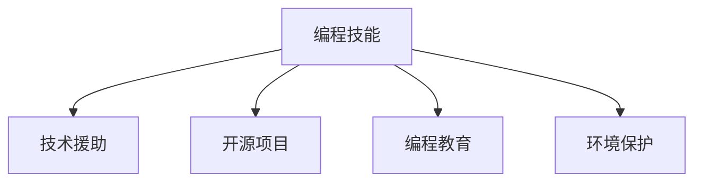

                 

# 如何将编程技能应用于社会公益

> 关键词：编程技能,社会公益,技术援助,开源项目,教育支持,环境保护

## 1. 背景介绍

### 1.1 问题由来
在当今社会，科技日益成为推动社会发展的重要力量。编程技能作为一项核心技术，在各个行业的应用越来越广泛。然而，技术的不平衡分布和贫富差距，使得一些地区和人群难以享受到科技带来的便利。在这样的背景下，将编程技能应用于社会公益，成为了连接技术创新和社会公平的重要桥梁。

### 1.2 问题核心关键点
将编程技能应用于社会公益的核心在于，通过技术手段提升弱势群体的信息化水平，缩小数字鸿沟，提升社区和社会的整体福祉。以下是实现这一目标的几个关键点：

- **技术援助**：通过技术支持和资源共享，帮助欠发达地区和社群提升数字化能力。
- **开源项目**：推动开源技术的发展，让更多人能够免费获取和利用先进技术。
- **教育支持**：通过编程教育，培养新一代的技术人才，增强社会的创新能力。
- **环境保护**：利用编程技能开发环境保护和可持续发展的解决方案，提升地球的可持续性。

这些关键点共同构成了将编程技能应用于社会公益的核心框架，使得技术能够更好地服务于社会，推动社会进步。

## 2. 核心概念与联系

### 2.1 核心概念概述

为更好地理解如何将编程技能应用于社会公益，本节将介绍几个密切相关的核心概念：

- **编程技能**：编程技能是指通过编写代码解决实际问题的能力。它包括了算法、数据结构、软件工程、计算机系统等方面。
- **技术援助**：技术援助是指通过技术手段帮助落后地区或社群提升其信息化水平。
- **开源项目**：开源项目是指在互联网环境下，将软件或技术解决方案的源代码公开，供全球用户自由使用和修改。
- **编程教育**：编程教育是通过教学和培训，帮助人们掌握编程技能，提升其信息素养和创新能力。
- **环境保护**：利用编程技能开发环境保护和可持续发展的解决方案，如智能监测、数据分析等。

这些核心概念之间的逻辑关系可以通过以下Mermaid流程图来展示：



这个流程图展示了一些关键概念及其之间的关系：

1. 编程技能通过技术援助、开源项目、编程教育和环境保护等形式，服务于社会的各个方面。
2. 技术援助、开源项目、编程教育和环境保护都是编程技能在不同场景下的具体应用。
3. 这些应用不仅提升了个体和社区的信息化水平，也推动了整个社会的进步。

## 3. 核心算法原理 & 具体操作步骤
### 3.1 算法原理概述

将编程技能应用于社会公益，本质上是一种通过技术手段解决社会问题的过程。其核心算法原理可以概括为：

- **需求分析**：识别出社会上的具体需求，如提高教育水平、改善医疗条件、促进环境保护等。
- **技术选型**：选择最合适的技术工具和框架，如编程语言、开源库、云计算平台等。
- **项目规划**：制定详细的项目计划，包括技术路线图、资源分配、团队协作等。
- **项目实施**：按照项目计划，逐步开发和部署应用，进行测试和迭代优化。
- **效果评估**：对项目成果进行评估，收集反馈，持续改进。

通过这一系列步骤，可以实现编程技能在社会公益中的应用，最大化其社会价值。

### 3.2 算法步骤详解

以下将详细讲解如何将编程技能应用于社会公益的具体步骤：

**Step 1: 需求分析**
- **目标明确**：明确项目目标，如提高偏远地区儿童的编程技能，改善农村医疗设施的信息化水平等。
- **用户调研**：与目标群体进行深入访谈，了解其具体需求和痛点。
- **问题定义**：将需求转化为具体的技术问题，如开发一个远程教育平台，实现医疗数据的管理和分析等。

**Step 2: 技术选型**
- **技术栈选择**：根据项目需求和技术成熟度，选择合适的技术栈。例如，对于教育项目，可以选择Python和JavaScript作为主要开发语言，TensorFlow或PyTorch作为机器学习框架。
- **工具和框架**：选择适合的技术工具和开源框架，如GitHub、Jupyter Notebook、Docker等，方便项目的开发和管理。
- **云计算平台**：考虑使用云平台，如AWS、Azure或Google Cloud，以降低基础设施成本，提高资源的可伸缩性。

**Step 3: 项目规划**
- **团队组建**：根据项目规模和复杂度，组建合适的项目团队，包括技术专家、产品经理、用户体验设计师等。
- **任务分配**：将项目分解为具体的任务，如需求分析、系统设计、编码实现、测试部署等。
- **时间计划**：制定详细的时间表，确保项目按期完成。

**Step 4: 项目实施**
- **需求迭代**：与用户进行持续的沟通和反馈，根据实际需求调整项目内容和方向。
- **编码实现**：按照项目计划，逐步开发和测试应用，解决遇到的技术难题。
- **部署上线**：完成应用的开发后，部署到生产环境，并进行持续监控和维护。

**Step 5: 效果评估**
- **数据收集**：收集项目实施后的效果数据，如用户满意度、系统性能指标等。
- **反馈分析**：分析用户反馈，识别问题和改进点。
- **持续改进**：根据反馈和数据分析结果，持续改进项目和应用，提升社会效益。

### 3.3 算法优缺点

将编程技能应用于社会公益的方法具有以下优点：
1. **成本低**：利用开源技术和现有技术栈，能够降低项目开发和维护的成本。
2. **灵活性高**：技术手段的多样性和灵活性，使得项目可以针对不同的社会需求进行定制化开发。
3. **可持续性**：开源项目和编程教育的推广，有助于技术的长期可持续发展。

同时，该方法也存在一些局限性：
1. **技术门槛**：对于一些缺乏技术基础的群体，可能难以快速上手和掌握新技术。
2. **资源限制**：技术援助和教育支持需要一定的资源投入，特别是对于资源匮乏的地区。
3. **效果评估难度**：社会公益项目的成果难以量化和评估，效果评估和改进难度较大。

尽管存在这些局限性，但通过合理的策略和持续的努力，可以克服这些挑战，最大化编程技能在社会公益中的应用价值。

### 3.4 算法应用领域

将编程技能应用于社会公益的方法，已经在教育、医疗、环境保护等多个领域得到了广泛的应用，具体包括：

- **教育支持**：开发在线编程课程、远程教育平台，提升偏远地区和贫困家庭儿童的编程技能。
- **医疗信息化**：利用数据分析和机器学习技术，提升医疗机构的诊断和治疗水平，改善医疗条件。
- **环境保护**：开发智能监测系统，分析环境数据，提升环境保护和可持续发展的能力。
- **灾害预警**：利用大数据和机器学习技术，提高自然灾害的预警和响应能力，保护民众生命财产安全。
- **精准扶贫**：利用数据分析和决策支持系统，精准识别贫困群体，制定扶贫政策，提升扶贫效果。

除了上述这些经典应用外，编程技能在社会公益领域还有更多创新的应用，如城市管理、公共安全、文化传承等，为社会的可持续发展注入了新的动力。

## 4. 数学模型和公式 & 详细讲解 & 举例说明

### 4.1 数学模型构建

在将编程技能应用于社会公益的过程中，往往会涉及到大量的数据处理和模型优化问题。以下是一个简化版的数学模型构建示例：

假设我们要开发一个远程教育平台，提升偏远地区儿童的编程技能。我们可以构建如下数学模型：

- **输入变量**：学生的基础编程水平、参与度、地理位置等。
- **输出变量**：学生的编程技能提升程度、平台使用满意度等。
- **自变量**：课程设计、教学方法、平台功能等。

数学模型可以表示为：

$$
Y = f(X; \theta)
$$

其中 $Y$ 是输出变量，$X$ 是输入变量和自变量，$\theta$ 是模型的参数。

### 4.2 公式推导过程

以学生编程技能提升为例，假设我们有一个线性回归模型：

$$
\hat{Y} = \theta_0 + \theta_1X_1 + \theta_2X_2 + \cdots + \theta_nX_n
$$

其中 $\theta_0, \theta_1, \theta_2, \cdots, \theta_n$ 是模型的参数，$X_1, X_2, \cdots, X_n$ 是输入变量和自变量，$\hat{Y}$ 是模型的预测输出。

通过最小二乘法，我们可以求解参数 $\theta$：

$$
\theta = (X^TX)^{-1}X^TY
$$

其中 $X^TX$ 是输入变量和自变量的协方差矩阵，$X^TY$ 是输入变量和输出变量的协方差矩阵。

### 4.3 案例分析与讲解

假设我们要分析某个远程教育平台对学生编程技能提升的效果，可以采用线性回归模型进行分析。具体步骤如下：

**Step 1: 数据准备**
- 收集学生的初始编程水平数据、平台使用数据、地理位置数据等。
- 定义学生的编程技能提升程度和平台使用满意度作为输出变量。

**Step 2: 模型训练**
- 使用上述数据，训练线性回归模型，求解参数 $\theta$。
- 利用训练好的模型，对学生的编程水平进行预测，并与实际提升程度进行比较。

**Step 3: 结果分析**
- 分析模型预测结果与实际数据之间的差异，识别影响编程技能提升的关键因素。
- 根据分析结果，优化课程设计和教学方法，提升平台的使用效果。

## 5. 项目实践：代码实例和详细解释说明

### 5.1 开发环境搭建

在进行项目实践前，我们需要准备好开发环境。以下是使用Python进行项目开发的环境配置流程：

1. 安装Anaconda：从官网下载并安装Anaconda，用于创建独立的Python环境。

2. 创建并激活虚拟环境：
```bash
conda create -n myproject python=3.8 
conda activate myproject
```

3. 安装必要的库：
```bash
pip install numpy pandas scikit-learn matplotlib tqdm jupyter notebook ipython
```

完成上述步骤后，即可在`myproject`环境中开始项目实践。

### 5.2 源代码详细实现

以下是一个使用Python和Scikit-learn库实现远程教育平台的学生编程技能提升分析的代码示例：

```python
import pandas as pd
from sklearn.linear_model import LinearRegression
from sklearn.model_selection import train_test_split
from sklearn.metrics import mean_squared_error, r2_score

# 读取数据
data = pd.read_csv('student_data.csv')

# 定义输入变量和输出变量
X = data[['initial_skill', 'participation', 'location']]
y = data['skill_improvement']

# 分割数据集
X_train, X_test, y_train, y_test = train_test_split(X, y, test_size=0.2, random_state=42)

# 训练模型
model = LinearRegression()
model.fit(X_train, y_train)

# 预测结果
y_pred = model.predict(X_test)

# 评估模型
mse = mean_squared_error(y_test, y_pred)
r2 = r2_score(y_test, y_pred)
print(f'Mean Squared Error: {mse:.2f}')
print(f'R-squared: {r2:.2f}')
```

这个示例代码实现了如下功能：

1. 读取学生数据，定义输入变量和输出变量。
2. 将数据集分为训练集和测试集。
3. 使用线性回归模型训练模型。
4. 对测试集进行预测，并计算模型的均方误差和R-squared值。

### 5.3 代码解读与分析

让我们再详细解读一下关键代码的实现细节：

**数据准备**：
- `pd.read_csv`函数用于读取CSV格式的数据文件。
- `X`和`y`变量分别代表输入变量和输出变量，其中`initial_skill`表示学生的初始编程水平，`participation`表示学生在平台上的参与度，`location`表示学生的地理位置，`skill_improvement`表示学生的编程技能提升程度。

**模型训练**：
- `train_test_split`函数用于将数据集划分为训练集和测试集。
- `LinearRegression`类用于训练线性回归模型，调用`fit`方法进行模型训练。

**预测与评估**：
- `predict`方法用于对测试集进行预测，得到预测结果`y_pred`。
- `mean_squared_error`和`r2_score`函数用于评估模型的预测结果，分别计算均方误差和R-squared值。

在实际应用中，我们还需要根据具体任务进行数据清洗、特征工程、模型优化等操作，才能得到理想的分析结果。

## 6. 实际应用场景

### 6.1 教育支持

将编程技能应用于教育支持，可以显著提升偏远地区和贫困家庭儿童的编程水平。例如，开发一个基于Web的在线编程课程平台，提供互动式编程学习工具和资源，帮助儿童在家自学编程。

### 6.2 医疗信息化

利用编程技能开发医疗数据分析和决策支持系统，提升医疗机构的诊断和治疗水平。例如，开发一个基于机器学习的疾病诊断平台，利用病历数据预测患者的疾病风险，提供个性化的治疗方案。

### 6.3 环境保护

通过编程技能开发智能监测系统，分析环境数据，提升环境保护和可持续发展的能力。例如，开发一个基于物联网的环境监测平台，实时监控空气质量、水质等环境指标，提供环境预警和报告。

### 6.4 灾害预警

利用大数据和机器学习技术，提高自然灾害的预警和响应能力。例如，开发一个基于卫星数据的自然灾害预警系统，实时分析气象数据，预测自然灾害的发生，提前发布预警信息。

### 6.5 精准扶贫

利用数据分析和决策支持系统，精准识别贫困群体，制定扶贫政策，提升扶贫效果。例如，开发一个基于社会经济数据的扶贫识别系统，分析家庭收入、教育水平等因素，识别贫困家庭，提供精准扶贫方案。

## 7. 工具和资源推荐

### 7.1 学习资源推荐

为了帮助开发者系统掌握将编程技能应用于社会公益的理论基础和实践技巧，这里推荐一些优质的学习资源：

1. 《Python编程：从入门到实践》系列博文：由Python专家撰写，深入浅出地介绍了Python编程的基础知识和实际应用。

2. CS50《计算机科学导论》课程：哈佛大学开设的计算机科学入门课程，涵盖编程基础、数据结构、算法等核心内容。

3. 《人工智能导论》书籍：斯坦福大学课程讲义，介绍了人工智能的基本概念和算法，包括机器学习、深度学习等。

4. Coursera和edX平台：提供大量免费的在线课程，涵盖编程、数据科学、机器学习等多个领域，适合自学和深入学习。

5. GitHub开源项目：查找和参与开源项目，学习其他开发者的经验和代码实现，提升技术水平。

通过对这些资源的学习实践，相信你一定能够快速掌握将编程技能应用于社会公益的方法，并用于解决实际的社会问题。

### 7.2 开发工具推荐

高效的开发离不开优秀的工具支持。以下是几款用于社会公益项目开发的常用工具：

1. Jupyter Notebook：一个交互式的编程环境，支持多种编程语言，方便代码编写和数据探索。

2. Git：版本控制系统，方便代码协作和管理。

3. GitHub：一个开源代码托管平台，方便代码共享和协作。

4. Docker：一个容器化平台，方便应用打包和部署。

5. TensorBoard：TensorFlow配套的可视化工具，可实时监测模型训练状态，提供丰富的图表呈现方式。

合理利用这些工具，可以显著提升社会公益项目的开发效率，加快创新迭代的步伐。

### 7.3 相关论文推荐

将编程技能应用于社会公益的研究源于学界的持续探索。以下是几篇奠基性的相关论文，推荐阅读：

1. "Programming for All"：探讨编程教育在社会公平中的重要性，呼吁政府和教育机构加大对编程教育的投入。

2. "Open Source Software and Community Development"：分析开源软件在社区发展中的作用，讨论如何通过开源项目提升社区的技术水平。

3. "Machine Learning for Environmental Monitoring"：介绍机器学习在环境保护中的应用，讨论如何通过数据分析提升环境保护能力。

4. "Natural Disaster Prediction and Response"：探讨大数据和机器学习在自然灾害预警中的应用，分析如何提高灾害预测的准确性和响应效率。

5. "Poverty Identification and Intervention"：介绍数据分析在精准扶贫中的应用，讨论如何通过数据识别贫困群体，制定扶贫政策。

这些论文代表了大语言模型微调技术的发展脉络。通过学习这些前沿成果，可以帮助研究者把握学科前进方向，激发更多的创新灵感。

## 8. 总结：未来发展趋势与挑战

### 8.1 总结

本文对将编程技能应用于社会公益的方法进行了全面系统的介绍。首先阐述了这一方法的背景和意义，明确了技术援助、开源项目、编程教育和环境保护等关键概念。其次，从原理到实践，详细讲解了编程技能在社会公益中的应用步骤和具体实现。同时，本文还探讨了这一方法在教育、医疗、环境保护等众多领域的应用前景，展示了其巨大的社会价值。此外，本文精选了编程技能应用于社会公益的各类学习资源，力求为读者提供全方位的技术指引。

通过本文的系统梳理，可以看到，将编程技能应用于社会公益，是一种连接技术创新和社会公平的重要桥梁。这一方法不仅能够提升弱势群体的信息化水平，也能够推动整个社会的进步和发展。

### 8.2 未来发展趋势

展望未来，将编程技能应用于社会公益的方法将呈现以下几个发展趋势：

1. **技术普及**：随着技术的不断普及和推广，更多人将能够接触和使用编程技能，提升自身的信息素养和创新能力。
2. **社区合作**：通过开源项目和技术交流，全球各地的社区将更加紧密地联系起来，共同推动技术发展和社会进步。
3. **数据驱动**：利用大数据和机器学习技术，社会公益项目将更加智能化和高效化，能够更好地应对复杂的社会问题。
4. **持续改进**：社会公益项目需要持续迭代和优化，才能更好地适应不断变化的社会需求和技术环境。
5. **跨学科融合**：将编程技能与其他学科的知识和技术进行融合，提升项目的综合性和创新性。

这些趋势将推动将编程技能应用于社会公益的方法不断进步，为构建一个更加公平、智能、可持续的社会提供坚实的基础。

### 8.3 面临的挑战

尽管将编程技能应用于社会公益的方法已经取得了显著的成果，但在迈向更加智能化、普适化应用的过程中，它仍面临着诸多挑战：

1. **资源限制**：对于资源匮乏的地区，如何获取和利用先进的编程工具和技术，仍然是一个难题。
2. **技术门槛**：对于缺乏技术基础的群体，如何降低学习门槛，提高技术普及率，仍然是一个重要问题。
3. **效果评估**：社会公益项目的成果难以量化和评估，效果评估和改进难度较大。
4. **持续支持**：社会公益项目需要长期的资金和人力支持，如何确保项目的可持续性，仍然是一个挑战。
5. **伦理问题**：在应用编程技能解决社会问题时，如何确保技术的公平性和伦理性，避免技术滥用，仍然是一个需要深入探讨的问题。

这些挑战需要我们不断探索和创新，才能最大化编程技能在社会公益中的应用价值。

### 8.4 研究展望

面对将编程技能应用于社会公益所面临的挑战，未来的研究需要在以下几个方面寻求新的突破：

1. **技术普及**：开发更加易学易用的编程工具和教育平台，降低技术门槛，提高技术普及率。
2. **开源社区**：建立更加活跃和支持的开源社区，推动技术和资源的共享和合作。
3. **效果评估**：探索更加科学和可量化的效果评估方法，帮助项目更好地进行持续改进。
4. **持续支持**：建立更加稳定的资金和人力支持机制，确保项目的可持续性。
5. **伦理保障**：制定更加严格的伦理规范和技术标准，确保技术的公平性和伦理性。

这些研究方向的探索，必将引领将编程技能应用于社会公益的方法不断进步，为构建一个更加公平、智能、可持续的社会提供坚实的技术保障。

## 9. 附录：常见问题与解答

**Q1：将编程技能应用于社会公益的优势有哪些？**

A: 将编程技能应用于社会公益的优势包括：
1. **技术援助**：通过技术手段提升弱势群体的信息化水平，缩小数字鸿沟，提升社区和社会的整体福祉。
2. **开源项目**：推动开源技术的发展，让更多人能够免费获取和利用先进技术。
3. **编程教育**：通过编程教育，培养新一代的技术人才，增强社会的创新能力。
4. **环境保护**：利用编程技能开发环境保护和可持续发展的解决方案，提升地球的可持续性。

**Q2：在将编程技能应用于社会公益时，如何选择合适的技术栈？**

A: 选择合适的技术栈需要考虑以下几个因素：
1. **技术成熟度**：选择成熟稳定的技术栈，确保项目的技术基础。
2. **需求适应性**：选择能够满足具体需求的技术栈，如对于教育项目，可以选择Python和JavaScript作为主要开发语言。
3. **资源可用性**：考虑现有资源和技术社区的支持情况，选择易于获取和使用的技术栈。
4. **可扩展性**：选择具有良好扩展性的技术栈，便于项目未来的迭代和优化。

**Q3：如何将编程技能应用于环境保护？**

A: 将编程技能应用于环境保护，可以通过以下几种方式：
1. 开发智能监测系统，分析环境数据，提升环境保护和可持续发展的能力。
2. 利用数据分析和机器学习技术，进行环境污染的预警和预测。
3. 开发环境保护应用，如垃圾分类、能源管理等，提升公众的环保意识和行为。
4. 开发环境友好型算法，如减少计算资源的消耗，提升环境可持续性。

**Q4：如何评估编程技能应用于社会公益的效果？**

A: 评估编程技能应用于社会公益的效果需要综合考虑以下几个方面：
1. **用户反馈**：收集用户对项目的评价和反馈，识别问题和改进点。
2. **数据指标**：分析项目实施后的效果数据，如用户的编程水平提升程度、平台的满意度和使用率等。
3. **对比分析**：对比项目实施前后的变化，评估项目的效果和影响。
4. **持续改进**：根据评估结果，不断优化项目和应用，提升社会效益。

---

作者：禅与计算机程序设计艺术 / Zen and the Art of Computer Programming

