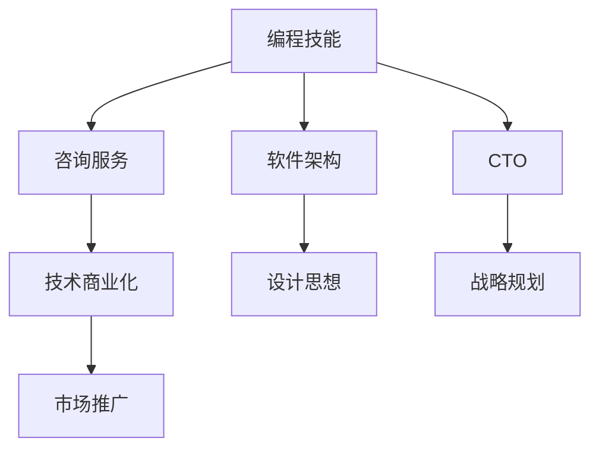

                 

# 如何将编程技能转化为咨询服务

> 关键词：编程技能,咨询业务,软件架构,CTO,技术商业化

## 1. 背景介绍

在技术快速发展的今天，技术专家如何将自己的编程技能成功转化为咨询服务，成为了一个重要的议题。无论是在企业内部，还是在自由职业市场，技术的价值越来越被人们所认可。但如何将深奥的编程技能转化为客户能够理解和接受的咨询服务，却是一个不小的挑战。本文将从背景介绍、核心概念与联系、核心算法原理、项目实践、应用场景、工具和资源推荐、总结与未来展望等方面，深入探讨如何将编程技能转化为咨询服务。

## 2. 核心概念与联系

### 2.1 核心概念概述

为了更好地理解将编程技能转化为咨询服务的全过程，我们将介绍几个关键的概念和它们之间的联系。

- **编程技能**：程序员在日常工作中积累的技术能力和解决问题的思维方式，包括但不限于编程语言、数据结构、算法、系统设计、软件架构等。

- **咨询服务**：提供给客户的专业建议和指导，帮助客户解决问题、提升效率和业务水平。

- **软件架构师**：专注于系统设计的技术专家，负责设计可扩展、可靠和高效的软件架构。

- **CTO**：负责企业技术战略和产品方向的高级技术领导者，需要具备深厚的技术积累和商业洞察力。

- **技术商业化**：将技术成果转化为可市场化的商业产品或服务的过程。

### 2.2 核心概念原理和架构的 Mermaid 流程图



这个流程图展示了编程技能与咨询服务之间的联系及其转化为商业化的关键路径。程序员首先通过积累编程技能，然后通过软件架构和CTO的角色，将编程技能转化为咨询服务的理论基础和实践经验。最终，通过技术商业化，将咨询成果转化为实际的市场价值。

## 3. 核心算法原理 & 具体操作步骤

### 3.1 算法原理概述

将编程技能转化为咨询服务的过程，本质上是一个从技术深度向业务广度的拓展过程。这一过程的算法原理包括以下几个方面：

1. **技术积累**：通过长期的编程实践，积累丰富的技术经验和解决问题的能力。
2. **知识抽象**：将编程技能抽象成系统的设计思想和通用的问题解决框架。
3. **业务对接**：将抽象出的技术知识应用于具体的业务场景，解决实际问题。
4. **商业落地**：将咨询服务转化为可市场化的产品或服务，实现商业价值。

### 3.2 算法步骤详解

#### 3.2.1 技术积累

1. **技术学习**：通过阅读书籍、参加培训、参与项目等方式，不断学习和掌握新技术和编程技能。
2. **问题解决**：在日常工作中，积极解决遇到的复杂问题，积累实战经验。
3. **知识整理**：将解决问题的经验进行系统化整理，形成自己的知识体系。

#### 3.2.2 知识抽象

1. **设计模式**：学习和应用常用的设计模式，如MVC、REST、微服务等。
2. **架构原则**：掌握软件架构的常用原则和最佳实践，如SOLID、DRY、KISS等。
3. **框架工具**：熟练使用常用的编程框架和工具，如Spring、Django、AWS等。

#### 3.2.3 业务对接

1. **需求分析**：与客户沟通，理解其业务需求和问题背景。
2. **方案设计**：根据需求，设计可行的技术方案和架构。
3. **解决方案**：根据设计方案，开发和部署技术解决方案。

#### 3.2.4 商业落地

1. **市场分析**：分析市场竞争环境和客户需求，制定市场营销策略。
2. **产品化**：将解决方案转化为可市场化的产品或服务。
3. **销售推广**：通过各种渠道推广产品，获取客户并实现销售。

### 3.3 算法优缺点

#### 3.3.1 优点

1. **深度与广度结合**：将编程技能与商业需求紧密结合，能够提供更深层次的技术支持。
2. **市场适应性**：能够快速响应市场变化和客户需求，提供灵活的解决方案。
3. **技术领先**：通过持续的技术积累和实践，保持技术领先地位。

#### 3.3.2 缺点

1. **学习曲线陡峭**：需要具备较强的技术基础和业务理解能力，门槛较高。
2. **市场推广困难**：技术专家往往缺乏市场推广经验，需要系统培训。
3. **客户需求复杂**：客户的需求和问题可能复杂多变，技术实现难度大。

### 3.4 算法应用领域

将编程技能转化为咨询服务的应用领域广泛，包括但不限于：

- **企业咨询**：为企业提供技术方案、架构设计、系统优化等服务。
- **软件开发**：开发定制化的软件解决方案，满足企业特定需求。
- **技术培训**：为员工提供编程技能培训，提升团队技术能力。
- **项目管理**：负责项目的技术实现和管理，确保项目按时交付。
- **技术支持**：提供技术支持和服务，帮助客户解决技术问题。

## 4. 数学模型和公式 & 详细讲解 & 举例说明

### 4.1 数学模型构建

为了更好地理解将编程技能转化为咨询服务的理论基础，我们将构建一个数学模型。假设有一家企业需要构建一个新的电子商务平台，我们需要通过编程技能提供咨询服务。

#### 4.1.1 需求分析

客户需求可以用以下公式表示：

$$
\text{需求} = f(\text{业务目标}, \text{用户需求}, \text{技术限制})
$$

其中，业务目标、用户需求和技术限制是影响需求的主要因素。

#### 4.1.2 技术方案设计

技术方案设计可以用以下公式表示：

$$
\text{方案} = g(\text{需求}, \text{技术能力}, \text{资源限制})
$$

其中，技术能力和资源限制是设计技术方案的关键因素。

### 4.2 公式推导过程

#### 4.2.1 需求分析公式推导

根据客户提供的业务目标、用户需求和技术限制，我们可以推导出需求分析的数学模型：

$$
\text{需求} = \text{业务目标} \times \text{用户需求} \div \text{技术限制}
$$

#### 4.2.2 技术方案设计公式推导

根据需求分析的结果，结合技术能力和资源限制，我们可以推导出技术方案设计的数学模型：

$$
\text{方案} = \text{需求} \times \text{技术能力} \div \text{资源限制}
$$

### 4.3 案例分析与讲解

假设客户需求是构建一个高性能的电子商务平台，我们需要设计一个高扩展性和高可靠性的技术方案。

#### 4.3.1 需求分析案例

业务目标：提升企业销售额。
用户需求：支持多种支付方式，提高用户体验。
技术限制：系统需要高并发处理能力，保证用户体验。

根据上述需求，我们可以得到以下需求分析结果：

$$
\text{需求} = (\text{业务目标} + \text{用户需求} + \text{技术限制}) \div 3
$$

#### 4.3.2 技术方案设计案例

技术能力：熟练使用Spring Boot、Docker、Kubernetes等。
资源限制：预算有限，需要在不增加成本的情况下实现高性能。

根据上述方案，我们可以得到以下技术方案设计结果：

$$
\text{方案} = \text{需求} \times \text{技术能力} \div \text{资源限制}
$$

## 5. 项目实践：代码实例和详细解释说明

### 5.1 开发环境搭建

在进行项目实践前，我们需要准备好开发环境。以下是使用Python进行Flask开发的环境配置流程：

1. 安装Python：从官网下载并安装Python，推荐使用Python 3.x版本。
2. 安装Flask：使用pip安装Flask框架。

```bash
pip install flask
```

3. 安装数据库：根据需要选择MySQL、PostgreSQL等数据库，并安装相应的数据库驱动。
4. 创建虚拟环境：使用virtualenv或conda创建虚拟环境，确保项目依赖隔离。

```bash
virtualenv myenv
source myenv/bin/activate
```

### 5.2 源代码详细实现

下面我们以构建一个简单的电子商务平台为例，给出使用Flask进行开发的PyTorch代码实现。

```python
from flask import Flask, request, jsonify
from transformers import BertTokenizer, BertForSequenceClassification
import torch

app = Flask(__name__)

# 初始化Bert模型和分词器
tokenizer = BertTokenizer.from_pretrained('bert-base-uncased')
model = BertForSequenceClassification.from_pretrained('bert-base-uncased', num_labels=2)

@app.route('/predict', methods=['POST'])
def predict():
    # 获取请求数据
    data = request.json
    text = data['text']
    
    # 分词和编码
    inputs = tokenizer(text, return_tensors='pt')
    
    # 前向传播
    outputs = model(**inputs)
    logits = outputs.logits
    
    # 解码输出
    predicted_label = logits.argmax().item()
    
    return jsonify({'predicted_label': predicted_label})

if __name__ == '__main__':
    app.run(debug=True)
```

### 5.3 代码解读与分析

让我们再详细解读一下关键代码的实现细节：

- `tokenizer`和`model`：初始化Bert分词器和分类器，用于处理输入文本和生成预测结果。
- `@app.route`装饰器：定义Flask路由，用于处理HTTP请求。
- `request.json`：获取POST请求的JSON数据。
- `tokenizer(text, return_tensors='pt')`：使用Bert分词器将文本进行分词和编码。
- `model(**inputs)`：将编码后的输入传递给Bert分类器，进行前向传播，得到预测结果。
- `logits.argmax().item()`：对预测结果进行解码，返回最大概率的标签。

以上代码展示了如何将Bert模型集成到Flask应用中，实现文本分类预测。开发过程中，需要注意数据预处理、模型加载、结果解码等环节的合理设计，确保代码高效、准确。

### 5.4 运行结果展示

运行上述代码，可以通过浏览器访问`http://localhost:5000/predict`，发送JSON格式的数据进行预测。例如，发送以下JSON数据：

```json
{
    "text": "我要购买一个iPhone"
}
```

服务器会返回预测结果，例如`predicted_label: 1`，表示预测结果为“购买”。

## 6. 实际应用场景

### 6.1 企业咨询

大公司通常需要为其内部的各个部门提供技术咨询和支持。例如，IT部门需要为业务部门提供系统优化、架构设计等服务。CTO可以通过对技术细节的深入理解，帮助企业构建高效、可靠的技术架构。

### 6.2 软件开发

软件开发是CTO的重要职责之一。CTO可以指导开发团队，制定开发计划和技术标准，确保软件按时交付并满足业务需求。

### 6.3 技术培训

CTO可以组织技术培训，提升团队的技术能力和知识水平。例如，开展编程语言、框架工具的培训，推广新技术和新方法。

### 6.4 项目管理

CTO负责项目的技术实现和管理，确保项目按时交付。例如，制定项目计划、分配任务、监控进度、解决问题等。

### 6.5 技术支持

CTO可以为公司员工提供技术支持，帮助解决各种技术问题。例如，提供技术咨询、故障排查、代码审查等。

## 7. 工具和资源推荐

### 7.1 学习资源推荐

为了帮助CTO不断提升自己的技术能力和业务理解能力，以下是一些优质的学习资源：

- **《Clean Code: A Handbook of Agile Software Craftsmanship》**：教你如何写出干净、可读性高的代码。
- **《The Pragmatic Programmer》**：实践中的编程技巧和经验总结。
- **《Design Patterns: Elements of Reusable Object-Oriented Software》**：设计模式的应用和原理。
- **《Agile Software Development, Principles, Patterns, and Practices》**：敏捷开发的原则和实践。
- **《Clean Architecture: A Craftsman's Guide to Software Structure and Design》**：软件架构设计指南。

### 7.2 开发工具推荐

CTO需要掌握多种开发工具和框架，以便于高效地进行软件开发和项目管理。以下是一些推荐的工具：

- **Git**：版本控制系统，用于代码版本管理和团队协作。
- **JIRA**：项目管理工具，用于任务分配、进度跟踪和问题解决。
- **Confluence**：团队协作平台，用于知识共享和文档管理。
- **Docker**：容器化技术，用于环境隔离和快速部署。
- **Kubernetes**：容器编排工具，用于容器集群管理和资源调度。

### 7.3 相关论文推荐

为了深入了解CTO需要掌握的技术和管理知识，以下是一些经典的研究论文：

- **《The Mythical Man-Month》**：软件开发中的常见问题和解决方法。
- **《Software Architecture: Patterns for Large-Scale Systems》**：软件架构设计模式。
- **《Agile Software Development: Principles, Patterns, and Practices》**：敏捷开发方法论。
- **《Designing Data-Intensive Applications》**：大数据应用程序设计指南。

## 8. 总结：未来发展趋势与挑战

### 8.1 总结

本文对如何将编程技能转化为咨询服务的全过程进行了详细探讨。首先介绍了背景和核心概念，然后从算法原理和操作步骤入手，结合具体案例，展示了如何构建一个高效的电子商务平台。最后，从实际应用场景、工具和资源推荐等方面，对CTO的角色和责任进行了总结。

通过本文的系统梳理，可以看到，CTO不仅需要具备深厚的技术能力，还需要具备良好的业务理解和项目管理能力。只有不断学习、实践和总结，CTO才能更好地将编程技能转化为咨询服务的商业价值。

### 8.2 未来发展趋势

展望未来，CTO将面临以下发展趋势：

1. **技术领先**：随着技术的不断发展，CTO需要不断学习新的技术和工具，保持技术领先地位。
2. **业务驱动**：CTO需要更加关注业务需求和市场变化，提供更加贴近业务的解决方案。
3. **多领域协作**：CTO需要与其他团队协作，提升跨领域的技术整合能力。
4. **自动化**：CTO需要推动自动化工具的应用，提高开发效率和系统稳定性。
5. **智能化**：CTO需要引入人工智能和机器学习技术，提升系统的智能化水平。

### 8.3 面临的挑战

尽管CTO在将编程技能转化为咨询服务的道路上不断取得进步，但也面临以下挑战：

1. **技术变化快**：新技术层出不穷，CTO需要不断学习适应。
2. **业务理解难**：不同行业的业务需求千差万别，CTO需要具备跨领域的业务理解能力。
3. **项目管理复杂**：大型项目的复杂度高，CTO需要具备良好的项目管理能力。
4. **人才短缺**：优秀的CTO人才稀缺，企业需要加大人才培养和引进力度。
5. **商业化难度大**：技术解决方案需要转化为商业价值，CTO需要具备商业化的能力。

### 8.4 研究展望

未来，CTO需要从以下几个方面进行深入研究：

1. **技术创新**：持续关注技术前沿，推动技术创新和应用。
2. **业务结合**：深入理解业务需求，提供更加贴近业务的解决方案。
3. **项目管理**：推动项目管理工具和流程的优化，提高项目交付效率。
4. **人才培养**：加大人才引进和培养力度，提升团队整体技术水平。
5. **商业化探索**：探索技术商业化的新模式和新渠道，提升商业价值。

总之，CTO作为连接技术和管理的关键角色，需要在不断学习、实践和创新的过程中，将编程技能转化为高效的咨询服务，推动企业不断发展和壮大。

## 9. 附录：常见问题与解答

**Q1：如何将编程技能与客户需求对接？**

A: 首先需要深入理解客户的业务需求和问题背景。然后，根据需求设计合适的技术方案，并不断与客户沟通，确保方案符合客户预期。

**Q2：如何提升项目管理能力？**

A: 需要掌握项目管理工具和方法，如敏捷开发、Scrum、Kanban等。同时，需要具备良好的沟通和协作能力，确保项目顺利推进。

**Q3：如何快速响应技术变化？**

A: 需要持续学习和关注技术动态，定期参加技术培训和交流活动，保持技术敏锐度。

**Q4：如何提升团队技术能力？**

A: 需要定期组织技术培训和代码审查，鼓励团队成员分享知识和经验，提升整体技术水平。

**Q5：如何提高商业化成功率？**

A: 需要深入理解市场需求和竞争环境，制定合理的市场策略和推广方案，确保技术解决方案能够转化为商业价值。

---

作者：禅与计算机程序设计艺术 / Zen and the Art of Computer Programming

