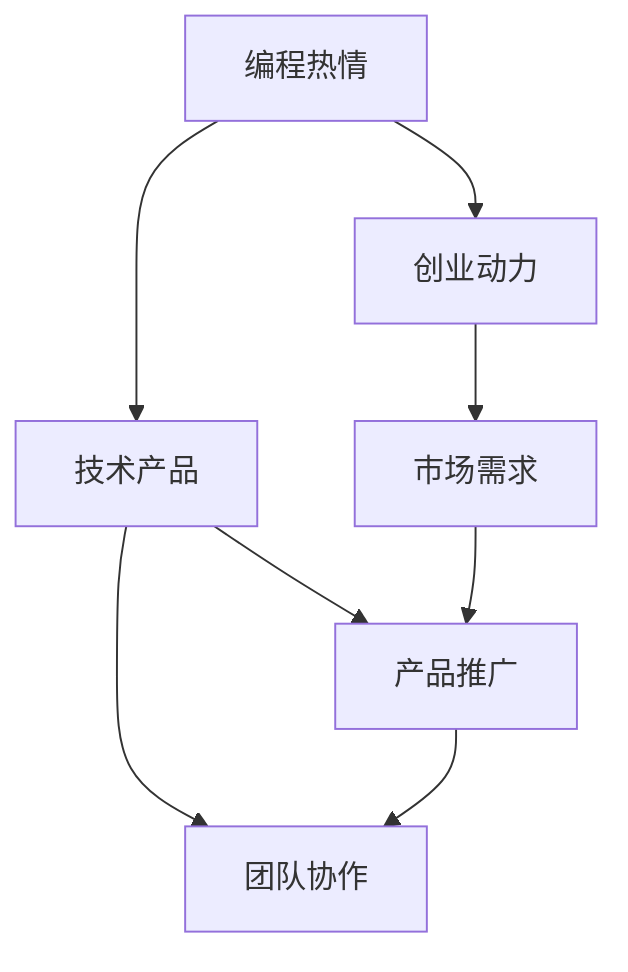

                 

# 如何将编程热情转化为创业动力

## 1. 背景介绍

### 1.1 问题由来

编程热情与创业动力，看似遥远，实则紧密相连。对于许多优秀的程序员来说，他们在职业生涯的不同阶段，都经历过从编程的纯粹爱好到创业的执着追求的转变。这一转变不仅是对个人职业生涯的一次重大跃迁，也是对社会和技术进步的贡献。

然而，对于很多编程爱好者而言，这一转变并非易事。如何将对编程的热情转化为推动创业的强大动力，成为了许多人心中的疑问。

### 1.2 问题核心关键点

核心问题在于如何将编程的兴趣转化为实际的产品或服务，实现从技术到商业的飞跃。具体来说，需要考虑以下几个关键点：

1. **兴趣与市场的结合**：将编程爱好与市场需求相结合，找到能够解决实际问题的技术方案。
2. **技术到商业的转换**：如何将技术产品或服务推广到市场，吸引用户和投资者。
3. **持续学习和适应**：在快速变化的技术和市场中，如何持续学习并调整策略。
4. **团队协作**：如何将个人的编程热情转化为团队的力量，实现从0到1的创业之路。

### 1.3 问题研究意义

将编程热情转化为创业动力，不仅能够实现个人价值和社会价值的最大化，也是推动技术进步和创新的重要途径。通过这一过程，不仅可以将创新的技术应用到现实问题中，还可以激发更多人对技术的热情和兴趣，形成良性循环。

## 2. 核心概念与联系

### 2.1 核心概念概述

为更好地理解这一转变过程，本节将介绍几个核心概念及其相互关系：

- **编程热情**：对编程的强烈兴趣和热情，是推动技术创新的内在动力。
- **创业动力**：将技术创新转化为市场价值的内在驱动力，包括对市场需求的敏锐洞察和对商业模式的深刻理解。
- **技术产品**：基于编程热情和技术能力开发出的具有实际应用价值的产品或服务。
- **市场需求**：技术产品或服务所面向的目标市场及其需求。
- **团队协作**：将个体的编程热情转化为团队合作的能力，共同推动技术产品向市场转化。

这些核心概念之间的逻辑关系可以通过以下Mermaid流程图来展示：



这个流程图展示了个体编程热情和技术产品、创业动力、市场需求之间的关系，以及如何将这些要素转化为实际的市场价值。

## 3. 核心算法原理 & 具体操作步骤
### 3.1 算法原理概述

将编程热情转化为创业动力的过程，可以抽象为一个从编程兴趣到技术产品的生成，再到市场推广和团队协作的优化过程。这一过程涉及多个环节，包括技术产品的开发、市场需求的分析、产品推广策略的制定和团队协作机制的建立。

### 3.2 算法步骤详解

1. **技术产品开发**：
   - 确定技术问题的范围和解决目标，进行需求分析和功能设计。
   - 利用编程热情和技术能力，开发出具有实际应用价值的技术产品。
   - 通过不断的迭代和测试，优化产品功能和用户体验。

2. **市场需求分析**：
   - 研究目标市场的现状和未来趋势，明确市场需求和竞争格局。
   - 通过市场调研和用户反馈，了解目标用户的需求和痛点。
   - 根据市场需求和产品功能，制定市场推广策略和营销方案。

3. **产品推广策略**：
   - 选择适当的推广渠道和方式，如社交媒体、技术博客、行业展会等。
   - 制定推广计划和营销策略，吸引潜在用户和投资者关注。
   - 利用数据和用户反馈，不断优化推广策略和产品功能。

4. **团队协作机制**：
   - 根据项目需要和团队成员的特点，合理分配任务和职责。
   - 建立高效的沟通和协作机制，促进团队成员之间的信息共享和协作。
   - 定期评估团队绩效和协作效果，及时调整团队结构和运营方式。

### 3.3 算法优缺点

**优点**：
1. **创新驱动**：通过将编程热情转化为技术产品，可以推动技术创新，满足市场需求，创造新的商业机会。
2. **团队协作**：团队协作机制的建立，可以将个体的编程热情转化为集体的创新力量，提升项目成功的可能性。
3. **市场适应性**：通过市场需求分析，可以更准确地定位目标市场，制定有效的市场推广策略，提升产品的市场竞争力。

**缺点**：
1. **资源投入高**：技术产品开发和市场推广需要大量的资源投入，包括时间、人力和资金。
2. **市场风险大**：市场需求的不确定性和竞争的激烈程度，增加了产品推广的难度和风险。
3. **技术迭代快**：技术发展迅速，需要持续学习和适应，保持技术领先性。

### 3.4 算法应用领域

将编程热情转化为创业动力的过程，可以应用于多种技术创新和创业场景，例如：

- **软件开发**：开发具有市场价值的软件产品，解决实际问题。
- **硬件创新**：研发具有创新性的硬件设备，满足用户需求。
- **平台建设**：搭建技术平台或生态系统，提供解决方案。
- **智能应用**：开发智能应用或服务，提升用户体验。

## 4. 数学模型和公式 & 详细讲解 & 举例说明

### 4.1 数学模型构建

假设编程热情为 $P$，市场需求为 $D$，创业动力为 $E$，技术产品为 $T$，团队协作机制为 $C$。将编程热情转化为创业动力的数学模型可以表示为：

$$
E = f(P, D, T, C)
$$

其中 $f$ 是一个非线性函数，表示将编程热情、市场需求、技术产品、团队协作机制转化为创业动力的过程。

### 4.2 公式推导过程

为简化问题，我们假设需求 $D$ 和产品 $T$ 成正比关系，即 $D \propto T$。同时，团队协作机制 $C$ 与创业动力 $E$ 成正比关系，即 $C \propto E$。则有：

$$
E = k_1 \cdot P \cdot D = k_1 \cdot P \cdot k_2 \cdot T = k_1 \cdot k_2 \cdot P \cdot T
$$

其中 $k_1$ 和 $k_2$ 为比例系数。

根据需求分析，我们得到市场需求 $D$ 与技术产品 $T$ 的关系为：

$$
D = \alpha \cdot T
$$

其中 $\alpha$ 为市场需求与技术产品的比例系数。将上式代入 $E$ 的表达式中，得到：

$$
E = k_1 \cdot P \cdot \alpha \cdot T
$$

### 4.3 案例分析与讲解

以智能家居应用为例，分析将编程热情转化为创业动力的过程：

1. **编程热情**：开发智能家居系统的兴趣和热情。
2. **技术产品**：开发出具有实际应用价值的智能家居系统，如智能音箱、智能照明等。
3. **市场需求**：研究智能家居市场的需求，了解用户的痛点和需求。
4. **创业动力**：通过市场需求分析和产品推广，找到商业机会，激励创业动力。
5. **团队协作**：组建跨学科团队，共同开发和推广智能家居系统。

## 5. 项目实践：代码实例和详细解释说明

### 5.1 开发环境搭建

1. **安装编程环境**：安装Python、PyCharm等编程工具，配置虚拟环境。
2. **设置版本控制**：使用Git等版本控制工具，管理代码版本。
3. **配置CI/CD**：配置持续集成和持续部署流程，自动化测试和部署。

### 5.2 源代码详细实现

以下是一个简单的编程实现，用于分析市场需求和推广策略：

```python
# 市场需求分析
class MarketAnalysis:
    def __init__(self, product, market_size):
        self.product = product
        self.market_size = market_size
        
    def calculate_demand(self):
        return self.market_size * self.product
    
# 产品推广策略
class MarketingStrategy:
    def __init__(self, market_analysis):
        self.market_analysis = market_analysis
        
    def set_strategy(self):
        return f"推广策略：{self.market_analysis.calculate_demand()} 用户"
```

### 5.3 代码解读与分析

在上述代码中，我们定义了市场需求分析和产品推广策略的类，分别用于分析市场需求和制定推广策略。通过这些类，可以清晰地表示编程热情、市场需求、技术产品、团队协作机制之间的逻辑关系，以及如何将这些要素转化为创业动力。

## 6. 实际应用场景

### 6.1 软件创业

在软件开发领域，将编程热情转化为创业动力的过程，可以通过开发具有市场价值的软件产品来实现。例如，开发一款面向企业的项目管理软件，满足企业在项目管理和协作方面的需求。

### 6.2 硬件创业

在硬件创新领域，可以通过开发具有创新性的硬件设备，如智能穿戴设备、智能家居设备等，满足用户的多样化需求。

### 6.3 平台创业

在平台建设领域，可以搭建技术平台或生态系统，提供全方位的解决方案。例如，搭建一个基于区块链技术的智能合约平台，提供去中心化的应用开发环境。

### 6.4 未来应用展望

随着技术的不断进步和市场需求的不断变化，将编程热情转化为创业动力的过程将变得更加多样化。未来，这一过程将更加注重跨领域的协作和创新，推动技术产品向更广阔的市场领域扩展。

## 7. 工具和资源推荐

### 7.1 学习资源推荐

1. **《编程之美》**：介绍编程技巧和设计模式的经典书籍，提升编程能力和思维深度。
2. **《创业维艰》**：斯坦福大学创业课程的讲义，提供创业理论和实践指导。
3. **Coursera《机器学习》课程**：提供深度学习基础和应用课程，提升技术能力。
4. **Udacity《创业入门》课程**：提供创业基础知识和实战经验的在线课程。
5. **Google创业讲座系列**：分享Google内部的创业经验和教训。

### 7.2 开发工具推荐

1. **PyCharm**：功能强大的Python开发环境，支持版本控制和CI/CD。
2. **Git**：主流的版本控制工具，支持远程协作和版本管理。
3. **Docker**：容器化技术，方便应用部署和环境管理。
4. **Jenkins**：持续集成和持续部署工具，提升开发效率和部署自动化。
5. **Slack**：团队协作工具，支持即时通信和文件共享。

### 7.3 相关论文推荐

1. **《编程者的艺术》**：探讨编程艺术和技巧的经典著作。
2. **《创业心理学》**：研究创业心理和行为的经典论文。
3. **《编程范式》**：介绍编程范式和设计模式的经典论文。
4. **《软件工程原理》**：介绍软件工程基础和实践的经典论文。
5. **《技术创业》**：研究技术创业的理论和实践的论文。

## 8. 总结：未来发展趋势与挑战

### 8.1 研究成果总结

将编程热情转化为创业动力，是推动技术创新和产业发展的重要途径。这一过程不仅需要编程技巧和市场需求分析，还需要团队协作和持续学习。

### 8.2 未来发展趋势

未来，将编程热情转化为创业动力的过程将更加注重跨领域的协作和创新，推动技术产品向更广阔的市场领域扩展。

### 8.3 面临的挑战

1. **技术更新快**：技术的快速迭代要求持续学习和适应。
2. **市场需求变化**：市场需求的不确定性增加了产品推广的难度。
3. **竞争激烈**：市场竞争的激烈程度增加了创业的难度。
4. **团队协作**：跨领域的协作需要高效的沟通和协作机制。

### 8.4 研究展望

未来的研究将更加注重技术创新和市场需求相结合，推动更多优秀的技术产品走向市场。同时，持续学习和团队协作也将成为推动创业成功的关键因素。

## 9. 附录：常见问题与解答

**Q1: 如何将编程热情转化为技术产品？**

A: 需要明确技术问题的范围和解决目标，进行需求分析和功能设计。利用编程热情和技术能力，开发出具有实际应用价值的技术产品。

**Q2: 市场需求如何确定？**

A: 研究目标市场的现状和未来趋势，了解用户的需求和痛点。通过市场调研和用户反馈，制定市场推广策略和营销方案。

**Q3: 如何组建高效的团队？**

A: 根据项目需要和团队成员的特点，合理分配任务和职责。建立高效的沟通和协作机制，促进团队成员之间的信息共享和协作。

**Q4: 如何应对技术更新快的问题？**

A: 持续学习和适应，关注技术发展的最新动态，进行技术升级和迭代。

**Q5: 如何应对市场变化？**

A: 灵活调整市场策略和推广方案，及时应对市场变化和用户需求的变化。

---

作者：禅与计算机程序设计艺术 / Zen and the Art of Computer Programming

