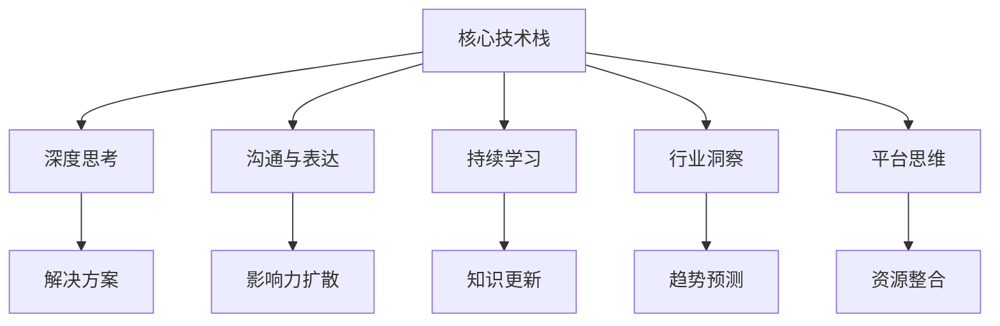

                 

# 如何成为程序员知识领域的KOL

在信息技术领域，成为知识领域的KOL（Key Opinion Leader）不仅需要深厚的技术功底，更需要对行业动态保持敏锐的洞察力，并能够以清晰、易懂的方式分享自己的见解和经验。本文将系统梳理成为程序员KOL所需的各项能力和技巧，帮助有志于此领域的读者实现从技术人到知识引领者的转型。

## 1. 背景介绍

### 1.1 问题由来
随着技术的发展，程序员的角色从单纯的代码编写者转变为系统架构师、技术领导者甚至行业领袖。越来越多的技术从业者渴望在某个领域内建立权威地位，成为该领域的KOL，不仅能够提升自己的职业发展，还能对整个技术社区产生积极的影响。

### 1.2 问题核心关键点
成为程序员知识领域的KOL，需要以下核心能力的加持：
- 精通核心技术栈
- 拥有解决问题的深层次思考
- 良好的沟通和表达能力
- 持续学习和知识更新
- 对行业趋势保持敏锐洞察
- 具备平台思维和社交网络经营技巧

通过系统学习这些关键能力，并结合实际项目实践，就可以逐步向KOL的目标迈进。

## 2. 核心概念与联系

### 2.1 核心概念概述

为更好地理解如何成为程序员知识领域的KOL，本节将介绍几个密切相关的核心概念：

- **核心技术栈**：指一个程序员在某个领域内必须掌握的关键技术和工具，如Web开发中的HTML/CSS/JavaScript、后端开发中的Node.js/Python/Ruby等。
- **深度思考**：指对问题从本质和根源进行全面分析，寻找最优解决方案的能力。
- **沟通与表达**：指将复杂技术概念以简单易懂的方式传达给听众的能力。
- **持续学习**：指通过阅读最新技术文献、参与行业会议、参与开源社区等方式不断更新自己的知识库。
- **行业洞察**：指对行业趋势、技术进展和市场需求保持敏锐的观察和分析。
- **平台思维**：指利用现有的技术平台、社交网络等资源进行知识传播和影响力扩散。

这些核心概念之间存在紧密的联系，通过组合和应用，可以形成一套系统的KOL成长路径。

### 2.2 核心概念原理和架构的 Mermaid 流程图



这个流程图展示了核心概念之间的逻辑关系：

1. 掌握核心技术栈是基础，是深度思考、沟通与表达、持续学习、行业洞察和平台思维的基石。
2. 深度思考帮助程序员找到最优解决方案，提高技术水平。
3. 沟通与表达能力让知识传播更加高效，提高影响力。
4. 持续学习保持知识更新，跟上技术发展。
5. 行业洞察帮助预测趋势，提高决策能力。
6. 平台思维整合资源，扩大影响力。

## 3. 核心算法原理 & 具体操作步骤
### 3.1 算法原理概述

成为程序员知识领域的KOL，需要运用一系列技术和策略，以下是对核心算法原理的概述：

**深度思考**：
- 原理：利用算法和数据结构进行问题建模和分析，找到问题的最优解或近似解。
- 应用：在代码优化、系统设计、故障排除等方面应用深度思考，提升工作效率和质量。

**沟通与表达**：
- 原理：将复杂概念简化为易于理解的形式，通过合适的语言和形式传递信息。
- 应用：编写清晰的技术博客、讲授技术课程、参与技术讨论等。

**持续学习**：
- 原理：通过学习最新的技术文献、参与行业会议、参与开源社区等方式获取新知识。
- 应用：订阅技术博客、参加线上线下技术会议、阅读技术书籍等。

**行业洞察**：
- 原理：通过对市场趋势、技术进展和需求变化的观察和分析，预测行业发展方向。
- 应用：关注技术博客、行业报告、新闻发布等。

**平台思维**：
- 原理：利用现有的技术平台和社交网络等资源，扩大自己的影响力和传播范围。
- 应用：在GitHub、Medium、Twitter等平台上发布技术文章和观点。

### 3.2 算法步骤详解

**Step 1: 精进核心技术栈**
- 确定目标领域：选择一个感兴趣或擅长的技术栈，如Web开发、人工智能、安全等。
- 深入学习：通过在线课程、书籍、项目实践等方式，深入掌握核心技术栈。

**Step 2: 提升深度思考能力**
- 实践项目：参与开源项目或自己发起项目，解决实际问题。
- 代码优化：通过学习代码审查、重构等技术提升代码质量和效率。
- 系统设计：学习系统架构设计模式和最佳实践，提高系统设计能力。

**Step 3: 强化沟通与表达能力**
- 写作练习：撰写技术博客，提高写作水平和表达能力。
- 技术讲授：参加技术讨论会或线上技术讲座，锻炼讲授能力。
- 沟通交流：积极参与技术社区和开源项目，与同行交流。

**Step 4: 建立持续学习机制**
- 订阅资源：订阅最新的技术博客、开源社区、技术报告等。
- 参加会议：参加行业会议、技术沙龙，学习最新技术动态。
- 阅读书籍：定期阅读技术书籍，保持知识更新。

**Step 5: 培养行业洞察力**
- 市场调研：关注市场趋势和技术发展，撰写分析报告。
- 技术预测：利用数据分析和趋势预测模型，预测技术发展方向。
- 参与讨论：在行业会议和技术社区中积极参与讨论，获取洞察。

**Step 6: 开发平台思维**
- 建立社交网络：在GitHub、Medium、Twitter等平台上建立个人品牌。
- 分享内容：定期发布技术文章和观点，参与技术讨论。
- 资源整合：整合现有资源，如开源项目、技术社区，形成自己的知识库。

### 3.3 算法优缺点

成为程序员知识领域的KOL有以下优缺点：

**优点**：
- 有助于个人职业发展和技术提升。
- 在技术社区中树立权威地位，获得更多机会。
- 能够通过知识传播影响更多人，推动技术发展。

**缺点**：
- 需要大量的时间和精力投入。
- 需要不断学习新知识，保持技术领先。
- 社交网络的建立和维护需要技巧和耐心。

### 3.4 算法应用领域

成为程序员知识领域的KOL不仅适用于个人职业发展，也在以下领域有广泛应用：

- **企业技术博客**：帮助企业建立技术权威，吸引技术人才，提升企业形象。
- **开源社区**：参与开源项目，推动技术发展，扩大影响力。
- **技术培训**：通过在线课程或技术讲座，传授知识，培养人才。
- **技术咨询**：提供技术方案和咨询服务，帮助企业解决技术难题。
- **技术投资**：通过技术评估和分析，为技术初创企业提供投资建议。

## 4. 数学模型和公式 & 详细讲解 & 举例说明

### 4.1 数学模型构建

成为程序员知识领域的KOL涉及多方面的数学模型和公式，以下是一个简化的数学模型构建：

- **技术栈掌握度模型**：$T = \alpha_1 \times \text{项目经验} + \alpha_2 \times \text{学习投入} + \alpha_3 \times \text{社区参与度}$

- **深度思考模型**：$D = \beta_1 \times \text{问题复杂度} + \beta_2 \times \text{算法应用深度} + \beta_3 \times \text{反馈改进次数}$

- **沟通与表达模型**：$C = \gamma_1 \times \text{表达清晰度} + \gamma_2 \times \text{听众反馈} + \gamma_3 \times \text{传播范围}$

- **持续学习模型**：$L = \delta_1 \times \text{学习频率} + \delta_2 \times \text{学习质量} + \delta_3 \times \text{资源整合能力}$

- **行业洞察模型**：$I = \epsilon_1 \times \text{市场调研深度} + \epsilon_2 \times \text{趋势预测准确度} + \epsilon_3 \times \text{技术讨论活跃度}$

- **平台思维模型**：$P = \zeta_1 \times \text{社交网络活跃度} + \zeta_2 \times \text{内容分享频率} + \zeta_3 \times \text{资源整合能力}$

### 4.2 公式推导过程

以**技术栈掌握度模型**为例，进行推导：

设技术栈掌握度为 $T$，项目经验为 $E$，学习投入为 $L$，社区参与度为 $C$，则模型可以表示为：

$$ T = \alpha_1 \times E + \alpha_2 \times L + \alpha_3 \times C $$

其中，$\alpha_1$、$\alpha_2$、$\alpha_3$ 为模型系数，需要通过实际数据训练得到。

例如，假设 $\alpha_1=0.5$，$\alpha_2=0.3$，$\alpha_3=0.2$，且项目经验 $E=100$，学习投入 $L=300$，社区参与度 $C=50$，则：

$$ T = 0.5 \times 100 + 0.3 \times 300 + 0.2 \times 50 = 200 $$

这意味着在项目经验、学习投入和社区参与度一定的条件下，技术栈掌握度为200。

### 4.3 案例分析与讲解

**案例一：Web开发领域KOL的成长路径**
- 背景：假设某程序员希望在Web开发领域成为KOL。
- 步骤：
  1. **精进核心技术栈**：掌握HTML/CSS/JavaScript、Node.js、React等技术栈。
  2. **提升深度思考能力**：参与开源项目，解决实际问题，如优化代码性能、设计高效系统架构。
  3. **强化沟通与表达能力**：撰写技术博客，参加技术讲座，参与开源社区讨论。
  4. **建立持续学习机制**：订阅最新的Web开发博客、参加行业会议、阅读技术书籍。
  5. **培养行业洞察力**：关注Web开发技术趋势，撰写分析报告，预测未来发展方向。
  6. **开发平台思维**：在GitHub、Medium上发布技术文章，积极参与技术讨论，整合资源。

**案例二：人工智能领域KOL的成长路径**
- 背景：假设某程序员希望在人工智能领域成为KOL。
- 步骤：
  1. **精进核心技术栈**：掌握Python、TensorFlow、PyTorch等技术栈。
  2. **提升深度思考能力**：参与开源项目，解决实际问题，如算法优化、模型调优。
  3. **强化沟通与表达能力**：撰写技术博客，参加技术讲座，参与开源社区讨论。
  4. **建立持续学习机制**：订阅最新的AI博客、参加行业会议、阅读技术书籍。
  5. **培养行业洞察力**：关注AI技术趋势，撰写分析报告，预测未来发展方向。
  6. **开发平台思维**：在GitHub、Medium上发布技术文章，积极参与技术讨论，整合资源。

## 5. 项目实践：代码实例和详细解释说明

### 5.1 开发环境搭建

成为程序员KOL需要掌握多种开发工具和平台，以下是一个基本的开发环境搭建流程：

1. **安装开发工具**：
   - 选择适合的编程语言，如Python、JavaScript等。
   - 安装IDE（Integrated Development Environment），如PyCharm、Visual Studio Code等。
   - 配置版本控制工具，如Git、SVN等。

2. **设置开发环境**：
   - 配置开发环境变量，如PATH、PYTHONPATH等。
   - 安装必要的依赖库和工具包。
   - 设置开发依赖，如IDE插件、版本控制系统、构建工具等。

3. **代码版本控制**：
   - 创建本地仓库，进行代码提交。
   - 使用远程仓库托管代码，如GitHub、GitLab等。
   - 定期进行代码审查和版本合并。

### 5.2 源代码详细实现

以下是一个使用Python和Django框架搭建Web应用的基本实现：

**Django项目结构**：

```
project/
│
├── manage.py
├── settings.py
├── urls.py
├── wsgi.py
│
├── apps/
│   ├── app1/
│   └── app2/
│
└── static/
    ├── css/
    ├── images/
    └── js/
```

**核心代码实现**：

**settings.py**：

```python
INSTALLED_APPS = [
    'django.contrib.admin',
    'django.contrib.auth',
    'django.contrib.contenttypes',
    'django.contrib.sessions',
    'django.contrib.messages',
    'django.contrib.staticfiles',
    'app1',
    'app2',
]

MIDDLEWARE = [
    'django.middleware.security.SecurityMiddleware',
    'django.contrib.sessions.middleware.SessionMiddleware',
    'django.middleware.common.CommonMiddleware',
    'django.middleware.csrf.CsrfViewMiddleware',
    'django.contrib.auth.middleware.AuthenticationMiddleware',
    'django.contrib.messages.middleware.MessageMiddleware',
    'django.middleware.clickjacking.XFrameOptionsMiddleware',
]

ROOT_URLCONF = 'project.urls'

TEMPLATES = [
    {
        'BACKEND': 'django.template.backends.django.DjangoTemplates',
        'DIRS': [os.path.join(BASE_DIR, 'templates')],
        'APP_DIRS': True,
        'OPTIONS': {
            'context_processors': [
                'django.template.context_processors.debug',
                'django.template.context_processors.request',
                'django.contrib.auth.context_processors.auth',
                'django.contrib.messages.context_processors.messages',
            ],
        },
    },
]

WSGI_APPLICATION = 'project.wsgi.application'
```

**urls.py**：

```python
from django.contrib import admin
from django.urls import include, path

urlpatterns = [
    path('admin/', admin.site.urls),
    path('', include('app1.urls')),
    path('app2/', include('app2.urls')),
]
```

**app1/views.py**：

```python
from django.http import HttpResponse

def index(request):
    return HttpResponse("Hello, Django!")
```

**app1/urls.py**：

```python
from django.urls import path
from . import views

urlpatterns = [
    path('', views.index, name='index'),
]
```

**app2/views.py**：

```python
from django.http import HttpResponse

def index(request):
    return HttpResponse("Hello, app2!")
```

**app2/urls.py**：

```python
from django.urls import path
from . import views

urlpatterns = [
    path('', views.index, name='index'),
]
```

**wsgi.py**：

```python
import os

from django.core.wsgi import get_wsgi_application

os.environ.setdefault('DJANGO_SETTINGS_MODULE', 'project.settings')

application = get_wsgi_application()
```

### 5.3 代码解读与分析

**Django框架特点**：
- 快速开发：Django提供了大量的扩展模块和框架，可以快速搭建Web应用。
- 数据模型：Django自带ORM（Object-Relational Mapping），方便数据库操作。
- 模板引擎：Django支持多种模板引擎，可以灵活处理HTML页面。
- 管理后台：Django内置管理后台，方便快速管理和维护数据。

**核心代码分析**：
- **settings.py**：配置应用、中间件、模板引擎等。
- **urls.py**：定义URL路由，将请求转发到相应的视图函数。
- **views.py**：处理请求，生成响应。
- **app1/urls.py**和**app2/urls.py**：定义应用内的URL路由。
- **wsgi.py**：启动Django应用。

## 6. 实际应用场景

### 6.1 Web开发领域

Web开发是程序员KOL的重要应用领域之一。通过深入学习和实践Web开发技术栈，能够撰写高质量的技术博客，提供技术咨询和培训服务，在行业内建立权威地位。

### 6.2 人工智能领域

人工智能是另一个热门领域，通过深入学习机器学习、深度学习等技术，可以参与开源项目，撰写技术文章，提供模型调优和算法优化服务，成为该领域的技术领袖。

### 6.3 安全领域

安全领域具有极高的技术壁垒，通过深入学习网络安全、应用安全等知识，可以提供安全咨询和渗透测试服务，成为该领域的技术专家。

### 6.4 未来应用展望

随着技术的不断发展，程序员KOL的应用领域将进一步拓展。未来，KOL不仅会在现有技术领域继续发挥重要作用，还会涉及新兴技术，如区块链、量子计算等。

## 7. 工具和资源推荐

### 7.1 学习资源推荐

1. **Coursera**：提供丰富的在线课程，涵盖多个技术领域，适合系统学习。
2. **Udemy**：提供实用的技能培训课程，适合快速提升特定技能。
3. **Medium**：技术博客平台，发布技术文章，获取读者反馈。
4. **GitHub**：开源社区，参与项目，提升代码能力。
5. **Stack Overflow**：技术问答平台，解决技术问题，提升沟通能力。

### 7.2 开发工具推荐

1. **Visual Studio Code**：轻量级且功能强大的IDE，支持多种编程语言。
2. **PyCharm**：Python开发IDE，提供全面的开发工具和调试功能。
3. **Git**：版本控制系统，方便代码管理。
4. **JIRA**：项目管理工具，跟踪任务和问题。
5. **Slack**：团队沟通工具，便于团队协作。

### 7.3 相关论文推荐

1. **“Deep Learning for Self-Driving Cars” by Ian Goodfellow**：介绍了深度学习在自动驾驶中的应用，是深度学习领域的经典论文。
2. **“On the Importance of Large Scale Neural Network Models for Vision Recognition” by Kaiming He et al.**：探讨了大规模神经网络模型在图像识别中的应用，具有重要的理论意义。
3. **“A Survey on Network Intrusion Detection Systems” by Liu et al.**：介绍了网络入侵检测系统的现状和未来发展方向，是网络安全领域的经典论文。
4. **“Practical Deep Learning for Coders” by Eric Ma**：介绍了深度学习在代码分析中的应用，适合入门学习和实践。
5. **“Designing Software to Detect Usability Errors” by Jonas Hagen**：介绍了软件设计中常见的易用性错误，并提出了改进建议，具有实用价值。

## 8. 总结：未来发展趋势与挑战

### 8.1 研究成果总结

本文从技术栈掌握、深度思考、沟通与表达、持续学习、行业洞察和平台思维六个方面，系统介绍了成为程序员知识领域的KOL所需的能力和技巧。通过精进技术栈、提升思考深度、强化沟通表达、建立学习机制、培养洞察力和开发平台思维，可以逐步实现从技术人到KOL的转型。

### 8.2 未来发展趋势

未来，程序员KOL将面临以下发展趋势：
- **跨领域融合**：KOL将涉及多个技术领域，实现跨领域融合。
- **技术创新**：KOL将引领技术创新，推动新技术的发展。
- **社区建设**：KOL将成为社区领袖，建立和维护技术社区。
- **国际交流**：KOL将与国际同行进行技术交流，提升全球影响力。

### 8.3 面临的挑战

尽管成为程序员KOL有许多优势，但也面临以下挑战：
- **知识更新**：需要不断学习新知识，跟上技术发展。
- **时间管理**：需要高效管理时间，平衡工作和生活。
- **竞争压力**：需要不断提升自身能力，保持竞争力。

### 8.4 研究展望

未来的研究方向包括：
- **知识图谱**：构建知识图谱，提升知识检索和推理能力。
- **自然语言处理**：利用自然语言处理技术，提高沟通和表达能力。
- **平台算法**：研究社交平台算法，提升内容传播效果。
- **技术预测**：利用大数据和机器学习，预测技术发展趋势。

## 9. 附录：常见问题与解答

**Q1：如何提升沟通与表达能力？**

A: 可以通过以下方式提升沟通与表达能力：
- 练习写作，撰写技术博客，提高写作水平。
- 参加技术讲座和讨论会，锻炼讲授能力。
- 参与开源社区，与同行交流，提高表达能力。

**Q2：如何持续更新技术栈？**

A: 可以通过以下方式持续更新技术栈：
- 订阅技术博客、开源社区、技术报告等。
- 参加行业会议、技术沙龙，获取最新技术动态。
- 阅读技术书籍，保持知识更新。

**Q3：如何开发平台思维？**

A: 可以通过以下方式开发平台思维：
- 在GitHub、Medium等平台上发布技术文章和观点，积极参与技术讨论。
- 整合现有资源，如开源项目、技术社区，形成自己的知识库。
- 利用社交网络，扩大影响力，构建自己的技术平台。

**Q4：如何应对知识更新和技术变化的挑战？**

A: 可以通过以下方式应对知识更新和技术变化的挑战：
- 建立学习机制，定期阅读最新的技术文献和报告。
- 参加行业会议和技术沙龙，了解最新的技术进展。
- 参与开源项目，实践新技术，提升实战能力。

**Q5：如何平衡工作和生活？**

A: 可以通过以下方式平衡工作和生活：
- 设置明确的工作目标和时间计划，避免过度工作。
- 培养兴趣爱好，丰富生活内容。
- 定期进行身体锻炼，保持健康状态。

通过本文的系统梳理，相信读者可以全面掌握成为程序员知识领域的KOL所需的各项能力和技巧，从而在技术道路上不断成长和突破。

---

作者：禅与计算机程序设计艺术 / Zen and the Art of Computer Programming

