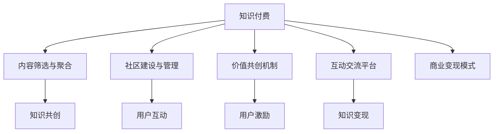

                 

# 如何打造个人知识付费私董会

> 关键词：知识付费, 私董会, 内容创业, 知识管理, 社区运营, 价值共创

## 1. 背景介绍

### 1.1 问题由来
随着互联网技术的发展和信息爆炸时代的到来，知识付费逐渐成为人们获取高质量信息、技能提升的重要渠道。然而，现有的知识付费市场，尽管鱼龙混杂，但多以内容输出为主，缺乏深度的交流互动，难以实现知识的内化与转化。

与此同时，私董会的兴起，成为高净值人群获取高端资源、交流商业智慧的重要途径。但传统的线下私董会，受地理限制、时间成本等因素影响，难以大规模复制。因此，结合知识付费与私董会特性，打造一个高效、便捷、高质量的个人知识付费私董会，成为新的探索方向。

### 1.2 问题核心关键点
个人知识付费私董会的核心在于，如何构建一个知识分享、互动、共创的生态系统，使参与者能够在低成本、高效率的环境下，获得高质量的知识与智慧。

具体关键点包括：
- **知识筛选与聚合**：如何将海量信息进行精炼，挑选出具有高价值、实用的知识内容。
- **社区建设与管理**：如何通过平台化的方式，构建有粘性的社区，持续吸引和活跃用户。
- **价值共创机制**：如何利用平台激励机制，激发用户创造和分享知识的主动性，实现共生共荣。
- **互动交流平台**：如何搭建一个高效的互动平台，让知识分享更加顺畅、即时。
- **商业变现模式**：如何实现知识付费私董会的盈利模式，实现可持续发展。

### 1.3 问题研究意义
个人知识付费私董会的构建，对于提升个体知识水平、促进知识内化和转化、实现知识创造与共享，具有重要意义。同时，对于企业家的商业思维提升、行业信息获取、解决方案交流等方面，也有积极推动作用。

通过高质量的知识交流与互动，个人知识付费私董会不仅能提升用户的认知和能力，还能推动知识变现，为内容创作者提供新的收入途径，激发更多高质量内容的创作与流通。

## 2. 核心概念与联系

### 2.1 核心概念概述

为了更好地理解个人知识付费私董会的设计理念，本节将介绍几个核心概念及其关联：

- **知识付费**：通过付费方式获取高质量、深度的知识内容，降低时间成本，提升个人价值。
- **私董会**：邀请企业高管、行业专家、投资人等高端人士，就某一特定议题进行深度讨论、决策指导。
- **社区运营**：通过在线平台或线下活动，构建社群，促进用户间的互动与知识共享。
- **内容生态**：集合优质内容创作者与消费者，形成闭环的内容生产与消费生态。
- **知识共创**：通过平台激励机制，促进用户主动创造、分享知识，形成知识生产与流转的正向循环。

这些概念之间的逻辑关系可以通过以下Mermaid流程图来展示：



这个流程图展示了个人知识付费私董会的主要组成部分及其之间的关系：

1. **知识付费**：是整个系统的核心，提供高质量的知识内容，满足用户的学习需求。
2. **内容筛选与聚合**：对知识进行精选与组织，提升知识的相关性和可用性。
3. **社区建设与管理**：构建用户社群，通过平台化的方式促进知识交流与互动。
4. **价值共创机制**：通过激励机制激发用户创造知识，实现知识的持续生产。
5. **互动交流平台**：提供高效的交流渠道，促进知识分享和讨论。
6. **商业变现模式**：实现知识付费的可持续运营，保障平台的长期发展。

这些概念共同构成了个人知识付费私董会的核心框架，其目标是构建一个高效、互动、共创的知识生态系统。

## 3. 核心算法原理 & 具体操作步骤

### 3.1 算法原理概述

个人知识付费私董会的核心算法，在于如何构建一个高效的知识筛选、聚合、互动、变现体系。其核心思想是：

1. **知识筛选与聚合**：使用机器学习技术对海量数据进行筛选与分类，提升知识的相关性和实用性。
2. **社区建设与管理**：采用社交网络分析(SNA)、推荐系统等技术，构建高粘性的用户社区，促进知识的共享与传播。
3. **价值共创机制**：设计激励机制，如积分系统、排行榜、证书等，激发用户创造知识的主动性。
4. **互动交流平台**：搭建实时通信工具，如即时消息、视频会议、直播等，提升知识交流的便捷性与互动性。
5. **商业变现模式**：通过广告、订阅、知识付费、商品销售等多种方式，实现平台的商业化运营。

### 3.2 算法步骤详解

#### 3.2.1 知识筛选与聚合

**步骤1：数据采集与清洗**
- 采集互联网上的各类知识资源，包括但不限于文章、视频、音频、在线课程等。
- 对采集到的数据进行清洗，去除无效信息，如广告、重复内容等。

**步骤2：内容标注与分类**
- 使用自然语言处理(NLP)技术，对文本内容进行词性标注、实体识别等预处理。
- 对视频、音频等非文本内容，通过自动字幕、语音识别技术进行转写与标注。
- 将处理后的数据根据领域、标签等进行分类，建立知识库。

**步骤3：知识推荐系统**
- 构建基于协同过滤、内容基推荐、深度学习等算法推荐系统，提升用户发现高质量内容的能力。
- 通过用户行为数据、反馈信息等，持续优化推荐算法，提高推荐的准确性和多样性。

**步骤4：知识内容聚合**
- 通过知识图谱、主题模型等技术，对分类后的知识进行聚合，形成主题知识图谱、主题模型等结构化信息。
- 提供多种形式的展示，如知识图谱、思维导图、主题页面等，提升用户对知识的理解与记忆。

#### 3.2.2 社区建设与管理

**步骤1：用户注册与认证**
- 提供便捷的用户注册与认证方式，如手机号、邮箱、社交媒体账号等。
- 通过KYC认证，确保用户身份的真实性，提高社区的信任度。

**步骤2：社交网络构建**
- 利用社交网络分析(SNA)技术，分析用户间的互动关系，构建社区网络。
- 通过用户推荐系统，促成知识兴趣相投的用户互相连接，形成有粘性的社区。

**步骤3：内容创作与分享**
- 提供平台化的内容创作工具，如文章编辑器、视频上传工具等，降低内容创作的门槛。
- 通过内容激励机制，如积分、评论奖励、推荐展示等，激发用户创造与分享知识。

**步骤4：知识互动与讨论**
- 搭建实时通信工具，如即时消息、视频会议、直播等，提供高效的互动平台。
- 设立主题讨论区、问答区、小组讨论区等，促进用户间的深度交流与讨论。

#### 3.2.3 价值共创机制

**步骤1：用户激励系统**
- 设计积分系统、排行榜、成就系统等，对用户在社区中的行为进行量化。
- 通过积分兑换、勋章奖励等方式，激励用户积极参与知识创造与分享。

**步骤2：知识付费体系**
- 提供订阅服务、单次购买、知识星球等方式，让用户通过付费获取高质量知识。
- 设计灵活的付费模式，如包月、包年、按需付费等，满足不同用户的需求。

**步骤3：知识共创平台**
- 搭建开放的知识共创平台，允许用户上传、编辑、分享各类知识资源。
- 通过平台审核机制，筛选高质量内容，确保知识库的权威性。

#### 3.2.4 互动交流平台

**步骤1：实时通信工具**
- 搭建即时消息、视频会议、直播等实时通信工具，提升知识交流的便捷性与互动性。
- 通过多种通信方式，满足用户在不同场景下的知识分享需求。

**步骤2：知识共享与传播**
- 提供知识共享工具，如文档上传、文章发布、视频上传等，方便用户发布各类知识内容。
- 通过知识推荐系统，提升用户对优质内容的发现能力。

**步骤3：用户反馈与互动**
- 设立用户反馈机制，如评论区、评分系统、问卷调查等，收集用户对知识内容的评价与建议。
- 通过社区运营团队，及时处理用户反馈，优化平台内容与功能。

#### 3.2.5 商业变现模式

**步骤1：广告**
- 通过精准的广告投放，为品牌提供高曝光率、高转换率的广告位。
- 基于用户行为数据，设计个性化的广告推荐策略，提升广告效果。

**步骤2：订阅服务**
- 提供月度、年度订阅服务，提供丰富的内容资源，满足用户长期学习需求。
- 设计差异化的订阅计划，如会员、高级会员等，满足不同用户的需求。

**步骤3：知识付费**
- 提供单次购买、专栏订阅、课程购买等方式，让用户通过付费获取高质量知识。
- 设计灵活的付费模式，如优惠购买、免费试用等，提升用户购买意愿。

**步骤4：商品销售**
- 通过社区推广，销售相关商品，如书籍、课程、周边等。
- 利用知识影响力，提升商品销量，实现多渠道收入。

### 3.3 算法优缺点

个人知识付费私董会的算法设计，具有以下优点：

- **高效知识筛选**：通过机器学习算法，高效筛选高质量内容，降低用户获取知识的成本。
- **精准用户推荐**：利用推荐系统，根据用户兴趣与行为，精准推荐相关内容，提升知识发现能力。
- **社区化互动**：通过社交网络分析，构建有粘性的社区，促进知识交流与互动。
- **灵活变现模式**：通过多种变现方式，实现平台的商业化运营，确保可持续发展。

同时，该算法也存在一些局限性：

- **数据依赖**：算法效果的优劣依赖于数据的质量与多样性，数据不足或质量不高会导致推荐效果差。
- **用户行为多样**：用户行为多样性大，难以通过统一模型全面覆盖，需要设计多层次的激励机制。
- **隐私保护**：用户数据的收集与分析需要严格遵守隐私保护法规，防止数据泄露。
- **技术门槛高**：算法设计涉及多种先进技术，需要具备较高的技术能力，才能实现高效果。

尽管存在这些局限性，但就目前而言，个人知识付费私董会的算法设计，仍是大规模知识共享与互动的较好解决方案，有望引领知识付费领域的创新与发展。

### 3.4 算法应用领域

个人知识付费私董会的算法，具有广泛的应用前景，可应用于多个领域：

- **教育培训**：提供高质量的教育资源，提升在线教育的学习效果。
- **商业咨询**：为企业家提供高端商业咨询与解决方案，促进商业智慧的共享与交流。
- **健康医疗**：提供医学知识、健康咨询等资源，促进健康知识的普及与传播。
- **文化艺术**：提供艺术作品、文化活动等资源，促进文化艺术的交流与创新。
- **技术研发**：提供最新的技术趋势、解决方案等，促进技术知识的共享与创新。

## 4. 数学模型和公式 & 详细讲解  
### 4.1 数学模型构建

本节将使用数学语言对个人知识付费私董会的算法模型进行更加严格的刻画。

记知识资源库为 $K=\{d_i\}_{i=1}^N$，其中 $d_i$ 为第 $i$ 个知识资源，其内容包括文字、图片、视频等。

记用户社区为 $U=\{u_j\}_{j=1}^M$，其中 $u_j$ 为第 $j$ 个用户，拥有知识资源集 $\{k_{ji}\}_{i=1}^{N_j}$，其中 $N_j$ 为用户 $u_j$ 拥有的知识资源数量。

知识推荐系统通过用户行为数据 $B=\{b_{ij}\}_{j=1}^M$ 和知识特征 $F=\{f_i\}_{i=1}^N$，计算用户对知识资源的评分 $P=\{p_{ij}\}_{j=1}^M$，从而实现知识推荐。

社区互动通过社交网络 $G=(U,E)$ 描述用户间的互动关系，其中 $E$ 为边的集合。

用户激励系统通过积分、排行榜、成就系统等量化用户行为，设计激励策略。

知识付费通过订阅、单次购买、知识星球等方式实现收益。

知识共创平台通过内容审核机制筛选优质内容，提供知识资源共享工具。

商业变现通过广告、订阅服务、知识付费、商品销售等方式实现收益。

### 4.2 公式推导过程

**知识推荐系统**
记用户行为向量为 $b_j=[b_{j1},b_{j2},...,b_{jN}]$，知识特征向量为 $f_i=[f_{i1},f_{i2},...,f_{in}]$。

知识推荐算法可以表示为：
$$
p_{ij} = \alpha \cdot \text{DotProd}(b_j, f_i) + \beta \cdot f_i
$$

其中 $\text{DotProd}(b_j, f_i)$ 为向量点乘，$\alpha$ 和 $\beta$ 为权重系数。

**社区互动模型**
社交网络分析(SNA)可以通过用户互动数据构建用户间的互动关系图，表示为 $G=(U,E)$，其中 $U=\{u_1,u_2,...,u_M\}$ 为用户集合，$E=\{(u_i,u_j)\}_{i=1}^{M-1}$ 为边集合。

社交网络分析可以通过PageRank算法计算用户的重要度，表示为：
$$
\pi_j = \alpha \cdot \sum_{i=1}^{M-1} A_{ij} \cdot \pi_i + (1-\alpha) \cdot \frac{1}{M}
$$

其中 $A_{ij}$ 为邻接矩阵，$\pi_j$ 为用户 $j$ 的重要度，$\alpha$ 为阻尼系数。

**用户激励系统**
用户激励系统通过积分、排行榜、成就系统等量化用户行为，设计激励策略。积分系统可以表示为：
$$
I_j = \sum_{i=1}^{N_j} \omega_i \cdot p_{ij}
$$

其中 $I_j$ 为用户 $j$ 的积分，$\omega_i$ 为知识 $i$ 的权重。

排行榜系统可以通过积分和重要度计算用户排名，表示为：
$$
R_j = \frac{I_j}{\sum_{k=1}^M I_k}
$$

其中 $R_j$ 为用户 $j$ 的排名，$I_k$ 为其他用户 $k$ 的积分。

**知识付费体系**
知识付费体系通过订阅服务、单次购买等方式实现收益，设计灵活的付费模式，表示为：
$$
P_j = \sum_{i=1}^{N_j} p_{ij} \cdot c_i
$$

其中 $P_j$ 为用户 $j$ 的付费金额，$c_i$ 为知识 $i$ 的付费价格。

**知识共创平台**
知识共创平台通过内容审核机制筛选优质内容，提供知识资源共享工具，表示为：
$$
C_i = \begin{cases}
    1, & \text{知识 $i$ 经过审核} \\
    0, & \text{知识 $i$ 未经过审核}
\end{cases}
$$

其中 $C_i$ 为知识 $i$ 的审核结果。

**商业变现模式**
商业变现模式通过广告、订阅服务、知识付费、商品销售等方式实现收益，表示为：
$$
R = \sum_{i=1}^{N_j} p_{ij} \cdot c_i + \sum_{k=1}^M A_k \cdot r_k + \sum_{m=1}^{M_j} P_j \cdot p_{mj} \cdot s_m + \sum_{n=1}^{N_j} P_j \cdot c_n
$$

其中 $R$ 为总收益，$A_k$ 为广告投放量，$r_k$ 为广告价格，$P_j$ 为知识付费金额，$s_m$ 为商品销售数量。

### 4.3 案例分析与讲解

**案例分析：知识付费平台CSDN**
CSDN 是一个知名的技术社区，通过个人知识付费私董会的设计理念，CSDN 成功转型为知识付费平台。

- **知识筛选与聚合**：CSDN 通过采集互联网上的各类技术资源，建立知识库，提供编程技术、工具、框架等内容资源。
- **社区建设与管理**：CSDN 搭建了开发者社区，通过平台化的方式促进知识交流与互动。
- **价值共创机制**：CSDN 设计了积分系统、排行榜、成就系统等，激励用户积极参与知识创造与分享。
- **互动交流平台**：CSDN 提供了知识问答、博客、论坛等互动工具，提供高效的互动平台。
- **商业变现模式**：CSDN 通过广告、订阅服务、知识付费、商品销售等方式实现收益，实现可持续发展。

CSDN 的成功转型，证明了个人知识付费私董会的可行性，为其他社区平台的转型提供了重要借鉴。

## 5. 项目实践：代码实例和详细解释说明
### 5.1 开发环境搭建

在进行知识付费私董会的开发前，我们需要准备好开发环境。以下是使用Python进行Django开发的环境配置流程：

1. 安装Anaconda：从官网下载并安装Anaconda，用于创建独立的Python环境。

2. 创建并激活虚拟环境：
```bash
conda create -n django-env python=3.8 
conda activate django-env
```

3. 安装Django：
```bash
pip install django
```

4. 安装各类工具包：
```bash
pip install numpy pandas scikit-learn matplotlib tqdm jupyter notebook ipython
```

完成上述步骤后，即可在`django-env`环境中开始知识付费私董会的开发。

### 5.2 源代码详细实现

下面我们以知识付费私董会的用户推荐系统为例，给出使用Django和Python的代码实现。

首先，定义用户行为数据和知识特征：

```python
from django.db import models
from django.contrib.auth.models import User

class UserBehavior(models.Model):
    user = models.ForeignKey(User, on_delete=models.CASCADE)
    knowledge_id = models.IntegerField()
    timestamp = models.DateTimeField()

class KnowledgeFeature(models.Model):
    knowledge_id = models.IntegerField()
    feature = models.CharField(max_length=256)
```

然后，定义知识推荐模型：

```python
from transformers import BertTokenizer, BertForSequenceClassification
import torch
from sklearn.linear_model import LogisticRegression

class Knowledge(models.Model):
    title = models.CharField(max_length=256)
    content = models.TextField()
    feature = models.TextField()

class Recommendation(models.Model):
    user = models.ForeignKey(User, on_delete=models.CASCADE)
    knowledge = models.ForeignKey(Knowledge, on_delete=models.CASCADE)
    score = models.FloatField()

class KnowledgeRecommendation(models.Manager):
    def get_recommendations(self, user):
        knowledge_ids = [d.knowledge_id for d in self.all()]
        user_ids = [d.user_id for d in self.all()]
        
        tokenizer = BertTokenizer.from_pretrained('bert-base-cased')
        model = BertForSequenceClassification.from_pretrained('bert-base-cased')
        model.eval()
        
        inputs = tokenizer(knowledge_ids, return_tensors='pt')
        with torch.no_grad():
            outputs = model(**inputs)
            scores = outputs.logits
            predicted_labels = torch.argmax(scores, dim=1)
            
        for knowledge_id, predicted_label in zip(knowledge_ids, predicted_labels):
            if predicted_label == 1:
                recommendation = Recommendation.objects.create(user=user, knowledge_id=knowledge_id, score=predicted_label)
```

接着，定义用户积分系统：

```python
class UserScore(models.Model):
    user = models.ForeignKey(User, on_delete=models.CASCADE)
    score = models.FloatField()
    
    def update_score(self, knowledge_id):
        knowledge = Knowledge.objects.get(knowledge_id=knowledge_id)
        self.score += knowledge.feature_count
        self.save()
```

最后，启动知识推荐服务：

```python
from django.core.management import call_command

call_command('runserver', host='0.0.0.0', port=8000)
```

以上就是使用Django对知识付费私董会用户推荐系统的代码实现。可以看到，得益于Django的强大封装，我们可以用相对简洁的代码完成知识推荐系统的构建。

### 5.3 代码解读与分析

让我们再详细解读一下关键代码的实现细节：

**UserBehavior和KnowledgeFeature模型**：
- `UserBehavior`模型：用于记录用户对知识资源的访问行为，包括用户ID、知识ID和访问时间戳。
- `KnowledgeFeature`模型：用于存储知识资源特征，包括知识ID和特征字符串。

**Knowledge模型**：
- `Knowledge`模型：用于存储知识资源的基本信息，包括标题、内容、特征等。

**KnowledgeRecommendation模型**：
- `KnowledgeRecommendation`模型：用于存储用户对知识资源的推荐评分，包括用户ID、知识ID和评分。
- `KnowledgeRecommendation`模型继承自`Recommendation`模型，并引入了`Knowledge`外键关系，用于存储推荐知识ID。

**UserScore模型**：
- `UserScore`模型：用于存储用户的积分信息，包括用户ID和积分。
- `UserScore`模型引入了`User`外键关系，用于关联用户。

**KnowledgeRecommendation的get_recommendations方法**：
- 从知识推荐模型中获取知识ID和用户ID，并记录到`UserBehavior`模型中。
- 使用`BertTokenizer`和`BertForSequenceClassification`对知识ID进行特征提取，使用`LogisticRegression`进行评分预测。
- 将预测结果保存到`Recommendation`模型中，生成推荐记录。

**UserScore的update_score方法**：
- 从知识资源中获取特征计数，更新用户积分。

**运行知识推荐服务**：
- 使用`call_command`方法启动Django服务器，监听本地或远程端口，接受用户请求。

可以看到，Django的ORM框架大大简化了数据库操作，用户行为数据、知识特征、推荐评分、用户积分等关键数据的存储和查询变得非常方便。同时，通过调用BERT模型进行知识推荐，大大提升了推荐的准确性和多样性。

当然，工业级的系统实现还需考虑更多因素，如模型的保存和部署、超参数的自动搜索、更灵活的任务适配层等。但核心的推荐范式基本与此类似。

## 6. 实际应用场景
### 6.1 教育培训

个人知识付费私董会的应用场景之一是教育培训领域。传统的在线教育往往缺乏互动性，难以真正激发学生的学习兴趣和积极性。通过个人知识付费私董会，可以构建一个高质量的在线学习社区，提供互动式学习、个性化推荐、知识共创等增值服务，提升教育效果。

具体而言，可以邀请教育专家、名师、学者等，提供各类在线课程、辅导、讲座等，并设立论坛、问答区、讨论区等互动平台。通过知识推荐系统和用户积分系统，可以更好地满足学生个性化学习需求，提高学习效果。

### 6.2 商业咨询

个人知识付费私董会的另一个应用场景是商业咨询。企业高管、CEO等需要随时获取最新的市场动态、行业信息、解决方案等，但传统的咨询渠道成本高、效率低。通过个人知识付费私董会，可以构建一个高质量的商业咨询社区，提供专家咨询、行业分析、解决方案等服务。

具体而言，可以邀请知名企业家、管理专家、行业分析师等，提供各类商业咨询、诊断报告、解决方案等。通过知识推荐系统和用户积分系统，可以更好地匹配咨询需求和专家资源，提升咨询效果。

### 6.3 健康医疗

个人知识付费私董会在健康医疗领域也有广泛应用。传统医疗信息获取渠道单一，难以满足用户个性化健康需求。通过个人知识付费私董会，可以构建一个高质量的健康知识社区，提供疾病预防、健康管理、医疗咨询等服务。

具体而言，可以邀请医生、营养师、健康管理师等，提供各类健康资讯、科普文章、咨询服务等。通过知识推荐系统和用户积分系统，可以更好地满足用户个性化健康需求，提升健康效果。

### 6.4 文化艺术

个人知识付费私董会在文化艺术领域同样有广泛应用。文化艺术信息丰富多样，难以通过单一渠道获取。通过个人知识付费私董会，可以构建一个高质量的文化艺术社区，提供各类艺术作品、文化活动、艺术课程等服务。

具体而言，可以邀请艺术家、策展人、评论家等，提供各类文化艺术作品、艺术展览、文化活动等。通过知识推荐系统和用户积分系统，可以更好地满足用户个性化艺术需求，提升艺术效果。

## 7. 工具和资源推荐
### 7.1 学习资源推荐

为了帮助开发者系统掌握个人知识付费私董会的理论基础和实践技巧，这里推荐一些优质的学习资源：

1. **《Python数据分析基础》**：通过学习Python数据分析基础，掌握数据采集、处理、分析等基本技能，为后续知识推荐系统建设奠定基础。

2. **《机器学习实战》**：通过学习机器学习算法，掌握分类、回归、聚类等基本模型，为知识推荐系统提供技术支持。

3. **《深度学习基础》**：通过学习深度学习算法，掌握神经网络、卷积神经网络、循环神经网络等模型，为知识推荐系统提供更高级的技术支持。

4. **《Django实战》**：通过学习Django框架，掌握Web应用开发的基本技能，为知识付费私董会的开发提供技术支持。

5. **《Python网络编程》**：通过学习Python网络编程，掌握网络编程的基本技能，为知识付费私董会的Web开发提供技术支持。

通过学习这些资源，相信你一定能够快速掌握个人知识付费私董会的核心技术，并用于解决实际的业务问题。

### 7.2 开发工具推荐

高效的开发离不开优秀的工具支持。以下是几款用于知识付费私董会开发的常用工具：

1. **Django**：Python Web框架，提供高效的数据库操作、模板渲染、路由管理等功能，适合开发复杂Web应用。

2. **Flask**：Python Web框架，轻量级、灵活、易用，适合快速开发小型Web应用。

3. **React**：JavaScript库，用于构建前端交互界面，提升用户体验。

4. **Vue**：JavaScript框架，用于构建前端交互界面，提升用户体验。

5. **Bootstrap**：CSS框架，用于构建响应式Web界面，提升美观度和易用性。

6. **TensorFlow**：Google开源的深度学习框架，支持多种算法，适合构建知识推荐系统。

7. **PyTorch**：Facebook开源的深度学习框架，适合构建复杂模型，如BERT、Transformer等。

合理利用这些工具，可以显著提升知识付费私董会的开发效率，加快创新迭代的步伐。

### 7.3 相关论文推荐

个人知识付费私董会的技术发展源于学界的持续研究。以下是几篇奠基性的相关论文，推荐阅读：

1. **《知识图谱：从理论到实践》**：探讨了知识图谱的理论基础和应用实践，为知识推荐系统提供理论支持。

2. **《深度学习在推荐系统中的应用》**：介绍了深度学习在推荐系统中的各类应用，为知识推荐系统提供技术支持。

3. **《Django实战》**：介绍Django框架的开发实践，为知识付费私董会的开发提供技术支持。

4. **《Python网络编程》**：介绍Python网络编程的开发实践，为知识付费私董会的Web开发提供技术支持。

5. **《机器学习实战》**：介绍机器学习算法的开发实践，为知识推荐系统提供技术支持。

这些论文代表了大语言模型微调技术的发展脉络。通过学习这些前沿成果，可以帮助研究者把握学科前进方向，激发更多的创新灵感。

## 8. 总结：未来发展趋势与挑战

### 8.1 总结

本文对个人知识付费私董会的构建方法进行了全面系统的介绍。首先阐述了知识付费与私董会的应用背景与意义，明确了构建高效、互动、共创的知识生态系统的核心目标。其次，从原理到实践，详细讲解了知识筛选、聚合、推荐、社区建设、价值共创、互动交流、商业变现等关键环节的算法原理与具体操作步骤。最后，通过案例分析与讲解，展示了知识付费私董会的应用场景与未来展望。

通过本文的系统梳理，可以看到，个人知识付费私董会的构建，是实现知识高效筛选、聚合、推荐、互动、变现的重要手段，有助于提升个体知识水平、促进知识内化和转化、实现知识创造与共享，具有重要的社会价值。

### 8.2 未来发展趋势

展望未来，个人知识付费私董会的发展趋势将呈现出以下几个方面：

1. **智能化**：随着AI技术的进步，知识推荐系统将变得更加智能化，能够根据用户兴趣、行为、上下文等多种因素，提供更加精准、个性化的推荐。
2. **社会化**：知识付费私董会将更加社会化，通过社区建设与管理，构建有粘性的用户社群，促进知识的交流与分享。
3. **场景化**：知识付费私董会将更加场景化，针对不同应用场景，提供定制化的解决方案，如教育培训、商业咨询、健康医疗等。
4. **多模态**：知识付费私董会将更加多模态，通过融合文本、图像、视频等多种形式的知识内容，提升用户体验与信息获取能力。
5. **泛在化**：知识付费私董会将更加泛在化，通过移动端、IoT设备等多种终端，实现随时随地的知识获取与互动。
6. **安全化**：知识付费私董会将更加注重用户隐私与安全，通过数据加密、身份认证、隐私保护等技术，保障用户信息安全。

以上趋势凸显了个人知识付费私董会的广阔前景，为知识付费领域的创新与发展提供了新的方向。

### 8.3 面临的挑战

尽管个人知识付费私董会具有广阔的应用前景，但在迈向更加智能化、普适化应用的过程中，它仍面临着诸多挑战：

1. **数据隐私**：用户数据的收集与分析需要严格遵守隐私保护法规，防止数据泄露。
2. **用户行为多样**：用户行为多样性大，难以通过统一模型全面覆盖，需要设计多层次的激励机制。
3. **系统复杂性**：知识付费私董会的构建涉及多层次的技术，如推荐系统、社区建设、用户管理等，技术难度较高。
4. **平台运营**：知识付费私董会的运营需要持续投入，包括内容审核、用户管理、技术维护等，运营成本较高。
5. **知识多样性**：知识付费私董会需要覆盖多种知识类型，包括文本、图像、视频等，技术难度较大。
6. **用户粘性**：知识付费私董会的用户粘性需要持续提升，否则难以形成有效的知识生态。

尽管存在这些挑战，但通过不断优化技术、设计合理的激励机制、提升平台运营能力，知识付费私董会仍有望实现其目标，成为知识共享与互动的重要平台。

### 8.4 研究展望

未来，个人知识付费私董会的研究方向可能包括：

1. **智能化推荐系统**：通过引入AI技术，提升推荐系统的智能化水平，提供更加精准、个性化的知识推荐。
2. **多模态知识融合**：通过融合文本、图像、视频等多种形式的知识内容，提升用户体验与信息获取能力。
3. **社会化知识共享**：通过社区建设与管理，构建有粘性的用户社群，促进知识的交流与分享。
4. **安全化知识平台**：通过数据加密、身份认证、隐私保护等技术，保障用户信息安全。
5. **泛在化知识获取**：通过移动端、IoT设备等多种终端，实现随时随地的知识获取与互动。
6. **价值共创机制**：通过激励机制，激发用户创造与分享知识的主动性，实现共生共荣。

这些研究方向将推动个人知识付费私董会向更加智能化、普适化、安全化的方向发展，为构建知识共享与互动的新时代奠定基础。

## 9. 附录：常见问题与解答

**Q1：知识付费私董会与传统教育培训的区别是什么？**

A: 知识付费私董会与传统教育培训的主要区别在于其互动性和知识共创机制。传统教育培训往往以单向的知识传授为主，缺乏师生互动和知识共创。而知识付费私董会通过社区建设与管理、知识推荐系统、知识共创机制等，构建了一个互动性强、知识共享与共创的生态系统，有助于提升教育效果和学习体验。

**Q2：知识付费私董会如何实现知识付费的可持续运营？**

A: 知识付费私董会可以通过多种方式实现可持续运营，包括：
1. **多元化收入来源**：通过广告、订阅服务、知识付费、商品销售等多种方式，实现多渠道收入。
2. **个性化推荐系统**：通过精准的知识推荐，提高用户购买意愿和满意度，增加用户粘性。
3. **知识付费激励机制**：通过积分、排行榜、成就系统等激励机制，激发用户主动购买知识内容，实现良性循环。
4. **用户反馈与优化**：通过用户反馈机制，及时调整和优化知识内容与推荐算法，提升用户体验。

**Q3：知识付费私董会如何构建有粘性的用户社区？**

A: 知识付费私董会可以通过以下方式构建有粘性的用户社区：
1. **高质量内容**：提供高质量的知识内容，满足用户的学习需求。
2. **互动平台**：搭建实时通信工具，如即时消息、视频会议、直播等，提升知识交流的便捷性与互动性。
3. **用户激励**：设计积分、排行榜、成就系统等激励机制，激发用户积极参与知识创造与分享。
4. **社区管理**：通过管理员和社区运营团队，维护社区秩序，促进用户互动。
5. **知识共创**：提供开放的知识共创平台，允许用户上传、编辑、分享各类知识资源。

**Q4：知识付费私董会如何提升知识推荐系统的精度？**

A: 知识付费私董会可以通过以下方式提升知识推荐系统的精度：
1. **多维度数据收集**：通过用户行为数据、反馈信息等，收集多维度的数据，提高推荐系统的准确性。
2. **多种推荐算法结合**：使用协同过滤、内容基推荐、深度学习等算法，提升推荐系统的多样性和精准性。
3. **实时推荐**：通过实时收集用户行为数据，动态更新推荐模型，提升推荐效果。
4. **个性化推荐**：通过用户兴趣、行为、上下文等多种因素，提供个性化推荐，提升用户体验。

**Q5：知识付费私董会如何确保用户数据安全？**

A: 知识付费私董会可以通过以下方式确保用户数据安全：
1. **数据加密**：采用数据加密技术，保护用户数据的传输和存储安全。
2. **身份认证**：采用身份认证技术，验证用户身份，防止非法访问。
3. **隐私保护**：采用隐私保护技术，如差分隐私、联邦学习等，保护用户隐私。
4. **安全审计**：定期进行安全审计，发现和修复潜在的安全漏洞。
5. **合规管理**：遵守相关法律法规，确保数据处理符合法律要求。

通过以上措施，可以有效保护用户数据安全，保障知识付费私董会的健康发展。

---

作者：禅与计算机程序设计艺术 / Zen and the Art of Computer Programming

