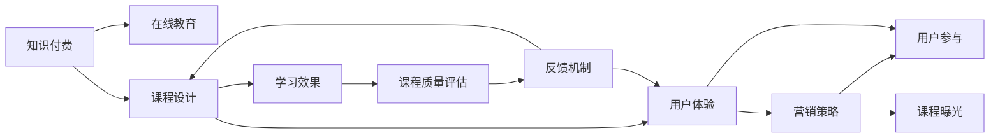

                 

# 如何打造爆款知识付费课程

> 关键词：知识付费, 教育技术, 课程设计, 在线教育, 用户体验, 学习效果, 营销策略

## 1. 背景介绍

随着互联网的普及和技术的进步，在线教育和知识付费市场迎来了爆发式增长。据统计，2022年中国知识付费市场规模已突破500亿元，预计到2025年将达到800亿元以上。在线教育平台如Coursera、Udemy、网易云课堂、得到等纷纷涌现，知识付费课程内容日益丰富。然而，市场虽然繁荣，但同质化竞争加剧，内容质量良莠不齐，用户选择困难，企业盈利模式也面临考验。如何打造爆款知识付费课程，成为各大教育平台和内容创作者亟需解决的问题。

知识付费课程的运营不仅仅是传授知识，更是艺术与科学的完美结合。通过深入挖掘用户需求、巧妙设计和优化用户体验，课程才能脱颖而出。本文将从课程设计、用户体验、营销策略等方面，全方位解析打造爆款知识付费课程的精髓。

## 2. 核心概念与联系

### 2.1 核心概念概述

在探讨如何打造爆款知识付费课程前，首先需要理解几个核心概念：

- **知识付费**：指消费者为获取专业知识或技能，通过付费订阅、单次购买等方式支付一定费用，以获取高质量的学习资源和服务。
- **在线教育**：指通过互联网平台提供的远程教育服务，打破了传统教育的地理和时间限制，提供灵活、互动的学习体验。
- **课程设计**：指根据目标受众和学习目标，系统规划课程内容、结构、形式、评估等要素的过程。
- **用户体验**：指用户在学习课程过程中的整体感受和满意度，包括课程的易用性、互动性、个性化程度等。
- **学习效果**：指用户通过课程学习后所获得的知识和技能提升程度，包括知识掌握、技能提升、思维转变等方面。
- **营销策略**：指通过各种渠道和手段，提升课程曝光度、用户参与度和转化率的方法。

这些概念之间存在紧密的联系。例如，课程设计直接影响学习效果和用户体验；用户体验和学习效果则影响营销策略的选择和效果。

### 2.2 核心概念原理和架构的 Mermaid 流程图



此图展示了核心概念之间的逻辑关系。知识付费是基础，在线教育提供平台，课程设计是核心，用户体验和学习效果是目标，营销策略是手段，最终目的在于提升用户参与度和课程曝光度。

## 3. 核心算法原理 & 具体操作步骤

### 3.1 算法原理概述

打造爆款知识付费课程的过程，其实是一个多变量优化问题。课程的成功不仅取决于内容质量，还与用户体验、营销策略等诸多因素密切相关。核心算法原理可以从以下几个方面进行理解：

1. **用户需求分析**：通过数据分析工具，如问卷调查、用户行为追踪、热点关注等，了解目标受众的兴趣、痛点和需求，从而设计出具有市场竞争力的课程。
2. **课程内容优化**：采用机器学习等技术，对课程内容进行智能化筛选和优化，提升学习效果。
3. **用户体验提升**：使用A/B测试等方法，不断优化课程界面和互动功能，提升用户满意度和留存率。
4. **营销策略迭代**：利用大数据分析，精准定位目标用户，设计高效的营销方案，通过多渠道推广，提升课程曝光度和转化率。

### 3.2 算法步骤详解

打造爆款课程主要包括以下关键步骤：

1. **市场调研与需求分析**：通过问卷调查、访谈、市场分析等方式，收集目标用户的学习需求、痛点和使用习惯，制定课程大纲。
2. **内容设计**：根据用户需求，设计课程内容框架，包括核心知识点、实践案例、作业、讨论等。
3. **技术实现**：选择合适的学习平台和开发工具，如LMS、视频制作工具、在线协作平台等，将课程内容呈现出来。
4. **用户体验优化**：通过A/B测试、用户反馈等手段，不断优化课程界面、互动功能和教学方法，提升用户体验。
5. **效果评估与迭代**：采用量化和定性方法，评估课程学习效果，根据用户反馈和评估结果进行迭代优化。
6. **营销推广**：利用SEO、社交媒体、广告投放、内容营销等多种手段，提升课程曝光度和用户参与度，完成销售转化。

### 3.3 算法优缺点

打造爆款课程的算法具有以下优点：

- **提高学习效果**：通过数据分析和优化，课程内容更加贴合用户需求，提升学习效率和效果。
- **提升用户体验**：通过用户反馈和优化迭代，提升课程的互动性和个性化程度，增强用户粘性。
- **降低营销成本**：通过精准定位和高效推广手段，提升课程转化率，减少营销成本。

同时，也存在一些缺点：

- **资源投入高**：需要大量的时间、人力、财力进行市场调研、内容设计、技术实现和优化迭代。
- **市场风险大**：课程市场竞争激烈，内容同质化严重，存在较高的市场风险。
- **用户需求多变**：市场需求和技术进步不断变化，课程需不断更新迭代，才能保持市场竞争力。

### 3.4 算法应用领域

打造爆款课程的算法不仅适用于在线教育，还广泛应用于企业培训、职业技能提升、心理咨询、健康管理等多个领域。

- **企业培训**：为企业员工提供个性化、定制化的学习课程，提升员工技能和工作效率。
- **职业技能提升**：帮助学员掌握特定领域的技能，如编程、设计、营销等，提升职业竞争力。
- **心理咨询**：提供心理健康知识，帮助用户解决心理问题，提升心理健康水平。
- **健康管理**：教授健康生活方式、疾病预防等知识，提升用户健康水平。

## 4. 数学模型和公式 & 详细讲解 & 举例说明

### 4.1 数学模型构建

假设课程成功率为 $P$，用户满意度为 $S$，营销投入为 $C$，课程成本为 $F$。则课程成功的数学模型为：

$$ P = f(S, C, F) $$

其中 $f$ 为非线性函数，反映了用户满意度、营销投入和课程成本对课程成功的影响。

### 4.2 公式推导过程

根据上述模型，假设用户满意度 $S$ 与课程内容质量 $Q$ 和用户体验 $U$ 成正比关系，即 $S = k_1Q + k_2U$，其中 $k_1, k_2$ 为常数。营销投入 $C$ 与市场调研投入 $M$ 和推广渠道选择 $C$ 成正比关系，即 $C = m_1M + m_2C$，其中 $m_1, m_2$ 为常数。课程成本 $F$ 与课程设计和开发成本 $D$ 和内容更新成本 $U$ 成正比关系，即 $F = d_1D + d_2U$，其中 $d_1, d_2$ 为常数。

将这些关系代入模型 $P = f(S, C, F)$ 中，可得：

$$ P = f(k_1Q + k_2U, m_1M + m_2C, d_1D + d_2U) $$

### 4.3 案例分析与讲解

以Coursera平台上的一门爆款课程为例，分析其成功因素：

- **课程设计**：课程分为多个模块，每个模块都有明确的学习目标和考核标准，确保学习效果。
- **用户体验**：课程采用互动式学习方式，包括视频讲解、作业、讨论等，提升用户参与度。
- **营销策略**：课程通过多种渠道推广，包括SEO优化、社交媒体营销、合作伙伴推广等，提升课程曝光度。

## 5. 项目实践：代码实例和详细解释说明

### 5.1 开发环境搭建

要打造爆款课程，首先需要搭建开发环境。以下是一个基于Python和Django框架的课程开发环境搭建流程：

1. 安装Python和Pip，确保最新版本。
2. 安装Django框架，使用以下命令：
   ```
   pip install Django
   ```
3. 创建Django项目和应用：
   ```
   django-admin startproject project_name
   cd project_name
   python manage.py startapp course
   ```
4. 安装第三方库，如TensorFlow、Pillow等，用于内容处理和图像处理。
5. 使用SQLite或MySQL等数据库，存储用户信息和课程数据。

### 5.2 源代码详细实现

以下是一个简单的Django应用示例，用于实现课程注册、登录、学习等功能：

```python
# views.py
from django.shortcuts import render, redirect
from django.contrib.auth.decorators import login_required
from django.contrib.auth import authenticate, login

def login_view(request):
    if request.method == 'POST':
        username = request.POST['username']
        password = request.POST['password']
        user = authenticate(username=username, password=password)
        if user is not None:
            login(request, user)
            return redirect('home')
    return render(request, 'login.html')

@login_required
def course_view(request, course_id):
    # 加载课程数据
    course = Course.objects.get(id=course_id)
    # 获取用户学习进度
    user_progress = UserProgress.objects.filter(user=request.user, course=course).first()
    if not user_progress:
        user_progress = UserProgress(course=course, user=request.user, progress=0)
        user_progress.save()
    # 渲染课程页面
    return render(request, 'course.html', {'course': course, 'user_progress': user_progress})

@login_required
def progress_view(request, course_id):
    # 加载课程数据
    course = Course.objects.get(id=course_id)
    # 更新用户学习进度
    user_progress = UserProgress.objects.filter(user=request.user, course=course).first()
    if user_progress:
        user_progress.progress += 1
        user_progress.save()
    return redirect('course', course_id)

# models.py
from django.db import models

class Course(models.Model):
    title = models.CharField(max_length=100)
    description = models.TextField()
    start_date = models.DateTimeField()
    end_date = models.DateTimeField()
    ...

class UserProgress(models.Model):
    user = models.ForeignKey(User, on_delete=models.CASCADE)
    course = models.ForeignKey(Course, on_delete=models.CASCADE)
    progress = models.IntegerField(default=0)
```

### 5.3 代码解读与分析

在上述代码中，我们主要使用了Django的视图函数、模型和模板等组件：

- `login_view`：处理用户登录请求，验证用户名和密码后，将用户登录状态保存在session中。
- `course_view`：加载课程数据和用户学习进度，渲染课程页面。
- `progress_view`：更新用户学习进度，重新加载课程页面。

这个简单的Django应用示例展示了如何实现基本的课程学习功能。在实际开发中，还需要考虑用户注册、课程管理、课程统计、支付功能等更多复杂场景。

### 5.4 运行结果展示

运行以上代码后，可以在浏览器中访问`/course/<course_id>`路径，查看课程内容和用户学习进度。用户可以逐步学习课程内容，系统自动记录进度，帮助用户跟踪学习状态。

## 6. 实际应用场景

### 6.1 企业内部培训

企业内部培训是打造爆款课程的重要应用场景之一。通过企业内部平台，可以为员工提供定制化的培训课程，提升职业技能和工作效率。以下是一个企业内部培训系统的实际应用示例：

- **需求分析**：通过调研和访谈，了解员工的培训需求和技能短板。
- **课程设计**：设计多门实用课程，涵盖项目管理、团队协作、数据分析等多个领域。
- **技术实现**：搭建企业内部学习平台，使用Django等框架实现课程管理系统。
- **用户体验优化**：优化课程界面和交互功能，提供实时反馈和学习报告。
- **效果评估与迭代**：定期评估员工培训效果，根据反馈进行课程迭代和更新。

### 6.2 在线职业课程

在线职业课程是知识付费市场的重要组成部分。通过在线平台，学员可以随时随地学习，掌握新技能，提升职业竞争力。以下是一个在线职业课程的实际应用示例：

- **市场调研**：通过市场调研，了解目标受众的需求和学习习惯。
- **课程设计**：设计系统化课程，涵盖基础知识和高级技能，提供实战项目练习。
- **技术实现**：使用视频制作工具、在线协作平台等，将课程内容呈现出来。
- **用户体验优化**：优化课程界面和互动功能，提升用户参与度和留存率。
- **营销推广**：利用社交媒体、SEO优化、广告投放等手段，提升课程曝光度和转化率。

### 6.3 个人兴趣学习

个人兴趣学习是知识付费的重要用户群体。通过在线平台，用户可以学习自己喜欢的课程，提升自我修养和生活质量。以下是一个个人兴趣学习系统的实际应用示例：

- **需求分析**：通过问卷调查，了解目标用户的兴趣和学习需求。
- **课程设计**：设计多样化课程，涵盖文学、艺术、健康等多个领域。
- **技术实现**：使用视频制作工具、在线协作平台等，将课程内容呈现出来。
- **用户体验优化**：优化课程界面和互动功能，提升用户参与度和留存率。
- **营销推广**：利用社交媒体、SEO优化、内容营销等手段，提升课程曝光度和转化率。

## 7. 工具和资源推荐

### 7.1 学习资源推荐

要打造爆款知识付费课程，需要持续学习和积累相关知识。以下是一些推荐的优质学习资源：

1. **Udemy《课程设计：打造爆款在线课程》**：详细介绍了课程设计、用户体验和营销策略等方面的知识。
2. **Coursera《学习技术：构建和设计在线课程》**：由知名教育专家授课，涵盖在线课程开发和设计的全面知识。
3. **edX《设计有效在线课程》**：讲解如何设计和优化在线课程，提升学习效果和用户体验。
4. **Google数字营销学院《数字营销基础》**：介绍数字营销的基本知识和技能，帮助课程营销推广。
5. **LinkedIn Learning《课程设计最佳实践》**：提供实用的课程设计技巧和案例，帮助提升课程质量。

### 7.2 开发工具推荐

要高效开发和管理知识付费课程，需要一些优秀的开发工具：

1. **Django**：Python的Web开发框架，适合快速搭建和开发课程管理系统。
2. **TensorFlow**：强大的机器学习框架，可用于课程内容优化和学习效果评估。
3. **React**：前端开发框架，可用于优化课程界面和交互功能。
4. **AWS/Azure/GCP**：云平台，可用于课程数据存储和在线平台部署。
5. **Figma/Adobe XD**：原型设计和UI/UX工具，可用于课程界面设计和用户体验优化。

### 7.3 相关论文推荐

以下是一些与知识付费和在线教育相关的经典论文，推荐阅读：

1. **《Kaggle与数据科学教育：一种新兴的在线学习范式》**：分析了Kaggle等平台的成功经验，探讨了在线学习的新趋势。
2. **《从MOOC到XMOOC：下一代在线教育》**：讨论了MOOC（大规模开放在线课程）的局限性，提出了XMOOC（体验驱动的大规模开放在线课程）的新概念。
3. **《在线学习系统中的自适应性反馈：一项随机对照试验》**：通过随机对照试验，评估了自适应反馈对在线学习效果的影响。
4. **《社交媒体如何改变高等教育？》**：分析了社交媒体对高等教育的影响，探讨了在线学习的未来方向。

## 8. 总结：未来发展趋势与挑战

### 8.1 研究成果总结

打造爆款知识付费课程的研究涵盖了课程设计、用户体验、营销策略等多个方面。通过深入分析用户需求和市场趋势，结合技术和方法论，可以不断优化课程内容和学习方式，提升用户满意度和学习效果。

### 8.2 未来发展趋势

未来知识付费课程的发展趋势主要包括：

1. **个性化学习**：利用AI和大数据分析，提供个性化的学习路径和推荐，满足不同用户的学习需求。
2. **虚拟现实和增强现实**：通过VR/AR技术，提供沉浸式学习体验，增强用户参与度。
3. **实时互动与反馈**：利用聊天机器人、实时测试等技术，提供实时互动和反馈，提升学习效果。
4. **移动学习**：开发移动端应用，提供随时随地的学习体验，方便用户利用碎片时间学习。
5. **跨领域融合**：将课程内容与多个领域知识进行融合，提升课程的实用性和深度。

### 8.3 面临的挑战

尽管知识付费课程前景广阔，但仍面临以下挑战：

1. **内容质量**：课程内容必须高质量、实用性强，才能获得用户认可和口碑传播。
2. **用户体验**：用户体验和互动性是吸引用户的关键，需要不断优化。
3. **营销成本**：课程推广成本高，需要精准定位和高效手段提升转化率。
4. **法规合规**：需要符合相关法规和标准，确保课程内容的合法合规。

### 8.4 研究展望

未来的研究可以从以下几个方向进行：

1. **学习效果评估**：研究有效的学习效果评估方法，量化和定性评估课程效果。
2. **用户行为分析**：利用大数据分析，深入了解用户行为和需求，优化课程设计。
3. **多模态学习**：结合视频、音频、图像等多种模态数据，提升学习效果和用户体验。
4. **自适应学习**：开发自适应学习系统，根据用户反馈和学习进度，动态调整课程内容和难度。

## 9. 附录：常见问题与解答

**Q1：如何设计有效的课程大纲？**

A: 设计有效的课程大纲需要遵循SMART原则（Specific、Measurable、Achievable、Relevant、Time-bound），明确学习目标、任务和评估标准。可以参考已有的优秀课程，结合目标受众的实际需求和水平，进行个性化设计。

**Q2：如何提升课程的用户参与度？**

A: 提升用户参与度需要从多个方面入手，包括：
- **互动性**：设计互动环节，如论坛讨论、实时问答等，增强用户参与。
- **个性化**：根据用户学习进度和兴趣，推送个性化的学习内容。
- **奖励机制**：设计积分、勋章、排名等奖励机制，激励用户持续学习。
- **社区建设**：建立学习社区，增强用户归属感和互动性。

**Q3：如何评估课程学习效果？**

A: 评估课程学习效果需要结合定量和定性方法，具体如下：
- **定量评估**：使用问卷调查、考试测试等方式，量化用户的学习成果。
- **定性评估**：通过访谈、反馈等方式，获取用户对课程的评价和建议。
- **综合评估**：结合定量与定性结果，综合评估课程的效果和改进方向。

**Q4：如何进行课程推广和营销？**

A: 课程推广和营销需要综合考虑多种手段和渠道，具体如下：
- **SEO优化**：通过搜索引擎优化，提升课程的搜索排名和曝光度。
- **内容营销**：利用博客、视频、社交媒体等形式，推广课程内容和用户评价。
- **广告投放**：通过Google Ads、Facebook Ads等平台，精准投放广告。
- **合作推广**：与相关行业和平台合作，进行联合推广。

**Q5：如何保持课程的持续更新和优化？**

A: 保持课程的持续更新和优化需要定期进行以下操作：
- **用户反馈**：收集用户反馈，了解课程的不足和改进方向。
- **数据分析**：利用数据分析工具，评估课程的学习效果和用户行为，发现改进机会。
- **专家评审**：邀请行业专家进行课程评审，提供专业意见和建议。
- **持续改进**：根据反馈和评审结果，不断优化课程内容和形式，提升用户体验和学习效果。

---

作者：禅与计算机程序设计艺术 / Zen and the Art of Computer Programming

