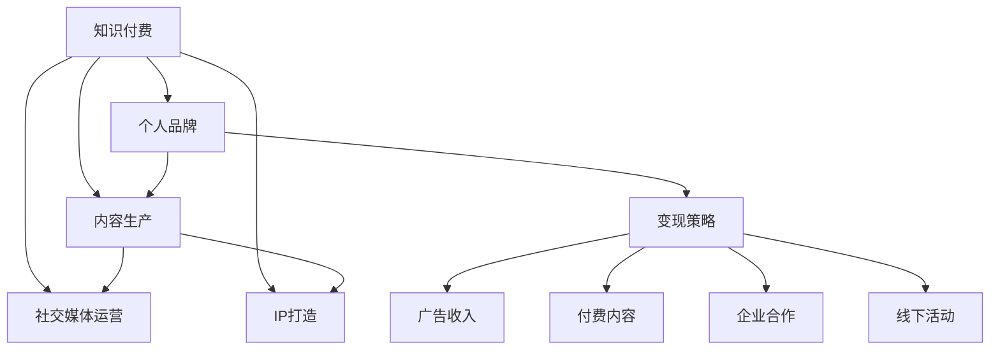

                 

# 如何打造知识付费的个人品牌IP

> 关键词：知识付费,个人品牌,内容生产,社交媒体,IP打造,变现策略

## 1. 背景介绍

### 1.1 问题由来

随着互联网技术的发展和知识经济的兴起，知识付费已经成为了新时代的重要趋势。个人品牌IP，尤其是基于知识领域的专业IP，正成为许多从业者梦寐以求的目标。然而，如何有效地打造和推广自己的个人品牌，将个人价值转化为实际收益，成为当前知识付费市场的热点和难点。

### 1.2 问题核心关键点

打造知识付费的个人品牌IP，实质上是一种基于个人专业知识和影响力的商业模式。其核心在于如何通过内容生产、社交媒体运营和变现策略等环节，将个人品牌打造成一个具有独特价值、广泛影响力和持续收益流的IP。

## 2. 核心概念与联系

### 2.1 核心概念概述

为更好地理解知识付费个人品牌IP的构建过程，本节将介绍几个密切相关的核心概念：

- **知识付费**：指通过付费形式获取知识和信息的过程，与传统的免费信息获取模式形成对比。知识付费不仅仅是一种商业行为，更是一种文化和教育方式的变革。
- **个人品牌**：指个人或团队在特定领域内建立起来的独特识别和价值主张，其核心在于通过专业技能、思想观点、创新能力等方面的表现，形成一种具有持久吸引力和影响力的品牌形象。
- **内容生产**：指根据市场需求和用户兴趣，创作高质量、有价值、差异化的内容，是个人品牌构建的基础。内容可以是文章、视频、音频等多种形式。
- **社交媒体运营**：指利用社交媒体平台进行品牌宣传、内容推广、用户互动等活动，以提升个人品牌的知名度和影响力。
- **IP打造**：即Integrated Product（产品整合），指将个人品牌、内容产品、变现模式等要素进行有机整合，形成具有独特价值和持续收益流的品牌IP。

这些核心概念之间的逻辑关系可以通过以下Mermaid流程图来展示：



这个流程图展示出知识付费、个人品牌、内容生产、社交媒体运营和IP打造等概念之间的相互关系，以及它们与变现策略的联系。

## 3. 核心算法原理 & 具体操作步骤
### 3.1 算法原理概述

知识付费个人品牌IP的打造，本质上是一个基于内容生产和社交媒体运营的算法过程。其核心思想是：

1. **内容价值化**：将个人的专业知识、经验、见解等内容转化为具有商业价值的产品。
2. **用户需求匹配**：通过社交媒体和用户互动，精准匹配用户需求，实现内容的高效分发和转化。
3. **变现策略优化**：结合内容特点和用户行为，制定合理的变现策略，最大化收益流。

形式化地，假设个人品牌IP为 $I$，内容集合为 $C$，用户群体为 $U$，社交媒体平台为 $S$，变现策略为 $T$。则IP打造的数学模型为：

$$
I = \mathop{\arg\max}_{I} \left[ \sum_{c \in C} v_c + \sum_{u \in U} p_u \cdot v(u, I) \cdot C(u, I) + \sum_{s \in S} a_s \cdot V(I, s) \cdot M(I, s) + \sum_{t \in T} r_t \cdot R(I, t) \right]
$$

其中 $v_c$ 为内容价值，$p_u$ 为单个用户支付意愿，$v(u, I)$ 为内容对用户的匹配度，$C(u, I)$ 为用户选择内容的概率，$a_s$ 为社交媒体平台广告费用，$V(I, s)$ 为社交媒体平台的影响力系数，$M(I, s)$ 为内容在社交媒体上的传播效果，$r_t$ 为变现策略的效果系数，$R(I, t)$ 为IP通过策略 $t$ 获得的收益。

### 3.2 算法步骤详解

基于上述数学模型，知识付费个人品牌IP的打造过程大致可以分为以下四个关键步骤：

**Step 1: 内容价值评估**

评估个人品牌的内容价值，是IP打造的基础。内容价值不仅与个人品牌的知名度、专业度有关，还与内容形式、发布频率、互动效果等因素紧密相关。

- **内容选择**：根据个人专长和市场需求，选择具有高价值潜力的内容主题。
- **内容创作**：按照高标准和高质量的要求，创作专业、有深度、有创意的内容。
- **内容分发**：通过社交媒体、博客、视频平台等多种渠道分发内容，提升内容的曝光率和影响力。
- **用户反馈**：收集用户反馈和评价，调整和优化内容策略。

**Step 2: 用户需求匹配**

通过社交媒体运营，精准匹配用户需求，是IP打造的重点。

- **用户画像分析**：利用社交媒体数据分析工具，对目标用户群体进行画像分析，了解其兴趣、需求和行为特点。
- **内容定制化**：根据用户画像，定制化生产内容，提高内容的吸引力和匹配度。
- **用户互动**：通过评论、问答、直播等多种形式，与用户进行互动，建立信任和粘性。
- **内容传播**：利用社交媒体平台的算法机制，优化内容传播路径，提高传播效果。

**Step 3: 变现策略制定**

制定合理的变现策略，是IP打造的保障。

- **广告收入**：通过在社交媒体平台上投放广告，获取流量收入。
- **付费内容**：提供专业课程、深度报告、会员服务等付费内容，实现内容变现。
- **企业合作**：与品牌企业进行战略合作，获取品牌推广和项目委托。
- **线下活动**：举办讲座、研讨会、培训等线下活动，提升品牌影响力和参与度。

**Step 4: 持续迭代优化**

持续迭代优化，是IP打造的持续动力。

- **数据分析**：利用数据分析工具，实时监测IP的表现和收益情况。
- **反馈闭环**：根据数据分析结果和用户反馈，不断调整和优化内容策略和变现策略。
- **技术升级**：引入新技术和新工具，提升内容生产效率和社交媒体运营效果。
- **品牌建设**：通过持续的品牌建设和内容输出，保持IP的独特性和持续吸引力。

### 3.3 算法优缺点

知识付费个人品牌IP打造的优势在于：

- **高效内容变现**：通过精准匹配用户需求和内容价值，最大化变现效果。
- **品牌长期建设**：IP的持续迭代优化，使其能够不断适应市场变化，保持长期影响力。
- **资源整合能力**：结合内容生产、社交媒体运营和变现策略，形成完整的IP生态链。

然而，该方法也存在一定的局限性：

- **内容创作成本高**：高质量内容的制作需要时间和精力，难以快速产出。
- **市场竞争激烈**：知识付费领域竞争激烈，需要不断创新和优化，才能保持竞争力。
- **技术要求高**：涉及内容管理、社交媒体运营、数据分析等多方面技术，技术门槛较高。
- **变现模式单一**：当前变现策略主要依赖广告和付费内容，模式较为单一，难以多渠道扩展。

尽管存在这些局限性，但就目前而言，基于内容生产和社交媒体运营的IP打造方法，仍然是知识付费市场的主流范式。未来相关研究的重点在于如何进一步优化内容价值评估、用户需求匹配和变现策略，同时兼顾技术应用和用户体验，提升IP的整体竞争力。

### 3.4 算法应用领域

知识付费个人品牌IP打造技术，在以下几个领域得到了广泛的应用：

- **教育培训**：如教育机构、培训师等，通过专业课程和讲座进行知识付费。
- **职业发展**：如职业咨询师、讲师、作家等，通过个性化指导和内容输出进行变现。
- **健康医疗**：如营养师、心理咨询师等，通过健康咨询和心理指导进行知识付费。
- **金融投资**：如财经分析师、投资顾问等，通过金融资讯和投资建议进行知识付费。
- **文化艺术**：如画家、作家、音乐家等，通过艺术品销售和版权授权进行知识付费。

除了上述这些经典领域外，个人品牌IP打造技术还被创新性地应用到更多场景中，如科技咨询、法律服务、旅游导购等，为知识付费技术带来了新的应用前景。

## 4. 数学模型和公式 & 详细讲解 & 举例说明

### 4.1 数学模型构建

本节将使用数学语言对知识付费个人品牌IP打造过程进行更加严格的刻画。

设个人品牌IP为 $I$，内容集合为 $C$，用户群体为 $U$，社交媒体平台为 $S$，变现策略为 $T$。定义：

- $v_c$ 为内容 $c \in C$ 的价值，$v_c = f(c, I)$。
- $p_u$ 为单个用户 $u \in U$ 的支付意愿，$p_u = g(u, I)$。
- $v(u, I)$ 为内容对用户 $u$ 的匹配度，$v(u, I) = h(u, I, c)$。
- $C(u, I)$ 为用户选择内容的概率，$C(u, I) = i(u, I, c)$。
- $a_s$ 为社交媒体平台 $s \in S$ 的广告费用，$a_s = k(s, I)$。
- $V(I, s)$ 为社交媒体平台 $s$ 的影响力系数，$V(I, s) = l(s, I)$。
- $M(I, s)$ 为内容在社交媒体上的传播效果，$M(I, s) = m(I, s, c)$。
- $r_t$ 为变现策略 $t \in T$ 的效果系数，$r_t = n(t, I)$。
- $R(I, t)$ 为IP通过策略 $t$ 获得的收益，$R(I, t) = o(I, t, u)$。

则IP打造的数学模型为：

$$
I = \mathop{\arg\max}_{I} \left[ \sum_{c \in C} f(c, I) + \sum_{u \in U} g(u, I) \cdot h(u, I, c) \cdot i(u, I, c) + \sum_{s \in S} k(s, I) \cdot l(s, I) \cdot m(I, s, c) + \sum_{t \in T} n(t, I) \cdot o(I, t, u) \right]
$$

### 4.2 公式推导过程

以下我们以付费内容变现为例，推导内容价值与支付意愿之间的关系。

假设用户 $u$ 选择内容 $c$ 的概率为 $p_u(c)$，则内容价值与支付意愿的关系为：

$$
v_c = f(c, I) = \sum_{u \in U} p_u(c) \cdot p_u
$$

将上述公式代入总价值模型：

$$
I = \mathop{\arg\max}_{I} \left[ \sum_{c \in C} \sum_{u \in U} p_u(c) \cdot p_u \cdot h(u, I, c) \cdot i(u, I, c) + \sum_{s \in S} k(s, I) \cdot l(s, I) \cdot m(I, s, c) + \sum_{t \in T} n(t, I) \cdot o(I, t, u) \right]
$$

根据内容和用户之间的匹配度 $v(u, I)$ 和选择概率 $C(u, I)$，可以得到以下简化后的模型：

$$
I = \mathop{\arg\max}_{I} \left[ \sum_{c \in C} v_c \cdot v(u, I) \cdot C(u, I) + \sum_{s \in S} a_s \cdot V(I, s) \cdot M(I, s) + \sum_{t \in T} r_t \cdot R(I, t) \right]
$$

### 4.3 案例分析与讲解

假设某教育培训机构希望通过付费内容进行知识付费，选择数学课程作为内容主题，初步估算内容价值为 $v_c = 100$。目标用户群体为大学生和职场人士，平均支付意愿为 $p_u = 50$。

通过社交媒体分析，发现内容对大学生的匹配度为 $v(u, I) = 0.8$，对职场人士的匹配度为 $v(u, I) = 0.6$。选择大学生内容概率为 $C(u, I) = 0.5$，选择职场人士内容概率为 $C(u, I) = 0.4$。

广告收入为 $a_s = 500$，社交媒体平台影响力系数为 $V(I, s) = 0.9$，内容在社交媒体上的传播效果为 $M(I, s) = 0.7$。变现策略为在线课程销售和会员服务，效果系数分别为 $r_t = 0.3$ 和 $r_t = 0.2$。

将这些数据代入IP打造模型：

$$
I = \mathop{\arg\max}_{I} \left[ 100 \cdot (0.8 \cdot 0.5 + 0.6 \cdot 0.4) + 500 \cdot 0.9 \cdot 0.7 + 0.3 \cdot R(I, t_1) + 0.2 \cdot R(I, t_2) \right]
$$

其中 $t_1$ 和 $t_2$ 分别为在线课程销售和会员服务的变现策略。通过优化变现策略和用户互动，最大化收益流，实现IP的成功打造。

## 5. 项目实践：代码实例和详细解释说明

### 5.1 开发环境搭建

在进行知识付费个人品牌IP打造的过程中，我们需要准备好开发环境。以下是使用Python进行Flask开发的环境配置流程：

1. 安装Anaconda：从官网下载并安装Anaconda，用于创建独立的Python环境。

2. 创建并激活虚拟环境：
```bash
conda create -n flask-env python=3.8 
conda activate flask-env
```

3. 安装Flask：
```bash
pip install Flask
```

4. 安装SQLite：
```bash
pip install sqlite3
```

5. 安装Flask-SQLAlchemy：
```bash
pip install Flask-SQLAlchemy
```

完成上述步骤后，即可在`flask-env`环境中开始IP打造项目的开发。

### 5.2 源代码详细实现

下面是一个简单的知识付费个人品牌IP打造的Flask应用示例，包括内容管理、用户注册和付费功能。

首先，定义内容模型和用户模型：

```python
from flask_sqlalchemy import SQLAlchemy
from flask import Flask, request, jsonify

app = Flask(__name__)
app.config['SQLALCHEMY_DATABASE_URI'] = 'sqlite:///data.db'
db = SQLAlchemy(app)

class Content(db.Model):
    id = db.Column(db.Integer, primary_key=True)
    title = db.Column(db.String(255))
    value = db.Column(db.Float)
    views = db.Column(db.Integer, default=0)

class User(db.Model):
    id = db.Column(db.Integer, primary_key=True)
    name = db.Column(db.String(255))
    email = db.Column(db.String(255))
    courses = db.relationship('Course', backref='user')
```

然后，定义内容发布和用户注册功能：

```python
@app.route('/content', methods=['POST'])
def publish_content():
    data = request.json
    content = Content(title=data['title'], value=data['value'])
    db.session.add(content)
    db.session.commit()
    return jsonify({'message': 'Content published'}), 201

@app.route('/register', methods=['POST'])
def register_user():
    data = request.json
    user = User(name=data['name'], email=data['email'])
    db.session.add(user)
    db.session.commit()
    return jsonify({'message': 'User registered'}), 201
```

接着，定义内容浏览和付费功能：

```python
@app.route('/content/<int:id>', methods=['GET'])
def get_content(id):
    content = Content.query.get(id)
    return jsonify({'title': content.title, 'value': content.value, 'views': content.views})

@app.route('/register/courses', methods=['GET'])
def get_user_courses():
    user = User.query.get(request.cookies.get('user_id'))
    courses = user.courses
    return jsonify([course.title for course in courses])

@app.route('/purchase', methods=['POST'])
def purchase_course():
    data = request.json
    user = User.query.get(request.cookies.get('user_id'))
    course = Course.query.get(data['course_id'])
    if course not in user.courses:
        user.courses.append(course)
        db.session.commit()
        return jsonify({'message': 'Course purchased'})
    else:
        return jsonify({'message': 'Course already purchased'})
```

最后，启动应用并测试：

```python
@app.route('/')
def index():
    return jsonify({'message': 'Welcome to IP Branding Platform'})

if __name__ == '__main__':
    app.run(debug=True)
```

### 5.3 代码解读与分析

让我们再详细解读一下关键代码的实现细节：

**Content和User模型**：
- `__init__`方法：定义模型的属性和关系。
- `__repr__`方法：返回对象的字符串表示。

**内容发布和用户注册功能**：
- `/publish_content` 路由：接收内容标题和价值，将内容保存到数据库。
- `/register_user` 路由：接收用户姓名和邮箱，将用户保存到数据库。

**内容浏览和付费功能**：
- `/content/<int:id>` 路由：根据ID获取内容信息。
- `/register/courses` 路由：获取用户已购买课程列表。
- `/purchase` 路由：根据用户ID和课程ID，将课程添加到用户已购买列表，并保存到数据库。

通过Flask框架，我们可以快速搭建一个知识付费个人品牌IP打造平台，支持内容发布、用户注册、内容浏览和付费等核心功能。Flask的轻量级和灵活性使得开发者可以快速迭代和扩展应用，满足不同业务需求。

当然，在实际开发中，还需要考虑更多因素，如内容审核、支付处理、用户管理等，以及更高级的个性化推荐和用户画像分析。但核心的IP打造流程，基本与此类似。

## 6. 实际应用场景
### 6.1 教育培训

教育培训是知识付费个人品牌IP打造的主要应用场景之一。通过知识付费平台，培训机构可以提供高质量的课程内容，吸引学员注册和付费。

在技术实现上，可以利用用户画像分析工具，对学员进行兴趣和需求分析，推荐适合的课程内容。同时，通过社交媒体和内容社区，进行学员互动和知识分享，建立良好的学习氛围和社区文化。最终，通过付费会员和课程销售，实现变现和品牌建设。

### 6.2 职业发展

职业发展是知识付费个人品牌IP打造的另一个重要领域。职业导师、职场顾问等专业人士，可以通过知识付费平台，提供专业指导和咨询服务。

在技术实现上，可以利用社交媒体和互动平台，建立专家和学员之间的沟通渠道，进行一对一的指导和互动。同时，通过案例分享和知识输出，提高专家的影响力和专业地位。最终，通过付费咨询和项目委托，实现职业发展和品牌建设。

### 6.3 健康医疗

健康医疗是知识付费个人品牌IP打造的新兴应用领域。健康专家、营养师等专业人士，可以通过知识付费平台，提供健康咨询和专业指导。

在技术实现上，可以利用社交媒体和互动平台，建立专家和患者之间的沟通渠道，进行健康咨询和疾病预防指导。同时，通过个性化报告和健康方案，提高专家的影响力和专业地位。最终，通过付费咨询和产品销售，实现品牌建设和变现。

### 6.4 未来应用展望

随着知识付费个人品牌IP打造技术的不断进步，其在更多领域的应用前景也将不断拓展。

在智慧教育领域，通过知识付费平台，可以实现个性化学习和教育资源的精准匹配，提升教学效果和学生体验。

在职业发展领域，通过知识付费平台，可以实现职业培训和职业发展路径的规划和指导，提升职场人士的职业竞争力。

在健康医疗领域，通过知识付费平台，可以实现健康咨询和疾病预防指导，提升公众的健康素养和健康水平。

此外，在智慧城市治理、文化旅游等领域，知识付费个人品牌IP打造技术也将得到广泛应用，为传统行业数字化转型提供新的思路和路径。相信随着技术的日益成熟，知识付费平台将成为推动社会进步和产业升级的重要力量。

## 7. 工具和资源推荐
### 7.1 学习资源推荐

为了帮助开发者系统掌握知识付费个人品牌IP打造的理论基础和实践技巧，这里推荐一些优质的学习资源：

1. 《深度学习理论与实践》系列博文：由知名AI专家撰写，系统介绍深度学习在知识付费领域的应用。

2. Coursera《深度学习与人工智能》课程：由斯坦福大学开设的深度学习课程，涵盖深度学习基础和前沿应用。

3. Kaggle《数据科学竞赛》：通过参与Kaggle数据科学竞赛，积累实战经验和项目经验。

4. GitHub《知识付费平台开源项目》：GitHub上大量的开源知识付费平台项目，可以借鉴其设计和实现。

5. 《知识付费商业模式》书籍：系统介绍知识付费的商业模式、运营策略和案例分析。

通过对这些资源的学习实践，相信你一定能够快速掌握知识付费个人品牌IP打造的精髓，并用于解决实际的商业问题。
###  7.2 开发工具推荐

高效的开发离不开优秀的工具支持。以下是几款用于知识付费个人品牌IP打造开发的常用工具：

1. Flask：轻量级的Web框架，适合快速迭代开发和灵活扩展。
2. SQLAlchemy：Python ORM框架，用于数据库操作，支持多种数据库类型。
3. SQLite：轻量级关系型数据库，适合小型应用和快速原型开发。
4. PyTorch：深度学习框架，适合快速原型开发和高效计算。
5. TensorFlow：深度学习框架，适合大规模工程应用和分布式计算。
6. GitHub：版本控制平台，适合代码管理和协作开发。

合理利用这些工具，可以显著提升知识付费个人品牌IP打造开发的效率，加快创新迭代的步伐。

### 7.3 相关论文推荐

知识付费个人品牌IP打造技术的发展，源于学界的持续研究。以下是几篇奠基性的相关论文，推荐阅读：

1. Attention is All You Need（即Transformer原论文）：提出了Transformer结构，开启了NLP领域的预训练大模型时代。

2. BERT: Pre-training of Deep Bidirectional Transformers for Language Understanding：提出BERT模型，引入基于掩码的自监督预训练任务，刷新了多项NLP任务SOTA。

3. Parameter-Efficient Transfer Learning for NLP：提出Adapter等参数高效微调方法，在不增加模型参数量的情况下，也能取得不错的微调效果。

4. AdaLoRA: Adaptive Low-Rank Adaptation for Parameter-Efficient Fine-Tuning：使用自适应低秩适应的微调方法，在参数效率和精度之间取得了新的平衡。

5. Knowledge-Graph Embedding and Its Application in Recommender Systems：系统介绍知识图嵌入技术在推荐系统中的应用。

这些论文代表了大语言模型微调技术的发展脉络。通过学习这些前沿成果，可以帮助研究者把握学科前进方向，激发更多的创新灵感。

## 8. 总结：未来发展趋势与挑战

### 8.1 总结

本文对知识付费个人品牌IP打造方法进行了全面系统的介绍。首先阐述了知识付费和IP打造的概念和核心问题，明确了内容生产、社交媒体运营和变现策略等关键环节。其次，从原理到实践，详细讲解了知识付费个人品牌IP打造的数学模型和核心算法步骤，给出了知识付费平台开发的完整代码实例。同时，本文还广泛探讨了知识付费个人品牌IP打造在教育培训、职业发展、健康医疗等领域的实际应用前景，展示了IP打造技术的巨大潜力。最后，本文精选了知识付费个人品牌IP打造的学习资源、开发工具和相关论文，力求为开发者提供全方位的技术指引。

通过本文的系统梳理，可以看到，知识付费个人品牌IP打造技术正在成为知识付费市场的重要范式，极大地拓展了知识付费系统的应用边界，催生了更多的落地场景。受益于深度学习技术的发展，知识付费个人品牌IP打造将迎来更多的创新和突破，为知识的传播和利用带来新的动力。

### 8.2 未来发展趋势

展望未来，知识付费个人品牌IP打造技术将呈现以下几个发展趋势：

1. **内容智能化**：利用自然语言处理、知识图嵌入等技术，实现内容的智能化推荐和个性化定制，提升用户体验。
2. **社交互动化**：通过社交媒体和互动平台，建立专家与学员之间的深度互动，提高用户粘性和社区氛围。
3. **变现多样化**：除了付费内容和广告收入，知识付费个人品牌IP还将探索更多的变现模式，如会员服务、知识市场、内容版权等。
4. **技术前沿化**：引入最新的深度学习、推荐系统、区块链等技术，提升知识付费平台的技术水平和创新能力。
5. **应用多元化**：知识付费个人品牌IP不仅应用于教育培训、职业发展等领域，还将拓展到健康医疗、文化旅游、智能制造等新兴领域。

以上趋势凸显了知识付费个人品牌IP打造技术的广阔前景。这些方向的探索发展，必将进一步提升知识付费平台的性能和应用范围，为知识付费市场带来更多机遇和挑战。

### 8.3 面临的挑战

尽管知识付费个人品牌IP打造技术已经取得了一定的成就，但在迈向更加智能化、普适化应用的过程中，它仍面临诸多挑战：

1. **内容质量控制**：如何保证内容的原创性、专业性和教育性，避免低质量内容和误导性信息。
2. **用户粘性保持**：如何通过互动和社区建设，提高用户粘性和平台活跃度，避免用户流失。
3. **市场竞争激烈**：如何打造独特的品牌形象和商业模式，在激烈的市场竞争中脱颖而出。
4. **数据隐私保护**：如何在提供个性化推荐和互动的同时，保护用户隐私，避免数据泄露和滥用。
5. **技术应用复杂**：如何兼顾技术的先进性和应用的便捷性，提高知识付费平台的易用性和用户体验。

这些挑战需要开发者和从业者共同面对，不断优化和完善知识付费个人品牌IP打造平台，才能实现长期的成功和可持续发展。

### 8.4 研究展望

面向未来，知识付费个人品牌IP打造技术还需要在以下几个方面寻求新的突破：

1. **多模态知识融合**：将文本、图像、音频等多模态数据进行融合，提升内容的丰富性和互动性。
2. **知识图嵌入应用**：利用知识图嵌入技术，提升内容的语义理解和知识关联能力。
3. **推荐系统优化**：引入推荐系统算法，提升内容的推荐效果和用户满意度。
4. **智能交互设计**：结合人工智能技术，提升用户的智能交互体验和平台粘性。
5. **区块链技术应用**：引入区块链技术，保障内容版权和交易安全，提升平台的可信度和透明度。

这些研究方向的探索，必将引领知识付费个人品牌IP打造技术迈向更高的台阶，为知识的传播和利用提供新的思路和路径。面向未来，知识付费个人品牌IP打造技术还需要与其他人工智能技术进行更深入的融合，如知识表示、因果推理、强化学习等，多路径协同发力，共同推动知识付费平台的进步。

## 9. 附录：常见问题与解答

**Q1：如何评估内容价值？**

A: 内容价值的评估可以从多个维度进行，包括用户反馈、点击率、付费率、社交媒体影响力等。建议采用综合评估方法，结合量化指标和定性分析，得出准确的内容价值。

**Q2：如何选择社交媒体平台？**

A: 选择社交媒体平台时，需要考虑目标用户群体的使用习惯和平台特性。一般而言，微博、知乎、抖音等平台适合内容传播和互动，微信公众号、小红书名号等平台适合内容分发和付费。

**Q3：如何制定变现策略？**

A: 变现策略的选择应根据内容特点和用户需求进行综合考虑。一般来说，付费内容、广告收入、品牌合作、线下活动等是常见的变现方式。建议先选择效果显著的策略进行试点，再逐步扩展和优化。

**Q4：如何提升用户粘性？**

A: 提升用户粘性需要从多个方面入手，包括内容质量、互动体验、社区建设等。建议定期更新高质量内容，进行用户互动和社区运营，营造良好的学习氛围和社区文化。

**Q5：如何保护用户隐私？**

A: 保护用户隐私需要遵循法律法规和平台规定，进行数据匿名化和加密处理。同时，建立用户隐私保护机制，确保用户数据的安全和隐私。

这些问答帮助开发者更好地理解知识付费个人品牌IP打造的关键技术和应用场景，相信通过不断实践和创新，必能打造出独具特色的知识付费品牌IP，实现知识变现的梦想。

---

作者：禅与计算机程序设计艺术 / Zen and the Art of Computer Programming

