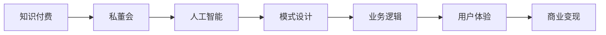

                 

# 如何打造知识付费的私董会模式

> 关键词：知识付费, 私董会, 人工智能, 模式设计, 业务逻辑, 用户体验, 商业变现, 未来展望

## 1. 背景介绍

随着信息爆炸和知识经济的崛起，人们对于优质知识的需求愈发迫切。传统一对多的教学模式已经难以满足市场对个性化、深度互动的需求。在此背景下，知识付费成为了一种高效的在线知识传播方式，通过付费订阅、定制化课程等方式，提供高价值、精准化的内容服务。

私董会（Mastermind）则是一种高级的商业咨询与学习模式，强调一对一或小组形式的高频、深度交流，通过导师一对多的形式，提供丰富的实战经验、深入洞见和即时反馈，帮助学员提升领导力、解决实际问题、优化商业策略。

将私董会模式引入知识付费领域，是一种创新的尝试，既能满足用户对深度知识的需求，又能通过定制化的服务，提升用户粘性和满意度，最终实现商业变现。本文将详细介绍如何构建知识付费的私董会模式，探索其在AI时代下的应用前景。

## 2. 核心概念与联系

### 2.1 核心概念概述

私董会模式基于以下核心概念：

- **知识付费**：指用户通过付费获取具有较高价值的知识服务，以提升个人或企业竞争力。
- **私董会**：一种高级的商业咨询与学习模式，通过一对一或小组形式的高频、深度交流，帮助学员提升领导力、解决实际问题、优化商业策略。
- **人工智能**：利用机器学习、深度学习等技术，提升知识获取、推荐、分析的精准度和效率。
- **模式设计**：设计基于私董会的知识付费平台，实现个性化、精准化的服务。
- **业务逻辑**：构建平台背后的商业逻辑，包括用户注册、课程推荐、内容付费、学员与导师互动等环节。
- **用户体验**：围绕用户体验设计平台功能，提升使用便捷性、互动深度和价值感。
- **商业变现**：通过多种商业模式，实现平台运营的自给自足。

这些概念之间相互关联，共同构成了知识付费私董会模式的理论框架。

### 2.2 核心概念联系（Mermaid 流程图）



## 3. 核心算法原理 & 具体操作步骤

### 3.1 算法原理概述

知识付费的私董会模式结合了个性化推荐、深度互动和AI辅助等多种技术，通过以下步骤实现：

1. **用户画像建立**：利用机器学习算法，根据用户行为和偏好，构建详细的用户画像。
2. **内容推荐系统**：使用协同过滤、深度学习等技术，实现个性化的课程推荐。
3. **互动交流机制**：设计学员与导师之间的互动机制，如问答、直播、研讨等，实现深度交流。
4. **数据反馈与优化**：通过用户反馈，不断优化推荐算法和互动机制，提升用户体验。
5. **商业变现策略**：探索多样化的商业模式，如订阅服务、单次付费、定制化服务等。

### 3.2 算法步骤详解

**Step 1: 用户画像建立**
- **数据收集**：收集用户的浏览记录、搜索历史、评论反馈等数据。
- **特征提取**：使用NLP技术对文本数据进行向量化处理，提取用户兴趣特征。
- **模型训练**：采用协同过滤、深度学习等算法，构建用户画像。

**Step 2: 内容推荐系统**
- **数据处理**：对课程数据进行向量化处理，提取课程特征。
- **模型训练**：使用矩阵分解、神经网络等技术，训练推荐模型。
- **推荐算法**：根据用户画像和课程特征，计算相似度，推荐个性化课程。

**Step 3: 互动交流机制**
- **互动设计**：设计学员与导师之间的互动界面，如聊天室、视频会议等。
- **交互管理**：通过管理模块，控制互动的频率、时长和内容。
- **数据收集**：收集互动过程中的数据，用于后续优化。

**Step 4: 数据反馈与优化**
- **用户反馈**：收集用户对课程、导师、互动形式的反馈。
- **模型优化**：基于反馈数据，调整推荐算法和互动机制，提升用户体验。

**Step 5: 商业变现策略**
- **订阅服务**：提供按月、按年订阅的服务，定期推送课程内容。
- **单次付费**：针对特定课程或专题，提供单次付费的选项。
- **定制化服务**：根据用户需求，提供定制化的课程和咨询。

### 3.3 算法优缺点

**优点**：
- 个性化推荐：通过深度学习等技术，实现精准的课程推荐。
- 深度互动：设计多样化的互动形式，满足用户个性化需求。
- 智能客服：通过AI技术，提供实时问答和问题解决服务。

**缺点**：
- 数据隐私：用户数据隐私保护是一个重要挑战。
- 技术门槛：技术实现复杂，对数据处理和算法优化要求较高。
- 运营成本：平台运营需要大量人力和资源投入。

### 3.4 算法应用领域

私董会模式可以应用于多种领域，如：

- **企业培训**：为企业高层提供定制化的管理咨询和领导力培训。
- **科技创新**：为科技创业者提供创业指导和市场分析。
- **职业发展**：为职场人士提供职业规划、技能提升和心理辅导。
- **教育辅导**：为学生提供个性化的学习指导和应试辅导。

## 4. 数学模型和公式 & 详细讲解 & 举例说明

### 4.1 数学模型构建

本节将通过数学语言对知识付费私董会模式的推荐系统进行详细描述。

设用户画像为 $U$，课程特征为 $C$，推荐结果为 $R$。推荐系统的目标是最小化用户未推荐课程的数量，即：

$$
\min_{U, C} \sum_{u \in U} \sum_{c \in C} r_{u,c} \cdot \min(r_{u,c}, 1 - r_{u,c})
$$

其中 $r_{u,c}$ 为课程 $c$ 对用户 $u$ 的推荐程度。

### 4.2 公式推导过程

在实际应用中，推荐算法常使用协同过滤、基于矩阵分解的推荐模型等。以基于矩阵分解的推荐算法为例，假设用户画像矩阵为 $U$，课程特征矩阵为 $C$，用户对课程的评分矩阵为 $R$，则推荐模型的目标函数为：

$$
\min_{U, C} \|U \times C - R\|
$$

其中 $\| \cdot \|$ 为矩阵的范数，表示矩阵的差异度量。

通过矩阵分解，将用户画像矩阵和课程特征矩阵分解为低秩矩阵 $U_L$ 和 $C_L$，得到推荐矩阵 $R'$：

$$
R' = U_L \times C_L
$$

通过最小化 $R'$ 与 $R$ 的差异，可以得到最优的用户画像和课程特征表示。

### 4.3 案例分析与讲解

假设某企业培训课程推荐系统，用户画像矩阵 $U$ 和课程特征矩阵 $C$ 已经训练完成，课程评分矩阵 $R$ 为：

$$
R = \begin{bmatrix}
5 & 4 & 3 \\
2 & 3 & 5
\end{bmatrix}
$$

通过矩阵分解，得到 $U_L$ 和 $C_L$：

$$
U_L = \begin{bmatrix}
0.5 & 0.3 \\
0.2 & 0.5
\end{bmatrix}, C_L = \begin{bmatrix}
0.8 & 0.1 \\
0.1 & 0.8
\end{bmatrix}
$$

计算推荐矩阵 $R'$：

$$
R' = U_L \times C_L = \begin{bmatrix}
0.5 & 0.1 \\
0.2 & 0.4
\end{bmatrix}
$$

最终，推荐系统推荐课程的评分矩阵为：

$$
R' = \begin{bmatrix}
5 & 0.5 \\
2 & 1.0
\end{bmatrix}
$$

通过推荐矩阵 $R'$，可以直观地看到课程推荐的结果。

## 5. 项目实践：代码实例和详细解释说明

### 5.1 开发环境搭建

在开始项目实践前，我们需要准备好开发环境。以下是Python和TensorFlow的环境配置流程：

1. 安装Anaconda：从官网下载并安装Anaconda，用于创建独立的Python环境。

2. 创建并激活虚拟环境：
```bash
conda create -n tf-env python=3.8 
conda activate tf-env
```

3. 安装TensorFlow：
```bash
conda install tensorflow==2.4
```

4. 安装相关的Python库：
```bash
pip install numpy pandas sklearn tensorflow_hub
```

完成上述步骤后，即可在`tf-env`环境中开始项目实践。

### 5.2 源代码详细实现

下面以课程推荐系统为例，给出使用TensorFlow实现推荐模型的PyTorch代码实现。

首先，定义课程和用户数据的TensorFlow张量：

```python
import tensorflow as tf

# 定义课程数据
courses = tf.constant([[1.0, 2.0, 3.0],
                       [4.0, 5.0, 6.0],
                       [7.0, 8.0, 9.0]], dtype=tf.float32)

# 定义用户数据
users = tf.constant([[0.1, 0.2],
                     [0.3, 0.4],
                     [0.5, 0.6]], dtype=tf.float32)
```

接着，定义推荐模型的TensorFlow计算图：

```python
# 定义矩阵分解因子
U_factors = tf.Variable(tf.random.normal([3, 2]))
C_factors = tf.Variable(tf.random.normal([2, 3]))

# 计算推荐矩阵
R_pred = tf.matmul(tf.matmul(U_factors, C_factors), tf.transpose(courses))

# 计算损失函数
loss = tf.reduce_sum(tf.square(R_pred - courses))
```

最后，启动训练流程：

```python
# 定义优化器
optimizer = tf.optimizers.Adam()

# 训练模型
for i in range(100):
    optimizer.minimize(loss)

    # 输出训练进度
    if i % 10 == 0:
        print("Step {}, Loss: {:.4f}".format(i, loss.numpy()))
```

通过以上代码，我们实现了基于矩阵分解的推荐模型，并展示了其训练过程。

### 5.3 代码解读与分析

在推荐系统实践中，TensorFlow提供了强大的计算图构建和优化功能。我们可以定义矩阵分解的因子，计算推荐矩阵，并通过优化器更新参数，最小化损失函数。

在实际项目中，还需要考虑数据预处理、模型评估、超参数调优等环节，以确保模型的高效性和准确性。

## 6. 实际应用场景

### 6.1 企业培训

企业培训是知识付费私董会模式的重要应用场景之一。企业可以通过定制化课程，帮助高层管理者提升领导力、优化管理策略。通过平台推荐算法，企业可以根据员工的岗位、部门和需求，推送个性化培训内容。学员与导师之间通过互动交流机制，实现深度学习与问题解决，提升培训效果。

### 6.2 科技创新

科技创新是另一个重要的应用领域。科技创新者可以通过平台获取最新的技术动态、市场分析、行业趋势等内容，了解最新的科研成果和创新方向。平台通过推荐系统和互动功能，提供定制化的课程和咨询服务，帮助创业者解决实际问题，优化产品设计和商业模式。

### 6.3 职业发展

职业发展也是私董会模式的重要应用场景。职场人士可以通过平台获取职业规划、技能提升、心理辅导等内容，了解职业发展的最新趋势和机会。平台通过推荐系统，推荐适合学员的课程和导师，实现深度学习和互动交流，提升学员的职业竞争力。

## 7. 工具和资源推荐

### 7.1 学习资源推荐

为了帮助开发者系统掌握私董会模式的设计和实现，这里推荐一些优质的学习资源：

1. 《深度学习理论与实践》系列博文：由深度学习专家撰写，涵盖推荐系统、自然语言处理、计算机视觉等前沿技术，适合深入学习。
2. Coursera《机器学习》课程：由斯坦福大学开设的机器学习经典课程，涵盖多种机器学习算法和实践技巧。
3. Kaggle数据竞赛：Kaggle平台上丰富的数据集和竞赛项目，可以锻炼推荐系统设计、数据处理和模型评估能力。
4. Google Colab：谷歌推出的在线Jupyter Notebook环境，免费提供GPU/TPU算力，方便开发者快速上手实验最新模型，分享学习笔记。
5. GitHub开源项目：GitHub上丰富的开源项目和代码示例，可以参考学习推荐系统设计、数据分析和部署等最佳实践。

通过对这些资源的学习实践，相信你一定能够快速掌握私董会模式的设计和实现，并用于解决实际的业务问题。

### 7.2 开发工具推荐

高效的开发离不开优秀的工具支持。以下是几款用于私董会模式开发的常用工具：

1. Jupyter Notebook：基于Web的交互式编程环境，方便编写、测试和分享代码。
2. TensorFlow：谷歌主导的深度学习框架，功能强大、易于扩展。
3. TensorFlow Hub：TensorFlow的模型库，可以快速获取预训练模型和组件，加速开发过程。
4. PyTorch：Facebook开源的深度学习框架，灵活高效，适合科研和工程应用。
5. Flask或Django：Python Web框架，方便构建推荐系统、互动界面和API接口。
6. Redis：高性能的内存数据库，用于存储推荐结果和用户行为数据。

合理利用这些工具，可以显著提升私董会模式的开发效率，加快创新迭代的步伐。

### 7.3 相关论文推荐

私董会模式的研究源于学界的持续探索。以下是几篇奠基性的相关论文，推荐阅读：

1. "Collaborative Filtering for Recommendation Systems"：探讨协同过滤算法的基本原理和应用，是推荐系统研究的重要基础。
2. "Latent Factor Models for Recommender Systems"：介绍基于矩阵分解的推荐模型，详解其算法原理和参数优化方法。
3. "Deep Learning for Recommender Systems"：阐述深度学习在推荐系统中的应用，提出多种深度学习模型和优化算法。
4. "User-Based and Item-Based Collaborative Filtering"：对比用户驱动和物品驱动的协同过滤算法，分析其优缺点和适用场景。
5. "Hybrid Recommender Systems"：介绍多种推荐算法结合的混合推荐系统，提升推荐效果和多样化。

这些论文代表了大数据推荐系统的发展脉络，通过学习这些前沿成果，可以帮助研究者把握学科前进方向，激发更多的创新灵感。

## 8. 总结：未来发展趋势与挑战

### 8.1 总结

本文对知识付费的私董会模式进行了全面系统的介绍。首先阐述了私董会模式在知识付费领域的应用背景和意义，明确了其通过个性化推荐、深度互动和AI辅助等多种技术实现高效知识传播的目标。其次，从原理到实践，详细讲解了私董会模式的数学模型和关键步骤，给出了推荐系统开发的完整代码实例。同时，本文还广泛探讨了私董会模式在企业培训、科技创新、职业发展等多个领域的应用前景，展示了其在AI时代下的广阔发展空间。最后，本文精选了私董会模式的学习资源和开发工具，力求为读者提供全方位的技术指引。

通过本文的系统梳理，可以看到，知识付费的私董会模式通过将个性化推荐和深度互动技术引入教育、企业培训和职业发展等领域，提供了高价值、精准化的知识服务，满足了用户对深度知识的需求，提升了用户体验和满意度，最终实现了商业变现。未来，伴随AI技术的持续演进和应用场景的不断拓展，私董会模式必将在更多领域得到应用，为人类认知智能的进步提供新的动力。

### 8.2 未来发展趋势

展望未来，知识付费的私董会模式将呈现以下几个发展趋势：

1. **个性化推荐**：随着用户数据的不断积累，推荐系统将更加精准，能够提供个性化的课程和资源推荐。
2. **深度互动**：通过AI技术和智能化界面设计，实现更高频、更深度、更有效的学员与导师互动。
3. **多样化的商业变现**：探索更多商业模式，如按需付费、会员制、广告等，实现多元化的收入来源。
4. **全场景覆盖**：将私董会模式扩展到更多领域，如教育、医疗、娱乐等，提供全面、综合的知识服务。
5. **AI辅助决策**：利用AI技术，提升课程选择、内容优化、运营决策等环节的智能化水平。

以上趋势凸显了知识付费私董会模式的广阔前景。这些方向的探索发展，必将进一步提升知识获取、分享和应用的精准度和效率，推动知识经济的蓬勃发展。

### 8.3 面临的挑战

尽管知识付费的私董会模式在多个领域得到了广泛应用，但在迈向更加智能化、普适化应用的过程中，它仍面临着诸多挑战：

1. **数据隐私**：用户数据隐私保护是一个重要挑战。如何在数据收集和使用过程中保障用户隐私，是一个亟需解决的问题。
2. **技术门槛**：推荐系统和互动界面的设计和实现，需要较高的技术水平和数据处理能力，对开发者的要求较高。
3. **用户接受度**：尽管推荐系统和深度互动带来了诸多便利，但部分用户可能对新模式持观望态度，如何提升用户接受度，还需进一步努力。
4. **内容质量**：课程和导师的内容质量直接影响平台的用户体验和商业变现，需要持续投入资源进行内容优化。
5. **运营成本**：平台运营需要大量人力和资源投入，如何降低运营成本，提高效率，也是平台发展中的一个重要课题。

这些挑战需要从数据、技术、用户和运营等多个维度协同发力，才能确保私董会模式的健康发展。只有全面应对并不断优化，才能实现知识付费的可持续发展。

### 8.4 研究展望

面对私董会模式所面临的种种挑战，未来的研究需要在以下几个方面寻求新的突破：

1. **隐私保护技术**：研究数据加密、差分隐私等技术，保障用户数据隐私，同时满足推荐系统对数据的需求。
2. **智能客服**：引入AI客服系统，提升用户咨询体验，解决常见问题，减轻人工客服压力。
3. **个性化学习路径**：通过AI技术，构建个性化的学习路径，实现更精准的知识推荐和互动。
4. **多模态推荐**：融合视觉、语音等多模态数据，提升推荐系统的综合性和多样性。
5. **知识图谱**：构建知识图谱，将领域知识和专家经验整合到推荐系统中，提升推荐内容的深度和准确性。

这些研究方向的探索，必将引领知识付费私董会模式迈向更高的台阶，为构建安全、可靠、可解释、可控的知识服务系统提供新的技术路径。面向未来，私董会模式还需要与其他人工智能技术进行更深入的融合，如知识表示、因果推理、强化学习等，多路径协同发力，共同推动知识服务的进步。

## 9. 附录：常见问题与解答

**Q1：如何设计推荐系统中的用户画像？**

A: 推荐系统中的用户画像需要涵盖用户的兴趣、行为、社交关系等多方面的信息。可以通过机器学习算法，如协同过滤、深度学习等，构建详细的用户画像。在实践中，可以收集用户的浏览记录、搜索历史、评分数据等，利用NLP技术对文本数据进行向量化处理，提取用户兴趣特征。

**Q2：如何评估推荐系统的推荐效果？**

A: 推荐系统的评估指标包括准确率、召回率、F1值等。可以通过A/B测试、在线实验等方法，评估推荐系统的推荐效果。同时，还可以引入用户反馈，不断优化推荐算法和互动机制，提升用户体验。

**Q3：如何选择推荐系统中的推荐算法？**

A: 选择推荐算法时需要考虑多种因素，如数据规模、推荐目标、计算资源等。常用的推荐算法包括协同过滤、矩阵分解、深度学习等。在实践中，可以根据具体需求选择适合的推荐算法，并结合数据特征进行调优。

**Q4：如何提升私董会模式的互动效果？**

A: 提升私董会模式的互动效果需要从多个方面入手，如设计多样化的互动形式、优化互动界面、加强导师与学员的匹配等。同时，还可以通过AI技术，如情感分析、智能问答等，提升互动的智能化水平。

**Q5：如何保障私董会模式中的数据隐私？**

A: 保障数据隐私需要从数据收集、存储、使用等多个环节进行严格控制。可以采用数据加密、差分隐私等技术，保障用户数据的安全和隐私。同时，还需要制定明确的数据使用政策，保护用户权益。

---

作者：禅与计算机程序设计艺术 / Zen and the Art of Computer Programming

