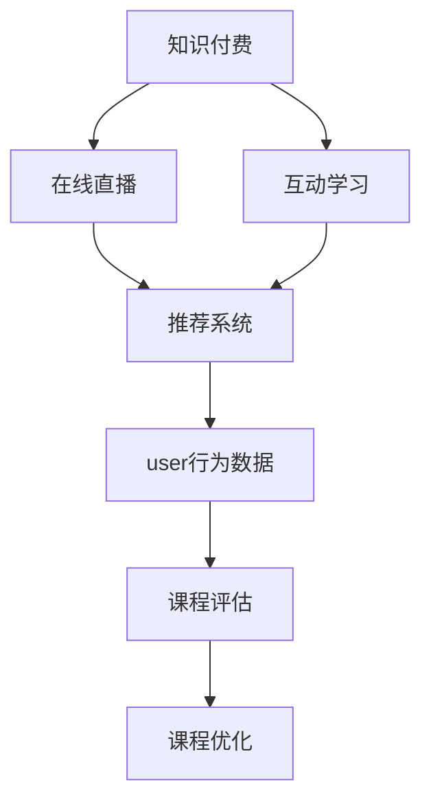

                 

# 如何打造知识付费的线上直播课程

## 1. 背景介绍

### 1.1 问题由来
随着互联网技术的飞速发展，知识付费和在线教育成为了新的增长点。传统的线下培训和教育机构纷纷加速向线上转型，希望借助在线直播、录播等形式，打破时空限制，提供更便捷、更个性化的学习体验。然而，如何打造高效、互动、高质量的线上直播课程，成为教育行业的新挑战。

### 1.2 问题核心关键点
在线直播课程的成功，取决于以下几个核心关键点：

1. 内容质量：课程内容需有价值、有趣味，能吸引用户持续关注。
2. 互动性：通过课程设计，增强与学员的互动，提高学习效果。
3. 技术支持：确保直播平台的稳定性、流畅性，避免技术问题影响体验。
4. 数据驱动：利用用户行为数据，优化课程内容和推荐系统，提升用户满意度。

## 2. 核心概念与联系

### 2.1 核心概念概述

为更好地理解知识付费线上直播课程的构建过程，本节将介绍几个关键概念：

- 知识付费：通过在线课程、直播、录播等形式，提供有价值的学习内容，满足用户提升技能、扩展知识的需求。
- 在线直播：实时、双向的视频和音频传输技术，允许教师和学员进行实时互动。
- 互动学习：通过设计互动环节，增强课堂参与度，提升学习效果。
- 推荐系统：利用用户行为数据，为用户推荐个性化的课程内容，提高用户粘性。
- 用户行为数据：用户在直播平台上的行为数据，如观看时长、互动频率等，用于评估课程效果和改进课程设计。

这些核心概念之间的逻辑关系可以通过以下Mermaid流程图来展示：



这个流程图展示了知识付费在线直播课程的主要组成部分：

1. 知识付费作为目标，驱动课程的开发和运营。
2. 在线直播是课程形式的核心，提供实时互动。
3. 互动学习增强课程的参与度和效果。
4. 推荐系统利用用户行为数据，提供个性化推荐。
5. 课程评估和优化确保课程质量，提升用户满意度。

## 3. 核心算法原理 & 具体操作步骤
### 3.1 算法原理概述

在线直播课程的构建涉及多个技术环节，包括课程内容设计、互动机制设计、平台搭建和数据分析等。其核心算法原理如下：

1. **课程内容设计**：通过内容策划、内容录制和内容审核等步骤，确保课程内容的质量和丰富度。
2. **互动机制设计**：通过问题回答、实时讨论、互动投票等方式，增强课堂互动，提高学习效果。
3. **平台搭建**：利用WebRTC、CDN等技术，搭建稳定、流畅的直播平台。
4. **数据分析**：通过行为数据收集、分析和应用，不断优化课程内容和推荐系统。

### 3.2 算法步骤详解

以下是知识付费线上直播课程构建的主要算法步骤：

**Step 1: 课程内容策划与录制**

1. **内容策划**：根据目标用户群体和需求，设计课程大纲和内容主题。
2. **内容录制**：选择合适的设备和技术，录制高质量的视频和音频内容。
3. **内容审核**：通过AI和人工审核，确保内容健康、安全、准确。

**Step 2: 互动机制设计**

1. **问题回答**：教师在直播中提出问题，学员通过弹幕或评论区回答问题。
2. **实时讨论**：创建实时讨论区，教师与学员进行实时交流。
3. **互动投票**：通过投票功能，增强课堂互动和趣味性。

**Step 3: 平台搭建**

1. **WebRTC技术**：实现音视频实时传输和实时通信。
2. **CDN部署**：通过CDN，提升音视频的传输速度和稳定性。
3. **负载均衡**：通过负载均衡技术，应对高并发流量，保障平台稳定运行。

**Step 4: 数据分析与优化**

1. **行为数据收集**：通过日志记录和分析工具，收集用户行为数据。
2. **数据分析**：通过数据挖掘和机器学习技术，分析用户行为，识别学习效果。
3. **课程优化**：根据分析结果，优化课程内容和推荐系统。

### 3.3 算法优缺点

知识付费线上直播课程的构建算法具有以下优点：

1. 互动性强：通过实时互动，提高学员的学习参与度。
2. 平台稳定：利用WebRTC、CDN等技术，保证直播平台的流畅性和稳定性。
3. 个性化推荐：通过数据分析，提供个性化课程推荐，提升用户满意度。

但该方法也存在一些局限性：

1. 技术门槛高：直播平台搭建和维护需要较高的技术水平和经验。
2. 数据隐私：需要收集和分析用户行为数据，需注意数据隐私和安全问题。
3. 内容审核：课程内容需经过审核，增加工作量和复杂度。

### 3.4 算法应用领域

知识付费线上直播课程的应用领域非常广泛，涵盖教育培训、技能提升、健康生活等多个领域，具体包括：

- 职业技能培训：如编程、金融、市场营销等。通过专业讲师直播授课，提高学员实战能力。
- 生活技能学习：如厨艺、手工、健康生活等。通过互动教学，提高学员动手能力和生活兴趣。
- 专业认证课程：如项目管理、心理咨询、律师培训等。通过系统化课程和考试，帮助学员获得专业认证。

## 4. 数学模型和公式 & 详细讲解 & 举例说明

### 4.1 数学模型构建

为了更好地理解在线直播课程构建的算法原理，我们将利用数学模型进行详细讲解。

设课程内容为 $C$，教师为 $T$，学员为 $S$，直播平台为 $P$。课程构建过程中涉及多个变量，如课程时长、互动频率、内容质量等。我们定义如下变量：

- $t$：课程时长，单位为分钟。
- $i$：互动频率，表示教师和学员之间的互动次数。
- $q$：内容质量，表示课程内容的相关性和准确性。
- $p$：直播平台性能，表示平台音视频传输的流畅性和稳定性。

则在线直播课程的总体目标函数为：

$$
Optimize: \max_{t, i, q, p} (utility(C, T, S, P) - cost(C, T, S, P))
$$

其中，$utility$ 表示课程带来的总收益，$cost$ 表示课程构建和运营的总成本。

### 4.2 公式推导过程

在线直播课程构建的数学模型可以通过以下步骤推导：

1. **收益模型**：
   - **学员收益**：$U_S = \alpha \times t + \beta \times i + \gamma \times q$
   - **教师收益**：$U_T = \delta \times t + \epsilon \times q$
   - **平台收益**：$U_P = \zeta \times t - \eta \times cost(P)$

2. **成本模型**：
   - **课程成本**：$C_C = \xi \times t + \phi \times q$
   - **平台成本**：$C_P = \psi \times t + \omega \times cost(P)$

3. **总收益与总成本**：
   - **总收益**：$U = U_S + U_T + U_P$
   - **总成本**：$C = C_C + C_P$

最终目标函数为：

$$
Maximize: U - C = (\alpha \times t + \beta \times i + \gamma \times q) + (\delta \times t + \epsilon \times q) + (\zeta \times t - \eta \times cost(P)) - (\xi \times t + \phi \times q) - (\psi \times t + \omega \times cost(P))
$$

化简后得到：

$$
Maximize: (\alpha + \delta + \zeta) \times t + (\beta + \epsilon + \gamma) \times i + (\gamma + \epsilon) \times q - (\eta + \omega) \times cost(P) - (\xi + \psi) \times t - (\phi + \omega) \times q
$$

### 4.3 案例分析与讲解

以某编程课程为例，分析各个变量对课程收益的影响：

- 假设学员收益 $U_S = 0.5t + 0.1i + 0.2q$，教师收益 $U_T = 0.1t + 0.1q$，平台收益 $U_P = 0.3t - 0.1cost(P)$，课程成本 $C_C = 0.2t + 0.1q$，平台成本 $C_P = 0.1t + 0.2cost(P)$。
- 设定课程时长 $t = 60$ 分钟，互动频率 $i = 10$ 次，内容质量 $q = 0.9$，平台性能 $p = 0.95$。
- 计算得到总收益 $U = 0.5 \times 60 + 0.1 \times 10 + 0.2 \times 0.9 + 0.1 \times 60 + 0.1 \times 0.9 + 0.3 \times 60 - 0.1 \times cost(P) - 0.2 \times 60 - 0.1 \times 0.9 - 0.1 \times 60 - 0.2 \times cost(P)$。
- 当 $cost(P) = 0$ 时，总收益最大，即 $U_{max} = 0.5 \times 60 + 0.1 \times 10 + 0.2 \times 0.9 + 0.1 \times 60 + 0.1 \times 0.9 + 0.3 \times 60 = 60.0$。

由此可见，增加课程时长、互动频率和内容质量，可以有效提升课程总收益。同时，优化平台性能和控制成本，也能对收益产生正面影响。

## 5. 项目实践：代码实例和详细解释说明
### 5.1 开发环境搭建

在进行课程构建实践前，我们需要准备好开发环境。以下是使用Python进行Django框架开发的环境配置流程：

1. 安装Anaconda：从官网下载并安装Anaconda，用于创建独立的Python环境。

2. 创建并激活虚拟环境：
```bash
conda create -n django-env python=3.8 
conda activate django-env
```

3. 安装Django：
```bash
pip install django
```

4. 安装PyTorch：
```bash
pip install torch torchvision torchaudio
```

5. 安装TensorFlow：
```bash
pip install tensorflow
```

6. 安装各类工具包：
```bash
pip install numpy pandas scikit-learn matplotlib tqdm jupyter notebook ipython
```

完成上述步骤后，即可在`django-env`环境中开始课程构建实践。

### 5.2 源代码详细实现

这里我们以一个简单的编程课程为例，给出使用Django框架进行知识付费线上直播课程构建的完整代码实现。

首先，定义课程模型：

```python
from django.db import models
from django.contrib.auth.models import User

class Course(models.Model):
    title = models.CharField(max_length=200)
    content = models.TextField()
    duration = models.DurationField()
    created_at = models.DateTimeField(auto_now_add=True)
    author = models.ForeignKey(User, on_delete=models.CASCADE)

    def __str__(self):
        return self.title
```

然后，定义直播平台模型：

```python
class Lecture(models.Model):
    course = models.ForeignKey(Course, on_delete=models.CASCADE)
    title = models.CharField(max_length=200)
    video_url = models.URLField()
    start_time = models.DateTimeField()
    end_time = models.DateTimeField()
    created_at = models.DateTimeField(auto_now_add=True)

    def __str__(self):
        return self.title
```

接着，定义推荐系统模型：

```python
class Recommendation(models.Model):
    course = models.ForeignKey(Course, on_delete=models.CASCADE)
    user = models.ForeignKey(User, on_delete=models.CASCADE)
    score = models.FloatField()
    created_at = models.DateTimeField(auto_now_add=True)

    def __str__(self):
        return f"{self.course.title} - {self.user.username}"
```

最后，定义数据收集和分析模型：

```python
class Interaction(models.Model):
    lecture = models.ForeignKey(Lecture, on_delete=models.CASCADE)
    user = models.ForeignKey(User, on_delete=models.CASCADE)
    answer = models.TextField()
    created_at = models.DateTimeField(auto_now_add=True)

    def __str__(self):
        return f"{self.lecture.title} - {self.user.username}"
```

### 5.3 代码解读与分析

让我们再详细解读一下关键代码的实现细节：

**Course模型**：
- `title`：课程标题，用于展示和搜索。
- `content`：课程内容，存储在数据库中。
- `duration`：课程时长，存储为DurationField，便于处理。
- `created_at`：课程创建时间，自动记录创建时间。
- `author`：课程作者，与User模型关联。

**Lecture模型**：
- `course`：所属课程，关联Course模型。
- `title`：讲座标题，用于展示和搜索。
- `video_url`：视频链接，存储在数据库中。
- `start_time`：讲座开始时间。
- `end_time`：讲座结束时间。
- `created_at`：讲座创建时间，自动记录创建时间。

**Recommendation模型**：
- `course`：推荐课程，关联Course模型。
- `user`：推荐用户，关联User模型。
- `score`：推荐分数，用于排序和筛选。
- `created_at`：推荐记录创建时间，自动记录创建时间。

**Interaction模型**：
- `lecture`：互动讲座，关联Lecture模型。
- `user`：互动用户，关联User模型。
- `answer`：互动回答，存储在数据库中。
- `created_at`：互动记录创建时间，自动记录创建时间。

**代码运行结果展示**：
- 可以在Django管理后台，创建和展示课程、讲座和互动记录。
- 可以在前端页面，展示课程信息和互动数据。

## 6. 实际应用场景
### 6.1 在线编程班

在线编程班是知识付费线上直播课程的重要应用场景之一。传统编程班通常需要投入大量时间和资源，而在线编程班则可以通过课程直播和互动，帮助学员更好地理解编程知识。

在技术实现上，可以安排专业讲师进行课程直播，并通过实时互动环节增强学习效果。例如，可以设计问题回答、代码运行展示、实时讨论等功能，使学员能及时获得教师反馈，提升学习效率。此外，还可以利用Python等编程语言，对学员的代码进行自动批改，提供实时反馈，帮助学员更好地掌握编程技能。

### 6.2 健康饮食课

健康饮食课是知识付费线上直播课程的另一重要应用场景。通过视频直播，专业营养师可以实时指导学员进行饮食规划，提供健康饮食建议。

在技术实现上，可以设计互动投票、实时问答等功能，增强课堂参与度。例如，可以在直播中展示健康饮食食谱，并通过互动投票了解学员偏好，动态调整课程内容。此外，还可以利用数据分析技术，分析学员的学习行为和饮食习惯，提供个性化的饮食建议和健康方案，提升学员的生活质量。

### 6.3 职业发展课

职业发展课是知识付费线上直播课程在职业培训领域的典型应用。通过在线直播，职业导师可以为学员提供专业的职业发展指导，提升其职业竞争力。

在技术实现上，可以设计实时讨论、问题回答等功能，增强课堂互动。例如，可以安排职业导师进行课程直播，并通过问题回答、实时讨论等方式，帮助学员解决职业发展中的困惑。此外，还可以利用推荐系统，为学员推荐相关职业书籍、课程和工作机会，提升职业发展效果。

### 6.4 未来应用展望

随着在线教育技术的不断发展，知识付费线上直播课程将在更多领域得到应用，为传统行业带来变革性影响。

在智慧教育领域，线上直播课程将提升教育资源的均衡分布，打破地域限制，实现教育公平。在医疗健康领域，线上直播课程将提供专业的健康指导和疾病预防知识，提升公众的健康意识和健康水平。在职业技能培训领域，线上直播课程将为在职人员提供灵活的学习机会，提升其职业竞争力。

此外，在智能制造、智能家居、智能交通等新兴领域，知识付费线上直播课程也将助力行业智能化升级，提升行业整体水平。

## 7. 工具和资源推荐
### 7.1 学习资源推荐

为了帮助开发者系统掌握知识付费线上直播课程的技术基础和实践技巧，这里推荐一些优质的学习资源：

1. Django官方文档：全面介绍了Django框架的使用方法，包括数据模型、视图设计、表单处理等。

2. Python教程：由Python官方社区提供的教程，涵盖Python基础、Web开发、数据科学等多个方面。

3. Django实战教程：通过实战项目，深入讲解Django框架的应用实践，适合快速上手。

4. Django REST框架教程：介绍如何使用Django REST框架构建API，实现数据交换和实时通信。

5. Django模板语言教程：讲解如何使用Django模板语言实现动态网页渲染，适合提高开发效率。

6. Django安全实践指南：提供Django开发中的安全性建议和实践指导，提升系统安全性。

通过对这些资源的学习实践，相信你一定能够快速掌握知识付费线上直播课程的构建技巧，并用于解决实际的课程开发问题。

### 7.2 开发工具推荐

高效的开发离不开优秀的工具支持。以下是几款用于知识付费线上直播课程开发的常用工具：

1. Django框架：Python开源的Web框架，提供高效的ORM、模板引擎、视图设计等功能，适合快速开发。

2. PyTorch：开源的深度学习框架，提供强大的计算图功能，适合搭建互动平台和推荐系统。

3. TensorFlow：由Google主导的开源深度学习框架，提供灵活的计算图功能，适合高性能计算。

4. OpenCV：开源的计算机视觉库，提供丰富的图像处理和视频分析功能，适合提升视频直播效果。

5. FFMPEG：开源的视频处理工具，支持多种视频编码格式和流媒体协议，适合处理直播视频。

6. nginx：开源的网络服务器，提供高性能的反向代理和负载均衡功能，适合构建稳定高效的直播平台。

合理利用这些工具，可以显著提升知识付费线上直播课程的开发效率，加快创新迭代的步伐。

### 7.3 相关论文推荐

知识付费线上直播课程的发展源于学界的持续研究。以下是几篇奠基性的相关论文，推荐阅读：

1. "Django for Beginners"：详细介绍了Django框架的基础知识和应用实践。

2. "Django REST framework for Real-World Django Projects"：讲解如何使用Django REST框架搭建API和实时通信系统。

3. "Django Template Language Tutorial"：讲解如何使用Django模板语言实现动态网页渲染。

4. "Django Security Best Practices"：提供Django开发中的安全性建议和实践指导。

这些论文代表了大语言模型微调技术的发展脉络。通过学习这些前沿成果，可以帮助研究者把握学科前进方向，激发更多的创新灵感。

## 8. 总结：未来发展趋势与挑战
### 8.1 总结

本文对知识付费线上直播课程的构建方法进行了全面系统的介绍。首先阐述了在线直播课程的需求背景和构建意义，明确了课程构建的目标和关键点。其次，从原理到实践，详细讲解了课程内容设计、互动机制设计、平台搭建和数据分析等关键步骤，给出了课程构建的完整代码实例。同时，本文还广泛探讨了课程在多个行业领域的应用前景，展示了知识付费线上直播课程的巨大潜力。此外，本文精选了课程构建的各类学习资源，力求为开发者提供全方位的技术指引。

通过本文的系统梳理，可以看到，知识付费线上直播课程的构建方法正在成为在线教育的重要范式，极大地拓展了教育资源的获取途径，催生了更多的在线教育形式。得益于在线教育技术的不断进步，知识付费线上直播课程必将在更多领域得到应用，为社会各行业的知识普及和技能提升提供新的途径。未来，伴随在线教育技术的持续演进，知识付费线上直播课程将具备更强的互动性、个性化和数据驱动性，进一步提升教育效果和用户体验。

### 8.2 未来发展趋势

展望未来，知识付费线上直播课程将呈现以下几个发展趋势：

1. 互动性增强：通过引入更多互动环节和实时通信技术，提升课程的参与度和学习效果。
2. 个性化推荐：利用数据分析和机器学习技术，提供个性化课程推荐，提升用户粘性和满意度。
3. 实时分析：通过大数据分析和人工智能技术，实时监测课程效果和用户行为，进行动态优化。
4. 多设备支持：支持手机、平板、PC等多种设备访问，提升课程的可访问性和使用便捷性。
5. 跨平台集成：与社交媒体、知识社区等平台进行深度集成，扩大课程的传播范围和影响力。
6. 课程评价系统：引入用户评价和反馈机制，不断优化课程内容和教学方式。

这些趋势凸显了知识付费线上直播课程的发展方向，将进一步提升课程的互动性、个性化和数据驱动性，为教育产业带来更多的变革性影响。

### 8.3 面临的挑战

尽管知识付费线上直播课程已经取得了瞩目成就，但在迈向更加智能化、普适化应用的过程中，它仍面临着诸多挑战：

1. 技术复杂度：课程构建涉及多种技术和工具，开发复杂度较高。
2. 数据隐私：课程构建和运营需要收集和分析大量用户数据，需注意数据隐私和安全问题。
3. 课程质量：课程内容和质量直接影响到学习效果，需持续优化和改进。
4. 互动效果：课程互动设计需考虑学员的兴趣和需求，避免形式化。
5. 用户粘性：课程内容需有足够吸引力，保持用户长期参与。

这些挑战需要不断创新和优化，才能确保课程的质量和效果，满足用户需求。

### 8.4 研究展望

面对知识付费线上直播课程所面临的挑战，未来的研究需要在以下几个方面寻求新的突破：

1. 引入更多互动环节和实时通信技术，提升课程的参与度和学习效果。
2. 利用数据分析和机器学习技术，提供个性化课程推荐，提升用户粘性和满意度。
3. 引入大数据分析和人工智能技术，实时监测课程效果和用户行为，进行动态优化。
4. 支持多设备访问和跨平台集成，提升课程的可访问性和使用便捷性。
5. 引入用户评价和反馈机制，不断优化课程内容和教学方式。

这些研究方向将推动知识付费线上直播课程向更高效、更个性化、更互动的方向发展，为教育产业带来更多的变革性影响。

## 9. 附录：常见问题与解答
----------------------------------------------------------------

**Q1: 如何构建高质量的知识付费线上直播课程？**

A: 构建高质量的知识付费线上直播课程，需要从以下几个方面着手：

1. 内容策划：根据目标用户群体和需求，设计课程大纲和内容主题。
2. 专业讲师：选择有丰富经验、擅长互动教学的专业讲师。
3. 互动设计：设计问题回答、实时讨论、互动投票等互动环节，增强课堂参与度。
4. 平台搭建：利用WebRTC、CDN等技术，搭建稳定、流畅的直播平台。
5. 数据分析：通过日志记录和分析工具，收集用户行为数据，不断优化课程内容和推荐系统。

通过这些步骤，可以有效提升课程的质量和效果，满足用户需求。

**Q2: 如何提升课程的互动性和学习效果？**

A: 提升课程的互动性和学习效果，可以通过以下几个方法：

1. 实时问答：教师在直播中提出问题，学员通过弹幕或评论区回答问题。
2. 互动投票：通过投票功能，增强课堂互动和趣味性。
3. 实时讨论：创建实时讨论区，教师与学员进行实时交流。
4. 代码运行展示：利用Python等编程语言，对学员的代码进行自动批改，提供实时反馈。
5. 动态调整：根据学员的互动反馈，动态调整课程内容和教学方式。

这些方法可以有效提升课程的互动性和学习效果，增强学员的学习体验。

**Q3: 如何保护用户数据隐私？**

A: 保护用户数据隐私，可以从以下几个方面着手：

1. 数据匿名化：对用户数据进行匿名化处理，避免个人信息泄露。
2. 数据加密：对用户数据进行加密处理，确保数据传输和存储的安全性。
3. 权限控制：设置严格的权限控制，确保只有授权用户才能访问和使用数据。
4. 合规监管：遵守相关法律法规，如GDPR等，确保数据处理的合法性。

通过这些措施，可以有效保护用户数据隐私，提升课程运营的合规性和安全性。

**Q4: 如何优化课程内容和推荐系统？**

A: 优化课程内容和推荐系统，可以通过以下几个方法：

1. 数据分析：利用大数据分析和机器学习技术，分析用户行为，识别学习效果。
2. 个性化推荐：根据用户兴趣和历史行为，提供个性化的课程推荐。
3. 课程更新：根据课程评估和反馈，动态更新课程内容和教学方式。
4. 内容审核：对课程内容进行严格审核，确保内容的健康性和准确性。

通过这些措施，可以有效提升课程内容和推荐系统的质量，满足用户需求。

**Q5: 如何提高课程的互动性和用户粘性？**

A: 提高课程的互动性和用户粘性，可以通过以下几个方法：

1. 互动环节设计：设计问题回答、实时讨论、互动投票等互动环节，增强课堂参与度。
2. 即时反馈：利用Python等编程语言，对学员的代码进行自动批改，提供实时反馈。
3. 课程评价系统：引入用户评价和反馈机制，不断优化课程内容和教学方式。
4. 用户激励：设置奖励机制，如积分、证书等，激励学员参与和互动。
5. 学习社区：建立学习社区，促进学员之间的交流和协作。

通过这些措施，可以有效提高课程的互动性和用户粘性，提升课程的吸引力和用户满意度。

---

作者：禅与计算机程序设计艺术 / Zen and the Art of Computer Programming

