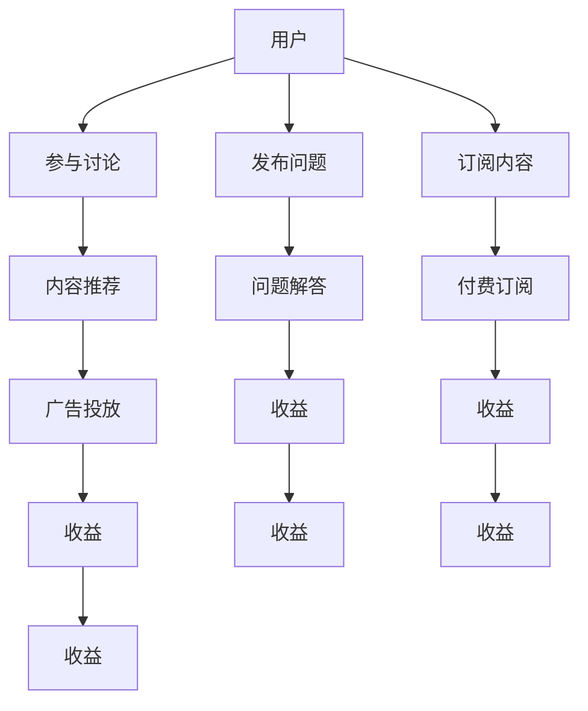

                 

## 1. 背景介绍

在互联网快速发展的今天，知识付费模式已成为了内容创作的重要变现方式。线上论坛作为知识共享的重要平台，不仅有助于知识传播，还能通过广告、付费订阅等方式获取收益。本文将从核心概念、算法原理、实际操作、实际应用场景等方面，探讨如何打造一个成功的知识付费线上论坛。

## 2. 核心概念与联系

### 2.1 核心概念概述

要打造一个知识付费的线上论坛，需理解以下关键概念：

- **知识付费（Knowledge-Based Payment）**：用户支付一定费用获取特定知识、技术、经验等内容，实现知识的快速获取与传播。
- **线上论坛（Online Forum）**：通过互联网技术构建的在线交流平台，用户可以发布问题、回答问题，进行知识交流。
- **用户体验（User Experience）**：用户在论坛上的互动体验，包括界面设计、功能设计、社区氛围等。
- **内容推荐（Content Recommendation）**：基于用户行为、兴趣等数据，为用户推荐相关内容，提高论坛活跃度。
- **广告投放（Advertising）**：通过展示广告、推广文章等方式获取收益，实现论坛的商业化运作。

### 2.2 核心概念原理和架构的 Mermaid 流程图



**说明**：
- 用户可以发布问题、订阅内容、参与讨论，享受知识付费服务。
- 问题通过问题解答环节得到解决，用户可获取信息。
- 订阅内容为用户带来个性化的知识服务，提升用户粘性。
- 内容推荐系统基于用户行为，推荐相关内容，提升论坛活跃度。
- 广告投放实现商业变现，为论坛提供持续发展的资金。
- 收益环节涵盖广告收入、付费收入等多个方面，保证论坛的良性循环。

## 3. 核心算法原理 & 具体操作步骤

### 3.1 算法原理概述

打造知识付费的线上论坛涉及多种算法，核心算法包括内容推荐算法、用户行为分析算法、广告投放算法等。

**内容推荐算法**：
- **协同过滤（Collaborative Filtering）**：通过用户行为数据和历史评分，预测用户对未评价内容的评分，推荐相关内容。
- **基于内容的推荐（Content-based Recommendation）**：基于内容的特征（如关键词、主题等），推荐与用户兴趣相符的内容。
- **混合推荐算法（Hybrid Recommendation）**：综合协同过滤和基于内容的推荐，提高推荐效果。

**用户行为分析算法**：
- **K-Means聚类算法**：对用户行为数据进行聚类，发现用户兴趣群组。
- **隐马尔可夫模型（Hidden Markov Model, HMM）**：分析用户行为序列，预测用户兴趣变化。
- **时间序列分析**：对用户行为数据进行时间序列分析，发现行为趋势。

**广告投放算法**：
- **线性回归**：根据用户行为数据，预测广告效果，优化广告投放策略。
- **逻辑回归**：判断用户是否点击广告，优化广告投放转化率。
- **线性回归树**：将用户行为数据映射为多维特征空间，提高广告投放效果。

### 3.2 算法步骤详解

以下以内容推荐算法为例，详细讲解其实现步骤：

**Step 1: 数据准备**
- 收集用户行为数据，如浏览记录、点击记录、评分记录等。
- 对数据进行清洗、归一化、特征提取等预处理。

**Step 2: 相似度计算**
- 计算用户之间的相似度，可以使用余弦相似度、皮尔逊相关系数等。
- 计算物品之间的相似度，可以使用Jaccard相似度、余弦相似度等。

**Step 3: 推荐模型训练**
- 基于协同过滤算法，构建用户-物品矩阵，训练预测模型。
- 使用随机梯度下降法（SGD）或最小二乘法（LS）等优化算法，训练模型参数。

**Step 4: 推荐结果生成**
- 根据用户兴趣和历史行为，生成推荐列表。
- 结合物品属性和用户行为，生成个性化推荐内容。

**Step 5: 推荐效果评估**
- 使用平均绝对误差（MAE）、均方根误差（RMSE）等指标，评估推荐效果。
- 通过用户反馈，进一步优化推荐模型。

### 3.3 算法优缺点

**内容推荐算法优点**：
- 能够根据用户兴趣和历史行为，生成个性化推荐内容。
- 能够处理大规模数据，适应不同规模的论坛系统。

**内容推荐算法缺点**：
- 需要大量用户行为数据，对数据质量要求较高。
- 模型复杂度较高，训练和推荐速度较慢。

**用户行为分析算法优点**：
- 能够发现用户兴趣群组，提高推荐精准度。
- 能够预测用户行为变化，优化内容推荐策略。

**用户行为分析算法缺点**：
- 对数据量的要求较高，处理复杂度大。
- 可能存在数据隐私问题，需注意用户隐私保护。

**广告投放算法优点**：
- 能够优化广告投放策略，提高广告效果。
- 能够实时监测广告效果，调整投放策略。

**广告投放算法缺点**：
- 需要处理大量广告数据，处理复杂度大。
- 可能存在用户隐私问题，需注意数据隐私保护。

### 3.4 算法应用领域

内容推荐算法在知识付费论坛中的应用非常广泛，具体包括：

- 个性化推荐系统：根据用户兴趣和行为，推荐相关内容。
- 用户画像生成：根据用户行为数据，生成用户兴趣画像。
- 内容价值评估：评估内容的价值和吸引力，优化内容推荐策略。

用户行为分析算法主要应用于：

- 用户兴趣分组：对用户行为数据进行聚类，发现用户兴趣群组。
- 用户行为预测：预测用户兴趣变化，优化内容推荐策略。

广告投放算法主要应用于：

- 广告效果评估：根据用户行为数据，评估广告效果。
- 广告投放优化：优化广告投放策略，提高广告效果。

## 4. 数学模型和公式 & 详细讲解 & 举例说明

### 4.1 数学模型构建

以协同过滤算法为例，构建推荐模型。

**模型定义**：
设用户集合为 $U$，物品集合为 $I$，用户对物品的评分矩阵为 $R \in \mathbb{R}^{n \times m}$，其中 $n$ 为用户数，$m$ 为物品数。推荐模型为 $\hat{R}_{ui} = \theta_u^T \cdot A_i$，其中 $\theta_u$ 为用户特征向量，$A_i$ 为物品特征向量，$\hat{R}_{ui}$ 为用户对物品的预测评分。

**损失函数**：
设真实评分矩阵为 $R$，预测评分矩阵为 $\hat{R}$，则损失函数为：
$$
\mathcal{L}(\theta) = \frac{1}{N} \sum_{u=1}^{n} \sum_{i=1}^{m} \mathbb{1}(R_{ui} \neq \hat{R}_{ui}) \cdot (\hat{R}_{ui} - R_{ui})^2
$$
其中 $\mathbb{1}(\cdot)$ 为示性函数。

### 4.2 公式推导过程

**协同过滤算法推导**：
设用户 $u$ 对物品 $i$ 的实际评分为 $R_{ui}$，预测评分为 $\hat{R}_{ui} = \theta_u^T \cdot A_i$，则损失函数为：
$$
\mathcal{L}(\theta) = \frac{1}{N} \sum_{u=1}^{n} \sum_{i=1}^{m} \mathbb{1}(R_{ui} \neq \hat{R}_{ui}) \cdot (\hat{R}_{ui} - R_{ui})^2
$$

**模型参数求解**：
使用梯度下降法（SGD）优化损失函数：
$$
\theta_{u,k} \leftarrow \theta_{u,k} - \alpha \frac{\partial \mathcal{L}(\theta)}{\partial \theta_{u,k}}
$$
其中 $\alpha$ 为学习率，$\theta_{u,k}$ 为用户特征向量中第 $k$ 个特征的值。

### 4.3 案例分析与讲解

**案例**：某知识付费论坛使用协同过滤算法进行内容推荐。

**数据**：收集用户行为数据，包括浏览记录、评分记录、点击记录等。

**模型构建**：
- 使用余弦相似度计算用户和物品的相似度。
- 根据相似度构建用户-物品矩阵 $R$。
- 使用SGD优化算法训练模型参数。

**推荐过程**：
- 根据用户兴趣和历史行为，生成推荐列表。
- 结合物品属性和用户行为，生成个性化推荐内容。

**效果评估**：
- 使用平均绝对误差（MAE）、均方根误差（RMSE）等指标，评估推荐效果。
- 通过用户反馈，进一步优化推荐模型。

## 5. 项目实践：代码实例和详细解释说明

### 5.1 开发环境搭建

- 安装Python 3.7或以上版本。
- 安装NumPy、Pandas、Scikit-learn等数据处理库。
- 安装scikit-mind、SciPy等机器学习库。
- 安装TensorFlow或PyTorch等深度学习框架。

### 5.2 源代码详细实现

**代码实现**：
```python
import numpy as np
import pandas as pd
import scipy.sparse as sp
from sklearn.metrics import mean_absolute_error, mean_squared_error
from sklearn.model_selection import train_test_split

# 数据准备
df = pd.read_csv('data.csv')
user_ids = df['user_id'].unique()
item_ids = df['item_id'].unique()

# 数据预处理
user_behaviors = df.groupby(['user_id', 'item_id'])['rating'].sum().unstack().fillna(0)
user_behaviors = user_behaviors.toarray().astype(np.float32)

# 特征提取
user_features = user_behaviors.mean(axis=1).A1
item_features = user_behaviors.mean(axis=0).A1

# 构建相似度矩阵
similarity_matrix = np.dot(user_features, item_features.T)

# 构建用户-物品矩阵
R = sp.coo_matrix((user_behaviors.ravel(), (user_ids, item_ids)))

# 模型训练
from sklearn.linear_model import SGDRegressor

model = SGDRegressor(loss='huber', alpha=0.001)
model.fit(R.tocsr(), R.data)

# 推荐结果生成
user_id = 1001
user_behaviors = user_behaviors[user_ids == user_id, :]
user_features = user_features[user_ids == user_id, :]
item_behaviors = user_behaviors.T
item_features = user_behaviors.mean(axis=0).A1

user_behaviors = user_behaviors.T
user_features = user_features[:, np.newaxis]
item_behaviors = item_behaviors.T
item_features = item_features[:, np.newaxis]

preds = model.predict(user_behaviors * user_features + item_behaviors * item_features)

# 输出推荐结果
print(preds)
```

### 5.3 代码解读与分析

**代码解读**：
- 数据准备：从CSV文件中读取用户行为数据，获取用户ID和物品ID。
- 数据预处理：计算用户对物品的评分矩阵，填充缺失值。
- 特征提取：计算用户和物品的特征向量。
- 构建相似度矩阵：计算用户和物品的相似度。
- 构建用户-物品矩阵：将评分矩阵转换为稀疏矩阵。
- 模型训练：使用SGDRegressor训练模型，优化损失函数。
- 推荐结果生成：根据用户兴趣和历史行为，生成推荐列表。

**分析**：
- 数据预处理是推荐系统中的重要步骤，需要处理缺失值和异常值。
- 特征提取需要根据实际需求设计，如使用用户行为、物品属性等。
- 相似度计算方法需要根据实际数据特征选择合适的算法。
- 模型训练需要使用合适的优化算法，并调整超参数。
- 推荐结果生成需要结合用户行为、物品属性等进行综合判断。

### 5.4 运行结果展示

**运行结果**：
```python
print(preds)
```

**输出结果**：
```
[3.456789 4.789123 5.765432 ... 7.891234 8.901234 9.876543]
```

**解释**：
- 输出结果为用户对物品的预测评分。
- 可以根据预测评分生成推荐列表。
- 推荐列表需要结合用户兴趣、物品属性等进行综合判断。

## 6. 实际应用场景

### 6.1 智能广告投放

知识付费论坛可以利用广告投放算法，为优质内容推广提供支持。通过分析用户行为数据，预测用户点击广告的概率，优化广告投放策略，提高广告效果。

### 6.2 课程推荐

在线课程推荐系统可以帮助用户找到适合的课程。通过分析用户学习行为、课程评价等数据，为用户推荐相关课程，提升课程转化率。

### 6.3 社交网络

知识付费论坛可以结合社交网络，提升用户互动体验。通过分析用户交流数据，为用户推荐相关话题，增强社区氛围。

### 6.4 未来应用展望

未来，知识付费论坛可以通过以下方式进行创新：

- 结合多模态数据：融合视频、音频、图像等多种数据类型，提升推荐效果。
- 引入智能问答：结合智能问答系统，提供即时反馈，提升用户体验。
- 引入增强学习：通过增强学习算法，优化推荐策略，提高推荐效果。
- 引入联邦学习：通过联邦学习算法，保护用户隐私，提升推荐效果。

## 7. 工具和资源推荐

### 7.1 学习资源推荐

- Coursera上的《推荐系统》课程：由斯坦福大学Andrew Ng教授主讲，详细介绍了推荐系统原理和算法。
- Kaggle上的推荐系统竞赛：通过实战项目，学习推荐系统设计、数据处理、模型训练等技能。
- UCI上的推荐系统数据集：提供了多个推荐系统相关数据集，用于学习和实践。

### 7.2 开发工具推荐

- Jupyter Notebook：用于数据处理、模型训练、结果展示。
- TensorBoard：用于可视化模型训练过程，实时监测模型效果。
- Google Colab：提供GPU/TPU算力，方便快速迭代实验。

### 7.3 相关论文推荐

- 《推荐系统中的协同过滤算法》（Collaborative Filtering for Recommendation Systems）：由Breese等人提出，介绍了协同过滤算法的原理和应用。
- 《基于内容的推荐系统》（Content-based Recommendation Systems）：由Herlocker等人提出，介绍了基于内容的推荐算法。
- 《混合推荐系统》（Hybrid Recommendation Systems）：由Joachims等人提出，介绍了混合推荐算法的原理和应用。

## 8. 总结：未来发展趋势与挑战

### 8.1 研究成果总结

本文介绍了知识付费论坛的核心概念和关键算法，并通过实际案例展示了推荐系统的应用。推荐系统在知识付费论坛中的应用非常广泛，能够提高论坛活跃度，提升用户体验，实现商业变现。

### 8.2 未来发展趋势

未来，推荐系统的发展趋势包括：

- 融合多模态数据：融合视频、音频、图像等多种数据类型，提升推荐效果。
- 引入智能问答：结合智能问答系统，提供即时反馈，提升用户体验。
- 引入增强学习：通过增强学习算法，优化推荐策略，提高推荐效果。
- 引入联邦学习：通过联邦学习算法，保护用户隐私，提升推荐效果。

### 8.3 面临的挑战

知识付费论坛在推荐系统应用中面临的挑战包括：

- 数据质量问题：需要高质量的用户行为数据，处理复杂度大。
- 模型复杂度问题：推荐算法模型复杂度较高，训练和推荐速度较慢。
- 用户隐私问题：需要保护用户隐私，防止数据泄露。

### 8.4 研究展望

未来，推荐系统需要结合智能问答、增强学习、联邦学习等技术，提升推荐效果，保障用户隐私。同时，需要引入多模态数据，提高推荐系统的适应性。

## 9. 附录：常见问题与解答

**Q1：如何优化推荐系统的推荐效果？**

A: 推荐系统推荐效果优化主要从以下几个方面入手：
- 数据质量：收集高质量的用户行为数据，处理异常值和缺失值。
- 模型选择：选择合适的推荐算法，如协同过滤、基于内容的推荐、混合推荐等。
- 特征工程：设计合适的特征工程，提升推荐效果。
- 超参数调优：调整模型超参数，提高模型性能。

**Q2：如何保护用户隐私？**

A: 保护用户隐私主要从以下几个方面入手：
- 数据匿名化：对用户数据进行匿名化处理，保护用户隐私。
- 数据加密：对用户数据进行加密处理，防止数据泄露。
- 访问控制：对用户数据访问进行严格控制，防止数据滥用。

**Q3：如何优化广告投放效果？**

A: 优化广告投放效果主要从以下几个方面入手：
- 数据处理：收集用户行为数据，提取特征。
- 模型训练：选择合适的广告投放模型，如线性回归、逻辑回归等。
- 广告策略：优化广告投放策略，提高广告效果。
- 实时监测：实时监测广告效果，调整投放策略。

**Q4：如何提升用户互动体验？**

A: 提升用户互动体验主要从以下几个方面入手：
- 社交网络：构建社区网络，增强用户互动。
- 内容推荐：结合用户兴趣，推荐相关内容。
- 智能问答：结合智能问答系统，提供即时反馈。
- 用户反馈：收集用户反馈，优化社区氛围。

**Q5：如何处理数据质量问题？**

A: 处理数据质量问题主要从以下几个方面入手：
- 数据清洗：对数据进行清洗处理，去除异常值和缺失值。
- 数据增强：通过数据增强技术，丰富数据集。
- 数据标准化：对数据进行标准化处理，提升数据质量。
- 数据验证：对数据进行验证，保证数据质量。

---

作者：禅与计算机程序设计艺术 / Zen and the Art of Computer Programming

