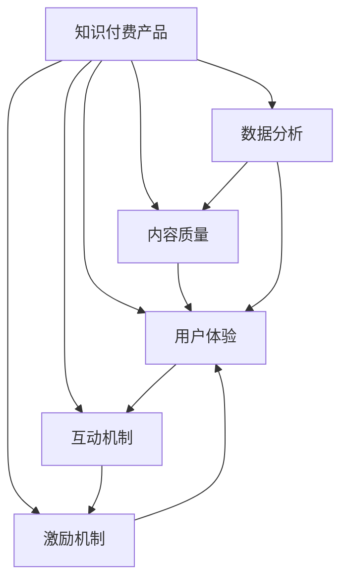

                 

# 如何提高知识付费产品的用户活跃度

## 1. 背景介绍

### 1.1 问题由来

随着互联网的普及和信息爆炸，知识付费逐渐成为一种趋势，用户对于高质量内容的需求日益增加。然而，尽管知识付费产品种类繁多，用户活跃度却普遍不高，主要原因包括：

1. **内容同质化严重**：大量的知识付费内容内容雷同，难以吸引用户关注。
2. **用户体验不佳**：界面设计粗糙，操作流程繁琐，影响用户粘性。
3. **缺乏互动性**：单向的内容输出，缺乏用户参与和反馈机制。
4. **激励机制不足**：付费机制单一，难以激发用户持续消费的积极性。

面对这些挑战，本文将从多个维度探讨如何提高知识付费产品的用户活跃度，包括内容优化、用户体验设计、互动机制设计、付费激励等策略。

### 1.2 问题核心关键点

- **内容质量**：高质量、独特性内容是吸引用户的核心因素。
- **用户体验**：流畅、舒适的用户体验能够大幅提升用户满意度。
- **互动机制**：增强用户参与感，提高用户粘性。
- **激励机制**：多样化的付费和激励方式，让用户更愿意长期使用。
- **数据分析**：通过用户行为数据，优化内容和推荐算法。

这些关键点共同构成了提高知识付费产品用户活跃度的基础，本文将深入探讨每个关键点的具体策略和实施方法。

## 2. 核心概念与联系

### 2.1 核心概念概述

为了更好地理解提高知识付费产品用户活跃度的策略，本节将介绍几个关键概念及其相互关系：

- **知识付费产品**：提供付费内容或服务的互联网产品，如在线课程、电子书、音频、视频等。
- **用户活跃度**：指用户对产品的使用频率和互动程度，常用指标包括日活跃用户数(DAU)、月活跃用户数(MAU)、留存率等。
- **内容质量**：指内容的原创性、深度、实用性和多样性，是吸引用户的关键因素。
- **用户体验**：包括界面设计、操作流畅性、反馈机制等多个方面，直接影响用户的使用体验。
- **互动机制**：通过评论、讨论、分享等互动方式，增强用户参与感和社区氛围。
- **激励机制**：如积分、优惠券、会员权益等，促进用户持续消费和推荐。
- **数据分析**：通过用户行为数据，进行个性化推荐、内容优化和运营决策，持续提升用户体验。

这些概念之间的联系通过以下Mermaid流程图来展示：



这个流程图展示出，内容质量、用户体验、互动机制、激励机制和数据分析之间相互影响，共同影响知识付费产品的用户活跃度。

## 3. 核心算法原理 & 具体操作步骤
### 3.1 算法原理概述

提高知识付费产品用户活跃度的核心在于提升用户满意度和参与感，通过多维度策略的组合应用，实现长期持续的用户互动和消费。具体来说，可以通过以下几个算法原理实现：

- **个性化推荐算法**：根据用户历史行为和偏好，推荐最相关的优质内容，提升用户粘性。
- **动态定价模型**：根据用户活跃度和忠诚度，调整课程价格，吸引新用户并留存老用户。
- **内容生成和优化**：通过数据分析和用户反馈，持续改进课程内容和形式，保持内容的新鲜感和吸引力。
- **社区互动机制**：构建社区平台，增强用户之间的交流和互动，提高用户参与度。

### 3.2 算法步骤详解

以下是提高知识付费产品用户活跃度的具体操作步骤：

**Step 1: 数据收集与分析**
- 收集用户行为数据，包括浏览记录、购买记录、评分反馈等。
- 通过数据挖掘和统计分析，识别用户偏好和行为模式。

**Step 2: 内容优化**
- 根据数据分析结果，筛选优质内容和课程，进行内容更新和改进。
- 引入多元化的内容形式，如视频、音频、图文等，满足不同用户需求。

**Step 3: 用户体验设计**
- 界面设计要简洁美观，操作流程要流畅高效。
- 引入用户反馈机制，及时调整和优化产品功能。

**Step 4: 互动机制设计**
- 在课程页面增加评论、讨论、分享等功能，鼓励用户互动。
- 设计社区平台，提供用户交流和分享的空间。

**Step 5: 激励机制设计**
- 设计多样化的激励方式，如积分、优惠券、会员权益等。
- 设置排行榜和奖励机制，激励用户积极参与和分享。

**Step 6: 动态定价模型**
- 根据用户活跃度和忠诚度，动态调整课程价格，吸引新用户并留存老用户。
- 定期推出折扣和优惠活动，增加用户粘性。

**Step 7: 数据分析和优化**
- 通过用户行为数据，进行个性化推荐和内容优化。
- 持续监控用户活跃度，及时调整和优化策略。

### 3.3 算法优缺点

提高知识付费产品用户活跃度的算法具有以下优点：

- **个性化推荐**：提高用户粘性，增加用户活跃度和消费频次。
- **动态定价**：灵活调整价格策略，吸引新用户并留存老用户。
- **内容优化**：通过数据分析和用户反馈，持续改进内容，保持新鲜感和吸引力。
- **互动机制**：增强用户参与感和社区氛围，提升用户满意度。
- **激励机制**：通过多样化的激励方式，促进用户持续消费和推荐。

同时，这些算法也存在一定的局限性：

- **数据依赖**：个性化推荐和定价模型依赖于高质量的数据，数据质量不高的平台难以取得理想效果。
- **成本较高**：内容和互动机制的优化，需要大量资源和时间投入。
- **用户反馈不充分**：社区互动和激励机制的设计，需要用户积极参与和反馈，用户参与度低的效果不佳。

尽管如此，这些算法仍然是提高知识付费产品用户活跃度的重要手段，需要结合平台自身特点和用户需求进行优化。

### 3.4 算法应用领域

提高知识付费产品用户活跃度的算法广泛应用于以下几个领域：

- **在线教育平台**：通过个性化推荐和动态定价，提升课程观看率和用户留存率。
- **电子图书平台**：通过内容优化和互动机制设计，增加用户粘性和付费率。
- **知识社区平台**：通过社区互动和激励机制，构建活跃的社区氛围，增加用户参与度和转化率。
- **职业培训平台**：通过内容生成和动态定价，满足不同职业人群的学习需求，提升平台竞争力。

## 4. 数学模型和公式 & 详细讲解 & 举例说明
### 4.1 数学模型构建

提高知识付费产品用户活跃度的数学模型主要包括以下几个方面：

- **用户行为模型**：描述用户行为数据的统计特征和趋势，如点击率、观看时长、购买频次等。
- **个性化推荐模型**：根据用户历史行为，预测用户对内容的偏好，实现个性化推荐。
- **动态定价模型**：基于用户活跃度和忠诚度，调整课程价格，优化收入。

### 4.2 公式推导过程

以下以个性化推荐模型为例，推导其公式。

假设用户的历史行为数据为 $X = \{x_1, x_2, ..., x_n\}$，其中 $x_i$ 表示用户对第 $i$ 个内容 $c_i$ 的评分，$c_i = (t_i, q_i, a_i)$，其中 $t_i$ 为内容时间戳，$q_i$ 为内容质量，$a_i$ 为内容价格。

个性化推荐模型的目标是最小化预测误差，即：

$$
\min_{\theta} \sum_{i=1}^n \frac{1}{2}(x_i - f_{\theta}(c_i))^2
$$

其中 $f_{\theta}$ 为模型函数，$\theta$ 为模型参数。

通过最小二乘法求解上述优化问题，可以得到：

$$
\hat{\theta} = (X^TX)^{-1}X^T
$$

其中 $\hat{\theta}$ 为模型的最优参数，$X^TX$ 为矩阵，$X^T$ 为矩阵的转置。

### 4.3 案例分析与讲解

以某在线教育平台为例，平台收集了用户观看课程的时间、次数和评分数据。通过上述公式计算，得到用户对不同课程的推荐分数，进而生成个性化推荐列表，提升用户观看率和购买率。

## 5. 项目实践：代码实例和详细解释说明
### 5.1 开发环境搭建

在进行项目实践前，需要先搭建开发环境。以下是使用Python进行Flask开发的Python虚拟环境配置流程：

1. 安装Anaconda：从官网下载并安装Anaconda，用于创建独立的Python环境。

2. 创建并激活虚拟环境：
```bash
conda create -n flask-env python=3.8 
conda activate flask-env
```

3. 安装Flask：
```bash
pip install flask
```

4. 安装其他必需工具包：
```bash
pip install flask_sqlalchemy flask_marshmallow flask_login flask_wtf
```

5. 安装SQLite数据库：
```bash
pip install sqlite3
```

完成上述步骤后，即可在`flask-env`环境中开始项目开发。

### 5.2 源代码详细实现

以下是一个简单的Flask应用示例，用于收集和分析用户行为数据，并根据数据进行个性化推荐。

```python
from flask import Flask, request, render_template
from flask_sqlalchemy import SQLAlchemy
from flask_marshmallow import Marshmallow
from flask_login import LoginManager, UserMixin, login_user, logout_user, login_required, current_user
from flask_wtf import FlaskForm
from wtforms import StringField
from wtforms.validators import DataRequired

app = Flask(__name__)
app.config['SQLALCHEMY_DATABASE_URI'] = 'sqlite:///site.db'
app.config['SECRET_KEY'] = 'your-secret-key'
db = SQLAlchemy(app)
ma = Marshmallow(app)
login_manager = LoginManager(app)
login_manager.login_view = 'login'

class User(UserMixin, db.Model):
    id = db.Column(db.Integer, primary_key=True)
    username = db.Column(db.String(20), unique=True)
    password_hash = db.Column(db.String(100))

    def __init__(self, username, password):
        self.username = username
        self.password_hash = password_hash(password)

class UserSchema(ma.Schema):
    class Meta:
        fields = ('id', 'username')

user_schema = UserSchema()
users_schema = UserSchema(many=True)

@login_manager.user_loader
def load_user(user_id):
    return User.query.get(int(user_id))

class LoginForm(FlaskForm):
    username = StringField('username', validators=[DataRequired()])
    password = StringField('password', validators=[DataRequired()])

@app.route('/')
@login_required
def index():
    users = User.query.all()
    return render_template('index.html', users=users_schema.dump(users))

@app.route('/login', methods=['GET', 'POST'])
def login():
    form = LoginForm()
    if form.validate_on_submit():
        user = User.query.filter_by(username=form.username.data).first()
        if user:
            login_user(user)
            return redirect('/')
    return render_template('login.html', form=form)

@app.route('/logout')
@login_required
def logout():
    logout_user()
    return redirect('/')

if __name__ == '__main__':
    app.run(debug=True)
```

### 5.3 代码解读与分析

让我们再详细解读一下关键代码的实现细节：

**User类**：
- 定义用户模型，包括用户名、密码等基本属性。
- 使用`__init__`方法初始化用户对象。

**UserSchema类**：
- 使用Flask-MARSHMALLOW库定义用户模型的序列化方式，支持单用户和用户列表的序列化。

**login_manager**：
- 使用Flask-Login库进行用户认证和授权，实现用户登录、登出等功能。

**LoginForm类**：
- 使用Flask-WTF库定义用户登录表单，包含用户名和密码输入字段。

**index路由**：
- 只有登录用户才能访问该路由，返回所有用户列表。
- 使用模板引擎渲染页面，显示用户列表。

**login和logout路由**：
- login路由处理用户登录，validate_on_submit方法验证表单数据，登录成功则重定向到首页。
- logout路由处理用户登出，清除用户会话。

### 5.4 运行结果展示

运行上述代码，访问`http://127.0.0.1:5000/`，将显示一个简单的用户列表页面。用户可以登录并查看所有用户信息。

## 6. 实际应用场景
### 6.1 在线教育平台

在线教育平台可以通过个性化推荐算法，提升课程观看率和用户留存率。平台收集用户观看课程的时间、次数和评分数据，通过机器学习模型计算推荐分数，生成个性化推荐列表，帮助用户发现感兴趣的内容。

此外，平台还可以引入动态定价机制，根据用户活跃度和忠诚度，调整课程价格，吸引新用户并留存老用户。通过设置会员制度和积分奖励机制，进一步增强用户粘性。

### 6.2 电子图书平台

电子图书平台可以通过内容优化和互动机制设计，增加用户粘性和付费率。平台收集用户阅读历史和评分数据，通过推荐算法为用户推荐感兴趣的图书，提升用户满意度和购买率。

同时，平台可以引入社区互动功能，如书评、讨论、书单分享等，增强用户参与感和社区氛围，促进用户推荐和分享。通过设置会员权益和积分奖励机制，激励用户长期使用和购买。

### 6.3 知识社区平台

知识社区平台可以通过社区互动机制，构建活跃的社区氛围，增加用户参与度和转化率。平台收集用户发布内容、评论和互动数据，通过推荐算法为用户推荐感兴趣的内容，促进用户交流和分享。

同时，平台可以引入激励机制，如积分奖励、社区排行榜等，激励用户积极参与和分享。通过设置会员制度和付费订阅机制，提升平台收入。

## 7. 工具和资源推荐
### 7.1 学习资源推荐

为了帮助开发者系统掌握提高知识付费产品用户活跃度的理论基础和实践技巧，这里推荐一些优质的学习资源：

1. **《用户行为分析与优化》**：介绍用户行为数据的收集、分析和优化方法，适合深入了解用户行为模型。
2. **《推荐系统算法》**：详细讲解推荐算法的基本原理和实现方法，适合了解个性化推荐模型。
3. **《动态定价策略》**：介绍动态定价的基本原理和实现方法，适合了解动态定价模型。
4. **《Flask Web开发实战》**：详细介绍Flask框架的使用方法和实战项目，适合开发在线教育平台和电子图书平台。
5. **《社区平台开发指南》**：介绍社区平台的设计和开发方法，适合开发知识社区平台。

通过对这些资源的学习实践，相信你一定能够快速掌握提高知识付费产品用户活跃度的精髓，并用于解决实际的运营问题。

### 7.2 开发工具推荐

高效的开发离不开优秀的工具支持。以下是几款用于提高知识付费产品用户活跃度开发的常用工具：

1. **Flask**：基于Python的开源Web框架，简单易用，适合快速开发。
2. **SQLAlchemy**：Python的ORM框架，支持关系型数据库的开发，适合数据管理和存储。
3. **Flask-MARSHMALLOW**：Flask的序列化库，支持数据序列化和反序列化，适合数据管理和显示。
4. **Flask-Login**：Flask的用户认证库，支持用户登录、登出等功能，适合用户管理。
5. **Flask-WTF**：Flask的表单验证库，支持表单数据的验证和处理，适合用户输入管理。
6. **Flask-WTF**：Flask的表单验证库，支持表单数据的验证和处理，适合用户输入管理。

合理利用这些工具，可以显著提升提高知识付费产品用户活跃度任务的开发效率，加快创新迭代的步伐。

### 7.3 相关论文推荐

提高知识付费产品用户活跃度的相关研究主要集中在以下几个方面：

1. **用户行为建模**：通过用户数据，建立用户行为模型，预测用户行为和需求。
2. **推荐系统**：基于用户行为数据，构建推荐模型，推荐个性化内容。
3. **动态定价**：通过用户行为数据，调整课程价格，优化收入。
4. **社区互动设计**：设计社区互动机制，增强用户参与感和社区氛围。

以下是几篇经典论文，推荐阅读：

1. **《个性化推荐算法综述》**：介绍个性化推荐算法的基本原理和实现方法。
2. **《动态定价模型研究》**：介绍动态定价模型的基本原理和实现方法。
3. **《社区互动机制设计》**：介绍社区互动机制的设计和实现方法。

这些论文代表了大数据和机器学习技术在知识付费领域的应用，通过学习这些前沿成果，可以帮助研究者把握学科前进方向，激发更多的创新灵感。

## 8. 总结：未来发展趋势与挑战
### 8.1 总结

本文对提高知识付费产品用户活跃度的算法进行了全面系统的介绍。首先阐述了用户活跃度的重要性及其影响因素，明确了个性化推荐、用户体验、互动机制、激励机制和数据分析等关键点。其次，从原理到实践，详细讲解了提高用户活跃度的算法原理和操作步骤，给出了完整的项目实践代码示例。最后，本文还探讨了这些算法在多个领域的实际应用场景，展示了提高用户活跃度的广泛前景。

通过本文的系统梳理，可以看到，提高知识付费产品用户活跃度的算法已经在多个领域得到应用，显著提升了平台的用户满意度和忠诚度。未来，伴随技术的不断进步，这些算法还将进一步优化和创新，为知识付费产品带来更高的用户活跃度和更大的商业价值。

### 8.2 未来发展趋势

展望未来，提高知识付费产品用户活跃度的算法将呈现以下几个发展趋势：

1. **人工智能和大数据技术的融合**：通过引入AI和大数据技术，提高算法模型的精度和效率，实现更精准的个性化推荐和动态定价。
2. **用户行为模型的多样化**：引入更多用户行为数据，如社交网络数据、移动设备数据等，构建更加全面的用户行为模型。
3. **多模态推荐系统**：引入文本、图像、视频等多模态数据，实现跨模态推荐，提升推荐系统的多样性和用户体验。
4. **互动机制的智能化**：引入自然语言处理技术，构建智能聊天机器人，实现自动化的用户互动和反馈处理。
5. **激励机制的多样化**：设计更加多样化和个性化的激励机制，如虚拟货币、虚拟礼物等，提高用户的参与感和满意度。

这些趋势将推动知识付费产品向更高水平发展，为平台带来更丰富的用户体验和更高的商业价值。

### 8.3 面临的挑战

尽管提高知识付费产品用户活跃度的算法已经取得了一定的成果，但在迈向更加智能化、普适化应用的过程中，它仍面临诸多挑战：

1. **数据隐私和安全**：用户行为数据的收集和分析需要遵守数据隐私法规，保护用户隐私。
2. **数据质量和一致性**：用户行为数据的质量和一致性直接影响算法的准确性和效果。
3. **模型可解释性**：用户行为模型和推荐算法需要具备良好的可解释性，以便用户理解和信任。
4. **用户多样性**：不同用户的需求和行为模式差异较大，需要设计多样化的推荐和激励机制，满足不同用户的需求。
5. **市场竞争激烈**：知识付费市场竞争激烈，需要不断创新和优化算法，保持平台的竞争力。

这些挑战需要研究和开发者共同努力，不断优化算法和技术，确保用户活跃度的提升和平台的可持续发展。

### 8.4 研究展望

面对提高知识付费产品用户活跃度所面临的挑战，未来的研究需要在以下几个方面寻求新的突破：

1. **引入更多用户行为数据**：通过引入更多用户行为数据，构建更加全面的用户行为模型，提高算法的准确性和效果。
2. **优化算法模型**：优化推荐算法和动态定价模型，提高模型的精度和效率，实现更精准的个性化推荐和动态定价。
3. **增强用户参与感**：设计更加多样化和个性化的互动机制，增强用户参与感和社区氛围。
4. **保障数据隐私和安全**：引入数据隐私保护技术，保障用户数据隐私和安全。
5. **增强模型可解释性**：增强算法模型的可解释性，提高用户信任和满意度。

这些研究方向的探索发展，必将引领知识付费产品向更高水平发展，为平台带来更丰富的用户体验和更高的商业价值。相信随着技术的不断进步，知识付费产品将迎来更加智能化、普适化的未来，为知识传播和信息共享带来更多机遇。

## 9. 附录：常见问题与解答
----------------------------------------------------------------

**Q1: 如何选择合适的推荐算法？**

A: 推荐算法的选取需要考虑平台的用户群体、数据量和个性化需求。常用的推荐算法包括基于协同过滤、基于内容的推荐和混合推荐等。对于数据量较大、用户群体多样化的平台，可以采用混合推荐算法，结合多种推荐方法，提高推荐效果。

**Q2: 如何优化用户体验设计？**

A: 用户体验设计的优化需要从界面设计、操作流程和反馈机制等多个方面入手。界面设计要简洁美观，操作流程要流畅高效。同时，引入用户反馈机制，及时调整和优化产品功能，满足用户需求。

**Q3: 如何设计多样化的激励机制？**

A: 激励机制的设计需要考虑用户的个性化需求和平台的运营目标。常用的激励机制包括积分奖励、优惠券、会员权益等。可以设计多样化的激励方式，如虚拟货币、虚拟礼物等，提高用户的参与感和满意度。

**Q4: 如何保障数据隐私和安全？**

A: 保障数据隐私和安全需要遵守相关法律法规，如GDPR、CCPA等。平台可以引入数据加密、匿名化处理等技术，保护用户数据隐私。同时，建立数据访问控制机制，限制数据访问权限，防止数据泄露。

**Q5: 如何提高模型的可解释性？**

A: 提高模型的可解释性需要引入可解释性工具和技术，如LIME、SHAP等，解释模型的决策过程。同时，可以设计可视化的界面，帮助用户理解模型的输出和结果。

---

作者：禅与计算机程序设计艺术 / Zen and the Art of Computer Programming

