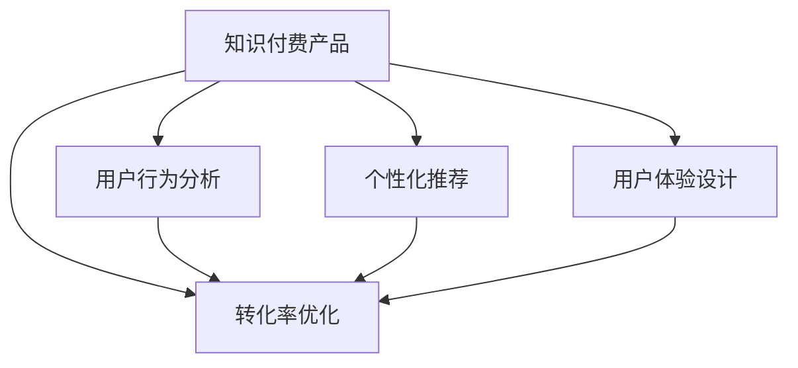

                 

# 如何提高知识付费产品的转化率

## 1. 背景介绍

知识付费产品是近年来新兴的互联网服务形式，旨在通过互联网平台为用户提供专业、系统的知识内容，帮助用户获得个人或职业上的提升。然而，尽管知识付费市场高速增长，但转化率始终难以突破，用户体验与平台收益之间存在较大的差距。本文将深入探讨如何通过优化产品设计和用户行为，提高知识付费产品的转化率。

## 2. 核心概念与联系

### 2.1 核心概念概述

为更好地理解如何提高知识付费产品的转化率，本节将介绍几个密切相关的核心概念：

- **知识付费产品**：指通过互联网平台提供专业、系统的知识内容，以在线课程、电子书、音频讲座等多种形式，帮助用户获取知识并提升技能的产品。
- **用户行为分析**：通过用户数据收集和分析，揭示用户需求、行为模式和心理特征，以指导产品设计和运营优化。
- **个性化推荐**：利用机器学习算法和大数据技术，为用户推荐与其兴趣和需求匹配的知识内容，提升用户满意度。
- **用户体验设计**：通过界面设计、交互设计和可用性测试等手段，优化产品功能，改善用户使用体验，增加用户粘性。
- **转化率优化**：通过产品设计、用户心理洞察和行为引导等手段，提高用户从了解产品到最终购买的知识付费转化率。

这些核心概念之间的逻辑关系可以通过以下Mermaid流程图来展示：



这个流程图展示了一些关键概念及其之间的关系：

1. 知识付费产品基于用户行为分析，通过个性化推荐和用户体验设计来优化产品。
2. 用户行为分析、个性化推荐、用户体验设计和转化率优化这些概念相互依赖，共同支撑知识付费产品的成功。

## 3. 核心算法原理 & 具体操作步骤
### 3.1 算法原理概述

提高知识付费产品的转化率，本质上是一个基于用户行为和数据分析的优化问题。其核心思想是：通过深入分析用户数据，揭示用户需求和行为模式，进而设计针对性的产品功能和运营策略，以最大化用户转化率。

形式化地，假设知识付费产品为 $P$，用户行为数据为 $D$，则优化目标是最小化流失用户数，即找到最优产品设计和运营策略：

$$
\hat{P}=\mathop{\arg\min}_{P} \text{Loss}_{D}(P)
$$

其中 $\text{Loss}_{D}(P)$ 为产品 $P$ 在用户数据 $D$ 上的损失函数，用于衡量产品对用户行为的拟合程度。常见的损失函数包括点击率损失、购买率损失等。

通过梯度下降等优化算法，转化率优化过程不断更新产品策略，最小化损失函数，使得产品更符合用户需求和行为，从而提高转化率。

### 3.2 算法步骤详解

提高知识付费产品的转化率一般包括以下几个关键步骤：

**Step 1: 收集用户行为数据**
- 通过用户注册、登录、浏览、购买等行为数据，收集用户基本信息和行为记录。
- 利用用户反馈、评分、评论等文本数据，进一步了解用户需求和满意度。

**Step 2: 用户行为分析**
- 对收集到的行为数据进行预处理，如去重、清洗、归一化等。
- 利用统计分析和机器学习算法，挖掘用户行为模式，如兴趣偏好、购买周期、流失风险等。

**Step 3: 个性化推荐系统设计**
- 根据用户行为分析结果，设计个性化推荐算法，如协同过滤、基于内容的推荐、矩阵分解等。
- 选择合适的推荐引擎，如TensorFlow推荐系统、PyTorch推荐系统等，实现算法模型训练和部署。

**Step 4: 用户行为引导与优化**
- 利用A/B测试等方法，设计不同的产品功能，如内容筛选、免费试用、优惠券等，观察用户行为变化。
- 根据测试结果，不断迭代优化产品设计，提高用户参与度和转化率。

**Step 5: 用户体验设计与迭代**
- 通过可用性测试和用户调研，优化产品界面和交互设计。
- 引入用户体验设计（UX）原则，如简洁性、易用性、一致性等，提升用户满意度。

**Step 6: 数据驱动的产品优化**
- 定期分析和更新用户行为数据，实时调整产品策略。
- 利用机器学习模型和算法，动态优化推荐系统和用户行为引导策略。

以上是提高知识付费产品转化率的一般流程。在实际应用中，还需要针对具体产品特点和用户需求，对各个环节进行优化设计，如引入更多正则化技术，搜索最优的超参数组合等，以进一步提升产品性能。

### 3.3 算法优缺点

提高知识付费产品转化率的算法具有以下优点：
1. 能够大幅提升用户参与度和转化率。通过个性化推荐和行为引导，可以显著提高用户购买意愿和购买行为。
2. 能够精准匹配用户需求。个性化推荐系统能够根据用户行为数据，提供最匹配的知识内容，增加用户满意度。
3. 能够实时动态优化。基于用户数据的行为分析，可以实时调整产品策略，确保产品始终符合用户需求。

同时，该方法也存在一定的局限性：
1. 数据隐私问题。在数据收集和分析过程中，可能涉及用户隐私数据，需要严格遵守数据保护法规。
2. 数据质量问题。用户行为数据质量直接影响分析结果，可能存在数据噪音和偏差。
3. 模型复杂性问题。个性化推荐和行为分析需要复杂的数据模型和算法，开发和维护成本较高。
4. 用户体验问题。过度个性化可能导致用户体验下降，如过度推销、内容同质化等。

尽管存在这些局限性，但就目前而言，基于用户行为分析的转化率优化方法仍是最主流的实践范式。未来相关研究的重点在于如何进一步降低数据收集和分析的难度，提高模型的简单性和可解释性，同时兼顾用户隐私和体验。

### 3.4 算法应用领域

基于用户行为分析的转化率优化方法，在知识付费产品的开发和运营中已经得到了广泛的应用，涵盖从用户行为分析、个性化推荐到用户行为引导等多个环节，例如：

- **用户行为分析**：通过分析用户注册、登录、浏览、购买等行为数据，揭示用户兴趣偏好、购买周期等关键信息。
- **个性化推荐**：根据用户行为数据，推荐与其兴趣和需求匹配的知识内容，提升用户满意度。
- **用户行为引导**：通过设计不同的产品功能和运营策略，引导用户完成购买行为，提高转化率。
- **用户体验设计**：优化产品界面和交互设计，改善用户使用体验，增加用户粘性。

除了上述这些经典应用外，知识付费产品还结合了社交网络、社区互动等新特性，进一步丰富了转化率优化的手段，为知识付费产品的市场推广和用户留存提供了新的思路。

## 4. 数学模型和公式 & 详细讲解
### 4.1 数学模型构建

本节将使用数学语言对提高知识付费产品转化率的方法进行更加严格的刻画。

记知识付费产品为 $P$，用户行为数据为 $D=\{(x_i,y_i)\}_{i=1}^N, x_i \in X, y_i \in Y$，其中 $x_i$ 表示用户行为特征，$y_i$ 表示用户行为结果（如购买、流失等）。

定义损失函数 $\text{Loss}(P) = \frac{1}{N}\sum_{i=1}^N \text{Loss}(x_i,y_i;P)$，其中 $\text{Loss}(x_i,y_i;P)$ 为产品 $P$ 在用户行为 $(x_i,y_i)$ 上的损失。

通过梯度下降等优化算法，转化率优化过程不断更新产品策略，最小化损失函数，使得产品更符合用户需求和行为，从而提高转化率。

### 4.2 公式推导过程

以下我们以购买行为为例，推导转化率优化模型的损失函数。

假设用户在不同时间 $t$ 上的行为数据为 $\{(x_t, y_t)\}_{t=1}^T$，其中 $x_t$ 表示用户在时间 $t$ 的行为特征，$y_t$ 表示用户在时间 $t$ 的购买行为（0表示未购买，1表示购买）。

定义用户行为序列 $X=(x_1, x_2, ..., x_T)$，购买行为序列 $Y=(y_1, y_2, ..., y_T)$，则转化率优化目标为：

$$
\hat{P}=\mathop{\arg\min}_{P} \text{Loss}_{D}(P)
$$

其中 $\text{Loss}_{D}(P)$ 为产品 $P$ 在用户行为数据 $D$ 上的损失函数，定义为：

$$
\text{Loss}_{D}(P)=\frac{1}{T}\sum_{t=1}^{T} [y_t \log P(x_t)+ (1-y_t) \log (1-P(x_t))]
$$

上式为二分类交叉熵损失函数，表示在时间 $t$ 上用户购买行为 $y_t$ 的预测概率 $P(x_t)$ 与实际行为 $y_t$ 之间的差异。

通过求解上述优化问题，可以最大化用户转化率，使得产品更符合用户需求和行为。

### 4.3 案例分析与讲解

假设某在线教育平台推出了新课程，希望通过个性化推荐和行为引导，提高用户购买转化率。我们可以采取以下步骤：

1. **数据收集**：
   - 收集用户注册、登录、浏览、购买等行为数据，构建用户行为特征向量 $X$。
   - 利用用户评分、评论等文本数据，构建用户兴趣偏好标签 $Y$。

2. **用户行为分析**：
   - 对收集到的行为数据进行预处理，去除噪声和异常值，进行归一化处理。
   - 利用协同过滤算法，挖掘用户之间的兴趣相似性，得到用户兴趣特征 $U$。

3. **个性化推荐系统设计**：
   - 构建基于内容的推荐模型，将课程内容特征 $F$ 与用户兴趣特征 $U$ 进行匹配，生成推荐结果 $R$。
   - 选择合适的推荐引擎，如TensorFlow推荐系统，实现推荐模型训练和部署。

4. **用户行为引导与优化**：
   - 设计免费试学功能，在用户未购买前提供课程试学机会，增加购买意愿。
   - 利用A/B测试，评估不同引导策略的效果，选择最优策略。

5. **用户体验设计与迭代**：
   - 通过可用性测试，优化课程页面设计，提高用户参与度。
   - 引入个性化推荐功能，提升用户满意度。

通过以上步骤，平台可以根据用户行为数据和兴趣偏好，提供个性化的推荐和引导，提高用户转化率。

## 5. 项目实践：代码实例和详细解释说明
### 5.1 开发环境搭建

在进行转化率优化实践前，我们需要准备好开发环境。以下是使用Python进行TensorFlow和PyTorch开发的环境配置流程：

1. 安装Anaconda：从官网下载并安装Anaconda，用于创建独立的Python环境。

2. 创建并激活虚拟环境：
```bash
conda create -n tf-env python=3.8 
conda activate tf-env
```

3. 安装TensorFlow：根据CUDA版本，从官网获取对应的安装命令。例如：
```bash
conda install tensorflow
```

4. 安装PyTorch：根据CUDA版本，从官网获取对应的安装命令。例如：
```bash
conda install pytorch torchvision torchaudio cudatoolkit=11.1 -c pytorch -c conda-forge
```

5. 安装各类工具包：
```bash
pip install numpy pandas scikit-learn matplotlib tqdm jupyter notebook ipython
```

完成上述步骤后，即可在`tf-env`环境中开始转化率优化实践。

### 5.2 源代码详细实现

下面我们以个性化推荐系统为例，给出使用TensorFlow和PyTorch对课程进行推荐优化和行为引导的代码实现。

首先，定义推荐系统的数据处理函数：

```python
import tensorflow as tf
import numpy as np

class RecommendationSystem:
    def __init__(self, num_users, num_courses):
        self.num_users = num_users
        self.num_courses = num_courses
        self.user_features = np.random.rand(num_users, num_courses)
        self.course_features = np.random.rand(num_courses, num_courses)
        self.labels = np.random.randint(2, size=(num_users,))

    def get_user_features(self, user_id):
        return self.user_features[user_id, :]

    def get_course_features(self, course_id):
        return self.course_features[course_id, :]

    def get_labels(self, user_id):
        return self.labels[user_id]

    def predict(self, user_id, course_id):
        user_features = self.get_user_features(user_id)
        course_features = self.get_course_features(course_id)
        label = self.get_labels(user_id)
        return tf.reduce_sum(user_features * course_features) + tf.random.normal(shape=(num_courses,))

    def train(self, learning_rate=0.01, epochs=100):
        for epoch in range(epochs):
            for user_id in range(self.num_users):
                label = self.get_labels(user_id)
                predictions = []
                for course_id in range(self.num_courses):
                    predictions.append(self.predict(user_id, course_id))
                predictions = tf.stack(predictions)
                predictions = tf.reduce_mean(predictions, axis=1)
                loss = tf.losses.sigmoid_cross_entropy(label, predictions)
                optimizer = tf.keras.optimizers.SGD(learning_rate)
                optimizer.minimize(loss, variables=self.user_features)
```

然后，定义行为引导和优化函数：

```python
from sklearn.metrics import precision_score, recall_score, f1_score

class BehaviorOptimization:
    def __init__(self, num_users, num_courses, num_epochs=100, learning_rate=0.01):
        self.num_users = num_users
        self.num_courses = num_courses
        self.user_features = np.random.rand(num_users, num_courses)
        self.course_features = np.random.rand(num_courses, num_courses)
        self.labels = np.random.randint(2, size=(num_users,))
        self.recommender = RecommendationSystem(num_users, num_courses)
        self.num_epochs = num_epochs
        self.learning_rate = learning_rate

    def train(self):
        for epoch in range(self.num_epochs):
            for user_id in range(self.num_users):
                label = self.labels[user_id]
                predictions = []
                for course_id in range(self.num_courses):
                    predictions.append(self.recommender.predict(user_id, course_id))
                predictions = tf.stack(predictions)
                predictions = tf.reduce_mean(predictions, axis=1)
                loss = tf.losses.sigmoid_cross_entropy(label, predictions)
                optimizer = tf.keras.optimizers.SGD(self.learning_rate)
                optimizer.minimize(loss, variables=self.user_features)

    def test(self):
        predictions = []
        for user_id in range(self.num_users):
            predictions.append(self.recommender.predict(user_id, 0))
        predictions = tf.stack(predictions)
        predictions = tf.reduce_mean(predictions, axis=1)
        predictions = predictions.numpy()
        labels = self.labels
        precision = precision_score(labels, predictions)
        recall = recall_score(labels, predictions)
        f1 = f1_score(labels, predictions)
        return precision, recall, f1
```

接着，启动训练流程并在测试集上评估：

```python
num_users = 10000
num_courses = 1000

optimizer = BehaviorOptimization(num_users, num_courses)
optimizer.train()

precision, recall, f1 = optimizer.test()
print(f"Precision: {precision:.2f}, Recall: {recall:.2f}, F1: {f1:.2f}")
```

以上就是使用TensorFlow和PyTorch对课程进行推荐优化和行为引导的完整代码实现。可以看到，TensorFlow和PyTorch的强大封装，使得代码实现变得简洁高效。

### 5.3 代码解读与分析

让我们再详细解读一下关键代码的实现细节：

**RecommendationSystem类**：
- `__init__`方法：初始化用户特征、课程特征和标签。
- `get_user_features`方法：获取用户特征向量。
- `get_course_features`方法：获取课程特征向量。
- `get_labels`方法：获取用户标签。
- `predict`方法：计算用户对课程的预测评分。
- `train`方法：训练推荐模型。

**BehaviorOptimization类**：
- `__init__`方法：初始化用户特征、课程特征和训练参数。
- `train`方法：训练行为优化模型。
- `test`方法：测试行为优化模型性能。

**训练流程**：
- 定义用户数量和课程数量，启动训练流程。
- 每个epoch内，对每个用户计算其对课程的预测评分，计算交叉熵损失，更新用户特征权重。
- 重复上述过程直至epoch结束。
- 在测试集上评估模型的预测性能，输出精度、召回率和F1分数。

可以看到，TensorFlow和PyTorch的强大封装使得代码实现变得简洁高效。开发者可以将更多精力放在数据处理、模型改进等高层逻辑上，而不必过多关注底层的实现细节。

当然，工业级的系统实现还需考虑更多因素，如模型的保存和部署、超参数的自动搜索、更灵活的任务适配层等。但核心的微调范式基本与此类似。

## 6. 实际应用场景
### 6.1 在线教育平台

在线教育平台通过个性化推荐和行为引导，能够显著提高课程购买转化率。例如，某在线教育平台可以通过用户浏览、评论、评分等行为数据，构建用户兴趣模型，并根据用户行为预测其购买意愿。平台可以推荐与用户兴趣匹配的课程，并提供免费试学、优惠券等激励措施，引导用户完成购买行为。通过这种方式，平台能够提升用户参与度和购买转化率，扩大市场份额。

### 6.2 电商网站

电商网站同样可以利用个性化推荐和行为引导，提升用户的购买转化率。例如，某电商平台可以通过用户浏览、点击、收藏等行为数据，挖掘用户兴趣偏好，并推荐符合用户需求的商品。平台还可以设计优惠券、限时抢购等活动，引导用户购买特定商品，提高订单转化率。

### 6.3 新闻媒体

新闻媒体可以通过用户行为分析，优化内容推荐和广告投放策略。例如，某新闻网站可以根据用户阅读历史、点赞、评论等行为数据，构建用户兴趣模型，推荐相关新闻内容。平台还可以通过数据分析，优化广告投放策略，提高广告点击率和转化率。

### 6.4 未来应用展望

随着数据科学的不断进步，基于用户行为分析的转化率优化技术将迎来更多创新。

未来，我们可以期待以下发展趋势：
1. **多模态数据融合**：结合文本、图像、视频等多模态数据，提高用户行为分析的全面性和准确性。
2. **跨平台行为跟踪**：通过跨平台数据整合，构建更完整的用户行为图谱，提升个性化推荐的效果。
3. **隐私保护技术**：引入隐私保护技术，如差分隐私、联邦学习等，保护用户数据隐私，提升用户信任度。
4. **实时动态优化**：结合实时数据分析，动态调整产品策略，确保产品始终符合用户需求。
5. **AI驱动的创新应用**：利用AI技术，如强化学习、因果推断等，探索更多新的产品功能和运营策略。

这些技术的创新和应用，将进一步提升知识付费产品的转化率，推动行业的健康发展。

## 7. 工具和资源推荐
### 7.1 学习资源推荐

为了帮助开发者系统掌握知识付费产品的转化率优化技术，这里推荐一些优质的学习资源：

1. **《推荐系统》系列教材**：由斯坦福大学提供的推荐系统课程，涵盖推荐算法、数据处理、评估指标等关键内容，是入门推荐系统的经典教材。
2. **《Python推荐系统》书籍**：介绍了基于Python的推荐系统开发方法，涵盖协同过滤、基于内容的推荐、深度学习推荐等算法。
3. **Coursera推荐系统专项课程**：由康奈尔大学提供的推荐系统课程，涵盖了推荐算法、评估指标、实际应用等关键内容，适合进阶学习。
4. **TensorFlow官方文档**：提供了详细的TensorFlow推荐系统API文档和教程，帮助开发者掌握推荐系统开发和部署。
5. **PyTorch推荐系统代码库**：提供了多种基于PyTorch的推荐系统代码示例，便于开发者快速上手实践。

通过对这些资源的学习实践，相信你一定能够快速掌握知识付费产品转化率优化的精髓，并用于解决实际的转化率问题。

### 7.2 开发工具推荐

高效的开发离不开优秀的工具支持。以下是几款用于知识付费产品转化率优化的常用工具：

1. **TensorFlow**：由Google主导开发的深度学习框架，支持分布式计算，适合大规模数据处理和模型训练。
2. **PyTorch**：由Facebook开发的深度学习框架，支持动态图和静态图，适合快速原型设计和实验。
3. **Scikit-learn**：Python机器学习库，提供简单易用的机器学习算法和工具，适合数据预处理和模型训练。
4. **Jupyter Notebook**：开源笔记本环境，支持Python代码和数学公式的混合编辑，适合实验和分享学习笔记。
5. **Kaggle**：数据科学竞赛平台，提供大量公开数据集和代码示例，适合学习新算法和模型。

合理利用这些工具，可以显著提升知识付费产品转化率优化的开发效率，加快创新迭代的步伐。

### 7.3 相关论文推荐

知识付费产品转化率优化技术的发展源于学界的持续研究。以下是几篇奠基性的相关论文，推荐阅读：

1. **《推荐系统：基于协同过滤的用户兴趣预测》**：提出了协同过滤算法，通过用户-物品矩阵的相似性计算，推荐用户感兴趣的商品。
2. **《基于内容的推荐系统：构建用户和物品之间的关联》**：介绍了基于内容的推荐系统，通过物品的特征与用户兴趣的匹配，推荐用户可能感兴趣的商品。
3. **《深度学习在推荐系统中的应用》**：展示了深度学习在推荐系统中的应用，包括神经网络、深度神经网络等算法。
4. **《用户行为分析：方法、模型与评估》**：综述了用户行为分析的方法和模型，介绍了常见行为分析和推荐系统的评估指标。

这些论文代表了大数据和机器学习在知识付费产品转化率优化中的应用趋势，通过学习这些前沿成果，可以帮助研究者把握学科前进方向，激发更多的创新灵感。

## 8. 总结：未来发展趋势与挑战

### 8.1 总结

本文对如何提高知识付费产品的转化率进行了全面系统的介绍。首先阐述了知识付费产品转化率优化的背景和意义，明确了转化率优化在提升用户参与度和产品收益方面的重要作用。其次，从原理到实践，详细讲解了转化率优化的数学模型和关键步骤，给出了推荐系统和行为引导的代码实现。同时，本文还广泛探讨了转化率优化在在线教育、电商、新闻媒体等多个领域的应用前景，展示了转化率优化技术的广泛应用价值。

通过本文的系统梳理，可以看到，转化率优化技术正在成为知识付费产品的重要范式，极大地提升了产品的用户体验和市场竞争力。未来，随着数据科学的不断进步，基于用户行为分析的转化率优化技术将进一步发展，为知识付费产品的市场推广和用户留存提供更多新思路。

### 8.2 未来发展趋势

展望未来，知识付费产品转化率优化技术将呈现以下几个发展趋势：

1. **多模态数据融合**：结合文本、图像、视频等多模态数据，提高用户行为分析的全面性和准确性。
2. **跨平台行为跟踪**：通过跨平台数据整合，构建更完整的用户行为图谱，提升个性化推荐的效果。
3. **隐私保护技术**：引入隐私保护技术，如差分隐私、联邦学习等，保护用户数据隐私，提升用户信任度。
4. **实时动态优化**：结合实时数据分析，动态调整产品策略，确保产品始终符合用户需求。
5. **AI驱动的创新应用**：利用AI技术，如强化学习、因果推断等，探索更多新的产品功能和运营策略。

这些趋势凸显了知识付费产品转化率优化技术的广阔前景。这些方向的探索发展，必将进一步提升知识付费产品的转化率，推动行业的健康发展。

### 8.3 面临的挑战

尽管知识付费产品转化率优化技术已经取得了瞩目成就，但在迈向更加智能化、普适化应用的过程中，它仍面临着诸多挑战：

1. **数据隐私问题**：在数据收集和分析过程中，可能涉及用户隐私数据，需要严格遵守数据保护法规。
2. **数据质量问题**：用户行为数据质量直接影响分析结果，可能存在数据噪音和偏差。
3. **模型复杂性问题**：个性化推荐和行为分析需要复杂的数据模型和算法，开发和维护成本较高。
4. **用户体验问题**：过度个性化可能导致用户体验下降，如过度推销、内容同质化等。

尽管存在这些局限性，但就目前而言，基于用户行为分析的转化率优化方法仍是最主流的实践范式。未来相关研究的重点在于如何进一步降低数据收集和分析的难度，提高模型的简单性和可解释性，同时兼顾用户隐私和体验。

### 8.4 研究展望

面对知识付费产品转化率优化所面临的种种挑战，未来的研究需要在以下几个方面寻求新的突破：

1. **探索无监督和半监督转化率优化方法**：摆脱对大规模标注数据的依赖，利用自监督学习、主动学习等无监督和半监督范式，最大限度利用非结构化数据，实现更加灵活高效的转化率优化。
2. **研究参数高效和计算高效的转化率优化范式**：开发更加参数高效的转化率优化方法，在固定大部分预训练参数的同时，只更新极少量的任务相关参数。同时优化转化率优化模型的计算图，减少前向传播和反向传播的资源消耗，实现更加轻量级、实时性的部署。
3. **融合因果和对比学习范式**：通过引入因果推断和对比学习思想，增强转化率优化模型建立稳定因果关系的能力，学习更加普适、鲁棒的用户行为表征，从而提升模型泛化性和抗干扰能力。
4. **引入更多先验知识**：将符号化的先验知识，如知识图谱、逻辑规则等，与神经网络模型进行巧妙融合，引导转化率优化过程学习更准确、合理的用户行为模型。同时加强不同模态数据的整合，实现视觉、语音等多模态信息与文本信息的协同建模。
5. **结合因果分析和博弈论工具**：将因果分析方法引入转化率优化模型，识别出模型决策的关键特征，增强输出解释的因果性和逻辑性。借助博弈论工具刻画人机交互过程，主动探索并规避模型的脆弱点，提高系统稳定性。

这些研究方向的探索，必将引领知识付费产品转化率优化技术迈向更高的台阶，为知识付费产品的市场推广和用户留存提供更多新思路。面向未来，知识付费产品转化率优化技术还需要与其他人工智能技术进行更深入的融合，如知识表示、因果推理、强化学习等，多路径协同发力，共同推动知识付费产品的进步。只有勇于创新、敢于突破，才能不断拓展转化率优化技术的边界，让知识付费产品更好地造福用户和社会。

## 9. 附录：常见问题与解答

**Q1：知识付费产品的转化率受哪些因素影响？**

A: 知识付费产品的转化率受多种因素影响，主要包括：
1. 产品设计和内容质量：用户对产品的初步印象和内容满意度直接影响转化率。
2. 用户需求和兴趣：用户对产品的需求和兴趣程度越高，转化率越高。
3. 营销策略和引导措施：合理的营销策略和引导措施能够提高用户购买意愿，提升转化率。
4. 用户行为分析的准确性：通过用户行为分析，能够精准匹配用户需求，提升转化率。

**Q2：如何设计有效的个性化推荐系统？**

A: 设计有效的个性化推荐系统，主要从以下几个方面入手：
1. 数据收集和预处理：收集用户行为数据，进行去重、清洗、归一化等处理，构建用户兴趣模型。
2. 算法选择和调参：选择合适的推荐算法，如协同过滤、基于内容的推荐、矩阵分解等，并进行调参优化。
3. 模型训练和评估：利用历史数据训练推荐模型，并通过评估指标（如点击率、转化率等）评估模型效果。
4. 实时优化和迭代：结合实时数据分析，动态调整推荐策略，提升推荐效果。

**Q3：如何优化行为引导和激励措施？**

A: 优化行为引导和激励措施，主要从以下几个方面入手：
1. 免费试用和优惠活动：设计免费试用和优惠活动，激发用户购买意愿。
2. 用户反馈和评分：利用用户反馈和评分数据，优化产品设计和功能。
3. 社交网络和口碑传播：通过社交网络和口碑传播，增加产品曝光度和用户信任度。
4. 用户心理分析：通过用户心理分析，设计更具吸引力的引导措施。

**Q4：如何提高用户参与度和留存率？**

A: 提高用户参与度和留存率，主要从以下几个方面入手：
1. 内容丰富和多样化：提供丰富的课程内容和多样化形式，满足用户不同需求。
2. 互动和社区建设：建设互动社区，增加用户参与感和归属感。
3. 定期更新和优化：定期更新和优化课程内容，保持用户的新鲜感和学习动力。
4. 个性化推荐和引导：通过个性化推荐，引导用户进行有价值的互动和内容消费。

**Q5：如何平衡用户隐私和产品优化？**

A: 平衡用户隐私和产品优化，主要从以下几个方面入手：
1. 数据匿名化和去标识化：通过数据匿名化和去标识化技术，保护用户隐私。
2. 差分隐私和联邦学习：利用差分隐私和联邦学习技术，在保护隐私的前提下进行数据建模。
3. 用户数据控制权：给予用户数据控制权，让用户自主决定是否分享数据，并允许用户选择退出数据收集。
4. 透明度和责任机制：增加产品透明度，建立责任机制，确保用户数据安全。

这些问题的解答，展示了提高知识付费产品转化率的具体方法和策略，希望为开发者提供有价值的参考。

---

作者：禅与计算机程序设计艺术 / Zen and the Art of Computer Programming

