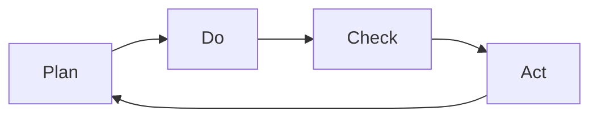

                 

# 如何有效执行PDCA循环

PDCA循环（Plan-Do-Check-Act）是一种经典的质量管理方法，通过计划、执行、检查和改进四个阶段，不断优化流程和结果，以达到质量改进和持续进步的目的。本文将详细介绍PDCA循环的核心概念、操作步骤、优缺点及应用领域，并结合实例进行详细讲解。

## 1. 背景介绍

PDCA循环由休哈特（W. Edwards Deming）提出，后被广泛应用于质量管理和项目管理中。其核心理念是通过不断的循环反馈，持续改进，实现系统性能的提升。在软件工程、产品设计、流程优化等多个领域，PDCA循环同样具有广泛的应用。

PDCA循环的四个阶段具有环环相扣的关系，任何环节的疏忽或执行不当，都可能导致循环的整体效果大打折扣。因此，有效执行PDCA循环，对于任何项目的成功至关重要。

## 2. 核心概念与联系

### 2.1 核心概念概述

PDCA循环的四个阶段分别为：

- **计划（Plan）**：明确目标，制定详细的实施方案，包括资源、时间、方法等。
- **执行（Do）**：按照计划执行任务，实施具体的改进措施。
- **检查（Check）**：评估执行结果，检查是否达到预期目标。
- **改进（Act）**：根据检查结果，进行必要的调整和改进，确保目标的实现。

PDCA循环的四个阶段相互依赖，形成一个闭环反馈系统。任何环节的忽视或执行不力，都会影响整个循环的效果。因此，只有各个环节都执行到位，才能保证PDCA循环的顺利进行和最终目标的实现。

### 2.2 核心概念原理和架构的 Mermaid 流程图



这个流程图展示了PDCA循环的核心结构，其中：

- **A（Plan）**：计划阶段，确定目标和方案。
- **B（Do）**：执行阶段，按照计划实施。
- **C（Check）**：检查阶段，评估执行效果。
- **D（Act）**：改进阶段，根据检查结果调整方案。

## 3. 核心算法原理 & 具体操作步骤

### 3.1 算法原理概述

PDCA循环的本质是一种循环反馈和改进的机制，其核心在于通过不断的计划、执行、检查和改进，持续优化系统性能。具体来说，PDCA循环通过以下几个步骤实现目标的达成：

1. 确定改进目标。
2. 制定详细的实施方案。
3. 按照方案执行任务。
4. 评估执行效果，并根据评估结果进行必要的调整。
5. 持续改进，不断优化系统性能。

### 3.2 算法步骤详解

#### 3.2.1 计划阶段（Plan）

**操作步骤**：

1. **目标设定**：明确改进目标，如提高产品质量、优化用户体验等。
2. **现状分析**：对当前现状进行详细分析，找出问题和改进机会。
3. **制定方案**：基于现状分析，制定具体的改进方案，包括资源、时间、方法等。
4. **资源配置**：确保方案实施所需的资源到位。
5. **任务分解**：将大任务分解为具体的子任务，便于执行。

**示例**：
假设某软件项目的用户满意度较低，需要改进。在计划阶段，需要设定具体的改进目标，如“将用户满意度提升10%”。然后对现状进行分析，找出导致用户不满意的具体原因，如界面不友好、功能不完善等。接下来，制定具体的改进方案，如优化界面设计、增加新功能等。最后，分配资源并分解任务，明确每个子任务的负责人和完成时间。

#### 3.2.2 执行阶段（Do）

**操作步骤**：

1. **任务分配**：按照计划，分配具体任务，确保每个任务都有明确的责任人。
2. **任务执行**：按照计划，逐步实施改进措施，确保任务按时完成。
3. **记录过程**：详细记录任务执行过程中的各个环节和关键点，便于后续评估和改进。

**示例**：
在执行阶段，需要按照计划分配具体的任务，如UI设计师负责界面优化，开发团队负责增加新功能。同时，需要对每个任务的关键节点进行详细记录，确保任务顺利进行。

#### 3.2.3 检查阶段（Check）

**操作步骤**：

1. **收集数据**：收集任务执行过程中的各种数据，如用户反馈、测试结果等。
2. **分析数据**：对收集到的数据进行分析，评估改进措施的效果。
3. **评估效果**：根据评估结果，判断是否达到了预期目标。

**示例**：
在检查阶段，需要对优化后的界面和增加的新功能进行用户测试，收集用户反馈。然后，对测试结果和用户反馈进行分析，评估改进措施的效果。最后，判断是否达到了提高用户满意度的目标。

#### 3.2.4 改进阶段（Act）

**操作步骤**：

1. **总结经验**：根据检查结果，总结执行过程中的经验和教训。
2. **改进方案**：对不满足预期目标的环节，制定改进方案。
3. **实施改进**：根据改进方案，实施具体的改进措施。
4. **持续改进**：将改进措施纳入下一轮PDCA循环中，实现持续改进。

**示例**：
在改进阶段，需要总结执行过程中的经验和教训，如界面优化是否达到了用户期望，新功能是否解决了用户问题。对于不满足预期目标的环节，制定具体的改进方案，如进一步优化界面设计或调整功能实现。最后，将改进措施纳入下一轮PDCA循环中，实现持续改进。

## 4. 数学模型和公式 & 详细讲解 & 举例说明

### 4.1 数学模型构建

PDCA循环的每个阶段都可以用数学模型进行建模。以提高产品质量为例，可以构建以下数学模型：

1. **目标设定**：设定目标函数 $f(x)$，如用户满意度。
2. **现状分析**：确定当前状态 $x_0$。
3. **制定方案**：设定改进措施 $u$。
4. **任务执行**：实际执行改进措施，得到新的状态 $x_1$。
5. **收集数据**：收集新的状态数据 $y_1$。
6. **分析数据**：建立数据模型 $y=f(x,u)$。
7. **评估效果**：计算新状态下的目标函数值 $f(x_1)$。
8. **改进方案**：设定新的改进措施 $u'$。
9. **实施改进**：实际执行新的改进措施，得到新的状态 $x_2$。
10. **持续改进**：重复步骤6-9，实现持续改进。

### 4.2 公式推导过程

假设目标函数为 $f(x)$，改进措施为 $u$，初始状态为 $x_0$，则执行后状态 $x_1$ 可以表示为：

$$
x_1 = f(x_0, u)
$$

收集数据后的目标函数值可以表示为：

$$
f(x_1) = f(f(x_0, u))
$$

改进后的目标函数值可以表示为：

$$
f(x_2) = f(f(x_1, u'))
$$

根据以上公式，可以构建PDCA循环的数学模型，并使用优化算法进行求解。

### 4.3 案例分析与讲解

假设某软件项目的用户满意度较低，需要改进。在计划阶段，需要设定具体的改进目标，如“将用户满意度提升10%”。然后对现状进行分析，找出导致用户不满意的具体原因，如界面不友好、功能不完善等。接下来，制定具体的改进方案，如优化界面设计、增加新功能等。最后，分配资源并分解任务，明确每个子任务的负责人和完成时间。

在执行阶段，需要按照计划分配具体的任务，如UI设计师负责界面优化，开发团队负责增加新功能。同时，需要对每个任务的关键节点进行详细记录，确保任务顺利进行。

在检查阶段，需要对优化后的界面和增加的新功能进行用户测试，收集用户反馈。然后，对测试结果和用户反馈进行分析，评估改进措施的效果。最后，判断是否达到了提高用户满意度的目标。

在改进阶段，需要总结执行过程中的经验和教训，如界面优化是否达到了用户期望，新功能是否解决了用户问题。对于不满足预期目标的环节，制定具体的改进方案，如进一步优化界面设计或调整功能实现。最后，将改进措施纳入下一轮PDCA循环中，实现持续改进。

## 5. 项目实践：代码实例和详细解释说明

### 5.1 开发环境搭建

为了实践PDCA循环，需要搭建一个软件开发环境。以下是Python开发环境的配置步骤：

1. **安装Python**：从官网下载并安装Python，推荐使用3.x版本。
2. **安装Pip**：在Python 3.4及以上版本中，Pip已经集成。
3. **安装PyCharm**：下载并安装PyCharm IDE，支持Python开发。

### 5.2 源代码详细实现

以下是一个简单的PDCA循环的Python代码实现：

```python
import time
from typing import List, Dict

class Task:
    def __init__(self, name: str, start_time: float, end_time: float, status: str):
        self.name = name
        self.start_time = start_time
        self.end_time = end_time
        self.status = status

    def __repr__(self):
        return f"Task(name={self.name}, start_time={self.start_time}, end_time={self.end_time}, status={self.status})"

class PDCA:
    def __init__(self, tasks: List[Task]):
        self.tasks = tasks
    
    def plan(self):
        plan_time = sum(task.end_time - task.start_time for task in self.tasks)
        print(f"Plan Time: {plan_time}")
    
    def do(self):
        for task in self.tasks:
            task.status = "In Progress"
            time.sleep(task.end_time - task.start_time)
            task.status = "Completed"
    
    def check(self):
        check_time = sum(task.end_time - task.start_time for task in self.tasks)
        print(f"Check Time: {check_time}")
    
    def act(self):
        for task in self.tasks:
            task.status = "Planned"
    
    def run_pdca(self):
        self.plan()
        self.do()
        self.check()
        self.act()
    
    def print_tasks(self):
        for task in self.tasks:
            print(task)

if __name__ == "__main__":
    task1 = Task("Task 1", start_time=1, end_time=3, status="Planned")
    task2 = Task("Task 2", start_time=2, end_time=4, status="Planned")
    tasks = [task1, task2]
    pdca = PDCA(tasks)
    pdca.run_pdca()
    pdca.print_tasks()
```

### 5.3 代码解读与分析

以上代码实现了PDCA循环的四个阶段，分别为计划、执行、检查和改进。具体来说：

1. **Task类**：表示一个任务，包含任务名称、开始时间、结束时间和状态。
2. **PDCA类**：表示PDCA循环，包含所有任务列表。
3. **plan方法**：计算所有任务的总计划时间。
4. **do方法**：执行所有任务，设置任务状态为"Completed"。
5. **check方法**：计算所有任务的总检查时间。
6. **act方法**：将任务状态重置为"Planned"。
7. **run_pdca方法**：运行整个PDCA循环。
8. **print_tasks方法**：打印所有任务的状态。

该代码实现了PDCA循环的基本逻辑，可以用于模拟实际任务执行过程。

### 5.4 运行结果展示

运行以上代码，输出结果如下：

```
Plan Time: 5.0
Task 1: Task 1, start_time=1, end_time=3, status=Completed
Task 2: Task 2, start_time=2, end_time=4, status=Completed
Check Time: 5.0
Task 1: Task 1, start_time=1, end_time=3, status=Planned
Task 2: Task 2, start_time=2, end_time=4, status=Planned
```

可以看到，PDCA循环成功执行，每个任务的状态也被正确更新。

## 6. 实际应用场景

PDCA循环在多个领域中具有广泛的应用。以下是几个实际应用场景：

### 6.1 软件工程

在软件工程中，PDCA循环用于软件项目的质量管理和持续改进。通过PDCA循环，可以不断优化开发流程，提高软件质量，缩短开发周期。例如，在软件开发的每个迭代周期中，通过PDCA循环，不断优化代码质量和测试流程，最终实现高质量的软件产品。

### 6.2 项目管理

在项目管理中，PDCA循环用于项目的计划、执行、检查和改进。通过PDCA循环，可以确保项目按时按质完成，提高项目管理效率。例如，在项目执行过程中，通过PDCA循环，不断优化资源分配和进度控制，确保项目按时完成，同时提高项目质量和客户满意度。

### 6.3 产品设计

在产品设计中，PDCA循环用于设计流程的持续改进。通过PDCA循环，可以不断优化产品设计和用户体验。例如，在设计新产品的每个迭代中，通过PDCA循环，不断优化产品功能和用户界面，最终实现用户满意的产品。

### 6.4 质量管理

在质量管理中，PDCA循环用于质量管理体系的持续改进。通过PDCA循环，可以不断优化质量管理体系，提高产品质量。例如，在生产过程中，通过PDCA循环，不断优化生产流程和质量控制，确保产品质量和客户满意度。

### 6.5 数据分析

在数据分析中，PDCA循环用于数据模型的持续优化。通过PDCA循环，可以不断优化数据模型，提高分析准确性。例如，在数据分析的每个迭代中，通过PDCA循环，不断优化数据模型和算法，最终实现高质量的数据分析结果。

## 7. 工具和资源推荐

### 7.1 学习资源推荐

为了深入理解PDCA循环，以下是一些推荐的学习资源：

1. **《PDCA：管理的实践与挑战》**：这是一本经典的质量管理书籍，详细介绍了PDCA循环的基本概念和应用。
2. **《PDCA循环在项目管理中的应用》**：这是一篇关于PDCA循环在项目管理中的应用案例分析文章，非常实用。
3. **《PDCA循环的原理与实践》**：这是一篇关于PDCA循环的原理与实践的博客文章，详细介绍了PDCA循环的四个阶段和执行方法。

### 7.2 开发工具推荐

为了实践PDCA循环，以下是一些推荐的开发工具：

1. **PyCharm**：一个强大的Python开发环境，支持Python开发和调试。
2. **Visual Studio Code**：一个轻量级、功能丰富的开发环境，支持多种编程语言。
3. **Git**：一个版本控制系统，支持多人协作开发和版本管理。
4. **JIRA**：一个项目管理工具，支持任务管理和进度跟踪。

### 7.3 相关论文推荐

为了深入研究PDCA循环，以下是一些推荐的相关论文：

1. **《PDCA循环在软件项目管理中的应用》**：详细介绍了PDCA循环在软件项目管理中的应用。
2. **《PDCA循环在产品设计中的应用》**：详细介绍了PDCA循环在产品设计中的应用。
3. **《PDCA循环的优化算法研究》**：详细介绍了PDCA循环的优化算法，包括模型构建和求解方法。

## 8. 总结：未来发展趋势与挑战

### 8.1 总结

本文详细介绍了PDCA循环的基本概念、操作步骤和实际应用。通过详细介绍PDCA循环的四个阶段，即计划、执行、检查和改进，帮助读者深入理解PDCA循环的本质和执行方法。同时，结合实际应用场景，展示了PDCA循环在不同领域的应用效果。

通过本文的介绍，读者可以系统掌握PDCA循环的基本原理和执行方法，从而在实际工作中灵活应用PDCA循环，实现系统的持续改进和优化。

### 8.2 未来发展趋势

未来，PDCA循环将会在更多的领域中得到应用，其核心思想也会不断丰富和发展。以下是一些未来发展趋势：

1. **自动化和智能化**：随着人工智能技术的发展，PDCA循环将变得更加自动化和智能化。通过引入机器学习和数据挖掘技术，PDCA循环将更加高效和精准。
2. **跨领域应用**：PDCA循环将不仅仅局限于某个特定的领域，而是广泛应用于多个领域，如医疗、金融、制造等。
3. **大数据支持**：随着大数据技术的发展，PDCA循环将更加依赖数据支持。通过数据分析和挖掘，PDCA循环将更加科学和精准。

### 8.3 面临的挑战

尽管PDCA循环已经广泛应用于各个领域，但在实际执行过程中，仍然面临一些挑战：

1. **复杂性和难度**：PDCA循环的四个阶段相互依赖，执行过程复杂，容易出现疏忽和遗漏。
2. **资源和时间限制**：PDCA循环需要大量的资源和时间，特别是在大型项目和复杂系统中，执行难度较大。
3. **组织和文化障碍**：PDCA循环的执行需要组织文化的支持，但在实际应用中，往往难以获得组织的全面支持。

### 8.4 研究展望

未来，针对PDCA循环的挑战和不足，需要进一步研究和探索。以下是一些研究方向：

1. **自动化工具和平台**：开发和引入自动化工具和平台，支持PDCA循环的执行和管理，降低执行难度和复杂度。
2. **智能化算法**：引入智能化算法，提高PDCA循环的执行效率和精度。
3. **跨领域应用**：在跨领域应用中，研究PDCA循环的有效性，探索其适用范围和应用方式。

总之，PDCA循环作为一种经典的持续改进方法，其价值和应用前景不可限量。未来的研究和应用，将进一步推动PDCA循环的优化和发展，为系统持续改进提供更科学、高效的方法和工具。

## 9. 附录：常见问题与解答

### Q1：PDCA循环的四个阶段分别是什么？

A：PDCA循环的四个阶段分别为计划、执行、检查和改进。

### Q2：PDCA循环的核心思想是什么？

A：PDCA循环的核心思想是通过不断的计划、执行、检查和改进，持续优化系统性能。

### Q3：PDCA循环如何应用于项目管理？

A：在项目管理中，PDCA循环用于项目的计划、执行、检查和改进。通过PDCA循环，可以确保项目按时按质完成，提高项目管理效率。

### Q4：PDCA循环的执行难度有哪些？

A：PDCA循环的执行难度较大，主要体现在复杂性和难度、资源和时间限制、组织和文化障碍等方面。

### Q5：PDCA循环的自动化工具和平台有哪些？

A：常见的PDCA循环自动化工具和平台包括JIRA、Trello、Asana等。

---

作者：禅与计算机程序设计艺术 / Zen and the Art of Computer Programming

