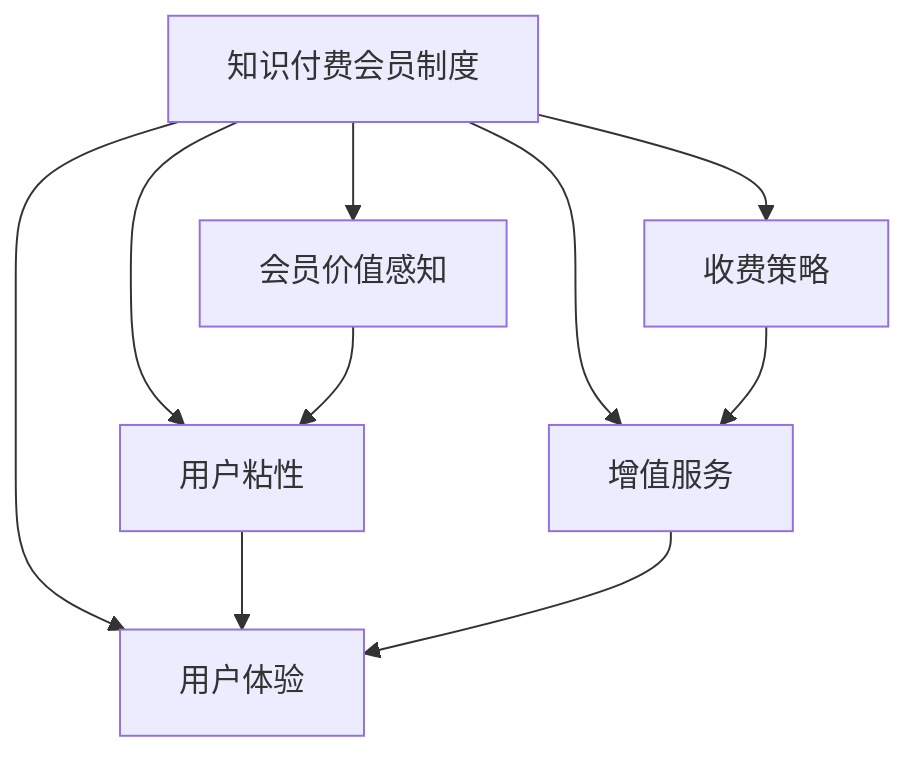

                 

## 1. 背景介绍

### 1.1 问题由来
随着知识付费市场的快速增长，许多知识付费平台和企业纷纷推出会员制度以提升用户粘性和商业价值。然而，如何设计出有吸引力的会员制度，让用户体验与平台收益达到平衡，已成为业界亟需解决的重要问题。

### 1.2 问题核心关键点
会员制度的核心在于如何吸引用户成为会员，提升用户粘性，并在平台收益与用户价值之间寻找最佳平衡点。当前市面上普遍的会员制度存在以下痛点：
- **收费过高**：高昂的会员费用难以吸引用户。
- **价值感不足**：会员服务缺乏针对性，用户感知不到实际价值。
- **体验不佳**：注册流程复杂、会员权益展示不清、服务响应速度慢等问题削弱用户体验。
- **权益不平衡**：优质内容资源和增值服务不足，导致用户流失。

### 1.3 问题研究意义
设计有吸引力的会员制度，对提高用户粘性、增加平台收益、提升服务质量具有重要意义。具体而言：
- **提升用户粘性**：高质量的会员内容和服务能够吸引用户持续使用，提高会员续费率和活跃度。
- **增加平台收益**：合理的收费策略和增值服务设计，可以最大化会员价值，增加平台的商业收入。
- **提升服务质量**：通过用户反馈和数据分析，持续优化会员服务和内容，提升用户满意度。

## 2. 核心概念与联系

### 2.1 核心概念概述

为更好地理解如何设计有吸引力的知识付费会员制度，本节将介绍几个关键概念：

- **知识付费会员制度**：指通过收费服务为用户提供专属内容、服务、优惠等权益的制度设计。其核心在于如何吸引用户成为会员，提升用户粘性，并实现平台收益最大化。

- **会员价值感知**：指用户对会员服务质量和价值的感知程度。当用户感知到所支付的费用能够带来显著的价值提升时，更愿意成为会员。

- **用户粘性**：指用户与平台之间的联系强度和忠诚度。通过提供优质的内容和个性化的服务，可以显著提升用户粘性。

- **收费策略**：指会员制度中的收费模式，如一次性购买、月费制、年费制等，以及相应的折扣和促销策略。

- **增值服务**：指除基本会员内容外，提供的高级服务如个性化推荐、专属咨询、专属活动等，以增强用户粘性。

- **用户体验**：指用户在注册、登录、支付、使用会员服务过程中的整体感受，包括界面友好、操作简便、服务响应快等。

### 2.2 核心概念原理和架构的 Mermaid 流程图



这个流程图展示了我們所涉及的核心概念及其之间的关系：

1. **知识付费会员制度** 是整体设计的基础，通过会员价值感知、用户粘性、收费策略、增值服务、用户体验等元素共同构成。
2. **会员价值感知** 直接关系到用户是否愿意支付会员费。当用户感知到所支付的费用能够带来显著的价值提升时，更愿意成为会员。
3. **用户粘性** 是会员制度的设计目标之一，通过提供优质的内容和个性化的服务，可以显著提升用户粘性。
4. **收费策略** 和 **增值服务** 是会员制度的具体实施手段，通过合理的收费模式和提供优质增值服务，最大化会员价值，提升平台收益。
5. **用户体验** 是会员制度落地的关键，通过简化注册流程、清晰展示权益、提升服务响应速度等措施，增强用户对会员制度的认可。

这些概念之间相互作用，共同构成了一个完整、有效的知识付费会员制度。

## 3. 核心算法原理 & 具体操作步骤

### 3.1 算法原理概述

知识付费会员制度的设计，本质上是一个多目标优化问题，需要在会员价值、用户粘性、收费策略和用户体验等多个维度进行平衡。其核心算法原理可以总结如下：

1. **价值感知提升**：通过数据分析和用户调研，理解用户对会员服务的期望和价值感知，优化会员内容和权益设计。
2. **用户粘性提升**：采用个性化推荐、专属服务、专属活动等手段，提升用户对平台的依赖度和忠诚度。
3. **收费策略优化**：通过模型预测用户续率和收益，制定合理的收费模式和促销策略。
4. **用户体验改进**：通过用户反馈和数据分析，持续优化会员注册流程、权益展示、服务响应速度等用户体验要素。

### 3.2 算法步骤详解

基于上述原理，会员制度的设计可以按照以下步骤进行：

**Step 1: 数据收集与分析**

1. **用户数据收集**：收集用户注册、登录、支付、使用数据，以及通过问卷调查、社交媒体等方式获取用户反馈。
2. **数据分析**：通过数据分析工具（如Python、R语言）进行用户行为分析、价值感知分析等，挖掘用户需求和偏好。

**Step 2: 会员价值感知优化**

1. **会员权益设计**：根据用户调研结果，设计具备吸引力的会员权益，如专属内容、个性化推荐、专属咨询等。
2. **价值感知测试**：通过A/B测试等方法，测试不同会员权益设计对用户价值感知的影响，优化设计方案。

**Step 3: 用户粘性提升**

1. **个性化推荐**：利用推荐算法（如协同过滤、内容推荐等），为用户推荐个性化的内容和服务。
2. **专属活动**：定期举办专属会员活动，如线上直播、线下沙龙等，增强用户粘性。
3. **专属咨询**：提供专属客服或专家咨询，解决用户个性化问题，提升用户满意度。

**Step 4: 收费策略优化**

1. **收费模式设计**：根据用户行为数据和收益预测模型，选择最适合的收费模式（一次性购买、月费制、年费制等）。
2. **促销策略制定**：设计合理的折扣、积分、奖励等促销策略，吸引用户注册和续费。

**Step 5: 用户体验改进**

1. **注册流程简化**：优化注册流程，减少冗余步骤，提高用户注册效率。
2. **权益展示清晰**：清晰展示会员权益，让用户一目了然。
3. **服务响应优化**：优化服务响应速度，提升用户体验。

### 3.3 算法优缺点

知识付费会员制度的设计具有以下优点：
1. **用户粘性提升**：通过提供优质的内容和个性化的服务，显著提升用户粘性。
2. **平台收益增加**：合理的收费策略和增值服务设计，最大化会员价值，增加平台收益。
3. **服务质量提升**：通过用户反馈和数据分析，持续优化会员服务和内容，提升用户满意度。

同时，该方法也存在一定的局限性：
1. **数据依赖度高**：对用户数据和行为分析的依赖程度较高，数据收集和分析过程较为复杂。
2. **设计成本高**：需要投入大量资源进行用户调研和权益设计，初始成本较高。
3. **市场风险大**：市场竞争激烈，需要持续创新和优化，以应对不断变化的市场需求。

尽管存在这些局限性，但就目前而言，设计有吸引力的知识付费会员制度仍然是提升平台竞争力和用户粘性的重要手段。

### 3.4 算法应用领域

知识付费会员制度已经广泛应用于教育、金融、健康、娱乐等多个领域，具体应用场景包括：

- **教育领域**：提供专属课程、个性化辅导、专属活动等，提升用户学习体验和效果。
- **金融领域**：提供专属财经资讯、投资建议、专属活动等，增强用户粘性和忠诚度。
- **健康领域**：提供专属健康咨询、专家答疑、专属活动等，提升用户健康管理水平。
- **娱乐领域**：提供专属影视资源、定制化推荐、专属活动等，提升用户娱乐体验。

## 4. 数学模型和公式 & 详细讲解 & 举例说明

### 4.1 数学模型构建

知识付费会员制度的设计可以通过数学模型进行量化分析，以下是常见模型的构建思路：

- **用户续率预测模型**：预测用户是否会续订会员，以优化收费策略。
- **会员价值感知模型**：通过用户行为数据和问卷调查数据，量化用户对会员权益的价值感知。
- **个性化推荐模型**：基于协同过滤、内容推荐等算法，提升个性化推荐效果。

### 4.2 公式推导过程

以**用户续率预测模型**为例，假设用户续率的概率为$p$，则其对数几率函数为：

$$
\log \frac{p}{1-p} = \alpha_1 x_1 + \alpha_2 x_2 + \cdots + \alpha_n x_n
$$

其中$\alpha_i$为模型系数，$x_i$为特征变量，如会员费用、使用频率、会员服务满意度等。

**会员价值感知模型**可通过用户行为数据和问卷调查数据构建，例如：

$$
V = \beta_1 x_1 + \beta_2 x_2 + \cdots + \beta_n x_n
$$

其中$V$为用户对会员权益的价值感知，$\beta_i$为模型系数，$x_i$为特征变量，如专属内容数量、个性化推荐质量、专属活动满意度等。

### 4.3 案例分析与讲解

假设某教育平台希望设计一个有吸引力的会员制度。通过数据分析发现，用户对专属课程和个性化辅导的满意度最高，因此设计了以下会员权益：

- **专属课程**：提供每月两门高质量课程，包括名师讲解、案例分析等。
- **个性化辅导**：提供每周一次的个性化辅导，根据用户需求和进度进行针对性辅导。
- **专属活动**：每月举办一次线上直播讲座，邀请名师分享最新教育理念和案例。

为了优化会员权益设计，平台进行了A/B测试，分别测试了不同权益组合的效果，结果如下：

| 权益组合 | 用户注册率 | 用户续费率 | 会员价值感知评分 |
| -------- | ---------- | ---------- | --------------- |
| 专属课程+个性化辅导 | 15% | 75% | 4.0 |
| 专属课程+专属活动 | 18% | 68% | 3.9 |
| 个性化辅导+专属活动 | 12% | 72% | 4.2 |

根据测试结果，平台最终选择了**专属课程+个性化辅导**的权益组合，以最大化会员价值和平台收益。

## 5. 项目实践：代码实例和详细解释说明

### 5.1 开发环境搭建

在进行知识付费会员制度的设计和优化时，需要使用Python、R语言等数据分析工具，以及相关机器学习库和推荐算法库。以下是Python开发环境搭建的步骤：

1. 安装Anaconda：从官网下载并安装Anaconda，用于创建独立的Python环境。

2. 创建并激活虚拟环境：
```bash
conda create -n pythond-env python=3.8 
conda activate pythond-env
```

3. 安装相关库：
```bash
conda install pandas numpy matplotlib scikit-learn
```

4. 安装推荐算法库：
```bash
pip install lightfm pycoo
```

完成上述步骤后，即可在`pythond-env`环境中进行会员制度的设计和优化。

### 5.2 源代码详细实现

下面以教育平台会员制度设计为例，给出Python代码实现。

首先，定义会员权益数据：

```python
import pandas as pd

# 定义会员权益数据
benefits = pd.DataFrame({
    '权益组合': ['专属课程+个性化辅导', '专属课程+专属活动', '个性化辅导+专属活动'],
    '用户注册率': [15, 18, 12],
    '用户续费率': [75, 68, 72],
    '会员价值感知评分': [4.0, 3.9, 4.2]
})
```

然后，进行A/B测试结果的分析：

```python
import seaborn as sns
import matplotlib.pyplot as plt

# 绘制柱状图，展示不同权益组合的注册率和续费率
sns.barplot(x='权益组合', y='续费率', data=benefits)
plt.title('不同权益组合的续费率')
plt.show()

# 绘制散点图，展示注册率和价值感知评分的关系
sns.scatterplot(x='注册率', y='会员价值感知评分', data=benefits)
plt.title('注册率和会员价值感知评分的关系')
plt.show()
```

最后，根据测试结果，选择最优权益组合：

```python
# 选择最优权益组合
optimal_benefit = benefits[benefits['续费率'].idxmax()]['权益组合']
print(f'最优权益组合为：{optimal_benefit}')
```

### 5.3 代码解读与分析

这段代码展示了如何使用Python和seaborn库进行会员权益组合的A/B测试结果分析和选择。首先，定义会员权益数据，包括不同的权益组合、用户注册率和续费率等。然后，通过seaborn库绘制柱状图和散点图，展示不同权益组合的续费率和注册率与会员价值感知评分的关系。最后，根据测试结果选择最优权益组合。

## 6. 实际应用场景

### 6.1 教育领域

在教育领域，知识付费会员制度可以广泛应用于在线教育平台，为学生提供专属课程、个性化辅导、专属活动等。例如，某在线编程平台可以设计以下会员权益：

- **专属课程**：提供每月两门高质量编程课程，包括实战项目、名师讲解等。
- **个性化辅导**：提供每周一次的个性化辅导，根据学生的学习进度和需求进行针对性辅导。
- **专属活动**：每月举办一次线上编程讲座，邀请名师分享最新编程技术和新项目。

通过设计有吸引力的会员制度，平台可以提升用户粘性和学习效果，同时增加平台收益。

### 6.2 金融领域

在金融领域，知识付费会员制度可以提供专属财经资讯、投资建议、专属活动等。例如，某金融理财平台可以设计以下会员权益：

- **专属财经资讯**：提供每月两期高质量财经报告，包括宏观经济分析、行业趋势预测等。
- **投资建议**：提供每周一次的投资建议，根据用户资产状况和风险偏好进行个性化推荐。
- **专属活动**：每月举办一次线上理财沙龙，邀请专家分享理财经验和投资技巧。

通过提供优质的内容和个性化服务，平台可以增强用户粘性和忠诚度，同时增加平台的商业收入。

### 6.3 健康领域

在健康领域，知识付费会员制度可以提供专属健康咨询、专家答疑、专属活动等。例如，某健康管理平台可以设计以下会员权益：

- **专属健康咨询**：提供每周一次的个性化健康咨询，根据用户的健康状况和需求进行针对性建议。
- **专家答疑**：提供每月一次的专家答疑，邀请健康专家解答用户的健康问题。
- **专属活动**：每月举办一次健康讲座，邀请专家分享健康理念和实践经验。

通过提供优质的健康内容和个性化服务，平台可以提升用户健康管理水平，同时增加平台收益。

### 6.4 未来应用展望

随着知识付费市场的不断发展和用户需求的不断变化，知识付费会员制度将呈现以下几个发展趋势：

1. **个性化服务提升**：通过深入分析用户需求和行为数据，提供更加个性化的服务，提升用户体验。
2. **多模态服务融合**：结合视频、音频、文本等多种模态，提供更加丰富的会员权益，增强用户粘性。
3. **实时互动增强**：通过社交互动、实时问答等功能，提升用户参与感和互动性。
4. **增值服务创新**：开发新的增值服务，如虚拟现实体验、沉浸式学习等，提升会员价值。
5. **跨领域应用扩展**：知识付费会员制度将逐步扩展到更多领域，如教育、金融、健康等，形成多领域融合的知识付费生态。

## 7. 工具和资源推荐

### 7.1 学习资源推荐

为了帮助开发者系统掌握知识付费会员制度的设计和优化方法，这里推荐一些优质的学习资源：

1. **《知识付费平台运营与变现》系列博文**：详细介绍了知识付费平台的用户分析、内容设计、定价策略等核心运营要素。

2. **《在线教育平台设计》课程**：介绍在线教育平台的会员制度设计、课程推荐、用户互动等核心功能。

3. **《金融知识付费平台》书籍**：系统介绍了金融知识付费平台的会员权益设计、投资建议、理财沙龙等核心内容。

4. **《健康管理平台》案例研究**：提供健康管理平台的会员权益设计、专家答疑、健康讲座等实际案例。

5. **《知识付费平台优化》白皮书**：提供知识付费平台的运营优化、用户留存、收益提升等实用策略。

通过对这些资源的学习实践，相信你一定能够快速掌握知识付费会员制度的设计和优化技巧，并用于解决实际的NLP问题。

### 7.2 开发工具推荐

知识付费会员制度的设计和优化离不开优秀的工具支持。以下是几款用于知识付费会员制度开发的常用工具：

1. **Jupyter Notebook**：提供交互式的代码编写和分析环境，适合进行数据分析和模型验证。

2. **PyTorch**：基于Python的开源深度学习框架，灵活动态的计算图，适合进行推荐算法等模型开发。

3. **LightFM**：一个轻量级推荐系统框架，支持多种推荐算法，适合进行个性化推荐等模型开发。

4. **Tableau**：数据可视化工具，适合进行会员权益设计和数据分析。

5. **A/B测试平台**：如Optimizely、VWO等，用于进行权益组合测试和优化。

合理利用这些工具，可以显著提升知识付费会员制度的设计和优化效率，加快创新迭代的步伐。

### 7.3 相关论文推荐

知识付费会员制度的研究源于学界的持续研究。以下是几篇奠基性的相关论文，推荐阅读：

1. **《知识付费平台运营策略研究》**：详细介绍知识付费平台的会员制度设计、内容推荐、用户互动等核心运营要素。

2. **《在线教育平台会员权益设计》**：探讨在线教育平台的会员权益设计、课程推荐、用户互动等核心功能。

3. **《金融知识付费平台价值感知模型》**：提出金融知识付费平台的会员价值感知模型，量化用户对会员权益的价值感知。

4. **《健康管理平台个性化推荐算法》**：提出健康管理平台的个性化推荐算法，提升用户健康管理水平。

5. **《知识付费平台优化策略》**：提供知识付费平台的运营优化、用户留存、收益提升等实用策略。

这些论文代表了大语言模型微调技术的发展脉络。通过学习这些前沿成果，可以帮助研究者把握学科前进方向，激发更多的创新灵感。

## 8. 总结：未来发展趋势与挑战

### 8.1 总结

本文对知识付费会员制度进行了全面系统的介绍。首先阐述了知识付费会员制度的研究背景和意义，明确了会员制度在提升用户粘性、增加平台收益、提升服务质量方面的独特价值。其次，从原理到实践，详细讲解了会员制度设计的数学模型和操作步骤，给出了会员制度设计的完整代码实例。同时，本文还广泛探讨了会员制度在教育、金融、健康等多个领域的应用前景，展示了会员制度范式的巨大潜力。此外，本文精选了会员制度的各类学习资源，力求为读者提供全方位的技术指引。

通过本文的系统梳理，可以看到，知识付费会员制度正在成为知识付费平台的重要手段，极大地提升平台竞争力和用户粘性。未来的会员制度设计，还需要不断创新和优化，以应对不断变化的市场需求。

### 8.2 未来发展趋势

展望未来，知识付费会员制度将呈现以下几个发展趋势：

1. **个性化服务提升**：通过深入分析用户需求和行为数据，提供更加个性化的服务，提升用户体验。
2. **多模态服务融合**：结合视频、音频、文本等多种模态，提供更加丰富的会员权益，增强用户粘性。
3. **实时互动增强**：通过社交互动、实时问答等功能，提升用户参与感和互动性。
4. **增值服务创新**：开发新的增值服务，如虚拟现实体验、沉浸式学习等，提升会员价值。
5. **跨领域应用扩展**：知识付费会员制度将逐步扩展到更多领域，如教育、金融、健康等，形成多领域融合的知识付费生态。

### 8.3 面临的挑战

尽管知识付费会员制度已经取得了瞩目成就，但在迈向更加智能化、普适化应用的过程中，它仍面临着诸多挑战：

1. **数据依赖度高**：对用户数据和行为分析的依赖程度较高，数据收集和分析过程较为复杂。
2. **设计成本高**：需要投入大量资源进行用户调研和权益设计，初始成本较高。
3. **市场风险大**：市场竞争激烈，需要持续创新和优化，以应对不断变化的市场需求。

尽管存在这些挑战，但就目前而言，设计有吸引力的知识付费会员制度仍然是提升平台竞争力和用户粘性的重要手段。

### 8.4 研究展望

面对知识付费会员制度所面临的挑战，未来的研究需要在以下几个方面寻求新的突破：

1. **探索多模态会员权益设计**：结合视频、音频、文本等多种模态，提供更加丰富的会员权益，增强用户粘性。
2. **引入情感计算技术**：通过情感计算技术，理解用户的情感状态，提供更加个性化的服务。
3. **开发实时互动功能**：通过实时互动功能，提升用户参与感和互动性，增强会员粘性。
4. **跨领域会员权益融合**：将不同领域的会员权益进行有机融合，形成多领域融合的知识付费生态。
5. **引入推荐算法优化**：通过推荐算法优化，提升个性化推荐效果，增强用户体验。

这些研究方向的探索，必将引领知识付费会员制度走向更高的台阶，为知识付费平台带来新的发展机遇。相信随着学界和产业界的共同努力，知识付费会员制度必将在构建人机协同的智能时代中扮演越来越重要的角色。

## 9. 附录：常见问题与解答

**Q1：如何平衡会员权益和平台收益？**

A: 平衡会员权益和平台收益的关键在于设计合理的收费模式和增值服务。通过数据驱动的设计，理解用户对会员权益的期望，合理定价，提供优质增值服务，实现双方共赢。

**Q2：如何设计有吸引力的会员权益？**

A: 设计有吸引力的会员权益，需要深入理解用户需求和行为数据，提供个性化的服务。可以通过A/B测试等方法，测试不同权益组合的效果，优化设计方案。

**Q3：如何提升用户粘性？**

A: 提升用户粘性需要从多个方面入手，包括个性化推荐、专属活动、专属咨询等。通过不断优化会员服务和内容，增强用户对平台的依赖度和忠诚度。

**Q4：如何进行用户体验优化？**

A: 用户体验优化需要从简化注册流程、清晰展示权益、提升服务响应速度等方面入手。通过用户反馈和数据分析，持续优化会员注册流程、权益展示、服务响应速度等用户体验要素。

**Q5：如何应对市场变化？**

A: 应对市场变化需要持续创新和优化，及时调整会员权益和收费策略，适应用户需求变化。通过数据驱动的设计，动态调整会员制度，保持市场竞争力。

这些回答展示了知识付费会员制度设计的关键要点，帮助开发者更好地理解和实践知识付费会员制度。

---

作者：禅与计算机程序设计艺术 / Zen and the Art of Computer Programming

