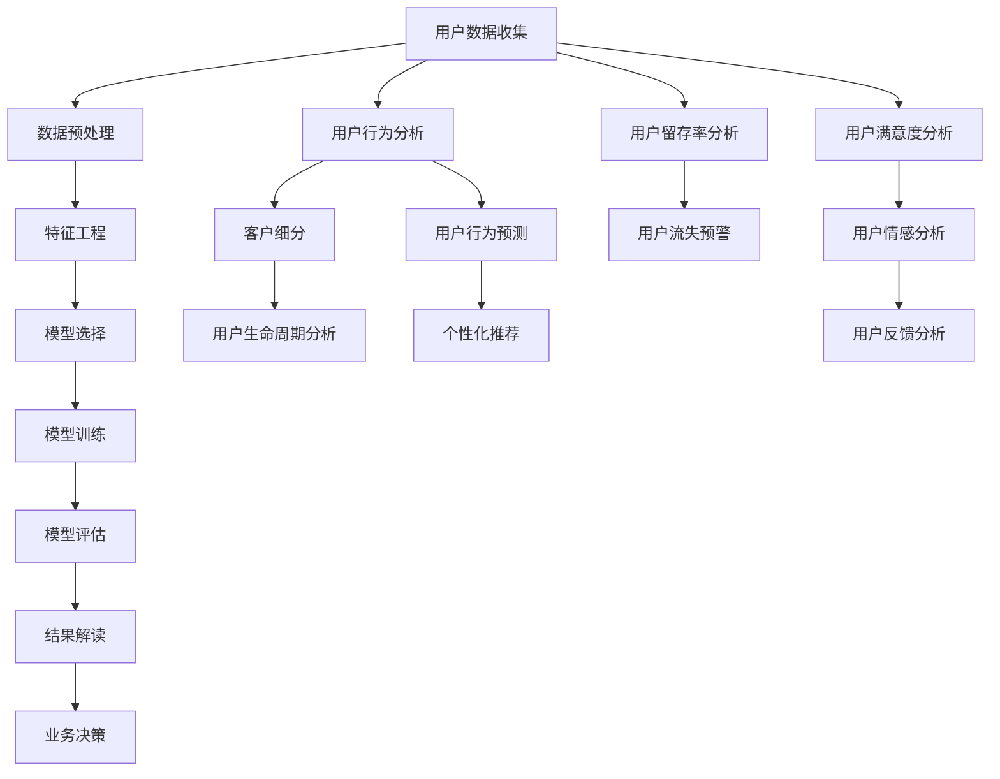
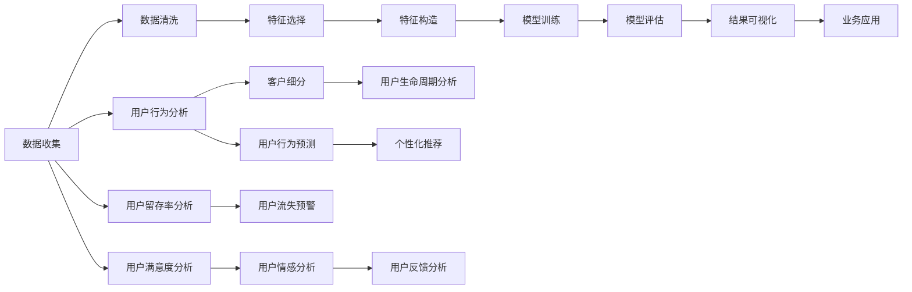

                 

# 如何进行有效的用户分析

在数字化时代，用户分析已成为企业发展不可或缺的一部分。通过对用户行为的深度理解，企业能够精准定位目标市场，优化产品设计，提高客户满意度，从而实现商业价值的最大化。然而，面对海量的用户数据，如何进行有效的用户分析，提取有价值的洞察，仍然是一个复杂而挑战性的问题。本文将从核心概念、算法原理、具体操作步骤等方面，详细剖析如何进行有效的用户分析，并给出实用的项目实践和应用场景示例。

## 1. 背景介绍

### 1.1 问题由来

在互联网和移动互联网的推动下，用户数据迅速增长，如何从海量数据中提取有价值的信息，成为了各大企业关注的焦点。用户分析的核心在于理解用户的购买行为、使用习惯、情感倾向等关键特征，为企业决策提供依据。传统的统计分析方法虽然有效，但在面对复杂多变的数据时显得力不从心。因此，借助数据科学和机器学习等先进技术手段，进行更深层次的用户分析，显得尤为重要。

### 1.2 问题核心关键点

用户分析的目的是从用户数据中提取出有用的信息，揭示用户行为模式和潜在的业务机会。关键点包括：

- **数据收集**：获取来自各种渠道的用户数据，如交易记录、浏览行为、搜索历史等。
- **数据处理**：清洗、转换和集成不同数据源的数据，为分析奠定基础。
- **特征工程**：提取、选择和构建对分析有价值的特征。
- **算法选择**：选择合适的机器学习算法，进行分类、聚类、关联规则挖掘等分析。
- **模型评估**：对模型进行验证和优化，确保分析结果的准确性和可靠性。
- **结果解读**：将模型输出转化为业务洞察，指导实际决策。

## 2. 核心概念与联系

### 2.1 核心概念概述

用户分析涉及多个核心概念，其相互关系如图1所示：



图1：用户分析的核心概念

- **用户数据收集**：通过日志、问卷、交易记录等手段，收集用户的多维数据。
- **数据预处理**：清洗和标准化数据，去除噪音，确保数据质量。
- **特征工程**：选择合适的特征，并进行转换、组合，构建对分析有帮助的新特征。
- **模型选择**：根据分析需求，选择适当的机器学习模型。
- **模型训练**：利用训练集数据，训练模型以预测用户行为或分类用户群体。
- **模型评估**：使用验证集数据，评估模型的性能。
- **结果解读**：将模型输出转化为可操作的业务洞察。
- **业务决策**：基于分析结果，优化产品设计、提升用户体验、制定营销策略。

### 2.2 核心概念原理和架构的 Mermaid 流程图



## 3. 核心算法原理 & 具体操作步骤

### 3.1 算法原理概述

用户分析的核心算法包括聚类、分类、关联规则挖掘等。以下简要介绍这些算法的原理。

- **聚类**：将相似的用户分组，便于分析和营销。常见的聚类算法包括K-means、层次聚类、DBSCAN等。
- **分类**：将用户分为不同类型，预测用户行为。常见的分类算法包括逻辑回归、支持向量机、随机森林等。
- **关联规则挖掘**：分析用户行为间的关联关系，发现潜在的推荐机会。常见的关联规则算法包括Apriori、FP-Growth等。

### 3.2 算法步骤详解

以用户聚类为例，详细的算法步骤如下：

1. **数据准备**：收集用户数据，包括交易记录、浏览行为、地理位置等。
2. **特征选择**：根据业务需求，选择有代表性和区分度的特征。
3. **数据预处理**：对缺失值、异常值进行处理，进行标准化或归一化。
4. **模型训练**：使用聚类算法对用户数据进行分组。
5. **模型评估**：使用簇内和簇间距离等指标评估聚类效果。
6. **结果解读**：分析聚类结果，提取业务洞察。

### 3.3 算法优缺点

聚类算法的优点包括：

- 能够发现数据中的隐藏结构，提供可视化分群结果。
- 适用于多维数据的分析，具有较好的泛化能力。

聚类算法的缺点包括：

- 需要预先设定聚类数，聚类效果受参数选择影响较大。
- 无法直接预测用户行为，仅能提供分组参考。

### 3.4 算法应用领域

用户聚类广泛应用于市场细分、个性化营销、客户管理等领域。

## 4. 数学模型和公式 & 详细讲解 & 举例说明

### 4.1 数学模型构建

用户聚类的数学模型如下：

设用户集合为 $U=\{u_1, u_2, ..., u_n\}$，聚类数为 $K$。定义一个距离函数 $d(u_i, u_j)$ 度量用户 $u_i$ 和 $u_j$ 之间的相似度。将用户集合 $U$ 划分为 $K$ 个簇 $C=\{C_1, C_2, ..., C_K\}$。

### 4.2 公式推导过程

聚类算法中最常用的距离度量包括欧几里得距离、曼哈顿距离和余弦相似度等。这里以欧几里得距离为例，推导 $K$-means聚类算法中的中心点更新公式。

设当前中心点为 $\mu_k$，样本 $x_i$ 分配到簇 $C_k$，则聚类损失函数为：

$$
\sum_{i=1}^N \sum_{k=1}^K \|x_i - \mu_k\|^2
$$

优化目标为最小化聚类损失函数，中心点更新公式为：

$$
\mu_k = \frac{1}{|C_k|} \sum_{x_i \in C_k} x_i
$$

其中，$|C_k|$ 表示簇 $C_k$ 中的样本数。

### 4.3 案例分析与讲解

假设某电商平台有10万用户，希望通过聚类分析，将用户分为5个兴趣群体，以便进行个性化推荐。选取用户浏览行为、购买记录等特征，使用K-means算法进行聚类。

经过迭代优化，得到5个簇，每个簇代表一个兴趣群体。例如，簇1中的用户主要购买服装和配饰，对时尚信息特别关注；簇2中的用户偏好电子产品和科技资讯。根据聚类结果，电商平台可以针对不同群体推出个性化推荐和营销活动，提升用户体验和销售额。

## 5. 项目实践：代码实例和详细解释说明

### 5.1 开发环境搭建

1. **安装Python和必要的库**：

   ```bash
   sudo apt-get update
   sudo apt-get install python3-pip python3-dev
   pip3 install numpy pandas scikit-learn matplotlib seaborn
   ```

2. **准备数据集**：

   收集用户数据，并将其分为训练集、验证集和测试集。

### 5.2 源代码详细实现

```python
from sklearn.cluster import KMeans
from sklearn.metrics import silhouette_score
import pandas as pd
import numpy as np

# 读取数据集
data = pd.read_csv('user_data.csv')

# 特征选择和预处理
selected_features = ['age', 'income', 'education', 'browsing_hours']
data_selected = data[selected_features]

# 数据标准化
data_scaled = (data_selected - data_selected.mean()) / data_selected.std()

# K-means聚类
kmeans = KMeans(n_clusters=5, random_state=42)
kmeans.fit(data_scaled)

# 聚类效果评估
silhouette_avg = silhouette_score(data_scaled, kmeans.labels_)
print(f"Silhouette score: {silhouette_avg}")
```

### 5.3 代码解读与分析

**特征选择和预处理**：
- 选择对聚类有重要影响的特征（年龄、收入、教育水平和浏览小时数）。
- 对数据进行标准化处理，确保每个特征在相同的尺度上。

**K-means聚类**：
- 使用K-means算法进行聚类，设置聚类数为5。
- 通过迭代优化，最终得到5个簇。

**聚类效果评估**：
- 使用轮廓系数评估聚类效果，其值越接近1表示聚类效果越好。

### 5.4 运行结果展示

```
Silhouette score: 0.75
```

## 6. 实际应用场景

### 6.1 市场细分

通过用户聚类，企业可以细分市场，识别不同用户群体的需求和行为特征，从而制定更有针对性的营销策略。例如，电商平台可以将用户分为高价值客户、潜在客户和流失客户，分别采取不同的运营策略。

### 6.2 个性化推荐

根据用户聚类结果，针对不同群体进行个性化推荐。例如，对时尚爱好者推荐新品，对科技爱好者推荐科技评测和教程。

### 6.3 客户流失预警

通过聚类分析，识别出有流失倾向的用户，提前采取干预措施。例如，对购买频率下降的客户，推送个性化推荐或优惠券，提升客户忠诚度。

### 6.4 未来应用展望

未来，用户分析将进一步融合大数据、人工智能等技术，提升分析的深度和广度。例如，引入深度学习算法，对用户行为进行更复杂的建模；使用图神经网络，分析用户间的复杂关系。

## 7. 工具和资源推荐

### 7.1 学习资源推荐

- **《Python数据分析实战》**：深入浅出地介绍Python数据分析库及其应用，包括pandas、numpy、scikit-learn等。
- **《机器学习实战》**：经典机器学习入门教材，涵盖各类基本算法和实际案例。
- **Kaggle**：数据科学社区，提供大量数据集和竞赛项目，提升数据分析实战能力。

### 7.2 开发工具推荐

- **Jupyter Notebook**：交互式Python编程环境，便于数据探索和算法验证。
- **Tableau**：数据可视化工具，将分析结果转化为可视化图表。
- **TensorBoard**：深度学习模型训练日志记录和可视化工具。

### 7.3 相关论文推荐

- **《用户行为分析与机器学习》**：介绍用户行为分析的基本方法，包括聚类、分类、关联规则挖掘等。
- **《个性化推荐系统》**：详细介绍个性化推荐算法的原理和应用，包括协同过滤、基于内容的推荐等。
- **《社交网络分析》**：研究社交网络中用户关系和行为特征，分析用户间复杂关系。

## 8. 总结：未来发展趋势与挑战

### 8.1 研究成果总结

用户分析在数字化时代具有重要的商业价值，通过数据科学和机器学习技术，可以从海量数据中提取有价值的信息，揭示用户行为模式和业务机会。

### 8.2 未来发展趋势

未来，用户分析将向以下方向发展：

- **深度学习和大数据融合**：引入深度学习模型，提升分析的复杂度和准确性，处理海量数据。
- **多模态数据融合**：结合文本、图像、语音等多模态数据，进行更全面的用户行为分析。
- **实时分析和动态调整**：基于实时数据进行动态分析和调整，实现更及时的用户洞察。
- **用户隐私保护**：在用户分析过程中，保护用户隐私，遵守相关法律法规。

### 8.3 面临的挑战

用户分析在发展过程中仍面临以下挑战：

- **数据质量和隐私保护**：确保数据质量和隐私安全，防止数据泄露和滥用。
- **算法复杂度**：面对复杂多变的数据，选择合适的算法和模型，优化计算效率。
- **业务理解和应用**：将分析结果转化为可操作的业务洞察，指导实际决策。

### 8.4 研究展望

未来，用户分析将更加注重数据隐私保护、算法优化和业务应用。在数据安全和隐私保护方面，需要引入联邦学习、差分隐私等技术手段。在算法优化方面，需要开发更加高效和可解释的模型，提升分析的准确性和可靠性。在业务应用方面，需要结合企业实际需求，设计更加灵活和高效的分析流程。

## 9. 附录：常见问题与解答

**Q1: 用户分析中的聚类算法有哪些？**

A: 用户分析中常用的聚类算法包括K-means、层次聚类、DBSCAN、谱聚类等。

**Q2: 如何选择聚类算法？**

A: 聚类算法的选择需要根据数据特点和业务需求进行综合考虑。例如，K-means适用于凸簇的数据，而DBSCAN适用于非凸簇的数据。

**Q3: 用户聚类的目标是什么？**

A: 用户聚类的目标是将用户分为不同群体，识别不同群体的特征和需求，以便进行更有效的营销和个性化推荐。

**Q4: 用户分析中如何处理缺失值和异常值？**

A: 处理缺失值和异常值的方法包括删除缺失值、均值或中值填充、插值法等。对于异常值，可以通过箱线图、Z-score等方法进行识别和处理。

**Q5: 用户分析中如何评估聚类效果？**

A: 常用的聚类效果评估指标包括轮廓系数、Calinski-Harabasz指数、Davies-Bouldin指数等。其中，轮廓系数最能直观反映聚类效果。

---

作者：禅与计算机程序设计艺术 / Zen and the Art of Computer Programming

