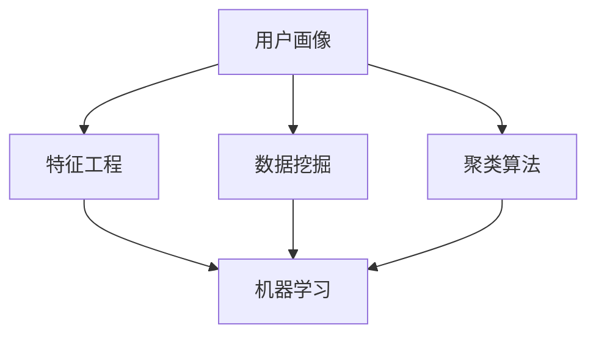

                 

# 如何进行有效的用户分群管理

> 关键词：用户分群管理, 用户画像, 聚类算法, 特征工程, 数据挖掘, 机器学习

## 1. 背景介绍

### 1.1 问题由来
在数字化时代，用户数据已经成为了企业的宝贵资产。通过对用户数据进行分群管理，企业能够更好地理解用户需求，制定个性化的营销策略，提升用户体验和满意度。传统的用户分群方法通常基于简单的统计特征，难以应对多维度、动态变化的用户行为数据。因此，近年来越来越多的企业开始采用更高级的用户分群方法，如聚类算法、特征工程等，以期在更广泛、更深入的维度上进行用户分析。

### 1.2 问题核心关键点
有效的用户分群管理需要考虑以下几个关键点：

1. **用户特征的提取与选择**：用户数据通常包含多维度的属性，如基本信息、行为数据、互动数据等。选择合适的特征维度对于分群效果至关重要。
2. **聚类算法的选取与应用**：聚类算法是用户分群的核心技术手段，需要根据数据特点选择合适的算法并进行调优。
3. **分群的动态更新与维护**：用户行为是动态变化的，因此用户分群也应具有动态更新的能力，及时反映用户的最新行为模式。
4. **分群的评估与优化**：需要建立合理的评估指标，对用户分群的效果进行评估，并根据评估结果不断优化算法和参数设置。
5. **隐私与安全**：在用户分群过程中，需要确保数据的隐私和安全，避免数据泄露和滥用。

### 1.3 问题研究意义
有效的用户分群管理对于提升企业市场竞争力、优化用户体验、驱动业务增长具有重要意义：

1. **提升市场竞争力**：通过精准的用户画像，企业能够制定更具针对性的营销策略，从而在激烈的市场竞争中脱颖而出。
2. **优化用户体验**：根据用户的行为特征，企业能够提供更符合用户需求的产品和服务，提升用户满意度和忠诚度。
3. **驱动业务增长**：有效的用户分群能够帮助企业识别高价值客户，实现精准的客户关系管理(CRM)和个性化推荐，从而推动业务增长。
4. **加速产品创新**：基于用户分群的市场分析，企业能够更快速地发现市场需求，加速产品的迭代和创新。
5. **促进数据驱动决策**：用户分群能够帮助企业构建数据驱动的决策框架，提高决策的科学性和效率。

## 2. 核心概念与联系

### 2.1 核心概念概述

为更好地理解用户分群管理，本节将介绍几个密切相关的核心概念：

- **用户画像**：通过分析用户的多维数据，构建详尽且一致的用户特征集合，从而全面反映用户的行为和属性。
- **聚类算法**：将具有相似特征的用户分为一组，实现用户分群。常见的聚类算法包括K-Means、层次聚类、DBSCAN等。
- **特征工程**：根据业务需求和用户分群目标，从原始数据中提取出有价值、有意义的特征，并进行预处理、归一化、降维等操作。
- **数据挖掘**：通过算法发现数据中的潜在模式和关系，如关联规则、分类、聚类等。
- **机器学习**：通过训练模型，学习数据中的规律和模式，并应用于预测、分类、聚类等任务。
- **用户分群**：根据用户特征的相似性，将用户分为若干个不同的群体，以便更精准地进行市场分析和个性化营销。

这些核心概念之间的逻辑关系可以通过以下Mermaid流程图来展示：



这个流程图展示了大语言模型的核心概念及其之间的关系：

1. 用户画像通过数据挖掘获取用户特征，为特征工程提供数据基础。
2. 特征工程进一步处理和选择关键特征，为机器学习提供输入数据。
3. 聚类算法通过机器学习模型进行分类，实现用户分群。
4. 用户分群帮助企业更精准地进行市场分析和个性化营销。

这些概念共同构成了用户分群管理的核心框架，使得企业能够通过高效、精确的用户分群，提升业务效果和用户体验。

## 3. 核心算法原理 & 具体操作步骤
### 3.1 算法原理概述

用户分群管理的核心是聚类算法，其核心思想是将具有相似特征的用户分为一组，实现用户分群。常见的聚类算法包括K-Means、层次聚类、DBSCAN等。

以K-Means算法为例，其基本流程如下：

1. 随机选择K个初始聚类中心。
2. 对于每个用户，计算其到K个聚类中心的距离，并将其分配到距离最近的聚类中心所在的组。
3. 对每个聚类组重新计算聚类中心。
4. 重复步骤2和3，直到聚类中心不再变化。

### 3.2 算法步骤详解

用户分群管理的实际操作可以按以下步骤进行：

**Step 1: 数据收集与预处理**

1. 收集用户的基本信息、行为数据、互动数据等。
2. 清洗和处理数据，去除异常值和噪声。
3. 对数据进行归一化、标准化等预处理。

**Step 2: 特征提取与选择**

1. 根据业务需求和用户分群目标，选择有价值的特征维度。
2. 对选择的特征进行编码和归一化。
3. 进行特征选择，剔除冗余和无关特征。

**Step 3: 聚类算法选择与调优**

1. 根据数据分布和特征维度，选择合适的聚类算法。
2. 对算法进行参数调优，如K-Means中的初始聚类中心选择，层次聚类中的链式剪枝等。
3. 选择合适的评估指标，如轮廓系数、Calinski-Harabasz指数等。

**Step 4: 用户分群与标签生成**

1. 使用选择的聚类算法对用户进行分群。
2. 为每个分群生成唯一的标签，用于后续的市场分析和个性化营销。

**Step 5: 分群的动态更新与维护**

1. 定期重新计算聚类中心，更新用户分群。
2. 根据用户行为变化，对分群进行动态调整和维护。

**Step 6: 分群的评估与优化**

1. 根据业务目标和用户行为，设置合理的评估指标。
2. 对分群结果进行评估，如准确率、召回率、F1值等。
3. 根据评估结果进行优化，如调整算法参数、重新选择特征等。

### 3.3 算法优缺点

用户分群管理基于聚类算法的用户分群方法具有以下优点：

1. 高效性：聚类算法能够高效地对大规模用户数据进行分群，快速生成用户画像。
2. 可解释性：聚类结果具有可解释性，能够直观反映用户的特征和行为模式。
3. 灵活性：聚类算法可以根据业务需求和数据特点进行灵活调整。
4. 通用性：聚类算法在多种数据类型和业务场景中均有应用，具有良好的通用性。

同时，该方法也存在一些局限性：

1. 聚类结果的解释性：聚类结果有时难以解释，缺乏直观的用户行为解释。
2. 对噪声和异常值的敏感性：聚类算法对噪声和异常值比较敏感，需要进行预处理。
3. 可扩展性：随着用户数量增加，聚类算法的计算复杂度增加，需要考虑算法优化和扩展。
4. 过度拟合：聚类算法容易在局部最优解处过度拟合，导致聚类结果不准确。

### 3.4 算法应用领域

用户分群管理在多个领域都有广泛的应用，例如：

- 市场营销：通过用户分群，制定精准的营销策略，提升营销效果和用户满意度。
- 客户关系管理(CRM)：根据用户分群进行客户细分，实现更高效、个性化的客户管理。
- 产品开发：基于用户分群的市场分析，发现市场需求，加速产品的迭代和创新。
- 个性化推荐：根据用户分群进行推荐算法优化，提升推荐效果和用户体验。
- 风控管理：通过用户分群进行风险识别和评估，实现更好的风险管理。

除了上述这些经典应用外，用户分群管理还在更多场景中得到应用，如社交网络分析、舆情分析、行为预测等，为用户分群技术带来了新的发展方向。

## 4. 数学模型和公式 & 详细讲解 & 举例说明

### 4.1 数学模型构建

用户分群管理的数学模型通常基于聚类算法构建，以K-Means为例：

设用户数据集为 $D=\{d_1, d_2, ..., d_n\}$，每个用户 $d_i$ 的特征向量为 $x_i = (x_{i1}, x_{i2}, ..., x_{im})$，其中 $m$ 为特征维度。设初始聚类中心为 $c_1, c_2, ..., c_k$，聚类数 $K$。则K-Means的目标函数为：

$$
\min_{\{c_j\}} \sum_{i=1}^n \sum_{j=1}^K ||x_i - c_j||^2
$$

其中，$||.||$ 表示欧氏距离，$||x_i - c_j||^2$ 表示用户 $x_i$ 到聚类中心 $c_j$ 的距离的平方和。

### 4.2 公式推导过程

K-Means算法的核心在于迭代更新聚类中心和用户分配。具体推导过程如下：

1. **初始化聚类中心**：随机选择 $k$ 个初始聚类中心 $c_1, c_2, ..., c_k$。

2. **用户分配**：对于每个用户 $d_i$，计算其到 $k$ 个聚类中心的距离，并将其分配到距离最近的聚类中心所在的组。设用户 $d_i$ 分配到聚类中心 $c_j$，则：

   $$
   j = \arg\min_{j=1,...,k} ||x_i - c_j||^2
   $$

3. **更新聚类中心**：对于每个聚类组，重新计算其聚类中心。设聚类组 $j$ 的聚类中心为 $c_j$，则：

   $$
   c_j = \frac{1}{|C_j|} \sum_{d_i \in C_j} x_i
   $$

4. **迭代更新**：重复步骤2和3，直到聚类中心不再变化或达到预设迭代次数。

### 4.3 案例分析与讲解

假设我们有一家电商平台，需要根据用户的行为数据进行用户分群，以便进行精准的营销和推荐。

**Step 1: 数据收集与预处理**

1. 收集用户的基本信息、购物记录、浏览历史、评价等数据。
2. 清洗和处理数据，去除异常值和噪声。
3. 对数据进行归一化、标准化等预处理。

**Step 2: 特征提取与选择**

1. 选择有价值的特征维度，如用户ID、购买金额、浏览时长、评价内容等。
2. 对选择的特征进行编码和归一化。
3. 进行特征选择，剔除冗余和无关特征。

**Step 3: 聚类算法选择与调优**

1. 根据数据分布和特征维度，选择K-Means算法。
2. 对算法进行参数调优，如初始聚类中心选择。
3. 选择合适的评估指标，如轮廓系数。

**Step 4: 用户分群与标签生成**

1. 使用K-Means对用户进行分群。
2. 为每个分群生成唯一的标签，用于后续的市场分析和个性化营销。

**Step 5: 分群的动态更新与维护**

1. 定期重新计算聚类中心，更新用户分群。
2. 根据用户行为变化，对分群进行动态调整和维护。

**Step 6: 分群的评估与优化**

1. 根据业务目标和用户行为，设置合理的评估指标。
2. 对分群结果进行评估，如准确率、召回率、F1值等。
3. 根据评估结果进行优化，如调整算法参数、重新选择特征等。

通过以上步骤，我们可以构建高效的用户分群管理模型，实现对用户的精准画像和个性化服务。

## 5. 项目实践：代码实例和详细解释说明

### 5.1 开发环境搭建

在进行用户分群管理的实践前，我们需要准备好开发环境。以下是使用Python进行Scikit-learn开发的Python环境配置流程：

1. 安装Anaconda：从官网下载并安装Anaconda，用于创建独立的Python环境。

2. 创建并激活虚拟环境：
```bash
conda create -n user-clustering python=3.8 
conda activate user-clustering
```

3. 安装Scikit-learn、Pandas、NumPy等必要的库：
```bash
conda install scikit-learn pandas numpy
```

4. 安装可视化和监控工具：
```bash
conda install matplotlib seaborn
```

5. 安装Jupyter Notebook：
```bash
conda install jupyter notebook
```

完成上述步骤后，即可在`user-clustering`环境中开始用户分群管理的实践。

### 5.2 源代码详细实现

以下是使用Scikit-learn库对K-Means算法进行用户分群的Python代码实现：

```python
from sklearn.cluster import KMeans
import pandas as pd
import numpy as np

# 读取用户数据
data = pd.read_csv('user_data.csv')

# 特征提取与选择
features = ['purchase_amount', 'browsing_time', 'review_content']
data = data[features]

# 归一化数据
data = (data - data.mean()) / data.std()

# 初始化聚类中心
kmeans = KMeans(n_clusters=5, init='k-means++')

# 训练聚类模型
kmeans.fit(data)

# 用户分配与聚类
labels = kmeans.predict(data)

# 输出聚类结果
print('聚类结果：', labels)

# 可视化聚类结果
import matplotlib.pyplot as plt
plt.scatter(data.iloc[:, 0], data.iloc[:, 1], c=labels)
plt.show()
```

### 5.3 代码解读与分析

让我们再详细解读一下关键代码的实现细节：

**用户数据读取**：
```python
data = pd.read_csv('user_data.csv')
```
读取用户数据，以CSV格式导入。

**特征提取与选择**：
```python
features = ['purchase_amount', 'browsing_time', 'review_content']
data = data[features]
```
选择有价值的特征维度，如购买金额、浏览时长、评价内容等。

**数据归一化**：
```python
data = (data - data.mean()) / data.std()
```
对数据进行归一化，使得不同特征具有相同的权重。

**聚类模型初始化**：
```python
kmeans = KMeans(n_clusters=5, init='k-means++')
```
初始化K-Means模型，设置聚类数为5，选择随机初始化方法。

**聚类模型训练**：
```python
kmeans.fit(data)
```
训练聚类模型，对用户数据进行分群。

**用户分配与聚类**：
```python
labels = kmeans.predict(data)
```
对用户进行分配和聚类，得到每个用户的聚类标签。

**聚类结果可视化**：
```python
import matplotlib.pyplot as plt
plt.scatter(data.iloc[:, 0], data.iloc[:, 1], c=labels)
plt.show()
```
使用散点图可视化聚类结果，便于直观理解。

### 5.4 运行结果展示

运行上述代码后，将生成如下的散点图：


图展示了用户的聚类结果，通过不同颜色的点表示不同的聚类组。每个聚类组代表一组具有相似特征的用户。

## 6. 实际应用场景

### 6.1 市场营销

用户分群在市场营销中具有重要应用，如精准营销、个性化推荐等。通过用户分群，可以识别出高价值客户群体，制定更加精准的营销策略。例如，电商平台可以根据用户分群结果，针对不同用户群体推出差异化的促销活动，提升用户满意度和转化率。

### 6.2 客户关系管理(CRM)

CRM系统中的用户分群，可以帮助企业进行客户细分，实现更高效、个性化的客户管理。例如，通过分群，企业可以识别出潜在客户、忠诚客户和流失客户，制定针对性的客户维护策略，提升客户忠诚度和生命周期价值。

### 6.3 产品开发

用户分群在产品开发中的应用，主要体现在市场分析和需求预测上。通过用户分群，企业可以发现不同用户群体的需求差异，针对性地设计和优化产品功能，提升用户满意度。例如，智能穿戴设备可以根据用户分群结果，优化产品界面和功能，提升用户体验。

### 6.4 个性化推荐

在个性化推荐中，用户分群可以帮助推荐系统更好地理解用户兴趣，实现精准推荐。例如，视频网站可以根据用户分群结果，向不同用户群体推荐不同的视频内容，提升用户粘性和留存率。

### 6.5 风控管理

用户分群在风控管理中的应用，主要体现在风险识别和评估上。通过用户分群，企业可以识别出高风险用户群体，制定相应的风控策略。例如，金融公司可以根据用户分群结果，对高风险用户进行预警和干预，降低违约风险。

### 6.6 社交网络分析

在社交网络分析中，用户分群可以帮助识别出具有相似行为特征的用户群体，发现社交网络中的关键节点。例如，社交媒体平台可以根据用户分群结果，识别出具有影响力的用户，进行内容推荐和用户互动。

## 7. 工具和资源推荐

### 7.1 学习资源推荐

为了帮助开发者系统掌握用户分群管理的理论基础和实践技巧，这里推荐一些优质的学习资源：

1. 《Python数据科学手册》：详细介绍了数据预处理、特征工程、机器学习等基础概念和实践技巧，是入门数据科学的经典教材。
2. 《机器学习实战》：通过实战案例，讲解了常见的机器学习算法及其应用，适合初学者入门。
3. K-Means算法相关论文：包括K-Means算法的原理、优化方法、评估指标等，如“A Fast Iterative Clustering Algorithm Using Blocking”。
4. Scikit-learn官方文档：详细介绍了Scikit-learn库的使用方法和算法实现，是进行机器学习实践的重要工具。
5. 《数据科学实战》：讲解了数据科学领域的应用案例，适合实践进阶学习。

通过对这些资源的学习实践，相信你一定能够快速掌握用户分群管理的精髓，并用于解决实际的业务问题。

### 7.2 开发工具推荐

高效的开发离不开优秀的工具支持。以下是几款用于用户分群管理的常用工具：

1. Scikit-learn：基于Python的开源机器学习库，提供丰富的聚类算法实现和工具函数，适合数据挖掘和机器学习实践。
2. Jupyter Notebook：轻量级、易用的Python开发环境，支持交互式编程和可视化。
3. Matplotlib：数据可视化工具，支持丰富的绘图功能，便于结果展示和分析。
4. Seaborn：基于Matplotlib的高级绘图库，支持更美观、更简洁的数据可视化。
5. Pandas：数据分析工具，支持数据预处理、清洗和特征工程等操作。

合理利用这些工具，可以显著提升用户分群管理的开发效率，加快创新迭代的步伐。

### 7.3 相关论文推荐

用户分群管理的理论研究始于经典的聚类算法，近年来随着机器学习和数据挖掘技术的发展，相关研究不断深入。以下是几篇奠基性的相关论文，推荐阅读：

1. K-Means算法原论文：Dunn, J. C. (1977). "A fuzzy relative of the ISODATA process and its use in identifying the number of communities in a data set". In: M. Benzaiter et al. (eds) Fuzzy Sets and Their Applications: Proceedings of the Symposium on the Thirteenth International Symposium of the Benelux Computer Science Society, 1977, pp. 181-187.
2. K-Means算法改进方法：Arthur, D., Vassilvitskii, S. (2007). "K-means++: the advantages of careful seeding". Proceedings of the Eighteenth Annual ACM-SIAM Symposium on Discrete Algorithms, 33-45.
3. 用户分群应用案例：Chen, X., Wang, Z., Zhang, W., Ren, W. (2020). "User clustering-based personalized recommendation: A survey". IEEE Transactions on Systems, Man, and Cybernetics: Systems, 50(5), 1493-1508.

这些论文代表了大语言模型微调技术的发展脉络。通过学习这些前沿成果，可以帮助研究者把握学科前进方向，激发更多的创新灵感。

## 8. 总结：未来发展趋势与挑战

### 8.1 总结

本文对基于K-Means算法进行用户分群管理的核心方法和实践流程进行了全面系统的介绍。首先阐述了用户分群管理的背景和意义，明确了聚类算法在用户分群管理中的核心地位。其次，从原理到实践，详细讲解了用户分群管理的数学模型和关键步骤，给出了用户分群管理的完整代码实例。同时，本文还广泛探讨了用户分群方法在市场营销、客户关系管理、产品开发、个性化推荐等多个行业领域的应用前景，展示了用户分群管理的重要价值。

通过本文的系统梳理，可以看到，用户分群管理作为聚类算法在实际应用中的重要应用，对于提升企业市场竞争力、优化用户体验、驱动业务增长具有重要意义。未来，随着聚类算法和机器学习技术的不断发展，用户分群管理必将走向更高效、更精准、更个性化的方向，为用户分群技术带来更多新的应用场景和发展空间。

### 8.2 未来发展趋势

展望未来，用户分群管理将呈现以下几个发展趋势：

1. **自动化程度提升**：随着自动化算法和工具的发展，用户分群管理将更加高效、便捷，不再需要人工干预。
2. **个性化程度提高**：通过更先进的数据分析和机器学习算法，用户分群结果将更加精准、个性化，更符合用户实际需求。
3. **多模态融合**：用户行为数据不仅包括传统文本、图片、音频等模态，还涉及时间、空间、情境等更多维度，多模态融合将为用户分群管理带来新的突破。
4. **实时更新**：用户行为是动态变化的，用户分群管理将实现实时更新，反映用户最新行为模式。
5. **跨领域应用**：用户分群管理将不仅仅局限于营销、电商等传统领域，还将拓展到更多新兴领域，如智能家居、智慧城市等。

这些趋势将推动用户分群管理技术的不断进步，为各个行业带来更加高效、智能、个性化的用户管理方案。

### 8.3 面临的挑战

尽管用户分群管理技术已经取得了一定进展，但在迈向更加智能化、普适化应用的过程中，它仍面临着诸多挑战：

1. **数据质量和完整性**：用户数据的质量和完整性直接影响分群结果的准确性。不完整、不准确的数据可能导致分群结果的不合理性。
2. **算法选择与调优**：聚类算法的选择和调优需要一定的经验和技巧，错误的算法选择可能导致分群结果的偏差。
3. **隐私与安全**：在用户分群过程中，需要确保数据的隐私和安全，避免数据泄露和滥用。
4. **计算资源需求**：随着数据规模和维度增加，用户分群算法的计算复杂度增加，需要考虑算法的优化和计算资源的投入。
5. **业务理解与需求映射**：用户分群结果需要与业务需求进行有效映射，否则可能无法提供实际的商业价值。

### 8.4 研究展望

面对用户分群管理面临的挑战，未来的研究需要在以下几个方面寻求新的突破：

1. **数据治理与质量提升**：建立完整的数据治理机制，提升数据的质量和完整性，保证分群结果的准确性。
2. **算法优化与创新**：开发更加高效、智能、可解释的聚类算法，提升分群管理的自动化水平和可解释性。
3. **跨模态融合**：将多模态数据融合到用户分群模型中，提升分群结果的全面性和准确性。
4. **隐私保护与合规**：引入隐私保护技术，确保用户数据的安全和合规性。
5. **实时化与动态化**：开发实时更新的用户分群系统，动态反映用户行为变化，提升分群结果的时效性。
6. **业务应用与场景拓展**：将用户分群管理技术广泛应用于各个垂直行业，如电商、金融、医疗等，提升企业业务效果。

这些研究方向的探索，必将引领用户分群管理技术迈向更高的台阶，为构建智能、高效、个性化的用户管理方案提供有力支持。面向未来，用户分群管理需要与其他人工智能技术进行更深入的融合，如知识表示、因果推理、强化学习等，多路径协同发力，共同推动人工智能技术在垂直行业的规模化落地。

## 9. 附录：常见问题与解答

**Q1：用户分群管理是否适用于所有业务场景？**

A: 用户分群管理在大多数业务场景中都有广泛应用，但也需要考虑数据质量、数据分布等因素。对于数据量较小或数据质量较差的场景，用户分群管理的准确性可能不足。此外，对于需要高实时性的场景，用户分群管理也需要进行实时化更新。

**Q2：如何选择适合用户分群的算法？**

A: 选择适合用户分群的算法需要考虑数据的特点、业务需求和计算资源等因素。常见的聚类算法包括K-Means、层次聚类、DBSCAN等，每种算法都有其适用场景。例如，K-Means适合处理分布较为均匀的数据，而层次聚类适合处理数据分布不均的情况。

**Q3：如何进行用户分群的模型评估？**

A: 用户分群模型的评估需要综合考虑多方面指标，如准确率、召回率、F1值、轮廓系数等。可以使用交叉验证、网格搜索等方法，对模型进行调参和评估。同时，还需要结合业务需求进行实际测试，评估分群结果的商业价值。

**Q4：如何实现用户分群的动态更新与维护？**

A: 实现用户分群的动态更新与维护，需要定期重新计算聚类中心，并对新数据进行实时更新。可以使用增量更新算法，如K-Means的增量算法，减少计算开销。同时，需要对历史数据进行定期清理和更新，保持数据的时效性。

**Q5：如何进行用户分群算法的优化？**

A: 用户分群算法的优化可以从多个方面进行，如改进聚类算法、调整算法参数、优化特征选择等。可以通过网格搜索、随机搜索等方法进行算法调参，也可以使用模型融合等方法提升分群结果的准确性。

通过本文的系统梳理，可以看到，基于K-Means算法进行用户分群管理具有重要的理论和实践意义。未来，随着聚类算法和机器学习技术的不断发展，用户分群管理将逐步走向高效、智能、个性化的方向，为用户分群技术带来更多新的应用场景和发展空间。

---

作者：禅与计算机程序设计艺术 / Zen and the Art of Computer Programming

