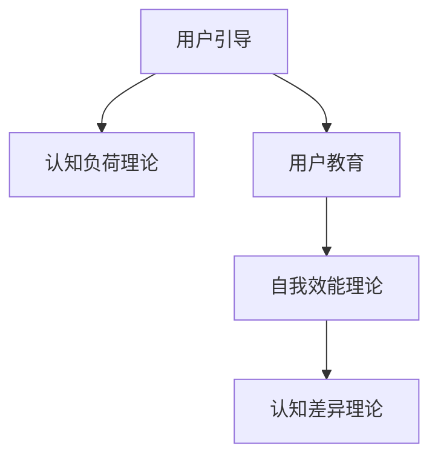

                 

# 如何进行有效的用户引导和教育

## 1. 背景介绍

### 1.1 问题由来
随着科技的发展和互联网的普及，人们接触和使用新技术的频率越来越高。然而，这些技术往往复杂且多样，用户在初次使用时难免感到困惑和无从下手。因此，有效的用户引导和教育成为了提高用户满意度和技术接受度的重要手段。

### 1.2 问题核心关键点
有效的用户引导和教育需要结合心理学、教育学和计算机科学的原理，通过一系列精心设计的步骤和策略，帮助用户快速理解和使用新技术。

1. **认知负荷理论**：了解用户的认知负荷极限，通过简化信息结构和任务复杂度，减轻用户的认知负担。
2. **自我效能理论**：提升用户对自己能力的信心，通过逐步提高任务难度，增强用户的成就感。
3. **认知差异理论**：根据不同用户的需求和能力水平，定制化设计引导和教育方案，提高用户的学习效率和满意度。

## 2. 核心概念与联系

### 2.1 核心概念概述

- **用户引导(User Guidance)**：通过交互式演示、指导文档等方式，帮助用户理解新技术的功能和使用方法。
- **用户教育(User Education)**：通过课程、工作坊、培训等方式，系统化地向用户传授新技术的原理和最佳实践。
- **认知负荷理论(Cognitive Load Theory)**：解释用户如何处理信息，指导设计界面和内容时应遵循的原则。
- **自我效能理论(Self-efficacy Theory)**：描述用户对自身能力的感知，影响用户学习动机和行为。
- **认知差异理论(Cognitive Differences Theory)**：阐述不同用户间的认知差异，指导设计差异化的引导和教育方案。

这些概念之间的关系可以通过以下Mermaid流程图来展示：



## 3. 核心算法原理 & 具体操作步骤

### 3.1 算法原理概述

有效的用户引导和教育方法通常基于心理学和教育学的理论，结合具体的技术实现。通过以下步骤，可以构建一个完整的用户引导和教育框架：

1. **需求分析**：收集用户反馈和行为数据，了解用户的认知负荷、学习动机和能力差异。
2. **内容设计**：根据需求分析结果，设计用户友好的内容和信息结构。
3. **交互设计**：设计直观的操作界面和交互流程，减轻用户认知负担。
4. **评估与优化**：通过用户反馈和测试数据，不断优化引导和教育方案，提升用户体验。

### 3.2 算法步骤详解

#### 3.2.1 需求分析
需求分析阶段需要收集用户反馈和行为数据，了解用户的需求和认知负荷。常见的方法包括：

- **问卷调查**：设计问卷，收集用户对新技术的认知负荷、自我效能感和兴趣点。
- **行为分析**：使用热图、点击流等工具，分析用户在产品中的行为，识别用户的学习路径和困惑点。
- **A/B测试**：对不同设计方案进行对比测试，评估用户对不同界面的接受度和使用效果。

#### 3.2.2 内容设计
内容设计阶段需要根据用户需求和认知负荷，设计简洁、易懂的引导和教育内容。常见的设计原则包括：

- **简化信息结构**：通过清晰的层级结构和逻辑关系，帮助用户快速理解复杂内容。
- **使用图示化元素**：通过图表、动画等视觉元素，减轻用户的认知负担。
- **分阶段教学**：根据用户的学习进度，逐步提高任务难度，增强用户成就感。

#### 3.2.3 交互设计
交互设计阶段需要设计直观的操作界面和交互流程，使用户能够轻松完成操作。常见的设计原则包括：

- **一致性**：确保用户界面和交互流程的一致性，减少用户的学习成本。
- **反馈机制**：在用户操作后及时提供反馈，帮助用户确认操作结果。
- **可访问性**：设计易用的界面和交互流程，考虑不同用户的需求和能力水平。

#### 3.2.4 评估与优化
评估与优化阶段需要收集用户反馈和测试数据，不断优化引导和教育方案。常见的方法包括：

- **用户测试**：通过用户测试，收集用户对引导和教育内容的反馈，识别改进点。
- **数据驱动优化**：根据用户行为数据，优化内容和界面设计，提升用户满意度。
- **持续改进**：建立持续改进机制，定期收集用户反馈，不断优化引导和教育方案。

### 3.3 算法优缺点

#### 3.3.1 优点
- **提升用户满意度**：通过有效的引导和教育，用户能够更快速、更轻松地理解和使用新技术，提高用户满意度。
- **减少支持成本**：良好的引导和教育机制可以减少用户遇到问题后的求助频率，降低技术支持成本。
- **增加用户粘性**：通过提高用户体验，增加用户对产品的使用频率和粘性。

#### 3.3.2 缺点
- **设计成本高**：设计有效的引导和教育方案需要大量时间和资源，开发成本较高。
- **用户差异大**：不同用户间的认知差异较大，难以制定统一的引导和教育方案。
- **技术更新快**：新技术不断涌现，需要不断更新引导和教育内容，保持其时效性。

### 3.4 算法应用领域

基于认知负荷理论、自我效能理论和认知差异理论，有效的用户引导和教育方法可以应用于以下领域：

- **软件产品**：通过引导和教育，帮助用户快速上手新软件，提高产品使用率。
- **在线课程**：通过分阶段教学和个性化推荐，提升在线课程的学习效果。
- **企业培训**：通过系统化培训和测试，提高员工的技能水平和业务能力。
- **智能设备**：通过简洁的引导和教育，帮助用户快速掌握智能设备的使用方法。

## 4. 数学模型和公式 & 详细讲解

### 4.1 数学模型构建

用户引导和教育模型的核心在于理解和优化用户的认知负荷和自我效能感。我们可以使用以下数学模型来描述用户的认知负荷和自我效能感：

- **认知负荷模型(Cognitive Load Model)**：
$$
\text{CL} = \text{CL}_1 + \text{CL}_2 + \text{CL}_3
$$
其中，$\text{CL}_1$ 表示心理负荷，$\text{CL}_2$ 表示交互负荷，$\text{CL}_3$ 表示信息负荷。

- **自我效能模型(Self-efficacy Model)**：
$$
\text{SE} = \alpha \times \text{Performance} + \beta \times \text{Feedback} + \gamma \times \text{Effort}
$$
其中，$\alpha$、$\beta$、$\gamma$ 为模型参数，分别表示自我效能感对表现、反馈和努力的权重。

### 4.2 公式推导过程

对于认知负荷模型，我们可以使用以下公式计算用户的认知负荷：

$$
\text{CL}_1 = \sum_{i=1}^n w_i \times \text{CI}_i
$$
其中，$w_i$ 表示第 $i$ 个心理负荷项的权重，$\text{CI}_i$ 表示第 $i$ 个心理负荷项的值。

对于自我效能模型，我们可以使用以下公式计算用户的自我效能感：

$$
\text{SE} = \alpha \times \text{Performance} + \beta \times \text{Feedback} + \gamma \times \text{Effort}
$$
其中，$\alpha$、$\beta$、$\gamma$ 为模型参数，可以通过用户反馈和行为数据进行训练。

### 4.3 案例分析与讲解

假设我们要设计一个在线编程课程的用户引导和教育方案。根据认知负荷模型，我们可以将课程内容分解为若干模块，每个模块包含多个子任务。对于每个子任务，我们可以设计对应的心理负荷项，如任务难度、信息量和交互复杂度。然后，根据权重 $w_i$，计算用户的心理负荷值。

对于自我效能模型，我们可以收集用户的学习进度、成绩和反馈，使用回归分析方法，训练模型参数 $\alpha$、$\beta$、$\gamma$。通过不断优化这些参数，我们可以逐步提高用户对编程的自我效能感。

## 5. 项目实践：代码实例和详细解释说明

### 5.1 开发环境搭建

在进行用户引导和教育方案开发前，我们需要准备好开发环境。以下是使用Python进行Django开发的环境配置流程：

1. 安装Anaconda：从官网下载并安装Anaconda，用于创建独立的Python环境。

2. 创建并激活虚拟环境：
```bash
conda create -n django-env python=3.8 
conda activate django-env
```

3. 安装Django和其他依赖：
```bash
pip install django
pip install pillow
pip install markdown
```

4. 安装开发工具：
```bash
pip install django-debug-toolbar
```

5. 设置Django项目：
```bash
django-admin startproject user_guide
cd user_guide
```

完成上述步骤后，即可在`django-env`环境中开始用户引导和教育方案的开发。

### 5.2 源代码详细实现

以下是一个简单的用户引导和教育方案的Django项目实现。

#### 5.2.1 创建用户引导和教育模型

首先，我们需要创建一个用户引导和教育模型，用于存储和处理用户的学习进度和自我效能感。

```python
from django.db import models
from django.contrib.auth.models import User

class GuideUser(models.Model):
    user = models.OneToOneField(User, on_delete=models.CASCADE)
    performance = models.FloatField(default=0.0)
    feedback = models.FloatField(default=0.0)
    effort = models.FloatField(default=0.0)
    self_efficacy = models.FloatField(default=0.0)
```

#### 5.2.2 创建引导和教育页面

接下来，我们需要创建引导和教育页面，展示用户的学习进度和自我效能感。

```python
from django.shortcuts import render
from .models import GuideUser

def guide_user(request):
    guide_user = GuideUser.objects.get(user=request.user)
    return render(request, 'guide_user.html', {'guide_user': guide_user})
```

#### 5.2.3 创建用户界面

最后，我们需要设计用户界面，展示引导和教育信息。

```html
<!-- guide_user.html -->



<h1>用户引导和教育</h1>
<p>您的学习进度：{{ guide_user.performance }}</p>
<p>您的自我效能感：{{ guide_user.self_efficacy }}</p>

```

### 5.3 代码解读与分析

让我们再详细解读一下关键代码的实现细节：

**GuideUser模型**：
- `__init__`方法：初始化用户引导和教育模型的各个属性。
- `performance`、`feedback`、`effort`、`self_efficacy`：分别表示用户的认知负荷、自我效能感和反馈。

**guide_user视图**：
- `guide_user`方法：根据用户ID获取用户引导和教育模型的实例，并将模型信息传递给模板。

**guide_user.html模板**：
- ``：继承自基模板。
- ``：定义模板的显示内容。
- `{{ guide_user.performance }}`、`{{ guide_user.self_efficacy }}`：显示用户的学习进度和自我效能感。

通过这个简单的Django项目，我们展示了如何利用Python和Django实现用户引导和教育方案的基本功能。开发者可以根据实际需求，进一步扩展和优化功能，如添加用户反馈收集、学习路径推荐、任务难度调整等。

## 6. 实际应用场景

### 6.1 智能家居设备

智能家居设备如智能音箱、智能灯泡等，通常需要用户进行配置和设置。通过有效的用户引导和教育，智能家居设备可以自动引导用户完成设备配对、功能激活等操作，大大降低用户使用门槛。

在实践中，可以通过以下步骤实现用户引导和教育：

1. 收集用户反馈和行为数据，了解用户的认知负荷和自我效能感。
2. 设计简洁的操作界面和交互流程，减轻用户的认知负担。
3. 提供分阶段的教程和示例，逐步引导用户完成设备配置。
4. 收集用户的使用反馈，不断优化引导和教育方案。

通过有效的用户引导和教育，智能家居设备可以大幅提高用户体验和设备使用率。

### 6.2 在线教育平台

在线教育平台如Coursera、edX等，面向全球用户提供各类在线课程。通过有效的用户引导和教育，在线教育平台可以提升课程的学习效果和用户满意度。

在实践中，可以通过以下步骤实现用户引导和教育：

1. 分析用户的学习路径和行为，了解用户的学习需求和认知负荷。
2. 设计分阶段的教学内容，逐步引导用户完成课程学习。
3. 提供个性化的学习推荐和辅导，提升用户的学习体验。
4. 收集用户的学习反馈，不断优化教学内容和教育方案。

通过有效的用户引导和教育，在线教育平台可以提升课程的学习效果和用户满意度，促进知识传播和教育公平。

### 6.3 企业培训系统

企业培训系统如培训平台、学习管理系统等，可以提升员工的技能水平和业务能力。通过有效的用户引导和教育，企业培训系统可以提升培训效果和员工满意度。

在实践中，可以通过以下步骤实现用户引导和教育：

1. 分析员工的培训需求和学习能力，了解员工的认知负荷和自我效能感。
2. 设计分阶段的培训内容和评估任务，逐步引导员工完成培训。
3. 提供个性化的学习资源和辅导，提升员工的学习体验。
4. 收集员工的培训反馈，不断优化培训内容和教育方案。

通过有效的用户引导和教育，企业培训系统可以提升培训效果和员工满意度，推动企业发展和技术进步。

## 7. 工具和资源推荐

### 7.1 学习资源推荐

为了帮助开发者系统掌握用户引导和教育的方法，这里推荐一些优质的学习资源：

1. 《用户中心设计：从原理到实践》：详细介绍了用户中心设计的理论和方法，适合开发者全面了解用户引导和教育的基本概念和设计原则。

2. 《用户体验设计：设计准则与实践》：介绍了用户体验设计的准则和方法，帮助开发者设计用户友好的界面和交互流程。

3. 《教育心理学：理论与实践》：介绍了教育心理学的理论和方法，帮助开发者设计有效的用户教育方案。

4. 《认知负荷理论：设计与实践》：详细介绍了认知负荷理论的设计方法和应用，帮助开发者设计简洁、易用的引导和教育内容。

5. 《自我效能理论：理论与应用》：介绍了自我效能理论的设计方法和应用，帮助开发者提升用户的自我效能感。

6. 《教育技术：设计与开发》：介绍了教育技术的设计和开发方法，帮助开发者实现用户引导和教育方案。

### 7.2 开发工具推荐

高效的开发离不开优秀的工具支持。以下是几款用于用户引导和教育开发的常用工具：

1. Django：基于Python的开源Web框架，提供强大的MVC框架和模板引擎，适合快速迭代研究。

2. React：基于JavaScript的组件化UI框架，支持动态渲染和组件复用，适合构建复杂的前端界面。

3. Vue：基于JavaScript的渐进式前端框架，支持双向数据绑定和组件化开发，适合构建高效、易用的用户界面。

4. Google Analytics：提供网站访问行为分析工具，帮助开发者收集用户行为数据，优化用户引导和教育方案。

5. Microsoft Power BI：提供数据可视化和报表工具，帮助开发者展示用户的学习进度和自我效能感。

6. Trello：提供任务管理工具，帮助开发者跟踪用户的学习进度和反馈，优化引导和教育方案。

合理利用这些工具，可以显著提升用户引导和教育任务的开发效率，加快创新迭代的步伐。

### 7.3 相关论文推荐

用户引导和教育技术的发展源于学界的持续研究。以下是几篇奠基性的相关论文，推荐阅读：

1. Sweller, J. (1988). Cognitive Load Theory: Its Relevance to Educational Psychology. Educational Psychology Review, 1(2), 111-119.

2. Zakaria, M. M., & Brewe, E. J. (2012). The Impact of Instructional Technology on Efficacy Beliefs and Performance. American Journal of Distance Education, 26(2), 8-18.

3. Kozma, T. (2008). Cognitive Load and Instructional Design: Implications for E-Learning. Learning and Instruction, 18(3), 165-180.

4. Bandura, A. (1997). Self-efficacy: The Exercise of Control. W.H. Freeman.

5. Mayer, R. E., & Clark, R. E. (2011). Computers as Scaffolds: Giving Students the Tools They Need for Success. Educational Psychologist, 46(1), 1-9.

这些论文代表了大语言模型微调技术的发展脉络。通过学习这些前沿成果，可以帮助研究者把握学科前进方向，激发更多的创新灵感。

## 8. 总结：未来发展趋势与挑战

### 8.1 总结

本文对用户引导和教育方法进行了全面系统的介绍。首先阐述了用户引导和教育的研究背景和意义，明确了用户引导和教育在提升用户体验和技术接受度方面的独特价值。其次，从原理到实践，详细讲解了用户引导和教育的设计方法和操作步骤，给出了用户引导和教育任务开发的完整代码实例。同时，本文还广泛探讨了用户引导和教育方法在智能家居设备、在线教育平台、企业培训系统等多个领域的应用前景，展示了用户引导和教育方法的巨大潜力。此外，本文精选了用户引导和教育技术的各类学习资源，力求为开发者提供全方位的技术指引。

通过本文的系统梳理，可以看到，用户引导和教育方法在构建人机交互和提升用户体验方面具有重要意义。这些方法的不断改进和应用，将进一步提升用户对新技术的接受度和满意度，推动人工智能技术在各个领域的普及和应用。

### 8.2 未来发展趋势

展望未来，用户引导和教育技术将呈现以下几个发展趋势：

1. **个性化引导**：通过收集用户行为数据和反馈，设计个性化的引导方案，提升用户的学习效果和满意度。
2. **动态调整**：根据用户的学习进度和反馈，动态调整引导内容和方法，提高用户的学习效率和效果。
3. **交互增强**：通过增强现实、虚拟现实等技术，提升用户引导和教育的界面和交互体验，增强用户的沉浸感和学习效果。
4. **多模态学习**：结合文本、图像、视频等多种信息形式，提升用户的学习效果和认知负荷管理。
5. **AI辅助**：利用人工智能技术，如自然语言处理、情感分析等，提供智能化的用户引导和教育，提升用户的学习体验和满意度。

这些趋势凸显了用户引导和教育技术的广阔前景。这些方向的探索发展，必将进一步提升用户对新技术的接受度和满意度，推动人工智能技术在各个领域的普及和应用。

### 8.3 面临的挑战

尽管用户引导和教育技术已经取得了瞩目成就，但在迈向更加智能化、普适化应用的过程中，它仍面临着诸多挑战：

1. **数据隐私**：在收集和分析用户行为数据时，需要严格保护用户隐私和数据安全。
2. **跨平台一致性**：不同平台和设备上的用户引导和教育方案需要保持一致，避免用户学习成本增加。
3. **多样性支持**：不同用户间的认知差异较大，需要设计多样化的引导和教育方案，满足不同用户的需求。
4. **技术更新**：新技术和新设备不断涌现，需要不断更新引导和教育方案，保持其时效性。
5. **用户依赖**：过度依赖用户引导和教育，可能导致用户主动学习能力下降，影响用户的自我发展。

这些挑战需要我们从数据隐私、用户体验、技术更新等多方面进行全面考虑和改进，才能更好地提升用户引导和教育的效果。

### 8.4 研究展望

面对用户引导和教育面临的种种挑战，未来的研究需要在以下几个方面寻求新的突破：

1. **数据驱动设计**：通过大规模数据分析，优化用户引导和教育方案，提升用户的学习效果和满意度。
2. **自适应学习**：利用自适应学习算法，根据用户的学习进度和反馈，动态调整引导内容和方法，提高用户的学习效率和效果。
3. **多模态融合**：结合文本、图像、视频等多种信息形式，提升用户的学习效果和认知负荷管理。
4. **AI辅助设计**：利用人工智能技术，如自然语言处理、情感分析等，提供智能化的用户引导和教育，提升用户的学习体验和满意度。
5. **跨平台一致性**：开发跨平台的用户引导和教育方案，提高用户的学习效果和满意度。

这些研究方向将进一步推动用户引导和教育技术的发展，提升用户的体验和满意度，推动人工智能技术在各个领域的普及和应用。

## 9. 附录：常见问题与解答

**Q1：用户引导和教育方法是否适用于所有用户？**

A: 用户引导和教育方法需要根据不同用户的需求和能力水平进行定制化设计，因此不一定适用于所有用户。对于低认知负荷和高自我效能感的高效用户，简单的引导和教育可能不够充分；对于认知负荷高和自我效能感低的用户，复杂和冗长的引导和教育可能反而降低其学习效果。

**Q2：用户引导和教育方法是否需要用户主动参与？**

A: 用户引导和教育方法需要用户主动参与才能取得最佳效果。用户的主动参与可以帮助其更好地理解和掌握新技术，提高其使用体验和满意度。

**Q3：用户引导和教育方法是否需要定期更新？**

A: 用户引导和教育方法需要根据用户的需求和行为数据进行定期更新和优化，以保持其时效性和有效性。用户的认知负荷和自我效能感随着时间推移而变化，因此需要定期收集和分析用户反馈，不断优化引导和教育方案。

**Q4：用户引导和教育方法是否需要跨平台一致性？**

A: 用户引导和教育方法需要设计跨平台一致的用户界面和交互流程，以避免用户在不同平台上的学习成本增加。跨平台一致性可以提高用户的学习效率和满意度，同时降低开发和维护成本。

**Q5：用户引导和教育方法是否需要考虑用户隐私？**

A: 用户引导和教育方法需要严格保护用户隐私和数据安全。在收集和分析用户行为数据时，应遵守相关法律法规和伦理规范，保护用户隐私和数据安全。

总之，用户引导和教育方法需要在设计、实施和优化过程中全面考虑用户的需求、行为和反馈，以实现最佳的用户体验和学习效果。通过不断的创新和改进，用户引导和教育方法必将在人工智能技术的普及和应用中发挥越来越重要的作用。

---

作者：禅与计算机程序设计艺术 / Zen and the Art of Computer Programming

