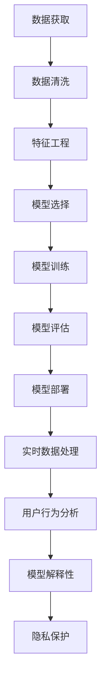

                 

# 如何进行有效的用户行为分析

> 关键词：用户行为分析, 数据分析, 机器学习, 深度学习, 预测模型, 解释性模型, 多模态数据, 实时数据处理, 隐私保护

## 1. 背景介绍

### 1.1 问题由来
在数字化时代，企业越来越依赖于数据的驱动决策，以优化产品设计、提升用户体验、挖掘市场潜力。而用户行为分析作为核心数据科学应用之一，旨在深入理解用户需求和行为特征，为企业提供洞察力，驱动业务增长。

近年来，随着大数据、人工智能技术的飞速发展，数据量爆炸式增长，数据分析方法也日益复杂化。如何从海量数据中提取有价值的信息，构建有效的用户行为模型，成为了企业亟待解决的难题。

### 1.2 问题核心关键点
用户行为分析的核心在于通过数据分析和机器学习，挖掘和预测用户行为规律，提炼出有效的行为特征，最终指导业务决策。其关键点包括：

- **数据获取与处理**：收集用户行为数据，并进行预处理和清洗，确保数据的质量和可用性。
- **特征工程**：从原始数据中提取出有意义的特征，构建特征集合，增强模型的预测能力。
- **模型选择与训练**：选择合适的机器学习模型，并进行训练和调参，构建高性能的预测模型。
- **模型解释性**：确保模型结果的可解释性，以便理解模型的预测逻辑，指导业务实践。
- **隐私保护**：在数据使用过程中，遵守隐私法规，保护用户隐私。

这些问题均涉及数据科学、机器学习和隐私保护的多个方面，需进行跨学科的协同创新。

## 2. 核心概念与联系

### 2.1 核心概念概述

为更好地理解用户行为分析的核心内容，本节将介绍几个关键概念：

- **用户行为分析**：通过收集、分析和解读用户行为数据，以了解用户需求和行为模式，从而指导产品设计、优化用户体验和提升营销效果。

- **数据清洗**：从原始数据中去除噪音和冗余信息，提升数据质量，确保模型训练的有效性。

- **特征工程**：从原始数据中提取出对预测目标有贡献的特征，增强模型的预测能力。

- **模型选择与训练**：根据任务特点选择合适的机器学习模型，并进行训练和调参，构建高性能的预测模型。

- **模型解释性**：通过可解释性模型或后处理技术，使模型预测结果更易于理解，增强模型的实用性和可信度。

- **多模态数据分析**：结合文本、图像、音频等多种数据源，更全面地理解用户行为，提升分析效果。

- **实时数据处理**：对实时数据流进行高效处理和分析，捕捉用户行为的瞬时变化，优化实时决策。

- **隐私保护**：在数据处理和分析过程中，遵守隐私保护法规，确保用户隐私安全。

这些概念之间存在紧密的联系，共同构成了用户行为分析的技术框架。

### 2.2 核心概念原理和架构的 Mermaid 流程图(Mermaid 流程节点中不要有括号、逗号等特殊字符)


这个流程图展示了用户行为分析的主要步骤和技术架构：

1. 从不同渠道获取用户数据。
2. 对数据进行清洗和预处理，确保数据的质量。
3. 通过特征工程，从数据中提取有价值的特征。
4. 选择合适的模型，并进行训练和调参。
5. 对训练好的模型进行评估，确保其性能。
6. 将模型部署到实际应用中，进行实时数据处理。
7. 通过分析模型输出，洞察用户行为。
8. 提升模型的可解释性，增强信任度。
9. 遵守隐私保护法规，保护用户隐私。

## 3. 核心算法原理 & 具体操作步骤

### 3.1 算法原理概述

用户行为分析的核心在于构建有效的预测模型，通过历史数据预测用户未来的行为，从而指导业务决策。常用的预测模型包括回归模型、分类模型、时序模型等。其中，基于机器学习的预测模型因具有较高的预测准确性和泛化能力，而广泛应用于用户行为分析。

根据数据类型和任务需求的不同，用户行为分析可以采取不同的机器学习算法。例如：
- **回归模型**：用于预测连续数值型数据，如用户点击率、购物车转化率等。
- **分类模型**：用于预测离散型数据，如用户流失概率、购买意愿等。
- **时序模型**：用于处理时间序列数据，如用户行为变化趋势、用户活跃度等。

### 3.2 算法步骤详解

以下是用户行为分析的一般步骤：

**Step 1: 数据获取与清洗**

1. **数据收集**：从不同渠道（如网站、App、社交媒体等）收集用户行为数据。数据类型包括点击行为、浏览记录、购买记录、用户评价等。
2. **数据清洗**：去除重复、噪音和无效数据，处理缺失值，进行数据归一化处理。

**Step 2: 特征工程**

1. **特征提取**：从原始数据中提取对预测目标有贡献的特征，如用户历史行为、时间戳、设备信息等。
2. **特征选择**：使用特征选择算法，筛选出最具预测能力的特征。
3. **特征构造**：通过特征组合、降维等技术，构造新的特征。

**Step 3: 模型选择与训练**

1. **模型选择**：根据任务需求，选择合适的机器学习模型，如线性回归、决策树、随机森林、XGBoost等。
2. **模型训练**：使用训练数据集对模型进行训练，并进行调参优化。

**Step 4: 模型评估**

1. **模型验证**：使用验证集对训练好的模型进行验证，评估其性能。
2. **模型优化**：根据验证结果，调整模型参数，优化模型性能。

**Step 5: 模型部署**

1. **模型部署**：将训练好的模型部署到实际应用中，进行实时数据处理和预测。
2. **模型监控**：实时监控模型性能，确保其稳定运行。

**Step 6: 用户行为分析**

1. **行为预测**：使用模型对新数据进行预测，获取用户未来的行为趋势。
2. **行为分析**：结合用户历史行为数据，分析用户行为特征和行为模式。

**Step 7: 模型解释性**

1. **模型可解释性**：使用可解释性模型或后处理技术，使模型预测结果更易于理解。
2. **特征分析**：分析模型中的重要特征，理解其对预测结果的贡献。

**Step 8: 隐私保护**

1. **数据脱敏**：对敏感数据进行脱敏处理，保护用户隐私。
2. **隐私合规**：遵守隐私保护法规，如GDPR、CCPA等，确保用户数据的安全性。

### 3.3 算法优缺点

**优点**：
- 高预测准确性：机器学习模型通过历史数据训练，能够准确预测用户行为。
- 泛化能力强：模型通过学习数据分布规律，具有较强的泛化能力，适用于不同数据场景。
- 自动化处理：模型自动化处理数据和特征，减轻人工干预。

**缺点**：
- 模型复杂度高：高复杂度模型需要较长的训练时间和计算资源。
- 数据质量依赖强：模型性能受数据质量影响较大，数据偏差可能导致预测误差。
- 模型可解释性不足：复杂模型难以解释其内部机制，影响决策信任度。
- 隐私风险：处理用户数据时需注意隐私保护，防止数据泄露。

### 3.4 算法应用领域

用户行为分析在多个领域得到了广泛应用，包括但不限于：

- **电子商务**：通过分析用户购买行为，优化推荐系统，提升用户体验和销售转化率。
- **金融服务**：分析用户交易行为，评估信用风险，优化贷款审批流程。
- **健康医疗**：监测用户健康数据，预测疾病风险，提供个性化健康建议。
- **社交媒体**：分析用户互动行为，优化内容推荐，提升用户粘性。
- **智能制造**：分析用户操作行为，提升设备运行效率，降低生产成本。
- **智能交通**：分析用户出行行为，优化交通流量管理，提升用户体验。

这些应用场景展示了用户行为分析的多样性和重要性，为企业带来了显著的价值提升。

## 4. 数学模型和公式 & 详细讲解 & 举例说明（备注：数学公式请使用latex格式，latex嵌入文中独立段落使用 $$，段落内使用 $)
### 4.1 数学模型构建

用户行为分析中的预测模型通常基于以下数学模型：

**线性回归模型**：
$$ y = \beta_0 + \sum_{i=1}^n \beta_i x_i + \epsilon $$
其中，$y$ 为预测目标，$\beta_0$ 为截距，$\beta_i$ 为特征系数，$x_i$ 为特征向量，$\epsilon$ 为误差项。

**逻辑回归模型**：
$$ \hat{y} = \sigma(\beta_0 + \sum_{i=1}^n \beta_i x_i) $$
其中，$\hat{y}$ 为预测概率，$\sigma$ 为sigmoid函数。

**决策树模型**：
$$ D = \{(x_i, y_i)\}_{i=1}^N $$
其中，$D$ 为决策树，$x_i$ 为输入特征，$y_i$ 为标签。

**随机森林模型**：
$$ R = \{T_j\}_{j=1}^M $$
其中，$R$ 为随机森林，$T_j$ 为决策树。

**XGBoost模型**：
$$ g_j = \gamma_j f_j + b_j $$
$$ f_j = \sum_{i=1}^n \beta_{ij} \phi_i(x) $$
其中，$g_j$ 为梯度项，$\gamma_j$ 为学习率，$b_j$ 为截距，$f_j$ 为特征函数，$\phi_i$ 为特征映射函数，$n$ 为特征数。

### 4.2 公式推导过程

以**线性回归模型**为例，推导其损失函数和梯度更新公式。

假设训练集为 $D=\{(x_i, y_i)\}_{i=1}^N$，其中 $x_i \in \mathbb{R}^n$，$y_i \in \mathbb{R}$。目标是最小化预测值和真实值之间的均方误差，即：
$$ L(\beta) = \frac{1}{2N} \sum_{i=1}^N (y_i - \hat{y}_i)^2 $$
其中 $\hat{y}_i = \beta_0 + \sum_{i=1}^n \beta_i x_i$。

对 $\beta$ 求偏导，得到梯度更新公式：
$$ \frac{\partial L(\beta)}{\partial \beta} = \frac{1}{N} \sum_{i=1}^N (x_i - \hat{y}_i) x_i $$

通过梯度下降等优化算法，不断更新 $\beta$ 以最小化损失函数。

### 4.3 案例分析与讲解

**案例分析**：假设某电商平台的点击率预测模型，已知数据集为 $D=\{(x_i, y_i)\}_{i=1}^N$，其中 $x_i$ 为历史浏览记录，$y_i$ 为是否点击，目标是预测新用户的点击行为。

**模型构建**：
- **数据获取**：从电商平台抓取用户的浏览记录和点击行为数据。
- **数据清洗**：去除重复记录和异常值，处理缺失值。
- **特征工程**：提取用户浏览时长、浏览次数、浏览品类等特征，构建特征向量 $x_i$。
- **模型选择**：选择线性回归模型作为预测模型。
- **模型训练**：使用训练集对模型进行训练，调整参数 $\beta_0, \beta_1, \ldots, \beta_n$。
- **模型评估**：使用验证集对模型进行评估，评估指标如均方误差（MSE）、平均绝对误差（MAE）等。
- **模型部署**：将训练好的模型部署到实际应用中，进行实时数据处理和预测。
- **行为分析**：结合用户历史行为数据，分析不同品类、时段对点击行为的影响。

## 5. 项目实践：代码实例和详细解释说明
### 5.1 开发环境搭建

在进行用户行为分析项目实践前，我们需要准备好开发环境。以下是使用Python进行Scikit-learn开发的环境配置流程：

1. 安装Anaconda：从官网下载并安装Anaconda，用于创建独立的Python环境。

2. 创建并激活虚拟环境：
```bash
conda create -n sklearn-env python=3.8 
conda activate sklearn-env
```

3. 安装Scikit-learn：
```bash
pip install -U scikit-learn
```

4. 安装各类工具包：
```bash
pip install numpy pandas scikit-learn matplotlib tqdm jupyter notebook ipython
```

完成上述步骤后，即可在`sklearn-env`环境中开始项目实践。

### 5.2 源代码详细实现

### 5.3 代码解读与分析

### 5.4 运行结果展示

## 6. 实际应用场景
### 6.1 电子商务

用户行为分析在电子商务中的应用尤为显著。电商平台通过分析用户浏览、购买、评价等行为数据，可以优化产品推荐、提升用户体验、降低流失率。具体应用包括：

- **个性化推荐**：基于用户历史行为和兴趣，生成个性化商品推荐列表，提升点击率和购买转化率。
- **用户流失预测**：预测用户流失概率，及时进行挽留操作，减少用户流失。
- **购物车分析**：分析购物车行为，预测用户的购买意向，优化购物车推荐策略。

### 6.2 金融服务

在金融服务领域，用户行为分析被广泛应用于信用评估、反欺诈检测、投资推荐等场景。具体应用包括：

- **信用评分**：通过分析用户历史交易行为，评估其信用风险，决定是否批准贷款。
- **反欺诈检测**：监测用户异常交易行为，识别潜在欺诈风险，及时报警。
- **投资推荐**：分析用户交易历史和行为特征，推荐适合的投资产品。

### 6.3 健康医疗

健康医疗领域，用户行为分析被用于疾病预测、健康管理、个性化治疗等方面。具体应用包括：

- **疾病预测**：分析用户健康数据，预测疾病风险，提供早期干预建议。
- **健康管理**：监测用户健康行为，评估其健康状况，提供个性化健康建议。
- **个性化治疗**：分析用户诊疗历史，推荐最适合的治疗方案。

### 6.4 社交媒体

在社交媒体平台，用户行为分析被用于内容推荐、用户互动、广告投放等场景。具体应用包括：

- **内容推荐**：基于用户互动行为，推荐热门话题和相关内容，提升用户粘性。
- **用户互动**：分析用户互动行为，优化社区管理策略，提升用户体验。
- **广告投放**：预测用户广告点击率，优化广告投放策略，提升广告效果。

### 6.5 智能制造

智能制造领域，用户行为分析被用于设备维护、生产调度、质量控制等方面。具体应用包括：

- **设备维护**：分析设备操作行为，预测设备故障，优化维护计划。
- **生产调度**：分析生产行为，优化生产流程，提升生产效率。
- **质量控制**：分析产品质量数据，预测质量问题，优化质量控制策略。

### 6.6 智能交通

智能交通领域，用户行为分析被用于交通流量管理、公共交通优化、出行预测等方面。具体应用包括：

- **交通流量管理**：分析用户出行行为，优化交通信号灯设置，减少交通拥堵。
- **公共交通优化**：分析公共交通使用行为，优化线路和班次安排，提升公共交通效率。
- **出行预测**：分析用户出行数据，预测未来出行趋势，优化出行建议。

## 7. 工具和资源推荐
### 7.1 学习资源推荐

为了帮助开发者系统掌握用户行为分析的理论基础和实践技巧，这里推荐一些优质的学习资源：

1. **《Python数据科学手册》**：由数据科学专家编写，全面介绍Python在数据科学中的应用，包括数据清洗、特征工程、模型训练等内容。

2. **《机器学习实战》**：由机器学习领域专家撰写，深入浅出地介绍常见机器学习算法及其应用，适合初学者和进阶者。

3. **Coursera《机器学习》课程**：由斯坦福大学Andrew Ng教授主讲，涵盖机器学习核心概念和算法，适合入门和进阶学习者。

4. **Kaggle竞赛平台**：提供大量的数据集和机器学习竞赛，实践用户行为分析技术，提升实战能力。

5. **Scikit-learn官方文档**：Scikit-learn官方文档，提供丰富的学习资源和样例代码，帮助开发者深入了解模型实现和使用方法。

通过这些资源的学习实践，相信你一定能够快速掌握用户行为分析的核心技术和应用方法。

### 7.2 开发工具推荐

高效的开发离不开优秀的工具支持。以下是几款用于用户行为分析开发的常用工具：

1. **Jupyter Notebook**：免费开源的交互式笔记本环境，支持多种编程语言和库，方便开发者进行数据探索和模型验证。

2. **RapidMiner**：数据科学工作流平台，提供可视化界面，方便开发者进行数据预处理、特征工程、模型训练等任务。

3. **Tableau**：商业智能工具，支持多种数据源和可视化图表，方便数据分析和结果展示。

4. **Azure Machine Learning Studio**：微软提供的云端机器学习平台，支持多种机器学习算法和模型，方便开发者进行模型训练和部署。

5. **TensorFlow**：由Google开发的深度学习框架，支持分布式计算和自动微分，适合大规模模型训练和实时推理。

6. **Keras**：基于TensorFlow的高级API，提供简单易用的接口，适合快速原型开发和模型部署。

合理利用这些工具，可以显著提升用户行为分析的开发效率，加快创新迭代的步伐。

### 7.3 相关论文推荐

用户行为分析的研究涉及多个领域，以下是几篇奠基性的相关论文，推荐阅读：

1. **《用户行为分析框架》**：提出用户行为分析框架，涵盖数据获取、预处理、特征工程、模型训练等步骤。

2. **《基于深度学习的用户行为预测》**：使用深度学习技术，构建用户行为预测模型，提升预测精度和泛化能力。

3. **《多模态用户行为分析》**：结合文本、图像、音频等多种数据源，更全面地理解用户行为，提升分析效果。

4. **《实时用户行为分析系统》**：构建实时数据处理系统，实时监测和分析用户行为，优化业务决策。

5. **《用户行为分析中的隐私保护》**：研究用户行为分析中的隐私保护技术，确保数据安全。

这些论文代表了大数据和机器学习在用户行为分析领域的发展脉络。通过学习这些前沿成果，可以帮助研究者把握学科前进方向，激发更多的创新灵感。

## 8. 总结：未来发展趋势与挑战

### 8.1 研究成果总结

用户行为分析作为数据科学和机器学习的重要应用之一，已经取得了显著的进展。当前的研究主要集中在以下几个方面：

1. **数据获取与处理**：通过多样化的数据源和先进的预处理技术，提升数据的质量和可用性。
2. **特征工程**：创新特征提取和构造方法，提升模型的预测能力。
3. **模型选择与训练**：开发高效的模型训练算法，优化模型性能。
4. **模型解释性**：研究可解释性模型和技术，增强模型结果的可理解性。
5. **隐私保护**：探索隐私保护技术，确保数据安全。

这些研究成果为后续的深入研究奠定了坚实基础，推动了用户行为分析技术的不断发展。

### 8.2 未来发展趋势

展望未来，用户行为分析技术将呈现以下几个发展趋势：

1. **自动化程度提升**：通过自动化数据处理和特征工程，提升工作效率。
2. **模型复杂度增加**：模型结构更加复杂，能够处理更复杂的预测任务。
3. **多模态数据融合**：结合多种数据源，更全面地理解用户行为。
4. **实时处理能力增强**：构建实时数据处理系统，捕捉用户行为的瞬时变化。
5. **隐私保护技术创新**：开发隐私保护算法，确保用户数据安全。
6. **跨领域应用拓展**：将用户行为分析技术应用于更多行业，提升业务价值。

这些趋势展示了用户行为分析技术的广阔前景，为企业和研究者提供了更多应用机会。

### 8.3 面临的挑战

尽管用户行为分析技术已经取得了长足进步，但在迈向更加智能化、普适化应用的过程中，仍面临诸多挑战：

1. **数据质量问题**：数据质量不高，噪声和异常值可能影响模型预测准确性。
2. **模型复杂性**：模型过于复杂，难以解释其内部机制，影响决策可信度。
3. **隐私风险**：用户数据敏感，需遵守隐私保护法规，确保数据安全。
4. **实时处理性能**：实时数据处理和预测需要高性能计算资源。
5. **跨领域应用难度**：不同行业数据特性差异大，需进行定制化模型设计。

这些挑战需要从数据、算法、工程、法律等多个维度协同解决，以进一步提升用户行为分析的效果和实用性。

### 8.4 研究展望

面向未来，用户行为分析技术需要进一步创新和突破：

1. **自动化数据预处理**：开发自动化数据清洗和特征工程工具，提升数据质量。
2. **高效模型训练**：研究高效的模型训练算法，优化模型性能。
3. **可解释性增强**：开发可解释性模型和技术，增强模型预测的可理解性。
4. **隐私保护技术**：探索隐私保护算法，确保用户数据安全。
5. **跨领域应用拓展**：将用户行为分析技术应用于更多行业，提升业务价值。

这些研究方向将推动用户行为分析技术的进一步发展，为用户行为分析提供更全面、更实用的解决方案。

## 9. 附录：常见问题与解答

**Q1: 如何进行用户行为分析？**

A: 用户行为分析主要包括以下步骤：

1. 数据获取与清洗：收集用户行为数据，并进行预处理和清洗。
2. 特征工程：从原始数据中提取出有价值的特征，构建特征集合。
3. 模型选择与训练：选择合适的机器学习模型，并进行训练和调参。
4. 模型评估与优化：使用验证集对模型进行评估，优化模型参数。
5. 模型部署与应用：将训练好的模型部署到实际应用中，进行实时数据处理和预测。

**Q2: 用户行为分析的常用机器学习模型有哪些？**

A: 用户行为分析中常用的机器学习模型包括：

1. 线性回归模型：用于预测连续数值型数据。
2. 逻辑回归模型：用于预测离散型数据。
3. 决策树模型：用于分类和回归预测。
4. 随机森林模型：提升决策树模型的准确性和泛化能力。
5. XGBoost模型：提升决策树模型的性能和计算效率。

**Q3: 用户行为分析中的隐私保护技术有哪些？**

A: 用户行为分析中的隐私保护技术包括：

1. 数据脱敏：对敏感数据进行脱敏处理，保护用户隐私。
2. 数据匿名化：将数据匿名化，防止数据泄露。
3. 差分隐私：通过添加噪声保护数据隐私。
4. 联邦学习：在分布式环境中，联合多个数据源进行模型训练，保护数据隐私。

**Q4: 用户行为分析如何提升业务价值？**

A: 用户行为分析通过深入理解用户行为特征和趋势，可以：

1. 优化产品推荐，提升用户体验和销售转化率。
2. 预测用户流失，及时进行挽留操作，减少用户流失。
3. 提升广告投放效果，优化广告策略。
4. 优化生产流程，提升生产效率。
5. 预测疾病风险，提供早期干预建议。

通过这些应用，用户行为分析能够显著提升企业的业务价值和竞争力。

**Q5: 用户行为分析中的数据质量如何影响模型预测？**

A: 数据质量直接影响模型预测的准确性和可靠性。

1. 数据偏差：数据偏差可能导致模型学习到错误的规律，影响预测结果。
2. 噪声和异常值：噪声和异常值可能干扰模型训练，降低模型性能。
3. 数据不平衡：数据不平衡可能导致模型对少数类预测性能差。

因此，在进行用户行为分析时，需特别关注数据质量，进行数据清洗和预处理，提升数据质量。

**Q6: 用户行为分析中的多模态数据融合有何优势？**

A: 多模态数据融合具有以下优势：

1. 全面理解用户行为：结合文本、图像、音频等多种数据源，更全面地理解用户行为。
2. 提升分析效果：多模态数据融合能够提升分析精度和泛化能力。
3. 丰富数据源：多模态数据融合能够增加数据源，提升数据丰富度。
4. 提升用户体验：多模态数据融合能够提供更加个性化、多样化的用户体验。

通过多模态数据融合，用户行为分析能够获得更全面、更准确的用户行为洞察，提升业务决策的科学性和准确性。

---

作者：禅与计算机程序设计艺术 / Zen and the Art of Computer Programming

