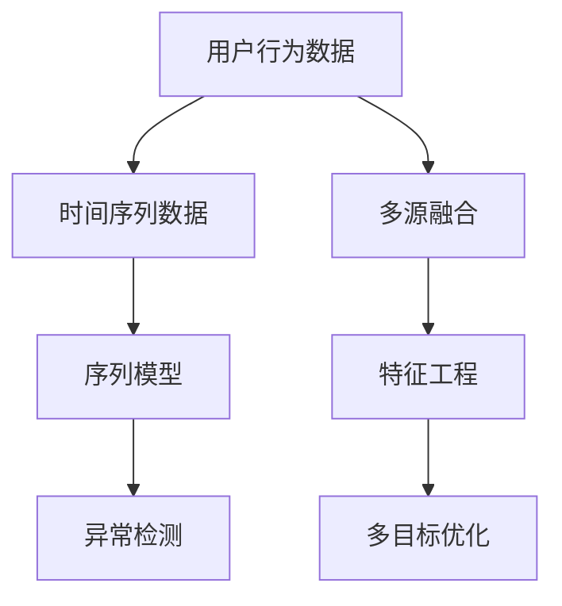

                 

# 如何进行有效的用户行为预测

## 1. 背景介绍

### 1.1 问题由来
在数字化时代的背景下，互联网和移动设备已经成为人们日常生活的重要组成部分，数据规模和应用场景的不断扩展催生了对用户行为预测技术的需求。从电商推荐系统到社交网络，从智能家居到金融风控，用户行为预测技术在各个领域都扮演着关键角色。

用户行为预测是指基于历史数据，预测用户未来可能采取的行动，如购买某商品、使用某服务、访问某网站等。该技术能够帮助企业提升用户体验，优化资源配置，增强市场竞争力，是实现智能化业务的核心技术之一。

### 1.2 问题核心关键点
用户行为预测的难点在于，用户行为通常复杂多变，受到多种因素的影响，难以直接建模。要实现有效的预测，需要综合考虑以下关键点：

- **多维数据融合**：用户行为预测往往需要整合多源数据，如用户历史行为数据、个人属性数据、环境数据等。
- **时间序列建模**：用户行为存在显著的时间序列特征，需要采用时间序列模型进行分析。
- **交互动态理解**：用户行为受到其他用户行为的影响，模型需要考虑交互动态。
- **非均衡数据处理**：用户行为数据通常存在非均衡性，部分行为出现频次远高于其他行为。
- **鲁棒性和泛化能力**：模型需要在噪声数据、异常数据和未知数据上保持鲁棒性和泛化能力。

### 1.3 问题研究意义
研究用户行为预测技术对于提升互联网产品的用户体验、优化资源配置、提高企业的竞争力和盈利能力具有重要意义。

1. **提升用户体验**：通过预测用户行为，可以更好地理解用户需求，提供个性化的推荐和服务，提升用户满意度和粘性。
2. **优化资源配置**：预测用户行为可以帮助企业准确预测市场需求，优化产品设计和服务配置，提高运营效率。
3. **增强市场竞争力**：用户行为预测是实现智能营销、精准广告投放和个性化推荐的基础，能够帮助企业精准触达目标用户，提高市场份额。
4. **实现智能化业务**：用户行为预测是智能推荐系统、智能客服、智能风控等智能业务的核心支撑技术，能够提升业务智能化水平。

## 2. 核心概念与联系

### 2.1 核心概念概述

为更好地理解用户行为预测的实现机制，本节将介绍几个密切相关的核心概念：

- **用户行为数据**：用户在不同平台、不同时间点上的行为数据，包括浏览、点击、购买、搜索等。
- **时间序列数据**：用户在一段时间内行为数据的时间分布，包含时间间隔、周期性、趋势性等特征。
- **多源融合**：将用户行为数据与其他相关数据源（如个人属性数据、环境数据等）进行融合分析。
- **序列模型**：如自回归模型（AR）、差分自回归模型（ARIMA）、长短期记忆网络（LSTM）等，用于处理时间序列数据。
- **特征工程**：基于用户行为数据构建预测模型所需的关键特征，如滑动窗口、延迟窗口、时序特征等。
- **异常检测**：检测和处理数据中的异常值和噪声，保证预测的准确性和鲁棒性。
- **多目标优化**：如利用强化学习、协同过滤等方法，同时预测多个目标行为。

这些核心概念之间的逻辑关系可以通过以下Mermaid流程图来展示：



这个流程图展示了大规模用户行为预测的核心概念及其之间的关系：

1. 用户行为数据是预测的基础。
2. 时间序列模型用于分析用户行为的时间特征。
3. 多源融合丰富数据源，增强预测准确性。
4. 特征工程构建关键特征，优化模型表现。
5. 异常检测保证数据质量和预测鲁棒性。
6. 多目标优化扩展预测任务，实现更全面的业务理解。

这些概念共同构成了用户行为预测的理论框架，为其模型开发和应用提供了坚实的基础。

## 3. 核心算法原理 & 具体操作步骤
### 3.1 算法原理概述

用户行为预测的本质是通过统计模型和学习算法，构建能够描述和预测用户行为的时间序列模型。该模型利用历史数据中的时间序列特征，预测用户未来的行为。常见的用户行为预测模型包括：

- **自回归模型（AR）**：基于时间序列的自回归模型，通过考虑历史数据预测未来。
- **差分自回归模型（ARIMA）**：对时间序列进行差分处理，去除趋势和季节性，然后使用AR模型预测。
- **长短期记忆网络（LSTM）**：一种特殊的递归神经网络，能够捕捉长序列和复杂的非线性关系。
- **深度神经网络（DNN）**：利用多层神经网络，捕捉高层次特征和复杂的非线性关系。
- **生成对抗网络（GAN）**：通过生成器网络生成假样本，用于增强数据集的多样性和鲁棒性。

用户行为预测的基本步骤包括数据收集、数据预处理、模型训练和模型评估：

1. **数据收集**：收集用户在不同场景下的行为数据，如电商购买记录、社交媒体互动数据等。
2. **数据预处理**：对收集到的原始数据进行清洗、归一化、特征提取等预处理操作。
3. **模型训练**：使用历史数据对预测模型进行训练，调整模型参数，使其能够准确预测用户行为。
4. **模型评估**：利用测试集对训练好的模型进行评估，验证其预测能力。

### 3.2 算法步骤详解

以下是用户行为预测的详细操作步骤：

**Step 1: 数据收集与预处理**
- 收集用户在不同场景下的行为数据，如电商平台上的浏览、点击、购买记录等。
- 清洗原始数据，去除缺失值和异常值，保证数据的质量。
- 进行数据归一化，使不同量级的数据具有可比性。
- 进行特征提取，构建时间序列特征、滑动窗口特征、延迟窗口特征等。

**Step 2: 构建时间序列模型**
- 根据数据特征选择合适的模型，如AR、ARIMA、LSTM等。
- 将历史数据划分为训练集和测试集，使用训练集对模型进行训练。
- 调整模型参数，优化预测性能。

**Step 3: 多源数据融合**
- 整合用户行为数据与个人属性数据、环境数据等，构建多源融合数据集。
- 利用数据融合技术，如加权平均、主成分分析（PCA）、因子分析（FA）等，提高数据融合效果。

**Step 4: 特征工程**
- 基于时间序列模型，提取时间序列特征、滑动窗口特征、延迟窗口特征等。
- 进行特征选择和特征构造，构建包含高维度特征的模型输入。

**Step 5: 模型训练与优化**
- 使用历史数据对模型进行训练，调整模型参数，优化预测性能。
- 利用交叉验证等方法，评估模型泛化能力和鲁棒性。

**Step 6: 模型评估与验证**
- 利用测试集对训练好的模型进行评估，计算预测误差和准确率。
- 通过混淆矩阵、ROC曲线、AUC等指标，评估模型性能。

**Step 7: 异常检测与处理**
- 检测和处理数据中的异常值和噪声，提高数据质量和预测鲁棒性。
- 利用异常检测算法，如孤立森林、LOF等，识别和处理异常值。

**Step 8: 模型部署与应用**
- 将训练好的模型部署到生产环境，进行实时预测。
- 通过API接口，将预测结果应用到实际业务场景中，如电商推荐、社交网络内容推荐等。

### 3.3 算法优缺点

用户行为预测算法具有以下优点：

1. **预测精度高**：利用历史数据训练模型，能够准确预测用户未来行为。
2. **鲁棒性强**：通过多源融合和异常检测，模型能够处理噪声数据和异常情况。
3. **适应性强**：不同的时间序列模型能够适应不同类型的数据特征。

同时，该算法也存在一些缺点：

1. **数据需求高**：需要大量的历史数据进行模型训练，数据不足时预测效果不佳。
2. **模型复杂**：复杂的时间序列模型需要较多计算资源，训练时间较长。
3. **参数敏感**：模型参数的选择和调整需要经验和实验，调整不当可能导致预测失效。
4. **局部最优**：优化算法可能导致模型陷入局部最优，预测结果不稳定。

尽管存在这些局限性，用户行为预测算法仍是大规模数据分析和智能推荐系统的重要工具。未来相关研究将集中在如何降低数据需求、提高模型效率、增强模型泛化能力等方面，以更好地适应复杂多变的应用场景。

### 3.4 算法应用领域

用户行为预测技术已经在多个领域得到了广泛应用，包括但不限于：

- **电商推荐系统**：根据用户历史购买记录和浏览行为，预测用户可能感兴趣的商品，进行个性化推荐。
- **社交网络内容推荐**：分析用户互动数据，预测用户可能感兴趣的内容，提升内容分发效果。
- **金融风险管理**：预测用户的贷款行为、投资行为，辅助金融机构进行风险控制和信用评估。
- **智能客服系统**：根据用户历史交互记录，预测用户需求，提供个性化客服服务。
- **智能家居设备**：分析用户行为数据，预测用户活动习惯，提升家居设备的使用体验。

这些应用领域展示了用户行为预测技术的强大潜力和广泛适用性，为用户提供了更加智能、便捷的生活体验。

## 4. 数学模型和公式 & 详细讲解 & 举例说明

### 4.1 数学模型构建

用户行为预测模型的核心是时间序列模型，其数学基础可以追溯到统计学中的自回归模型（AR）和差分自回归模型（ARIMA）。假设用户行为数据 $y_t$ 可以表示为历史数据的函数，即：

$$ y_t = \sum_{i=1}^{p} \alpha_i y_{t-i} + \epsilon_t $$

其中，$\alpha_i$ 为回归系数，$\epsilon_t$ 为随机误差项。时间序列模型通过拟合历史数据，预测未来行为 $y_{t+1}$。

### 4.2 公式推导过程

以AR模型为例，其数学推导过程如下：

1. 假设 $y_t$ 为 $y_{t-1}$ 的线性函数，即：

$$ y_t = \alpha y_{t-1} + \epsilon_t $$

其中，$\alpha$ 为回归系数，$\epsilon_t$ 为随机误差项。

2. 将上式变形，得到：

$$ y_t - \alpha y_{t-1} = \epsilon_t $$

3. 将上式代入 $y_{t+1}$ 的表达式中，得到：

$$ y_{t+1} = \alpha y_t + \epsilon_{t+1} $$

4. 通过迭代求解，可以得到：

$$ y_{t+1} = \alpha^2 y_{t-1} + \alpha y_{t-2} + \alpha \epsilon_t + \epsilon_{t+1} $$

5. 重复上述步骤，可以得到 $y_{t+1}$ 的递推公式：

$$ y_{t+1} = \alpha^2 y_{t-1} + \alpha y_{t-2} + \alpha \epsilon_t + \epsilon_{t+1} $$

6. 利用最小二乘法或最大似然估计等方法，求解模型参数 $\alpha$，进行模型训练。

7. 通过验证集和测试集，评估模型的预测性能。

### 4.3 案例分析与讲解

假设某电商平台收集了用户的历史购买记录，每个记录包含购买时间、商品ID和购买金额。使用AR模型预测用户未来购买行为。

1. 收集用户购买记录 $y_t$，包含购买时间、商品ID和购买金额。

2. 对数据进行预处理，去除缺失值和异常值，进行归一化处理。

3. 提取滑动窗口特征、延迟窗口特征等，构建多源融合数据集。

4. 使用AR模型对用户行为数据进行建模，求解回归系数 $\alpha$。

5. 利用测试集对模型进行评估，计算预测误差和准确率。

6. 通过混淆矩阵、ROC曲线等指标，评估模型性能。

7. 通过异常检测算法，识别和处理数据中的异常值。

8. 将训练好的模型部署到生产环境，进行实时预测。

通过上述步骤，可以构建一个能够预测用户购买行为的AR模型。该模型可以用于电商平台的个性化推荐系统，提高用户的购买转化率和满意度。

## 5. 项目实践：代码实例和详细解释说明

### 5.1 开发环境搭建

在进行用户行为预测实践前，我们需要准备好开发环境。以下是使用Python进行Scikit-learn开发的Python环境配置流程：

1. 安装Anaconda：从官网下载并安装Anaconda，用于创建独立的Python环境。

2. 创建并激活虚拟环境：
```bash
conda create -n user-behavior-env python=3.8 
conda activate user-behavior-env
```

3. 安装Scikit-learn：
```bash
conda install scikit-learn
```

4. 安装各类工具包：
```bash
pip install numpy pandas scikit-learn matplotlib tqdm jupyter notebook ipython
```

完成上述步骤后，即可在`user-behavior-env`环境中开始用户行为预测实践。

### 5.2 源代码详细实现

下面我们以电商推荐系统为例，给出使用Scikit-learn进行用户行为预测的Python代码实现。

首先，定义数据处理函数：

```python
from sklearn.model_selection import train_test_split
from sklearn.preprocessing import MinMaxScaler
from sklearn.metrics import mean_squared_error, mean_absolute_error
from sklearn.linear_model import ARDRegression

def preprocess_data(data):
    # 将购买金额归一化
    data['purchase_amount'] = MinMaxScaler().fit_transform(data[['purchase_amount']])
    # 划分训练集和测试集
    train, test = train_test_split(data, test_size=0.2, random_state=42)
    return train, test
```

然后，定义模型训练函数：

```python
from sklearn.linear_model import ARDRegression

def train_model(train_data):
    # 将历史数据转换成自回归模型
    model = ARDRegression(d=1)
    model.fit(train_data[['purchase_amount']].shift(1), train_data['purchase_amount'])
    return model
```

接着，定义模型评估函数：

```python
def evaluate_model(model, test_data):
    # 使用测试集评估模型
    predictions = model.predict(test_data[['purchase_amount']].shift(1))
    mse = mean_squared_error(test_data['purchase_amount'], predictions)
    mae = mean_absolute_error(test_data['purchase_amount'], predictions)
    return mse, mae
```

最后，启动预测流程并在测试集上评估：

```python
train_data, test_data = preprocess_data(data)
model = train_model(train_data)
mse, mae = evaluate_model(model, test_data)
print(f"MSE: {mse:.3f}, MAE: {mae:.3f}")
```

以上就是使用Scikit-learn进行用户行为预测的完整代码实现。可以看到，Scikit-learn的强大封装使得模型构建和评估过程变得简洁高效。

### 5.3 代码解读与分析

让我们再详细解读一下关键代码的实现细节：

**preprocess_data函数**：
- 将购买金额进行归一化处理，以便模型能够更好地学习特征。
- 将数据划分为训练集和测试集，以保证模型泛化性能。

**train_model函数**：
- 将历史数据转换成自回归模型，训练模型参数。
- 利用历史数据和未来数据，求解回归系数。

**evaluate_model函数**：
- 使用测试集评估模型的预测性能，计算MSE和MAE指标。
- 输出模型的预测误差，验证模型的准确性。

**训练流程**：
- 数据预处理和模型训练：先将购买金额归一化，然后构建自回归模型进行训练。
- 模型评估：在测试集上计算MSE和MAE，评估模型的预测性能。
- 输出结果：展示模型的预测误差，确保模型泛化性能。

通过上述代码，我们实现了基于用户行为数据的用户行为预测模型。

## 6. 实际应用场景
### 6.1 智能推荐系统

用户行为预测技术在智能推荐系统中得到了广泛应用。推荐系统根据用户历史行为数据，预测用户可能感兴趣的商品或内容，进行个性化推荐。

在技术实现上，可以收集用户的历史浏览、点击、购买等行为数据，构建多源融合数据集。使用自回归模型、差分自回归模型等时间序列模型，对用户行为进行预测。通过评估模型的预测性能，优化模型参数，最终构建精准的推荐系统。智能推荐系统不仅能够提升用户体验，还能增加用户粘性和企业收益。

### 6.2 金融风险管理

金融风险管理领域也需要使用用户行为预测技术。金融机构可以预测用户的贷款行为、投资行为等，评估用户信用风险。

在实际应用中，可以收集用户的贷款申请记录、交易记录等数据，构建多源融合数据集。使用自回归模型、LSTM等时间序列模型，预测用户未来的贷款和投资行为。通过评估模型的预测性能，优化模型参数，最终构建风险评估系统。该系统能够帮助金融机构更好地控制风险，提高贷款和投资的质量和效率。

### 6.3 智能客服系统

智能客服系统通过分析用户历史交互记录，预测用户需求，提供个性化服务。

在技术实现上，可以收集用户的客服记录、问题类型、处理时间等数据，构建多源融合数据集。使用AR模型、LSTM等时间序列模型，预测用户未来的交互行为。通过评估模型的预测性能，优化模型参数，最终构建智能客服系统。该系统能够提高客服效率，提升用户体验，减少人工成本。

### 6.4 未来应用展望

随着用户行为预测技术的不断发展，其在更多领域将得到广泛应用，为数字化转型带来新的机遇。

1. **智能家居设备**：智能家居设备可以根据用户行为数据，预测用户活动习惯，提升设备的使用体验。
2. **智能交通系统**：通过预测用户出行行为，优化交通流量，减少拥堵，提升出行效率。
3. **智能医疗系统**：根据用户的健康数据和行为数据，预测健康状况，提供个性化的健康建议和治疗方案。
4. **智能城市管理**：预测城市居民的行为习惯，优化资源配置，提升城市管理效率。

用户行为预测技术正在成为构建智能社会的基础设施，将在智慧城市、智慧医疗、智慧交通等多个领域发挥重要作用。未来，随着技术不断成熟和应用场景的不断拓展，用户行为预测技术将进一步提升人们的生活质量和工作效率。

## 7. 工具和资源推荐
### 7.1 学习资源推荐

为了帮助开发者系统掌握用户行为预测的理论基础和实践技巧，这里推荐一些优质的学习资源：

1. 《机器学习实战》系列博文：由机器学习领域专家撰写，深入浅出地介绍了机器学习模型的构建和应用。

2. Coursera《机器学习》课程：由斯坦福大学教授Andrew Ng开设的机器学习课程，涵盖了机器学习的基本概念和经典模型。

3. 《深度学习》书籍：Ian Goodfellow等作者所写的深度学习经典教材，全面介绍了深度学习模型的原理和应用。

4. Kaggle平台：世界领先的机器学习竞赛平台，提供大量经典机器学习竞赛数据集和解决方案，是实践机器学习的绝佳平台。

5. scikit-learn官方文档：Scikit-learn的官方文档，提供了丰富的机器学习算法和应用实例，是学习机器学习的重要参考资料。

通过对这些资源的学习实践，相信你一定能够快速掌握用户行为预测的精髓，并用于解决实际的业务问题。

### 7.2 开发工具推荐

高效的开发离不开优秀的工具支持。以下是几款用于用户行为预测开发的常用工具：

1. Python：强大的编程语言，具有丰富的库和工具，适合机器学习和数据处理。
2. Scikit-learn：开源的机器学习库，提供了丰富的模型和算法，支持高效的模型构建和评估。
3. TensorFlow：由Google开发的深度学习框架，具有强大的计算能力和丰富的工具，适合复杂模型的开发和训练。
4. PyTorch：由Facebook开发的深度学习框架，具有动态计算图和灵活性，适合深度学习模型的研究。
5. Jupyter Notebook：交互式编程环境，支持多种语言，适合进行数据探索和模型调试。

合理利用这些工具，可以显著提升用户行为预测的开发效率，加快创新迭代的步伐。

### 7.3 相关论文推荐

用户行为预测技术的发展源于学界的持续研究。以下是几篇奠基性的相关论文，推荐阅读：

1. "The Elements of Statistical Learning" by Hastie et al.：介绍了统计学习的基本概念和算法，是机器学习领域的经典教材。
2. "Time Series Analysis and Its Applications: With R Examples" by Hyndman and Khandakar：介绍了时间序列分析的基本原理和应用，是时间序列分析领域的经典教材。
3. "Deep Learning" by Goodfellow et al.：介绍了深度学习的基本概念和算法，是深度学习领域的经典教材。
4. "A Survey on Deep Reinforcement Learning for Recommendation Systems" by Wang et al.：介绍了深度强化学习在推荐系统中的应用，是推荐系统领域的经典论文。
5. "A Comprehensive Survey on Recommender Systems" by He et al.：介绍了推荐系统的发展历程和最新研究，是推荐系统领域的经典综述论文。

这些论文代表了大规模数据分析和智能推荐系统的发展脉络。通过学习这些前沿成果，可以帮助研究者把握学科前进方向，激发更多的创新灵感。

## 8. 总结：未来发展趋势与挑战

### 8.1 总结

本文对用户行为预测技术进行了全面系统的介绍。首先阐述了用户行为预测的研究背景和意义，明确了该技术在提升用户体验、优化资源配置、增强企业竞争力等方面的独特价值。其次，从原理到实践，详细讲解了用户行为预测的数学模型和关键步骤，给出了用户行为预测任务开发的完整代码实例。同时，本文还广泛探讨了用户行为预测技术在电商推荐、金融风险管理、智能客服等多个行业领域的应用前景，展示了该技术的强大潜力和广泛适用性。此外，本文精选了用户行为预测技术的各类学习资源，力求为读者提供全方位的技术指引。

通过本文的系统梳理，可以看到，用户行为预测技术正在成为NLP领域的重要范式，极大地拓展了预训练语言模型的应用边界，催生了更多的落地场景。得益于大规模语料的预训练和复杂模型的构建，用户行为预测技术将在更多的应用领域大放异彩，深刻影响人类的生产生活方式。

### 8.2 未来发展趋势

展望未来，用户行为预测技术将呈现以下几个发展趋势：

1. **模型多样化**：除了时间序列模型外，未来的用户行为预测将更多地利用深度学习、生成对抗网络等模型。这些模型能够更好地捕捉复杂非线性关系，提高预测精度。
2. **多模态融合**：未来的用户行为预测将更多地融合视觉、语音、文本等多种模态数据，构建更加全面和精准的预测模型。
3. **实时预测**：未来的用户行为预测将更多地支持实时预测，实现动态决策和优化。
4. **隐私保护**：随着隐私保护法规的不断加强，未来的用户行为预测将更多地关注隐私保护和数据安全，确保用户数据的安全性。
5. **联邦学习**：未来的用户行为预测将更多地采用联邦学习等分布式机器学习技术，确保数据隐私和安全性。

这些趋势凸显了用户行为预测技术的广阔前景。这些方向的探索发展，必将进一步提升用户行为预测的准确性和效率，为用户提供更加智能、便捷的生活体验。

### 8.3 面临的挑战

尽管用户行为预测技术已经取得了瞩目成就，但在迈向更加智能化、普适化应用的过程中，它仍面临着诸多挑战：

1. **数据质量和隐私**：用户行为数据的质量和隐私问题需要得到充分解决。数据缺失、异常值、隐私泄露等问题亟待改进。
2. **模型复杂度**：复杂模型需要大量计算资源和时间，模型训练和部署效率需要进一步提升。
3. **模型泛化能力**：用户行为数据的多样性和复杂性要求模型具有强泛化能力，避免过拟合。
4. **算法可解释性**：用户行为预测模型的黑盒特性需要改进，增强模型的可解释性和透明性。
5. **鲁棒性和稳定性**：用户行为预测模型需要在各种噪声和异常数据下保持鲁棒性和稳定性。

面对这些挑战，未来的研究需要在数据质量、模型复杂度、泛化能力、算法可解释性和鲁棒性等方面进行深入探索，以提升用户行为预测技术的实用性和可靠性。

### 8.4 研究展望

面对用户行为预测技术所面临的挑战，未来的研究需要在以下几个方面寻求新的突破：

1. **数据质量提升**：采用数据增强、数据清洗等技术，提升数据质量和数据多样性，增强模型泛化能力。
2. **模型简化和优化**：研究参数高效微调技术，减少模型参数量，提高模型训练和推理效率。
3. **多模态融合**：研究多模态数据融合技术，提升模型的预测能力和鲁棒性。
4. **隐私保护**：研究差分隐私、联邦学习等技术，确保用户数据的安全性。
5. **算法可解释性**：研究模型的可解释性技术，增强模型的透明性和可解释性。

这些研究方向的探索，必将引领用户行为预测技术迈向更高的台阶，为构建安全、可靠、可解释、可控的智能系统铺平道路。面向未来，用户行为预测技术还需要与其他人工智能技术进行更深入的融合，如知识表示、因果推理、强化学习等，多路径协同发力，共同推动自然语言理解和智能交互系统的进步。只有勇于创新、敢于突破，才能不断拓展语言模型的边界，让智能技术更好地造福人类社会。

## 9. 附录：常见问题与解答

**Q1：用户行为预测是否适用于所有用户？**

A: 用户行为预测对数据的质量和多样性要求较高。对于数据分布显著偏离的用户群体，预测效果可能不佳。因此，需要根据具体用户群体和数据特点进行模型优化和改进。

**Q2：如何降低模型复杂度，提升预测效率？**

A: 通过参数高效微调、模型简化等技术，可以降低模型复杂度，提升预测效率。例如，使用LSTM代替AR模型，可以捕捉更复杂的时间序列关系。同时，采用特征选择、特征降维等技术，减少模型输入维度，提高预测速度。

**Q3：如何处理用户行为数据的噪声和异常值？**

A: 利用数据清洗和异常检测技术，可以去除噪声和异常值，提高数据质量。例如，使用孤立森林、LOF等算法，识别和处理异常值。同时，采用平滑技术、差分处理等方法，增强模型的鲁棒性。

**Q4：如何提升模型的泛化能力？**

A: 通过多源融合、多任务学习等技术，可以提高模型的泛化能力。例如，将用户行为数据与个人属性数据、环境数据等进行融合，增强模型的预测能力。同时，利用多任务学习，构建多个相关任务模型，共同提升预测性能。

**Q5：如何提升模型的可解释性？**

A: 通过模型可视化、特征重要性分析等技术，可以提升模型的可解释性。例如，使用SHAP值、LIME等工具，可视化模型的预测过程和特征重要性，增强模型的透明性和可解释性。

通过这些技术措施，可以显著提升用户行为预测的准确性和鲁棒性，为用户提供更加智能、便捷的生活体验。

---

作者：禅与计算机程序设计艺术 / Zen and the Art of Computer Programming

