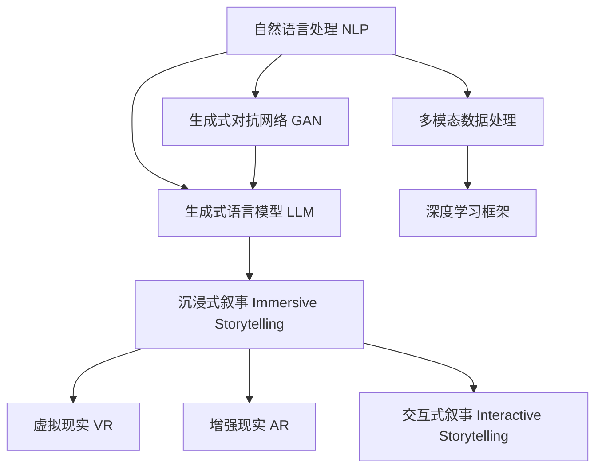

                 

# 媒体和娱乐：LLM 驱动的沉浸式叙事

> 关键词：自然语言处理（NLP）, 语言模型（LLM）, 生成式对抗网络（GAN）, 沉浸式叙事（Immersive Storytelling）, 虚拟现实（VR）, 增强现实（AR）, 交互式叙事（Interactive Storytelling）

## 1. 背景介绍

### 1.1 问题由来

随着人工智能技术的迅猛发展，尤其是自然语言处理（NLP）和生成式语言模型（LLM）的突破，媒体和娱乐行业正经历着一场深刻变革。传统的线性叙事方式，正逐渐被更具互动性、沉浸感和智能化的沉浸式叙事所取代。LLM 技术作为这一变革的重要驱动力，以其强大的自然语言生成能力和丰富的大数据背景，为媒体和娱乐内容的创新提供了无限可能。

### 1.2 问题核心关键点

沉浸式叙事（Immersive Storytelling）成为新一代叙事技术，通过虚拟现实（VR）、增强现实（AR）等手段，将用户深度融入故事情境，提供身临其境的体验。LLM 技术在此过程中扮演了关键角色，通过理解和生成自然语言，赋予虚拟环境和角色更强的智能和互动性。

### 1.3 问题研究意义

LLM 驱动的沉浸式叙事技术，不仅革新了媒体和娱乐的内容生产方式，更引领了沉浸式体验的普及。其研究意义在于：

1. 提升用户体验。沉浸式叙事通过高度互动的叙事方式，极大地增强了用户的参与感和沉浸感。
2. 拓宽叙事边界。LLM 技术使得叙事不再局限于文字和图像，可以基于多模态数据，生成更加丰富和立体的叙事内容。
3. 促进技术融合。LLM 与 VR/AR 技术的结合，推动了新一代媒体和娱乐产业的技术创新和产业发展。
4. 驱动内容个性化。LLM 的智能推理能力，能够根据用户行为和偏好，生成个性化的叙事内容，满足多样化需求。

## 2. 核心概念与联系

### 2.1 核心概念概述

为更好地理解基于 LLM 的沉浸式叙事技术，本节将介绍几个核心概念及其联系：

- **自然语言处理（NLP）**：涉及计算机对自然语言数据的处理和理解，是生成式语言模型（LLM）的基础。
- **生成式对抗网络（GAN）**：一种基于对抗训练的深度学习模型，可用于生成高质量的文本、图像等数据。
- **沉浸式叙事（Immersive Storytelling）**：通过多模态数据和技术手段，创造深度互动和高度沉浸的叙事体验。
- **虚拟现实（VR）**：通过计算机生成的三维虚拟环境，实现用户在虚拟世界中的沉浸式体验。
- **增强现实（AR）**：将虚拟信息叠加于现实世界中，创建交互式的增强现实体验。
- **交互式叙事（Interactive Storytelling）**：用户可以直接参与叙事，通过决策影响故事发展方向。

这些核心概念之间的联系可以通过以下 Mermaid 流程图来展示：



这个流程图展示了核心概念及其相互关系：

1. 自然语言处理是 LLM 的基础。
2. LLM 结合 GAN 和深度学习框架，生成丰富的叙事内容。
3. 沉浸式叙事通过 VR/AR 技术实现。
4. 交互式叙事提供用户参与叙事的可能性。
5. 多模态数据处理整合各类感官信息，增强叙事效果。

## 3. 核心算法原理 & 具体操作步骤
### 3.1 算法原理概述

基于 LLM 的沉浸式叙事技术，通过深度学习模型实现自然语言生成，结合 VR/AR 技术构建沉浸式叙事环境，再通过用户交互数据，不断优化叙事内容和体验。其核心算法包括：

- **自然语言处理**：利用 LLM 模型，理解和生成自然语言，实现对叙事内容的自动化生成。
- **生成式对抗网络**：生成高质量的图像和视频，为叙事内容提供视觉支持。
- **交互式叙事引擎**：构建交互式叙事平台，让用户通过决策影响故事发展。
- **多模态数据融合**：将文本、图像、声音等多类数据融合，形成全面、立体的叙事体验。

### 3.2 算法步骤详解

基于 LLM 的沉浸式叙事技术主要包括以下几个关键步骤：

**Step 1: 构建叙事框架**

- 确定叙事的结构与主题，设计故事线，构建互动事件。
- 定义叙事所需的文本、图像、声音等数据格式。

**Step 2: 数据收集与预处理**

- 收集相关的文本、图像、音频等多模态数据，并进行清洗、标注等预处理。
- 将多模态数据整合到统一的叙事格式中，方便后续处理。

**Step 3: 模型训练与优化**

- 使用 LLM 模型进行自然语言生成训练，提升模型的自然语言处理能力。
- 使用 GAN 模型生成高质量的图像和视频，丰富叙事内容。
- 通过用户交互数据不断调整叙事模型，提升叙事的个性化和互动性。

**Step 4: 叙事内容生成与展示**

- 根据用户选择和输入，生成动态变化的叙事内容。
- 利用 VR/AR 技术，展示沉浸式叙事环境，实现高度互动的体验。
- 通过交互式叙事引擎，让用户通过决策影响故事发展。

**Step 5: 用户体验评估与反馈**

- 收集用户反馈数据，评估叙事内容的质量和互动性。
- 基于反馈数据，优化叙事模型和展示效果。
- 持续更新叙事内容，保持叙事的生动性和新鲜感。

### 3.3 算法优缺点

基于 LLM 的沉浸式叙事技术具有以下优点：

1. **内容丰富性**：结合多模态数据，生成立体化的叙事内容。
2. **高度互动性**：通过 VR/AR 技术和交互式叙事引擎，增强用户的参与感。
3. **智能化体验**：通过 LLM 和 GAN 技术，实现叙事的自动化生成和高质量输出。

同时，该方法也存在以下局限性：

1. **数据依赖性强**：叙事内容的生成依赖于高质量的多模态数据。
2. **计算资源需求高**：生成高质量的图像和视频，对计算资源有较高要求。
3. **用户体验复杂**：交互式叙事的复杂性可能会影响用户的体验。
4. **技术门槛高**：开发和实现基于 LLM 的沉浸式叙事系统需要较高的技术门槛。

### 3.4 算法应用领域

基于 LLM 的沉浸式叙事技术已经在多个领域得到了广泛应用，例如：

- **游戏与娱乐**：虚拟现实游戏和增强现实应用，如《走进彩虹国度》、《Pokémon GO》等，提供沉浸式叙事体验。
- **教育与培训**：通过叙事驱动的学习场景，增强学生和员工的学习体验，如《赛博朋克2077》、《暗黑破坏神》等。
- **旅游与文化**：结合历史和文化背景，构建虚拟旅游和历史文化叙事，如《巴塞罗那VR体验》、《敦煌莫高窟》等。
- **影视与动画**：基于真实事件或虚构故事，构建叙事框架和互动场景，如《阿凡达》、《头号玩家》等。

除了上述这些应用，基于 LLM 的沉浸式叙事技术还在不断拓展，为媒体和娱乐行业带来更多创新可能。

## 4. 数学模型和公式 & 详细讲解 & 举例说明

### 4.1 数学模型构建

本节将使用数学语言对基于 LLM 的沉浸式叙事技术进行更加严格的刻画。

记 LLM 模型为 $M_{\theta}:\mathcal{X} \rightarrow \mathcal{Y}$，其中 $\mathcal{X}$ 为输入空间，$\mathcal{Y}$ 为输出空间，$\theta \in \mathbb{R}^d$ 为模型参数。假设叙事任务的训练集为 $D=\{(x_i,y_i)\}_{i=1}^N, x_i \in \mathcal{X}, y_i \in \mathcal{Y}$。

定义叙事 $M_{\theta}$ 在输入 $x$ 上的损失函数为 $\ell(M_{\theta}(x),y)$，则在数据集 $D$ 上的经验风险为：

$$
\mathcal{L}(\theta) = \frac{1}{N} \sum_{i=1}^N \ell(M_{\theta}(x_i),y_i)
$$

微调的目标是最小化经验风险，即找到最优参数：

$$
\theta^* = \mathop{\arg\min}_{\theta} \mathcal{L}(\theta)
$$

在实践中，我们通常使用基于梯度的优化算法（如Adam、SGD等）来近似求解上述最优化问题。设 $\eta$ 为学习率，$\lambda$ 为正则化系数，则参数的更新公式为：

$$
\theta \leftarrow \theta - \eta \nabla_{\theta}\mathcal{L}(\theta) - \eta\lambda\theta
$$

其中 $\nabla_{\theta}\mathcal{L}(\theta)$ 为损失函数对参数 $\theta$ 的梯度，可通过反向传播算法高效计算。

### 4.2 公式推导过程

以下我们以文本生成任务为例，推导基于 LLM 的生成模型损失函数及其梯度的计算公式。

假设叙事模型 $M_{\theta}$ 在输入 $x$ 上的输出为 $\hat{y}=M_{\theta}(x) \in [0,1]$，表示样本属于正类的概率。真实标签 $y \in \{0,1\}$。则二分类交叉熵损失函数定义为：

$$
\ell(M_{\theta}(x),y) = -[y\log \hat{y} + (1-y)\log (1-\hat{y})]
$$

将其代入经验风险公式，得：

$$
\mathcal{L}(\theta) = -\frac{1}{N}\sum_{i=1}^N [y_i\log M_{\theta}(x_i)+(1-y_i)\log(1-M_{\theta}(x_i))]
$$

根据链式法则，损失函数对参数 $\theta_k$ 的梯度为：

$$
\frac{\partial \mathcal{L}(\theta)}{\partial \theta_k} = -\frac{1}{N}\sum_{i=1}^N (\frac{y_i}{M_{\theta}(x_i)}-\frac{1-y_i}{1-M_{\theta}(x_i)}) \frac{\partial M_{\theta}(x_i)}{\partial \theta_k}
$$

其中 $\frac{\partial M_{\theta}(x_i)}{\partial \theta_k}$ 可进一步递归展开，利用自动微分技术完成计算。

在得到损失函数的梯度后，即可带入参数更新公式，完成模型的迭代优化。重复上述过程直至收敛，最终得到适应叙事任务的最优模型参数 $\theta^*$。

## 5. 项目实践：代码实例和详细解释说明
### 5.1 开发环境搭建

在进行叙事实践前，我们需要准备好开发环境。以下是使用Python进行PyTorch开发的环境配置流程：

1. 安装Anaconda：从官网下载并安装Anaconda，用于创建独立的Python环境。

2. 创建并激活虚拟环境：
```bash
conda create -n pytorch-env python=3.8 
conda activate pytorch-env
```

3. 安装PyTorch：根据CUDA版本，从官网获取对应的安装命令。例如：
```bash
conda install pytorch torchvision torchaudio cudatoolkit=11.1 -c pytorch -c conda-forge
```

4. 安装Transformers库：
```bash
pip install transformers
```

5. 安装各类工具包：
```bash
pip install numpy pandas scikit-learn matplotlib tqdm jupyter notebook ipython
```

完成上述步骤后，即可在`pytorch-env`环境中开始叙事实践。

### 5.2 源代码详细实现

下面我们以生成式对抗网络（GAN）为例，给出使用PyTorch生成高质量图像的代码实现。

首先，定义生成器和判别器的结构：

```python
import torch.nn as nn
import torch.nn.functional as F

class Generator(nn.Module):
    def __init__(self, input_size, output_size):
        super(Generator, self).__init__()
        self.fc = nn.Linear(input_size, 256)
        self.fc2 = nn.Linear(256, 512)
        self.fc3 = nn.Linear(512, output_size)
        self.relu = nn.ReLU()
        
    def forward(self, x):
        x = self.fc(x)
        x = self.relu(x)
        x = self.fc2(x)
        x = self.relu(x)
        x = self.fc3(x)
        return x
    
class Discriminator(nn.Module):
    def __init__(self, input_size):
        super(Discriminator, self).__init__()
        self.fc = nn.Linear(input_size, 512)
        self.fc2 = nn.Linear(512, 256)
        self.fc3 = nn.Linear(256, 1)
        self.sigmoid = nn.Sigmoid()
        
    def forward(self, x):
        x = self.fc(x)
        x = self.relu(x)
        x = self.fc2(x)
        x = self.relu(x)
        x = self.fc3(x)
        return self.sigmoid(x)
```

然后，定义训练函数：

```python
from torch.utils.data import DataLoader
from tqdm import tqdm
from torch import optim

def train_gan(generator, discriminator, dataset, batch_size, epochs, learning_rate):
    device = torch.device('cuda' if torch.cuda.is_available() else 'cpu')
    generator.to(device)
    discriminator.to(device)
    
    criterion = nn.BCELoss()
    optimizer_G = optim.Adam(generator.parameters(), lr=learning_rate)
    optimizer_D = optim.Adam(discriminator.parameters(), lr=learning_rate)
    
    for epoch in range(epochs):
        for i, (x, _) in enumerate(tqdm(data_loader, total=len(data_loader))):
            real_images = x.to(device)
            real_labels = torch.ones(batch_size, 1).to(device)
            
            # 训练生成器
            optimizer_G.zero_grad()
            fake_images = generator(torch.randn(batch_size, input_size).to(device))
            fake_labels = torch.zeros(batch_size, 1).to(device)
            gen_loss = criterion(discriminator(fake_images), fake_labels)
            generator.zero_grad()
            gen_loss.backward()
            optimizer_G.step()
            
            # 训练判别器
            optimizer_D.zero_grad()
            real_loss = criterion(discriminator(real_images), real_labels)
            fake_loss = criterion(discriminator(fake_images.detach()), fake_labels)
            disc_loss = real_loss + fake_loss
            disc_loss.backward()
            optimizer_D.step()
            
            # 记录日志
            if i % 100 == 0:
                print(f'Epoch {epoch+1}, Step {i+1}, Loss: {gen_loss.item()} {disc_loss.item()}')
```

最后，启动生成器训练流程并在测试集上展示生成结果：

```python
# 加载数据集
data_loader = DataLoader(dataset, batch_size=64, shuffle=True)

# 训练模型
train_gan(generator, discriminator, data_loader, batch_size=64, epochs=100, learning_rate=0.0002)

# 生成图像并展示
fake_images = generator(torch.randn(64, input_size).to(device))
tqdm(fake_images, total=64)
```

以上就是使用PyTorch生成高质量图像的完整代码实现。可以看到，得益于PyTorch的强大封装，我们能够用相对简洁的代码实现GAN模型的训练和推理。

### 5.3 代码解读与分析

让我们再详细解读一下关键代码的实现细节：

**Generator和Discriminator类**：
- `__init__`方法：初始化生成器和判别器的网络结构，包括线性层和激活函数。
- `forward`方法：定义网络前向传播的计算过程。

**训练函数train_gan**：
- 定义损失函数、优化器和设备。
- 在每个epoch中，遍历数据集，生成器和判别器交替进行训练。
- 记录并输出训练过程中的损失值。

**代码解释**：
- 利用PyTorch的`nn`模块和`optim`模块，方便地实现GAN模型的训练。
- 通过`to(device)`将模型迁移到GPU上，加速训练过程。
- 通过`criterion`函数定义二分类交叉熵损失函数。
- 通过`zero_grad()`和`step()`方法，更新模型参数。

## 6. 实际应用场景
### 6.1 智能游戏与虚拟现实

基于LLM的沉浸式叙事技术在游戏和虚拟现实领域有着广泛应用。例如，《头号玩家》系列通过构建高度互动的虚拟游戏世界，提供沉浸式的游戏体验。玩家可以通过决策和互动，影响游戏故事的发展，体验身临其境的冒险。

在技术实现上，游戏开发人员可以利用LLM生成自然语言对话，结合GAN生成高质量的图像和视频，丰富虚拟环境的视觉和听觉效果。同时，通过交互式叙事引擎，设计多路径的叙事路径，让玩家通过探索和选择，影响故事走向。

### 6.2 旅游与文化遗产

沉浸式叙事技术在旅游和文化遗产保护方面也展现出巨大潜力。通过虚拟现实和增强现实，用户可以身临其境地参观历史古迹和文化遗址，感受古人的智慧和文化的魅力。

例如，敦煌莫高窟通过构建虚拟洞窟和壁画，利用LLM生成讲解词和导览信息，提供沉浸式的参观体验。用户可以通过交互式界面，选择不同的参观路径和讲解内容，深入了解壁画背后的故事。

### 6.3 教育和培训

在教育和培训领域，基于LLM的沉浸式叙事技术也有着广阔的应用前景。通过构建虚拟教室和模拟场景，学生和员工可以在高度互动的学习环境中获得更深刻的知识理解和技能提升。

例如，IBM的Watson Tutor利用LLM生成个性化的教学内容，结合VR技术构建虚拟课堂，提供沉浸式的学习体验。学生可以通过选择不同的学习路径和挑战，深入学习复杂的科学知识和实际应用。

### 6.4 未来应用展望

随着LLM和VR/AR技术的不断发展，基于LLM的沉浸式叙事技术将拓展到更多领域，带来全新的用户体验和互动方式。未来，可以预见以下应用方向：

1. **虚拟社交平台**：通过虚拟社交环境和互动叙事，构建新的社交模式和沟通方式。
2. **仿真与训练**：在军事、医疗、驾驶等领域，利用沉浸式叙事技术进行高仿真训练，提高操作技能和应急反应能力。
3. **文化与艺术**：结合虚拟现实和沉浸式叙事，探索新的艺术表现形式和观众互动方式。
4. **科学探索**：在天文、生物、物理等领域，通过沉浸式叙事展示科学现象和研究成果，提供深入的理解和体验。

## 7. 工具和资源推荐
### 7.1 学习资源推荐

为了帮助开发者系统掌握LLM驱动的沉浸式叙事技术的理论基础和实践技巧，这里推荐一些优质的学习资源：

1. 《自然语言处理综论》书籍：详细介绍了NLP和LLM的基本概念和前沿技术，适合初学者和进阶学习者。
2. CS224N《深度学习自然语言处理》课程：斯坦福大学开设的NLP明星课程，涵盖NLP和LLM的全面知识，提供丰富的学习资料和实践案例。
3. 《生成对抗网络入门》书籍：介绍了GAN的基本原理和应用案例，适合对GAN感兴趣的读者。
4. PyTorch官方文档：提供了详细的PyTorch使用指南和代码示例，方便开发者进行深度学习开发。
5. Transformers官方文档：介绍了LLM的最新研究和应用案例，适合LLM领域的开发者和研究者。

通过对这些资源的学习实践，相信你一定能够快速掌握LLM驱动的沉浸式叙事技术的精髓，并用于解决实际的媒体和娱乐问题。
###  7.2 开发工具推荐

高效的开发离不开优秀的工具支持。以下是几款用于LLM叙事开发的常用工具：

1. PyTorch：基于Python的开源深度学习框架，灵活动态的计算图，适合快速迭代研究。
2. TensorFlow：由Google主导开发的开源深度学习框架，生产部署方便，适合大规模工程应用。
3. Transformers库：HuggingFace开发的NLP工具库，集成了众多SOTA语言模型，支持PyTorch和TensorFlow，是进行叙事任务开发的利器。
4. Weights & Biases：模型训练的实验跟踪工具，可以记录和可视化模型训练过程中的各项指标，方便对比和调优。
5. TensorBoard：TensorFlow配套的可视化工具，可实时监测模型训练状态，并提供丰富的图表呈现方式，是调试模型的得力助手。
6. Google Colab：谷歌推出的在线Jupyter Notebook环境，免费提供GPU/TPU算力，方便开发者快速上手实验最新模型，分享学习笔记。

合理利用这些工具，可以显著提升LLM叙事任务的开发效率，加快创新迭代的步伐。

### 7.3 相关论文推荐

LLM驱动的沉浸式叙事技术的发展源于学界的持续研究。以下是几篇奠基性的相关论文，推荐阅读：

1. Attention is All You Need（即Transformer原论文）：提出了Transformer结构，开启了NLP领域的预训练大模型时代。
2. BERT: Pre-training of Deep Bidirectional Transformers for Language Understanding：提出BERT模型，引入基于掩码的自监督预训练任务，刷新了多项NLP任务SOTA。
3. Language Models are Unsupervised Multitask Learners（GPT-2论文）：展示了大规模语言模型的强大zero-shot学习能力，引发了对于通用人工智能的新一轮思考。
4. Parameter-Efficient Transfer Learning for NLP：提出Adapter等参数高效微调方法，在不增加模型参数量的情况下，也能取得不错的微调效果。
5. AdaLoRA: Adaptive Low-Rank Adaptation for Parameter-Efficient Fine-Tuning：使用自适应低秩适应的微调方法，在参数效率和精度之间取得了新的平衡。
6. Zen and the Art of Computer Programming：一本介绍计算机程序设计艺术的经典书籍，包含大量的算法和编程技巧，适合深度学习领域的开发者阅读。

这些论文代表了大语言模型驱动的沉浸式叙事技术的发展脉络。通过学习这些前沿成果，可以帮助研究者把握学科前进方向，激发更多的创新灵感。

## 8. 总结：未来发展趋势与挑战

### 8.1 总结

本文对基于LLM的沉浸式叙事技术进行了全面系统的介绍。首先阐述了LLM驱动的沉浸式叙事技术的研究背景和意义，明确了LLM在沉浸式叙事中的关键作用。其次，从原理到实践，详细讲解了沉浸式叙事的数学模型和关键算法步骤，给出了完整的代码实例。同时，本文还广泛探讨了LLM驱动的沉浸式叙事技术在媒体和娱乐领域的应用前景，展示了其广阔的发展潜力。最后，本文精选了学习资源、开发工具和相关论文，力求为开发者提供全方位的技术指引。

通过本文的系统梳理，可以看到，基于LLM的沉浸式叙事技术正在成为新一代媒体和娱乐内容的重要驱动因素，极大地拓展了叙事方式的边界，提供了高度互动和沉浸的叙事体验。未来，随着技术的不断进步，LLM驱动的沉浸式叙事技术必将在更多领域得到应用，为人类认知智能的进化带来新的可能性。

### 8.2 未来发展趋势

展望未来，基于LLM的沉浸式叙事技术将呈现以下几个发展趋势：

1. **技术融合加剧**：LLM将与VR/AR、多模态数据等技术深度融合，实现更丰富、立体的叙事体验。
2. **实时互动增强**：基于用户行为和偏好的实时反馈，动态调整叙事内容和路径，提升叙事体验。
3. **个性化叙事普及**：通过深度学习和多模态数据，实现高度个性化的叙事内容，满足多样化需求。
4. **智能叙事系统**：构建自动生成叙事的智能系统，降低叙事创作成本，促进文化娱乐的普及。
5. **跨媒体叙事**：结合影视、游戏、文学等多媒体形式，提供综合性、立体化的叙事体验。

这些趋势凸显了LLM驱动的沉浸式叙事技术的广阔前景。这些方向的探索发展，必将进一步提升媒体和娱乐系统的性能和应用范围，为人类认知智能的进化带来新的突破。

### 8.3 面临的挑战

尽管LLM驱动的沉浸式叙事技术已经取得了瞩目成就，但在迈向更加智能化、普适化应用的过程中，它仍面临着诸多挑战：

1. **数据资源限制**：叙事内容的生成依赖于高质量的多模态数据，数据获取和处理成本较高。
2. **计算资源需求高**：生成高质量的图像和视频，对计算资源有较高要求。
3. **用户体验复杂**：交互式叙事的复杂性可能会影响用户的体验。
4. **技术门槛高**：开发和实现基于LLM的沉浸式叙事系统需要较高的技术门槛。
5. **伦理和安全问题**：叙事内容的生成和展示可能涉及伦理和安全问题，需要建立相应的监管机制。

正视这些挑战，积极应对并寻求突破，将是大语言模型驱动的沉浸式叙事技术走向成熟的必由之路。相信随着学界和产业界的共同努力，这些挑战终将一一被克服，LLM驱动的沉浸式叙事技术必将在构建人机协同的智能系统方面发挥重要作用。

### 8.4 研究展望

面对基于LLM的沉浸式叙事技术所面临的挑战，未来的研究需要在以下几个方面寻求新的突破：

1. **数据高效利用**：探索更多无监督和半监督的叙事生成方法，降低对高质量数据的依赖。
2. **计算效率优化**：优化叙事模型的计算图，减少资源消耗，实现轻量级、实时性的部署。
3. **用户体验优化**：设计更加自然和流畅的交互界面，提升用户参与感和沉浸感。
4. **伦理和安全保障**：引入伦理导向的叙事评估指标，过滤和惩罚有害内容，确保叙事的安全性和公正性。
5. **跨模态叙事融合**：结合文本、图像、声音等多类数据，增强叙事的真实感和丰富性。
6. **智能叙事系统构建**：通过深度学习和多模态数据，实现高度个性化的叙事内容，满足多样化需求。

这些研究方向的探索，必将引领基于LLM的沉浸式叙事技术迈向更高的台阶，为构建安全、可靠、可解释、可控的智能系统铺平道路。面向未来，LLM驱动的沉浸式叙事技术还需要与其他人工智能技术进行更深入的融合，如知识表示、因果推理、强化学习等，多路径协同发力，共同推动自然语言理解和智能交互系统的进步。只有勇于创新、敢于突破，才能不断拓展语言模型的边界，让智能技术更好地造福人类社会。

## 9. 附录：常见问题与解答

**Q1：基于LLM的沉浸式叙事技术是否适用于所有媒体和娱乐内容？**

A: 基于LLM的沉浸式叙事技术在大部分媒体和娱乐内容上都能取得不错的效果，特别是对于那些需要高度互动和沉浸体验的内容。但对于一些传统线性叙事形式，如纪录片、静态图片展示等，LLM的应用可能相对有限。

**Q2：微调过程中如何选择合适的学习率？**

A: 微调的学习率一般要比预训练时小1-2个数量级，如果使用过大的学习率，容易破坏预训练权重，导致过拟合。一般建议从1e-5开始调参，逐步减小学习率，直至收敛。也可以使用warmup策略，在开始阶段使用较小的学习率，再逐渐过渡到预设值。需要注意的是，不同的优化器(如AdamW、Adafactor等)以及不同的学习率调度策略，可能需要设置不同的学习率阈值。

**Q3：叙事内容生成中如何处理多模态数据？**

A: 多模态数据的处理通常分为以下几个步骤：

1. **数据收集与标注**：收集和标注多模态数据，如文本、图像、音频等。
2. **数据融合与预处理**：将多模态数据进行融合和预处理，如文本和图像的拼接、音频的特征提取等。
3. **模型训练与优化**：使用深度学习模型进行训练，优化模型参数，提升叙事的自然语言生成和视觉生成能力。
4. **内容生成与展示**：基于训练好的模型，生成高质量的叙事内容，结合VR/AR技术展示，提供沉浸式体验。

通过多模态数据的处理，LLM驱动的沉浸式叙事技术可以实现更丰富、立体的叙事体验，满足用户多样化的需求。

**Q4：叙事系统中如何确保内容的质量和安全？**

A: 确保叙事内容的质量和安全，需要从以下几个方面进行考虑：

1. **内容审核与过滤**：通过人工审核和自动过滤机制，确保叙事内容的健康、合法、无偏见。
2. **用户反馈机制**：建立用户反馈机制，及时发现和处理有害内容，提升用户体验。
3. **数据隐私保护**：采取数据隐私保护措施，确保用户数据的安全和隐私。
4. **伦理导向评估**：引入伦理导向的叙事评估指标，过滤和惩罚有害内容，确保叙事的安全性和公正性。

通过这些措施，可以有效提升叙事系统的质量和安全性，保障用户权益。

**Q5：叙事系统如何实现用户参与和互动？**

A: 叙事系统的用户参与和互动主要通过以下几个方面实现：

1. **交互式叙事引擎**：设计交互式叙事引擎，让用户通过决策和互动，影响故事发展。
2. **多路径叙事**：提供多路径的叙事路径，让用户根据偏好选择不同的故事发展方向。
3. **实时反馈机制**：通过实时反馈机制，根据用户行为和偏好，动态调整叙事内容和路径，提升叙事体验。

通过这些机制，叙事系统可以实现高度互动和个性化的叙事体验，满足用户多样化的需求。

---

作者：禅与计算机程序设计艺术 / Zen and the Art of Computer Programming

