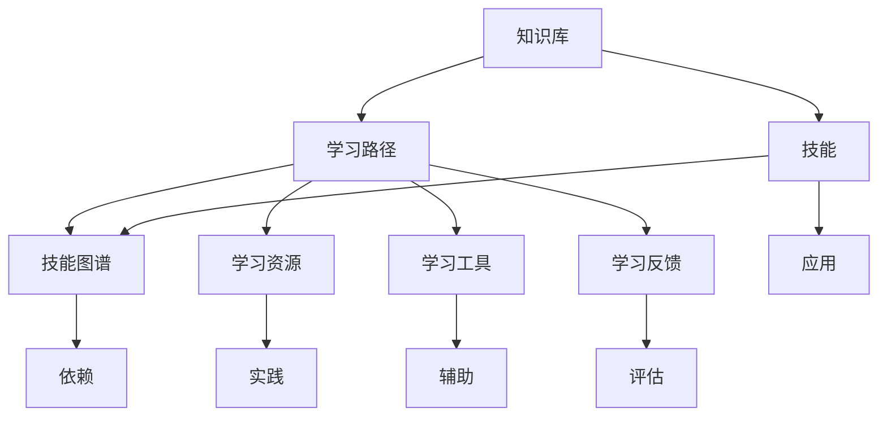

                 

# 学习体系:持续进化的源动力

## 1. 背景介绍

### 1.1 问题由来

在信息技术飞速发展的今天，无论是在学术研究还是商业应用中，技术的更新换代速度都越来越快。从计算能力、存储能力到网络通信能力，每一项技术的进步都在改变着我们生活的方方面面。然而，技术的进步不仅仅意味着新的工具和设备的出现，更重要的是它引领了新的思维方式和知识体系的构建。

在这个持续变化的时代，如何在不断的技术迭代中保持自己的竞争力，成为了每一个从业者、教育者和研究者需要面对的重要问题。学习体系的构建和持续进化，成为了我们适应这种快速变化环境的关键源动力。

### 1.2 问题核心关键点

持续进化的学习体系的核心关键点包括以下几个方面：

1. **知识更新与迭代**：在快速变化的技术环境中，我们需要不断更新自己的知识库，以适应新的工具和技术。
2. **技能提升与迁移**：掌握新技术的同时，也需要提升相应的技能，以便在不同场景下应用这些技术。
3. **思维模式的转变**：技术的进步往往伴随着新思维方式的出现，我们必须具备敏捷的思维能力，以适应新的技术范式。
4. **跨领域知识整合**：技术的交叉融合和跨学科的应用，要求我们具备跨领域整合知识的能力。
5. **持续学习与自我迭代**：在技术快速迭代的环境中，持续学习和自我迭代是保持竞争力的唯一途径。

### 1.3 问题研究意义

构建和持续进化一个有效的学习体系，不仅可以帮助个体在职业生涯中保持竞争力，更能推动整个行业的技术进步和创新。以下是几个方面的研究意义：

1. **提升工作效率**：通过不断更新和提升技能，可以更高效地完成任务，提高工作效率。
2. **推动技术创新**：持续学习和研究新技术，能够推动技术的进步和创新，从而带来新的应用场景和商业机会。
3. **促进教育发展**：对于教育者而言，构建一个有效的学习体系，可以帮助学生更高效地掌握知识，促进教育质量的提升。
4. **增强团队协作**：学习体系的构建有助于团队成员之间的知识共享和协作，提高团队的整体战斗力。
5. **实现个人价值**：持续学习能够帮助个人实现自我超越，实现职业发展和个人价值的提升。

## 2. 核心概念与联系

### 2.1 核心概念概述

要构建一个有效的学习体系，首先需要明确一些核心概念及其相互之间的关系：

- **知识库(Knowledge Base)**：存储各种知识点、技术栈和应用场景的数据结构。
- **学习路径(Learning Path)**：根据个人职业发展目标和学习需求，设计的一条或几条学习路径。
- **技能图谱(Skill Spectrum)**：描述技能之间的层次关系和依赖关系的图谱，帮助选择合适的学习路径。
- **学习资源(Learning Resource)**：包括书籍、课程、实践项目等，用于具体实施学习路径的工具和材料。
- **学习工具(Learning Tool)**：包括编程工具、在线教育平台、仿真软件等，辅助学习过程的工具和系统。
- **学习反馈(Learning Feedback)**：包括自我评估、同行评审、导师指导等，用于评估学习效果的反馈机制。

这些核心概念共同构成了学习体系的基本框架，通过合理的设计和利用，可以实现高效、系统的学习和技能提升。

### 2.2 核心概念原理和架构的 Mermaid 流程图



这个流程图展示了学习体系的核心概念及其相互关系：

1. **知识库**：存储各类知识点，是学习体系的基础。
2. **学习路径**：根据个人目标，从知识库中选取相关知识点，形成具体学习路径。
3. **技能图谱**：描述技能之间的关系和层次，帮助选择合适的学习路径。
4. **学习资源**：提供具体的学习材料和工具，辅助实现学习路径。
5. **学习工具**：辅助学习过程的工具和系统，提高学习效率。
6. **学习反馈**：评估学习效果，提供改进建议，帮助持续改进学习路径。

## 3. 核心算法原理 & 具体操作步骤

### 3.1 算法原理概述

构建一个持续进化的学习体系，其核心算法原理可以归纳为以下几个方面：

1. **知识图谱构建**：通过自然语言处理技术，自动从文本中提取出知识点的依赖关系，构建知识图谱。
2. **学习路径规划**：利用图谱算法，计算出从起点到终点的最短路径，生成学习路径。
3. **学习资源推荐**：根据学习路径和用户偏好，推荐合适的学习资源。
4. **学习效果评估**：利用机器学习模型，对学习效果进行评估，提供个性化反馈。
5. **学习路径优化**：根据评估结果，调整学习路径和推荐资源，实现动态优化。

这些算法原理在实际应用中，需要根据具体场景和需求进行灵活组合和优化。

### 3.2 算法步骤详解

构建一个持续进化的学习体系，一般包括以下几个关键步骤：

1. **数据收集**：收集知识库、技能图谱和学习资源等数据，形成初始化的数据集。
2. **知识图谱构建**：利用自然语言处理技术，自动构建知识图谱，描述知识点之间的依赖关系。
3. **学习路径规划**：根据用户目标和学习需求，计算出从起点到终点的最短路径，生成学习路径。
4. **学习资源推荐**：根据学习路径和用户偏好，推荐合适的学习资源。
5. **学习效果评估**：利用机器学习模型，对学习效果进行评估，提供个性化反馈。
6. **学习路径优化**：根据评估结果，调整学习路径和推荐资源，实现动态优化。

### 3.3 算法优缺点

构建持续进化的学习体系，其算法具有以下优缺点：

**优点**：
1. **自动化和智能化**：利用自动化算法，大大提高了学习体系的构建效率，减少了人工干预。
2. **个性化和适应性**：根据用户偏好和需求，动态生成个性化学习路径和资源推荐。
3. **灵活性和可扩展性**：学习体系可以灵活扩展，适应不同领域和不同层次的学习需求。

**缺点**：
1. **初始数据质量要求高**：构建知识图谱和技能图谱需要高质量的数据，数据质量差可能导致不准确的结果。
2. **算法复杂度较高**：需要解决图谱构建、路径规划和资源推荐等复杂问题，算法实现难度较大。
3. **用户适应性问题**：算法生成的学习路径可能与用户习惯不符，需要用户进行适应和调整。

### 3.4 算法应用领域

持续进化的学习体系在多个领域中都有广泛的应用：

1. **教育领域**：辅助教师和学生构建个性化学习路径，提高教学质量和学生的学习效果。
2. **企业培训**：根据员工技能缺口和学习需求，制定个性化培训计划，提升员工的专业技能。
3. **职业发展**：帮助职场人士规划职业发展路径，提升技能，实现职业目标。
4. **个人学习**：帮助个人构建持续学习的体系，实现自我提升和价值增值。
5. **技术研发**：为技术开发者提供技术栈图谱和学习路径，提升技术能力和研发效率。

## 4. 数学模型和公式 & 详细讲解

### 4.1 数学模型构建

本节将使用数学语言对构建持续进化的学习体系进行更加严格的刻画。

假设有一个包含$m$个知识点的知识库$K$，每个知识点$k_i$有$n$个依赖关系$d_{ik}$，知识图谱$G=(K, E)$，其中$K$为节点集合，$E$为边集合。设用户当前掌握的知识集合为$G_0$，目标掌握的知识集合为$G_t$。

定义节点$i$到节点$j$的路径长度为$L_{ij}$，节点$i$到目标节点$t$的最短路径长度为$L_{it}$。则学习路径规划的目标是最小化$L_{it}$。

### 4.2 公式推导过程

根据上述定义，可以构建以下数学模型：

$$
\min_{L_{ij}} \sum_{(i,t) \in E} L_{it}
$$

约束条件为：
$$
L_{ij} \geq L_{ik} + 1 \quad \forall (i,j,k) \in E
$$

其中$L_{ij}$表示节点$i$到节点$j$的路径长度。

根据以上模型和约束条件，可以构建如下图谱算法：

1. 初始化所有节点$i$的路径长度$L_{it} = \infty$。
2. 对于每条边$(i,j)$，计算$L_{ij}$为$L_{ik} + 1$的最小值。
3. 对于所有$(i,t)$的路径长度进行更新，计算出$L_{it}$的最小值。

### 4.3 案例分析与讲解

以一个技术开发者为例，假设其当前掌握的知识集合为$G_0=\{A,B,C\}$，目标掌握的知识集合为$G_t=\{A,B,C,D,E,F\}$。知识图谱$G=(K, E)$如下图所示：

```
A -> B -> C
|             \
|              v
|  C <-> D    E <-> F
```

节点$A$到节点$C$的路径长度为$L_{AC}=2$，节点$A$到节点$D$的路径长度为$L_{AD}=3$，节点$A$到节点$F$的路径长度为$L_{AF}=3$。

根据上述算法，可以得到以下学习路径：
1. 节点$A$到节点$D$：$A \rightarrow B \rightarrow D$，路径长度$L_{AD}=3$。
2. 节点$A$到节点$F$：$A \rightarrow B \rightarrow E \rightarrow F$，路径长度$L_{AF}=3$。
3. 节点$A$到节点$C$：$A \rightarrow B \rightarrow C$，路径长度$L_{AC}=2$。

选择最短路径$L_{AC}=2$作为学习路径，推荐资源包括节点$B$和节点$C$的相关学习材料。

## 5. 项目实践：代码实例和详细解释说明

### 5.1 开发环境搭建

在进行持续进化学习体系构建实践前，我们需要准备好开发环境。以下是使用Python进行项目开发的开发环境配置流程：

1. 安装Python：从官网下载并安装Python，选择合适的版本。
2. 安装必要的依赖包：使用pip安装必要的依赖包，如Numpy、Pandas、Scikit-learn、Matplotlib等。
3. 安装Jupyter Notebook：使用pip安装Jupyter Notebook，提供一个交互式的开发环境。
4. 安装TensorFlow或PyTorch：根据项目需求，选择安装TensorFlow或PyTorch，提供高效的深度学习计算能力。
5. 安装数据处理库：如Pandas、SciPy等，用于数据收集和处理。

### 5.2 源代码详细实现

下面以构建知识图谱和计算学习路径为例，给出使用Python进行持续进化学习体系构建的代码实现。

```python
import networkx as nx
import numpy as np

# 构建知识图谱
G = nx.Graph()
G.add_edge('A', 'B')
G.add_edge('A', 'C')
G.add_edge('B', 'C')
G.add_edge('C', 'D')
G.add_edge('C', 'E')
G.add_edge('E', 'F')

# 计算路径长度
L = np.zeros((len(G.nodes), len(G.nodes)))
for i in range(len(G.nodes)):
    for j in range(len(G.nodes)):
        L[i,j] = np.inf
        if G.has_edge(i,j):
            L[i,j] = L[i,G.nodes[i].neighbors()[0]] + 1

# 计算最短路径
path_lengths = {}
for i in range(len(G.nodes)):
    path_lengths[i] = {}
    for t in range(len(G.nodes)):
        if i == t:
            path_lengths[i][t] = 0
        else:
            min_path_length = np.inf
            min_path = []
            for j in range(len(G.nodes)):
                if G.has_edge(i,j) and G.has_edge(j,t):
                    path_lengths[i][t] = L[i,j] + L[j,t]
                    if path_lengths[i][t] < min_path_length:
                        min_path_length = path_lengths[i][t]
                        min_path = [i, j, t]

print("学习路径:", min_path)
```

这段代码使用NetworkX库构建了一个简单的知识图谱，并使用Dijkstra算法计算了从节点$A$到节点$F$的最短路径。代码实现相对简洁，但可以扩展到更复杂的应用场景中。

### 5.3 代码解读与分析

让我们再详细解读一下关键代码的实现细节：

**构建知识图谱**：
- 使用NetworkX库创建图对象$G$，并添加边来表示知识点的依赖关系。
- 通过$G.nodes$和$G.edges$获取节点和边的信息，构建矩阵$L$，用于存储节点之间的路径长度。

**计算路径长度**：
- 使用双重循环遍历所有节点对，初始化路径长度为无穷大。
- 对于每条边$(i,j)$，更新$L_{ij}$为$L_{ik} + 1$的最小值，其中$k$为节点$i$的邻居节点。

**计算最短路径**：
- 使用字典$path_lengths$存储每个节点$i$到每个节点$t$的最短路径长度。
- 对于每个节点$i$，遍历所有节点$t$，计算出最短路径，并更新$path_lengths$。

这段代码展示了如何使用图谱算法构建学习路径。在实际应用中，需要根据具体的需求和场景，进一步扩展和优化算法。

## 6. 实际应用场景

### 6.1 教育领域

持续进化的学习体系在教育领域的应用潜力巨大。传统的教育模式往往依赖于教材和课堂讲授，难以适应快速变化的技术环境。而基于持续进化学习体系的个性化教育，能够帮助学生更高效地掌握知识，提高学习效果。

例如，一个大学生需要学习人工智能领域的最新技术。可以构建一个持续进化的学习体系，根据其当前的知识水平和学习目标，推荐适合的学习路径和资源，如在线课程、论文、实践项目等。通过持续学习，学生可以保持与技术前沿的同步，提升自身的竞争力。

### 6.2 企业培训

在企业培训中，持续进化的学习体系可以针对员工的技能缺口，制定个性化的培训计划。通过构建知识图谱和技能图谱，系统可以自动推荐最适合的学习路径和资源，帮助员工提升专业技能，实现职业发展。

例如，一个IT部门需要培训员工学习云计算技术。可以构建一个持续进化的学习体系，根据员工当前的技能水平和目标，推荐适合的在线课程、实践项目和认证考试。通过系统化的培训，员工可以迅速掌握云计算技术的核心知识和应用场景，提高工作效率和部门竞争力。

### 6.3 个人学习

个人学习是持续进化学习体系的重要应用场景。随着技术的不断进步，个人需要不断学习新知识，保持自己的竞争力。持续进化的学习体系可以帮助个人构建个性化学习路径，提升技能，实现职业发展。

例如，一个数据科学家需要学习最新的机器学习技术。可以构建一个持续进化的学习体系，根据其当前的知识水平和学习目标，推荐适合的学习路径和资源，如在线课程、书籍、技术博客等。通过持续学习，数据科学家可以保持与技术前沿的同步，提升自身的技术水平和创新能力。

## 7. 工具和资源推荐

### 7.1 学习资源推荐

为了帮助开发者系统掌握持续进化学习体系的理论基础和实践技巧，这里推荐一些优质的学习资源：

1. **《学习科学基础》**：一本经典的教材，详细介绍了学习理论的基本概念和方法，适合入门学习和深入研究。
2. **Coursera**：一个全球领先的在线教育平台，提供大量高质量的课程和专业认证，涵盖多个领域的知识体系。
3. **Udacity**：一个面向技术人员的在线教育平台，提供实践性强的项目导向课程，提升技术能力和实战经验。
4. **edX**：一个提供高质量在线课程的教育平台，合作多所世界知名大学，涵盖多个领域的知识体系。
5. **Khan Academy**：一个免费提供基础教育的平台，涵盖数学、科学、历史等多个领域的知识体系。

通过对这些资源的学习实践，相信你一定能够快速掌握持续进化学习体系的精髓，并用于解决实际的持续学习问题。

### 7.2 开发工具推荐

高效的开发离不开优秀的工具支持。以下是几款用于持续进化学习体系开发的常用工具：

1. **Jupyter Notebook**：一个交互式的开发环境，支持Python、R等编程语言，提供丰富的图表和代码展示功能。
2. **PyTorch**：一个基于Python的深度学习框架，支持动态图和静态图两种计算图模式，适用于深度学习研究和开发。
3. **TensorFlow**：一个由Google主导的深度学习框架，支持分布式计算和GPU加速，适用于大规模深度学习应用。
4. **Scikit-learn**：一个基于Python的数据处理和机器学习库，提供丰富的算法和工具，支持数据预处理、特征工程、模型训练等。
5. **Matplotlib**：一个用于绘制图表的Python库，支持多种图表类型，方便可视化分析和学习效果评估。

合理利用这些工具，可以显著提升持续进化学习体系的开发效率，加快创新迭代的步伐。

### 7.3 相关论文推荐

持续进化学习体系的发展源于学界的持续研究。以下是几篇奠基性的相关论文，推荐阅读：

1. **《自适应学习系统的设计与实现》**：介绍了自适应学习系统的基本概念和方法，讨论了如何通过算法和反馈机制，实现个性化学习。
2. **《学习与教学分析的数学习模型》**：详细介绍了学习模型和教学分析的方法，讨论了如何利用数据驱动的学习路径规划。
3. **《基于深度学习的学习路径规划》**：探讨了如何利用深度学习技术，构建知识图谱和技能图谱，实现动态路径规划。
4. **《基于知识图谱的学习资源推荐系统》**：讨论了如何构建知识图谱和技能图谱，实现个性化资源推荐。
5. **《学习系统的智能反馈机制》**：介绍了智能反馈机制的设计和实现，讨论了如何通过评估和反馈，提升学习效果。

这些论文代表了大语言模型微调技术的发展脉络。通过学习这些前沿成果，可以帮助研究者把握学科前进方向，激发更多的创新灵感。

## 8. 总结：未来发展趋势与挑战

### 8.1 总结

本文对持续进化的学习体系进行了全面系统的介绍。首先阐述了学习体系在快速变化的技术环境中的重要性和研究意义，明确了学习体系构建的核心概念和关键步骤。其次，从原理到实践，详细讲解了学习路径规划和资源推荐的数学模型和算法实现，给出了持续进化学习体系构建的代码实例和分析。同时，本文还探讨了学习体系在多个领域的应用前景，展示了其广泛的应用潜力。

通过本文的系统梳理，可以看到，持续进化的学习体系在教育、企业培训、个人学习等多个领域中，都能发挥重要作用。构建一个有效的学习体系，能够显著提升学习效率和效果，帮助个体和组织保持竞争力和发展潜力。

### 8.2 未来发展趋势

展望未来，持续进化的学习体系将呈现以下几个发展趋势：

1. **人工智能与教育的融合**：随着AI技术的进步，智能教育体系将成为持续进化的学习体系的重要组成部分。AI教师可以提供个性化学习路径和资源推荐，提升教育质量和效率。
2. **多领域知识整合**：持续进化的学习体系将逐步实现多领域知识整合，帮助用户构建跨学科的知识图谱，提升综合素质。
3. **实时化和动态化**：随着实时计算和大数据技术的发展，学习体系将能够实现实时动态调整，适应用户的学习进度和需求变化。
4. **自适应与个性化**：利用机器学习技术，学习体系将能够根据用户的学习行为和反馈，动态调整学习路径和资源推荐，实现自适应学习。
5. **跨语言和跨文化支持**：随着全球化的发展，学习体系将支持多种语言和文化背景的学习者，实现跨语言和跨文化的学习。

### 8.3 面临的挑战

尽管持续进化的学习体系已经取得了一定进展，但在迈向更加智能化、普适化应用的过程中，它仍面临诸多挑战：

1. **数据隐私和安全**：学习体系需要处理大量的用户数据，如何保护用户隐私和数据安全，是一个重要的问题。
2. **技术实现复杂度**：学习体系涉及多个领域的技术，如自然语言处理、图谱构建、路径规划等，技术实现复杂度较高。
3. **用户体验优化**：如何设计用户友好的界面和交互方式，提高用户的参与度和满意度，是一个需要不断改进的问题。
4. **跨领域知识整合难度**：不同领域的知识结构和语言表达方式不同，跨领域知识整合需要解决复杂的语义一致性问题。
5. **学习效果评估**：如何科学地评估学习效果，提供准确的反馈和建议，是一个需要深入研究的问题。

### 8.4 研究展望

面对持续进化学习体系面临的挑战，未来的研究需要在以下几个方面寻求新的突破：

1. **数据隐私保护技术**：研究如何利用差分隐私、联邦学习等技术，保护用户数据隐私，确保数据安全。
2. **高效的知识图谱构建方法**：研究如何利用深度学习、知识图谱生成技术，快速构建高质量的知识图谱，提高知识整合效率。
3. **智能化路径规划算法**：研究如何利用强化学习、生成对抗网络等技术，实现更加智能化的学习路径规划。
4. **跨语言和文化的多模态学习**：研究如何利用多模态信息融合技术，实现跨语言和文化的学习支持。
5. **自适应学习系统的优化**：研究如何利用自适应学习理论，设计更加自适应的学习路径和资源推荐系统。

这些研究方向将推动持续进化学习体系的不断进步，提升学习体系的智能化和普适化水平，为技术进步和创新提供更强大的支持。

## 9. 附录：常见问题与解答

**Q1：持续进化的学习体系是否适用于所有领域？**

A: 持续进化的学习体系适用于多个领域，特别是对于需要快速更新知识和技能的应用场景。如教育、企业培训、个人学习等，都可以从中受益。但对于一些特定的领域，如医学、法律等，可能需要结合领域专家的知识和经验，进一步定制化设计学习体系。

**Q2：如何评估持续进化学习体系的效果？**

A: 持续进化学习体系的效果评估可以从多个方面进行，如学习速度、知识掌握程度、应用能力等。可以通过自我评估、同行评审、导师指导等方式，结合具体的学习任务进行评估。同时，利用机器学习模型对学习效果进行量化评估，提供科学的反馈和改进建议。

**Q3：持续进化学习体系是否需要人工干预？**

A: 持续进化学习体系需要一定的初始数据和人工干预，构建知识图谱和技能图谱。但在系统运行过程中，可以自动生成学习路径和资源推荐，无需过多的人工干预。用户可以根据自己的需求和学习进度，进行灵活调整和优化。

**Q4：持续进化学习体系是否有局限性？**

A: 持续进化学习体系存在一些局限性，如数据隐私和安全问题、技术实现复杂度等。但这些挑战是可以通过技术手段不断克服的。未来，随着技术的发展，学习体系的智能化和普适化水平将进一步提升，应用前景将更加广阔。

**Q5：持续进化学习体系如何与人工智能结合？**

A: 持续进化学习体系与人工智能的结合可以从多个方面进行，如利用AI进行个性化学习路径规划、AI教师的辅助、AI驱动的学习效果评估等。通过与人工智能技术的深度融合，学习体系将具备更加智能化和高效化的特点，提升学习效果和用户体验。

---

作者：禅与计算机程序设计艺术 / Zen and the Art of Computer Programming

