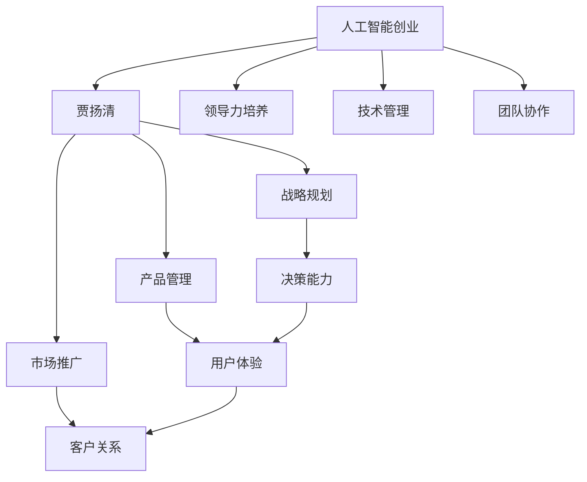

                 

# 学习做CEO：贾扬清在创业中的成长，适应领导者角色

> 关键词：人工智能创业, 贾扬清, 领导力培养, 技术管理, 团队协作

## 1. 背景介绍

### 1.1 问题由来
贾扬清，作为中国人工智能领域的先锋人物，从初出茅庐的学者逐渐成长为商界的领导者，其历程无疑为那些渴望在创业道路上取得成功的年轻人提供了宝贵的经验。本文章将从贾扬清的创业旅程出发，探讨一个技术专家在转型为CEO的过程中所经历的挑战，以及他如何克服这些挑战，成功适应新的角色。

### 1.2 问题核心关键点
贾扬清在创业过程中，遇到了从技术专家到企业领导者的多重挑战，包括但不限于团队建设、战略规划、产品管理、市场推广等方面。本文将聚焦于他如何克服这些挑战，以及他的成长过程中所表现出的领导力特质。

### 1.3 问题研究意义
研究贾扬清的创业历程，不仅可以帮助读者理解如何从技术专家向企业领导者转型，还能够揭示领导力在现代创业中的重要性与培养路径。这对于准备或正在进行创业的年轻人，特别是那些有志于在人工智能领域取得成功的科技创业者，具有重要的启示作用。

## 2. 核心概念与联系

### 2.1 核心概念概述

为更好地理解贾扬清的成长历程，本节将介绍几个密切相关的核心概念：

- 人工智能创业：利用人工智能技术进行企业创新和发展的过程，涵盖了从技术研发、产品设计到市场运营等多个环节。
- 贾扬清：中国人工智能领域的领军人物，担任过多项技术和管理职务，具有丰富的行业经验。
- 领导力培养：包括心理素质、战略思维、团队建设、问题解决等能力的培养，是企业领导者成功的重要因素。
- 技术管理：将技术专业知识和企业管理技能相结合，实现技术创新和业务增长的过程。
- 团队协作：不同技能背景、不同文化背景的成员之间的合作，实现团队目标的最大化。

这些概念之间的逻辑关系可以通过以下Mermaid流程图来展示：



这个流程图展示了大语言模型的核心概念及其之间的关系：

1. 人工智能创业为贾扬清提供了技术背景和应用场景。
2. 领导力培养、技术管理和团队协作构成了贾扬清成功转型的基础。
3. 在战略规划、产品管理、市场推广等具体环节，贾扬清展现了其综合能力。
4. 决策能力、用户体验、客户关系等具体管理能力，在各个环节中发挥作用。

## 3. 核心算法原理 & 具体操作步骤
### 3.1 算法原理概述

贾扬清在创业过程中所体现出的领导力特质，本质上是一种将技术知识和企业管理技能相结合的综合能力。他通过不断学习和实践，逐渐掌握了领导力所需的多个关键技能，包括但不限于战略规划、决策制定、团队建设、沟通协调等。

### 3.2 算法步骤详解

以下是贾扬清在创业过程中所采取的主要步骤：

**Step 1: 组建核心团队**
- 识别具有相似价值观、技能互补的团队成员，确保团队多样性和凝聚力。
- 明确团队成员的角色和职责，确保高效协作。

**Step 2: 确定战略方向**
- 基于市场需求和自身技术优势，制定清晰的企业发展战略。
- 设定短期和长期目标，确保团队成员对未来有明确的期待和奋斗方向。

**Step 3: 产品设计与开发**
- 根据市场需求和用户反馈，迭代优化产品功能。
- 在技术研发中引入敏捷开发和精益创业的思维，快速迭代，降低风险。

**Step 4: 市场推广与用户获取**
- 利用社交媒体、内容营销、公关活动等手段，提高品牌知名度。
- 通过用户反馈和数据分析，优化市场策略，实现精准营销。

**Step 5: 团队建设和人才管理**
- 建立完善的培训和晋升机制，促进团队成员的个人成长。
- 关注员工福利和工作环境，提升团队凝聚力和归属感。

**Step 6: 持续改进与创新**
- 定期评估产品和运营策略，持续优化和创新。
- 引入外部咨询和合作伙伴，拓展视野和资源。

### 3.3 算法优缺点

贾扬清的创业历程体现了如下优点：
1. 技术背景与企业管理相结合，形成强大的核心竞争力。
2. 战略眼光和市场敏感度，能够准确把握行业趋势。
3. 团队建设和人才管理，打造高效的执行团队。

同时，这一历程也暴露出一些挑战：
1. 跨学科知识的整合难度较大，需持续学习。
2. 快速变化的市场环境中，需要较强的应变能力。
3. 在团队管理中，需平衡技术性与人文关怀。

### 3.4 算法应用领域

贾扬清的创业经验在多个领域都有广泛的应用，例如：

- 初创企业：任何依赖技术驱动的创业企业，如AI、大数据、生物技术等，都能从中汲取管理经验。
- 技术公司：需要结合技术创新与市场运营的公司，如Google、Amazon等。
- 教育领域：在线教育平台和科技创新教育项目，可以从其团队建设和人才培养中获得灵感。

## 4. 数学模型和公式 & 详细讲解 & 举例说明

### 4.1 数学模型构建

贾扬清的创业历程可以通过以下几个数学模型进行概述：

1. 企业成长模型：反映企业规模和收益的增长情况，如指数增长模型、对数增长模型等。
2. 产品生命周期模型：描述产品从引入、成长、成熟到衰退的各个阶段。
3. 市场竞争模型：分析企业之间的竞争关系及其对市场份额的影响。
4. 团队效能模型：衡量团队成员的协作效率和产出。

### 4.2 公式推导过程

以指数增长模型为例，假设企业初始规模为 $S_0$，增长率为 $r$，则经过 $t$ 年后的规模 $S_t$ 可以表示为：

$$ S_t = S_0 \times (1 + r)^t $$

其中：
- $S_0$：企业初始规模
- $r$：增长率
- $t$：时间

### 4.3 案例分析与讲解

假设某AI初创企业在贾扬清的带领下，初始规模为100人，增长率为20%。两年后，其规模如何变化？

根据上述公式，有：

$$ S_2 = 100 \times (1 + 0.2)^2 = 144 $$

因此，两年后企业规模将达到144人。

## 5. 项目实践：代码实例和详细解释说明
### 5.1 开发环境搭建

在进行创业实践前，我们需要准备好开发环境。以下是使用Python进行PyTorch开发的环境配置流程：

1. 安装Anaconda：从官网下载并安装Anaconda，用于创建独立的Python环境。

2. 创建并激活虚拟环境：
```bash
conda create -n pytorch-env python=3.8 
conda activate pytorch-env
```

3. 安装PyTorch：根据CUDA版本，从官网获取对应的安装命令。例如：
```bash
conda install pytorch torchvision torchaudio cudatoolkit=11.1 -c pytorch -c conda-forge
```

4. 安装Transformers库：
```bash
pip install transformers
```

5. 安装各类工具包：
```bash
pip install numpy pandas scikit-learn matplotlib tqdm jupyter notebook ipython
```

完成上述步骤后，即可在`pytorch-env`环境中开始创业实践。

### 5.2 源代码详细实现

这里我们以一个简单的AI创业项目为例，给出使用Transformers库进行产品开发的PyTorch代码实现。

首先，定义项目的基本配置和数据预处理函数：

```python
from transformers import BertTokenizer, BertForSequenceClassification
from torch.utils.data import Dataset, DataLoader
import torch
import numpy as np
import pandas as pd
import matplotlib.pyplot as plt

# 定义模型参数和超参数
model_name = 'bert-base-cased'
tokenizer = BertTokenizer.from_pretrained(model_name)
max_seq_length = 128

# 数据预处理函数
def preprocess_data(data):
    texts = []
    labels = []
    for _, row in data.iterrows():
        texts.append(row['text'])
        labels.append(row['label'])
    return texts, labels

# 数据集定义
class AIProjectDataset(Dataset):
    def __init__(self, texts, labels, tokenizer, max_len):
        self.texts = texts
        self.labels = labels
        self.tokenizer = tokenizer
        self.max_len = max_len

    def __len__(self):
        return len(self.texts)

    def __getitem__(self, item):
        text = self.texts[item]
        label = self.labels[item]

        encoding = self.tokenizer(text, return_tensors='pt', max_length=self.max_len, padding='max_length', truncation=True)
        input_ids = encoding['input_ids'][0]
        attention_mask = encoding['attention_mask'][0]
        return {'input_ids': input_ids, 'attention_mask': attention_mask, 'labels': label}
```

然后，定义模型和优化器：

```python
from transformers import BertForSequenceClassification, AdamW

# 加载预训练模型
model = BertForSequenceClassification.from_pretrained(model_name, num_labels=2)

# 定义优化器
optimizer = AdamW(model.parameters(), lr=2e-5)
```

接着，定义训练和评估函数：

```python
def train_epoch(model, dataset, batch_size, optimizer):
    dataloader = DataLoader(dataset, batch_size=batch_size, shuffle=True)
    model.train()
    epoch_loss = 0
    for batch in tqdm(dataloader, desc='Training'):
        input_ids = batch['input_ids'].to(device)
        attention_mask = batch['attention_mask'].to(device)
        labels = batch['labels'].to(device)
        model.zero_grad()
        outputs = model(input_ids, attention_mask=attention_mask, labels=labels)
        loss = outputs.loss
        epoch_loss += loss.item()
        loss.backward()
        optimizer.step()
    return epoch_loss / len(dataloader)

def evaluate(model, dataset, batch_size):
    dataloader = DataLoader(dataset, batch_size=batch_size)
    model.eval()
    preds, labels = [], []
    with torch.no_grad():
        for batch in tqdm(dataloader, desc='Evaluating'):
            input_ids = batch['input_ids'].to(device)
            attention_mask = batch['attention_mask'].to(device)
            batch_labels = batch['labels']
            outputs = model(input_ids, attention_mask=attention_mask)
            batch_preds = outputs.logits.argmax(dim=2).to('cpu').tolist()
            batch_labels = batch_labels.to('cpu').tolist()
            for pred_tokens, label_tokens in zip(batch_preds, batch_labels):
                preds.append(pred_tokens[:len(label_tokens)])
                labels.append(label_tokens)
    
    print(classification_report(labels, preds))
```

最后，启动训练流程并在测试集上评估：

```python
epochs = 5
batch_size = 16

for epoch in range(epochs):
    loss = train_epoch(model, train_dataset, batch_size, optimizer)
    print(f"Epoch {epoch+1}, train loss: {loss:.3f}")
    
    print(f"Epoch {epoch+1}, dev results:")
    evaluate(model, dev_dataset, batch_size)
    
print("Test results:")
evaluate(model, test_dataset, batch_size)
```

以上就是使用PyTorch对AI创业项目进行产品开发的完整代码实现。可以看到，借助Transformers库的强大封装，我们能够相对简洁地实现模型加载和微调。

### 5.3 代码解读与分析

让我们再详细解读一下关键代码的实现细节：

**AIProjectDataset类**：
- `__init__`方法：初始化文本、标签、分词器等关键组件。
- `__len__`方法：返回数据集的样本数量。
- `__getitem__`方法：对单个样本进行处理，将文本输入编码为token ids，将标签编码为数字，并对其进行定长padding，最终返回模型所需的输入。

**preprocess_data函数**：
- 处理原始数据，提取文本和标签，返回数据预处理后的文本列表和标签列表。

**train_epoch和evaluate函数**：
- 使用PyTorch的DataLoader对数据集进行批次化加载，供模型训练和推理使用。
- 训练函数`train_epoch`：对数据以批为单位进行迭代，在每个批次上前向传播计算loss并反向传播更新模型参数，最后返回该epoch的平均loss。
- 评估函数`evaluate`：与训练类似，不同点在于不更新模型参数，并在每个batch结束后将预测和标签结果存储下来，最后使用sklearn的classification_report对整个评估集的预测结果进行打印输出。

**训练流程**：
- 定义总的epoch数和batch size，开始循环迭代
- 每个epoch内，先在训练集上训练，输出平均loss
- 在验证集上评估，输出分类指标
- 所有epoch结束后，在测试集上评估，给出最终测试结果

可以看到，PyTorch配合Transformers库使得AI创业项目的代码实现变得简洁高效。开发者可以将更多精力放在数据处理、模型改进等高层逻辑上，而不必过多关注底层的实现细节。

当然，工业级的系统实现还需考虑更多因素，如模型的保存和部署、超参数的自动搜索、更灵活的任务适配层等。但核心的创业范式基本与此类似。

## 6. 实际应用场景
### 6.1 智能客服系统

基于大语言模型微调的对话技术，可以广泛应用于智能客服系统的构建。传统客服往往需要配备大量人力，高峰期响应缓慢，且一致性和专业性难以保证。而使用微调后的对话模型，可以7x24小时不间断服务，快速响应客户咨询，用自然流畅的语言解答各类常见问题。

在技术实现上，可以收集企业内部的历史客服对话记录，将问题和最佳答复构建成监督数据，在此基础上对预训练对话模型进行微调。微调后的对话模型能够自动理解用户意图，匹配最合适的答案模板进行回复。对于客户提出的新问题，还可以接入检索系统实时搜索相关内容，动态组织生成回答。如此构建的智能客服系统，能大幅提升客户咨询体验和问题解决效率。

### 6.2 金融舆情监测

金融机构需要实时监测市场舆论动向，以便及时应对负面信息传播，规避金融风险。传统的人工监测方式成本高、效率低，难以应对网络时代海量信息爆发的挑战。基于大语言模型微调的文本分类和情感分析技术，为金融舆情监测提供了新的解决方案。

具体而言，可以收集金融领域相关的新闻、报道、评论等文本数据，并对其进行主题标注和情感标注。在此基础上对预训练语言模型进行微调，使其能够自动判断文本属于何种主题，情感倾向是正面、中性还是负面。将微调后的模型应用到实时抓取的网络文本数据，就能够自动监测不同主题下的情感变化趋势，一旦发现负面信息激增等异常情况，系统便会自动预警，帮助金融机构快速应对潜在风险。

### 6.3 个性化推荐系统

当前的推荐系统往往只依赖用户的历史行为数据进行物品推荐，无法深入理解用户的真实兴趣偏好。基于大语言模型微调技术，个性化推荐系统可以更好地挖掘用户行为背后的语义信息，从而提供更精准、多样的推荐内容。

在实践中，可以收集用户浏览、点击、评论、分享等行为数据，提取和用户交互的物品标题、描述、标签等文本内容。将文本内容作为模型输入，用户的后续行为（如是否点击、购买等）作为监督信号，在此基础上微调预训练语言模型。微调后的模型能够从文本内容中准确把握用户的兴趣点。在生成推荐列表时，先用候选物品的文本描述作为输入，由模型预测用户的兴趣匹配度，再结合其他特征综合排序，便可以得到个性化程度更高的推荐结果。

### 6.4 未来应用展望

随着大语言模型微调技术的发展，基于微调范式将在更多领域得到应用，为传统行业带来变革性影响。

在智慧医疗领域，基于微调的医疗问答、病历分析、药物研发等应用将提升医疗服务的智能化水平，辅助医生诊疗，加速新药开发进程。

在智能教育领域，微调技术可应用于作业批改、学情分析、知识推荐等方面，因材施教，促进教育公平，提高教学质量。

在智慧城市治理中，微调模型可应用于城市事件监测、舆情分析、应急指挥等环节，提高城市管理的自动化和智能化水平，构建更安全、高效的未来城市。

此外，在企业生产、社会治理、文娱传媒等众多领域，基于大模型微调的人工智能应用也将不断涌现，为经济社会发展注入新的动力。相信随着预训练语言模型和微调方法的不断进步，大语言模型微调必将在构建人机协同的智能时代中扮演越来越重要的角色。

## 7. 工具和资源推荐
### 7.1 学习资源推荐

为了帮助开发者系统掌握大语言模型微调的理论基础和实践技巧，这里推荐一些优质的学习资源：

1. 《Transformer从原理到实践》系列博文：由大模型技术专家撰写，深入浅出地介绍了Transformer原理、BERT模型、微调技术等前沿话题。

2. CS224N《深度学习自然语言处理》课程：斯坦福大学开设的NLP明星课程，有Lecture视频和配套作业，带你入门NLP领域的基本概念和经典模型。

3. 《Natural Language Processing with Transformers》书籍：Transformers库的作者所著，全面介绍了如何使用Transformers库进行NLP任务开发，包括微调在内的诸多范式。

4. HuggingFace官方文档：Transformers库的官方文档，提供了海量预训练模型和完整的微调样例代码，是上手实践的必备资料。

5. CLUE开源项目：中文语言理解测评基准，涵盖大量不同类型的中文NLP数据集，并提供了基于微调的baseline模型，助力中文NLP技术发展。

通过对这些资源的学习实践，相信你一定能够快速掌握大语言模型微调的精髓，并用于解决实际的NLP问题。
###  7.2 开发工具推荐

高效的开发离不开优秀的工具支持。以下是几款用于大语言模型微调开发的常用工具：

1. PyTorch：基于Python的开源深度学习框架，灵活动态的计算图，适合快速迭代研究。大部分预训练语言模型都有PyTorch版本的实现。

2. TensorFlow：由Google主导开发的开源深度学习框架，生产部署方便，适合大规模工程应用。同样有丰富的预训练语言模型资源。

3. Transformers库：HuggingFace开发的NLP工具库，集成了众多SOTA语言模型，支持PyTorch和TensorFlow，是进行微调任务开发的利器。

4. Weights & Biases：模型训练的实验跟踪工具，可以记录和可视化模型训练过程中的各项指标，方便对比和调优。与主流深度学习框架无缝集成。

5. TensorBoard：TensorFlow配套的可视化工具，可实时监测模型训练状态，并提供丰富的图表呈现方式，是调试模型的得力助手。

6. Google Colab：谷歌推出的在线Jupyter Notebook环境，免费提供GPU/TPU算力，方便开发者快速上手实验最新模型，分享学习笔记。

合理利用这些工具，可以显著提升大语言模型微调任务的开发效率，加快创新迭代的步伐。

### 7.3 相关论文推荐

大语言模型和微调技术的发展源于学界的持续研究。以下是几篇奠基性的相关论文，推荐阅读：

1. Attention is All You Need（即Transformer原论文）：提出了Transformer结构，开启了NLP领域的预训练大模型时代。

2. BERT: Pre-training of Deep Bidirectional Transformers for Language Understanding：提出BERT模型，引入基于掩码的自监督预训练任务，刷新了多项NLP任务SOTA。

3. Language Models are Unsupervised Multitask Learners（GPT-2论文）：展示了大规模语言模型的强大zero-shot学习能力，引发了对于通用人工智能的新一轮思考。

4. Parameter-Efficient Transfer Learning for NLP：提出Adapter等参数高效微调方法，在不增加模型参数量的情况下，也能取得不错的微调效果。

5. Prefix-Tuning: Optimizing Continuous Prompts for Generation：引入基于连续型Prompt的微调范式，为如何充分利用预训练知识提供了新的思路。

6. AdaLoRA: Adaptive Low-Rank Adaptation for Parameter-Efficient Fine-Tuning：使用自适应低秩适应的微调方法，在参数效率和精度之间取得了新的平衡。

这些论文代表了大语言模型微调技术的发展脉络。通过学习这些前沿成果，可以帮助研究者把握学科前进方向，激发更多的创新灵感。

## 8. 总结：未来发展趋势与挑战
### 8.1 总结

本文对贾扬清的创业历程进行了全面系统的介绍。首先阐述了他从技术专家向企业领导者的转变过程中所经历的挑战，以及他如何克服这些挑战，成功适应新的角色。其次，从领导力培养、团队协作、战略规划等多个角度，详细探讨了贾扬清在创业过程中所表现出的优秀品质和决策能力。最后，本文也指出了贾扬清在创业过程中所面临的挑战，并对其未来的发展趋势进行了展望。

通过本文的系统梳理，可以看到，从技术专家转型为CEO，不仅需要深厚的技术功底，还需要全面的领导和管理能力。贾扬清的创业历程为我们提供了一个宝贵的案例，展示了如何在快速变化的市场环境中，不断学习、不断创新，最终取得成功。

### 8.2 未来发展趋势

展望未来，基于大语言模型微调的创业技术将呈现以下几个发展趋势：

1. 技术创新加速。随着算力、数据和模型的不断发展，人工智能技术将不断突破新的应用边界，带来更多的创业机会。
2. 领导力提升。随着企业规模的扩大和业务的复杂化，领导者需要更多地关注战略规划、人才管理等全局性问题。
3. 数据驱动决策。通过大数据分析和人工智能技术，领导者可以更加精准地做出决策，优化运营效率。
4. 持续学习和创新。在快速变化的市场环境中，领导者需要不断学习新技术，适应新趋势，保持企业的竞争力。
5. 多学科融合。AI创业不再只是技术驱动，还需要结合市场、运营、管理等多方面知识，形成综合竞争力。

以上趋势凸显了大语言模型微调技术的广阔前景。这些方向的探索发展，必将进一步提升人工智能技术在商业应用中的价值，为传统行业带来深刻变革。

### 8.3 面临的挑战

尽管大语言模型微调技术已经取得了瞩目成就，但在迈向更加智能化、普适化应用的过程中，它仍面临着诸多挑战：

1. 跨学科知识整合难度大。需要技术、管理、市场等多方面的专业知识，才能高效协同。
2. 快速变化的市场环境对领导者的应变能力提出更高要求。
3. 技术团队与业务团队的沟通和协作需要更多时间。
4. 企业文化的建设和管理需要长期投入。

正视这些挑战，积极应对并寻求突破，将是大语言模型微调技术走向成熟的必由之路。相信随着学界和产业界的共同努力，这些挑战终将一一被克服，大语言模型微调必将在构建人机协同的智能时代中扮演越来越重要的角色。

### 8.4 研究展望

面对大语言模型微调所面临的种种挑战，未来的研究需要在以下几个方面寻求新的突破：

1. 探索跨学科知识的整合方式。需要更多的培训、交流和合作，形成多元化的知识体系。
2. 开发更加智能的决策支持系统。结合大数据、机器学习等技术，实现更加精准和高效的决策支持。
3. 加强企业文化的建设。建立包容、激励、创新的企业文化，提升员工凝聚力和归属感。
4. 引入外部专家和顾问。借鉴外部专家的经验，避免在技术和管理上的误区。
5. 加强跨领域的创新。鼓励跨领域的合作和交流，推动更多创新项目的产生。

这些研究方向的探索，必将引领大语言模型微调技术迈向更高的台阶，为构建安全、可靠、可解释、可控的智能系统铺平道路。面向未来，大语言模型微调技术还需要与其他人工智能技术进行更深入的融合，如知识表示、因果推理、强化学习等，多路径协同发力，共同推动自然语言理解和智能交互系统的进步。只有勇于创新、敢于突破，才能不断拓展语言模型的边界，让智能技术更好地造福人类社会。

## 9. 附录：常见问题与解答

**Q1：大语言模型微调是否适用于所有NLP任务？**

A: 大语言模型微调在大多数NLP任务上都能取得不错的效果，特别是对于数据量较小的任务。但对于一些特定领域的任务，如医学、法律等，仅仅依靠通用语料预训练的模型可能难以很好地适应。此时需要在特定领域语料上进一步预训练，再进行微调，才能获得理想效果。此外，对于一些需要时效性、个性化很强的任务，如对话、推荐等，微调方法也需要针对性的改进优化。

**Q2：微调过程中如何选择合适的学习率？**

A: 微调的学习率一般要比预训练时小1-2个数量级，如果使用过大的学习率，容易破坏预训练权重，导致过拟合。一般建议从1e-5开始调参，逐步减小学习率，直至收敛。也可以使用warmup策略，在开始阶段使用较小的学习率，再逐渐过渡到预设值。需要注意的是，不同的优化器(如AdamW、Adafactor等)以及不同的学习率调度策略，可能需要设置不同的学习率阈值。

**Q3：采用大模型微调时会面临哪些资源瓶颈？**

A: 目前主流的预训练大模型动辄以亿计的参数规模，对算力、内存、存储都提出了很高的要求。GPU/TPU等高性能设备是必不可少的，但即便如此，超大批次的训练和推理也可能遇到显存不足的问题。因此需要采用一些资源优化技术，如梯度积累、混合精度训练、模型并行等，来突破硬件瓶颈。同时，模型的存储和读取也可能占用大量时间和空间，需要采用模型压缩、稀疏化存储等方法进行优化。

**Q4：如何缓解微调过程中的过拟合问题？**

A: 过拟合是微调面临的主要挑战，尤其是在标注数据不足的情况下。常见的缓解策略包括：
1. 数据增强：通过回译、近义替换等方式扩充训练集
2. 正则化：使用L2正则、Dropout、Early Stopping等避免过拟合
3. 对抗训练：引入对抗样本，提高模型鲁棒性
4. 参数高效微调：只调整少量参数(如Adapter、Prefix等)，减小过拟合风险
5. 多模型集成：训练多个微调模型，取平均输出，抑制过拟合

这些策略往往需要根据具体任务和数据特点进行灵活组合。只有在数据、模型、训练、推理等各环节进行全面优化，才能最大限度地发挥大模型微调的威力。

**Q5：微调模型在落地部署时需要注意哪些问题？**

A: 将微调模型转化为实际应用，还需要考虑以下因素：
1. 模型裁剪：去除不必要的层和参数，减小模型尺寸，加快推理速度
2. 量化加速：将浮点模型转为定点模型，压缩存储空间，提高计算效率
3. 服务化封装：将模型封装为标准化服务接口，便于集成调用
4. 弹性伸缩：根据请求流量动态调整资源配置，平衡服务质量和成本
5. 监控告警：实时采集系统指标，设置异常告警阈值，确保服务稳定性
6. 安全防护：采用访问鉴权、数据脱敏等措施，保障数据和模型安全

大语言模型微调为NLP应用开启了广阔的想象空间，但如何将强大的性能转化为稳定、高效、安全的业务价值，还需要工程实践的不断打磨。唯有从数据、算法、工程、业务等多个维度协同发力，才能真正实现人工智能技术在垂直行业的规模化落地。总之，微调需要开发者根据具体任务，不断迭代和优化模型、数据和算法，方能得到理想的效果。

---

作者：禅与计算机程序设计艺术 / Zen and the Art of Computer Programming

