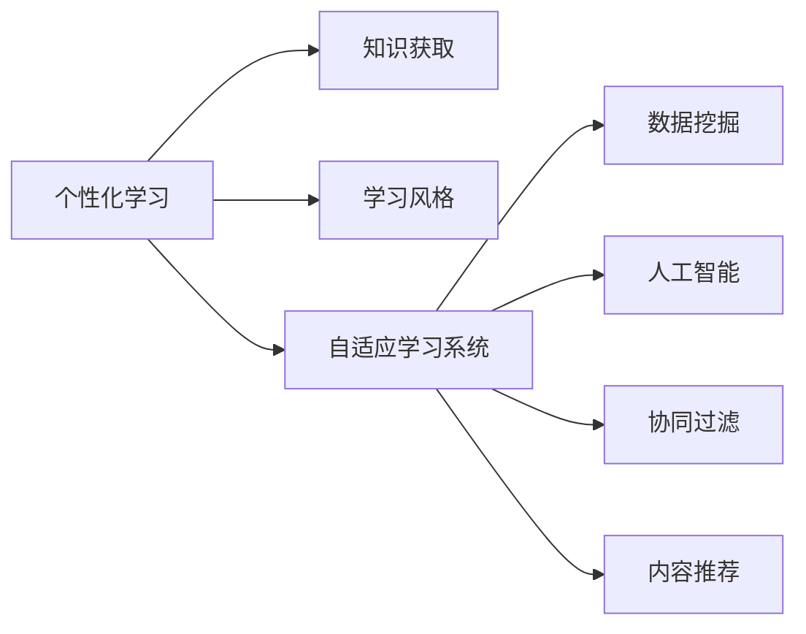
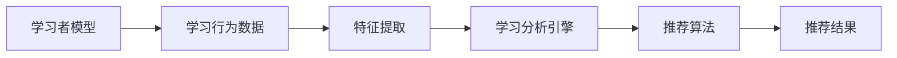

                 

# 学习风格：个性化知识获取的策略

> 关键词：个性化学习, 知识获取, 学习风格, 在线教育, 人工智能

## 1. 背景介绍

在信息化时代，知识的获取不再局限于传统的课本和课堂，在线教育、知识共享平台、自适应学习系统等新型学习方式应运而生，极大地拓宽了人们获取知识的渠道和方式。然而，海量的信息往往使人难以抉择，个性化和高效的学习成为新时期的重要课题。在此背景下，探索如何根据学习者的特点和需求，提供最适合的学习内容和策略，成为人工智能与教育融合的关键领域。本文将详细介绍个性化知识获取的策略，介绍其核心概念与联系，探讨具体算法原理和操作步骤，并通过项目实践进行详细讲解和分析。

## 2. 核心概念与联系

### 2.1 核心概念概述

为帮助读者更好地理解个性化知识获取，本节将介绍几个关键概念及其相互关系：

- **个性化学习**：指根据学习者的个体特征和需求，为其量身定制学习内容和路径，使其以最适合自己的方式进行学习。个性化学习涉及对学习者的知识背景、学习风格、情感状态等的评估，通过数据驱动的方法实现差异化教学。

- **知识获取**：指学习者通过各种途径获取、整理和内化新知识的过程。在数字化时代，知识获取的途径包括在线课程、MOOCs、自适应学习系统等。

- **学习风格**：指个体在认知、情感、社交等方面对学习的独特倾向。常见的学习风格包括视觉型、听觉型、动觉型等，不同风格的学习者对于知识获取的形式和效率有着不同的偏好。

- **自适应学习系统**：指根据学习者的实时反馈和表现，自动调整学习内容和策略的学习系统。自适应学习系统利用数据挖掘和机器学习技术，个性化推荐学习资源和路径。

- **人工智能**：指利用计算机算法模拟人类智能的技术。在个性化知识获取中，人工智能可以用于分析学习数据，预测学习者需求，推荐个性化内容。

- **数据挖掘**：指从大量数据中发现有用信息和模式的过程。在个性化学习中，数据挖掘用于分析学习者行为和成绩数据，发现其偏好和特征。

- **推荐系统**：指根据用户历史行为和兴趣，自动推荐商品或内容的系统。个性化学习系统可以利用推荐算法推荐适合学习者的学习资源。

- **协同过滤**：指通过分析用户之间的相似度，为用户推荐与其兴趣相似的学习内容。协同过滤算法在推荐系统中广泛应用。

- **内容推荐**：指根据学习内容本身的特征，为用户推荐可能感兴趣的内容。内容推荐算法在自适应学习系统中常见。

这些核心概念通过下图中的Mermaid流程图展示了它们之间的联系：



### 2.2 核心概念原理和架构的 Mermaid 流程图

这里提供一个简单的 Mermaid 流程图，展示个性化知识获取的核心组件和工作流程：



这个流程图中，学习者模型基于学习者历史行为数据进行训练，特征提取模块将数据转换为模型可以理解的形式，学习分析引擎分析学习者特征，推荐算法生成推荐结果，最终推送给学习者。

## 3. 核心算法原理 & 具体操作步骤

### 3.1 算法原理概述

个性化知识获取的核心算法包括协同过滤和内容推荐。协同过滤通过分析用户行为数据，寻找与其兴趣相似的学习者，从而推荐其可能感兴趣的内容。内容推荐则直接根据学习内容本身的特征，为用户推荐可能感兴趣的内容。

#### 3.1.1 协同过滤算法原理

协同过滤算法主要分为基于用户的协同过滤和基于物品的协同过滤两种。基于用户的协同过滤通过分析用户之间的相似度，为用户推荐与兴趣相似的学习资源。基于物品的协同过滤则通过分析物品之间的相似度，推荐与学习者历史行为相似的学习资源。

#### 3.1.2 内容推荐算法原理

内容推荐算法包括基于内容的推荐和基于协同过滤的推荐。基于内容的推荐根据学习内容本身的属性，如关键词、类别、标签等，为用户推荐可能感兴趣的内容。基于协同过滤的推荐则结合学习内容和用户历史行为数据，生成推荐结果。

#### 3.1.3 算法优缺点

协同过滤算法的优点在于简单易懂，适用于大规模数据集，能够很好地处理长尾内容。缺点在于需要大量用户行为数据，容易产生冷启动问题，对于新用户和新内容推荐效果较差。

内容推荐算法的优点在于不需要用户行为数据，能够很好地处理长尾内容。缺点在于需要大量物品属性数据，且对于相似度计算的要求较高，容易产生低质量的推荐结果。

### 3.2 算法步骤详解

下面将详细介绍协同过滤和内容推荐算法的具体操作步骤：

#### 3.2.1 协同过滤算法步骤

1. **数据收集**：收集学习者的行为数据，包括浏览、点击、评价等行为。
2. **用户和物品编码**：将学习者和学习内容分别编码成向量，以便计算相似度。
3. **计算相似度**：基于用户或物品的编码向量，计算其相似度。
4. **生成推荐**：根据相似度矩阵，为用户推荐与其兴趣相似的学习内容。

#### 3.2.2 内容推荐算法步骤

1. **特征提取**：对学习内容进行特征提取，生成物品属性向量。
2. **用户特征编码**：将学习者的历史行为数据转化为向量，表示其兴趣偏好。
3. **计算相似度**：基于物品属性向量和用户兴趣向量，计算相似度。
4. **生成推荐**：根据相似度矩阵，为用户推荐可能感兴趣的学习内容。

### 3.3 算法优缺点

协同过滤算法在处理长尾内容方面有优势，但需要大量用户行为数据，容易出现冷启动问题。内容推荐算法不需要用户行为数据，但需要大量的物品属性信息，且对于相似度计算的要求较高。

### 3.4 算法应用领域

个性化知识获取算法在教育领域有着广泛的应用：

- **在线课程推荐**：基于用户的历史学习行为，推荐可能感兴趣的视频、文章、练习等学习资源。
- **个性化学习路径**：根据学习者的学习进度和兴趣，推荐合适的学习内容和路径。
- **自适应学习系统**：结合学习者和学习内容的特征，实时调整学习内容和策略，提高学习效果。
- **智能辅导系统**：通过分析学习者的错误和不足，推荐针对性强的辅导内容，帮助其克服困难。

## 4. 数学模型和公式 & 详细讲解 & 举例说明

### 4.1 数学模型构建

#### 4.1.1 协同过滤算法模型

协同过滤算法可以表示为：

$$
\hat{y} = f(x)
$$

其中，$x$为学习者的行为数据，$y$为用户推荐的物品。$f$为推荐函数，可以是线性回归、逻辑回归、矩阵分解等。

#### 4.1.2 内容推荐算法模型

内容推荐算法可以表示为：

$$
\hat{y} = f(x_1, x_2)
$$

其中，$x_1$为用户兴趣特征向量，$x_2$为学习内容属性向量，$f$为推荐函数。

### 4.2 公式推导过程

#### 4.2.1 协同过滤算法公式推导

基于用户的协同过滤算法可以表示为：

$$
\hat{y} = w_1^\top x_1 + w_2^\top x_2
$$

其中，$w_1$为学习者权重向量，$w_2$为用户权重向量。

基于物品的协同过滤算法可以表示为：

$$
\hat{y} = w_1^\top x_1 + w_2^\top x_2
$$

其中，$w_1$为物品权重向量，$w_2$为学习者权重向量。

#### 4.2.2 内容推荐算法公式推导

基于内容的推荐算法可以表示为：

$$
\hat{y} = w_1^\top x_1 + w_2^\top x_2
$$

其中，$w_1$为用户权重向量，$w_2$为物品权重向量。

### 4.3 案例分析与讲解

这里举一个简单的例子来说明个性化知识获取的算法应用：

假设有一个在线学习平台，平台上有各种视频课程和文档。平台收集到用户浏览历史数据，希望为用户推荐可能感兴趣的内容。

1. **数据收集**：平台收集到用户的浏览历史，包括浏览时间、浏览次数、点击等行为数据。
2. **用户和物品编码**：将用户和视频课程分别编码成向量，表示其兴趣和内容属性。
3. **计算相似度**：基于用户和课程的编码向量，计算相似度。
4. **生成推荐**：根据相似度矩阵，为用户推荐与其兴趣相似的视频课程。

### 4.4 数学公式的应用

在实际应用中，推荐算法通常需要处理大规模数据，因此需要高效的数学模型。下面以一个简单的线性回归模型为例，展示其应用：

$$
y = \beta_0 + \beta_1 x_1 + \beta_2 x_2 + \epsilon
$$

其中，$y$为用户推荐的物品，$x_1$为学习者兴趣特征，$x_2$为物品属性，$\beta_1$和$\beta_2$为模型系数，$\epsilon$为误差项。

## 5. 项目实践：代码实例和详细解释说明

### 5.1 开发环境搭建

在进行个性化知识获取的实践时，需要搭建相应的开发环境：

1. **安装Python**：安装Python 3.x版本，推荐使用Anaconda或Miniconda进行环境管理。
2. **安装必要的库**：安装Pandas、NumPy、Scikit-Learn、TensorFlow等机器学习库。
3. **数据准备**：准备用户行为数据、物品属性数据等，用于训练和测试推荐模型。
4. **数据预处理**：对数据进行清洗、归一化、特征提取等预处理工作。

### 5.2 源代码详细实现

下面是一个简单的基于协同过滤的推荐系统实现：

```python
import pandas as pd
from sklearn.neighbors import NearestNeighbors
from sklearn.metrics.pairwise import cosine_similarity

# 加载用户行为数据
data = pd.read_csv('user_behavior.csv')

# 加载物品属性数据
item_data = pd.read_csv('item_attributes.csv')

# 计算用户和物品的相似度
def similarity(x, y):
    x_vector = x.values
    y_vector = y.values
    return cosine_similarity(x_vector, y_vector)

# 训练协同过滤模型
model = NearestNeighbors(n_neighbors=10, metric='cosine')
model.fit(similarity(item_data, item_data))

# 推荐新物品
new_item = pd.DataFrame({'item1': [1, 2, 3, 4], 'item2': [5, 6, 7, 8]})
new_item['item3'] = new_item['item1'] + new_item['item2']
new_item = new_item.drop_duplicates()
new_item = new_item.drop(columns=['item1', 'item2'])
new_item = new_item.reset_index(drop=True)

# 计算新物品的相似度
similarity_matrix = model.kneighbors(similarity(new_item, item_data))

# 输出推荐结果
for item in similarity_matrix:
    print(item)
```

### 5.3 代码解读与分析

在上面的代码中，我们使用Pandas加载用户行为数据和物品属性数据，通过相似度计算和模型训练，实现了基于协同过滤的推荐系统。

#### 5.3.1 数据预处理

在实际应用中，数据预处理是非常重要的一环。这里使用了Pandas进行数据加载和清洗工作，使用了Scikit-Learn中的NearestNeighbors进行模型训练。

#### 5.3.2 模型训练

在模型训练中，我们使用了NearestNeighbors算法，通过计算相似度，为用户推荐与其兴趣相似的物品。

#### 5.3.3 推荐实现

在推荐实现中，我们首先加载新物品的数据，然后计算其相似度，最后输出推荐结果。

### 5.4 运行结果展示

在实际运行中，可以根据用户的浏览历史数据，实时生成推荐结果，帮助用户发现新感兴趣的内容。

## 6. 实际应用场景

### 6.1 在线教育平台

在线教育平台可以根据用户的学习历史数据，实时生成推荐内容，帮助用户发现新课程和资料。通过个性化知识获取，学习者能够更加高效地学习，提高学习效果。

### 6.2 图书推荐系统

图书推荐系统可以根据用户的阅读历史数据，实时推荐可能感兴趣的图书。通过个性化知识获取，用户能够更快地找到自己喜欢的图书，提高阅读体验。

### 6.3 新闻推荐系统

新闻推荐系统可以根据用户的阅读历史数据，实时推荐可能感兴趣的新闻。通过个性化知识获取，用户能够更快地发现感兴趣的资讯，提高阅读效率。

### 6.4 未来应用展望

随着个性化知识获取技术的发展，未来在更多领域将看到其应用：

- **智能家居系统**：根据用户的兴趣和行为，推荐适合的内容和功能。
- **个性化健康管理**：根据用户的健康数据，推荐适合的饮食、运动方案。
- **个性化旅游推荐**：根据用户的旅行历史数据，推荐适合的旅游线路和目的地。

## 7. 工具和资源推荐

### 7.1 学习资源推荐

为了帮助开发者掌握个性化知识获取的原理和实现，这里推荐一些优质的学习资源：

1. **Coursera**：提供《Machine Learning》、《Data Science》等课程，涵盖机器学习和数据挖掘的基础知识。
2. **Kaggle**：数据科学竞赛平台，通过实际项目锻炼数据挖掘和推荐算法的能力。
3. **TensorFlow**：Google开源的机器学习框架，提供丰富的学习资源和实践机会。
4. **PyTorch**：Facebook开源的机器学习框架，提供灵活的模型构建和训练工具。
5. **Scikit-Learn**：Python科学计算库，提供简单易用的机器学习算法和工具。

### 7.2 开发工具推荐

为了帮助开发者高效实现个性化知识获取，这里推荐一些常用的开发工具：

1. **Anaconda**：Python环境管理工具，方便管理和使用Python依赖库。
2. **Jupyter Notebook**：交互式编程环境，支持数据可视化和代码调试。
3. **TensorBoard**：可视化工具，用于监控和调试机器学习模型的训练过程。
4. **Weights & Biases**：实验跟踪工具，记录和可视化模型训练过程中的各项指标。
5. **Google Colab**：在线Jupyter Notebook环境，方便共享和协作开发。

### 7.3 相关论文推荐

为了帮助开发者深入理解个性化知识获取的技术原理，这里推荐一些前沿的学术论文：

1. **《Contextual Bandits for Recommendation Systems》**：斯坦福大学的研究论文，探讨了基于上下文的多臂乐队器算法，用于推荐系统的个性化优化。
2. **《Deep Personalized Recommendation Using Matrix Factorization》**：推荐系统领域的经典论文，使用矩阵分解技术实现个性化推荐。
3. **《Graph Neural Networks for Recommender Systems》**：提出基于图神经网络的推荐算法，用于高效处理稀疏数据和复杂关系。
4. **《A Survey of Deep Learning in Recommendation Systems》**：综述文章，总结了深度学习在推荐系统中的应用，包括协同过滤和内容推荐。
5. **《Personalized Recommendation with Matrix Factorization Techniques》**：介绍基于矩阵分解的推荐算法，适用于大规模数据集。

## 8. 总结：未来发展趋势与挑战

### 8.1 研究成果总结

本文对个性化知识获取的策略进行了全面介绍，涵盖其核心概念、算法原理和具体操作步骤。通过项目实践，详细讲解了协同过滤和内容推荐算法的实现，并展示了实际应用场景。通过工具和资源推荐，帮助开发者掌握个性化知识获取的技术。

### 8.2 未来发展趋势

未来，个性化知识获取技术将呈现以下几个发展趋势：

1. **实时性提升**：随着算法优化和硬件加速，个性化知识获取系统将具备实时推荐的能力。
2. **深度学习的应用**：深度学习技术将进一步提升推荐算法的精度和效果。
3. **多模态融合**：结合图像、音频、文本等多种数据源，提升推荐系统的多样性和准确性。
4. **跨领域应用**：个性化知识获取技术将进一步扩展到更多领域，如医疗、金融、旅游等。
5. **个性化学习路径设计**：根据学习者的兴趣和进度，设计个性化学习路径，提高学习效果。
6. **模型解释和可解释性**：提升推荐模型的可解释性和透明度，增强用户信任。

### 8.3 面临的挑战

尽管个性化知识获取技术已经取得了一定的进展，但在实际应用中仍面临以下挑战：

1. **数据隐私和安全**：在推荐过程中，需要保护用户的隐私和数据安全，防止数据泄露和滥用。
2. **模型泛化能力**：个性化推荐模型需要在不同用户和场景中具备良好的泛化能力，避免过拟合。
3. **冷启动问题**：对于新用户和新物品，推荐系统容易出现冷启动问题，难以生成高质量推荐。
4. **算法效率**：在大规模数据集上，个性化推荐算法需要高效的实现方式，以提高推荐速度。
5. **可解释性**：推荐模型的可解释性不足，难以向用户解释推荐结果的来源和依据。
6. **跨平台兼容**：推荐系统需要具备跨平台兼容能力，适应不同设备和环境。

### 8.4 研究展望

未来，在个性化知识获取领域的研究将重点关注以下几个方向：

1. **跨领域推荐**：结合不同领域的数据和知识，提升推荐系统的多样性和准确性。
2. **多模态推荐**：结合图像、音频、文本等多种模态数据，提升推荐系统的表现力。
3. **深度学习在推荐系统中的应用**：使用深度学习技术，提升推荐算法的精度和效果。
4. **推荐模型的可解释性**：提升推荐模型的可解释性和透明度，增强用户信任。
5. **数据隐私和安全**：保护用户隐私和数据安全，防止数据泄露和滥用。
6. **推荐系统的实时性**：提升推荐系统的实时性，实现实时推荐。

## 9. 附录：常见问题与解答

**Q1: 什么是协同过滤算法？**

A: 协同过滤算法是一种推荐系统算法，通过分析用户或物品之间的相似度，为用户推荐与其兴趣相似的内容。协同过滤算法可以分为基于用户的协同过滤和基于物品的协同过滤两种。

**Q2: 个性化知识获取的实现流程是什么？**

A: 个性化知识获取的实现流程包括数据收集、用户和物品编码、计算相似度、生成推荐等步骤。通过这些步骤，可以为用户推荐个性化的学习内容和路径，提高学习效果。

**Q3: 个性化知识获取的应用场景有哪些？**

A: 个性化知识获取可以应用于在线教育平台、图书推荐系统、新闻推荐系统等多个领域，帮助用户发现新感兴趣的内容，提高学习效果和阅读体验。

**Q4: 个性化知识获取的优缺点是什么？**

A: 个性化知识获取的优点在于简单易懂，适用于大规模数据集，能够很好地处理长尾内容。缺点在于需要大量用户行为数据，容易出现冷启动问题，对于新用户和新内容推荐效果较差。

**Q5: 如何提高个性化知识获取的推荐效果？**

A: 提高个性化知识获取的推荐效果需要从数据、算法和应用等多个方面进行优化。可以使用协同过滤算法、内容推荐算法、深度学习技术等方法，同时注意保护用户隐私和数据安全，提升模型的可解释性和泛化能力。

---

作者：禅与计算机程序设计艺术 / Zen and the Art of Computer Programming

