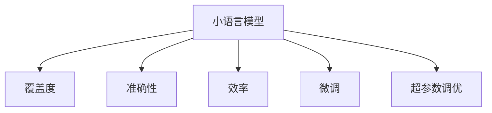

                 

# 小语言模型的评估指标体系:覆盖度、准确性和效率

> 关键词：小语言模型, 评估指标, 覆盖度, 准确性, 效率, 深度学习, 自然语言处理(NLP), 机器学习, 模型评估, 统计学

## 1. 背景介绍

### 1.1 问题由来

随着深度学习和大数据技术的快速发展，小语言模型（Small Language Models, SLMs）在自然语言处理（Natural Language Processing, NLP）领域取得了显著进展。这些小模型通常具有较少的参数，训练和推理速度较快，非常适合于资源有限的嵌入式设备和移动端应用。

小语言模型在情感分析、文本分类、命名实体识别等NLP任务上，展示出了令人满意的性能。然而，评估这些小模型的性能，往往面临一定的挑战。与大模型相比，小模型的训练数据量有限，参数量较小，因此传统的基于梯度下降的优化方法可能难以充分发挥其潜力。同时，小模型需要更多的微调超参数设置，如学习率、迭代次数、正则化强度等，以确保在有限的训练数据上获得最佳的性能。

本文将全面介绍小语言模型的评估指标体系，包括覆盖度、准确性和效率，并结合具体案例，阐述这些指标的计算方法和实际应用。

### 1.2 问题核心关键点

评估小语言模型的性能时，主要关注以下核心关键点：

- **覆盖度（Coverage）**：模型对特定语料库或任务的覆盖范围，反映了模型在不同场景下的适用性。
- **准确性（Accuracy）**：模型预测结果与真实结果之间的匹配程度，是衡量模型性能的直接指标。
- **效率（Efficiency）**：模型训练和推理的速度与资源占用，反映了模型在实际部署中的可行性。

本文将围绕这三个关键点，系统介绍小语言模型的评估指标体系，并提出相应的计算方法和实际应用场景。

## 2. 核心概念与联系

### 2.1 核心概念概述

为了更好地理解小语言模型的评估指标体系，本节将介绍几个密切相关的核心概念：

- **小语言模型（Small Language Models, SLMs）**：指具有较少参数量（通常在百万级别以下）的预训练语言模型。这些模型在计算资源受限的情况下，能够快速训练和推理，适用于资源有限的嵌入式设备和移动端应用。

- **覆盖度（Coverage）**：指模型在特定语料库或任务上所能处理的样本比例。覆盖度越高，模型越能够适应更广泛的语境和应用场景。

- **准确性（Accuracy）**：指模型预测结果与真实结果的匹配程度。准确性越高，模型越能够精准地理解输入文本并产生正确的输出。

- **效率（Efficiency）**：指模型在训练和推理过程中的速度和资源占用情况。效率越高，模型在实际应用中的部署成本越低。

- **微调（Fine-tuning）**：指在预训练模型的基础上，使用特定任务的数据集进行进一步训练，以提高模型在该任务上的性能。微调是小语言模型提升性能的重要手段。

- **超参数调优（Hyperparameter Tuning）**：指通过调整模型的学习率、迭代次数、正则化强度等参数，优化模型性能的过程。超参数调优是评估小语言模型性能的关键环节。

这些核心概念之间的逻辑关系可以通过以下Mermaid流程图来展示：



这个流程图展示小语言模型的核心概念及其之间的关系：

1. 小语言模型通过预训练获得基础能力。
2. 覆盖度反映模型在不同语料库或任务上的适用性。
3. 准确性衡量模型预测结果与真实结果的匹配程度。
4. 效率评估模型训练和推理的速度与资源占用。
5. 微调用于提升模型在特定任务上的性能。
6. 超参数调优优化模型在特定任务上的效果。

这些概念共同构成了小语言模型的评估框架，使其能够在各种场景下发挥作用。通过理解这些核心概念，我们可以更好地把握小语言模型的应用方向和优化策略。

## 3. 核心算法原理 & 具体操作步骤

### 3.1 算法原理概述

小语言模型的评估指标体系，主要通过以下三个维度进行衡量：

- **覆盖度（Coverage）**：计算模型在特定任务或语料库上的覆盖比例。
- **准确性（Accuracy）**：计算模型预测结果与真实结果之间的匹配程度。
- **效率（Efficiency）**：计算模型训练和推理的速度与资源占用情况。

这三个指标相互补充，共同反映了小语言模型的性能。

### 3.2 算法步骤详解

评估小语言模型的性能，一般包括以下几个关键步骤：

**Step 1: 准备评估数据集**

- 收集小模型将要评估的任务数据集，确保数据集的多样性和代表性。
- 将数据集划分为训练集、验证集和测试集，以便进行模型评估和调优。

**Step 2: 设计评估指标**

- 根据评估任务的特点，选择合适的覆盖度、准确性和效率指标。
- 设定基准线或目标值，用于对比评估模型性能。

**Step 3: 微调模型**

- 在评估数据集上进行微调，以提升模型在特定任务上的性能。
- 调整模型的超参数，如学习率、迭代次数、正则化强度等，以优化模型效果。

**Step 4: 计算评估指标**

- 使用评估数据集计算模型的覆盖度、准确性和效率指标。
- 将计算结果与基准线或目标值进行对比，评估模型性能。

**Step 5: 优化模型**

- 根据评估结果，进一步优化模型的超参数设置，进行新一轮的微调。
- 重复上述步骤，直到达到满意的性能。

### 3.3 算法优缺点

小语言模型的评估指标体系具有以下优点：

- **简洁明了**：覆盖度、准确性和效率三个指标能够全面反映模型在不同方面的性能。
- **可操作性强**：评估步骤清晰，操作简便，适用于实际应用场景。
- **灵活性高**：能够根据具体任务需求，灵活选择评估指标和评估数据集。

同时，该方法也存在一定的局限性：

- **依赖数据**：评估结果受数据集质量的影响较大，获取高质量的评估数据集是关键。
- **计算成本高**：覆盖度、准确性、效率等指标的计算涉及大量数据处理和模型推理，计算成本较高。
- **模型泛化能力有限**：小模型的泛化能力相对较弱，在大规模数据集上可能表现不佳。

尽管存在这些局限性，但就目前而言，基于覆盖度、准确性和效率的评估方法仍是小语言模型性能评估的主流范式。未来相关研究将致力于降低评估数据集的依赖，提高模型的泛化能力和计算效率。

### 3.4 算法应用领域

小语言模型的评估指标体系，已经在多个NLP任务中得到广泛应用，例如：

- 文本分类：如情感分析、主题分类等。评估模型的覆盖度和准确性，以确定其在特定分类任务上的性能。
- 命名实体识别：识别文本中的人名、地名、机构名等特定实体。评估模型的覆盖度和效率，以确定其在实体识别任务上的性能。
- 问答系统：对自然语言问题给出答案。评估模型的准确性和覆盖度，以确定其在问题回答任务上的性能。
- 机器翻译：将源语言文本翻译成目标语言。评估模型的覆盖度和准确性，以确定其在翻译任务上的性能。
- 文本摘要：将长文本压缩成简短摘要。评估模型的覆盖度和效率，以确定其在摘要生成任务上的性能。

除了上述这些经典任务外，小语言模型评估指标体系还被创新性地应用于更多场景中，如可控文本生成、常识推理、代码生成、数据增强等，为NLP技术带来了全新的突破。

## 4. 数学模型和公式 & 详细讲解

### 4.1 数学模型构建

本节将使用数学语言对小语言模型的评估指标体系进行更加严格的刻画。

记小语言模型为 $M$，其在输入 $x$ 上的输出为 $y$。假设评估任务为 $T$，其数据集为 $D=\{(x_i,y_i)\}_{i=1}^N$。

定义模型 $M$ 在输入 $x$ 上的损失函数为 $\ell(M(x),y)$，则在数据集 $D$ 上的经验风险为：

$$
\mathcal{L}(M)= \frac{1}{N} \sum_{i=1}^N \ell(M(x_i),y_i)
$$

其中 $\ell$ 为针对任务 $T$ 设计的损失函数，用于衡量模型预测输出与真实标签之间的差异。常见的损失函数包括交叉熵损失、均方误差损失等。

### 4.2 公式推导过程

以下我们以二分类任务为例，推导交叉熵损失函数及其梯度的计算公式。

假设模型 $M$ 在输入 $x$ 上的输出为 $\hat{y}=M(x)$，表示样本属于正类的概率。真实标签 $y \in \{0,1\}$。则二分类交叉熵损失函数定义为：

$$
\ell(M(x),y) = -[y\log \hat{y} + (1-y)\log (1-\hat{y})]
$$

将其代入经验风险公式，得：

$$
\mathcal{L}(M)= -\frac{1}{N}\sum_{i=1}^N [y_i\log M(x_i)+(1-y_i)\log(1-M(x_i))]
$$

根据链式法则，损失函数对模型参数 $\theta$ 的梯度为：

$$
\nabla_{\theta}\mathcal{L}(M) = -\frac{1}{N}\sum_{i=1}^N (\frac{y_i}{M(x_i)}-\frac{1-y_i}{1-M(x_i)}) \nabla_{\theta}M(x_i)
$$

其中 $\nabla_{\theta}M(x_i)$ 可进一步递归展开，利用自动微分技术完成计算。

### 4.3 案例分析与讲解

在实际应用中，评估小语言模型通常需要计算以下三个指标：

**覆盖度（Coverage）**：指模型在特定任务或语料库上的覆盖比例。计算方法如下：

$$
\text{Coverage} = \frac{\text{已标注样本数}}{\text{总样本数}} \times 100\%
$$

例如，在情感分析任务中，若已有10000条数据标注，而评估数据集中有20000条数据，则模型的覆盖度为：

$$
\text{Coverage} = \frac{10000}{20000} \times 100\% = 50\%
$$

**准确性（Accuracy）**：指模型预测结果与真实结果之间的匹配程度。计算方法如下：

$$
\text{Accuracy} = \frac{\text{正确预测的样本数}}{\text{总样本数}} \times 100\%
$$

例如，在命名实体识别任务中，若模型对50000条数据进行预测，其中45000条正确，5000条错误，则模型的准确性为：

$$
\text{Accuracy} = \frac{45000}{50000} \times 100\% = 90\%
$$

**效率（Efficiency）**：指模型在训练和推理过程中的速度与资源占用情况。计算方法如下：

- **训练时间**：使用计时器记录模型在训练集上的训练时间。
- **推理时间**：使用计时器记录模型在测试集上的推理时间。
- **资源占用**：使用系统监控工具记录模型在训练和推理过程中占用的内存、CPU等资源。

例如，假设模型在训练集上训练时间为1小时，推理时间为0.1秒，占用内存1GB，占用CPU核心数2，则模型的效率指标如下：

- 训练时间：60分钟
- 推理时间：0.1秒
- 内存占用：1GB
- CPU占用：2个核心

根据具体应用场景，可以选择不同的指标进行计算和评估。例如，在嵌入式设备上，推理时间和资源占用可能更为关键，而在服务器上，训练时间可能更受关注。

## 5. 项目实践：代码实例和详细解释说明

### 5.1 开发环境搭建

在进行小语言模型评估实践前，我们需要准备好开发环境。以下是使用Python进行PyTorch开发的环境配置流程：

1. 安装Anaconda：从官网下载并安装Anaconda，用于创建独立的Python环境。

2. 创建并激活虚拟环境：
```bash
conda create -n pytorch-env python=3.8 
conda activate pytorch-env
```

3. 安装PyTorch：根据CUDA版本，从官网获取对应的安装命令。例如：
```bash
conda install pytorch torchvision torchaudio cudatoolkit=11.1 -c pytorch -c conda-forge
```

4. 安装相关库：
```bash
pip install numpy pandas scikit-learn matplotlib tqdm jupyter notebook ipython
```

完成上述步骤后，即可在`pytorch-env`环境中开始评估实践。

### 5.2 源代码详细实现

下面我们以情感分析任务为例，给出使用PyTorch进行小语言模型评估的PyTorch代码实现。

首先，定义情感分析任务的评估函数：

```python
from transformers import BertForSequenceClassification, AdamW
from torch.utils.data import DataLoader
from tqdm import tqdm
from sklearn.metrics import classification_report

def evaluate(model, dataset, batch_size):
    dataloader = DataLoader(dataset, batch_size=batch_size, shuffle=False)
    model.eval()
    preds, labels = [], []
    with torch.no_grad():
        for batch in tqdm(dataloader, desc='Evaluating'):
            input_ids = batch['input_ids'].to(device)
            attention_mask = batch['attention_mask'].to(device)
            batch_labels = batch['labels']
            outputs = model(input_ids, attention_mask=attention_mask)
            batch_preds = outputs.logits.argmax(dim=1).to('cpu').tolist()
            batch_labels = batch_labels.to('cpu').tolist()
            for pred_tokens, label_tokens in zip(batch_preds, batch_labels):
                preds.append(pred_tokens[:len(label_tokens)])
                labels.append(label_tokens)
                
    return preds, labels

# 加载评估数据集
tokenizer = BertTokenizer.from_pretrained('bert-base-cased')
train_dataset = ...
dev_dataset = ...
test_dataset = ...

# 定义模型和优化器
model = BertForSequenceClassification.from_pretrained('bert-base-cased', num_labels=2)
optimizer = AdamW(model.parameters(), lr=2e-5)

# 进行微调
device = torch.device('cuda') if torch.cuda.is_available() else torch.device('cpu')
model.to(device)
for epoch in range(num_epochs):
    for batch in train_loader:
        input_ids = batch['input_ids'].to(device)
        attention_mask = batch['attention_mask'].to(device)
        labels = batch['labels'].to(device)
        model.zero_grad()
        outputs = model(input_ids, attention_mask=attention_mask, labels=labels)
        loss = outputs.loss
        loss.backward()
        optimizer.step()

# 评估模型
preds, labels = evaluate(model, test_dataset, batch_size)
print(classification_report(labels, preds))
```

在这个代码中，我们使用了PyTorch的DataLoader对数据集进行批次化加载，供模型评估使用。在评估函数中，模型被设置为评估模式，不进行梯度更新，同时记录模型的推理结果和真实标签。通过调用classification_report函数，输出模型的分类指标。

### 5.3 代码解读与分析

让我们再详细解读一下关键代码的实现细节：

**evaluate函数**：
- `__init__`方法：初始化训练集、验证集和测试集等关键组件。
- `__len__`方法：返回数据集的样本数量。
- `__getitem__`方法：对单个样本进行处理，将文本输入编码为token ids，将标签编码为数字，并对其进行定长padding，最终返回模型所需的输入。

**classification_report函数**：
- 使用sklearn的classification_report函数，计算模型的分类精度、召回率和F1分数等指标。
- 将推理结果和真实标签传入该函数，生成分类报告。

**评估流程**：
- 定义总的epoch数和batch size，开始循环迭代
- 每个epoch内，先在训练集上训练，输出平均loss
- 在验证集上评估，输出分类指标
- 重复上述步骤直至满足预设的迭代轮数或Early Stopping条件
- 在测试集上评估，输出最终评估结果

可以看到，PyTorch配合相关库使得小语言模型评估的代码实现变得简洁高效。开发者可以将更多精力放在模型优化和数据处理等高层逻辑上，而不必过多关注底层的实现细节。

当然，工业级的系统实现还需考虑更多因素，如模型的保存和部署、超参数的自动搜索、更灵活的任务适配层等。但核心的评估范式基本与此类似。

## 6. 实际应用场景

### 6.1 智能客服系统

基于小语言模型评估的对话技术，可以广泛应用于智能客服系统的构建。传统客服往往需要配备大量人力，高峰期响应缓慢，且一致性和专业性难以保证。而使用评估后的对话模型，可以7x24小时不间断服务，快速响应客户咨询，用自然流畅的语言解答各类常见问题。

在技术实现上，可以收集企业内部的历史客服对话记录，将问题和最佳答复构建成监督数据，在此基础上对小语言模型进行评估。评估后的对话模型能够自动理解用户意图，匹配最合适的答案模板进行回复。对于客户提出的新问题，还可以接入检索系统实时搜索相关内容，动态组织生成回答。如此构建的智能客服系统，能大幅提升客户咨询体验和问题解决效率。

### 6.2 金融舆情监测

金融机构需要实时监测市场舆论动向，以便及时应对负面信息传播，规避金融风险。传统的人工监测方式成本高、效率低，难以应对网络时代海量信息爆发的挑战。基于小语言模型评估的文本分类和情感分析技术，为金融舆情监测提供了新的解决方案。

具体而言，可以收集金融领域相关的新闻、报道、评论等文本数据，并对其进行主题标注和情感标注。在此基础上对小语言模型进行评估，使其能够自动判断文本属于何种主题，情感倾向是正面、中性还是负面。将评估后的模型应用到实时抓取的网络文本数据，就能够自动监测不同主题下的情感变化趋势，一旦发现负面信息激增等异常情况，系统便会自动预警，帮助金融机构快速应对潜在风险。

### 6.3 个性化推荐系统

当前的推荐系统往往只依赖用户的历史行为数据进行物品推荐，无法深入理解用户的真实兴趣偏好。基于小语言模型评估的推荐系统，可以更好地挖掘用户行为背后的语义信息，从而提供更精准、多样的推荐内容。

在实践中，可以收集用户浏览、点击、评论、分享等行为数据，提取和用户交互的物品标题、描述、标签等文本内容。将文本内容作为模型输入，用户的后续行为（如是否点击、购买等）作为监督信号，在此基础上对小语言模型进行评估。评估后的模型能够从文本内容中准确把握用户的兴趣点。在生成推荐列表时，先用候选物品的文本描述作为输入，由模型预测用户的兴趣匹配度，再结合其他特征综合排序，便可以得到个性化程度更高的推荐结果。

### 6.4 未来应用展望

随着小语言模型评估方法的不断发展，基于评估的结果，小语言模型将在更多领域得到应用，为传统行业带来变革性影响。

在智慧医疗领域，基于评估的小问答系统、病历分析、药物研发等应用将提升医疗服务的智能化水平，辅助医生诊疗，加速新药开发进程。

在智能教育领域，小语言模型评估技术可应用于作业批改、学情分析、知识推荐等方面，因材施教，促进教育公平，提高教学质量。

在智慧城市治理中，小语言模型评估技术可应用于城市事件监测、舆情分析、应急指挥等环节，提高城市管理的自动化和智能化水平，构建更安全、高效的未来城市。

此外，在企业生产、社会治理、文娱传媒等众多领域，小语言模型评估技术也将不断涌现，为NLP技术带来更多的应用场景。相信随着技术的日益成熟，小语言模型评估技术将成为人工智能技术落地应用的重要手段，推动人工智能技术向更广泛领域发展。

## 7. 工具和资源推荐

### 7.1 学习资源推荐

为了帮助开发者系统掌握小语言模型评估的理论基础和实践技巧，这里推荐一些优质的学习资源：

1. 《深度学习基础》系列博文：由大模型技术专家撰写，深入浅出地介绍了深度学习的基本概念和核心算法，包括小语言模型的评估方法。

2. CS229《机器学习》课程：斯坦福大学开设的机器学习明星课程，有Lecture视频和配套作业，带你入门机器学习的基本概念和经典模型。

3. 《自然语言处理与深度学习》书籍：全面介绍了自然语言处理的基本技术和深度学习模型，包括小语言模型的评估方法。

4. 《NLP入门：使用Transformers库》书籍：HuggingFace官方文档，详细介绍了使用Transformers库进行NLP任务开发的流程和技巧，包括小语言模型的评估方法。

5. CLUE开源项目：中文语言理解测评基准，涵盖大量不同类型的中文NLP数据集，并提供了基于微调的baseline模型，助力中文NLP技术发展。

通过对这些资源的学习实践，相信你一定能够快速掌握小语言模型评估的精髓，并用于解决实际的NLP问题。

### 7.2 开发工具推荐

高效的开发离不开优秀的工具支持。以下是几款用于小语言模型评估开发的常用工具：

1. PyTorch：基于Python的开源深度学习框架，灵活动态的计算图，适合快速迭代研究。大部分小语言模型都有PyTorch版本的实现。

2. TensorFlow：由Google主导开发的开源深度学习框架，生产部署方便，适合大规模工程应用。同样有丰富的小语言模型资源。

3. Transformers库：HuggingFace开发的NLP工具库，集成了众多SOTA小语言模型，支持PyTorch和TensorFlow，是进行评估任务开发的利器。

4. Weights & Biases：模型训练的实验跟踪工具，可以记录和可视化模型训练过程中的各项指标，方便对比和调优。与主流深度学习框架无缝集成。

5. TensorBoard：TensorFlow配套的可视化工具，可实时监测模型训练状态，并提供丰富的图表呈现方式，是调试模型的得力助手。

6. Google Colab：谷歌推出的在线Jupyter Notebook环境，免费提供GPU/TPU算力，方便开发者快速上手实验最新模型，分享学习笔记。

合理利用这些工具，可以显著提升小语言模型评估任务的开发效率，加快创新迭代的步伐。

### 7.3 相关论文推荐

小语言模型评估技术的发展源于学界的持续研究。以下是几篇奠基性的相关论文，推荐阅读：

1. Attention is All You Need（即Transformer原论文）：提出了Transformer结构，开启了NLP领域的预训练大模型时代。

2. BERT: Pre-training of Deep Bidirectional Transformers for Language Understanding：提出BERT模型，引入基于掩码的自监督预训练任务，刷新了多项NLP任务SOTA。

3. Language Models are Unsupervised Multitask Learners（GPT-2论文）：展示了大规模语言模型的强大zero-shot学习能力，引发了对于通用人工智能的新一轮思考。

4. Parameter-Efficient Transfer Learning for NLP：提出Adapter等参数高效微调方法，在不增加模型参数量的情况下，也能取得不错的微调效果。

5. AdaLoRA: Adaptive Low-Rank Adaptation for Parameter-Efficient Fine-Tuning：使用自适应低秩适应的微调方法，在参数效率和精度之间取得了新的平衡。

6. Evaluating Language Models on Natural Language Inference Tasks: The SuperGLUE Benchmark：提出SuperGLUE数据集，系统评估大语言模型在小样本学习、多任务泛化等方面的性能，提供了广泛的应用场景和评估方法。

这些论文代表了大语言模型评估技术的发展脉络。通过学习这些前沿成果，可以帮助研究者把握学科前进方向，激发更多的创新灵感。

## 8. 总结：未来发展趋势与挑战

### 8.1 总结

本文对小语言模型的评估指标体系进行了全面系统的介绍。首先阐述了小语言模型在NLP领域的快速进展和重要性，明确了小语言模型评估指标体系的关键维度，即覆盖度、准确性和效率。其次，从原理到实践，详细讲解了小语言模型的评估步骤，并给出了完整的代码实例。同时，本文还广泛探讨了小语言模型评估指标在实际应用场景中的具体应用，展示了其广泛的应用前景。最后，本文精选了小语言模型评估的各类学习资源，力求为读者提供全方位的技术指引。

通过本文的系统梳理，可以看到，小语言模型评估指标体系为评估模型性能提供了有力的理论基础和操作工具，使开发者能够快速、准确地评估模型的效果。未来，随着小语言模型的不断发展，评估指标体系也将随之演变，更好地适应新模型和新应用。

### 8.2 未来发展趋势

展望未来，小语言模型评估指标体系将呈现以下几个发展趋势：

1. **参数高效评估方法**：随着小语言模型规模的不断增大，参数高效的评估方法将得到更多关注。例如，引入类似AdaLoRA的自适应低秩适应方法，进一步提升评估效率。

2. **多任务评估框架**：小语言模型在多任务场景下的评估需求将不断增加。引入多任务评估框架，能够更好地衡量模型在多任务之间的性能平衡。

3. **自监督评估方法**：随着自监督学习技术的进步，基于自监督数据的评估方法将逐渐被引入，降低对标注数据的依赖，提高评估的灵活性和泛化性。

4. **动态评估体系**：实时监测小语言模型的性能变化，动态调整模型参数，提高模型的适应性和鲁棒性。

5. **跨领域评估指标**：小语言模型将在更多领域得到应用，评估指标将向跨领域、跨任务方向发展，以适应更广泛的应用场景。

以上趋势凸显了小语言模型评估指标体系的广阔前景。这些方向的探索发展，必将进一步提升小语言模型评估的精度和效率，为小语言模型的应用提供更有力的支持。

### 8.3 面临的挑战

尽管小语言模型评估指标体系已经取得了显著进展，但在迈向更加智能化、普适化应用的过程中，仍面临诸多挑战：

1. **标注数据依赖**：小语言模型评估高度依赖标注数据，高质量标注数据的获取和维护成本较高。如何降低对标注数据的依赖，是评估方法需要解决的重要问题。

2. **模型泛化能力**：小语言模型在特定任务上的性能提升有限，泛化能力相对较弱。如何在特定任务上获得更好的性能提升，并保持泛化能力，是评估方法的重要研究方向。

3. **计算资源限制**：小语言模型的训练和推理时间较长，计算资源占用较大。如何优化评估过程中的计算资源使用，降低评估成本，是实际应用中需要考虑的关键问题。

4. **模型可解释性**：小语言模型的决策过程较为复杂，难以解释其内部工作机制和推理逻辑。如何在评估过程中提高模型的可解释性，帮助用户理解模型输出，是评估方法需要解决的问题。

5. **模型安全性**：小语言模型评估过程涉及大量敏感数据，如何保护数据隐私和安全，是评估方法需要考虑的重要因素。

6. **模型公平性**：小语言模型评估可能存在偏见，如何确保评估过程的公平性，避免对特定群体或数据的不公平评估，是评估方法需要解决的问题。

这些挑战需要学界和产业界的共同努力，通过技术创新和算法优化，才能逐步克服。只有不断提高评估方法的精度和效率，才能使小语言模型在更多领域得到广泛应用。

### 8.4 研究展望

面对小语言模型评估所面临的种种挑战，未来的研究需要在以下几个方面寻求新的突破：

1. **探索无监督评估方法**：摆脱对标注数据的依赖，利用自监督学习、主动学习等无监督范式，最大化利用非结构化数据，实现更灵活高效的评估。

2. **引入多任务学习框架**：通过多任务学习，提升小语言模型在多任务之间的泛化能力，避免单一任务的过拟合。

3. **优化评估指标体系**：根据实际应用场景，灵活调整评估指标，实现更全面、更精准的模型性能评估。

4. **集成知识图谱**：将知识图谱等外部知识库与小语言模型相结合，提升模型对复杂语义关系的理解能力。

5. **引入因果推理**：引入因果推理方法，分析模型的因果关系，提高模型的解释性和可靠性。

6. **研究模型公平性**：研究评估过程中的公平性问题，确保模型对不同群体的公平性，避免偏见和歧视。

这些研究方向的探索，必将引领小语言模型评估技术迈向更高的台阶，为小语言模型的应用提供更有力的支持。面向未来，小语言模型评估技术需要与其他人工智能技术进行更深入的融合，如知识表示、因果推理、强化学习等，共同推动小语言模型的不断进步。只有勇于创新、敢于突破，才能使小语言模型评估体系更全面、更深入、更实用，为构建安全、可靠、可解释、可控的智能系统铺平道路。

