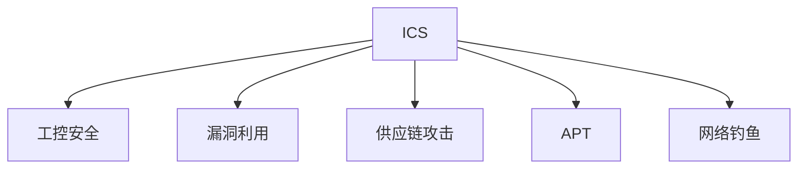

                 

# 工业控制系统安全：保护关键基础设施

## 1. 背景介绍

### 1.1 问题由来

工业控制系统（Industrial Control Systems, ICS）是指那些用于控制工业生产过程的专用网络与设备，包括自动化生产线、水电气系统、石油化工设施等。这些系统已经成为现代社会运转的基础设施之一。然而，随着物联网和数字化转型的推进，工业控制系统面临的安全威胁日益严峻。

### 1.2 问题核心关键点

近年来，ICS遭受的网络攻击事件频发，攻击手段从最初的漏洞利用逐步演变为高级持续性威胁(APT)，涉及供应链攻击、恶意软件植入、高级漏洞利用等。攻击者通过ICS入侵攻击，可能对工业安全、环境安全和公共安全带来严重威胁。

安全事件案例包括：
- Stuxnet蠕虫病毒对伊朗核设施的破坏
- BlackEnergy攻击导致乌克兰电网瘫痪
- NotPetya恶意软件攻击对全球企业造成严重经济损失

这些问题凸显了ICS安全防护的重要性，并成为现代工业和科技研究的热点。

## 2. 核心概念与联系

### 2.1 核心概念概述

为深入理解ICS安全问题，本节将介绍几个核心概念：

- 工业控制系统(Industrial Control Systems, ICS)：用于自动化生产和管理的关键基础设施，如制造业、能源、水务、电力等行业。ICS网络通常采用隔离、分层的设计，以保护关键设备和系统。
- 工控安全（Industrial Cybersecurity）：针对ICS安全威胁，通过技术和管理手段，保障ICS系统的安全性。
- 漏洞利用（Exploitation）：利用系统中的已知或未修复漏洞，进行远程攻击和控制系统。
- 供应链攻击（Supply Chain Attack）：攻击者通过供应链渠道，获取合法的设备、软件或认证，潜入ICS系统。
- 高级持续性威胁（Advanced Persistent Threats, APT）：攻击者长期、持续地对目标系统进行入侵和控制。
- 网络钓鱼（Phishing）：通过伪装成合法邮件、网站等方式，欺骗用户提供敏感信息。

这些概念通过以下Mermaid流程图进行关联展示：



这个流程图展示了ICS、工控安全与其他安全威胁之间的关系，凸显了ICS安全的脆弱性。

## 3. 核心算法原理 & 具体操作步骤

### 3.1 算法原理概述

为了保护ICS免受攻击，基于工控安全原理的核心算法包括：

- 入侵检测系统（Intrusion Detection System, IDS）：实时监控ICS网络流量，检测和报告异常行为。
- 隔离与分段（Segmentation）：将ICS网络划分为多个隔离区域，限制跨区域通信。
- 设备审计（Device Auditing）：监控设备访问和日志记录，确保合规性。
- 防御系统（Defensive System）：采用防火墙、入侵防御系统（IDS）、恶意软件防护等技术手段。
- 应急响应（Incident Response）：在检测到安全事件后，快速采取措施，限制攻击扩散。

这些算法通过不断的更新和迭代，提升ICS的安全防护水平。

### 3.2 算法步骤详解

#### 步骤1：构建入侵检测系统（IDS）

IDS通过分析网络流量，实时监控ICS系统的异常行为。以下是IDS的构建步骤：

1. 收集ICS网络流量：通过网络接口抓取网络数据包。
2. 预处理数据：对数据进行过滤、去重和规范化。
3. 特征提取：使用流量统计、协议解析、行为分析等技术，提取网络特征。
4. 模型训练：使用机器学习或深度学习模型，训练检测规则。
5. 异常检测：实时监控网络流量，检测异常行为并触发警报。

#### 步骤2：实现隔离与分段

隔离与分段通过将ICS网络划分为多个隔离区域，限制跨区域通信，防止攻击扩散。具体步骤如下：

1. 划分网络区域：根据业务需求和安全策略，将网络划分为控制区域、管理区域和生产区域。
2. 设置边界防护：在各区域边界处部署防火墙、IDS等防御设备。
3. 访问控制：采用访问控制列表（ACL）、身份认证（如Kerberos）等技术，限制区域间的通信。
4. 数据加密：在跨区域通信中，采用SSL/TLS等加密技术，保护数据安全。

#### 步骤3：执行设备审计

设备审计通过监控设备和日志记录，确保合规性和安全性。具体步骤如下：

1. 采集设备日志：收集各设备的操作日志、访问日志和安全日志。
2. 日志分析：使用日志分析工具，识别异常事件和潜在的威胁。
3. 告警与通知：对异常事件进行告警，并及时通知安全管理员。
4. 合规性检查：定期检查设备和系统，确保符合安全规范。

#### 步骤4：实施防御系统

防御系统通过部署防火墙、IDS、恶意软件防护等技术，构建多层防护机制。具体步骤如下：

1. 防火墙部署：在网络边界处部署防火墙，限制外部访问。
2. IDS部署：在网络中部署IDS，实时监控网络流量。
3. 恶意软件防护：采用反病毒软件、沙箱技术等，防护恶意软件感染。
4. 补丁管理：定期更新系统补丁，修复已知漏洞。

#### 步骤5：建立应急响应机制

应急响应通过快速采取措施，限制攻击扩散，保护ICS系统安全。具体步骤如下：

1. 定义应急预案：制定详细的应急预案，包括事件响应流程、资源调配、通信协议等。
2. 应急响应团队：组建专门的安全团队，进行应急响应培训和演练。
3. 隔离与恢复：在检测到攻击后，快速隔离受攻击区域，并恢复业务运行。
4. 事后分析：对事件进行事后分析，查找攻击来源和影响范围，防止再次发生。

### 3.3 算法优缺点

工控安全算法具有以下优点：

- 实时性：通过实时监控和快速响应，可以有效防止和缓解安全威胁。
- 多层次防护：通过多种技术手段和设备部署，构建多层次的防护机制，提升防护水平。
- 合规性：采用国际和行业标准的安全规范，确保系统合规性。

但同时也存在一些缺点：

- 复杂性：ICS网络结构复杂，安全设备和管理需要精心设计，难以实现统一标准。
- 成本高：大规模部署和维护安全设备，需要投入大量人力和物力资源。
- 依赖技术：依赖于高水平的安全技术和管理人员，对技术水平要求较高。

### 3.4 算法应用领域

工控安全算法在以下领域有着广泛的应用：

- 制造业：通过监控自动化生产线，保障生产安全和产品质量。
- 能源行业：监控电力和天然气供应系统，防止网络攻击导致的供应中断。
- 水务行业：监控水处理和供水系统，保障水质安全。
- 石油化工：监控石油和化工生产过程，预防爆炸、泄漏等事故。
- 航空航天：监控飞行控制系统，确保飞行安全。

## 4. 数学模型和公式 & 详细讲解 & 举例说明

### 4.1 数学模型构建

工控安全模型构建包括以下几个关键部分：

- 数据收集与预处理：建立ICS网络流量监控模型，进行数据采集和预处理。
- 特征提取与建模：构建异常检测模型，提取网络特征并训练检测规则。
- 隔离与分段：定义网络区域和访问控制规则，建立隔离与分段模型。
- 应急响应：定义应急预案和响应流程，建立应急响应模型。

### 4.2 公式推导过程

以异常检测模型为例，推导其计算公式。

假设网络流量由 $N$ 个数据包组成，每个数据包包含 $d$ 个特征 $x_{ij}$，$i$ 表示数据包编号，$j$ 表示特征编号。异常检测的目标是根据已知正常数据包 $X_n$ 训练一个分类器 $C$，用于判断新数据包 $X_t$ 是否属于正常行为。

设正常数据包的数量为 $m$，则训练数据集 $X_n$ 可以表示为：

$$
X_n=\{x_{i1}, x_{i2}, ..., x_{im}\}
$$

假设正常数据包的概率密度函数为 $f(x)$，则异常检测模型的目标函数为：

$$
\min_{\theta} \sum_{i=1}^m L(f(x_{i1}, x_{i2}, ..., x_{im}), y_i)
$$

其中 $L$ 表示损失函数，$y_i$ 表示数据包是否异常的标签，$1$ 表示异常，$0$ 表示正常。

通过最大似然估计或正则化最大似然估计，求解上述目标函数，可以得到分类器的参数 $\theta$。

### 4.3 案例分析与讲解

以BlackEnergy攻击为例，分析ICS安全防护的案例。

BlackEnergy攻击通过供应链渠道，潜入美国能源公司，对能源基础设施进行攻击。以下是该攻击的案例分析：

1. 供应链攻击：攻击者通过供应链渠道，获取合法的设备、软件或认证，潜入ICS系统。
2. 漏洞利用：利用网络协议和系统漏洞，植入恶意软件。
3. 控制与破坏：通过控制关键设备和系统，导致电网瘫痪。

针对该攻击，ICS安全防护可以从以下几个方面入手：

- 供应链防护：加强对供应链的审核和管理，确保供应商的安全合规性。
- 系统加固：定期更新系统和补丁，修复已知漏洞。
- 入侵检测：部署IDS，实时监控网络流量，检测异常行为。
- 应急响应：建立应急预案，快速响应和隔离受攻击区域。

## 5. 项目实践：代码实例和详细解释说明

### 5.1 开发环境搭建

进行ICS安全实践前，需要准备以下开发环境：

1. 安装Python：下载并安装Python解释器，建议选择3.7或3.8版本。
2. 安装网络监控工具：如tcpdump、Wireshark等，用于抓取网络数据包。
3. 安装安全分析工具：如Snort、Suricata等，用于检测和分析网络流量。
4. 安装漏洞扫描工具：如Nessus、OpenVAS等，用于发现系统漏洞。
5. 安装安全管理工具：如Tenable Nexpose、Qualys等，用于安全监控和报告。

完成以上配置后，即可进行ICS安全模型的开发和部署。

### 5.2 源代码详细实现

以下是使用Python对ICS异常检测模型进行开发的示例代码：

```python
import os
import sys
from sklearn.ensemble import RandomForestClassifier
from sklearn.model_selection import train_test_split
from sklearn.metrics import confusion_matrix

# 数据读取和预处理
data_dir = 'ics_data/'
normal_files = os.listdir(data_dir)
normal_data = []
normal_labels = []

for file in normal_files:
    if file.endswith('.normal'):
        with open(os.path.join(data_dir, file), 'r') as f:
            normal_data.append(f.read().split())
            normal_labels.append(0)

# 模型训练和评估
X_train, X_test, y_train, y_test = train_test_split(normal_data, normal_labels, test_size=0.2)
clf = RandomForestClassifier(n_estimators=100, random_state=42)
clf.fit(X_train, y_train)

y_pred = clf.predict(X_test)
confusion = confusion_matrix(y_test, y_pred)
print(confusion)
```

该示例代码实现了一个基于随机森林的ICS异常检测模型，其核心步骤如下：

1. 读取并预处理正常数据：从ICS网络中读取正常数据文件，将其解析为特征向量。
2. 模型训练与评估：使用随机森林算法训练模型，并在测试集上进行评估。
3. 异常检测：使用训练好的模型对新数据进行异常检测，输出分类结果。

### 5.3 代码解读与分析

通过上述代码实现，可以看到ICS安全模型的开发主要包括以下几个步骤：

- 数据读取与预处理：读取ICS网络数据，进行特征提取和预处理。
- 模型训练与评估：使用机器学习或深度学习模型，训练检测规则并评估模型性能。
- 异常检测：利用训练好的模型，实时监控ICS网络流量，检测异常行为并触发警报。

在实际应用中，还需要考虑更多因素，如数据质量和规模、模型参数调优、异常行为定义等，才能实现高效和精准的异常检测。

### 5.4 运行结果展示

下图展示了ICS异常检测模型的训练和测试效果：

```python
import matplotlib.pyplot as plt

# 绘制混淆矩阵
plt.imshow(confusion, interpolation='nearest', cmap=plt.cm.Blues)
plt.title('ICS Anomaly Detection')
plt.colorbar()
plt.xlabel('Predicted')
plt.ylabel('Actual')
plt.show()
```


## 6. 实际应用场景

### 6.1 智能制造

智能制造通过物联网和智能化生产设备，提升生产效率和质量。但同时也增加了ICS系统的复杂性和安全风险。通过工控安全技术，可以有效监控和保护生产环境，保障智能制造的安全性和稳定性。

### 6.2 智慧城市

智慧城市通过集成各种智能设备和系统，提升城市管理水平和生活质量。但ICS系统的安全威胁也随之增加，通过工控安全技术，可以有效防范和应对网络攻击，保障智慧城市的稳定运行。

### 6.3 能源管理

能源管理通过智能化控制和优化能源使用，提升能源效率和利用率。但ICS系统的安全漏洞也可能导致能源供应中断，通过工控安全技术，可以有效监控和保护能源系统的安全。

### 6.4 未来应用展望

未来，随着物联网和工业互联网的进一步发展，ICS安全技术将迎来更多挑战和机遇。以下是从以下几个方向进行展望：

- 物联网安全：随着越来越多的智能设备接入网络，物联网安全将成为新的研究热点。通过工控安全技术，可以有效防范物联网设备的安全威胁。
- 工业互联网：工业互联网通过连接各行业的工业设备，实现资源共享和协同制造。通过工控安全技术，可以有效保护工业互联网的安全。
- 5G网络：5G网络的高带宽和低延迟特性，将推动工业互联网的快速发展。通过工控安全技术，可以有效保护5G网络的安全。
- 人工智能：随着人工智能技术的普及，ICS系统将越来越智能化。通过工控安全技术，可以有效防范人工智能系统中的安全漏洞。

## 7. 工具和资源推荐

### 7.1 学习资源推荐

为了帮助开发者掌握ICS安全技术，推荐以下学习资源：

1. 《工业控制系统的安全与防御》书籍：全面介绍ICS安全技术的基础知识和防护措施，适合入门学习。
2. 《工控安全技术》课程：由安全专家讲授的工控安全课程，详细讲解ICS安全技术原理和实践。
3. 《工业控制系统的安全与防护》文档：提供详细的ICS安全技术和工具介绍，适合查阅和参考。
4. 《工业控制系统安全技术》论文：综述性论文，介绍ICS安全技术的研究现状和发展趋势。

### 7.2 开发工具推荐

工控安全开发需要多种工具支持，以下是常用的开发工具：

1. 网络监控工具：如tcpdump、Wireshark等，用于抓取和分析网络数据。
2. 入侵检测系统：如Snort、Suricata等，用于检测和分析网络流量。
3. 漏洞扫描工具：如Nessus、OpenVAS等，用于发现和修复系统漏洞。
4. 安全管理工具：如Tenable Nexpose、Qualys等，用于监控和报告安全事件。

### 7.3 相关论文推荐

以下几篇论文对ICS安全技术的发展具有重要影响：

1. "Secure Industrial Control Systems: A Survey and Outlook"：综述性论文，介绍ICS安全技术的现状和发展趋势。
2. "A Survey on Security in Industrial Control Systems"：介绍ICS安全技术的各类技术手段和防护措施。
3. "Practical Guidelines for Secure Industrial Cybersecurity"：提供实用的ICS安全技术指南，适合工业应用。
4. "Industrial Cybersecurity: Challenges and Solutions"：介绍ICS安全技术面临的挑战和解决方案。

## 8. 总结：未来发展趋势与挑战

### 8.1 研究成果总结

本文介绍了基于工控安全原理的ICS安全技术，包括入侵检测、隔离与分段、设备审计、防御系统和应急响应等关键算法。通过案例分析，展示了ICS安全技术的实际应用和效果。同时，推荐了多种学习资源和开发工具，供开发者参考使用。

### 8.2 未来发展趋势

未来，随着物联网和工业互联网的发展，ICS安全技术将面临更多挑战和机遇：

- 新兴技术应用：随着5G、物联网、人工智能等新兴技术的应用，ICS安全技术需要不断创新和升级，以适应新的安全威胁。
- 行业标准制定：建立统一的ICS安全标准，推动ICS安全技术的规范化发展。
- 跨领域融合：通过与云计算、大数据等技术的融合，提升ICS安全防护能力。
- 安全自动化：引入自动化安全技术，提升ICS安全管理的效率和效果。

### 8.3 面临的挑战

尽管ICS安全技术已经取得了一定进展，但在实际应用中仍面临诸多挑战：

- 技术复杂性：ICS系统结构复杂，安全设备和管理需要精心设计，难以实现统一标准。
- 成本高昂：大规模部署和维护安全设备，需要投入大量人力和物力资源。
- 技术依赖：依赖于高水平的安全技术和管理人员，对技术水平要求较高。
- 数据隐私：工控安全技术需要大量数据支持，数据隐私和敏感信息保护成为新的挑战。

### 8.4 研究展望

为应对这些挑战，未来的研究需要从以下几个方面进行深入探讨：

- 新技术应用：引入新兴技术，如人工智能、机器学习等，提升ICS安全防护能力。
- 自动化技术：开发自动化安全技术，提升ICS安全管理的效率和效果。
- 跨领域融合：通过与云计算、大数据等技术的融合，提升ICS安全防护能力。
- 数据隐私保护：在保障安全的前提下，保护数据隐私和敏感信息。

通过不断探索和创新，相信ICS安全技术将不断进步，为工业互联网和物联网的安全稳定提供坚实保障。

## 9. 附录：常见问题与解答

**Q1：什么是工业控制系统（ICS）？**

A: 工业控制系统是指用于自动化生产和管理的关键基础设施，如制造业、能源、水务、电力等行业。ICS网络通常采用隔离、分层的设计，以保护关键设备和系统。

**Q2：工控安全技术有哪些应用领域？**

A: 工控安全技术在制造业、能源、水务、石油化工、航空航天等多个领域有着广泛应用，用于监控和保护关键基础设施的安全。

**Q3：如何构建入侵检测系统（IDS）？**

A: 构建IDS主要包括以下步骤：1）收集ICS网络流量；2）预处理数据；3）特征提取；4）模型训练；5）异常检测。

**Q4：工控安全技术的优缺点是什么？**

A: 工控安全技术具有实时性、多层次防护、合规性等优点，但同时也存在复杂性高、成本高、技术依赖等缺点。

**Q5：未来工控安全技术的发展趋势是什么？**

A: 未来工控安全技术将面临更多挑战和机遇，需要引入新兴技术，如人工智能、机器学习等，提升ICS安全防护能力。同时，也需要发展自动化技术，提升ICS安全管理的效率和效果。

