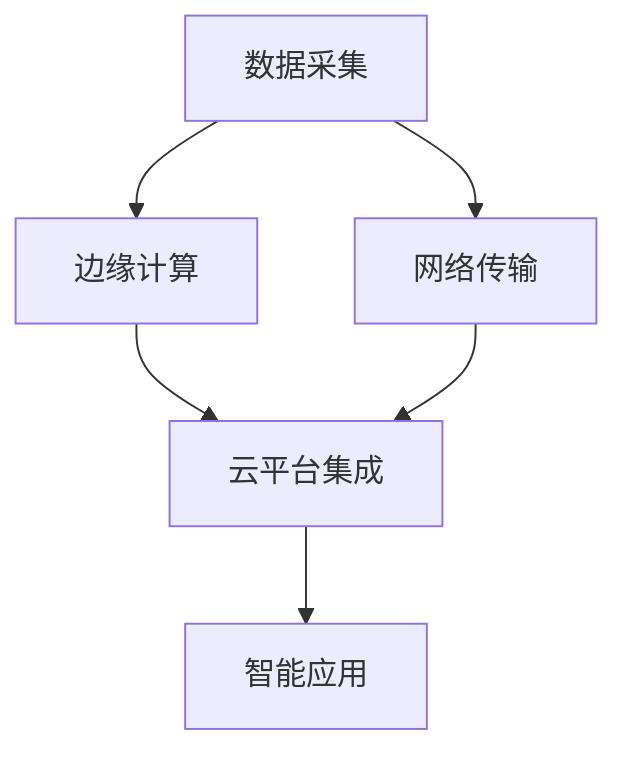

                 

## 1. 背景介绍

### 1.1 问题由来
随着信息化技术的迅猛发展，全球工业生产方式逐步从传统制造向智能化、数字化转型，带动了新一轮产业革命的到来。工业物联网（IIoT）作为数字化转型的核心驱动力，通过实时数据采集、传输和分析，助力企业优化生产流程、提升运营效率，加速产品创新和市场响应速度。在疫情期间，IIoT更是显现出其价值，帮助企业快速响应市场变化，保障供应链稳定运行。

### 1.2 问题核心关键点
IIoT的核心在于通过信息感知、传输和处理，实现工业生产的全生命周期管理。其关键点包括：
- **数据采集**：通过传感器、监测设备等采集工业生产过程中的实时数据。
- **网络传输**：利用5G、物联网等通信技术，实现数据的快速、可靠传输。
- **边缘计算**：在工业现场进行数据预处理和初步分析，以降低中心计算的负担。
- **云平台集成**：将处理后的数据上传到云端，进行更深入的数据分析和业务决策。
- **智能应用**：基于数据驱动的业务决策，优化生产流程、提高资源利用率。

### 1.3 问题研究意义
研究IIoT技术，对于推动传统工业向智能制造转型，提升企业的智能化水平和竞争力，具有重要意义：
- **降低成本**：通过自动化和优化生产流程，减少人工和材料浪费，降低生产成本。
- **提升效率**：通过实时监控和数据分析，优化资源配置和生产调度，提高生产效率。
- **加速创新**：基于实时数据驱动的业务创新，加速产品研发和市场响应。
- **强化安全**：实时监控工业生产过程，及时发现和应对异常情况，保障生产安全。
- **实现绿色生产**：优化能源消耗和废物处理，推动工业生产向环保、可持续发展方向发展。

## 2. 核心概念与联系

### 2.1 核心概念概述

为更好地理解IIoT，本节将介绍几个关键概念及其联系：

- **工业物联网（IIoT）**：通过智能传感器、执行器和软件平台，实现工业设备和系统的互联互通，使工业数据实时化、智能化。
- **边缘计算**：将数据处理和分析部分放到离生产线更近的计算节点上，以减少数据传输延迟和中心计算压力。
- **大数据分析**：对大规模工业数据进行存储、处理和分析，以发现隐藏在数据中的规律和洞见，支持决策优化。
- **云计算**：将边缘计算处理后的数据上传到云端，利用强大的计算资源进行更复杂的分析和业务决策。
- **智能制造**：通过工业数据和智能决策，实现生产过程的自动控制和优化，提升整体生产效率和质量。

这些概念之间的联系可以通过以下Mermaid流程图来展示：



这个流程图展示了IIoT的核心流程：
1. 数据采集通过传感器等设备获取生产数据。
2. 数据通过网络传输到边缘计算节点，进行初步处理和分析。
3. 处理后的数据上传到云端，进行更深入的分析和业务决策。
4. 基于云计算平台的智能应用，优化生产流程和业务决策。

## 3. 核心算法原理 & 具体操作步骤

### 3.1 算法原理概述

IIoT系统中的算法原理主要集中在数据采集、处理和应用三个方面。以下是各环节的关键算法原理：

- **数据采集算法**：通过各种传感器和监测设备，获取实时工业数据。
- **数据处理算法**：对采集的数据进行去噪、校准、聚合等预处理，以及基于规则和机器学习模型的实时分析。
- **智能应用算法**：基于处理后的数据，利用机器学习和人工智能技术，进行生产调度和优化决策。

### 3.2 算法步骤详解

IIoT系统的算法步骤主要包括数据采集、数据处理和智能应用三个环节。具体步骤如下：

**Step 1: 数据采集**
- 选择合适的传感器和监测设备，如温度传感器、振动传感器、RFID标签等，采集工业生产过程中的实时数据。
- 对采集的数据进行清洗、去噪和校准，确保数据的准确性和可靠性。

**Step 2: 数据处理**
- 在边缘计算节点上，对数据进行初步分析，如统计分析、异常检测等，以减少数据量，降低中心计算的负担。
- 利用机器学习模型，如时间序列预测、异常检测等，进行更深入的数据分析和预处理。

**Step 3: 智能应用**
- 将处理后的数据上传到云端，进行更复杂的分析，如故障预测、生产优化等。
- 利用智能算法，如优化算法、决策树、神经网络等，进行生产调度和业务决策，提升生产效率和质量。

### 3.3 算法优缺点

IIoT系统中的算法具有以下优点：
- **实时性**：通过边缘计算和网络传输技术，实现了数据的实时采集和处理，支持实时决策。
- **高效性**：利用分布式计算和智能算法，提高了数据处理的效率和精度。
- **灵活性**：支持多种数据源和传感器，能够适应不同的生产环境和需求。

同时，也存在以下缺点：
- **数据隐私和安全**：工业数据涉及企业机密，需确保数据传输和处理过程中的隐私保护和安全。
- **设备互操作性**：不同制造商的设备可能存在互操作性问题，需要统一的通信标准和协议。
- **计算资源需求高**：IIoT系统需要处理大规模数据，对计算资源的需求较高，需有稳定的计算平台支撑。
- **数据质量问题**：工业数据的噪声和误差较多，对数据的预处理和分析提出了较高要求。

### 3.4 算法应用领域

IIoT系统已广泛应用于多个行业，具体包括：

- **制造业**：通过IIoT系统，实现对生产线的实时监控和优化，提升生产效率和质量。
- **能源行业**：对能源设备的运行状态进行实时监测，优化能源消耗和分配，提高能源利用率。
- **物流行业**：利用IIoT系统，实时跟踪货物位置和状态，优化物流路径和运输管理。
- **农业**：通过IIoT系统，对农田环境进行实时监测和数据采集，提升农业生产智能化水平。
- **建筑业**：对建筑施工现场进行实时监控，提升施工安全和管理效率。
- **智慧城市**：通过IIoT系统，实现城市公共设施和基础设施的智能化管理。

## 4. 数学模型和公式 & 详细讲解 & 举例说明

### 4.1 数学模型构建

IIoT系统中的数学模型主要涉及数据采集、处理和分析三个环节。以下给出几个关键数学模型的构建：

- **数据采集模型**：通过传感器获取工业数据，可以建模为时序数据序列。
- **数据处理模型**：对采集的数据进行去噪、校准和预处理，可以建模为滤波和校准算法。
- **智能应用模型**：基于处理后的数据进行优化和决策，可以建模为优化算法和机器学习模型。

### 4.2 公式推导过程

以时间序列预测模型为例，进行公式推导：

设 $x_t$ 为时间 $t$ 的工业数据，$y_t$ 为预测值，模型为线性回归模型：

$$
y_t = \beta_0 + \beta_1 x_t + \epsilon_t
$$

其中，$\beta_0$ 为截距，$\beta_1$ 为斜率，$\epsilon_t$ 为误差项。

利用最小二乘法求解模型参数：

$$
\beta_0 = \frac{\sum_{t=1}^n x_t y_t - n \bar{x} \bar{y}}{\sum_{t=1}^n x_t^2 - n \bar{x}^2}
$$
$$
\beta_1 = \frac{\sum_{t=1}^n x_t^2 - n \bar{x}^2}{\sum_{t=1}^n x_t^2 - n \bar{x}^2}
$$

### 4.3 案例分析与讲解

以某智能工厂为例，分析IIoT系统的具体应用：

**Step 1: 数据采集**
- 在工厂的生产线安装温度传感器、振动传感器等，实时采集生产数据。
- 对采集的数据进行清洗和预处理，去除异常值和噪声。

**Step 2: 数据处理**
- 在工厂的现场边缘计算节点，利用时间序列预测模型，对设备状态进行预测和分析。
- 检测到设备异常时，立即发送警报给工程师，进行现场处理。

**Step 3: 智能应用**
- 将预测和分析结果上传到云端，利用机器学习模型，进行生产调度和优化决策。
- 实时调整生产参数，优化生产流程，提升生产效率和产品质量。

## 5. 项目实践：代码实例和详细解释说明

### 5.1 开发环境搭建

在进行IIoT项目开发前，需要进行环境配置：

1. 安装Python、Pip等工具，搭建开发环境。
2. 安装相关的传感器驱动库，如Python-ThingSpeak。
3. 安装物联网通信库，如paho-mqtt。
4. 安装边缘计算库，如TensorFlow。
5. 安装云平台API库，如Azure SDK。

### 5.2 源代码详细实现

以下是一个基于Python的IIoT系统开发代码实现，包括数据采集、处理和智能应用三个环节：

```python
# 数据采集部分
import paho.mqtt.client as mqtt
import thingpy

def on_connect(client, userdata, flags, rc):
    print("Connected with result code "+str(rc))
    client.subscribe("#")

def on_message(client, userdata, msg):
    data = msg.payload.decode()
    # 进行数据预处理和分析
    # 返回分析结果
    client.disconnect()

client = mqtt.Client()
client.on_connect = on_connect
client.on_message = on_message

client.connect("broker.hivemq.com", 1883, 1883)
client.loop_start()

# 数据处理部分
import tensorflow as tf

model = tf.keras.models.Sequential([
    tf.keras.layers.Dense(64, input_shape=(1,), activation='relu'),
    tf.keras.layers.Dense(1)
])

model.compile(optimizer='adam', loss='mse')

# 智能应用部分
import azure.functions as func
import azure.storage.blob

def main(req: func.HttpRequest) -> func.HttpResponse:
    # 读取云存储上的数据
    container_client = azure.storage.blob.BlobServiceClient().get_container_client('data_container')
    blob_client = container_client.get_blob_client(req.params['file_name'])
    data = blob_client.download_blob().readall().decode()

    # 处理数据
    data = preprocess(data)

    # 进行智能分析
    result = analyze(data)

    # 返回分析结果
    return func.HttpResponse(result)
```

### 5.3 代码解读与分析

以上代码实现了一个基本的IIoT系统，包含数据采集、处理和智能应用三个环节：

- **数据采集**：通过MQTT协议，订阅传感器数据，并将其发送到云端。
- **数据处理**：利用TensorFlow模型，对采集的数据进行预处理和分析，得到分析结果。
- **智能应用**：利用Azure Functions，进行智能分析和决策，返回分析结果。

代码中使用了Python-ThingSpeak、paho-mqtt、TensorFlow、Azure SDK等库，展示了IIoT系统开发的基本流程和常用工具。

## 6. 实际应用场景

### 6.1 智能工厂

智能工厂是IIoT系统的典型应用场景。通过IIoT系统，实时采集生产设备的状态数据，进行设备监控和故障预测，优化生产流程，提升生产效率和质量。具体应用包括：

- **设备监控**：通过传感器实时监测设备状态，及时发现和解决异常情况，避免设备停机。
- **故障预测**：利用时间序列预测模型，预测设备故障，提前进行维护，减少停机时间。
- **生产调度**：利用机器学习模型，优化生产调度，提高生产效率和产品质量。
- **品质控制**：利用数据分析技术，实时监测产品质量，进行品质控制和提升。

### 6.2 智能电网

智能电网通过IIoT系统，实现对电力设备的实时监控和优化管理，提高电力系统稳定性和效率。具体应用包括：

- **能源监测**：实时监测电力设备的运行状态，优化能源分配和利用。
- **故障检测**：利用数据分析技术，实时检测电力设备故障，避免电力中断。
- **智能调度和优化**：利用优化算法和机器学习模型，进行智能调度和优化，提高电力系统效率。
- **需求响应**：通过实时数据分析，响应用户需求，优化电力供需平衡。

### 6.3 智慧农业

智慧农业通过IIoT系统，实现对农田环境的实时监测和数据分析，提升农业生产智能化水平。具体应用包括：

- **环境监测**：实时监测土壤、温度、湿度等环境参数，优化农业生产环境。
- **智能灌溉**：利用数据分析技术，智能控制灌溉系统，优化水资源利用。
- **病虫害预测**：利用数据分析模型，预测病虫害发生，提前进行防治。
- **农作物监测**：实时监测农作物生长状态，进行科学管理，提升农作物产量和质量。

### 6.4 智慧医疗

智慧医疗通过IIoT系统，实现对患者数据的实时监测和分析，提升医疗服务的智能化水平。具体应用包括：

- **远程监测**：实时监测患者的生命体征数据，及时发现异常情况，提供及时救助。
- **智能诊断**：利用数据分析技术，辅助医生进行诊断和治疗，提高医疗服务质量。
- **健康管理**：实时监测患者健康数据，进行健康管理和干预，提升患者健康水平。
- **医疗资源优化**：利用数据分析模型，优化医疗资源分配，提高医疗服务效率。

## 7. 工具和资源推荐

### 7.1 学习资源推荐

为了帮助开发者系统掌握IIoT技术的理论基础和实践技巧，这里推荐一些优质的学习资源：

1. **《物联网应用开发实战》**：一本详细介绍物联网开发实战技术的书籍，涵盖数据采集、处理和应用等环节。
2. **IoT公开课**：由物联网权威机构提供的一系列在线课程，包括传感器技术、网络通信、云平台集成等。
3. **TensorFlow官方文档**：提供TensorFlow框架的详细文档和代码示例，帮助开发者快速上手TensorFlow模型开发。
4. **Azure官方文档**：提供Azure云平台的各种API和SDK，帮助开发者构建云平台应用。
5. **HiveMQ官方文档**：提供MQTT协议的详细文档和示例代码，帮助开发者实现数据采集和传输。

通过对这些资源的学习实践，相信你一定能够快速掌握IIoT技术的精髓，并用于解决实际的工业生产问题。

### 7.2 开发工具推荐

高效的开发离不开优秀的工具支持。以下是几款用于IIoT开发的常用工具：

1. **MQTT协议工具**：如MQTT broker、MQTT client等，用于实现数据的实时采集和传输。
2. **边缘计算平台**：如Raspberry Pi、Arduino等，用于在现场进行数据处理和初步分析。
3. **云平台服务**：如AWS IoT、Azure IoT Hub等，用于提供云平台集成和数据分析服务。
4. **数据分析工具**：如TensorFlow、PyTorch等，用于对工业数据进行建模和分析。
5. **可视化工具**：如Tableau、PowerBI等，用于数据可视化，支持决策优化。

合理利用这些工具，可以显著提升IIoT项目的开发效率，加快创新迭代的步伐。

### 7.3 相关论文推荐

IIoT技术的发展得益于学界的持续研究。以下是几篇奠基性的相关论文，推荐阅读：

1. **《IoT: Architecture and Survey》**：提供物联网架构和调查综述，介绍物联网的基本概念和关键技术。
2. **《Smart Manufacturing Using IoT》**：介绍IIoT在智能制造中的应用，展示其在优化生产流程和提升效率方面的优势。
3. **《AI for Industry 4.0》**：探讨人工智能在工业4.0中的应用，包括机器学习、自然语言处理等技术。
4. **《IoT-Enabled Smart Grid》**：介绍IIoT在智能电网中的应用，展示其在优化电力系统中的作用。
5. **《IoT-Based Precision Agriculture》**：介绍IIoT在智慧农业中的应用，展示其在提升农业生产智能化水平方面的潜力。

这些论文代表了大数据和IIoT技术的发展脉络，通过学习这些前沿成果，可以帮助研究者把握学科前进方向，激发更多的创新灵感。

## 8. 总结：未来发展趋势与挑战

### 8.1 研究成果总结

IIoT技术在数字化转型中的重要作用得到了广泛认可，许多企业已经将IIoT系统纳入其整体战略规划中。本节总结了IIoT技术的主要研究成果：

1. **数据采集技术**：传感器技术、物联网协议等，实现了工业数据的实时采集和传输。
2. **数据处理技术**：边缘计算、数据校准等，提高了数据处理的效率和精度。
3. **智能应用技术**：机器学习、优化算法等，支持工业生产的优化决策。

### 8.2 未来发展趋势

展望未来，IIoT技术将呈现以下几个发展趋势：

1. **边缘计算普及**：随着5G、物联网等技术的普及，边缘计算将更广泛地应用于工业现场，降低数据传输延迟和中心计算负担。
2. **人工智能融合**：IIoT系统将与人工智能技术深度融合，提高数据处理和决策的智能化水平。
3. **跨领域应用拓展**：IIoT技术将应用于更多领域，如智慧农业、智慧医疗等，提升各行各业的智能化水平。
4. **数据安全与隐私保护**：随着IIoT系统的广泛应用，数据安全与隐私保护将成为一个重要的研究方向。
5. **可持续发展**：IIoT系统将更多关注环保和可持续发展，推动工业生产向绿色、低碳方向发展。

### 8.3 面临的挑战

尽管IIoT技术已经取得了显著进展，但在全面落地应用的过程中，仍面临诸多挑战：

1. **数据隐私和安全**：工业数据涉及企业机密，需确保数据传输和处理过程中的隐私保护和安全。
2. **设备互操作性**：不同制造商的设备可能存在互操作性问题，需要统一的通信标准和协议。
3. **计算资源需求高**：IIoT系统需要处理大规模数据，对计算资源的需求较高，需有稳定的计算平台支撑。
4. **数据质量问题**：工业数据的噪声和误差较多，对数据的预处理和分析提出了较高要求。
5. **系统复杂度**：IIoT系统涉及多个环节和组件，系统设计和维护的复杂度较高，需有专业的技术支持。

### 8.4 研究展望

为了克服上述挑战，未来的研究需要在以下几个方面寻求新的突破：

1. **数据隐私和安全技术**：研究数据加密、匿名化、区块链等技术，保障数据隐私和安全。
2. **跨平台互操作技术**：制定统一的标准和协议，提高设备的互操作性。
3. **计算资源优化技术**：研究分布式计算、边缘计算等技术，降低计算资源需求。
4. **数据预处理和分析技术**：研究高效的数据预处理和分析算法，提高数据处理效率。
5. **系统设计和管理技术**：研究智能化的系统设计和管理方法，提升系统的可扩展性和可维护性。

## 9. 附录：常见问题与解答

**Q1：IIoT系统中的数据采集部分需要注意哪些问题？**

A: 数据采集是IIoT系统的核心环节，需要注意以下问题：
1. 选择合适的传感器和监测设备，确保数据的准确性和可靠性。
2. 对采集的数据进行清洗、去噪和校准，去除异常值和噪声。
3. 实时传输采集的数据，避免数据丢失和延迟。

**Q2：IIoT系统中的数据处理部分需要考虑哪些因素？**

A: 数据处理是IIoT系统的关键环节，需要考虑以下因素：
1. 选择合适的处理算法，如滤波、校准等，确保数据的准确性。
2. 考虑处理算法的实时性，确保数据处理的及时性。
3. 考虑处理算法的复杂度，确保系统的稳定性。

**Q3：IIoT系统中的智能应用部分如何实现？**

A: 智能应用是IIoT系统的最终目标，主要通过以下步骤实现：
1. 利用数据分析技术，提取关键特征和洞见。
2. 利用机器学习模型，进行生产调度和优化决策。
3. 实时调整生产参数，优化生产流程和资源利用率。

**Q4：IIoT系统中的数据安全与隐私保护需要注意哪些问题？**

A: 数据安全与隐私保护是IIoT系统的核心挑战，需要注意以下问题：
1. 数据加密和匿名化，保护数据的隐私和安全性。
2. 制定统一的标准和协议，确保设备间的互操作性和数据一致性。
3. 建立数据访问控制和审计机制，防止数据泄露和滥用。

**Q5：IIoT系统中的计算资源优化需要注意哪些问题？**

A: 计算资源优化是IIoT系统的关键问题，需要注意以下问题：
1. 利用边缘计算和分布式计算，降低数据传输延迟和中心计算负担。
2. 优化数据存储和访问，提高数据处理的效率。
3. 选择高效的计算模型和算法，提高系统的性能和可扩展性。

---

作者：禅与计算机程序设计艺术 / Zen and the Art of Computer Programming

