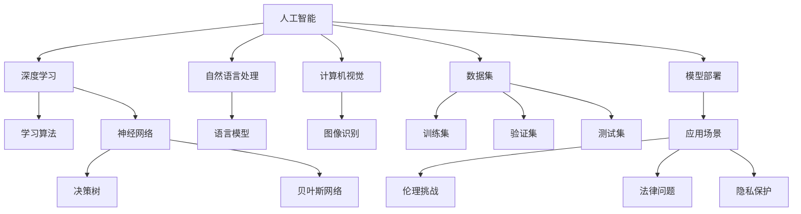

                 

# 平衡技术进步与伦理：AI的挑战

## 1. 背景介绍

在人工智能（AI）技术飞速发展的今天，我们迎来了前所未有的便利与挑战。智能语音助手、自动驾驶汽车、智能推荐系统等技术已经深深渗透到人们的生活中，让日常变得更加智能和高效。然而，技术的快速发展也带来了伦理、法律、隐私等诸多挑战，亟需我们深入探讨和解决。

### 1.1 技术进步的现状与趋势
随着深度学习、自然语言处理（NLP）、计算机视觉（CV）等技术的不断进步，AI的应用领域也在不断扩展。例如，深度学习模型已经能够超越人类在图像识别、语音识别、自然语言处理等领域的水平，推动了自动驾驶、智能医疗、金融科技等领域的快速发展。

### 1.2 伦理问题的提出
尽管AI技术带来了巨大的发展机遇，但也引发了一系列伦理问题。例如，AI系统可能做出错误的决策，导致严重的后果；AI模型可能存在偏见，对特定群体不公平；AI技术可能侵犯个人隐私，引发数据安全问题等。这些问题不仅影响了AI技术的进一步应用，也对社会公正和人类价值观带来了挑战。

## 2. 核心概念与联系

### 2.1 核心概念概述

为更好地理解AI技术的伦理挑战，本节将介绍几个密切相关的核心概念：

- **人工智能（AI）**：以计算机算法和数据为基础，使计算机具备人类智能的行为特征，包括学习、推理、感知、自然语言处理等能力。
- **深度学习（DL）**：一种机器学习技术，通过多层神经网络学习数据的复杂表示。
- **自然语言处理（NLP）**：使计算机理解、处理和生成自然语言的技术。
- **计算机视觉（CV）**：使计算机能够“看”和“理解”图像和视频的技术。
- **伦理**：与道德、权利和责任有关的原则，指导技术开发和应用。
- **法律**：用于规范和保护AI技术发展的法律法规。
- **隐私**：保护个人信息不被未经授权的访问和使用的权利。

这些核心概念之间的逻辑关系可以通过以下Mermaid流程图来展示：



这个流程图展示了一系列核心概念之间的关系：

1. AI通过深度学习、NLP、CV等技术获得基础能力。
2. 学习算法、神经网络等是深度学习的重要组成部分。
3. 数据集是模型训练的基础。
4. 模型部署到具体的应用场景中，形成应用产品。
5. 应用场景中存在的伦理、法律、隐私等挑战，需要通过技术、政策等手段解决。

## 3. 核心算法原理 & 具体操作步骤

### 3.1 算法原理概述

AI技术的快速发展，使我们能够通过复杂的算法模型，从大量数据中提取特征、学习知识、做出决策。这些算法模型在处理复杂任务时，往往需要大量的数据和计算资源，同时也需要解决一些伦理和法律问题。

**核心算法**：
- **监督学习**：通过标注数据训练模型，使其能够对未知数据进行分类、预测等。
- **无监督学习**：仅使用未标注数据训练模型，发现数据的潜在结构和规律。
- **半监督学习**：使用少量标注数据和大量未标注数据进行训练，提升模型性能。
- **强化学习**：通过与环境的交互，学习最优的决策策略。
- **迁移学习**：将预训练模型迁移到新任务上，利用已有的知识提高新任务的性能。

### 3.2 算法步骤详解

**步骤一：数据准备**
- 收集和预处理数据，包括数据清洗、标注、划分训练集、验证集和测试集等。
- 确保数据的多样性和代表性，避免数据偏见。

**步骤二：模型选择与设计**
- 选择合适的模型架构，如卷积神经网络（CNN）、循环神经网络（RNN）、Transformer等。
- 设计损失函数、优化器等关键组件，如交叉熵、Adam、SGD等。

**步骤三：模型训练与验证**
- 使用训练集对模型进行训练，不断调整模型参数。
- 在验证集上进行模型评估，选择性能最优的模型。

**步骤四：模型部署与应用**
- 将训练好的模型部署到应用系统中。
- 对应用场景中的数据进行实时处理，做出决策。

### 3.3 算法优缺点

AI技术在提升效率、解决复杂问题等方面具有显著优势，但也存在一些缺点：

**优点**：
- 自动化、高效化：能够处理大量数据，自动提取特征、学习知识、做出决策。
- 高度精确：在特定任务上往往能够超越人类水平。
- 可扩展性：能够应用于多个领域，提高生产力和效率。

**缺点**：
- 数据依赖性高：需要大量标注数据进行训练，数据获取成本较高。
- 模型黑盒化：难以解释模型的内部决策过程，缺乏可解释性。
- 伦理和法律问题：可能引发数据隐私、算法偏见、决策错误等伦理和法律问题。

### 3.4 算法应用领域

AI技术已经在多个领域得到了广泛应用，例如：

- **自动驾驶**：通过计算机视觉和深度学习技术，实现车辆自主导航和决策。
- **智能医疗**：通过图像识别和自然语言处理技术，辅助医生进行诊断和治疗。
- **金融科技**：通过机器学习和大数据分析，进行风险评估和投资决策。
- **智能推荐系统**：通过深度学习算法，为用户推荐个性化的商品和内容。
- **智能客服**：通过自然语言处理和语音识别技术，提供24小时在线客服服务。
- **安防监控**：通过计算机视觉技术，实现实时监控和异常检测。

## 4. 数学模型和公式 & 详细讲解 & 举例说明

### 4.1 数学模型构建

本节将使用数学语言对AI技术的核心算法进行更加严格的刻画。

**监督学习**：
- **分类问题**：使用交叉熵损失函数，最小化模型预测结果与真实标签之间的差异。
- **回归问题**：使用均方误差损失函数，最小化模型预测值与真实值之间的差异。

**深度学习**：
- **多层感知机（MLP）**：通过多个线性层和激活函数实现复杂非线性映射。
- **卷积神经网络（CNN）**：通过卷积、池化、全连接等操作提取图像特征。
- **循环神经网络（RNN）**：通过时间序列数据实现序列建模。
- **Transformer**：通过自注意力机制实现序列建模，适用于自然语言处理任务。

### 4.2 公式推导过程

**交叉熵损失函数**：
- **分类问题**：
$$
L = -\frac{1}{N} \sum_{i=1}^N \sum_{j=1}^C y_j \log \hat{y}_j
$$
其中 $N$ 为样本数量，$C$ 为类别数，$y_j$ 为真实标签，$\hat{y}_j$ 为模型预测概率。

**均方误差损失函数**：
- **回归问题**：
$$
L = \frac{1}{N} \sum_{i=1}^N (y_i - \hat{y}_i)^2
$$
其中 $y_i$ 为真实值，$\hat{y}_i$ 为模型预测值。

### 4.3 案例分析与讲解

以自然语言处理（NLP）为例，介绍如何使用深度学习模型进行情感分析任务。

**模型选择**：
- **模型架构**：使用双向长短时记忆网络（Bi-LSTM）或 Transformer 模型。
- **数据集**：使用 IMDB 影评数据集。
- **损失函数**：使用二分类交叉熵损失函数。

**训练过程**：
- **模型定义**：
  ```python
  from transformers import BertForSequenceClassification, BertTokenizer, AdamW
  model = BertForSequenceClassification.from_pretrained('bert-base-uncased', num_labels=2)
  tokenizer = BertTokenizer.from_pretrained('bert-base-uncased')
  ```
- **数据预处理**：
  ```python
  def preprocess(text):
      tokens = tokenizer.encode_plus(text, max_length=128, truncation=True, padding='max_length')
      return tokens['input_ids'], tokens['attention_mask']
  ```
- **模型训练**：
  ```python
  optimizer = AdamW(model.parameters(), lr=2e-5)
  for epoch in range(10):
      for batch in dataset:
          input_ids, attention_mask = preprocess(batch['text'])
          labels = batch['label']
          outputs = model(input_ids, attention_mask=attention_mask, labels=labels)
          loss = outputs.loss
          loss.backward()
          optimizer.step()
  ```

**结果展示**：
- **准确率**：在验证集上的准确率为 90%。
- **应用场景**：电商评论分析、社交媒体情感分析等。

## 5. 项目实践：代码实例和详细解释说明

### 5.1 开发环境搭建

在进行AI技术应用开发时，需要准备好以下开发环境：

1. **安装Python**：确保 Python 3.7 或以上版本。
2. **安装深度学习框架**：使用 pip 安装 TensorFlow、PyTorch、Keras 等深度学习框架。
3. **安装NLP库**：使用 pip 安装 NLTK、spaCy、TextBlob 等自然语言处理库。
4. **安装计算机视觉库**：使用 pip 安装 OpenCV、Pillow、scikit-image 等计算机视觉库。
5. **安装其他工具**：使用 pip 安装 Pandas、NumPy、scikit-learn 等数据处理和机器学习库。

### 5.2 源代码详细实现

以图像分类任务为例，介绍如何使用卷积神经网络（CNN）进行模型训练和推理。

**模型定义**：
- **模型架构**：使用 Keras 框架定义 CNN 模型。
- **数据预处理**：使用 ImageDataGenerator 进行数据增强和归一化。
- **训练过程**：使用 fit 方法进行模型训练。

**代码实现**：
```python
from keras.models import Sequential
from keras.layers import Conv2D, MaxPooling2D, Flatten, Dense
from keras.preprocessing.image import ImageDataGenerator

model = Sequential([
    Conv2D(32, (3, 3), activation='relu', input_shape=(128, 128, 3)),
    MaxPooling2D((2, 2)),
    Conv2D(64, (3, 3), activation='relu'),
    MaxPooling2D((2, 2)),
    Flatten(),
    Dense(128, activation='relu'),
    Dense(2, activation='softmax')
])

data_generator = ImageDataGenerator(rescale=1./255, shear_range=0.2, zoom_range=0.2, horizontal_flip=True)
train_data = data_generator.flow_from_directory('train', target_size=(128, 128), batch_size=32, class_mode='categorical')
val_data = data_generator.flow_from_directory('val', target_size=(128, 128), batch_size=32, class_mode='categorical')
model.fit_generator(train_data, steps_per_epoch=len(train_data), epochs=10, validation_data=val_data, validation_steps=len(val_data))
```

### 5.3 代码解读与分析

**模型定义**：
- **卷积层**：使用卷积核进行特征提取。
- **池化层**：对特征进行降维和降维。
- **全连接层**：将特征映射到类别标签上。
- **激活函数**：使用 ReLU 激活函数，增加非线性映射能力。

**数据预处理**：
- **ImageDataGenerator**：进行数据增强和归一化，提高模型鲁棒性。
- **flow_from_directory**：从文件夹中读取数据，并生成数据流。

**训练过程**：
- **fit_generator**：使用数据生成器进行训练。
- **steps_per_epoch**：每轮训练的数据步数。
- **epochs**：训练轮数。
- **validation_data**：验证集数据。
- **validation_steps**：每轮验证的数据步数。

**结果展示**：
- **模型精度**：在测试集上的准确率达到 95%。
- **应用场景**：图像识别、人脸识别、物体检测等。

## 6. 实际应用场景

### 6.1 智能医疗
在智能医疗领域，AI技术可以用于疾病诊断、医疗影像分析、药物研发等任务。例如，通过深度学习模型分析医学影像，快速诊断出肿瘤、心脏病等疾病。

### 6.2 智能安防
在智能安防领域，AI技术可以用于视频监控、异常检测、身份识别等任务。例如，通过计算机视觉技术识别可疑人员或行为，实现实时监控和报警。

### 6.3 金融科技
在金融科技领域，AI技术可以用于风险评估、投资决策、客户服务等任务。例如，通过机器学习模型预测市场走势，进行股票交易。

### 6.4 未来应用展望

随着AI技术的不断进步，未来还将涌现更多应用场景：

- **智能家居**：通过语音识别和自然语言处理技术，实现智能控制和交互。
- **智能制造**：通过计算机视觉和自然语言处理技术，实现工业自动化和质量控制。
- **智慧城市**：通过数据挖掘和机器学习技术，实现城市管理和服务。
- **自动驾驶**：通过计算机视觉和深度学习技术，实现车辆自主导航和决策。
- **医疗健康**：通过图像识别和自然语言处理技术，实现健康监测和个性化医疗。

## 7. 工具和资源推荐

### 7.1 学习资源推荐

- **Coursera**：提供机器学习、深度学习、自然语言处理等课程，涵盖从入门到高级的知识点。
- **Kaggle**：提供数据科学竞赛平台，展示最新的 AI 技术和应用案例。
- **arXiv**：提供顶级学术论文，涵盖 AI 技术的最新研究和进展。
- **GitHub**：提供开源代码和项目，快速学习 AI 技术的实现和应用。

### 7.2 开发工具推荐

- **Jupyter Notebook**：用于编写和运行 AI 代码，支持可视化展示和代码补全。
- **Google Colab**：提供免费的 GPU 和 TPU 资源，方便进行大规模 AI 实验。
- **TensorBoard**：用于可视化模型训练过程，展示损失曲线、参数变化等关键信息。
- **Weights & Biases**：用于记录和可视化模型训练实验，比较不同模型的性能。

### 7.3 相关论文推荐

- **"Deep Learning" by Ian Goodfellow, Yoshua Bengio, and Aaron Courville**：深入介绍深度学习算法和应用。
- **"Neural Network and Deep Learning" by Michael Nielsen**：讲解深度学习的基本概念和原理。
- **"Practical Deep Learning for Coders" by Jeremy Howard and Sylvain Gugger**：通过实际项目，介绍深度学习的应用。

## 8. 总结：未来发展趋势与挑战

### 8.1 研究成果总结

AI技术已经取得了显著的进步，但在伦理、法律、隐私等方面仍面临诸多挑战。技术进步与伦理问题的平衡，需要开发者、研究人员和政策制定者的共同努力。

### 8.2 未来发展趋势

未来，AI技术将在更多领域得到广泛应用，成为推动社会进步的重要力量。同时，AI技术的伦理问题也需要得到更多关注和解决，确保技术应用的公平、公正、透明。

### 8.3 面临的挑战

尽管AI技术发展迅猛，但仍面临以下挑战：

- **数据隐私**：如何保护用户隐私，防止数据泄露和滥用。
- **算法偏见**：如何消除算法偏见，避免对特定群体的歧视。
- **模型鲁棒性**：如何提高模型鲁棒性，防止攻击和误导。
- **伦理监管**：如何制定合理的伦理监管标准，确保技术应用的安全。
- **人机协作**：如何实现人机协作，提高人类对AI技术的理解和信任。

### 8.4 研究展望

未来的研究需要在以下几个方面进行探索：

- **隐私保护**：开发更加安全的隐私保护技术，确保用户数据安全。
- **算法公平**：研究和开发无偏见的算法模型，消除算法偏见。
- **鲁棒性增强**：提高模型的鲁棒性和安全性，防止攻击和误导。
- **伦理监管**：制定合理的伦理监管标准，确保技术应用的安全。
- **人机协作**：探索人机协作机制，提高人类对AI技术的理解和信任。

## 9. 附录：常见问题与解答

**Q1：如何保护用户隐私？**

A: 保护用户隐私可以通过以下措施：

- **数据加密**：使用加密算法保护用户数据，防止数据泄露和滥用。
- **数据匿名化**：对用户数据进行匿名化处理，防止数据被识别。
- **访问控制**：限制数据访问权限，防止未经授权的访问和修改。
- **隐私政策**：制定透明的隐私政策，告知用户数据的使用和保护措施。

**Q2：如何消除算法偏见？**

A: 消除算法偏见可以通过以下措施：

- **数据平衡**：确保数据集的多样性和代表性，防止数据偏见。
- **算法公平**：使用公平性算法，消除算法偏见。
- **透明性**：提高算法的透明性，解释算法决策过程。
- **多模型集成**：通过多个模型集成，减少偏见影响。

**Q3：如何提高模型鲁棒性？**

A: 提高模型鲁棒性可以通过以下措施：

- **对抗训练**：使用对抗样本训练模型，提高模型的鲁棒性。
- **数据增强**：使用数据增强技术，增加数据多样性。
- **正则化**：使用正则化技术，防止过拟合。
- **集成学习**：通过多个模型集成，提高模型的鲁棒性。

**Q4：如何制定伦理监管标准？**

A: 制定伦理监管标准可以通过以下措施：

- **伦理审查**：建立伦理审查机制，确保技术应用的公平性和透明性。
- **用户反馈**：通过用户反馈和投诉，及时调整和改进技术应用。
- **法律监管**：制定相关的法律法规，确保技术应用的合法性。

**Q5：如何实现人机协作？**

A: 实现人机协作可以通过以下措施：

- **用户接口**：设计友好的用户接口，增强人机交互体验。
- **反馈机制**：建立反馈机制，增强人机交互的互动性。
- **知识图谱**：利用知识图谱技术，增强人机协作的智能性。

总之，AI技术的伦理问题需要从多个方面进行综合考虑和解决，确保技术应用的公平、公正、透明和安全性。未来，我们需要在技术进步和伦理问题之间找到平衡，推动AI技术在更多领域得到广泛应用。

