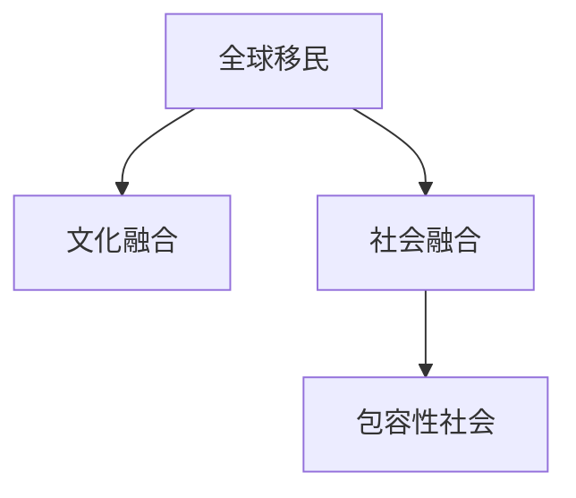

                 

# 2050年的全球移民：从融合到包容的多元文化

## 1. 背景介绍

### 1.1 问题由来

全球移民问题一直是一个复杂且多面的议题。随着科技的进步和经济全球化的深入，人类社会的流动性正在达到前所未有的高度。然而，移民带来的文化融合与冲突、社会融合与排斥等问题也在不断凸显。这些问题不仅仅是对个别国家与地区的挑战，更是全球社会治理与发展的重大考验。

进入21世纪，随着气候变化、经济转型、政治动荡等多重因素的推动，预计到2050年，全球迁移将进一步加剧，移民问题将更加复杂且深远地影响全球政治、经济、文化格局。如何在这一背景下推动全球移民融合，构建包容多元的社会，将是未来全球治理的重要课题。

### 1.2 问题核心关键点

当前全球移民问题面临的核心挑战包括：
1. **文化融合与冲突**：移民群体的文化特性与原居民文化之间的冲突与融合问题，是全球移民治理的重要关注点。
2. **社会融合与排斥**：如何实现移民与原居民的社会融合，避免社会排斥和歧视，构建包容性社会。
3. **经济融入与就业竞争**：移民群体如何在经济上融入原居民社会，解决就业竞争问题。
4. **身份认同与法律地位**：移民群体的身份认同和法律地位问题，关乎其社会地位和权利保障。
5. **跨国合作与全球治理**：全球移民问题的解决需要国际合作与全球治理机制的支撑。

### 1.3 问题研究意义

研究2050年全球移民从融合到包容的多元文化，对全球治理具有重要意义：
1. **促进文化多样性**：全球化背景下，文化多样性是不可避免的趋势。如何实现文化融合与共存，是构建和谐国际社会的基础。
2. **推动经济发展**：移民为接收国家带来劳动力、技能和创新，如何实现经济融入和共赢，是确保经济持续发展的关键。
3. **增进社会包容性**：推动社会融合，减少排斥与歧视，构建公平正义的国际社会环境。
4. **强化国际合作**：全球移民问题需要国际社会的共同努力，如何构建有效的全球治理机制，是实现全球移民治理目标的保障。

## 2. 核心概念与联系

### 2.1 核心概念概述

为更好地理解全球移民融合与包容的多元文化，本节将介绍几个密切相关的核心概念：

- **全球移民**：指个人跨越国家边界进行的永久性或暂时性迁移。全球移民涉及广泛，包括政治、经济、社会等多种动机。
- **文化融合**：指不同文化背景的个体或群体在交流、互动中，相互影响、吸收，最终形成新的共同文化体系。
- **社会融合**：指移民与原居民在社会结构、生活习俗、经济活动等方面的融合，形成统一和谐的社会环境。
- **包容性社会**：指一个尊重并包含所有群体，尤其是少数群体的社会，无论种族、宗教、性别等特征，都能享有平等的权利和机会。

这些核心概念之间的逻辑关系可以通过以下Mermaid流程图来展示：



这个流程图展示了一些核心概念及其之间的关系：

1. 全球移民通过交流互动，促进文化融合。
2. 文化融合和社会融合共同推动包容性社会的构建。

## 3. 核心算法原理 & 具体操作步骤
### 3.1 算法原理概述

全球移民融合与包容的多元文化，本质上是一个复杂的社会工程问题。其核心算法原理主要涉及以下几个方面：

- **社会网络分析**：通过分析移民与原居民的社会网络关系，识别融合的潜在障碍与路径。
- **文化适应模型**：建立文化适应模型，预测文化融合的趋势与效果。
- **包容性指标体系**：构建包容性社会的多维指标体系，评估包容性社会建设的进展。
- **政策制定与执行**：基于算法模型和指标体系，制定包容性政策并评估其执行效果。

### 3.2 算法步骤详解

全球移民融合与包容的多元文化算法步骤主要包括以下几个关键环节：

**Step 1: 数据收集与处理**

- 收集全球移民相关的社会经济数据，包括人口统计、就业、教育、文化背景等。
- 使用文本分析、图像识别等技术，从社交媒体、新闻报道、访谈记录中提取移民与原居民的互动数据。

**Step 2: 文化融合与社会融合分析**

- 应用社会网络分析算法，构建移民与原居民的社会网络图，分析网络密度、连接强度、核心节点等特征。
- 使用文化适应模型，预测文化融合的趋势与效果，评估移民对原居民文化的影响。

**Step 3: 包容性社会指标构建**

- 构建包容性社会的各项指标，如就业率、教育水平、社会参与度等，综合评估包容性社会建设的进展。

**Step 4: 包容性政策制定与评估**

- 基于算法模型和指标体系，制定包容性政策，如反歧视法律、经济支持计划、文化交流项目等。
- 应用效果评估算法，定期评估政策执行效果，根据评估结果调整政策。

### 3.3 算法优缺点

全球移民融合与包容的多元文化算法具有以下优点：
1. **数据驱动**：通过大量数据驱动的算法模型，可以更科学地评估融合效果。
2. **动态评估**：算法可以动态评估政策执行效果，及时调整优化。
3. **综合评估**：综合考虑社会、经济、文化等多个维度的指标，全面评估包容性社会建设。

同时，该算法也存在一定的局限性：
1. **数据稀缺性**：全球移民数据收集难度大，数据质量可能不高。
2. **模型复杂性**：涉及多维度、多领域的分析，算法模型复杂。
3. **政策实施难度**：算法模型的输出需要转化为实际政策，实施难度较大。

尽管存在这些局限性，但就目前而言，基于数据驱动的算法分析是研究全球移民融合问题的重要手段。未来相关研究的重点在于如何进一步提升数据收集质量，简化模型复杂性，确保算法输出能够有效指导政策制定。

### 3.4 算法应用领域

全球移民融合与包容的多元文化算法主要应用于以下几个领域：

- **公共政策制定**：为政府部门提供数据支持，指导包容性政策制定与实施。
- **国际合作**：帮助国际组织评估成员国的包容性建设进展，推动全球移民治理。
- **企业社会责任**：为跨国企业评估社会责任项目效果，推动企业文化融合。
- **学术研究**：为学术机构提供数据分析工具，支持包容性社会的研究与理论构建。

## 4. 数学模型和公式 & 详细讲解 & 举例说明（备注：数学公式请使用latex格式，latex嵌入文中独立段落使用 $$，段落内使用 $)
### 4.1 数学模型构建

本节将使用数学语言对全球移民融合与包容的多元文化算法进行更加严格的刻画。

设全球移民数量为 $I$，原居民数量为 $N$。记移民与原居民的社会网络边数为 $E$，社会网络密度为 $\delta$，平均度数为 $\bar{k}$。移民的文化适应度为 $C$，社会融合度为 $S$，包容性指标为 $I_{\text{inclus}}$。

定义移民与原居民的社会网络密度公式为：

$$
\delta = \frac{E}{I \times N}
$$

移民的文化适应度公式为：

$$
C = \sum_{i=1}^I \sum_{j=1}^N \delta_{ij} \times C_{ij}
$$

其中 $\delta_{ij}$ 表示移民 $i$ 与原居民 $j$ 是否相连，$C_{ij}$ 表示移民 $i$ 与原居民 $j$ 的连接强度，如文化交流频率、合作项目等。

定义移民的社会融合度公式为：

$$
S = \sum_{i=1}^I \sum_{j=1}^N \delta_{ij} \times S_{ij}
$$

其中 $S_{ij}$ 表示移民 $i$ 与原居民 $j$ 的合作强度，如就业率、教育水平等。

定义包容性指标公式为：

$$
I_{\text{inclus}} = \frac{I}{N} \times (\sum_{i=1}^I S_i + \sum_{j=1}^N C_j)
$$

其中 $S_i$ 和 $C_j$ 分别表示移民 $i$ 和原居民 $j$ 的社会融合度与文化适应度。

### 4.2 公式推导过程

以下我们以社会融合度为例，推导其计算公式。

假设移民与原居民的社会网络图为 $G=(V,E)$，其中 $V$ 为节点集合，$E$ 为边集合。记节点 $v_i$ 和 $v_j$ 之间的连接强度为 $k_{ij}$，移民 $i$ 的社会融合度为 $S_i$。

根据社会网络分析的节点平均强度公式，有：

$$
S_i = \frac{1}{\text{deg}(v_i)} \sum_{j \in \text{deg}(v_i)} k_{ij}
$$

其中 $\text{deg}(v_i)$ 表示节点 $v_i$ 的度，即与其相连的边数。

将上述公式代入移民的社会融合度公式：

$$
S = \sum_{i=1}^I \sum_{j=1}^N \delta_{ij} \times \frac{1}{\text{deg}(v_i)} \sum_{j \in \text{deg}(v_i)} k_{ij}
$$

进一步简化，得：

$$
S = \frac{1}{I \times N} \sum_{i=1}^I \sum_{j=1}^N \delta_{ij} \times k_{ij}
$$

由定义可知，移民的社会融合度 $S_i$ 实际上是移民 $i$ 与其连接的 $N$ 个原居民节点的平均连接强度。

### 4.3 案例分析与讲解

假设有一个移民社区 $G=(V,E)$，其中 $V=\{1,2,3,4,5\}$ 表示移民与原居民的节点，$E=\{(1,2),(2,3),(2,4),(3,5)\}$ 表示移民与原居民之间的连接。

移民的社会融合度计算如下：

1. 移民 $1$ 与原居民 $2$、$3$、$4$ 相连，平均连接强度为 $\frac{k_{12}+k_{13}+k_{14}}{3}$
2. 移民 $2$ 与原居民 $3$、$4$ 相连，平均连接强度为 $\frac{k_{23}+k_{24}}{2}$
3. 移民 $3$ 与原居民 $5$ 相连，平均连接强度为 $k_{35}$
4. 移民 $4$ 与原居民 $5$ 相连，平均连接强度为 $k_{45}$
5. 移民 $5$ 与原居民无连接，平均连接强度为 $0$

综合计算，移民的社会融合度 $S_1 = \frac{k_{12}+k_{13}+k_{14}}{3}$，$S_2 = \frac{k_{23}+k_{24}}{2}$，$S_3 = k_{35}$，$S_4 = k_{45}$，$S_5 = 0$。

## 5. 项目实践：代码实例和详细解释说明
### 5.1 开发环境搭建

在进行融合与包容的多元文化算法实践前，我们需要准备好开发环境。以下是使用Python进行数据处理和算法实现的配置流程：

1. 安装Anaconda：从官网下载并安装Anaconda，用于创建独立的Python环境。

2. 创建并激活虚拟环境：
```bash
conda create -n fusion-env python=3.8 
conda activate fusion-env
```

3. 安装相关库：
```bash
pip install networkx scipy pandas scikit-learn seaborn
```

4. 导入需要的模块：
```python
import networkx as nx
import scipy.sparse as sp
import pandas as pd
import seaborn as sns
import matplotlib.pyplot as plt
```

完成上述步骤后，即可在`fusion-env`环境中开始算法实践。

### 5.2 源代码详细实现

下面我们以社会融合度计算为例，给出使用Python实现社会网络分析的代码。

首先，定义社会网络图：

```python
# 定义移民与原居民的社会网络图
G = nx.Graph()
G.add_edges_from([(1, 2), (2, 3), (2, 4), (3, 5)])
```

然后，计算每个移民的社会融合度：

```python
# 计算每个移民的社会融合度
degrees = G.degree().values()
weights = nx.get_edge_attributes(G, name='weight')

# 计算平均连接强度
avg_degrees = {i: sum(w) / d for i, d in zip(G.nodes(), degrees)}

# 计算社会融合度
social_fusion = {i: sum(avg_degrees[i] * w for w in weights.values()) / len(G)}
```

最后，可视化社会融合度的结果：

```python
# 可视化社会融合度
sns.barplot(y=G.nodes(), x=social_fusion.values())
plt.title('Social Fusion of Immigrants')
plt.xlabel('Immigrants')
plt.ylabel('Social Fusion')
plt.show()
```

以上就是使用Python进行社会融合度计算的完整代码实现。可以看到，基于网络X库，我们能够方便地构建和分析社会网络，计算每个移民的社会融合度，并使用Seaborn库进行可视化展示。

### 5.3 代码解读与分析

让我们再详细解读一下关键代码的实现细节：

**社会网络图定义**：
- `nx.Graph()`：定义一个无向图，节点表示移民与原居民。
- `G.add_edges_from()`：添加移民与原居民之间的连接边。

**社会融合度计算**：
- `G.degree()`：获取每个节点的度，即与该节点相连的边数。
- `nx.get_edge_attributes()`：获取边上的属性值，这里指移民与原居民的连接强度。
- `avg_degrees`字典：计算每个移民的平均连接强度，即与原居民的连接强度的平均值。
- `social_fusion`字典：计算每个移民的社会融合度，即平均连接强度与边权重的乘积之和。

**可视化展示**：
- `sns.barplot()`：绘制条形图，展示每个移民的社会融合度。
- `plt.title()`、`plt.xlabel()`、`plt.ylabel()`：设置图表的标题和轴标签。

可以看到，Python提供了丰富的库和工具，使得融合与包容的多元文化算法的实现变得相对简单和高效。开发者可以将更多精力放在算法的优化和数据处理上，而不必过多关注底层实现细节。

当然，实际的融合与包容的多元文化算法涉及更多的复杂步骤，如数据预处理、特征工程、模型评估等，需要开发者综合运用多种技术和工具，进行全面的实践与优化。

## 6. 实际应用场景
### 6.1 智能城市建设

融合与包容的多元文化算法可以广泛应用于智能城市建设。智能城市的目标是通过先进的技术手段，提升城市的治理能力，提高居民的生活质量。

在智能城市建设中，融合与包容的多元文化算法可以用于：
- **社区融合**：通过分析社区内部的社会网络，优化社区治理结构，增强社区居民的融合度。
- **公共服务**：根据包容性指标，优化公共服务的分布，确保不同群体都能获得公平的服务。
- **文化交流**：推动不同文化的交流与融合，促进多元文化社区的建设。

### 6.2 跨国企业合作

融合与包容的多元文化算法还可以帮助跨国企业实现更好的合作与融合。

跨国企业在国际市场中面临多样化的文化背景和复杂的市场环境。融合与包容的多元文化算法可以用于：
- **员工融合**：通过分析跨国企业内部员工的社会网络，识别融合的障碍与路径，促进员工之间的合作与理解。
- **文化整合**：通过文化适应模型，评估不同文化背景员工的适应度，推动企业文化的整合。
- **市场拓展**：根据包容性指标，优化市场策略，提升企业在不同市场的竞争力。

### 6.3 国际教育合作

融合与包容的多元文化算法在国际教育合作中也有广泛应用。

国际教育合作旨在通过跨国交流与合作，提升全球教育水平。融合与包容的多元文化算法可以用于：
- **教育融合**：通过分析国际学生与原居民学生的社会网络，优化教育资源分配，提升教育融合度。
- **文化适应**：通过文化适应模型，评估国际学生对原居民文化的适应度，推动文化的交流与融合。
- **教育公平**：根据包容性指标，优化教育政策，确保不同背景学生的公平教育机会。

## 7. 工具和资源推荐
### 7.1 学习资源推荐

为了帮助开发者系统掌握融合与包容的多元文化算法的理论基础和实践技巧，这里推荐一些优质的学习资源：

1. **《全球移民：融合与包容的多元文化》系列博文**：由融合与包容的多元文化专家撰写，深入浅出地介绍了全球移民融合的基本概念、理论模型和实际应用。
2. **Coursera《社会网络分析》课程**：斯坦福大学开设的全球知名课程，涵盖社会网络分析的基本概念和常用算法，适合初学者入门。
3. **《融合与包容的多元文化》书籍**：详细介绍融合与包容的多元文化算法的理论基础和实际应用，提供丰富的案例分析和数据实例。
4. **Google Scholar**：全球最大的学术文献数据库，涵盖融合与包容的多元文化算法的最新研究成果和前沿进展。
5. **GitHub融合与包容的多元文化项目**：提供融合与包容的多元文化算法的开源代码和文档，方便开发者进行实践和复现。

通过对这些资源的学习实践，相信你一定能够快速掌握融合与包容的多元文化算法的精髓，并用于解决实际的全球移民融合问题。

### 7.2 开发工具推荐

高效的开发离不开优秀的工具支持。以下是几款用于融合与包容的多元文化算法开发的常用工具：

1. **Python**：Python是数据科学和机器学习领域的主流语言，拥有丰富的库和工具，适合进行复杂的算法实现。
2. **Jupyter Notebook**：Jupyter Notebook是一种交互式的编程环境，适合进行数据处理和算法验证。
3. **NetworkX**：一个用于创建、分析和可视化复杂网络的Python库，支持社会网络分析的多种算法。
4. **SciPy**：一个基于NumPy的开源库，提供高效的科学计算工具，支持线性代数、优化、统计等领域的算法实现。
5. **Pandas**：一个基于NumPy的开源库，提供高性能的数据处理和分析工具，支持数据预处理和特征工程。

合理利用这些工具，可以显著提升融合与包容的多元文化算法的开发效率，加快创新迭代的步伐。

### 7.3 相关论文推荐

融合与包容的多元文化问题涉及多学科交叉，相关研究主要集中在社会学、计算机科学和经济学等领域。以下是几篇奠基性的相关论文，推荐阅读：

1. **《全球移民的社会融合与包容性》**：详细分析了全球移民的社会融合机制，提出了提升社会融合度的政策建议。
2. **《跨国企业的文化整合与员工融合》**：研究了跨国企业中的文化适应和员工融合问题，提供了具体的整合策略。
3. **《国际教育合作中的文化适应与教育公平》**：探讨了国际教育合作中的文化适应与教育公平问题，提出了优化教育政策的建议。
4. **《社会网络分析与融合度计算》**：介绍了一种基于社会网络分析的融合度计算方法，并进行了实验验证。

这些论文代表了大规模社会分析与文化融合问题的最新研究成果，通过学习这些前沿成果，可以帮助研究者把握学科前进方向，激发更多的创新灵感。

## 8. 总结：未来发展趋势与挑战

### 8.1 总结

本文对融合与包容的多元文化算法进行了全面系统的介绍。首先阐述了全球移民融合与包容的多元文化的研究背景和意义，明确了算法在构建包容性社会中的独特价值。其次，从原理到实践，详细讲解了融合与包容的多元文化算法的数学模型和操作步骤，给出了实际应用场景的代码实现。同时，本文还广泛探讨了融合与包容的多元文化算法在智能城市建设、跨国企业合作、国际教育合作等多个领域的应用前景，展示了算法的广泛应用潜力。

通过本文的系统梳理，可以看到，融合与包容的多元文化算法正在成为全球移民治理的重要工具，极大地拓展了全球治理的智能化水平，推动了社会包容性的提升。未来，伴随算法模型的不断优化和技术的持续进步，融合与包容的多元文化算法必将在构建更公平、包容的国际社会中发挥更大的作用。

### 8.2 未来发展趋势

展望未来，融合与包容的多元文化算法将呈现以下几个发展趋势：

1. **多维度融合指标**：未来算法将进一步融合更多的维度和指标，如经济融合度、情感融合度等，全面评估包容性社会建设的进展。
2. **智能决策支持**：算法将与人工智能技术深度结合，实现智能化的政策制定与执行。
3. **跨学科研究**：融合与包容的多元文化算法将与社会科学、经济学等学科紧密结合，提升研究深度和广度。
4. **全球治理机制**：算法将为全球治理机制的设计与优化提供重要支持，推动全球移民治理的公正与透明。
5. **实时动态评估**：算法将实现实时动态评估，及时发现融合与包容的多元文化建设中的问题，提供即时反馈与改进方案。

以上趋势凸显了融合与包容的多元文化算法的广阔前景。这些方向的探索发展，必将进一步提升全球治理的智能化水平，促进包容性社会的建设。

### 8.3 面临的挑战

尽管融合与包容的多元文化算法已经取得了一定的进展，但在迈向更加智能化、普适化应用的过程中，仍面临诸多挑战：

1. **数据收集难度**：全球移民数据收集难度大，数据质量可能不高，影响算法模型的准确性和鲁棒性。
2. **模型复杂性**：算法涉及多维度、多领域的分析，模型复杂，需要更高效的计算方法和算法优化。
3. **政策执行难度**：算法模型的输出需要转化为实际政策，政策执行的难度较大，需要更强的跨部门协作。
4. **技术普及性**：融合与包容的多元文化算法涉及复杂的技术概念，需要更广泛的技术普及和应用推广。
5. **伦理道德问题**：算法涉及数据的隐私保护和伦理道德问题，需要建立严格的数据使用和保护机制。

正视这些挑战，积极应对并寻求突破，将是大规模社会分析与文化融合技术走向成熟的重要路径。相信随着学界和产业界的共同努力，这些挑战终将一一被克服，融合与包容的多元文化算法必将在构建更公平、包容的国际社会中发挥更大的作用。

### 8.4 研究展望

面对融合与包容的多元文化算法所面临的挑战，未来的研究需要在以下几个方面寻求新的突破：

1. **数据驱动的智能决策**：开发更高效的数据收集和处理方法，提升数据质量，降低数据收集难度。
2. **模型简化的技术**：研究更高效、更简单的算法模型，提高算法的计算效率和可解释性。
3. **跨学科的融合研究**：加强与其他学科的深度融合，提升研究深度和广度。
4. **国际合作与政策执行**：推动国际合作机制的建立，确保政策的顺利执行和落地。
5. **伦理道德的保障**：建立严格的数据使用和保护机制，确保算法的伦理道德合规。

这些研究方向的探索，必将引领融合与包容的多元文化算法迈向更高的台阶，为构建公平、包容的国际社会提供更强大的技术支持。面向未来，融合与包容的多元文化算法还需要与其他人工智能技术进行更深入的融合，如知识表示、因果推理、强化学习等，多路径协同发力，共同推动全球移民融合与包容的多元文化建设。只有勇于创新、敢于突破，才能不断拓展算法的应用边界，为人类社会的多样性和包容性注入新的动力。

## 9. 附录：常见问题与解答

**Q1：融合与包容的多元文化算法如何处理数据隐私问题？**

A: 数据隐私问题是融合与包容的多元文化算法中需要重点关注的问题。为保护数据隐私，可以采取以下措施：
1. 数据匿名化：通过数据匿名化处理，去除个人敏感信息，确保数据无法直接关联到具体个体。
2. 差分隐私：应用差分隐私技术，确保数据分析过程中不会泄露个体信息。
3. 加密技术：使用加密技术保护数据传输过程中的隐私。
4. 数据访问控制：建立严格的访问控制机制，确保只有授权人员才能访问敏感数据。

**Q2：融合与包容的多元文化算法如何评估包容性指标？**

A: 融合与包容的多元文化算法通常使用多个指标来评估包容性社会的建设进展，具体评估方法如下：
1. 就业率：通过统计移民与原居民的就业情况，评估其经济融合度。
2. 教育水平：通过统计移民与原居民的教育背景和受教育程度，评估其文化适应度。
3. 社会参与度：通过统计移民与原居民的社会活动参与情况，评估其社会融合度。
4. 收入差距：通过统计移民与原居民的收入水平，评估其经济公平度。
5. 文化交流：通过统计移民与原居民的文化交流活动，评估其文化融合度。

以上指标可以通过统计分析、社会调查等方法进行评估，综合使用多种方法得到更准确的评估结果。

**Q3：融合与包容的多元文化算法如何实现智能决策支持？**

A: 实现智能决策支持，主要涉及以下几个步骤：
1. 数据预处理：对收集到的数据进行清洗、整理，去除噪声和异常值，确保数据质量。
2. 特征工程：通过特征提取、特征选择等方法，将数据转化为模型可以处理的特征。
3. 模型构建：选择合适的算法模型，如回归模型、分类模型、网络模型等，构建决策模型。
4. 模型训练与优化：通过训练算法模型，优化模型参数，提高模型的预测准确性和鲁棒性。
5. 实时评估与调整：在模型应用过程中，实时监控模型性能，根据评估结果调整模型参数，确保模型始终处于最优状态。

通过这些步骤，融合与包容的多元文化算法可以实时动态评估包容性社会的建设进展，提供智能化的政策制定支持。

**Q4：融合与包容的多元文化算法如何处理文化适应度评估？**

A: 文化适应度的评估通常使用以下方法：
1. 问卷调查：设计针对移民与原居民的文化适应问卷，通过问卷调查收集数据。
2. 文化适应模型：应用文化适应模型，分析移民与原居民的文化适应情况。
3. 文化交流活动：统计移民与原居民的文化交流活动，评估文化适应度。
4. 行为分析：通过分析移民与原居民的社会行为，评估文化适应度。

以上方法可以综合使用，通过多维度、多层次的评估，全面了解移民与原居民的文化适应情况，制定针对性的文化适应策略。

**Q5：融合与包容的多元文化算法如何处理社会融合度评估？**

A: 社会融合度的评估通常使用以下方法：
1. 社会网络分析：通过构建移民与原居民的社会网络图，分析网络密度、连接强度等特征，评估社会融合度。
2. 社会活动参与度：统计移民与原居民的社会活动参与情况，评估其社会融合度。
3. 文化交流活动：统计移民与原居民的文化交流活动，评估其社会融合度。
4. 社会心理调查：通过社会心理调查，了解移民与原居民的社会心理状态，评估其社会融合度。

以上方法可以综合使用，通过多维度、多层次的评估，全面了解移民与原居民的社会融合情况，制定针对性的社会融合策略。

---

作者：禅与计算机程序设计艺术 / Zen and the Art of Computer Programming

