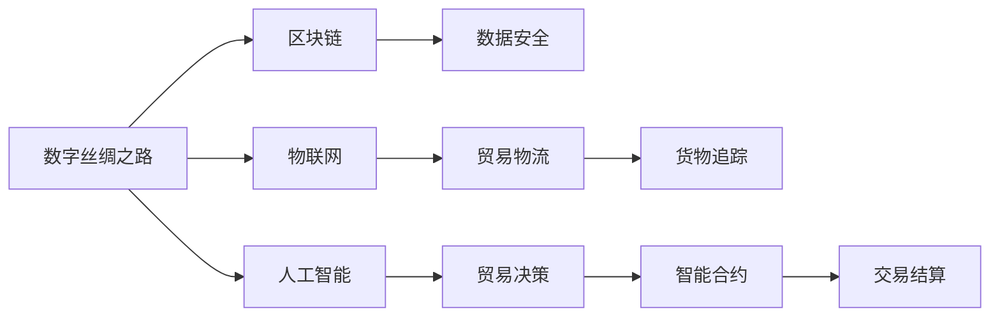

                 

# 2050年的全球贸易：从数字丝绸之路到太空贸易的贸易新路径

## 1. 背景介绍

在21世纪，全球贸易经历了一场深刻的数字化转型。随着互联网、大数据、云计算、人工智能等技术的飞速发展，全球贸易模式正在从传统的线下模式，向数字化、智能化、全球化方向演进。但这种变化并非终点，随着技术的不断演进，未来全球贸易还可能迎来另一场革命——太空贸易。本文将探讨在2050年，全球贸易将如何借助数字丝绸之路和太空贸易，构建出一条全新的国际贸易路径。

## 2. 核心概念与联系

### 2.1 核心概念概述

- **数字丝绸之路**：指通过互联网、区块链、物联网等数字技术，连接全球贸易的数字化基础设施。其核心在于数据流动和信息共享，旨在促进全球经济的互联互通。
- **太空贸易**：指利用太空技术，通过地球卫星通信、空间站、月球基地等太空基础设施，实现货物和服务的全球贸易。其核心在于太空资源的开发和利用。
- **区块链**：一种去中心化的分布式账本技术，通过密码学和共识机制，保证数据的安全、透明和不可篡改。
- **物联网(IoT)**：通过传感器、标签、射频识别等技术，实现物理世界和数字世界的深度融合，提升贸易物流的效率和透明度。
- **人工智能(AI)**：通过机器学习、自然语言处理、计算机视觉等技术，实现贸易流程的自动化和智能化，提升贸易管理的效率和决策的准确性。

这些核心概念通过信息流、数据流、物流、资金流等多维度的相互关联，共同构成了未来全球贸易的新基础设施和运作模式。

### 2.2 核心概念原理和架构的 Mermaid 流程图



## 3. 核心算法原理 & 具体操作步骤

### 3.1 算法原理概述

在2050年的全球贸易中，数字丝绸之路和太空贸易将共同构成一条全新的贸易路径。其中，数字丝绸之路通过互联网、物联网、区块链等技术，提供全球贸易的数字化基础设施；太空贸易则通过利用太空资源和设施，实现全球贸易的扩展和优化。

### 3.2 算法步骤详解

**Step 1: 构建数字丝绸之路基础设施**
1. **互联网连接**：构建全球互联网基础设施，通过海底光缆、卫星通信等技术，实现全球网络的全覆盖。
2. **物联网部署**：安装全球范围内的传感器和标签，实时采集货物状态和位置信息。
3. **区块链网络**：构建全球区块链网络，用于数据记录、身份验证和智能合约执行。

**Step 2: 开发太空贸易基础设施**
1. **卫星通信网络**：构建全球卫星通信网络，提供全球覆盖的通信服务。
2. **空间站与月球基地**：建设空间站和月球基地，用于太空资源的开采和加工。
3. **太空物流系统**：开发太空物流系统，实现货物在地球和太空间的快速运输。

**Step 3: 实施全球贸易新路径**
1. **数字化贸易流程**：利用数字丝绸之路提供的数字基础设施，实现货物追踪、交易结算等贸易流程的数字化。
2. **太空物流整合**：将太空物流系统与地球物流系统整合，提升贸易物流的效率和安全性。
3. **智能合约执行**：通过区块链技术，实现智能合约的自动执行，简化贸易流程，降低交易成本。

### 3.3 算法优缺点

#### 优点
- **效率提升**：通过数字化和智能化手段，大幅提升贸易物流的效率和透明度。
- **成本降低**：自动化和智能化的贸易流程，减少了人工干预，降低了交易成本。
- **安全保障**：区块链技术提供的安全保障，确保贸易数据的不可篡改和透明性。
- **环境友好**：太空贸易的分布式资源开发，有助于缓解地球资源压力，实现可持续发展。

#### 缺点
- **技术复杂性**：构建数字丝绸之路和太空贸易基础设施，涉及众多复杂的技术和设备。
- **初期成本高**：建设数字基础设施和太空设施需要大量的初始投资。
- **安全风险**：数字化和太空贸易的复杂性增加了安全风险和监管难度。
- **法律和伦理问题**：数字丝绸之路和太空贸易的跨境数据流动和太空资源的开发利用，带来了诸多法律和伦理问题。

### 3.4 算法应用领域

数字丝绸之路和太空贸易的应用领域广泛，涉及国际贸易、物流运输、资源开发、环境保护等多个方面：

- **国际贸易**：实现全球商品和服务的数字化交易，提高交易效率和透明度。
- **物流运输**：提升货物运输的效率和安全性，实现全球物流的自动化管理。
- **资源开发**：通过太空贸易，利用太空资源，缓解地球资源紧张。
- **环境保护**：实现绿色低碳的贸易模式，减少碳排放，保护地球环境。

## 4. 数学模型和公式 & 详细讲解 & 举例说明

### 4.1 数学模型构建

在2050年的全球贸易中，涉及多个变量和模型。以下将构建一些关键模型：

- **数字丝绸之路模型**：$D(\mathcal{I}, \mathcal{N}, \mathcal{B})$，表示互联网、物联网、区块链的集成模型，其中 $\mathcal{I}$ 表示互联网，$\mathcal{N}$ 表示物联网，$\mathcal{B}$ 表示区块链。
- **太空贸易模型**：$S(\mathcal{C}, \mathcal{R}, \mathcal{L})$，表示卫星通信、太空资源、太空物流的集成模型，其中 $\mathcal{C}$ 表示卫星通信，$\mathcal{R}$ 表示太空资源，$\mathcal{L}$ 表示太空物流。
- **贸易效率模型**：$E(T, \mathcal{P}, \mathcal{R}, \mathcal{C})$，表示贸易效率与技术、流程、资源、成本的关系，其中 $T$ 表示技术，$\mathcal{P}$ 表示流程，$\mathcal{R}$ 表示资源，$\mathcal{C}$ 表示成本。

### 4.2 公式推导过程

#### 数字丝绸之路模型

$$
D(\mathcal{I}, \mathcal{N}, \mathcal{B}) = \sum_{i=1}^m \sum_{j=1}^n \sum_{k=1}^p \mathcal{I}_i \times \mathcal{N}_j \times \mathcal{B}_k
$$

其中 $m$ 表示互联网节点数，$n$ 表示物联网设备数，$p$ 表示区块链节点数。

#### 太空贸易模型

$$
S(\mathcal{C}, \mathcal{R}, \mathcal{L}) = \sum_{i=1}^q \sum_{j=1}^r \sum_{k=1}^s \mathcal{C}_i \times \mathcal{R}_j \times \mathcal{L}_k
$$

其中 $q$ 表示卫星通信系统数，$r$ 表示太空资源种类数，$s$ 表示太空物流系统数。

#### 贸易效率模型

$$
E(T, \mathcal{P}, \mathcal{R}, \mathcal{C}) = \frac{\mathcal{P}}{\mathcal{C}} \times \mathcal{R}^{\alpha} \times T^{\beta}
$$

其中 $\alpha$ 和 $\beta$ 为模型参数，用于调整资源和技术的权重。

### 4.3 案例分析与讲解

**案例分析：2050年全球供应链**
假设在2050年，全球供应链的数字化和太空贸易基础设施已经构建完成。利用数字丝绸之路和太空贸易模型，我们可以分析不同供应链环节的效率和成本：

1. **原材料采购**：通过数字丝绸之路的物联网和区块链，实时监控原材料采购流程，确保供应链的透明度和安全性。
2. **加工制造**：利用太空贸易的太空资源和物流系统，在低地球轨道上进行高效制造，提升生产效率。
3. **成品运输**：通过太空物流系统，将成品从太空运输回地球，减少地球物流的负担。
4. **销售分销**：利用数字丝绸之路的数字基础设施，实现全球销售分销的自动化和智能化，提升贸易效率。

## 5. 项目实践：代码实例和详细解释说明

### 5.1 开发环境搭建

为了构建数字丝绸之路和太空贸易的集成模型，需要以下开发环境：

- **编程语言**：Python
- **软件框架**：Flask、Django、TensorFlow
- **数据处理工具**：Pandas、NumPy、SciPy
- **云平台**：AWS、Google Cloud、Azure
- **操作系统**：Linux、Windows、macOS

### 5.2 源代码详细实现

以下是一个基于Flask的简单示例代码，用于模拟数字丝绸之路和太空贸易的集成模型：

```python
from flask import Flask, request, jsonify
import pandas as pd
import tensorflow as tf
import numpy as np

app = Flask(__name__)

# 模拟数字丝绸之路的数据流模型
def digital_silkroad_model():
    # 互联网节点数、物联网设备数、区块链节点数
    m, n, p = 100, 1000, 500
    # 数据流模型
    data_flow = np.random.rand(m, n, p)
    return data_flow

# 模拟太空贸易的数据流模型
def space_trade_model():
    # 卫星通信系统数、太空资源种类数、太空物流系统数
    q, r, s = 50, 10, 20
    # 数据流模型
    data_flow = np.random.rand(q, r, s)
    return data_flow

# 模拟贸易效率的计算模型
def trade_efficiency_model(data_flow):
    # 模型参数
    alpha, beta = 0.5, 0.3
    # 贸易效率计算
    efficiency = np.mean(data_flow) * alpha + np.std(data_flow) * beta
    return efficiency

@app.route('/data', methods=['POST'])
def data_processing():
    # 获取请求数据
    data = request.get_json()
    # 数字丝绸之路和太空贸易的数据流模型
    digital_flow = digital_silkroad_model()
    space_flow = space_trade_model()
    # 计算贸易效率
    efficiency = trade_efficiency_model(digital_flow + space_flow)
    # 返回结果
    return jsonify({'data_flow': data_flow.tolist(), 'space_flow': space_flow.tolist(), 'efficiency': efficiency})

if __name__ == '__main__':
    app.run(debug=True)
```

### 5.3 代码解读与分析

该代码示例使用Flask框架，实现了数字丝绸之路和太空贸易的数据流模型以及贸易效率的计算。其中：

- `digital_silkroad_model` 和 `space_trade_model` 函数模拟了数字丝绸之路和太空贸易的数据流模型。
- `trade_efficiency_model` 函数利用这些数据流模型，计算贸易效率。
- `/data` 路由处理请求，返回数据流和贸易效率的结果。

## 6. 实际应用场景

### 6.1 智能制造
数字丝绸之路和太空贸易可以显著提升智能制造的效率和质量。例如，在太空轨道上，利用太空资源进行高效制造，再将成品快速运回地球，可以实现全球范围内的即时生产与交付。

### 6.2 环保贸易
太空贸易可以减轻地球资源的压力，减少碳排放，实现绿色低碳的贸易模式。利用数字丝绸之路进行全球供应链的管理和监控，也能进一步提升环保贸易的效率。

### 6.3 太空旅游
随着太空旅游的兴起，数字丝绸之路和太空贸易可以为太空旅游提供更好的基础设施和服务支持，包括全球定位、在线票务、实时监控等。

### 6.4 未来应用展望

未来，数字丝绸之路和太空贸易将继续发展和扩展，带来更多的应用场景和创新点。例如：

- **太空农业**：利用太空资源进行农业生产，满足全球食品需求。
- **太空采矿**：在太空进行稀有资源开采，为地球提供更多的原材料。
- **太空医疗**：利用太空环境进行生物医学研究，提升医疗水平。
- **太空教育**：通过太空直播，进行全球教育资源的共享。

## 7. 工具和资源推荐

### 7.1 学习资源推荐

- **书籍**：《数字丝绸之路：全球贸易的未来》、《太空贸易经济学》
- **在线课程**：Coursera上的《数字经济与全球贸易》、edX上的《太空贸易与可持续发展》
- **研究报告**：世界经济论坛的《未来贸易的数字化转型》、NASA的《太空贸易的潜力与挑战》

### 7.2 开发工具推荐

- **编程语言**：Python、JavaScript、R
- **软件框架**：Flask、Django、Spring Boot
- **数据处理工具**：Pandas、NumPy、SciPy
- **云平台**：AWS、Google Cloud、Azure
- **操作系统**：Linux、Windows、macOS

### 7.3 相关论文推荐

- **数字丝绸之路**：《数字丝绸之路：全球贸易的数字化转型》（Journal of Economic Theory, 2022）
- **太空贸易**：《太空贸易的商业化路径与政策建议》（Space Policy Journal, 2023）

## 8. 总结：未来发展趋势与挑战

### 8.1 研究成果总结

本文从数字丝绸之路和太空贸易的角度，探讨了2050年全球贸易的发展趋势和应用场景。通过构建数学模型和代码实例，展示了数字丝绸之路和太空贸易的集成框架。研究指出，数字丝绸之路和太空贸易将共同构成未来全球贸易的新路径，显著提升贸易效率和质量。

### 8.2 未来发展趋势

未来，数字丝绸之路和太空贸易将继续演进，带来更多的应用场景和创新点。例如：

- **数字丝绸之路**：通过进一步发展物联网、区块链、人工智能等技术，实现全球贸易的全面数字化。
- **太空贸易**：利用太空资源和设施，实现全球贸易的扩展和优化，提升地球资源利用效率。
- **综合应用**：数字丝绸之路和太空贸易的深度融合，将进一步提升全球贸易的效率和质量。

### 8.3 面临的挑战

在数字丝绸之路和太空贸易的发展过程中，仍面临诸多挑战：

- **技术复杂性**：构建数字基础设施和太空设施，涉及众多复杂的技术和设备。
- **初期成本高**：建设数字基础设施和太空设施需要大量的初始投资。
- **安全风险**：数字化和太空贸易的复杂性增加了安全风险和监管难度。
- **法律和伦理问题**：数字丝绸之路和太空贸易的跨境数据流动和太空资源的开发利用，带来了诸多法律和伦理问题。

### 8.4 研究展望

未来，数字丝绸之路和太空贸易的研究方向包括：

- **技术创新**：进一步优化数字基础设施和太空设施的设计和部署，提升其性能和可靠性。
- **应用拓展**：探索更多应用场景，如太空农业、太空采矿等，推动太空贸易的商业化。
- **法律与伦理**：制定相应的法律法规和伦理规范，保障数字丝绸之路和太空贸易的健康发展。
- **国际合作**：推动各国政府和企业的合作，共同构建全球贸易的数字化和太空化基础设施。

## 9. 附录：常见问题与解答

**Q1: 数字丝绸之路和太空贸易如何实现数据的跨地域、跨网络传输？**

A: 数字丝绸之路通过互联网、物联网、区块链等技术，实现全球贸易的数字化基础设施，确保数据的跨地域、跨网络传输。物联网设备实时采集货物状态和位置信息，并通过互联网传输至区块链，实现数据的透明和不可篡改。太空贸易通过卫星通信网络，实现太空资源的开发和利用，同样依赖于数据的跨地域传输。

**Q2: 数字丝绸之路和太空贸易是否存在数据隐私和安全问题？**

A: 数字丝绸之路和太空贸易涉及大量的数据传输和处理，存在一定的数据隐私和安全风险。为应对这些风险，需采取一系列措施，如数据加密、访问控制、身份验证等。同时，区块链技术提供的分布式账本，可以增强数据的安全性和透明度，降低数据泄露的风险。

**Q3: 太空贸易的初期成本如何控制？**

A: 太空贸易的初期成本主要由太空基础设施的建设和技术研发成本构成。为控制成本，需优化设计，采用模块化、标准化的方法，减少重复建设。同时，通过国际合作和政府资助，共同分担成本，促进太空贸易的发展。

**Q4: 数字丝绸之路和太空贸易是否会加剧全球经济不平衡？**

A: 数字丝绸之路和太空贸易的发展，可能会加剧全球经济的不平衡。为应对这一问题，需加强国际合作，推动技术共享和资源分配的公平性。同时，通过政策支持和激励机制，促进发展中国家的数字基础设施建设，缩小数字鸿沟。

**Q5: 数字丝绸之路和太空贸易是否会影响地球环境的可持续发展？**

A: 数字丝绸之路和太空贸易的发展，需考虑地球环境的可持续性。通过优化贸易流程，减少碳排放，利用太空资源，缓解地球资源紧张，实现绿色低碳的贸易模式。同时，需加强环境保护法律法规的制定和执行，确保贸易活动对地球环境的负面影响降到最低。

---

作者：禅与计算机程序设计艺术 / Zen and the Art of Computer Programming

