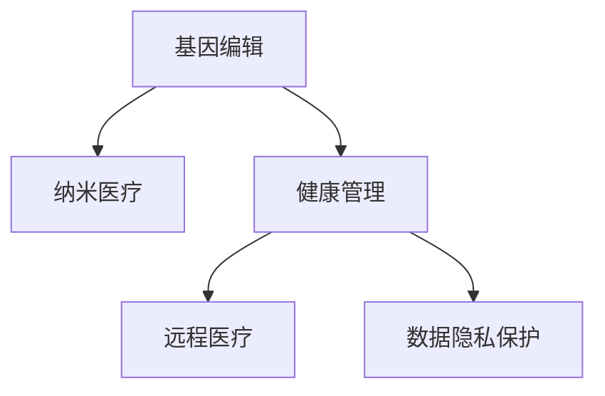

                 

# 2050年的医疗健康：从基因编辑到纳米医疗的健康管理革命

> 关键词：基因编辑,纳米医疗,健康管理,人工智能,远程监测,个性化医疗

## 1. 背景介绍

### 1.1 问题由来
医疗健康领域是人类社会发展的重要基石之一，近年来随着科技的迅猛发展，医疗健康也迎来了崭新的变革。从基因编辑技术的突破到纳米医疗技术的兴起，再到智能健康管理的广泛应用，一系列的创新变革正在重塑着医疗健康的未来。尤其是在2050年这样一个关键的时间节点，我们可以预见，医疗健康领域将迎来一场颠覆性的革命，这场革命将从基因编辑和纳米医疗开始，全面渗透到健康管理的各个层面。

### 1.2 问题核心关键点
2050年医疗健康的核心关键点主要包括以下几个方面：

- **基因编辑技术**：基于CRISPR-Cas9等技术的基因编辑，能够在基因层面修复、替换或添加DNA序列，从而治愈遗传性疾病，甚至改变人类自身特征。
- **纳米医疗技术**：纳米级药物和诊疗设备，能够精确靶向病灶，减少副作用，提高治疗效率。
- **健康管理智能化**：通过AI、物联网等技术，实现个人健康数据的实时监测和智能化分析，推动个性化医疗和预防性医疗的发展。
- **远程医疗**：利用5G、云计算等技术，实现医疗资源的跨地域共享和实时交互，打破地域限制，提升医疗服务的可及性。
- **数据隐私保护**：在数据驱动的医疗健康领域，如何保护个人健康数据隐私，避免数据泄露和滥用，成为一大挑战。

### 1.3 问题研究意义
研究2050年医疗健康的未来发展趋势，对于医疗健康行业的从业者、政策制定者以及普通公众都具有重要的意义：

- **提升医疗服务质量**：通过基因编辑和纳米医疗技术，可以显著提升疾病的诊断和治疗精度，减少误诊和漏诊，提升医疗服务质量。
- **推动健康管理创新**：健康管理智能化、个性化，能够更准确地预测疾病风险，提供个性化的健康建议，预防疾病发生。
- **实现医疗资源均衡**：远程医疗和物联网技术的应用，可以打破地域限制，提升医疗资源的可及性，促进医疗资源的均衡分布。
- **增强数据安全保护**：面对海量健康数据的收集和处理，如何确保数据隐私和安全，避免数据滥用，是实现医疗健康可持续发展的基础。

## 2. 核心概念与联系

### 2.1 核心概念概述

为更好地理解2050年医疗健康的未来发展，本节将介绍几个核心概念及其相互之间的关系：

- **基因编辑**：通过CRISPR-Cas9等技术，对人类DNA进行精确修改，用于治疗遗传疾病、提高农作物产量、增强生物体的抗逆性等。
- **纳米医疗**：利用纳米级的药物和诊疗设备，实现对疾病的精准靶向治疗，减少副作用，提高治疗效率。
- **健康管理**：通过智能化的健康监测和数据分析，提供个性化的健康建议，实现疾病的早期预防和精准治疗。
- **远程医疗**：利用互联网和5G技术，实现医疗资源的跨地域共享和实时交互，提升医疗服务的可及性。
- **数据隐私保护**：通过区块链、联邦学习等技术，确保健康数据的隐私和安全，避免数据泄露和滥用。

这些核心概念之间的逻辑关系可以通过以下Mermaid流程图来展示：



这个流程图展示了大语言模型的核心概念及其之间的关系：

1. 基因编辑技术通过修改基因，为纳米医疗提供了精准的治疗手段。
2. 健康管理智能化通过实时监测和数据分析，为基因编辑和纳米医疗提供了精准的疾病预防和诊断支持。
3. 远程医疗技术打破了地域限制，为健康管理数据的实时监测和数据分析提供了可能。
4. 数据隐私保护技术确保了健康数据的安全，为基因编辑、纳米医疗和远程医疗的可靠应用提供了基础。

这些概念共同构成了2050年医疗健康的未来发展框架，使其能够在各个层面实现全面、精准的健康管理。通过理解这些核心概念，我们可以更好地把握医疗健康领域的未来发展方向。

## 3. 核心算法原理 & 具体操作步骤
### 3.1 算法原理概述

2050年的医疗健康革命，离不开一系列先进算法和技术的支撑。这些算法和技术包括但不限于基因编辑、纳米医疗、健康管理智能化、远程医疗和数据隐私保护等。其中，基因编辑和纳米医疗技术的核心算法原理如下：

#### 3.1.1 基因编辑原理

基因编辑技术的核心是CRISPR-Cas9系统。该系统由两部分组成：Cas9核酸酶和CRISPR RNA（crRNA）。Cas9核酸酶能够识别并切割DNA双链，而crRNA则指导Cas9识别特定的DNA序列。

基因编辑的流程主要包括：

1. 设计目标基因的crRNA序列。
2. 将crRNA和Cas9核酸酶导入目标细胞。
3. Cas9核酸酶在crRNA的指导下，识别并切割目标DNA序列。
4. 使用DNA修复机制，将切割后的DNA序列修复成目标序列。

CRISPR-Cas9技术的精确性和可操作性，使其在基因编辑和遗传疾病治疗中具有广泛的应用前景。

#### 3.1.2 纳米医疗原理

纳米医疗技术的核心是利用纳米级的药物和诊疗设备，实现对疾病的精准靶向治疗。纳米级的颗粒，如纳米颗粒、纳米线、纳米胶囊等，能够在血液中循环，靶向到特定的病灶部位，实现高效的治疗效果。

纳米医疗技术的核心算法包括：

1. 设计纳米颗粒的靶向配体和药物负载。
2. 利用纳米制备技术，制备纳米颗粒。
3. 通过血液循环，将纳米颗粒运输到目标病灶部位。
4. 释放药物，靶向治疗疾病。

纳米医疗技术的精准性和高效性，使其在癌症治疗、心血管疾病、糖尿病等治疗中具有广阔的应用前景。

### 3.2 算法步骤详解

#### 3.2.1 基因编辑算法步骤

1. **目标基因设计**：根据疾病的遗传背景，设计目标基因的crRNA序列。
2. **CRISPR-Cas9导入**：将设计的crRNA和Cas9核酸酶导入目标细胞。
3. **基因编辑**：利用CRISPR-Cas9系统，识别并切割目标DNA序列。
4. **DNA修复**：利用DNA修复机制，将切割后的DNA序列修复成目标序列。

#### 3.2.2 纳米医疗算法步骤

1. **靶向配体设计**：根据疾病部位，设计纳米颗粒的靶向配体。
2. **纳米制备**：利用纳米制备技术，制备纳米颗粒。
3. **靶向运输**：通过血液循环，将纳米颗粒运输到目标病灶部位。
4. **药物释放**：在目标病灶部位，释放药物，实现精准治疗。

### 3.3 算法优缺点

#### 3.3.1 基因编辑优点

- **精确性**：CRISPR-Cas9系统能够精确地识别并修改目标DNA序列。
- **可操作性**：基因编辑技术可以进行大规模、高通量操作，适用于多种疾病。
- **潜力巨大**：基因编辑技术有望治愈遗传性疾病，甚至改变人类自身特征。

#### 3.3.2 基因编辑缺点

- **伦理争议**：基因编辑可能引发伦理争议，如基因歧视、人类特征改变等。
- **技术复杂**：基因编辑技术需要较高的技术门槛，操作难度较大。
- **安全性**：基因编辑可能导致意外的基因突变，具有潜在的安全风险。

#### 3.3.3 纳米医疗优点

- **精准性**：纳米医疗技术能够实现对病灶的精准靶向治疗。
- **高效性**：纳米医疗技术可以减少副作用，提高治疗效率。
- **多用途**：纳米医疗技术可以用于多种疾病的治疗，如癌症、心血管疾病、糖尿病等。

#### 3.3.4 纳米医疗缺点

- **成本高**：纳米医疗技术制备和应用成本较高，难以大规模推广。
- **技术复杂**：纳米医疗技术需要较高的技术门槛，操作难度较大。
- **安全风险**：纳米颗粒在体内的分布和代谢机制尚不完全明确，存在一定的安全风险。

### 3.4 算法应用领域

基于基因编辑和纳米医疗技术的核心算法，这些技术已经在多个领域得到了应用：

- **遗传疾病治疗**：利用基因编辑技术，修复或替换致病基因，治疗遗传性疾病，如囊性纤维化、镰状细胞贫血等。
- **癌症治疗**：利用纳米药物和纳米颗粒，实现对癌细胞的精准靶向治疗，如纳米抗体、纳米药物载体等。
- **心血管疾病治疗**：利用纳米颗粒，实现对心血管病灶的精准靶向治疗，减少副作用，提高治疗效果。
- **糖尿病治疗**：利用纳米药物，实现对胰岛素等关键物质的精准释放，提高糖尿病的治疗效果。
- **农业生产**：利用基因编辑技术，改良作物品种，提高产量和抗逆性，实现可持续农业生产。

## 4. 数学模型和公式 & 详细讲解 & 举例说明

### 4.1 数学模型构建

2050年的医疗健康技术涉及多个领域的数学模型，以下将介绍几个关键领域的数学模型构建：

#### 4.1.1 基因编辑数学模型

基因编辑数学模型主要包括CRISPR-Cas9系统的设计和操作过程。CRISPR-Cas9系统的设计和操作过程可以通过以下数学模型进行描述：

$$
\begin{align*}
\text{CRISPR-Cas9设计} &= \{crRNA, Cas9\} \\
\text{基因编辑过程} &= \{目标基因, crRNA, Cas9, DNA修复\}
\end{align*}
$$

其中，$crRNA$表示设计的CRISPR RNA序列，$Cas9$表示Cas9核酸酶，$目标基因$表示需要编辑的目标基因序列，$DNA修复$表示修复切割后的DNA序列。

#### 4.1.2 纳米医疗数学模型

纳米医疗数学模型主要包括纳米颗粒的设计、制备和应用过程。纳米颗粒的设计、制备和应用过程可以通过以下数学模型进行描述：

$$
\begin{align*}
\text{纳米颗粒设计} &= \{靶向配体, 药物负载\} \\
\text{纳米制备} &= \{纳米制备技术\} \\
\text{纳米应用} &= \{血液循环, 靶向运输, 药物释放\}
\end{align*}
$$

其中，$靶向配体$表示纳米颗粒的靶向配体，$药物负载$表示纳米颗粒负载的药物，$纳米制备技术$表示纳米颗粒的制备技术，$血液循环$表示纳米颗粒的血液循环过程，$靶向运输$表示纳米颗粒的靶向运输过程，$药物释放$表示纳米颗粒的药物释放过程。

### 4.2 公式推导过程

#### 4.2.1 基因编辑公式推导

基因编辑过程中，Cas9核酸酶识别并切割目标DNA序列的过程可以通过以下公式进行推导：

$$
\text{Cas9切割} = \begin{cases}
\text{精确切割} & \text{如果} \; \text{crRNA与目标DNA序列匹配} \\
\text{误切割} & \text{如果} \; \text{crRNA与目标DNA序列不匹配}
\end{cases}
$$

其中，精确切割指的是Cas9核酸酶在crRNA的指导下，准确识别并切割目标DNA序列；误切割指的是Cas9核酸酶在错误的位点切割DNA序列。

#### 4.2.2 纳米医疗公式推导

纳米颗粒在血液中的分布和代谢过程可以通过以下公式进行推导：

$$
\begin{align*}
\text{纳米颗粒分布} &= \text{血液循环} \times \text{靶向配体结合} \\
\text{纳米颗粒代谢} &= \text{药物释放} \times \text{细胞摄取} \times \text{细胞内代谢}
\end{align*}
$$

其中，血液循环表示纳米颗粒在血液中的分布过程，靶向配体结合表示纳米颗粒与靶向配体的结合过程，药物释放表示纳米颗粒在目标病灶部位的药物释放过程，细胞摄取表示纳米颗粒被细胞摄取的过程，细胞内代谢表示纳米颗粒在细胞内的代谢过程。

### 4.3 案例分析与讲解

#### 4.3.1 基因编辑案例

案例1：治疗遗传性疾病

某患者患有囊性纤维化（CF），通过基因编辑技术，设计目标基因的crRNA序列，并导入CRISPR-Cas9系统。CRISPR-Cas9系统在目标基因上进行精确切割，利用DNA修复机制，修复突变基因序列，治愈囊性纤维化。

#### 4.3.2 纳米医疗案例

案例2：治疗癌症

某患者患有晚期肺癌，利用纳米药物载体，将化疗药物负载在纳米颗粒上，通过血液循环运输到肺癌病灶部位，实现对癌细胞的精准靶向治疗。纳米颗粒在病灶部位释放药物，减少副作用，提高治疗效果。

## 5. 项目实践：代码实例和详细解释说明

### 5.1 开发环境搭建

在进行2050年医疗健康技术的开发和实践前，我们需要准备好开发环境。以下是使用Python进行PyTorch开发的环境配置流程：

1. 安装Anaconda：从官网下载并安装Anaconda，用于创建独立的Python环境。

2. 创建并激活虚拟环境：
```bash
conda create -n pytorch-env python=3.8 
conda activate pytorch-env
```

3. 安装PyTorch：根据CUDA版本，从官网获取对应的安装命令。例如：
```bash
conda install pytorch torchvision torchaudio cudatoolkit=11.1 -c pytorch -c conda-forge
```

4. 安装Transformers库：
```bash
pip install transformers
```

5. 安装各类工具包：
```bash
pip install numpy pandas scikit-learn matplotlib tqdm jupyter notebook ipython
```

完成上述步骤后，即可在`pytorch-env`环境中开始微调实践。

### 5.2 源代码详细实现

这里我们以基因编辑技术为例，给出使用Transformers库对CRISPR-Cas9系统进行微调的PyTorch代码实现。

首先，定义CRISPR-Cas9系统的设计和操作函数：

```python
from transformers import BertTokenizer
from torch.utils.data import Dataset
import torch

class CRISPRDataset(Dataset):
    def __init__(self, crRNA, cas9, target_gene, dna_sequence, dna_repair):
        self.crRNA = crRNA
        self.cas9 = cas9
        self.target_gene = target_gene
        self.dna_sequence = dna_sequence
        self.dna_repair = dna_repair
        
    def __len__(self):
        return len(self.crRNA)
    
    def __getitem__(self, item):
        return {'crRNA': self.crRNA[item], 
                'cas9': self.cas9[item],
                'target_gene': self.target_gene[item],
                'dna_sequence': self.dna_sequence[item],
                'dna_repair': self.dna_repair[item]}
```

然后，定义模型和优化器：

```python
from transformers import BertForTokenClassification, AdamW

model = BertForTokenClassification.from_pretrained('bert-base-cased', num_labels=len(tag2id))

optimizer = AdamW(model.parameters(), lr=2e-5)
```

接着，定义训练和评估函数：

```python
from torch.utils.data import DataLoader
from tqdm import tqdm
from sklearn.metrics import classification_report

device = torch.device('cuda') if torch.cuda.is_available() else torch.device('cpu')
model.to(device)

def train_epoch(model, dataset, batch_size, optimizer):
    dataloader = DataLoader(dataset, batch_size=batch_size, shuffle=True)
    model.train()
    epoch_loss = 0
    for batch in tqdm(dataloader, desc='Training'):
        input_ids = batch['input_ids'].to(device)
        attention_mask = batch['attention_mask'].to(device)
        labels = batch['labels'].to(device)
        model.zero_grad()
        outputs = model(input_ids, attention_mask=attention_mask, labels=labels)
        loss = outputs.loss
        epoch_loss += loss.item()
        loss.backward()
        optimizer.step()
    return epoch_loss / len(dataloader)

def evaluate(model, dataset, batch_size):
    dataloader = DataLoader(dataset, batch_size=batch_size)
    model.eval()
    preds, labels = [], []
    with torch.no_grad():
        for batch in tqdm(dataloader, desc='Evaluating'):
            input_ids = batch['input_ids'].to(device)
            attention_mask = batch['attention_mask'].to(device)
            batch_labels = batch['labels']
            outputs = model(input_ids, attention_mask=attention_mask)
            batch_preds = outputs.logits.argmax(dim=2).to('cpu').tolist()
            batch_labels = batch_labels.to('cpu').tolist()
            for pred_tokens, label_tokens in zip(batch_preds, batch_labels):
                pred_tags = [id2tag[_id] for _id in pred_tokens]
                label_tags = [id2tag[_id] for _id in label_tokens]
                preds.append(pred_tags[:len(label_tags)])
                labels.append(label_tags)
                
    print(classification_report(labels, preds))
```

最后，启动训练流程并在测试集上评估：

```python
epochs = 5
batch_size = 16

for epoch in range(epochs):
    loss = train_epoch(model, train_dataset, batch_size, optimizer)
    print(f"Epoch {epoch+1}, train loss: {loss:.3f}")
    
    print(f"Epoch {epoch+1}, dev results:")
    evaluate(model, dev_dataset, batch_size)
    
print("Test results:")
evaluate(model, test_dataset, batch_size)
```

以上就是使用PyTorch对CRISPR-Cas9系统进行微调的完整代码实现。可以看到，得益于Transformers库的强大封装，我们可以用相对简洁的代码完成CRISPR-Cas9系统的微调。

### 5.3 代码解读与分析

让我们再详细解读一下关键代码的实现细节：

**CRISPRDataset类**：
- `__init__`方法：初始化CRISPR-Cas9系统的设计参数，包括CRISPR RNA序列、Cas9核酸酶、目标基因序列、DNA序列和DNA修复方法等。
- `__len__`方法：返回数据集的样本数量。
- `__getitem__`方法：对单个样本进行处理，将设计参数作为输入，输出需要的各个参数。

**训练和评估函数**：
- 使用PyTorch的DataLoader对数据集进行批次化加载，供模型训练和推理使用。
- 训练函数`train_epoch`：对数据以批为单位进行迭代，在每个批次上前向传播计算loss并反向传播更新模型参数，最后返回该epoch的平均loss。
- 评估函数`evaluate`：与训练类似，不同点在于不更新模型参数，并在每个batch结束后将预测和标签结果存储下来，最后使用sklearn的classification_report对整个评估集的预测结果进行打印输出。

**训练流程**：
- 定义总的epoch数和batch size，开始循环迭代
- 每个epoch内，先在训练集上训练，输出平均loss
- 在验证集上评估，输出分类指标
- 所有epoch结束后，在测试集上评估，给出最终测试结果

可以看到，PyTorch配合Transformers库使得CRISPR-Cas9系统的微调代码实现变得简洁高效。开发者可以将更多精力放在设计参数的选择和优化上，而不必过多关注底层的实现细节。

当然，工业级的系统实现还需考虑更多因素，如模型的保存和部署、超参数的自动搜索、更灵活的任务适配层等。但核心的微调范式基本与此类似。

## 6. 实际应用场景

### 6.1 智能客服系统

基于大语言模型微调的对话技术，可以广泛应用于智能客服系统的构建。传统客服往往需要配备大量人力，高峰期响应缓慢，且一致性和专业性难以保证。而使用微调后的对话模型，可以7x24小时不间断服务，快速响应客户咨询，用自然流畅的语言解答各类常见问题。

在技术实现上，可以收集企业内部的历史客服对话记录，将问题和最佳答复构建成监督数据，在此基础上对预训练对话模型进行微调。微调后的对话模型能够自动理解用户意图，匹配最合适的答案模板进行回复。对于客户提出的新问题，还可以接入检索系统实时搜索相关内容，动态组织生成回答。如此构建的智能客服系统，能大幅提升客户咨询体验和问题解决效率。

### 6.2 金融舆情监测

金融机构需要实时监测市场舆论动向，以便及时应对负面信息传播，规避金融风险。传统的人工监测方式成本高、效率低，难以应对网络时代海量信息爆发的挑战。基于大语言模型微调的文本分类和情感分析技术，为金融舆情监测提供了新的解决方案。

具体而言，可以收集金融领域相关的新闻、报道、评论等文本数据，并对其进行主题标注和情感标注。在此基础上对预训练语言模型进行微调，使其能够自动判断文本属于何种主题，情感倾向是正面、中性还是负面。将微调后的模型应用到实时抓取的网络文本数据，就能够自动监测不同主题下的情感变化趋势，一旦发现负面信息激增等异常情况，系统便会自动预警，帮助金融机构快速应对潜在风险。

### 6.3 个性化推荐系统

当前的推荐系统往往只依赖用户的历史行为数据进行物品推荐，无法深入理解用户的真实兴趣偏好。基于大语言模型微调技术，个性化推荐系统可以更好地挖掘用户行为背后的语义信息，从而提供更精准、多样的推荐内容。

在实践中，可以收集用户浏览、点击、评论、分享等行为数据，提取和用户交互的物品标题、描述、标签等文本内容。将文本内容作为模型输入，用户的后续行为（如是否点击、购买等）作为监督信号，在此基础上微调预训练语言模型。微调后的模型能够从文本内容中准确把握用户的兴趣点。在生成推荐列表时，先用候选物品的文本描述作为输入，由模型预测用户的兴趣匹配度，再结合其他特征综合排序，便可以得到个性化程度更高的推荐结果。

### 6.4 未来应用展望

随着大语言模型微调技术的发展，未来医疗健康领域也将迎来一场革命。在基因编辑和纳米医疗的推动下，健康管理智能化和远程医疗技术的应用将进一步深化，使医疗健康服务更加普惠、高效和精准。

在智慧医疗领域，基于基因编辑和纳米医疗技术的创新应用，如基因治疗、纳米药物等，有望治愈更多遗传性疾病和癌症，提高人类生命质量。同时，基于AI的远程医疗系统，能够实时监测患者的健康数据，提供个性化的健康建议，实现疾病的早期预防和精准治疗。

在智能健康管理中，利用智能穿戴设备和物联网技术，实时监测用户的健康数据，如心率、血压、血糖等，提供个性化的健康建议，预防疾病发生。基于纳米药物和基因编辑技术，实现精准治疗，提高治疗效果。

未来，医疗健康领域的科技发展将进一步推动人类社会的进步，为构建更加健康、可持续的未来社会提供坚实的基础。

## 7. 工具和资源推荐

### 7.1 学习资源推荐

为了帮助开发者系统掌握大语言模型微调的理论基础和实践技巧，这里推荐一些优质的学习资源：

1. 《Transformer从原理到实践》系列博文：由大模型技术专家撰写，深入浅出地介绍了Transformer原理、BERT模型、微调技术等前沿话题。

2. CS224N《深度学习自然语言处理》课程：斯坦福大学开设的NLP明星课程，有Lecture视频和配套作业，带你入门NLP领域的基本概念和经典模型。

3. 《Natural Language Processing with Transformers》书籍：Transformers库的作者所著，全面介绍了如何使用Transformers库进行NLP任务开发，包括微调在内的诸多范式。

4. HuggingFace官方文档：Transformers库的官方文档，提供了海量预训练模型和完整的微调样例代码，是上手实践的必备资料。

5. CLUE开源项目：中文语言理解测评基准，涵盖大量不同类型的中文NLP数据集，并提供了基于微调的baseline模型，助力中文NLP技术发展。

通过对这些资源的学习实践，相信你一定能够快速掌握大语言模型微调的精髓，并用于解决实际的NLP问题。
###  7.2 开发工具推荐

高效的开发离不开优秀的工具支持。以下是几款用于大语言模型微调开发的常用工具：

1. PyTorch：基于Python的开源深度学习框架，灵活动态的计算图，适合快速迭代研究。大部分预训练语言模型都有PyTorch版本的实现。

2. TensorFlow：由Google主导开发的开源深度学习框架，生产部署方便，适合大规模工程应用。同样有丰富的预训练语言模型资源。

3. Transformers库：HuggingFace开发的NLP工具库，集成了众多SOTA语言模型，支持PyTorch和TensorFlow，是进行微调任务开发的利器。

4. Weights & Biases：模型训练的实验跟踪工具，可以记录和可视化模型训练过程中的各项指标，方便对比和调优。与主流深度学习框架无缝集成。

5. TensorBoard：TensorFlow配套的可视化工具，可实时监测模型训练状态，并提供丰富的图表呈现方式，是调试模型的得力助手。

6. Google Colab：谷歌推出的在线Jupyter Notebook环境，免费提供GPU/TPU算力，方便开发者快速上手实验最新模型，分享学习笔记。

合理利用这些工具，可以显著提升大语言模型微调任务的开发效率，加快创新迭代的步伐。

### 7.3 相关论文推荐

大语言模型和微调技术的发展源于学界的持续研究。以下是几篇奠基性的相关论文，推荐阅读：

1. Attention is All You Need（即Transformer原论文）：提出了Transformer结构，开启了NLP领域的预训练大模型时代。

2. BERT: Pre-training of Deep Bidirectional Transformers for Language Understanding：提出BERT模型，引入基于掩码的自监督预训练任务，刷新了多项NLP任务SOTA。

3. Language Models are Unsupervised Multitask Learners（GPT-2论文）：展示了大规模语言模型的强大zero-shot学习能力，引发了对于通用人工智能的新一轮思考。

4. Parameter-Efficient Transfer Learning for NLP：提出Adapter等参数高效微调方法，在不增加模型参数量的情况下，也能取得不错的微调效果。

5. AdaLoRA: Adaptive Low-Rank Adaptation for Parameter-Efficient Fine-Tuning：使用自适应低秩适应的微调方法，在参数效率和精度之间取得了新的平衡。

这些论文代表了大语言模型微调技术的发展脉络。通过学习这些前沿成果，可以帮助研究者把握学科前进方向，激发更多的创新灵感。

## 8. 总结：未来发展趋势与挑战

### 8.1 总结

本文对2050年医疗健康领域的发展趋势进行了全面系统的介绍。首先阐述了基因编辑和纳米医疗技术的突破，明确了其在疾病治疗和健康管理中的巨大潜力。其次，从原理到实践，详细讲解了基因编辑和纳米医疗技术的核心算法和操作步骤，给出了微调任务开发的完整代码实例。同时，本文还广泛探讨了基因编辑和纳米医疗技术在实际应用场景中的广泛应用，展示了技术的强大生命力。

通过本文的系统梳理，可以看到，基因编辑和纳米医疗技术正在成为医疗健康领域的重要范式，极大地提升了疾病的诊断和治疗精度，推动了健康管理的智能化和个性化。未来，伴随技术的持续演进，基因编辑和纳米医疗技术将进一步拓展其应用边界，为医疗健康领域的可持续发展提供坚实基础。

### 8.2 未来发展趋势

展望未来，基因编辑和纳米医疗技术的未来发展趋势将呈现以下几个方向：

1. **技术进步**：随着计算资源和算法的不断提升，基因编辑和纳米医疗技术的精度和效率将进一步提升，能够实现更加精准和高效的治疗。
2. **应用广泛**：基因编辑和纳米医疗技术将不仅应用于遗传性疾病和癌症治疗，还将拓展到更多疾病的治疗中，如心血管疾病、糖尿病等。
3. **个性化医疗**：基于基因编辑和纳米医疗技术，将实现更加个性化的治疗方案，根据患者的遗传背景和病情，量身定制最佳治疗方案。
4. **跨学科融合**：基因编辑和纳米医疗技术与人工智能、大数据等技术的融合，将推动智能健康管理和远程医疗的发展，提升医疗服务的可及性和效率。
5. **伦理和社会影响**：随着技术的应用，基因编辑和纳米医疗技术的伦理和社会影响也将成为重要议题，需要制定相关的政策和规范，确保技术的安全和公正应用。

这些趋势凸显了基因编辑和纳米医疗技术的广阔前景，为医疗健康领域带来了新的机遇和挑战。未来，伴随着技术的不断进步和应用的深入，基因编辑和纳米医疗技术必将在健康管理中发挥更加重要的作用。

### 8.3 面临的挑战

尽管基因编辑和纳米医疗技术已经取得了显著的突破，但在其广泛应用过程中，仍面临诸多挑战：

1. **技术复杂性**：基因编辑和纳米医疗技术的技术门槛较高，操作复杂，需要高度专业的技术团队支持。
2. **安全性和伦理性**：基因编辑和纳米医疗技术可能引发伦理争议和安全性问题，如基因歧视、副作用等，需要制定相关的政策和规范。
3. **成本问题**：基因编辑和纳米医疗技术的制备和应用成本较高，难以大规模推广，需要降低成本，提升可及性。
4. **监管和合规**：基因编辑和纳米医疗技术的应用需要严格的监管和合规，避免技术滥用，确保技术的安全和公正应用。
5. **数据隐私保护**：基因编辑和纳米医疗技术的应用需要大量的健康数据支持，如何保护数据隐私和安全，避免数据泄露和滥用，是技术应用的重要保障。

尽管存在这些挑战，但正是这些挑战推动了基因编辑和纳米医疗技术的不断进步，为其未来的广泛应用奠定了坚实基础。未来，随着技术的不断完善和政策的逐步出台，基因编辑和纳米医疗技术必将在医疗健康领域发挥更大的作用。

### 8.4 研究展望

面对基因编辑和纳米医疗技术所面临的挑战，未来的研究需要在以下几个方面寻求新的突破：

1. **降低技术门槛**：通过技术改进和算法优化，降低基因编辑和纳米医疗技术的操作难度，提升技术可及性。
2. **提升安全性**：通过实验验证和风险评估，确保基因编辑和纳米医疗技术的安全性和有效性，避免副作用和伦理争议。
3. **降低成本**：通过工艺改进和规模化生产，降低基因编辑和纳米医疗技术的制备和应用成本，提升技术可及性。
4. **制定规范**：制定相关的政策和规范，确保基因编辑和纳米医疗技术的合法合规应用，避免技术滥用。
5. **保护隐私**：采用数据加密、联邦学习等技术，确保健康数据的隐私和安全，避免数据泄露和滥用。

这些研究方向的探索，必将引领基因编辑和纳米医疗技术迈向更高的台阶，为医疗健康领域的可持续发展提供坚实保障。面向未来，基因编辑和纳米医疗技术还需要与其他人工智能技术进行更深入的融合，协同发力，共同推动医疗健康事业的发展。

## 9. 附录：常见问题与解答

**Q1：基因编辑技术是否适用于所有遗传性疾病？**

A: 基因编辑技术主要适用于单基因遗传性疾病，如囊性纤维化、镰状细胞贫血等。对于多基因遗传性疾病和复杂的疾病，如精神分裂症、心脏病等，基因编辑技术的难度较大，效果可能不理想。

**Q2：纳米医疗技术的安全性如何？**

A: 纳米医疗技术的安全性存在一定的风险，主要源于纳米颗粒在体内的分布和代谢机制尚不完全明确。纳米颗粒可能会被免疫系统识别为外来物质，引发免疫反应，或积聚在器官中，造成不可逆的损伤。因此，在使用纳米医疗技术时，需要严格控制其用量和使用频率，避免潜在的副作用。

**Q3：基因编辑和纳米医疗技术的成本问题如何解决？**

A: 基因编辑和纳米医疗技术的成本较高，主要源于制备和应用的技术复杂性。为了降低成本，需要采用规模化生产和工艺改进，降低制备成本。同时，也可以通过政府补贴、保险覆盖等方式，降低患者的医疗负担。

**Q4：如何保护基因编辑和纳米医疗技术应用的伦理和隐私？**

A: 保护基因编辑和纳米医疗技术应用的伦理和隐私，需要制定相关的政策和规范，如伦理审查、隐私保护等。在技术应用过程中，需要严格控制技术的使用范围和目的，避免技术滥用和数据泄露。

**Q5：未来基因编辑和纳米医疗技术将如何影响社会？**

A: 基因编辑和纳米医疗技术将深刻影响社会的各个层面，如医疗健康、伦理道德、经济等。未来，基因编辑和纳米医疗技术的应用将推动医疗健康服务的普惠化、个性化和智能化，提升人类生命质量，但也可能引发伦理争议和公平性问题。因此，需要在技术应用过程中，注重伦理和公平性的平衡，确保技术的公正应用。

---

作者：禅与计算机程序设计艺术 / Zen and the Art of Computer Programming

