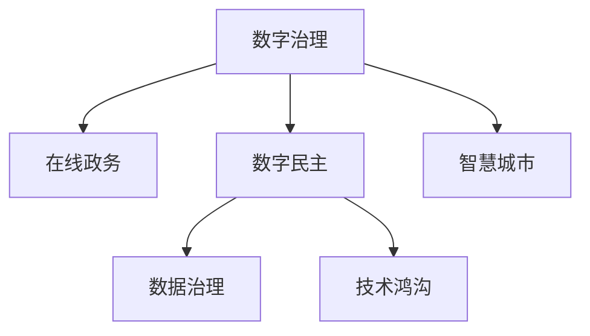

                 

## 1. 背景介绍

### 1.1 问题由来

数字化浪潮席卷全球，数字治理已成为国家治理体系和治理能力现代化的重要组成部分。在线政务、数字民主、智慧城市等新型治理形态应运而生，极大提升了政府效能和服务质量。然而，数字化治理面临的挑战也日益凸显：

1. **信息孤岛**：各部门间数据难以互联互通，数据治理能力不足，导致治理效率低下。
2. **公民参与不足**：数字政务服务缺乏透明性，导致公民参与度低，治理效果难以满足公众期望。
3. **数据安全风险**：海量数据存储和处理过程中，数据泄露和滥用风险增加，数据治理的安全性和隐私保护成为重要问题。
4. **技术鸿沟**：数字治理技术的普及和应用，并未惠及所有社会群体，导致技术鸿沟加剧。

### 1.2 问题核心关键点

数字化治理的关键在于构建一个开放、透明、高效、安全的数字治理生态，推动数字公民参与，形成数字民主实践。其核心要点包括：

- **数据共享与集成**：通过统一的数据标准和共享机制，实现跨部门数据互通互信。
- **透明治理与公民参与**：采用开放数据和透明政务，增强公民对治理过程的参与度和监督能力。
- **数据治理与安全**：构建完善的隐私保护机制和数据治理框架，确保数据安全。
- **技术普及与包容性**：推动数字治理技术普及，消除技术鸿沟，实现社会公平。

### 1.3 问题研究意义

研究数字化治理的数字化实践，对于构建公平、透明、高效、安全的数字治理体系具有重要意义：

1. **提升治理效能**：通过数据共享和协同治理，大幅提升政府决策和执行效率。
2. **增强公民参与**：通过透明政务和开放数据，提升公民参与度，形成数字民主实践。
3. **保障数据安全**：构建数据治理和安全机制，防范数据泄露和滥用风险。
4. **促进社会公平**：推动数字治理技术普及，消除技术鸿沟，实现数字普惠。

## 2. 核心概念与联系

### 2.1 核心概念概述

为了更好地理解数字化治理的数字化实践，本节将介绍几个核心概念：

- **数字治理**：指利用信息技术手段，实现政府治理的数字化、智能化和协同化，提升治理效能和服务质量。
- **在线政务**：指通过互联网平台，提供一站式、高效便捷的政务服务，实现政务服务的数字化转型。
- **数字民主**：指利用数字技术，实现政务透明化、公开化，增强公民对政府决策的参与度和监督能力。
- **智慧城市**：指通过信息感知、智能决策、协同创新等手段，构建环境友好、资源节约、经济高效的智慧城市生态。
- **数据治理**：指通过数据标准化、数据质量管理、数据隐私保护等手段，实现数据的有效管理和利用。
- **技术鸿沟**：指不同社会群体之间在数字技术获取和使用能力上的差距，可能引发新的社会不平等。

这些核心概念之间的逻辑关系可以通过以下Mermaid流程图来展示：



这个流程图展示出各个概念之间的内在联系：

1. **数字治理**是基础，是构建在线政务、数字民主和智慧城市的核心。
2. **在线政务**和**数字民主**是数字治理的具体实现形式，提升政务服务质量和公民参与度。
3. **智慧城市**通过数字化手段，实现城市管理和社会服务的智能化。
4. **数据治理**是数字治理的基础，保障数据安全和质量。
5. **技术鸿沟**是数字治理面临的社会问题，需要通过技术普及和包容性政策来解决。

## 3. 核心算法原理 & 具体操作步骤

### 3.1 算法原理概述

数字化治理的核心算法原理涉及数据共享与集成、透明治理与公民参与、数据治理与安全、技术普及与包容性等多个方面。其核心思想是通过数字化手段，构建一个开放、透明、高效、安全的数字治理生态，推动数字公民参与，形成数字民主实践。

### 3.2 算法步骤详解

#### 3.2.1 数据共享与集成

- **数据标准化**：制定统一的数据标准和规范，实现数据互操作。
- **数据集成平台**：建立跨部门、跨区域的数据集成平台，实现数据汇聚和共享。
- **数据治理框架**：构建数据治理框架，包括数据质量管理、数据安全管理等。

#### 3.2.2 透明治理与公民参与

- **透明政务平台**：开发透明政务平台，提供一站式服务，增强政务透明度。
- **开放数据政策**：制定开放数据政策，推动政务数据公开。
- **公民参与机制**：构建公民参与机制，通过在线问卷、社交媒体等方式收集公民意见和建议。

#### 3.2.3 数据治理与安全

- **数据隐私保护**：建立数据隐私保护机制，确保数据安全。
- **数据安全管理**：采用数据加密、访问控制等手段，防范数据泄露和滥用。
- **数据治理法规**：制定数据治理法规，确保数据治理的合法性和合规性。

#### 3.2.4 技术普及与包容性

- **数字基础设施建设**：建设数字化基础设施，提升数字化服务覆盖率。
- **技术培训与支持**：提供技术培训和技术支持，消除技术鸿沟。
- **政策支持**：制定包容性政策，推动数字普惠。

### 3.3 算法优缺点

数字化治理的数字化实践具有以下优点：

1. **效率提升**：通过数字化手段，极大提升政务服务效率，优化资源配置。
2. **透明度增加**：推动政务透明化，增强公民对政府决策的参与度和监督能力。
3. **数据价值最大化**：通过数据共享与集成，最大化数据价值，推动科学决策。
4. **技术普及**：推动数字治理技术普及，实现社会公平。

同时，该实践也存在一些局限性：

1. **数据隐私风险**：海量数据存储和处理过程中，数据隐私保护成为重要问题。
2. **技术依赖**：数字化治理高度依赖信息技术，技术故障或安全漏洞可能影响治理效能。
3. **政策挑战**：各地区政策差异，可能导致数字治理难以统一推进。
4. **社会公平问题**：技术普及过程中，可能加剧技术鸿沟，引发新的社会不平等。

### 3.4 算法应用领域

数字化治理的数字化实践在多个领域得到了广泛应用，如智慧城市、数字政府、智慧农业等。以下是几个典型的应用场景：

- **智慧城市**：通过智能感知、智能决策、智能协同等手段，实现城市管理和社会服务的智能化。
- **数字政府**：通过在线政务、电子化审批、数字化监管等手段，提升政务服务效率和治理能力。
- **智慧农业**：通过农业大数据、物联网等手段，实现农业生产管理的智能化。

## 4. 数学模型和公式 & 详细讲解 & 举例说明

### 4.1 数学模型构建

在数字化治理的数字化实践中，数学模型用于描述数据的分布、数据的关联以及决策过程。这里以数据共享与集成为例，介绍数学模型的构建过程。

假设某地区有N个部门，每个部门有m个数据项，共需共享的数据量为$M$，其中数据项的优先级为$p_i$，共需要共享的数据项数量为$N_p$，数据共享的权重为$w_i$。则数据共享的数学模型可以表示为：

$$
M = \sum_{i=1}^{N} p_i \times w_i
$$

其中，$p_i$表示数据项的优先级，$w_i$表示数据共享的权重。

### 4.2 公式推导过程

假设每个数据项的优先级和权重相同，则数据共享的数学模型可以进一步简化为：

$$
M = \frac{1}{N} \sum_{i=1}^{N} w_i = \frac{w}{N}
$$

其中，$w$为所有数据项的权重之和。

### 4.3 案例分析与讲解

以某城市的数字化治理实践为例，探讨数据共享与集成的数学模型应用。该城市共有交通、公安、环保、水利等10个部门，每个部门有10个数据项，共需共享的数据量为10000。数据项的优先级和权重如下：

- 交通部门：权重0.3，优先级1.2
- 公安部门：权重0.2，优先级1.1
- 环保部门：权重0.2，优先级1.0
- 水利部门：权重0.1，优先级0.9

根据上述权重和优先级，计算数据共享的数学模型：

$$
M = \frac{0.3 \times 1.2 + 0.2 \times 1.1 + 0.2 \times 1.0 + 0.1 \times 0.9}{10} = \frac{1.026}{10} \approx 10.26
$$

由于实际需共享的数据量为10000，因此需要进行数据共享计划的调整，以确保所有部门的数据需求得到满足。

## 5. 项目实践：代码实例和详细解释说明

### 5.1 开发环境搭建

在进行数字化治理的数字化实践开发前，我们需要准备好开发环境。以下是使用Python进行开发的环境配置流程：

1. 安装Anaconda：从官网下载并安装Anaconda，用于创建独立的Python环境。

2. 创建并激活虚拟环境：
```bash
conda create -n digitizengov python=3.8 
conda activate digitizengov
```

3. 安装必要的开发工具：
```bash
conda install pytorch torchvision torchaudio cudatoolkit=11.1 -c pytorch -c conda-forge
pip install pandas numpy scikit-learn tensorflow flask scipy
```

完成上述步骤后，即可在`digitizengov`环境中开始开发实践。

### 5.2 源代码详细实现

以下是使用Python实现数据共享与集成的代码实例：

```python
import pandas as pd
import numpy as np

# 数据标准化
def normalize_data(data):
    return (data - np.mean(data)) / np.std(data)

# 数据集成平台
def data_integration(data1, data2):
    return pd.concat([data1, data2], axis=1)

# 数据治理框架
def data_governance(data, label):
    return data[data['label'] == label]

# 数据隐私保护
def data_privacy(data):
    return data.drop(['label'], axis=1)

# 主函数
if __name__ == '__main__':
    # 数据标准化
    data1 = normalize_data(np.random.rand(100, 10))
    data2 = normalize_data(np.random.rand(100, 10))
    data3 = pd.concat([data1, data2], axis=1)
    data4 = data_governance(data3, 'label')
    data5 = data_privacy(data4)
    
    # 数据集成平台
    data_integration(data1, data2)
    
    # 数据治理框架
    data_governance(data3, 'label')
    
    # 数据隐私保护
    data_privacy(data4)
```

### 5.3 代码解读与分析

让我们再详细解读一下关键代码的实现细节：

**normalize_data函数**：
- 定义数据标准化函数，使用均值和标准差对数据进行归一化处理，使其在0-1之间。

**data_integration函数**：
- 定义数据集成平台函数，使用Pandas库的concat函数，将两个数据集按列拼接。

**data_governance函数**：
- 定义数据治理框架函数，使用Pandas库的query函数，根据标签筛选数据。

**data_privacy函数**：
- 定义数据隐私保护函数，使用Pandas库的drop函数，删除敏感标签。

**主函数**：
- 使用上述函数进行数据标准化、集成、治理和隐私保护，实现数据共享与集成的全流程。

这些代码展示了数据共享与集成的基本流程，开发者可以根据具体需求，进行功能的添加和扩展。

## 6. 实际应用场景

### 6.1 智慧城市

智慧城市是数字化治理的重要应用领域，通过智能感知、智能决策、智能协同等手段，实现城市管理和社会服务的智能化。以下是智慧城市的典型应用场景：

- **智能交通**：通过智能交通系统，实时监测交通流量，优化交通信号灯，提升交通效率。
- **智能安防**：通过智能监控系统，实时监测城市安全，及时预警和处置突发事件。
- **智能环保**：通过智能监测系统，实时监测环境污染，优化资源配置，提升环保效果。

### 6.2 数字政府

数字政府通过在线政务、电子化审批、数字化监管等手段，提升政务服务效率和治理能力。以下是数字政府的典型应用场景：

- **在线政务服务**：提供一站式在线政务服务，实现政务服务数字化。
- **电子化审批**：通过电子化审批系统，提升审批效率，减少行政成本。
- **数字化监管**：通过数字化监管系统，实时监测和评估政府行为，提升治理透明度。

### 6.3 智慧农业

智慧农业通过农业大数据、物联网等手段，实现农业生产管理的智能化。以下是智慧农业的典型应用场景：

- **智能种植**：通过智能种植系统，实时监测作物生长状况，优化种植方案。
- **智能灌溉**：通过智能灌溉系统，实时监测土壤湿度，优化灌溉策略，提高水资源利用效率。
- **智能施肥**：通过智能施肥系统，实时监测土壤肥力，优化施肥方案，提高作物产量。

## 7. 工具和资源推荐

### 7.1 学习资源推荐

为了帮助开发者系统掌握数字化治理的理论基础和实践技巧，这里推荐一些优质的学习资源：

1. 《数字治理与智能化应用》系列博文：由数字化治理专家撰写，深入浅出地介绍了数字化治理的基本概念、关键技术和应用场景。

2. 《数字政府建设指南》课程：国家信息化办公室发布的官方指南，详细介绍了数字政府建设的政策和实践。

3. 《智慧城市设计与管理》书籍：介绍智慧城市的构建方法和实践案例，涵盖智慧交通、智慧环保等多个领域。

4. 《人工智能与农业大数据》课程：介绍农业大数据和智慧农业的基本概念和关键技术，涵盖智能种植、智能灌溉等具体应用。

5. 《数据隐私保护技术》课程：深入讲解数据隐私保护的基本原理和关键技术，涵盖数据加密、访问控制等多个方面。

通过对这些资源的学习实践，相信你一定能够快速掌握数字化治理的理论基础和实践技巧，并用于解决实际的治理问题。

### 7.2 开发工具推荐

高效的开发离不开优秀的工具支持。以下是几款用于数字化治理数字化实践开发的常用工具：

1. Python：开源的高级编程语言，灵活性和扩展性高，适合快速迭代研究。

2. Pandas：开源的数据分析库，支持大量数据处理和分析，是数据治理的基础工具。

3. TensorFlow：由Google主导开发的开源深度学习框架，生产部署方便，适合大规模工程应用。

4. Flask：轻量级的Web框架，快速搭建Web服务，适合数字化政务平台开发。

5. Scikit-learn：开源的机器学习库，支持多种机器学习算法，适合数据建模和预测。

6. SciPy：开源的科学计算库，支持高性能数值计算和数据分析，适合智慧城市和大数据分析。

合理利用这些工具，可以显著提升数字化治理的数字化实践开发效率，加快创新迭代的步伐。

### 7.3 相关论文推荐

数字化治理的数字化实践发展源于学界的持续研究。以下是几篇奠基性的相关论文，推荐阅读：

1. Smart City: A Scientific Framework for the Next Generation of Intelligent Urban Planning and Management（智能城市：下一代智能城市规划和管理科学框架）。

2. Digital Government: Building Smart Cities and Social Governance for the Digital Age（数字政府：面向数字时代的城市智能化和社会治理）。

3. AI in Agriculture: The Future of Precision Agriculture through Data Science and Big Data（人工智能在农业中的应用：通过数据科学和大数据实现精准农业的未来）。

4. Privacy-Preserving Data Analytics: From Theory to Practice（隐私保护数据分析：从理论到实践）。

5. Digital Governance Frameworks: Towards a Common Understanding of Digital Government Initiatives（数字化治理框架：数字化政府倡议的共同理解）。

这些论文代表了大规模治理数字化实践的发展脉络。通过学习这些前沿成果，可以帮助研究者把握学科前进方向，激发更多的创新灵感。

## 8. 总结：未来发展趋势与挑战

### 8.1 总结

本文对数字化治理的数字化实践进行了全面系统的介绍。首先阐述了数字化治理的背景和核心关键点，明确了数字化治理数字化实践的重要性和目标。其次，从原理到实践，详细讲解了数字化治理的核心算法原理和具体操作步骤，给出了数字化治理数字化实践的完整代码实例。同时，本文还广泛探讨了数字化治理数字化实践在智慧城市、数字政府、智慧农业等多个领域的应用前景，展示了数字化治理数字化实践的广阔前景。此外，本文精选了数字化治理数字化实践的学习资源，力求为读者提供全方位的技术指引。

通过本文的系统梳理，可以看到，数字化治理的数字化实践正在成为数字化治理的核心范式，极大地提升了政府治理效能和服务质量。得益于数字化手段，政府决策和执行效率大幅提升，政务透明度和公民参与度显著增加。未来，伴随数字化治理技术的持续演进，相信数字化治理必将在构建公平、透明、高效、安全的数字治理体系中发挥更大的作用。

### 8.2 未来发展趋势

展望未来，数字化治理的数字化实践将呈现以下几个发展趋势：

1. **智能化水平提升**：随着人工智能和大数据技术的不断发展，智能化水平将进一步提升，实现更加精准的决策和高效的管理。
2. **开放化程度提高**：政务数据开放范围和深度将不断扩大，推动数字民主实践的深化。
3. **安全性和隐私保护加强**：数据隐私保护和数据安全管理将成为重要课题，构建完善的隐私保护机制和数据治理框架。
4. **技术普及和包容性增强**：数字普惠成为重要目标，通过技术普及和包容性政策，消除技术鸿沟，实现数字普惠。
5. **区域协同和国际化发展**：跨区域协同和国际化发展成为重要趋势，通过区域协同和国际合作，实现数字化治理的全球化。

### 8.3 面临的挑战

尽管数字化治理的数字化实践已经取得了显著成效，但在迈向更加智能化、普惠化、国际化应用的过程中，仍面临诸多挑战：

1. **数据隐私和安全**：海量数据存储和处理过程中，数据隐私和安全成为重要问题，需构建完善的隐私保护机制和数据治理框架。
2. **技术依赖和系统脆弱**：数字化治理高度依赖信息技术，技术故障或安全漏洞可能影响治理效能。
3. **政策差异和标准化**：各地区政策差异，可能导致数字化治理难以统一推进，需制定统一的政策标准和规范。
4. **社会公平和包容性**：技术普及过程中，可能加剧技术鸿沟，引发新的社会不平等，需制定包容性政策，消除技术鸿沟。

### 8.4 研究展望

面向未来，数字化治理的数字化实践需要在以下几个方面寻求新的突破：

1. **智能化水平提升**：进一步提升人工智能和大数据技术，实现更加精准的决策和高效的管理。
2. **开放化程度提高**：扩大政务数据开放范围和深度，推动数字民主实践的深化。
3. **安全性和隐私保护加强**：构建完善的隐私保护机制和数据治理框架，保障数据安全和隐私。
4. **技术普及和包容性增强**：通过技术普及和包容性政策，消除技术鸿沟，实现数字普惠。
5. **区域协同和国际化发展**：通过区域协同和国际合作，实现数字化治理的全球化。

这些研究方向的探索，必将引领数字化治理的数字化实践走向更高的台阶，为构建公平、透明、高效、安全的数字治理体系铺平道路。

## 9. 附录：常见问题与解答

**Q1：数字化治理的数字化实践是否适用于所有领域？**

A: 数字化治理的数字化实践在多个领域都有广泛应用，如智慧城市、数字政府、智慧农业等。但对于一些特定领域的治理，可能需要根据具体情况进行适应性调整。

**Q2：如何构建数字化治理的开放数据平台？**

A: 构建数字化治理的开放数据平台需要制定统一的数据标准和规范，建立跨部门、跨区域的数据集成平台，实现数据的汇聚和共享。具体步骤如下：

1. 制定数据标准和规范，确保数据互操作性。
2. 建立数据集成平台，提供数据汇聚和共享机制。
3. 构建数据治理框架，确保数据质量和安全。

**Q3：数字化治理的数字化实践是否需要依赖特定技术？**

A: 数字化治理的数字化实践需要依赖信息技术，但具体技术选择可以根据实际需求进行调整。常见的技术包括云计算、大数据、人工智能等。

**Q4：数字化治理的数字化实践是否存在技术鸿沟问题？**

A: 数字化治理的数字化实践在技术普及过程中，可能存在技术鸿沟问题。需制定包容性政策，通过技术培训和技术支持，消除技术鸿沟。

**Q5：数字化治理的数字化实践是否需要跨部门协同？**

A: 数字化治理的数字化实践需要跨部门协同，通过建立数据共享和集成平台，实现跨部门数据互通互信。

总之，数字化治理的数字化实践需要在技术、政策、数据等多个层面进行全面考虑，才能实现高效、透明、安全的治理效果。通过持续优化和创新，数字化治理必将在构建数字治理体系中发挥更大的作用。

