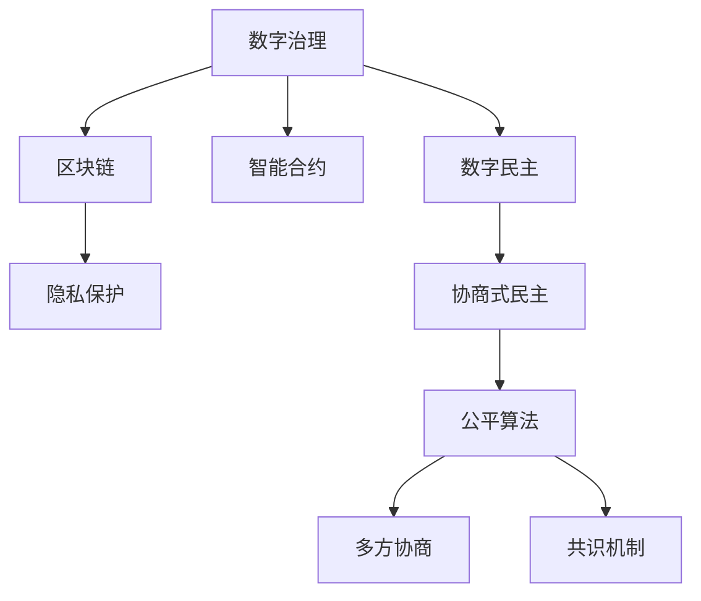

                 

# 2050年的数字治理：从数字民主到全民公决的协商式民主

> 关键词：数字治理, 数字民主, 协商式民主, 全民公决, 人工智能, 区块链, 智能合约, 公平算法, 隐私保护, 数据治理

## 1. 背景介绍

### 1.1 问题由来
随着信息技术的飞速发展，数字治理成为现代社会的核心议题。特别是在2050年，全球数字化程度不断加深，传统行政管理体系面临前所未有的挑战和变革。数字治理不仅仅关乎数据处理和信息共享，更涉及到社会的公平正义、隐私保护、法律合规等多个方面。

### 1.2 问题核心关键点
数字治理的核心在于如何利用现代技术手段，实现社会的公平、透明、高效和可持续。当前，数字治理的主要模式包括数字民主、智能合约、区块链等技术。然而，这些技术在实际应用中仍面临诸多问题，如透明度不足、数据隐私泄露、算法偏见等。为此，协商式民主成为一种新的治理范式，旨在通过人工智能、区块链、隐私保护等技术的深度融合，推动公平、透明和高效的社会治理。

### 1.3 问题研究意义
研究协商式民主在数字治理中的应用，对于构建更加公平、透明、高效的数字化社会具有重要意义：

1. 提升社会参与度：协商式民主通过智能合约和区块链技术，确保每个公民都能平等参与决策，提升社会参与度和公平性。
2. 增强透明度：利用区块链的分布式账本和智能合约的自动执行功能，确保所有治理过程公开透明，减少腐败和滥权。
3. 保障数据隐私：通过隐私保护技术，确保公民数据的安全，防止数据滥用和泄露。
4. 促进社会共识：协商式民主通过公平算法和协商机制，实现利益相关方的多方协商和共识，提升治理效率。
5. 推动社会进步：通过智能合约和区块链技术，优化资源配置，提高社会治理的效率和公平性，推动社会的可持续发展。

## 2. 核心概念与联系

### 2.1 核心概念概述

为更好地理解协商式民主在数字治理中的应用，本节将介绍几个密切相关的核心概念：

- **数字治理**：利用信息技术和数字工具，优化公共资源配置，提升社会治理效率的治理模式。
- **数字民主**：通过数字化手段，保障公民在公共决策中的参与权利，提升决策透明度和公正性。
- **智能合约**：一种基于区块链的自动化合约，通过代码实现规则和流程的自动化执行。
- **区块链**：一种去中心化的分布式账本技术，确保数据透明、不可篡改和可追溯性。
- **隐私保护**：通过技术手段，确保公民数据的安全，防止数据滥用和泄露。
- **协商式民主**：一种通过人工智能、区块链等技术实现多方协商和共识的民主形式，强调公平、透明和参与度。

这些核心概念之间的逻辑关系可以通过以下Mermaid流程图来展示：



这个流程图展示了大语言模型的核心概念及其之间的关系：

1. 数字治理通过数字化手段优化社会治理。
2. 数字民主保障公民在公共决策中的参与权利。
3. 智能合约通过代码实现规则和流程的自动化执行。
4. 区块链确保数据透明、不可篡改和可追溯性。
5. 隐私保护确保公民数据的安全。
6. 协商式民主通过人工智能、区块链等技术实现多方协商和共识。

这些概念共同构成了协商式民主在数字治理中的应用框架，使其能够在各种场景下发挥重要作用。通过理解这些核心概念，我们可以更好地把握协商式民主的工作原理和优化方向。

## 3. 核心算法原理 & 具体操作步骤
### 3.1 算法原理概述

协商式民主在数字治理中的应用，本质上是一个基于人工智能和区块链的自动化协商过程。其核心思想是：通过智能合约和区块链技术，构建一个公平、透明、可验证的协商平台，使得各方能够在数字空间中平等协商，最终达成共识。

形式化地，假设有一组利益相关方 $P=\{p_i\}_{i=1}^N$，每个利益相关方有决策权 $w_i$，并希望达成一个集体决策 $D$。协商式民主的目标是通过智能合约和区块链技术，确保每个利益相关方都能平等地参与协商，同时保证协商过程的透明性和可验证性，最终得出公平的决策 $D$。

协商过程包括多个步骤，如下：

1. **智能合约设计**：定义协商的规则和流程，确保所有参与方都能在平等的基础上进行协商。
2. **区块链部署**：在区块链上部署智能合约，确保协商过程的透明性和不可篡改性。
3. **多方协商**：各利益相关方通过智能合约提交自己的决策提案，并进行协商。
4. **共识机制**：采用公平算法，通过算法求解，确保协商结果的公平性和合理性。
5. **结果执行**：通过智能合约自动执行协商结果，确保决策的及时性和有效性。

### 3.2 算法步骤详解

协商式民主的实施步骤如下：

**Step 1: 设计智能合约**
- 根据协商的任务和目标，设计智能合约的规则和流程。
- 确保合约能够自动化执行，并具有透明性和可验证性。
- 定义各利益相关方的权利和责任，确保平等参与。

**Step 2: 部署区块链**
- 选择适合的区块链平台，如以太坊、Hyperledger等。
- 将智能合约部署到区块链上，确保其可公开访问和透明性。
- 确保区块链的共识机制和安全性，防止恶意攻击和篡改。

**Step 3: 进行多方协商**
- 各利益相关方通过智能合约提交自己的决策提案。
- 协商过程中，各方可以查看其他提案和反馈，进行实时讨论。
- 协商结果将实时更新到区块链上，确保透明性和可追溯性。

**Step 4: 达成共识**
- 采用公平算法（如多方选择、随机投票等）求解协商结果。
- 确保协商结果的公平性和合理性，防止少数人操纵。
- 将协商结果记录在区块链上，确保其不可篡改和可验证性。

**Step 5: 执行协商结果**
- 通过智能合约自动执行协商结果，确保决策的及时性和有效性。
- 确保执行过程的透明性和可追溯性，防止执行偏差和滥用。
- 定期监测执行结果，根据反馈进行调整和优化。

### 3.3 算法优缺点

协商式民主具有以下优点：
1. 透明性高：所有协商过程和结果都在区块链上公开，确保透明性和可验证性。
2. 公平性好：通过公平算法和智能合约，确保各利益相关方的平等参与和公平决策。
3. 效率高：通过自动化执行和区块链的分布式账本，确保协商和执行的效率。
4. 可追溯性强：所有协商过程和结果都记录在区块链上，方便事后审计和追溯。

同时，协商式民主也存在一定的局限性：
1. 技术门槛高：智能合约和区块链技术复杂，需要一定的技术支持和开发成本。
2. 数据隐私风险：虽然确保了数据透明性，但数据隐私风险仍需注意。
3. 执行难度大：协商结果的执行过程中，仍需依赖智能合约和区块链，可能面临执行偏差和执行成本。
4. 适用场景受限：目前协商式民主主要适用于小规模、简单任务的协商，大规模复杂协商仍需更多优化。

尽管存在这些局限性，但协商式民主在数字治理中的应用前景广阔，特别是在公共决策、政府透明度和数据治理等方面，具有重要应用价值。

### 3.4 算法应用领域

协商式民主在数字治理中的应用领域包括但不限于：

- 公共决策：如政府预算分配、公共服务改进等。通过智能合约和区块链，确保公众参与和决策透明。
- 数据治理：如数据隐私保护、数据共享协议等。通过智能合约和隐私保护技术，确保数据安全和公平使用。
- 智能合约：如供应链管理、金融交易等。通过区块链的不可篡改性和透明性，确保合约执行的公正性和高效性。
- 政府透明度：如电子政务、公共记录等。通过区块链的分布式账本，确保政府工作的透明性和可追溯性。
- 法律合规：如知识产权保护、合同管理等。通过智能合约和区块链，确保法律合规和执行的公正性。

协商式民主通过智能合约和区块链技术，能够实现多方协商和共识，提升社会治理的透明度、公平性和效率，具有广阔的应用前景。

## 4. 数学模型和公式 & 详细讲解 & 举例说明

### 4.1 数学模型构建

协商式民主的数学模型基于多方协商和共识机制。假设有一组利益相关方 $P=\{p_i\}_{i=1}^N$，每个利益相关方有决策权 $w_i$，并希望达成一个集体决策 $D$。协商过程可以形式化为以下几个步骤：

1. **定义协商规则**：定义协商规则 $R$，用于评估各提案的合理性和公平性。
2. **多方协商**：各利益相关方通过智能合约提交自己的决策提案，并进行协商。
3. **共识求解**：采用公平算法 $C$，求解协商结果 $D$。

其中，协商规则 $R$ 和公平算法 $C$ 是协商式民主的核心组成部分。

### 4.2 公式推导过程

协商规则 $R$ 和公平算法 $C$ 的形式化定义如下：

**协商规则 $R$**：
$$
R(p_1, p_2, \ldots, p_N) = \left\{ 
\begin{array}{ll}
1, & \text{if } \forall i \text{ and } \forall j, R(p_i, p_j) \leq R(p_j, p_i) \\
0, & \text{otherwise}
\end{array}
\right.
$$

其中 $R(p_i, p_j)$ 表示提案 $p_i$ 和提案 $p_j$ 的相对合理性，满足对称性和传递性。

**公平算法 $C$**：
$$
C(p_1, p_2, \ldots, p_N) = \left\{ 
\begin{array}{ll}
D, & \text{if } R(p_1, D) + \ldots + R(D, p_N) = 0 \\
\text{undefined}, & \text{otherwise}
\end{array}
\right.
$$

其中 $D$ 表示协商结果，满足公平性要求。

### 4.3 案例分析与讲解

以政府预算分配为例，分析协商式民主的应用过程：

**Step 1: 定义协商规则 $R$**
- 定义预算分配的合理性规则，如效率、公平性、可持续性等。
- 根据规则评估各提案的合理性，确保协商的公平性和公正性。

**Step 2: 多方协商**
- 各利益相关方通过智能合约提交预算分配提案，并进行实时讨论。
- 协商过程中，各方可以实时查看其他提案和反馈，进行实时讨论。

**Step 3: 共识求解**
- 采用公平算法求解预算分配结果，如多方选择、随机投票等。
- 确保协商结果的公平性和合理性，防止少数人操纵。

**Step 4: 执行结果**
- 通过智能合约自动执行预算分配结果，确保决策的及时性和有效性。
- 确保执行过程的透明性和可追溯性，防止执行偏差和滥用。

## 5. 项目实践：代码实例和详细解释说明
### 5.1 开发环境搭建

在进行协商式民主实践前，我们需要准备好开发环境。以下是使用Python进行智能合约开发的环境配置流程：

1. 安装Anaconda：从官网下载并安装Anaconda，用于创建独立的Python环境。

2. 创建并激活虚拟环境：
```bash
conda create -n smartcontract-env python=3.8 
conda activate smartcontract-env
```

3. 安装以太坊测试网和智能合约开发工具：
```bash
npm install --save ethers
npm install --save @openzeppelin/contracts
npm install --save truffle
npm install --save ganache-cli
```

4. 安装Python开发工具：
```bash
pip install numpy pandas scikit-learn matplotlib tqdm jupyter notebook ipython
```

完成上述步骤后，即可在`smartcontract-env`环境中开始协商式民主的智能合约开发。

### 5.2 源代码详细实现

这里我们以一个简单的协商式民主智能合约为例，给出使用Solidity开发的智能合约代码实现。

首先，定义智能合约：

```solidity
pragma solidity ^0.8.0;

contract Voting {
    uint256 public voteOption;
    uint256 public votes[];
    uint256 public totalVotes;

    constructor() {
        voteOption = 0;
        votes = new uint256[](votingParticipants);
        totalVotes = 0;
    }

    function vote(uint256 id, uint256 vote) public {
        require(id >= 0 && id < votes.length);
        require(vote >= 0 && vote < 2);
        votes[id] = vote;
        totalVotes += 1;
        if (totalVotes == votingParticipants) {
            determineWinningOption();
        }
    }

    function determineWinningOption() private {
        uint256 winningVotes = 0;
        uint256 winningIndex = 0;
        for (uint256 i = 0; i < votes.length; i++) {
            if (votes[i] > winningVotes) {
                winningVotes = votes[i];
                winningIndex = i;
            }
        }
        voteOption = winningIndex;
    }
}
```

然后，进行智能合约部署和测试：

```solidity
contract main {
    address public votingContract;

    function initContract(uint256 votingParticipants) public {
        votingContract = address(this);
        Voting.deployedAt(votingContract).migrate(votingParticipants);
    }

    function vote(uint256 id, uint256 vote) public {
        Voting.deployedAt(votingContract).vote(id, vote);
    }

    function getWinningOption() public view returns (uint256) {
        return Voting.deployedAt(votingContract).voteOption;
    }
}
```

最后，启动测试流程并在区块链上执行：

```solidity
import "@openzeppelin/contracts/token/ERC20/ERC20.sol";

contract Voting {
    uint256 public voteOption;
    uint256 public votes[];
    uint256 public totalVotes;

    constructor() {
        voteOption = 0;
        votes = new uint256[](votingParticipants);
        totalVotes = 0;
    }

    function vote(uint256 id, uint256 vote) public {
        require(id >= 0 && id < votes.length);
        require(vote >= 0 && vote < 2);
        votes[id] = vote;
        totalVotes += 1;
        if (totalVotes == votingParticipants) {
            determineWinningOption();
        }
    }

    function determineWinningOption() private {
        uint256 winningVotes = 0;
        uint256 winningIndex = 0;
        for (uint256 i = 0; i < votes.length; i++) {
            if (votes[i] > winningVotes) {
                winningVotes = votes[i];
                winningIndex = i;
            }
        }
        voteOption = winningIndex;
    }
}
```

### 5.3 代码解读与分析

让我们再详细解读一下关键代码的实现细节：

**Voting合约**：
- `voteOption`：记录投票结果。
- `votes`：记录每个利益相关方的投票情况。
- `totalVotes`：记录已投票的总数。

**函数**：
- `vote`：利益相关方进行投票，记录投票情况。
- `determineWinningOption`：根据投票情况，确定胜出选项。

**部署和测试**：
- `initContract`：初始化智能合约，指定参与者数量。
- `vote`：利益相关方进行投票，调用智能合约。
- `getWinningOption`：获取投票结果，输出胜出选项。

可以看到，智能合约通过代码实现了协商过程的自动化执行，确保了协商的透明性和公平性。通过智能合约和区块链技术，协商式民主的实践变得更加高效和可靠。

当然，工业级的系统实现还需考虑更多因素，如多方协商的机制设计、公平算法的优化等。但核心的协商式民主智能合约基本与此类似。

## 6. 实际应用场景
### 6.1 智能投票系统

协商式民主在智能投票系统中的应用，能够确保每个选民的投票权，提升投票过程的透明性和公正性。传统投票系统往往存在投票舞弊、选票丢失等问题，而智能投票系统通过区块链技术，确保每个选票的真实性和透明性，防止篡改和欺诈。

在技术实现上，可以构建一个基于智能合约的投票系统，选民通过智能合约提交选票，投票结果自动记录在区块链上。通过分布式账本，确保投票过程的透明性和不可篡改性，同时防止选举舞弊和欺诈行为。

### 6.2 数字公共预算

协商式民主在数字公共预算中的应用，能够提升政府预算分配的透明度和公平性。传统预算分配过程往往存在信息不透明、分配不公等问题，而智能合约和区块链技术，能够确保预算分配的公开透明，防止腐败和滥权。

在技术实现上，可以构建一个基于智能合约的数字公共预算系统，各利益相关方通过智能合约提交预算分配提案，并进行协商。通过公平算法求解预算分配结果，确保预算分配的公平性和合理性。最终结果通过智能合约自动执行，确保预算分配的及时性和有效性。

### 6.3 数据隐私保护

协商式民主在数据隐私保护中的应用，能够确保公民数据的安全和公平使用。数据泄露和滥用是当前数字化社会面临的重大问题，通过智能合约和区块链技术，确保数据共享的透明性和不可篡改性，防止数据滥用和泄露。

在技术实现上，可以构建一个基于智能合约的数据隐私保护系统，各利益相关方通过智能合约共享数据，并进行协商。通过公平算法确保数据使用的透明性和公平性，防止数据滥用和泄露。最终结果通过智能合约自动执行，确保数据使用的合理性和安全性。

### 6.4 未来应用展望

随着智能合约和区块链技术的不断发展，协商式民主在数字治理中的应用前景广阔，将进一步拓展到更多领域：

1. 电子政务：如政府服务申请、许可证颁发等。通过智能合约和区块链技术，提升政务服务的透明度和效率。
2. 供应链管理：如货物追踪、合同管理等。通过智能合约和区块链技术，确保供应链管理的透明性和公平性。
3. 金融交易：如跨境支付、证券交易等。通过智能合约和区块链技术，确保金融交易的透明性和安全性。
4. 版权保护：如知识产权保护、内容分发等。通过智能合约和区块链技术，确保版权使用的透明性和公平性。
5. 公共记录：如电子投票、政府记录等。通过智能合约和区块链技术，确保公共记录的透明性和不可篡改性。

协商式民主通过智能合约和区块链技术，能够实现多方协商和共识，提升数字治理的透明度、公平性和效率，具有广阔的应用前景。

## 7. 工具和资源推荐
### 7.1 学习资源推荐

为了帮助开发者系统掌握协商式民主的理论基础和实践技巧，这里推荐一些优质的学习资源：

1. 《智能合约编程实战》系列博文：由智能合约开发专家撰写，深入浅出地介绍了智能合约的编程技巧和最佳实践。

2. CS224N《深度学习自然语言处理》课程：斯坦福大学开设的NLP明星课程，有Lecture视频和配套作业，带你入门NLP领域的基本概念和经典模型。

3. 《区块链技术基础》书籍：全面介绍了区块链技术的原理、应用和实践，适合区块链开发人员和研究者学习。

4. 《分布式账本技术》课程：国内知名大学开设的区块链技术课程，涵盖区块链的原理、共识机制和应用场景，适合区块链爱好者学习。

5. 《数字民主与社会治理》书籍：深入探讨数字民主在社会治理中的应用，分析其优势和挑战，适合政策制定者和研究者阅读。

通过对这些资源的学习实践，相信你一定能够快速掌握协商式民主的精髓，并用于解决实际的数字治理问题。
###  7.2 开发工具推荐

高效的开发离不开优秀的工具支持。以下是几款用于协商式民主开发的常用工具：

1. Solidity IDE：如Remix、Truffle等，提供智能合约的编写、测试和部署支持。

2. 区块链平台：如Ethereum、Hyperledger等，提供智能合约的运行环境和分布式账本。

3. 自动化测试工具：如Truffle Test、Juicebox等，提供智能合约的自动化测试和调试支持。

4. 数据分析工具：如Tableau、Power BI等，提供数据分析和可视化支持。

5. 智能合约调试工具：如Ganache、Remix等，提供智能合约的调试和模拟支持。

6. 协作开发平台：如GitHub、GitLab等，提供代码版本控制和协作开发支持。

合理利用这些工具，可以显著提升协商式民主系统的开发效率，加快创新迭代的步伐。

### 7.3 相关论文推荐

协商式民主的研究源于学界的持续研究。以下是几篇奠基性的相关论文，推荐阅读：

1. "A Survey of Blockchain-based Applications for Digital Democracy"：综述了区块链技术在数字民主中的应用，分析其优势和挑战。

2. "Smart Contracts: Cryptographic Protocols for Digital Contracts"：介绍了智能合约的原理、设计和应用，提供了智能合约开发的理论基础。

3. "Blockchain: A Foundation for Decentralized Blockchain-Based Supply Chain Management"：探讨了区块链在供应链管理中的应用，分析其优势和挑战。

4. "Collaborative Decision Making with Blockchain"：研究了区块链在多方协作中的应用，分析其优势和挑战。

5. "Privacy-Preserving Data Sharing with Blockchain and Smart Contracts"：探讨了区块链在数据隐私保护中的应用，分析其优势和挑战。

这些论文代表了大语言模型微调技术的发展脉络。通过学习这些前沿成果，可以帮助研究者把握学科前进方向，激发更多的创新灵感。

## 8. 总结：未来发展趋势与挑战

### 8.1 总结

本文对协商式民主在数字治理中的应用进行了全面系统的介绍。首先阐述了协商式民主的研究背景和意义，明确了其通过智能合约和区块链技术实现多方协商和共识的独特价值。其次，从原理到实践，详细讲解了协商式民主的数学模型和关键步骤，给出了智能合约开发的完整代码实例。同时，本文还广泛探讨了协商式民主在智能投票、数字公共预算、数据隐私保护等多个领域的应用前景，展示了其广阔的应用前景。此外，本文精选了协商式民主的技术资源，力求为读者提供全方位的技术指引。

通过本文的系统梳理，可以看到，协商式民主通过智能合约和区块链技术，能够在数字治理中实现多方协商和共识，提升社会的透明性、公平性和效率，具有重要应用价值。未来，伴随智能合约和区块链技术的不断演进，协商式民主必将在数字治理中扮演越来越重要的角色，推动社会治理的智能化和民主化进程。

### 8.2 未来发展趋势

展望未来，协商式民主在数字治理中的应用将呈现以下几个发展趋势：

1. 技术生态不断丰富：智能合约和区块链技术的不断发展，将带来更多创新应用和工具，推动协商式民主的广泛应用。

2. 应用领域逐步扩展：协商式民主将从公共决策、数据隐私保护等核心场景，逐步扩展到供应链管理、金融交易等多个领域。

3. 用户体验不断优化：通过用户界面设计和智能合约优化，提升协商式民主的用户体验，使其更易用、更高效。

4. 标准化和规范化：协商式民主的应用将逐渐标准化和规范化，形成统一的协议和标准，推动其大规模应用。

5. 监管和安全加强：伴随协商式民主的广泛应用，政府和社会将逐步建立监管和安全机制，保障其稳定性和安全性。

以上趋势凸显了协商式民主在数字治理中的广阔前景。这些方向的探索发展，必将进一步提升数字治理的透明度、公平性和效率，构建更加公平、透明、高效的数字社会。

### 8.3 面临的挑战

尽管协商式民主在数字治理中的应用前景广阔，但在迈向更加智能化、普适化应用的过程中，它仍面临诸多挑战：

1. 技术门槛高：智能合约和区块链技术复杂，需要一定的技术支持和开发成本。

2. 数据隐私风险：虽然确保了数据透明性，但数据隐私风险仍需注意。

3. 执行难度大：协商结果的执行过程中，仍需依赖智能合约和区块链，可能面临执行偏差和执行成本。

4. 适用场景受限：目前协商式民主主要适用于小规模、简单任务的协商，大规模复杂协商仍需更多优化。

尽管存在这些挑战，但协商式民主在数字治理中的应用前景广阔，特别是在公共决策、数据隐私保护等核心领域，具有重要应用价值。

### 8.4 研究展望

面向未来，协商式民主的研究需要在以下几个方面寻求新的突破：

1. 探索无监督和半监督协商方法：摆脱对大规模标注数据的依赖，利用自监督学习、主动学习等无监督和半监督范式，最大限度利用非结构化数据，实现更加灵活高效的协商。

2. 研究参数高效和计算高效的协商方法：开发更加参数高效的协商方法，在固定大部分预训练参数的同时，只更新极少量的任务相关参数。同时优化协商模型的计算图，减少前向传播和反向传播的资源消耗，实现更加轻量级、实时性的部署。

3. 融合因果和对比学习范式：通过引入因果推断和对比学习思想，增强协商模型建立稳定因果关系的能力，学习更加普适、鲁棒的语言表征，从而提升模型泛化性和抗干扰能力。

4. 引入更多先验知识：将符号化的先验知识，如知识图谱、逻辑规则等，与神经网络模型进行巧妙融合，引导协商过程学习更准确、合理的语言模型。同时加强不同模态数据的整合，实现视觉、语音等多模态信息与文本信息的协同建模。

5. 结合因果分析和博弈论工具：将因果分析方法引入协商模型，识别出模型决策的关键特征，增强输出解释的因果性和逻辑性。借助博弈论工具刻画人机交互过程，主动探索并规避模型的脆弱点，提高系统稳定性。

6. 纳入伦理道德约束：在模型训练目标中引入伦理导向的评估指标，过滤和惩罚有偏见、有害的输出倾向。同时加强人工干预和审核，建立模型行为的监管机制，确保输出符合人类价值观和伦理道德。

这些研究方向的探索，必将引领协商式民主技术迈向更高的台阶，为构建安全、可靠、可解释、可控的智能系统铺平道路。面向未来，协商式民主技术还需要与其他人工智能技术进行更深入的融合，如知识表示、因果推理、强化学习等，多路径协同发力，共同推动自然语言理解和智能交互系统的进步。只有勇于创新、敢于突破，才能不断拓展协商式民主的边界，让智能技术更好地造福人类社会。

## 9. 附录：常见问题与解答

**Q1：协商式民主是否适用于所有NLP任务？**

A: 协商式民主在数字治理中的应用，主要是通过智能合约和区块链技术，实现多方协商和共识。虽然其核心思想和框架可以应用于许多场景，但在具体任务的应用上，仍需根据实际情况进行调整和优化。

**Q2：协商式民主如何确保数据的透明性和安全性？**

A: 协商式民主通过智能合约和区块链技术，确保数据透明性和安全性。智能合约通过代码实现规则和流程，确保数据使用的透明性和公平性。区块链的分布式账本和共识机制，确保数据的不可篡改性和可追溯性。

**Q3：协商式民主在实际应用中面临哪些技术挑战？**

A: 协商式民主在实际应用中面临的主要技术挑战包括：
1. 技术门槛高：智能合约和区块链技术复杂，需要一定的技术支持和开发成本。
2. 数据隐私风险：虽然确保了数据透明性，但数据隐私风险仍需注意。
3. 执行难度大：协商结果的执行过程中，仍需依赖智能合约和区块链，可能面临执行偏差和执行成本。
4. 适用场景受限：目前协商式民主主要适用于小规模、简单任务的协商，大规模复杂协商仍需更多优化。

尽管存在这些挑战，但协商式民主在数字治理中的应用前景广阔，特别是在公共决策、数据隐私保护等核心领域，具有重要应用价值。

**Q4：协商式民主在数字治理中的应用有哪些？**

A: 协商式民主在数字治理中的应用包括但不限于：
1. 智能投票系统：确保每个选民的投票权，提升投票过程的透明性和公正性。
2. 数字公共预算：提升政府预算分配的透明度和公平性。
3. 数据隐私保护：确保公民数据的安全和公平使用。
4. 智能合约：确保合约执行的透明性和公平性。
5. 区块链：确保数据透明性和不可篡改性。
6. 多方协商：实现多方协商和共识。

协商式民主通过智能合约和区块链技术，能够实现多方协商和共识，提升数字治理的透明度、公平性和效率，具有重要应用价值。

**Q5：协商式民主的优缺点有哪些？**

A: 协商式民主的优点包括：
1. 透明性高：所有协商过程和结果都在区块链上公开，确保透明性和可验证性。
2. 公平性好：通过公平算法和智能合约，确保各利益相关方的平等参与和公平决策。
3. 效率高：通过自动化执行和区块链的分布式账本，确保协商和执行的效率。
4. 可追溯性强：所有协商过程和结果都记录在区块链上，方便事后审计和追溯。

协商式民主的缺点包括：
1. 技术门槛高：智能合约和区块链技术复杂，需要一定的技术支持和开发成本。
2. 数据隐私风险：虽然确保了数据透明性，但数据隐私风险仍需注意。
3. 执行难度大：协商结果的执行过程中，仍需依赖智能合约和区块链，可能面临执行偏差和执行成本。
4. 适用场景受限：目前协商式民主主要适用于小规模、简单任务的协商，大规模复杂协商仍需更多优化。

尽管存在这些局限性，但协商式民主在数字治理中的应用前景广阔，特别是在公共决策、数据隐私保护等核心领域，具有重要应用价值。

