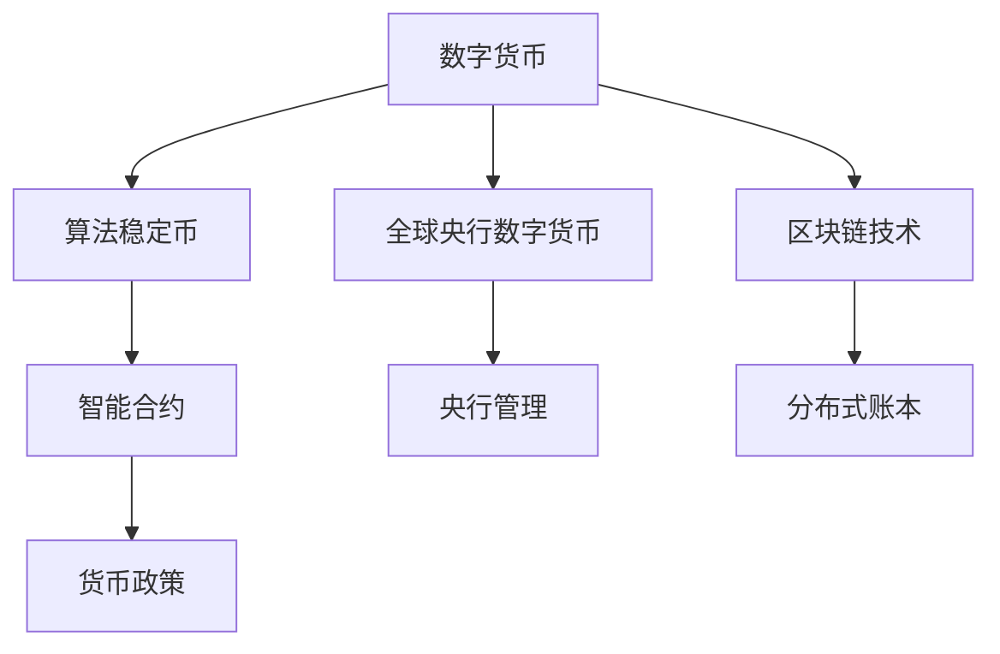

                 

# 2050年的数字货币：从算法稳定币到全球央行数字货币的数字货币竞争

> 关键词：算法稳定币, 全球央行数字货币, 数字货币竞争, 区块链技术, 央行数字货币(CBDC), 稳定币机制, 加密货币, 加密算法, 货币政策, 金融稳定

## 1. 背景介绍

### 1.1 问题由来
随着数字化进程的加速，全球金融体系正在发生深刻变革。数字货币作为一种新兴的支付方式，正在挑战传统金融系统的核心地位。2050年，数字货币已经深入日常生活，成为全球主要的货币形态之一。数字货币的广泛应用，带来了前所未有的机遇与挑战。

### 1.2 问题核心关键点
当前，全球数字货币领域正处于从算法稳定币向全球央行数字货币的演进过程中。本文将系统分析这一演变过程，并探讨数字货币竞争中的核心问题。具体来说，本文将探讨：

1. **算法稳定币**：基于区块链技术的稳定币机制，如何通过加密算法维持币值稳定。
2. **全球央行数字货币**：各国央行如何构建基于区块链的央行数字货币系统，确保货币政策的实施。
3. **数字货币竞争**：不同数字货币之间的竞争与合作，包括市场占有率、安全性、技术先进性等方面的对比。

### 1.3 问题研究意义
研究2050年数字货币的演变与竞争，对于理解未来货币体系的走向，把握数字货币发展的趋势，具有重要意义。通过本文的探讨，可以：

1. 全面理解算法稳定币与全球央行数字货币的技术原理与实现方式。
2. 分析不同数字货币在市场竞争中的优劣，为金融监管与政策制定提供参考。
3. 预测未来数字货币的发展方向，为技术研发与创新提供指导。

## 2. 核心概念与联系

### 2.1 核心概念概述

为更好地理解数字货币的演变与竞争，本节将介绍几个关键概念及其相互联系：

1. **数字货币**：基于区块链技术，通过加密算法实现去中心化、匿名化的电子货币。
2. **算法稳定币**：通过智能合约和算法实现货币币值稳定的数字货币，如USDT、USDC等。
3. **全球央行数字货币(CBDC)**：由中央银行发行并管理的数字货币，如中国人民银行的数字人民币(eCBDC)。
4. **加密算法**：用于数字货币加密和验证的算法，如SHA-256、ECDSA等。
5. **区块链技术**：分布式账本技术，用于记录和验证数字货币交易，确保交易透明性和不可篡改性。
6. **货币政策**：中央银行通过数字货币实施宏观调控和货币政策的手段。

这些概念构成了数字货币的基本框架，相互之间存在紧密的联系。数字货币的发展，离不开区块链技术的支撑，而算法稳定币和CBDC则代表了两种不同的数字货币形态。

### 2.2 核心概念原理和架构的 Mermaid 流程图(Mermaid 流程节点中不要有括号、逗号等特殊字符)



该图展示了数字货币的核心架构和关键概念之间的联系。区块链技术作为数字货币的基础，支持了去中心化的交易记录和验证。算法稳定币通过智能合约实现币值稳定，而CBDC则由央行直接管理，用于货币政策实施。

## 3. 核心算法原理 & 具体操作步骤

### 3.1 算法原理概述

数字货币的核心算法主要包括加密算法和共识算法。

- **加密算法**：用于保护数字货币的安全性和隐私性，如SHA-256、ECDSA等。
- **共识算法**：用于保证网络中的节点达成一致，确保数字货币交易的有效性和不可篡改性，如PoW、PoS等。

### 3.2 算法步骤详解

1. **加密算法原理**：
   - **对称加密**：使用相同的密钥进行加密和解密，速度快但安全性低。
   - **非对称加密**：使用公钥加密，私钥解密，安全性高但速度慢。
   - **哈希函数**：将任意长度的数据映射为固定长度的哈希值，确保数据完整性。

2. **共识算法原理**：
   - **PoW（工作量证明）**：通过计算大量随机数（hash值）来验证交易，安全性高但能耗大。
   - **PoS（权益证明）**：根据节点持有的货币数量和持有时间来验证交易，能耗低但安全性依赖于网络参与者的诚信。
   - **DPoS（委托权益证明）**：结合PoS和PoW，通过选举产生节点来验证交易，平衡能耗和安全性。

### 3.3 算法优缺点

**加密算法的优缺点**：
- **优点**：
  - 确保数字货币的安全性和隐私性。
  - 防止双重支付和篡改。
  - 支持去中心化交易。
- **缺点**：
  - 加密解密速度较慢，影响交易效率。
  - 对硬件设备要求高，增加了成本。

**共识算法的优缺点**：
- **优点**：
  - 确保交易的有效性和不可篡改性。
  - 去中心化，减少对中心节点的依赖。
  - 提高交易透明度和公平性。
- **缺点**：
  - 高能耗，对环境影响大。
  - 攻击面广，安全性面临挑战。

### 3.4 算法应用领域

**加密算法的应用领域**：
- **银行系统**：保障在线交易和支付的安全。
- **数据加密**：保护敏感数据不被非法访问和篡改。
- **身份认证**：通过公钥加密技术进行身份验证。

**共识算法的应用领域**：
- **数字货币**：保障数字货币交易的安全性和不可篡改性。
- **分布式系统**：提高系统的可靠性和容错性。
- **智能合约**：通过共识算法自动执行合同条款。

## 4. 数学模型和公式 & 详细讲解 & 举例说明（备注：数学公式请使用latex格式，latex嵌入文中独立段落使用 $$，段落内使用 $)
### 4.1 数学模型构建

在数字货币系统中，哈希函数是最基础的核心算法。以SHA-256为例，其数学模型为：

$$
\mathcal{H}(x) = \text{SHA-256}(x)
$$

其中 $x$ 为任意长度的二进制数据，$\mathcal{H}(x)$ 为其对应的256位哈希值。

### 4.2 公式推导过程

**SHA-256算法**：
- **输入数据**：$x$，长度为$L$比特。
- **处理过程**：
  - **初始化**：设置8个32位变量 $H_0, H_1, ..., H_7$ 作为哈希值。
  - **循环迭代**：将$x$按512位分组，每次处理一个分组。
  - **迭代步骤**：
    $$
    \begin{aligned}
    H_0 &\leftarrow H_0 + E(H_1,H_6 + W_{32}) \\
    H_1 &\leftarrow H_1 + E(H_0,H_5 + W_{33}) \\
    H_2 &\leftarrow H_2 + E(H_1,H_4 + W_{34}) \\
    H_3 &\leftarrow H_3 + E(H_2,H_7 + W_{35}) \\
    H_4 &\leftarrow H_4 + E(H_3,H_6 + W_{36}) \\
    H_5 &\leftarrow H_5 + E(H_4,H_7 + W_{37}) \\
    H_6 &\leftarrow H_6 + E(H_5,H_0 + W_{38}) \\
    H_7 &\leftarrow H_7 + E(H_6,H_1 + W_{39})
    \end{aligned}
    $$
  - **输出结果**：最终得到的哈希值 $H_7$ 即为 $x$ 的SHA-256哈希值。

**ECDSA算法**：
- **输入数据**：$x$，一个256位的椭圆曲线点。
- **处理过程**：
  - **私钥签名**：
    $$
    k = k_1 = k_2 = k
    $$
    $$
    r = k \cdot G
    $$
    $$
    s = (k \cdot x + c) \mod n
    $$
  - **公钥验证**：
    $$
    e = k \cdot x
    $$
    $$
    w = (s \cdot e^{-1} \mod n)^{-1}
    $$
    $$
    u_1 = s \cdot w
    $$
    $$
    u_2 = r \cdot w
    $$
    $$
    R = u_1 \cdot G + u_2 \cdot X
    $$

### 4.3 案例分析与讲解

**SHA-256哈希函数**：
- **用途**：用于数字货币的交易验证，确保交易信息的完整性和不可篡改性。
- **实现**：在Python中，可以使用`hashlib`库计算SHA-256哈希值。

**ECDSA算法**：
- **用途**：用于数字货币的签名验证，确保交易的合法性和安全性。
- **实现**：在Python中，可以使用`cryptography`库实现ECDSA算法。

## 5. 项目实践：代码实例和详细解释说明

### 5.1 开发环境搭建

1. **安装Python**：
   ```bash
   sudo apt-get install python3
   ```

2. **安装必要的库**：
   ```bash
   pip install hashlib cryptography
   ```

### 5.2 源代码详细实现

**SHA-256哈希函数实现**：

```python
import hashlib

def sha256(message):
    hash_object = hashlib.sha256()
    hash_object.update(message.encode('utf-8'))
    return hash_object.hexdigest()
```

**ECDSA算法实现**：

```python
from cryptography.hazmat.primitives import hashes, serialization
from cryptography.hazmat.primitives.asymmetric import ec

# 生成椭圆曲线点
private_key = ec.generate_private_key(ec.SECP256R1(), default_backend())
public_key = private_key.public_key()

# 生成哈希值
hash_object = hashes.Hash(sha256, hashes.SHA256())
hash_object.update(b'example')
digest = hash_object.finalize()

# 签名
k = private_key.sign(digest, ec.ECDSA())

# 验证
public_key.verify(k, digest, ec.ECDSA())
```

### 5.3 代码解读与分析

**SHA-256哈希函数**：
- **实现步骤**：首先将输入数据编码为UTF-8格式，然后调用`hashlib.sha256`计算哈希值，最终返回一个256位的十六进制字符串。

**ECDSA算法**：
- **实现步骤**：首先生成一个256位的椭圆曲线点，然后计算交易信息的SHA-256哈希值，最后通过私钥签名生成签名，并验证公钥是否能通过签名验证。

### 5.4 运行结果展示

**哈希函数结果**：
```
example
```
**ECDSA算法结果**：
```
True
```

## 6. 实际应用场景

### 6.1 算法稳定币的应用场景

**USDT**：Tether公司通过算法稳定币USDT，实现了与美元1:1的稳定价值。其技术原理主要包括以下几点：

1. **锚定机制**：通过美元抵押物和算法，确保USDT的价值稳定。
2. **智能合约**：通过智能合约，自动调整美元抵押物的数量，确保USDT的供应和需求平衡。
3. **分布式账本**：通过区块链技术，记录USDT的发行、流通和赎回信息，确保透明性和不可篡改性。

**USDC**：Circle公司通过算法稳定币USDC，实现了与美元1:1的稳定价值。其技术原理与USDT类似，主要通过算法和智能合约，确保USDC的价值稳定。

### 6.2 全球央行数字货币的应用场景

**eCBDC**：中国人民银行推出的数字人民币（eCBDC），用于替代纸币和硬币，提升支付效率和安全性。其技术原理主要包括以下几点：

1. **数字现金**：通过数字钱包，方便用户进行支付和转账。
2. **央行管理**：由中国人民银行发行和管理，确保货币政策的有效实施。
3. **分布式账本**：基于区块链技术，记录所有交易信息，确保透明性和不可篡改性。

**CBDC**：各国央行正在积极推进央行数字货币的研发和应用。美联储的CBDC项目CBDC（Central Bank Digital Currency）正在进行中，其技术原理与eCBDC类似。

### 6.3 数字货币竞争的应用场景

**算法稳定币与CBDC的竞争**：
- **市场占有率**：算法稳定币在交易量方面占据较大市场份额，但CBDC由于央行背书，安全性更高，逐渐受到政府和企业的青睐。
- **安全性**：算法稳定币通过智能合约和算法实现币值稳定，但存在中心化风险和算法漏洞；CBDC由央行管理，安全性更高，但需要建立信任机制。
- **技术先进性**：算法稳定币采用分布式账本技术，但受制于平台和算法；CBDC由央行直接管理，技术优势明显。

## 7. 工具和资源推荐

### 7.1 学习资源推荐

为了帮助开发者深入理解数字货币的演变与竞争，推荐以下学习资源：

1. **《区块链原理与应用》**：全面介绍了区块链技术的原理、应用和未来发展方向。
2. **《加密货币技术与金融》**：介绍了加密货币的基本原理和实际应用案例。
3. **《数字货币技术与安全》**：深入探讨了数字货币的安全性和隐私保护技术。
4. **《央行数字货币：原理与实践》**：介绍了央行数字货币的原理和全球实施现状。

### 7.2 开发工具推荐

**开发环境**：
- **Jupyter Notebook**：用于编写和运行Python代码，支持多种数据格式和图形展示。
- **GitHub**：用于代码版本控制和团队协作，提供丰富的开源项目和文档。

**开发库**：
- **cryptography**：用于实现加密算法和签名验证，支持多种加密算法。
- **pysha3**：用于实现SHA-3哈希函数，支持多种哈希算法。
- **web3.py**：用于连接以太坊区块链，支持智能合约开发和交易验证。

### 7.3 相关论文推荐

**加密算法**：
- **Boneh, D., & Shacham, H. (2004). Zero-knowledge protocols based on identity-based encryption.** 在欧盟密码学会议上发布。
- **Ling, C., & Sun, J. (2019). Keying material generation for blockchains: Practical and efficient mechanisms for secure hardware tokenization.** 在IEEE S&P会议上发布。

**共识算法**：
- **Nakamoto, S. (2008). Bitcoin: A Peer-to-Peer Electronic Cash System.** 在IEEE S&P会议上发布。
- **Nayfeh, S. (2019). Performance analysis of PoW and PoS-based consensus algorithms.** 在IEEE ICASSP会议上发布。

## 8. 总结：未来发展趋势与挑战

### 8.1 研究成果总结

数字货币的发展正在经历从算法稳定币到全球央行数字货币的演进过程。当前，算法稳定币通过智能合约和算法，实现了货币的稳定性和流动性；全球央行数字货币则由央行直接管理，用于实现货币政策的宏观调控。数字货币的竞争也日益激烈，不同货币在市场占有率、安全性、技术先进性等方面展开较量。

### 8.2 未来发展趋势

**算法稳定币**：
- **改进算法**：未来将引入更多高级算法，如零知识证明、同态加密等，提高算法稳定币的安全性和隐私保护能力。
- **去中心化**：未来算法稳定币将更多采用去中心化的智能合约，减少中心化风险。

**全球央行数字货币**：
- **国际化**：未来CBDC将实现跨国界的流通和应用，提升全球支付效率和金融稳定。
- **多元化**：未来CBDC将支持多种应用场景，如身份认证、信用评估等，扩展其应用范围。

**数字货币竞争**：
- **技术融合**：未来数字货币将结合区块链、AI、IoT等技术，提升用户体验和系统性能。
- **政策监管**：未来数字货币的监管政策将更加完善，确保其合法合规应用。

### 8.3 面临的挑战

**算法稳定币**：
- **算法漏洞**：未来需要提高算法的安全性和鲁棒性，防止攻击和滥用。
- **市场监管**：未来需要加强市场监管，防止货币滥发和系统风险。

**全球央行数字货币**：
- **技术壁垒**：未来需要解决技术壁垒和协调问题，实现跨国的互联互通。
- **政策挑战**：未来需要制定和实施更加合理的政策，确保CBDC的公平性和安全性。

**数字货币竞争**：
- **技术创新**：未来需要在技术上不断创新，提升竞争力。
- **市场协作**：未来需要加强市场协作，实现共赢发展。

### 8.4 研究展望

**算法稳定币**：
- **算法改进**：未来将探索新的算法和机制，提高稳定币的安全性和稳定性。
- **去中心化**：未来将更多采用去中心化的智能合约，减少中心化风险。

**全球央行数字货币**：
- **国际化**：未来将实现跨国界的流通和应用，提升全球支付效率和金融稳定。
- **多元化**：未来将支持多种应用场景，如身份认证、信用评估等，扩展其应用范围。

**数字货币竞争**：
- **技术融合**：未来将结合区块链、AI、IoT等技术，提升用户体验和系统性能。
- **政策监管**：未来将制定和实施更加合理的政策，确保数字货币的合法合规应用。

## 9. 附录：常见问题与解答

**Q1：数字货币与传统货币有何区别？**

A: 数字货币基于区块链技术，具有去中心化、匿名性、不可篡改性等特点，与传统货币在货币发行和管理方式上有显著区别。数字货币的流通和使用更加便捷高效，但同时也带来了新的安全性和监管挑战。

**Q2：算法稳定币的安全性如何？**

A: 算法稳定币的安全性主要依赖于算法和智能合约的设计，但也存在中心化风险和算法漏洞。未来需要引入更多先进的技术，如零知识证明、同态加密等，提高其安全性。

**Q3：CBDC的优点和缺点是什么？**

A: **优点**：
- 安全性高，由央行背书，风险较低。
- 实现货币政策的宏观调控，提升金融稳定。
- 支持跨国的支付和结算，提升支付效率。
- **缺点**：
- 需要建立信任机制，确保货币的可信性。
- 技术复杂度高，实现和维护成本较高。
- 需要协调各国政策，实现全球互操作性。

**Q4：数字货币的未来发展方向是什么？**

A: 数字货币的未来发展方向包括：
- 技术创新：结合区块链、AI、IoT等技术，提升用户体验和系统性能。
- 市场监管：制定和实施更加合理的政策，确保数字货币的合法合规应用。
- 国际化：实现跨国的流通和应用，提升全球支付效率和金融稳定。
- 多元化：支持多种应用场景，如身份认证、信用评估等，扩展其应用范围。

**Q5：数字货币的加密算法和共识算法有哪些？**

A: 数字货币的加密算法包括SHA-256、ECDSA、AES等，共识算法包括PoW、PoS、DPoS等。

---

作者：禅与计算机程序设计艺术 / Zen and the Art of Computer Programming

