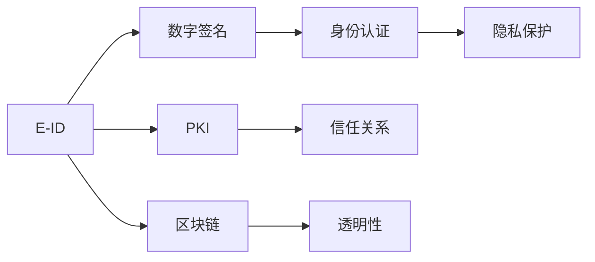

                 

# 2050年的数字身份：从电子身份证到数字公民的身份认证

## 1. 背景介绍

### 1.1 问题由来
随着信息技术的飞速发展，数字身份在现代社会中的应用愈发广泛，从金融交易到医疗保健，从社交网络到政府服务，数字身份已渗透到各个角落。然而，当前的数字身份体系在隐私保护、数据安全、身份认证等方面仍面临诸多挑战。如何在保障隐私的前提下，提升身份认证的准确性和安全性，成为21世纪数字身份技术不断探索的核心课题。

### 1.2 问题核心关键点
数字身份的核心在于利用技术手段确保身份的唯一性和不可篡改性，从而实现身份认证和数据保护。数字身份技术的发展可以分为两个阶段：
- **电子身份证(E-ID)时代**：通过电子方式生成和管理身份证书，实现基本的身份认证和数据交换。
- **数字公民(Digital Citizen)时代**：在E-ID的基础上，引入更多智能技术和应用场景，构建更加全面、智能、安全的身份认证系统。

本文将重点探讨从电子身份证到数字公民身份认证的技术演进，剖析其核心原理、应用场景与未来发展趋势。

## 2. 核心概念与联系

### 2.1 核心概念概述

- **电子身份证(E-ID)**：利用数字技术生成的身份证书，包含个人基本信息、数字签名和加密证书，通过电子方式验证身份。
- **数字签名(Digital Signature)**：使用私钥对数据进行加密，确保数据的完整性和不可否认性。
- **公钥基础设施(PKI)**：基于公钥加密技术，建立信任关系，实现安全通信和身份认证。
- **区块链(Blockchain)**：去中心化的分布式账本技术，确保数据透明、不可篡改。
- **身份认证(Identity Verification)**：通过身份信息与存储的认证信息比对，验证个人身份的真实性。
- **隐私保护(Privacy Preservation)**：在数字身份验证中，保护个人信息不被未经授权的访问和泄露。

这些概念之间的联系可通过以下Mermaid流程图展示：



这个流程图展示了E-ID、数字签名、PKI、区块链、身份认证和隐私保护之间的关系：

1. **E-ID**是整个身份认证系统的基础，包含个人基本信息和数字签名，确保身份的唯一性和不可否认性。
2. **数字签名**基于E-ID中的私钥，对数据进行加密，保证数据的完整性和不可篡改性。
3. **PKI**通过证书颁发机构(CA)，建立公钥与用户身份的绑定关系，确保通信双方的身份真实性。
4. **区块链**通过分布式账本，实现数据的透明性和不可篡改性，增强身份认证系统的安全性。
5. **身份认证**通过将E-ID、数字签名和PKI技术结合，验证用户身份的真实性。
6. **隐私保护**通过加密和分布式存储，保护个人数据不被未经授权的访问和泄露。

## 3. 核心算法原理 & 具体操作步骤

### 3.1 算法原理概述

数字身份认证的核心在于通过多种技术手段，构建可信的身份认证体系，确保身份的真实性和数据的完整性。其算法原理主要包括以下几个方面：

- **公钥加密算法**：如RSA、ECC等，用于生成公钥和私钥，确保通信安全。
- **数字签名算法**：如SHA-256、RSA等，用于对数据进行签名，验证数据的完整性和不可篡改性。
- **数字证书(Certificate)**：由CA颁发，包含公钥、证书持有者信息、CA的数字签名等，确保公钥的合法性和身份的真实性。
- **身份验证协议**：如OAuth、OpenID Connect等，用于实现跨系统的身份认证和授权。

### 3.2 算法步骤详解

数字身份认证的一般步骤包括：

**Step 1: 身份信息收集**
- 收集用户的个人身份信息，如姓名、身份证号、护照号码等。
- 收集用户的生物特征信息，如指纹、面部识别、虹膜等。

**Step 2: 公钥加密与证书生成**
- 使用非对称加密算法，生成公钥和私钥。
- 通过PKI体系，向CA申请数字证书，CA对证书进行签名，并发行给用户。

**Step 3: 身份认证与数据传输**
- 用户向服务提供商发送身份认证请求，包括数字证书。
- 服务提供商验证数字证书的合法性，确认用户身份。
- 服务提供商和用户之间的通信，通过公钥加密算法进行数据传输，确保通信安全。

**Step 4: 数字签名与数据验证**
- 用户在发送数据时，使用私钥对数据进行数字签名。
- 接收方使用公钥验证签名的合法性，确保数据的完整性和不可篡改性。

### 3.3 算法优缺点

数字身份认证算法的主要优点包括：

- **安全性高**：基于非对称加密和数字签名的技术，确保通信和数据的高度安全性。
- **可扩展性强**：可以通过添加生物特征信息，进一步增强身份认证的准确性和安全性。
- **标准化度高**：遵循国际标准的数字证书和身份验证协议，便于不同系统之间的互操作。

同时，数字身份认证算法也存在一些缺点：

- **计算复杂度高**：非对称加密和数字签名算法的计算复杂度较高，导致系统响应延迟。
- **存储成本高**：需要存储大量的数字证书和公钥，增加了存储成本和系统复杂度。
- **隐私风险高**：数字证书和公钥的泄露，可能导致身份信息的滥用和隐私泄露。

### 3.4 算法应用领域

数字身份认证算法在多个领域得到广泛应用：

- **金融交易**：用于验证用户的身份，确保交易的安全性和合规性。
- **医疗保健**：用于验证医生的身份和病人的隐私，确保医疗数据的保护和合规。
- **政府服务**：用于身份认证和权限管理，确保政府服务的可靠性和安全性。
- **网络安全**：用于身份验证和访问控制，确保网络系统的安全性和稳定性。
- **社交网络**：用于用户认证和隐私保护，确保用户数据的完整性和不可篡改性。

## 4. 数学模型和公式 & 详细讲解

### 4.1 数学模型构建

数字身份认证的数学模型主要包括以下几个方面：

- **公钥加密模型**：使用非对称加密算法，确保通信的安全性和数据的完整性。
- **数字签名模型**：使用哈希函数和私钥对数据进行签名，确保数据的完整性和不可篡改性。
- **数字证书模型**：使用公钥加密算法和数字签名算法，建立可信的身份认证体系。

### 4.2 公式推导过程

以RSA公钥加密算法为例，其基本原理可以表示为：

1. **密钥生成**：
   - 选择两个大素数 $p$ 和 $q$，计算 $n=pq$，$n$ 的长度为1024位。
   - 计算欧拉函数 $\varphi(n)=(p-1)(q-1)$。
   - 选择一个整数 $e$，满足 $1<e<\varphi(n)$ 且 $e$ 与 $\varphi(n)$ 互质。
   - 计算 $d$，满足 $ed \equiv 1 \pmod{\varphi(n)}$。

2. **加密和解密**：
   - 将明文 $m$ 转化为数字 $M$，$0 \leq M \leq n-1$。
   - 计算密文 $C=M^e \pmod{n}$。
   - 计算明文 $M=C^d \pmod{n}$。

其中，$n$ 和 $e$ 公开作为公钥，$d$ 保密作为私钥。接收方通过公钥 $n$ 和 $e$ 计算密文 $C$，再使用私钥 $d$ 计算明文 $M$，从而验证数据的完整性和不可篡改性。

### 4.3 案例分析与讲解

**案例1: 数字签名与数据验证**

假设某公司向其员工发送一份合同，要求员工使用数字签名进行确认。具体步骤如下：

1. **员工生成密钥对**：
   - 员工使用RSA算法生成公钥和私钥。
   - 员工将公钥发送给公司，公司保存员工的数字证书。

2. **员工签署合同**：
   - 员工使用私钥对合同进行数字签名。
   - 将数字签名与合同一起发送给公司。

3. **公司验证签名**：
   - 公司使用员工的公钥对数字签名进行验证。
   - 如果验证成功，说明合同未被篡改，签名有效。

**案例2: 跨系统身份认证**

某用户在银行系统进行身份认证，银行系统使用OpenID Connect协议进行身份验证。具体步骤如下：

1. **用户登录银行**：
   - 用户通过输入用户名和密码进行登录。
   - 银行系统向认证服务器请求认证。

2. **认证服务器验证**：
   - 认证服务器通过用户提供的身份信息进行身份验证。
   - 如果验证成功，返回认证成功信息。

3. **银行系统确认身份**：
   - 银行系统确认用户身份，允许其访问银行服务。

通过OpenID Connect协议，用户只需在一个认证服务器上完成身份验证，便可在多个服务系统中使用相同的身份信息进行登录。

## 5. 项目实践：代码实例和详细解释说明

### 5.1 开发环境搭建

在进行数字身份认证实践前，我们需要准备好开发环境。以下是使用Python进行OpenSSL和JWK库开发的环境配置流程：

1. 安装Anaconda：从官网下载并安装Anaconda，用于创建独立的Python环境。

2. 创建并激活虚拟环境：
```bash
conda create -n id-auth python=3.8 
conda activate id-auth
```

3. 安装依赖包：
```bash
pip install openssl pyjwt cryptography
```

完成上述步骤后，即可在`id-auth`环境中开始开发。

### 5.2 源代码详细实现

这里以RSA数字签名为例，给出使用OpenSSL和JWK库进行数字签名的PyTorch代码实现。

```python
from cryptography.hazmat.primitives import serialization
from cryptography.hazmat.primitives.asymmetric import rsa, padding, utils
from cryptography.hazmat.primitives import hashes
from cryptography.hazmat.backends import default_backend

def generate_keys():
    private_key = rsa.generate_private_key(
        public_exponent=65537,
        key_size=2048,
        backend=default_backend()
    )
    public_key = private_key.public_key()
    return private_key, public_key

def sign_message(message, private_key):
    signer = private_key.signer(padding.PSS(
        mgf=padding.MGF1(hashes.SHA256()),
        salt_length=padding.PSS.MAX_LENGTH,
        hashAlgorithm=hashes.SHA256()
    ), backend=default_backend())
    signer.update(message.encode('utf-8'))
    signature = signer.finalize()
    return signature

def verify_signature(message, signature, public_key):
    verifier = public_key.verifier(
        signature,
        padding.PSS(
            mgf=padding.MGF1(hashes.SHA256()),
            salt_length=padding.PSS.MAX_LENGTH,
            hashAlgorithm=hashes.SHA256()
        ), backend=default_backend()
    )
    verifier.update(message.encode('utf-8'))
    try:
        verifier.verify()
        print("Signature is valid")
    except:
        print("Signature is invalid")

# 生成密钥对
private_key, public_key = generate_keys()

# 生成数字签名
message = "Hello, World!"
signature = sign_message(message, private_key)

# 验证数字签名
verify_signature(message, signature, public_key)
```

### 5.3 代码解读与分析

让我们再详细解读一下关键代码的实现细节：

**generate_keys函数**：
- 使用RSA算法生成公钥和私钥。

**sign_message函数**：
- 使用私钥对消息进行数字签名。

**verify_signature函数**：
- 使用公钥验证数字签名的合法性。

在得到数字签名后，即可通过公钥验证签名的真实性，确保消息的完整性和不可篡改性。

## 6. 实际应用场景

### 6.1 电子身份证时代

在电子身份证时代，数字身份认证主要应用于政府服务、金融交易等领域。电子身份证系统由政府或认证机构管理，向用户颁发数字证书，并提供身份验证服务。

**政府服务**：
- **身份验证**：用户访问政府网站或服务时，需要提供电子身份证和数字证书，验证身份后才能享受服务。
- **权限管理**：政府机构根据用户的身份和权限，分配不同级别的访问权限，确保服务的安全性和合规性。

**金融交易**：
- **身份认证**：用户进行网上银行、证券交易等金融操作时，需要提供电子身份证和数字证书，确保身份的真实性和操作的合规性。
- **数据安全**：金融交易系统对数据进行加密和数字签名，确保交易数据的完整性和不可篡改性。

### 6.2 数字公民时代

进入数字公民时代，数字身份认证的应用场景更加多样化，涉及更多智能技术和应用场景：

**社交网络**：
- **用户认证**：用户通过数字证书和数字签名，进行身份验证和隐私保护。
- **权限管理**：社交平台根据用户的身份和权限，限制访问内容和功能，保护用户隐私。

**医疗保健**：
- **医生身份认证**：医疗机构使用数字证书和数字签名，验证医生的身份和权限，确保医疗数据的保护和合规性。
- **患者隐私保护**：患者通过数字证书和数字签名，保护个人隐私和医疗数据的完整性。

**政府治理**：
- **电子政务**：政府机构使用数字证书和数字签名，确保电子政务系统的安全和可靠。
- **智能合约**：政府使用智能合约技术，实现透明、公正、自动化的公共服务。

## 7. 工具和资源推荐

### 7.1 学习资源推荐

为了帮助开发者系统掌握数字身份认证的理论基础和实践技巧，这里推荐一些优质的学习资源：

1. 《现代密码学基础》系列博文：由密码学专家撰写，详细介绍了公钥加密、数字签名等核心技术。

2. CS224W《密码学与网络安全》课程：斯坦福大学开设的密码学课程，涵盖密码学原理和应用。

3. 《Applied Cryptography》书籍：密码学经典教材，深入浅出地介绍了各类密码学算法和技术。

4. OpenSSL官方文档：OpenSSL库的官方文档，提供了完整的加密和数字签名实现，是进行数字身份认证开发的必备资料。

5. NIST数字签名标准：NIST发布的数字签名标准，包含详细的算法和实现规范，是数字签名技术的权威指南。

通过对这些资源的学习实践，相信你一定能够快速掌握数字身份认证的精髓，并用于解决实际的NLP问题。

### 7.2 开发工具推荐

高效的开发离不开优秀的工具支持。以下是几款用于数字身份认证开发的常用工具：

1. OpenSSL：开源的密码学库，支持多种加密算法和数字签名算法，是实现数字身份认证的核心工具。

2. PyJWT：基于Python的JSON Web Token库，用于生成和验证数字签名，方便身份认证的实现。

3. cryptography：Python的密码学库，提供了多种加密和数字签名算法的实现，易于与数字身份认证系统集成。

4. PKCS#12：国际标准，定义了数字证书的格式和验证规则，支持多种加密和签名算法。

5. JWK：JSON Web Key格式，用于描述和验证数字证书和公钥，方便数字身份认证系统的构建。

合理利用这些工具，可以显著提升数字身份认证系统的开发效率，加速创新迭代的步伐。

### 7.3 相关论文推荐

数字身份认证技术的发展源于学界的持续研究。以下是几篇奠基性的相关论文，推荐阅读：

1. 《A New Approach to Digital Signatures》：RSA数字签名算法的提出，奠定了数字签名技术的基础。

2. 《Public-Key Cryptosystems without Randomized Encryption》：ECC椭圆曲线密码算法的提出，提高了公钥加密算法的安全性。

3. 《Designing Secure Web Applications》：Web身份验证的安全性设计，介绍了OpenID Connect等身份认证协议。

4. 《Blockchain-Based Identity Management Systems》：区块链在数字身份认证中的应用，增强了身份认证的安全性和可靠性。

5. 《Privacy-Preserving Digital Identity Management》：隐私保护技术在数字身份认证中的应用，探讨了数据保护和隐私保护的新方法。

这些论文代表了大规模语言模型微调技术的发展脉络。通过学习这些前沿成果，可以帮助研究者把握学科前进方向，激发更多的创新灵感。

## 8. 总结：未来发展趋势与挑战

### 8.1 研究成果总结

本文对数字身份认证的技术演进进行了全面系统的介绍，从电子身份证到数字公民的身份认证，展现了数字身份认证技术的广阔应用前景。通过分析核心算法原理和操作步骤，我们深入理解了数字身份认证系统的构建和应用。在实际应用场景中，数字身份认证已广泛应用于政府服务、金融交易、社交网络、医疗保健等领域，为信息安全和社会治理提供了有力保障。

### 8.2 未来发展趋势

展望未来，数字身份认证技术将呈现以下几个发展趋势：

1. **区块链与智能合约**：利用区块链去中心化和智能合约自动化的特性，进一步增强数字身份认证系统的透明度和安全性。

2. **零知识证明**：利用零知识证明技术，在不泄露身份信息的情况下，验证用户身份的真实性。

3. **多因素身份认证**：结合生物特征识别和行为分析，实现多因素身份认证，提高身份认证的准确性和安全性。

4. **身份验证协议**：引入更多身份验证协议，如FIDO、WebAuthn等，实现跨系统、跨平台的用户身份认证。

5. **身份隐私保护**：通过隐私计算和差分隐私等技术，保护用户的身份信息和隐私数据。

6. **智能身份系统**：利用人工智能技术，实现智能身份认证和授权，提供更加个性化、智能化的服务。

### 8.3 面临的挑战

尽管数字身份认证技术已经取得了显著成就，但在迈向更加智能化、普适化应用的过程中，它仍面临诸多挑战：

1. **计算复杂度高**：数字签名的计算复杂度较高，导致系统响应延迟。

2. **存储成本高**：需要存储大量的数字证书和公钥，增加了存储成本和系统复杂度。

3. **隐私风险高**：数字证书和公钥的泄露，可能导致身份信息的滥用和隐私泄露。

4. **系统兼容性差**：不同的身份认证系统和协议之间存在兼容性问题，导致系统互操作性差。

5. **攻击手段多**：身份认证系统面临多种攻击手段，如中间人攻击、钓鱼攻击等，增加了系统的安全风险。

### 8.4 研究展望

面对数字身份认证所面临的种种挑战，未来的研究需要在以下几个方面寻求新的突破：

1. **算法优化**：开发更加高效、简洁的数字身份认证算法，降低计算复杂度和存储成本。

2. **隐私保护**：引入隐私计算和差分隐私等技术，保护用户身份信息和隐私数据。

3. **系统整合**：实现跨系统、跨平台的身份认证和授权，提高系统的兼容性和互操作性。

4. **智能身份**：结合人工智能技术，实现智能身份认证和授权，提供更加个性化、智能化的服务。

5. **安全防护**：引入多因素身份认证和行为分析等技术，增强系统的安全性。

6. **伦理道德**：在身份认证系统中引入伦理导向的评估指标，过滤和惩罚有偏见、有害的输出倾向，确保输出的安全性。

这些研究方向的探索，必将引领数字身份认证技术迈向更高的台阶，为构建安全、可靠、可解释、可控的智能系统铺平道路。面向未来，数字身份认证技术还需要与其他人工智能技术进行更深入的融合，如知识表示、因果推理、强化学习等，多路径协同发力，共同推动智能身份认证系统的进步。只有勇于创新、敢于突破，才能不断拓展身份认证系统的边界，让智能技术更好地造福人类社会。

## 9. 附录：常见问题与解答

**Q1：数字身份认证是否适用于所有应用场景？**

A: 数字身份认证技术适用于大多数应用场景，特别是涉及隐私保护和身份验证的领域。但对于一些特殊应用场景，如军事、航空等，需要结合特定的物理安全措施，才能确保身份认证的安全性和可靠性。

**Q2：数字身份认证如何应对计算复杂度高的问题？**

A: 针对计算复杂度高的问题，可以采用硬件加速技术，如FPGA、ASIC等，加速数字签名的计算过程。同时，优化数字签名的算法和实现，如使用哈希链代替传统哈希函数，降低计算复杂度。

**Q3：数字身份认证如何应对存储成本高的问题？**

A: 针对存储成本高的问题，可以采用分布式存储技术，如区块链和分布式文件系统，降低身份信息的集中存储需求。同时，优化数字证书和公钥的管理方式，如使用密钥管理系统，提高证书的生成和撤销效率。

**Q4：数字身份认证如何应对隐私风险高的问题？**

A: 针对隐私风险高的问题，可以采用零知识证明和差分隐私等技术，在不泄露身份信息的情况下，验证用户身份的真实性。同时，加强身份信息的访问控制，确保身份数据的合法使用。

**Q5：数字身份认证如何应对系统兼容性差的问题？**

A: 针对系统兼容性差的问题，可以引入统一的身份认证标准，如OpenID Connect、SAML等，实现不同系统之间的互操作。同时，开发通用的身份认证中间件，提供跨平台的身份验证服务。

这些问题的解决，将进一步推动数字身份认证技术的普及和应用，为构建安全、可靠、可解释、可控的智能系统提供坚实基础。总之，数字身份认证技术需要从算法优化、隐私保护、系统整合、智能身份、安全防护、伦理道德等多个维度进行全面改进，才能更好地适应未来社会的需求。

---

作者：禅与计算机程序设计艺术 / Zen and the Art of Computer Programming

