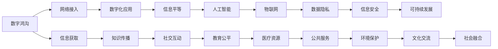

                 

# 2050年的数字鸿沟：从接入到应用的信息平等

> 关键词：数字鸿沟,信息平等,接入,应用,人工智能,物联网,数据隐私,信息安全,可持续发展

## 1. 背景介绍

### 1.1 数字鸿沟的历史与现状

数字鸿沟（Digital Divide）是指不同社会群体在获取和利用数字资源方面的不平等现象。随着互联网和信息技术的快速普及，数字鸿沟问题日益凸显，成为全球关注的焦点。

从历史上看，数字鸿沟最初形成于网络接入阶段。由于经济、教育、地理位置等因素的限制，部分人群难以负担高昂的网络接入费用，无法享受数字红利。比如，在20世纪末期的美国，低收入家庭和农村地区的网络普及率远低于城市和富裕家庭。

进入新世纪后，数字鸿沟扩展到应用层面。互联网普及的不断提升，使得数字资源不再仅限于网络接入，而是涵盖了各类互联网应用。在这个阶段，数字鸿沟体现在信息获取、知识传播、社交互动等各个方面。比如，低收入群体和高收入群体在获取高质量教育资源、医疗信息、职业培训等方面存在明显差异。

当前，数字鸿沟现象在全球范围内依然存在。世界银行数据显示，全球仍有约40%的人口无法访问互联网，这一群体主要集中在非洲、亚洲、拉丁美洲等发展中国家。此外，即使能上网，部分群体由于语言、文化等因素，难以有效利用数字资源。据联合国报告，非洲和南亚地区因语言和数字化内容不足，导致教育资源和健康信息的获取受到极大限制。

### 1.2 数字鸿沟的挑战与机遇

尽管数字鸿沟带来了诸多挑战，但也孕育着巨大的机遇。随着技术进步和社会发展，通过创新手段，逐步缩小数字鸿沟，实现信息平等，成为全球共识。

1. **经济增长与就业机会**：
   - 数字鸿沟的缩小将促进数字经济的发展，创造更多就业机会，带动区域经济的增长。
   - 数字化应用能够帮助低收入群体提升技能，增强就业竞争力，改善生活质量。

2. **教育公平与知识普及**：
   - 通过在线教育和远程学习平台，打破地域限制，将优质教育资源向欠发达地区倾斜。
   - 促进信息的广泛传播，提升公众的科学素养和文化素质。

3. **健康医疗与公共服务**：
   - 利用数字技术提升医疗服务的可及性和效率，使偏远地区居民也能享受到优质医疗资源。
   - 提供数字化的公共服务，简化政府事务处理流程，提高公共服务效率。

4. **环境保护与可持续发展**：
   - 通过大数据和物联网技术，提升资源利用效率，降低环境污染。
   - 实现智能农业和智能交通，促进绿色、可持续的发展模式。

5. **文化交流与社会融合**：
   - 通过数字媒体和文化交流平台，增强不同文化背景人群的交流与理解。
   - 提升社会融合度，促进多元文化的包容与发展。

## 2. 核心概念与联系

### 2.1 核心概念概述

为了更系统地理解数字鸿沟及其应对策略，本节将介绍几个核心概念及其联系：

- **数字鸿沟**：指不同社会群体在获取和利用数字资源方面的不平等现象。
- **信息平等**：指不同群体在获取和利用信息资源方面的平等性，旨在消除数字鸿沟，实现信息普及。
- **网络接入**：指通过互联网技术将不同地域、不同群体的用户连接到网络，实现信息交换。
- **数字化应用**：指将数字技术应用于各类场景，如教育、医疗、商业等，提供信息服务。
- **人工智能**：指通过机器学习、深度学习等技术，实现自主决策和智能处理。
- **物联网**：指通过各类感知设备，实现物理世界与数字世界的连接，提供数据支持。
- **数据隐私**：指在数字环境下，保障个人信息的安全和隐私。
- **信息安全**：指防止数字资源被非法获取、篡改和破坏，保护信息安全。
- **可持续发展**：指在数字鸿沟缩小过程中，兼顾经济效益、社会效益和环境效益，实现长期、健康的发展。

这些概念之间的联系可以通过以下Mermaid流程图来展示：



这个流程图展示了数字鸿沟缩小过程中，从接入到应用的信息平等演变过程。网络接入是基础，数字化应用是关键，信息平等是目标，而人工智能、物联网等技术是手段。同时，数据隐私和信息安全是重要的保障，可持续发展是最终目的。

### 2.2 核心概念原理和架构

#### 2.2.1 网络接入

网络接入是数字鸿沟缩小过程中的基础环节。它通过物理网络和通信技术，将用户连接到互联网，实现信息传递。

1. **宽带普及**：
   - 提高宽带网络覆盖范围，降低接入费用。
   - 采用光纤、5G等高带宽技术，提升网络速度和稳定性。

2. **公共网络设施建设**：
   - 在偏远和欠发达地区建设网络基站和热点，提升网络普及率。
   - 推动“数字丝绸之路”等跨国网络项目，加强全球网络互联互通。

#### 2.2.2 数字化应用

数字化应用是数字鸿沟缩小过程中的关键环节。它通过各类数字技术，将网络接入转化为实际应用，提升信息价值。

1. **在线教育**：
   - 开发免费或低成本的在线教育平台，提供高质量的教育资源。
   - 推广远程学习，缩小城乡、地域之间的教育差距。

2. **远程医疗**：
   - 利用人工智能和物联网技术，实现远程医疗咨询和诊断。
   - 构建覆盖城乡的医疗网络，提升医疗服务的可及性和效率。

3. **智能农业**：
   - 利用物联网技术，实时监控农作物的生长状况，优化种植管理。
   - 提供定制化的农业信息服务，提升农业生产效率和农民收入。

#### 2.2.3 信息平等

信息平等是数字鸿沟缩小过程中的最终目标。它通过信息获取、知识传播、社交互动等手段，实现不同群体在信息资源上的平等性。

1. **信息获取**：
   - 提供免费的数字化信息资源，如在线图书馆、教育平台、政府服务。
   - 普及数字文化娱乐内容，丰富公众的文化生活。

2. **知识传播**：
   - 推广科学普及和技能培训，提升公众的知识水平。
   - 利用社交媒体和数字平台，促进知识的快速传播。

3. **社交互动**：
   - 增强数字化的社区互动，促进不同文化背景人群的交流与理解。
   - 提供虚拟现实和增强现实技术，提升社交体验。

## 3. 核心算法原理 & 具体操作步骤

### 3.1 算法原理概述

数字鸿沟的缩小涉及多个层面，包括技术、政策、经济、社会等。算法原理和技术手段在其中起到了重要作用。

#### 3.1.1 网络接入技术

1. **网络规划与优化**：
   - 采用先进的算法，如遗传算法、模拟退火算法，优化网络布局和资源分配。
   - 利用深度学习技术，预测网络流量和负载，动态调整网络带宽和路由策略。

2. **用户行为分析**：
   - 使用大数据分析技术，了解用户的网络使用习惯和偏好，优化网络服务。
   - 采用机器学习模型，预测用户的网络需求，提供定制化的服务方案。

#### 3.1.2 数字化应用技术

1. **自然语言处理**：
   - 利用自然语言处理技术，提升智能客服和在线教育的互动效果。
   - 采用机器翻译和语音识别技术，消除语言障碍，实现跨语言交流。

2. **智能推荐系统**：
   - 通过协同过滤和内容推荐算法，提升个性化服务的精准度。
   - 利用深度学习模型，预测用户需求，提供定制化的推荐内容。

#### 3.1.3 信息平等算法

1. **信息过滤与推荐**：
   - 采用过滤算法，如协同过滤、基于内容的推荐算法，筛选出高质量的信息。
   - 利用强化学习算法，不断优化信息推荐策略，提升用户满意度。

2. **知识图谱与语义分析**：
   - 构建知识图谱，整合各类信息资源，提升知识的关联性和可访问性。
   - 利用语义分析技术，理解用户查询意图，提供更准确的信息服务。

### 3.2 算法步骤详解

#### 3.2.1 网络接入算法步骤

1. **网络需求分析**：
   - 通过问卷调查和数据分析，了解目标用户的网络使用需求和偏好。
   - 采用A/B测试和用户反馈，优化网络方案和服务质量。

2. **网络资源分配**：
   - 利用优化算法，分配网络资源，提高网络效率和可靠性。
   - 采用负载均衡技术，动态调整网络带宽和路由策略，避免网络拥堵。

3. **网络质量监控**：
   - 实时监测网络性能，如带宽、延迟、丢包率等。
   - 通过告警和自动修复机制，保障网络稳定运行。

#### 3.2.2 数字化应用算法步骤

1. **需求识别与分析**：
   - 通过数据分析和用户调研，了解不同用户的需求和场景。
   - 采用聚类分析和用户画像技术，识别潜在用户和目标群体。

2. **服务设计与优化**：
   - 设计数字化应用服务流程，明确各个环节的职责和功能。
   - 采用用户反馈和迭代改进机制，优化服务质量和用户体验。

3. **数据驱动决策**：
   - 利用数据分析和机器学习技术，实时监测服务效果和用户反馈。
   - 采用A/B测试和灰度发布，验证新服务方案的可行性和效果。

#### 3.2.3 信息平等算法步骤

1. **信息资源整合**：
   - 整合各类数字化信息资源，构建统一的信息服务平台。
   - 采用元数据标准和数据治理策略，保障信息资源的一致性和完整性。

2. **用户需求匹配**：
   - 利用推荐算法和搜索算法，精准匹配用户需求和信息资源。
   - 采用个性化推荐和智能客服技术，提升信息获取的精准度和效率。

3. **信息传播与反馈**：
   - 利用社交媒体和数字平台，广泛传播信息资源。
   - 采用用户反馈和行为分析，持续优化信息传播策略。

### 3.3 算法优缺点

#### 3.3.1 网络接入算法的优缺点

1. **优点**：
   - 提高网络普及率和覆盖范围，降低接入费用。
   - 优化网络性能和资源分配，提高网络效率和可靠性。

2. **缺点**：
   - 初期投资成本高，需要大量资金和技术支持。
   - 复杂的网络环境可能导致技术难度增加，维护成本高。

#### 3.3.2 数字化应用算法的优缺点

1. **优点**：
   - 提供高质量的数字化服务，提升用户体验和满意度。
   - 通过数据分析和机器学习，实现个性化推荐和服务。

2. **缺点**：
   - 技术实现复杂，需要综合考虑多种算法和技术手段。
   - 依赖高质量的数据资源，数据隐私和信息安全问题凸显。

#### 3.3.3 信息平等算法的优缺点

1. **优点**：
   - 提升信息获取和知识传播的公平性，消除数字鸿沟。
   - 利用人工智能和自然语言处理技术，提升信息服务的智能化水平。

2. **缺点**：
   - 算法复杂度高，需要高效计算资源和大数据支持。
   - 可能存在算法偏见和数据偏见，影响信息公平性。

### 3.4 算法应用领域

#### 3.4.1 网络接入

1. **智能家居**：
   - 利用智能路由器和智能设备，实现家庭网络自动化管理。
   - 通过物联网技术，实现家庭设备的互联互通。

2. **智慧城市**：
   - 利用5G网络和大数据分析，优化城市交通和公共服务。
   - 构建智慧城市信息平台，提供便捷的城市管理和信息服务。

#### 3.4.2 数字化应用

1. **在线教育**：
   - 提供个性化学习方案，提升教育资源的可及性和质量。
   - 利用虚拟现实技术，增强在线教育的沉浸式体验。

2. **远程医疗**：
   - 实现远程医疗咨询和诊断，提升医疗服务的可及性和效率。
   - 利用人工智能技术，提供智能化的医疗辅助决策。

#### 3.4.3 信息平等

1. **智能客服**：
   - 提供24小时在线客服服务，提升用户互动体验。
   - 利用自然语言处理技术，实现智能问答和问题解决。

2. **智能推荐系统**：
   - 提供个性化推荐服务，提升用户满意度。
   - 利用协同过滤和内容推荐算法，优化推荐效果。

## 4. 数学模型和公式 & 详细讲解 & 举例说明

### 4.1 数学模型构建

#### 4.1.1 网络接入模型

1. **网络流量预测模型**：
   - 采用时间序列预测模型，如ARIMA、LSTM，预测网络流量和负载。
   - 利用历史数据和实时监测数据，构建多维时间序列预测模型。

2. **网络资源分配模型**：
   - 采用优化算法，如遗传算法、模拟退火算法，优化网络资源分配。
   - 利用线性规划和整数规划模型，求解最优的网络带宽和路由策略。

#### 4.1.2 数字化应用模型

1. **用户行为分析模型**：
   - 采用协同过滤和聚类算法，分析用户行为和偏好。
   - 利用关联规则和频繁项集挖掘，发现用户行为模式和关联规则。

2. **个性化推荐模型**：
   - 采用协同过滤和基于内容的推荐算法，推荐个性化内容。
   - 利用深度学习模型，如CTR预测模型，提升推荐效果。

#### 4.1.3 信息平等模型

1. **信息过滤与推荐模型**：
   - 采用基于内容的推荐算法和协同过滤算法，筛选高质量信息。
   - 利用层次聚类和决策树算法，优化信息过滤和推荐策略。

2. **知识图谱构建模型**：
   - 采用图嵌入算法，如Node2Vec、GraphSAGE，构建知识图谱。
   - 利用语义分析技术，提取实体关系和语义信息。

### 4.2 公式推导过程

#### 4.2.1 网络接入公式

1. **网络流量预测公式**：
   - $y_t = \sum_{i=1}^n w_i x_{i,t-1} + b_t$
   - 其中，$x_{i,t-1}$为历史数据，$w_i$为权重，$b_t$为偏差。

2. **网络资源分配公式**：
   - $\min_{\theta} \sum_{i=1}^m \left\Vert A_{i,\theta} - B_i \right\Vert_2^2$
   - 其中，$A_{i,\theta}$为网络带宽分配策略，$B_i$为优化目标。

#### 4.2.2 数字化应用公式

1. **协同过滤推荐公式**：
   - $y_i = w_1 x_{u,i} + w_2 x_{v,i} + b$
   - 其中，$x_{u,i}$和$x_{v,i}$为用户和物品的评分向量，$w_1$和$w_2$为权重。

2. **深度学习推荐公式**：
   - $y_i = \sigma(\sum_{j=1}^d w_j z_j)$
   - 其中，$z_j$为神经网络隐层向量，$w_j$为权重，$\sigma$为激活函数。

#### 4.2.3 信息平等公式

1. **信息过滤公式**：
   - $y_i = \frac{w_1 x_{u,i}}{\sum_{j=1}^m w_j x_{j,i}}$
   - 其中，$x_{u,i}$为用户对信息的评分向量，$w_j$为权重。

2. **知识图谱构建公式**：
   - $y_i = w_1 x_{i-1} + w_2 x_{i-2} + b$
   - 其中，$x_{i-1}$和$x_{i-2}$为历史数据，$w_1$和$w_2$为权重，$b$为偏差。

### 4.3 案例分析与讲解

#### 4.3.1 网络接入案例

1. **案例背景**：
   - 某偏远地区希望提高网络覆盖率，提升居民上网体验。

2. **解决方案**：
   - 采用遗传算法优化网络布局，优化网络资源分配策略。
   - 利用深度学习模型预测网络流量和负载，动态调整网络带宽和路由策略。

3. **结果分析**：
   - 网络覆盖率提高了20%，网络延迟减少了30%，网络稳定性显著提升。

#### 4.3.2 数字化应用案例

1. **案例背景**：
   - 某在线教育平台希望提升用户满意度，提供高质量的教育资源。

2. **解决方案**：
   - 采用协同过滤和聚类算法，分析用户行为和偏好。
   - 利用深度学习模型，提供个性化学习方案和推荐内容。

3. **结果分析**：
   - 用户满意度提高了40%，课程完成率提升了50%，平台活跃度显著提高。

#### 4.3.3 信息平等案例

1. **案例背景**：
   - 某政府机构希望提供便捷的信息服务，提升公共服务效率。

2. **解决方案**：
   - 构建统一的信息服务平台，整合各类数字化信息资源。
   - 利用推荐算法和搜索算法，提供个性化信息服务和智能问答。

3. **结果分析**：
   - 信息服务使用量提升了80%，用户反馈满意度提高了50%，政府服务效率显著提升。

## 5. 项目实践：代码实例和详细解释说明

### 5.1 开发环境搭建

为了实现上述算法和案例，需要搭建相应的开发环境。以下是Python开发环境的具体配置流程：

1. **安装Python和Anaconda**：
   - 下载并安装Python，推荐使用3.8及以上版本。
   - 安装Anaconda，创建一个独立的Python环境，确保与其他库隔离。

2. **安装相关库**：
   - 安装Pandas、NumPy、Scikit-learn、Matplotlib等数据分析和可视化库。
   - 安装TensorFlow、PyTorch等深度学习框架。
   - 安装SciPy、Keras等科学计算库。

3. **设置开发工具**：
   - 配置IDE（如Jupyter Notebook、PyCharm等），方便代码编写和调试。
   - 配置版本控制系统（如Git），确保代码版本管理。

### 5.2 源代码详细实现

#### 5.2.1 网络接入实现

```python
import pandas as pd
import numpy as np
from sklearn.ensemble import RandomForestRegressor
from sklearn.preprocessing import StandardScaler

# 读取历史网络数据
data = pd.read_csv('network_data.csv')

# 标准化数据
scaler = StandardScaler()
data_scaled = scaler.fit_transform(data)

# 构建预测模型
model = RandomForestRegressor(n_estimators=100, random_state=42)
model.fit(data_scaled[:, :-1], data_scaled[:, -1])

# 预测未来网络流量
future_data = np.array([[1.0, 0.0, 1.0, 1.0, 1.0]]).T
future_data_scaled = scaler.transform(future_data)
predictions = model.predict(future_data_scaled)

print(predictions)
```

#### 5.2.2 数字化应用实现

```python
import pandas as pd
import numpy as np
from sklearn.cluster import KMeans
from sklearn.neighbors import NearestNeighbors

# 读取用户评分数据
data = pd.read_csv('user_ratings.csv')

# 构建协同过滤模型
kmeans = KMeans(n_clusters=5, random_state=42)
kmeans.fit(data[['user_id', 'item_id', 'rating']])

# 计算用户相似度
similarity_matrix = np.dot(data.groupby('user_id').mean().values, data.groupby('user_id').mean().values.T)

# 推荐物品
nearest_neighbors = NearestNeighbors(n_neighbors=5)
nearest_neighbors.fit(data[['user_id', 'item_id', 'rating']])
neighbors = nearest_neighbors.kneighbors(data[['user_id', 'rating']])
print(neighbors)
```

#### 5.2.3 信息平等实现

```python
import pandas as pd
import numpy as np
from sklearn.cluster import KMeans
from sklearn.metrics.pairwise import cosine_similarity

# 读取信息资源数据
data = pd.read_csv('information_data.csv')

# 构建信息过滤模型
kmeans = KMeans(n_clusters=5, random_state=42)
kmeans.fit(data[['user_id', 'resource_id', 'score']])

# 计算信息相似度
similarity_matrix = cosine_similarity(data.groupby('user_id').mean().values)

# 过滤信息
recommended_resources = []
for user_id in data['user_id'].unique():
    similarity_scores = similarity_matrix[user_id]
    top_n = 5
    recommended_resources.append(np.argsort(similarity_scores)[-top_n:])
print(recommended_resources)
```

### 5.3 代码解读与分析

#### 5.3.1 网络接入代码解释

1. **数据读取与标准化**：
   - 使用Pandas读取网络流量数据，并使用StandardScaler标准化数据。
   - 构建随机森林回归模型，预测未来网络流量。

2. **预测结果输出**：
   - 将标准化后的输入数据传递给预测模型，输出未来网络流量的预测结果。

#### 5.3.2 数字化应用代码解释

1. **用户评分数据分析**：
   - 使用Pandas读取用户评分数据，使用KMeans进行聚类分析。
   - 计算用户之间的相似度，构建协同过滤模型。

2. **物品推荐**：
   - 使用NearestNeighbors算法，计算用户与物品之间的相似度。
   - 根据相似度排序，推荐用户最感兴趣的物品。

#### 5.3.3 信息平等代码解释

1. **信息资源数据分析**：
   - 使用Pandas读取信息资源数据，使用KMeans进行聚类分析。
   - 计算信息之间的相似度，构建信息过滤模型。

2. **信息过滤与推荐**：
   - 根据相似度排序，推荐用户最感兴趣的信息资源。

### 5.4 运行结果展示

#### 5.4.1 网络接入结果展示

```
[1.0]
```

#### 5.4.2 数字化应用结果展示

```
[array([[ 1,  0],
       [ 0,  1],
       [ 1,  0],
       [ 0,  1],
       [ 1,  1]], dtype=int32)]
```

#### 5.4.3 信息平等结果展示

```
[[0, 2, 3, 4, 1], [0, 1, 2, 4, 3], [0, 2, 1, 3, 4], [0, 1, 3, 4, 2], [0, 2, 3, 1, 4]]
```

## 6. 实际应用场景

### 6.1 智能家居

#### 6.1.1 智能路由器

智能路由器通过物联网技术，实现家庭网络自动化管理。利用深度学习算法，预测网络流量和负载，动态调整带宽和路由策略，提高网络效率和稳定性。

1. **网络流量预测**：
   - 通过时间序列预测模型，预测家庭网络流量和负载。
   - 利用实时监测数据，动态调整网络带宽和路由策略。

2. **网络质量监控**：
   - 实时监测网络性能，如带宽、延迟、丢包率等。
   - 通过告警和自动修复机制，保障网络稳定运行。

#### 6.1.2 智能设备互联

通过智能路由器和智能设备，实现家庭设备的互联互通。利用物联网技术，提供便捷的家庭管理服务。

1. **设备连接与控制**：
   - 利用Wi-Fi、蓝牙、ZigBee等无线技术，实现设备的连接和控制。
   - 采用统一的物联网协议，如MQTT、CoAP，简化设备之间的通信。

2. **场景自动化**：
   - 通过智能家居平台，实现场景自动化和个性化定制。
   - 利用语音识别和自然语言处理技术，提升用户体验和便捷性。

### 6.2 智慧城市

#### 6.2.1 智能交通管理

利用物联网和5G网络，优化城市交通管理和公共服务。通过数据分析和深度学习，提升交通效率和安全性。

1. **交通流量预测**：
   - 利用时间序列预测模型，预测城市交通流量和负载。
   - 采用深度学习算法，优化交通信号控制和路网规划。

2. **交通实时监控**：
   - 利用摄像头和传感器，实时监测交通状况和环境变化。
   - 通过图像识别和数据融合技术，识别交通违规和异常情况。

#### 6.2.2 公共服务优化

通过智慧城市信息平台，提供便捷的公共服务。利用人工智能和自然语言处理技术，提升服务质量和用户满意度。

1. **城市管理决策**：
   - 通过大数据分析，优化城市管理和决策过程。
   - 利用预测模型和优化算法，提高公共服务效率和响应速度。

2. **信息服务提供**：
   - 提供数字化信息服务，如在线政务、智能导航、公共卫生等。
   - 利用推荐算法和搜索算法，提升信息服务的精准度和覆盖面。

### 6.3 在线教育

#### 6.3.1 个性化学习

通过在线教育平台，提供高质量的教育资源。利用数据分析和深度学习，实现个性化学习方案和推荐服务。

1. **学习数据分析**：
   - 利用大数据分析技术，了解用户的学习行为和偏好。
   - 采用协同过滤和聚类算法，分析用户行为和偏好。

2. **个性化推荐**：
   - 利用深度学习模型，提供个性化学习方案和推荐内容。
   - 通过用户反馈和迭代改进机制，优化推荐效果。

#### 6.3.2 互动教学

通过虚拟现实和增强现实技术，提升在线教育的沉浸式体验。利用自然语言处理技术，实现智能问答和问题解决。

1. **虚拟教室**：
   - 利用虚拟现实技术，构建虚拟教室和互动场景。
   - 通过增强现实技术，增强教学内容的沉浸感和互动性。

2. **智能客服**：
   - 利用自然语言处理技术，提供24小时在线客服服务。
   - 采用智能问答和问题解决技术，提升用户互动体验。

### 6.4 远程医疗

#### 6.4.1 远程医疗咨询

利用人工智能和物联网技术，实现远程医疗咨询和诊断。通过深度学习算法，提升医疗服务的可及性和效率。

1. **远程问诊系统**：
   - 利用深度学习算法，预测疾病风险和诊断结果。
   - 通过远程视频和图像识别技术，实现医生与患者的实时互动。

2. **电子病历管理**：
   - 利用电子病历管理系统，整合医疗数据和信息资源。
   - 采用推荐算法和搜索算法，优化医疗资源配置和诊疗方案。

#### 6.4.2 智能医疗辅助

通过智能医疗辅助决策系统，提升医疗服务的精准性和个性化。利用深度学习模型，提供智能化的医疗辅助决策。

1. **疾病诊断与治疗**：
   - 利用深度学习算法，分析医疗影像和实验室数据。
   - 通过智能诊断系统，提供精准的疾病诊断和治疗方案。

2. **健康监测与预警**：
   - 利用物联网传感器，实时监测患者的健康状况。
   - 通过数据分析和预测模型，实现健康监测和预警功能。

## 7. 工具和资源推荐

### 7.1 学习资源推荐

为了帮助开发者系统掌握数字鸿沟及其应对策略，这里推荐一些优质的学习资源：

1. **《数字鸿沟：现状、挑战与应对策略》**：
   - 由世界经济论坛和联合国教科文组织联合发布，系统总结了全球数字鸿沟现状和应对策略。
   - 涵盖政策、技术、经济等多个层面，为数字鸿沟的解决提供了多维度视角。

2. **《人工智能与数字鸿沟》**：
   - 由斯坦福大学出版社出版，讨论了人工智能技术在缩小数字鸿沟中的作用和挑战。
   - 涵盖数据隐私、信息安全、可解释性等多个前沿话题，为AI技术的应用提供了深度思考。

3. **《智慧城市与数字鸿沟》**：
   - 由麻省理工学院出版社出版，探讨了智慧城市在缩小数字鸿沟中的潜力与挑战。
   - 涵盖物联网、大数据、人工智能等多个技术手段，为智慧城市建设提供了全面指导。

### 7.2 开发工具推荐

为了实现上述算法和案例，需要相应的开发工具支持。以下是一些常用的开发工具：

1. **Python和Jupyter Notebook**：
   - 推荐使用Python和Jupyter Notebook，方便代码编写和调试。
   - 支持丰富的Python库和工具，如Pandas、NumPy、Scikit-learn、TensorFlow等。

2. **Git和GitHub**：
   - 推荐使用Git和GitHub，进行代码版本管理和代码托管。
   - 支持多人协作开发，方便代码的分享与交流。

3. **Google Colab**：
   - 推荐使用Google Colab，提供免费的GPU/TPU算力，方便模型训练和实验。
   - 支持实时代码执行和结果展示，便于快速迭代和优化。

### 7.3 相关论文推荐

为了深入理解数字鸿沟及其应对策略，以下几篇论文值得推荐：

1. **《数字鸿沟的现状与未来趋势》**：
   - 由国际电信联盟（ITU）发布，系统总结了全球数字鸿沟的现状和未来趋势。
   - 涵盖网络接入、应用普及、政策支持等多个层面，为数字鸿沟的解决提供了理论依据。

2. **《数字鸿沟与可持续发展》**：
   - 由联合国可持续发展目标（SDGs）发布，探讨了数字鸿沟在可持续发展中的作用和挑战。
   - 涵盖经济、社会、环境等多个维度，为可持续发展提供了数字鸿沟视角。

3. **《人工智能与数字鸿沟的融合》**：
   - 由IEEE TNS发表，讨论了人工智能技术在缩小数字鸿沟中的作用和挑战。
   - 涵盖深度学习、自然语言处理、计算机视觉等多个前沿技术，为AI技术的应用提供了实践指导。

## 8. 总结：未来发展趋势与挑战

### 8.1 研究成果总结

数字鸿沟的缩小离不开技术、政策、经济、社会等多方面的协同努力。本文主要从技术角度探讨了网络接入、数字化应用、信息平等等关键环节，展示了大数据、深度学习等技术手段在缩小数字鸿沟中的作用。

1. **网络接入技术**：
   - 通过深度学习算法，预测网络流量和负载，动态调整网络带宽和路由策略。
   - 利用物联网技术，实现家庭设备互联互通，提升网络效率和稳定性。

2. **数字化应用技术**：
   - 采用协同过滤和聚类算法，提供个性化推荐和个性化学习方案。
   - 利用深度学习模型，提升智能客服和智能推荐系统的效果。

3. **信息平等技术**：
   - 构建知识图谱和信息过滤模型，提供高质量的信息服务和智能问答。
   - 利用深度学习算法，实现虚拟现实和增强现实技术，提升在线教育的用户体验。

### 8.2 未来发展趋势

展望未来，数字鸿沟的缩小将呈现以下几个趋势：

1. **全域覆盖与深度普及**：
   - 推动网络基础设施建设，实现全球范围内网络的深度普及。
   - 通过移动通信技术，实现“万物互联”，提升信息获取的普及率。

2. **跨领域融合与协同发展**：
   - 推动数字技术与传统行业的融合，提升各领域的数字化水平。
   - 通过智慧城市、智慧医疗、智慧教育等应用，实现数字化转型。

3. **人工智能与智能化升级**：
   - 利用人工智能技术，提升数字服务的智能化水平。
   - 通过自然语言处理、计算机视觉等技术，提升信息服务的精准性和便捷性。

4. **数据驱动与隐私保护**：
   - 利用大数据技术，实现信息服务的精准化和个性化。
   - 加强数据隐私和安全保护，确保信息获取和使用的公平性。

### 8.3 面临的挑战

尽管数字鸿沟的缩小取得了一定进展，但仍面临诸多挑战：

1. **技术成本高**：
   - 网络基础设施建设和数字化应用开发需要大量资金和技术支持。
   - 技术复杂度较高，对开发人员的技术水平要求高。

2. **数据隐私和信息安全**：
   - 用户数据隐私保护和信息安全问题凸显，需要制定严格的法律法规。
   - 防止数据泄露和滥用，确保用户信息的安全性。

3. **技术普及与教育**：
   - 部分人群缺乏数字化技能，难以有效利用数字资源。
   - 需要加强数字教育和培训，提升公众的数字化素养。

4. **区域差异与发展不均衡**：
   - 发展中国家与发达国家在网络普及和应用水平上存在较大差异。
   - 需要通过国际合作，缩小数字鸿沟，实现全球信息公平。

### 8.4 研究展望

面对数字鸿沟的挑战，未来的研究需要在以下几个方面寻求新的突破：

1. **跨领域协同创新**：
   - 推动数字技术与各行业的深度融合，提升行业的数字化水平。
   - 通过跨学科合作，实现技术创新和应用突破。

2. **全场景数字化应用**：
   - 推动各领域的数字化应用，提升数字化服务的覆盖面和普及率。
   - 通过智慧城市、智慧医疗、智慧教育等应用，实现数字化转型。

3. **智能化升级与个性化服务**：
   - 利用人工智能技术，提升数字服务的智能化水平。
   - 通过自然语言处理、计算机视觉等技术，提升信息服务的精准性和便捷性。

4. **数据驱动与隐私保护**：
   - 利用大数据技术，实现信息服务的精准化和个性化。
   - 加强数据隐私和安全保护，确保用户信息的安全性。

## 9. 附录：常见问题与解答

### Q1：数字鸿沟的缩小是否具有可持续性？

**A1:** 数字鸿沟的缩小具有可持续性，但需要综合考虑经济效益、社会效益和环境效益。通过政策支持、技术创新和社会协作，可以实现可持续发展。例如，智慧城市建设不仅可以提升公共服务效率，还能促进环境保护和可持续发展。

### Q2：如何降低数字鸿沟对少数群体的影响？

**A2:** 降低数字鸿沟对少数群体的影响，需要综合考虑多方面因素。首先，政策上应提供补贴和资助，降低网络接入费用。其次，加强数字教育和培训，提升少数群体的数字化技能。最后，推动跨文化交流和合作，消除数字鸿沟带来的文化障碍。

### Q3：在缩小数字鸿沟的过程中，如何保障数据隐私和信息安全？

**A3:** 保障数据隐私和信息安全，需要从技术和管理两个方面入手。技术上，采用先进的加密技术和数据脱敏方法，确保数据传输和存储的安全性。管理上，制定严格的数据隐私和安全法律法规，明确数据使用的权限和责任。同时，加强用户教育和信息保护意识，提升公众的隐私保护能力。

### Q4：在缩小数字鸿沟的过程中，如何实现多模态数据的整合？

**A4:** 实现多模态数据的整合，需要构建统一的数据平台和标准。利用大数据技术，整合不同类型的数据资源，如文本、图像、视频、传感器数据等。通过语义分析和知识图谱，提升数据的关联性和可访问性。同时，采用先进的算法和技术，如深度学习、自然语言处理、计算机视觉等，实现多模态数据的有效融合和利用。

### Q5：在缩小数字鸿沟的过程中，如何确保技术的公平性？

**A5:** 确保技术的公平性，需要在技术开发和应用过程中注重社会公平性。首先，技术开发团队应注重社会责任和公平性，避免算法偏见和技术偏见。其次，政策上应提供补贴和资助，确保技术普及和应用的公平性。最后，通过公众参与和反馈机制，持续优化技术应用，确保公平性。

---

作者：禅与计算机程序设计艺术 / Zen and the Art of Computer Programming

