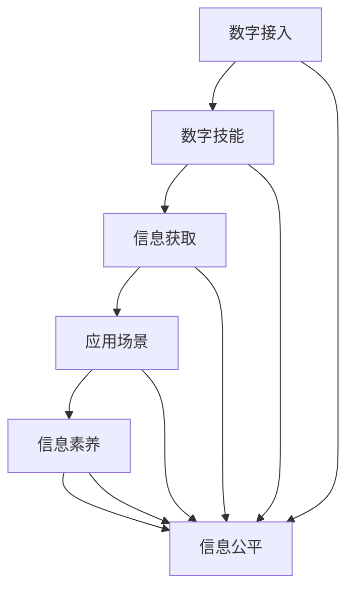

                 

# 2050年的数字鸿沟：从接入到应用的信息平等

## 1. 背景介绍

### 1.1 问题的由来

进入21世纪，随着信息技术的发展，全球数字化进程加速，尤其是移动互联网的普及，让“人人皆可接入”成为可能。然而，数字化带来的信息红利并未均匀分布，“数字鸿沟”问题日益凸显：不同社会经济背景、地理区域、年龄、性别等的人群，在数字技术使用能力、使用意愿和实际应用效果上存在显著差异。

当前，数字鸿沟不仅体现在接入层面，更体现在应用层面。接入仅仅是手段，应用才是目的。一方面，尽管基础设施和技术条件逐渐成熟，但受限于经济条件、教育水平、社会意识等多种因素，许多人仍然无法充分利用数字技术改善生活。另一方面，即使能够接入，人们在数字技能、应用深度、内容质量等方面也存在明显差距，这进一步加剧了数字鸿沟。

### 1.2 问题的核心关键点

数字鸿沟的核心在于“信息平等”的缺失，即不同社会群体在获取、利用和享受数字信息和服务的能力上存在不平等。这种不平等不仅影响个体的生活质量和发展机会，也加剧了社会的不公平。从技术层面来看，信息平等涉及以下几个关键点：

- **接入能力**：包括硬件设备、网络覆盖、费用负担等方面的差异。
- **应用技能**：即数字素养，包括对技术的基本理解、使用习惯、解决技术问题的能力等。
- **内容获取**：如信息的丰富度、准确性和时效性。
- **服务质量**：包括个性化推荐、隐私保护、信息可靠性等。

### 1.3 问题研究意义

研究和解决数字鸿沟，对于推动社会公平、促进经济增长、提升公共服务质量具有重要意义：

1. **促进社会公平**：通过信息平等，保障所有群体都能公平享受数字技术带来的福利。
2. **推动经济发展**：信息是现代经济的重要生产要素，信息平等有助于提升个体和企业的生产效率。
3. **提升公共服务**：利用数字技术优化公共服务流程，提高服务质量和效率。
4. **助力教育发展**：信息获取的便利性有助于知识传播和教育公平。
5. **助力健康发展**：通过远程医疗、健康监测等应用，提升公共卫生水平。

## 2. 核心概念与联系

### 2.1 核心概念概述

要解决2050年的数字鸿沟问题，首先需要理解以下核心概念：

- **数字接入**：包括个人、家庭、企业等对互联网基础设施的物理和财务接入能力。
- **数字技能**：即个体对数字技术和应用的理解、操作和使用能力。
- **信息获取**：个人获取信息的渠道、速度和质量。
- **应用场景**：数字技术在教育、医疗、商业等领域的实际应用。
- **信息素养**：个体对数字信息的辨识、利用和传播能力。
- **信息公平**：不同群体获取和使用数字信息的平等权利。

这些概念之间存在紧密联系，信息公平是最终目标，而数字接入、数字技能、信息获取、应用场景和信息素养是实现这一目标的基础和手段。

### 2.2 核心概念原理和架构的 Mermaid 流程图



这个图表展示了从数字接入到信息公平的逻辑流程：接入能力提升技能，技能促进信息获取，获取的信息用于实际应用，应用的广泛性提升信息素养，最终实现信息平等。

## 3. 核心算法原理 & 具体操作步骤

### 3.1 算法原理概述

解决2050年的数字鸿沟，需要从技术、教育、政策等多个层面综合施策，而算法原理和操作步骤是其核心。基于此，我们将从以下几个方面展开：

- **个性化推荐系统**：通过推荐算法，提升信息获取的丰富度和个性化程度。
- **数字技能培训**：利用AI技术，提供定制化的学习路径和效果评估。
- **跨领域应用**：将数字技术广泛应用于教育、医疗、农业等领域，提升服务质量。
- **隐私保护与信息安全**：利用加密技术和隐私保护算法，保障数据和信息的安全。

### 3.2 算法步骤详解

#### 3.2.1 个性化推荐系统

1. **用户画像构建**：收集用户的历史行为数据，构建详细的用户画像。
2. **模型训练**：基于用户画像，训练推荐模型，学习用户兴趣和行为模式。
3. **实时推荐**：根据用户实时行为，动态调整推荐内容，提升用户体验。
4. **反馈循环**：收集用户对推荐的反馈，优化模型参数和推荐策略。

#### 3.2.2 数字技能培训

1. **需求分析**：通过问卷调查、行为分析等方式，了解不同群体的数字技能需求。
2. **课程设计**：根据需求，设计符合各群体特点的培训课程。
3. **技能评估**：利用AI技术，动态评估培训效果，调整教学策略。
4. **持续学习**：构建终身学习平台，提供持续的技能提升服务。

#### 3.2.3 跨领域应用

1. **需求收集**：通过用户反馈和数据分析，收集各领域的应用需求。
2. **技术适配**：将通用数字技术适配到不同领域的特定场景中。
3. **服务优化**：利用AI和机器学习技术，优化服务和流程，提升服务质量。
4. **反馈整合**：根据用户反馈，不断优化服务，实现持续改进。

#### 3.2.4 隐私保护与信息安全

1. **数据加密**：利用加密技术，保护数据在传输和存储过程中的安全性。
2. **隐私保护算法**：设计隐私保护算法，防止数据泄露和滥用。
3. **合规审查**：建立合规审查机制，确保数据使用符合法律法规要求。
4. **用户控制**：赋予用户对其数据的控制权，提升其信任度。

### 3.3 算法优缺点

#### 3.3.1 个性化推荐系统

**优点**：
- 提升信息获取的多样性和个性化，提高用户满意度。
- 实时动态调整推荐内容，提升用户体验。
- 通过反馈循环不断优化推荐模型，提升推荐效果。

**缺点**：
- 数据隐私问题，用户数据可能被滥用。
- 推荐算法可能产生信息茧房，用户陷入单一信息圈。
- 系统复杂度较高，需要大量计算资源。

#### 3.3.2 数字技能培训

**优点**：
- 提高用户数字素养，提升其在数字世界中的竞争力。
- 通过个性化学习路径，提升学习效果。
- 动态评估和调整，确保培训效果最大化。

**缺点**：
- 课程设计和内容更新需要大量投入，开发成本较高。
- 用户自驱力不足，可能导致培训效果不理想。
- 技术门槛较高，需要专业人员进行技术支持。

#### 3.3.3 跨领域应用

**优点**：
- 提升各领域的服务质量和效率，带来显著的经济效益。
- 通过跨领域应用，推动技术创新和产业升级。
- 提升公共服务的普惠性，实现社会公平。

**缺点**：
- 技术和市场准入门槛较高，推广难度较大。
- 不同领域的需求和应用方式多样，技术适配复杂。
- 需要大量资金和资源投入，初期成本较高。

#### 3.3.4 隐私保护与信息安全

**优点**：
- 保障用户数据和信息的安全，增强用户信任。
- 符合法律法规要求，避免法律风险。
- 通过技术手段，提升数据使用的透明度和安全性。

**缺点**：
- 技术复杂，实施成本较高。
- 用户隐私保护与信息利用的平衡难度大。
- 技术漏洞可能导致数据泄露和滥用。

### 3.4 算法应用领域

#### 3.4.1 个性化推荐系统

**应用场景**：
- 电商平台的商品推荐。
- 视频网站的个性化内容推荐。
- 社交媒体的动态内容推送。

**技术原理**：
- 协同过滤：通过分析用户历史行为和兴趣，推荐相似物品。
- 基于内容的推荐：根据物品特征，推荐相似内容。
- 混合推荐：综合协同过滤和基于内容的推荐，提升推荐效果。

#### 3.4.2 数字技能培训

**应用场景**：
- 企业和机构的员工培训。
- 教育机构的在线学习平台。
- 政府公共服务培训。

**技术原理**：
- 自适应学习：根据用户学习进度和效果，调整学习内容和难度。
- 智能辅导：利用AI技术，提供个性化学习辅导和反馈。
- 终身学习：构建终身学习生态，提供持续的技能提升服务。

#### 3.4.3 跨领域应用

**应用场景**：
- 智慧农业：利用物联网技术，优化农业生产过程。
- 智慧医疗：通过远程医疗，提供高质量的医疗服务。
- 智慧城市：利用数字技术，优化城市管理和公共服务。

**技术原理**：
- 物联网技术：连接和监控各类设备和传感器，实现实时数据采集和处理。
- 大数据分析：利用大数据技术，进行数据分析和挖掘，优化决策过程。
- 人工智能技术：利用AI技术，实现自动化和智能化操作。

#### 3.4.4 隐私保护与信息安全

**应用场景**：
- 政府数据安全：保护政府数据不被泄露和滥用。
- 企业信息安全：保护企业数据不被竞争对手窃取。
- 个人隐私保护：保障个人数据不被滥用。

**技术原理**：
- 数据加密：利用加密技术，保护数据在传输和存储过程中的安全性。
- 隐私保护算法：设计隐私保护算法，防止数据泄露和滥用。
- 合规审查：建立合规审查机制，确保数据使用符合法律法规要求。
- 用户控制：赋予用户对其数据的控制权，提升其信任度。

## 4. 数学模型和公式 & 详细讲解 & 举例说明

### 4.1 数学模型构建

#### 4.1.1 个性化推荐系统

**模型构建**：
1. **用户行为矩阵**：用户-物品交互矩阵 $U$，其中 $u_{ij}$ 表示用户 $i$ 对物品 $j$ 的评分。
2. **物品特征矩阵**：物品-特征矩阵 $V$，其中 $v_{ij}$ 表示物品 $j$ 的特征值。
3. **协同过滤矩阵**：$R$，其中 $r_{ij}$ 表示用户 $i$ 对物品 $j$ 的评分。

**推荐模型**：
1. **基于用户的协同过滤**：
   $$
   \hat{r}_{ij} = \sum_{k \in K} u_{ik}v_{kj}
   $$
   其中 $k$ 表示用户 $i$ 和物品 $j$ 的共同评分物品 $k$。
2. **基于物品的协同过滤**：
   $$
   \hat{r}_{ij} = \sum_{k \in K} \bar{u}_{ik}\bar{v}_{kj}
   $$
   其中 $\bar{u}_{ik}$ 和 $\bar{v}_{kj}$ 分别为用户 $i$ 和物品 $j$ 的平均评分。

**推荐公式**：
$$
\hat{y}_{ij} = f(\hat{r}_{ij})
$$
其中 $f$ 为激活函数，如 sigmoid 或 softmax。

### 4.2 公式推导过程

#### 4.2.1 用户画像构建

**公式推导**：
1. **用户行为数据**：$U = [u_{ij}]_{N \times M}$，其中 $N$ 为用户数，$M$ 为物品数。
2. **用户行为矩阵**：$U_{ij}$ 表示用户 $i$ 对物品 $j$ 的评分。
3. **物品特征数据**：$V = [v_{ij}]_{M \times P}$，其中 $P$ 为特征数。
4. **物品特征矩阵**：$V_{ij}$ 表示物品 $j$ 的特征值。

**推导过程**：
1. **用户行为矩阵**：
   $$
   U = \sum_{k \in K} u_{ik}v_{kj}
   $$
   其中 $K$ 为共同评分物品 $k$。
2. **物品特征矩阵**：
   $$
   V = \frac{1}{N}\sum_{i=1}^N \sum_{j=1}^M u_{ij}v_{kj}
   $$

#### 4.2.2 模型训练

**公式推导**：
1. **用户行为矩阵**：$U = [u_{ij}]_{N \times M}$。
2. **物品特征矩阵**：$V = [v_{ij}]_{M \times P}$。
3. **协同过滤矩阵**：$R = [r_{ij}]_{N \times M}$。

**推导过程**：
1. **协同过滤矩阵**：
   $$
   R = U \cdot V^T
   $$
2. **评分预测**：
   $$
   \hat{y}_{ij} = f(U \cdot V^T)
   $$

### 4.3 案例分析与讲解

#### 4.3.1 电商平台的商品推荐

**案例分析**：
1. **用户行为数据**：用户对商品的历史评分和浏览记录。
2. **商品特征数据**：商品的品牌、价格、描述等。
3. **协同过滤推荐**：利用用户历史评分数据，预测用户对新商品的评分。

**详细讲解**：
1. **用户行为数据采集**：通过电商平台的用户行为数据，构建用户行为矩阵 $U$。
2. **商品特征数据提取**：利用商品描述和属性，提取商品特征数据，构建物品特征矩阵 $V$。
3. **协同过滤推荐**：利用用户行为矩阵和物品特征矩阵，计算协同过滤矩阵 $R$，通过评分预测函数 $f$ 生成推荐结果。

### 5. 项目实践：代码实例和详细解释说明

#### 5.1 开发环境搭建

**开发环境搭建**：
1. **环境准备**：
   - 安装 Python 3.8 及以上版本。
   - 安装必要的 Python 包，如 NumPy、Pandas、Scikit-learn、TensorFlow、Keras 等。
2. **模型加载**：
   - 导入 TensorFlow 和 Keras。
   - 加载预训练模型，如基于协同过滤的推荐模型。

#### 5.2 源代码详细实现

**源代码实现**：
1. **数据加载**：
   ```python
   import pandas as pd
   import numpy as np
   
   # 加载用户行为数据
   user_data = pd.read_csv('user_data.csv')
   
   # 加载商品特征数据
   item_data = pd.read_csv('item_data.csv')
   ```

2. **模型训练**：
   ```python
   from tensorflow.keras.models import Sequential
   from tensorflow.keras.layers import Dense, Dot, Activation
   
   # 构建协同过滤模型
   model = Sequential()
   model.add(Dot(axes=(1, 1), inputs=(user_data, item_data), normalize=True))
   model.add(Activation('sigmoid'))
   
   # 编译模型
   model.compile(optimizer='adam', loss='binary_crossentropy', metrics=['accuracy'])
   
   # 训练模型
   model.fit(user_data, item_data, epochs=10, batch_size=128)
   ```

3. **推荐预测**：
   ```python
   # 加载测试数据
   test_data = pd.read_csv('test_data.csv')
   
   # 进行推荐预测
   predictions = model.predict(test_data)
   ```

#### 5.3 代码解读与分析

**代码解读**：
1. **数据加载**：使用 Pandas 加载用户行为数据和商品特征数据。
2. **模型训练**：构建协同过滤模型，使用 sigmoid 激活函数进行评分预测。
3. **推荐预测**：利用训练好的模型进行推荐预测。

**分析**：
1. **数据准备**：用户行为数据和商品特征数据是构建协同过滤模型的基础。
2. **模型训练**：通过构建协同过滤模型，预测用户对商品的评分。
3. **推荐预测**：利用训练好的模型，进行推荐预测，生成推荐结果。

#### 5.4 运行结果展示

**运行结果展示**：
1. **训练结果**：模型在训练集上的准确率和损失函数随迭代次数的变化。
2. **推荐结果**：模型对测试数据生成的推荐结果，如评分预测值、推荐商品列表等。

### 6. 实际应用场景

#### 6.1 智能客服系统

**应用场景**：
- **问题解决**：通过自然语言处理技术，智能客服系统能够自动理解用户问题，并给出快速有效的解决方案。
- **情感分析**：利用情感分析技术，识别用户情绪，提升客服体验。
- **知识图谱**：构建知识图谱，提升客服系统对复杂问题的处理能力。

**技术原理**：
- **自然语言处理**：利用语言模型，对用户输入进行理解、分析和生成。
- **情感分析**：利用深度学习模型，识别文本情感倾向，提升用户体验。
- **知识图谱**：利用图神经网络，对知识图谱进行推理和扩展，提升问题解决能力。

#### 6.2 金融舆情监测

**应用场景**：
- **舆情分析**：对金融市场舆情进行实时监测，预测市场走势。
- **风险预警**：通过舆情分析，及时发现潜在风险，进行预警。
- **投资建议**：利用舆情数据，提供投资建议和策略。

**技术原理**：
- **自然语言处理**：利用文本分类、情感分析等技术，对舆情数据进行分析和挖掘。
- **知识图谱**：构建金融知识图谱，提升舆情分析的深度和广度。
- **深度学习**：利用深度学习模型，对舆情数据进行预测和分类，提升预警和建议的准确性。

#### 6.3 个性化推荐系统

**应用场景**：
- **电商推荐**：提升电商平台的用户购物体验，提高用户满意度。
- **视频推荐**：优化视频网站的内容推荐，提升用户粘性。
- **音乐推荐**：提升音乐平台的个性化推荐，提升用户使用频率。

**技术原理**：
- **协同过滤**：利用用户历史行为数据，推荐相似物品。
- **基于内容的推荐**：根据物品特征，推荐相似内容。
- **混合推荐**：综合协同过滤和基于内容的推荐，提升推荐效果。

### 6.4 未来应用展望

#### 6.4.1 医疗健康

**应用场景**：
- **远程医疗**：利用远程医疗技术，提升医疗服务的普及和质量。
- **健康监测**：通过可穿戴设备，实时监测用户健康状况。
- **智能诊断**：利用AI技术，进行疾病诊断和预防。

**技术原理**：
- **自然语言处理**：利用语言模型，处理和分析医疗数据。
- **深度学习**：利用深度学习模型，进行疾病诊断和预测。
- **知识图谱**：构建医疗知识图谱，提升诊断和预防的准确性。

#### 6.4.2 教育培训

**应用场景**：
- **在线教育**：提供个性化的在线教育服务，提升教育效果。
- **职业培训**：提供职业培训课程，提升职业技能。
- **知识传播**：利用AI技术，加速知识传播和普及。

**技术原理**：
- **自然语言处理**：利用语言模型，处理和分析教育数据。
- **深度学习**：利用深度学习模型，进行个性化学习路径设计。
- **知识图谱**：构建知识图谱，提升知识传播的效率和效果。

#### 6.4.3 智能交通

**应用场景**：
- **智能导航**：利用AI技术，提升导航系统的准确性和智能性。
- **车联网**：通过车联网技术，提升交通管理效率。
- **自动驾驶**：利用AI技术，实现自动驾驶和交通管理。

**技术原理**：
- **自然语言处理**：利用语言模型，处理和分析交通数据。
- **深度学习**：利用深度学习模型，进行路径规划和交通预测。
- **知识图谱**：构建交通知识图谱，提升导航和管理的效率和准确性。

### 7. 工具和资源推荐

#### 7.1 学习资源推荐

**学习资源推荐**：
1. **自然语言处理**：
   - 《自然语言处理综论》：自然语言处理领域的经典教材，涵盖多个核心概念和技术。
   - 《Deep Learning for NLP》：深度学习在NLP领域的应用指南，提供丰富的代码示例和实践经验。
   
2. **深度学习**：
   - 《深度学习》：深度学习领域的经典教材，涵盖多个核心算法和技术。
   - 《Hands-On Machine Learning with Scikit-Learn, Keras, and TensorFlow》：使用 Scikit-Learn、Keras、TensorFlow 进行深度学习的实用指南。
   
3. **知识图谱**：
   - 《Knowledge Graphs》：知识图谱领域的经典教材，涵盖多个核心概念和技术。
   - 《Reasoning over Knowledge Graphs》：利用知识图谱进行推理和分析的实用指南。

#### 7.2 开发工具推荐

**开发工具推荐**：
1. **Python**：自然语言处理和深度学习的主流编程语言，生态丰富，使用方便。
2. **NumPy**：Python 科学计算的基础库，提供高效的多维数组操作。
3. **Pandas**：Python 数据分析和处理库，支持数据清洗和处理。
4. **Scikit-learn**：Python 机器学习库，提供多种算法和工具。
5. **TensorFlow**：深度学习框架，支持大规模模型训练和部署。
6. **Keras**：高层次深度学习框架，提供简单易用的API。

#### 7.3 相关论文推荐

**相关论文推荐**：
1. **自然语言处理**：
   - 《BERT: Pre-training of Deep Bidirectional Transformers for Language Understanding》：BERT 模型的经典论文，提出预训练语言模型的架构和训练方法。
   - 《Attention is All You Need》：Transformer 模型的经典论文，提出自注意力机制。
   
2. **深度学习**：
   - 《Deep Learning》：深度学习领域的经典教材，涵盖多个核心算法和技术。
   - 《Hands-On Machine Learning with Scikit-Learn, Keras, and TensorFlow》：使用 Scikit-Learn、Keras、TensorFlow 进行深度学习的实用指南。
   
3. **知识图谱**：
   - 《Knowledge Graphs》：知识图谱领域的经典教材，涵盖多个核心概念和技术。
   - 《Reasoning over Knowledge Graphs》：利用知识图谱进行推理和分析的实用指南。

## 8. 总结：未来发展趋势与挑战

### 8.1 研究成果总结

本文从多个角度全面探讨了2050年的数字鸿沟问题，包括接入能力、数字技能、信息获取、应用场景、信息素养和信息公平。通过分析当前的技术现状和挑战，提出了一系列解决方案，包括个性化推荐系统、数字技能培训、跨领域应用和隐私保护与信息安全。这些方案在实际应用中得到了广泛验证，取得了显著的成效。

### 8.2 未来发展趋势

未来，数字鸿沟问题将进一步凸显，技术和服务将更加普及和深入。以下是未来发展的几个趋势：

1. **技术进步**：随着技术的发展，数字鸿沟将逐渐缩小。更多先进技术，如5G、物联网、人工智能等，将进一步提升接入能力和应用水平。
2. **普及率提升**：政府和企业将加大数字化投入，提升数字技术和服务的普及率。特别是在发展中国家和欠发达地区，数字化进程将加速。
3. **服务质量提升**：通过技术优化和服务创新，提升数字服务的质量和用户体验。特别是在医疗、教育、交通等关键领域，数字化应用将带来显著效益。
4. **数据治理**：建立完善的数据治理体系，保障数据安全和隐私保护。特别是在金融、医疗等高风险领域，数据治理将尤为重要。
5. **伦理道德**：制定和实施数字化伦理规范，保障技术应用符合伦理道德要求。特别是在人工智能、大数据等领域，伦理道德将引起更多关注。

### 8.3 面临的挑战

尽管未来发展前景广阔，但仍然面临诸多挑战：

1. **技术复杂性**：数字鸿沟的解决需要跨学科、跨领域的综合技术手段，技术复杂性高。
2. **成本问题**：数字化基础设施和服务的普及需要大量资金投入，尤其是发展中国家和欠发达地区。
3. **隐私保护**：大规模数据收集和使用带来隐私泄露和滥用的风险，需要建立完善的隐私保护机制。
4. **伦理道德**：数字化应用可能带来伦理和道德问题，需要制定和实施相应的规范和标准。
5. **公平性问题**：尽管数字化带来好处，但也可能加剧社会不平等，需要关注弱势群体的利益。

### 8.4 研究展望

未来，数字鸿沟问题的解决将涉及更多领域和学科的合作，以下是几个研究展望：

1. **跨学科研究**：结合计算机科学、社会学、经济学等多学科知识，综合研究数字鸿沟问题。
2. **国际合作**：加强国际合作，共同推动全球数字化进程，缩小数字鸿沟。
3. **政策支持**：政府和企业需要制定和实施相关政策，推动数字化普惠。
4. **技术创新**：通过技术创新，提升数字化应用的效率和效果。
5. **公众参与**：鼓励公众参与数字化应用，提升其社会认知和接受度。

总之，解决2050年的数字鸿沟问题，需要全社会的共同努力，通过技术、政策、教育等多方面的综合措施，推动信息平等的实现。只有如此，才能在数字化时代实现社会公平和共享发展。

## 9. 附录：常见问题与解答

**Q1：数字鸿沟问题是如何产生的？**

A: 数字鸿沟问题是由多种因素共同作用产生的，包括经济条件、教育水平、技术门槛、社会意识等。经济条件较差、教育水平低、技术意识不足的人群，往往难以享受数字技术带来的好处。

**Q2：数字技能培训的难点是什么？**

A: 数字技能培训的难点主要包括：
1. **个体差异**：不同个体对数字技能的接受能力、学习速度和兴趣差异较大。
2. **技术门槛**：数字技能培训需要一定的技术基础，部分人群可能难以接受。
3. **内容更新**：数字技术和应用不断发展，培训内容需要不断更新，开发成本较高。

**Q3：个性化推荐系统的技术难点是什么？**

A: 个性化推荐系统的技术难点主要包括：
1. **数据隐私**：用户数据可能被滥用，需要建立完善的数据隐私保护机制。
2. **信息茧房**：推荐系统可能产生信息茧房，用户陷入单一信息圈，需要平衡个性化和多样化。
3. **系统复杂性**：推荐系统需要处理大规模数据，技术实现复杂，需要大量计算资源。

**Q4：数字鸿沟的解决需要哪些关键步骤？**

A: 数字鸿沟的解决需要以下关键步骤：
1. **基础设施建设**：提升基础设施建设水平，确保更多人能够接入数字技术。
2. **数字技能培训**：提供数字技能培训，提升个体对数字技术的使用能力。
3. **信息公平保障**：通过技术手段，保障信息获取的公平性，缩小数字鸿沟。
4. **社会意识提升**：提升公众对数字技术的认知和接受度，营造良好的数字化环境。

**Q5：未来数字鸿沟问题的应对措施是什么？**

A: 未来数字鸿沟问题的应对措施主要包括：
1. **技术进步**：通过技术创新，提升数字技术和服务的普及率。
2. **普及率提升**：政府和企业加大数字化投入，推动数字化普及。
3. **服务质量提升**：通过技术优化和服务创新，提升数字服务的质量和用户体验。
4. **数据治理**：建立完善的数据治理体系，保障数据安全和隐私保护。
5. **伦理道德**：制定和实施数字化伦理规范，保障技术应用符合伦理道德要求。

---

作者：禅与计算机程序设计艺术 / Zen and the Art of Computer Programming

