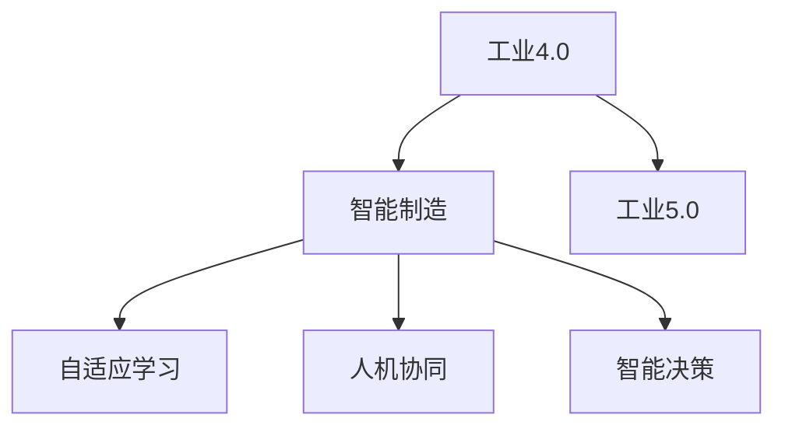

                 

## 1. 背景介绍

### 1.1 问题由来
随着第四次工业革命的到来，即工业4.0的兴起，制造业正经历着前所未有的变革。智能化、信息化、自动化成为主流趋势，传统的“以人为主”的生产模式正逐渐被“以机器为主”的智能制造所取代。这一转变极大地提升了生产效率、降低了成本，并推动了产业结构的升级。然而，工业4.0的发展也面临诸多挑战，如数据孤岛、智能制造系统复杂性高、缺乏标准化等。

为了进一步推动制造业向更深层次的智能化方向发展，业界提出了工业5.0的概念，即“智能制造的智能”。工业5.0旨在通过深入融合人工智能、大数据、物联网、云计算等前沿技术，构建更加灵活、高效、可持续的智能制造体系，实现人机协同、数据驱动的智能制造目标。

### 1.2 问题核心关键点
工业5.0的核心在于利用人工智能技术，构建自适应、自学习的智能制造系统。其关键点包括：
- 智能化生产：通过人工智能算法优化生产流程，提高生产效率和产品质量。
- 智能运维：利用预测性维护和大数据分析，降低设备故障率，延长设备使用寿命。
- 智能决策：通过数据驱动的决策支持系统，提升企业战略决策的科学性和精确性。
- 人机协同：通过智能交互技术，实现人与机器的深度融合，提升整体生产效率。
- 自适应学习：使系统具备自我学习的能力，随着环境变化不断优化自身行为。

这些关键点共同构成了工业5.0的目标框架，推动制造业向更加智能化、数字化、个性化方向发展。

### 1.3 问题研究意义
研究工业5.0智能制造升级，对推动制造业转型升级、提升国际竞争力具有重要意义：

1. 加速产业升级。工业5.0通过智能化改造，可大幅提升生产效率，降低成本，推动制造业向高附加值方向发展。
2. 提高产品质量。智能化生产使得设备与过程的精准度大幅提升，生产的产品质量和一致性得以保证。
3. 提升企业运营效率。通过智能决策和运维，企业运营变得更加高效，响应市场变化的速度更快。
4. 促进可持续发展。智能制造体系能够实现资源的最优配置和循环利用，减少环境污染，实现可持续发展。
5. 赋能产业创新。智能化生产方式为新技术、新工艺、新材料的应用提供了新的可能，推动行业创新发展。

## 2. 核心概念与联系

### 2.1 核心概念概述

为更好地理解工业5.0的智能制造升级，本节将介绍几个密切相关的核心概念：

- 工业4.0: 指基于信息技术、物联网、大数据、云计算等技术的数字化制造，使生产过程更加智能化、信息化。
- 工业5.0: 在工业4.0的基础上，进一步融合人工智能、机器学习等技术，实现更加智能、高效、可持续的智能制造体系。
- 智能制造: 指通过数字化、网络化、智能化技术，实现从设计、生产、运维到服务等全生命周期的智能化管理。
- 自适应学习: 指系统根据环境变化和反馈信息，自动调整和优化自身行为，以适应新环境的能力。
- 人机协同: 指通过智能交互技术，使机器能够理解和执行人类的指令，实现人与机器的深度融合。
- 智能决策: 指基于数据分析和机器学习，实现决策过程的自动化和智能化，提升决策的科学性和精确性。

这些核心概念之间的逻辑关系可以通过以下Mermaid流程图来展示：



这个流程图展示了几类关键概念之间的联系：

1. 工业4.0通过数字化、信息化技术，奠定了智能制造的基础。
2. 工业5.0在工业4.0的基础上，进一步融合人工智能技术，推动智能制造向更高层次发展。
3. 智能制造通过智能化手段，提升生产效率和产品质量。
4. 自适应学习使系统具备自我优化的能力，适应新环境和新需求。
5. 人机协同实现人与机器的深度融合，提升整体生产效率。
6. 智能决策通过数据分析和机器学习，提升决策的科学性和精确性。

这些概念共同构成了工业5.0的目标框架，推动制造业向更加智能化、数字化、个性化方向发展。

## 3. 核心算法原理 & 具体操作步骤

### 3.1 算法原理概述

工业5.0智能制造的核心在于利用人工智能技术，构建自适应、自学习的智能制造系统。其核心算法原理主要包括以下几个方面：

- 数据驱动: 利用大数据技术，实时采集和处理生产过程中产生的海量数据，为智能决策提供数据支持。
- 智能优化: 通过优化算法（如遗传算法、神经网络、强化学习等），对生产流程进行优化，提高生产效率。
- 预测性维护: 利用预测性分析和大数据技术，预测设备故障，提前进行维护，降低设备故障率。
- 自适应学习: 通过机器学习算法，使系统能够根据新数据和新环境，自我调整和优化，提升系统的灵活性和适应性。
- 人机交互: 通过自然语言处理、计算机视觉等技术，实现人与机器的深度交互，提升生产效率和质量。

### 3.2 算法步骤详解

工业5.0智能制造的实现步骤包括以下几个关键环节：

**Step 1: 数据采集与集成**
- 利用物联网技术，采集生产过程中各个环节的实时数据。
- 利用大数据技术，对采集到的数据进行清洗、集成和存储。

**Step 2: 数据处理与分析**
- 对清洗后的数据进行预处理，包括数据去噪、特征提取等。
- 利用机器学习算法，对数据进行分析和建模，提取生产过程的关键特征。

**Step 3: 智能决策与控制**
- 基于数据分析和机器学习，构建智能决策系统，实现生产过程的自动优化。
- 利用控制系统，对生产流程进行实时调整和控制，确保生产过程的稳定性和高效性。

**Step 4: 预测性维护与运维优化**
- 利用预测性分析算法，对设备进行故障预测和维护，延长设备使用寿命。
- 利用大数据分析技术，优化设备运维流程，降低运维成本。

**Step 5: 自适应学习与持续改进**
- 利用自适应学习算法，使系统能够根据新数据和新环境，不断优化自身行为。
- 利用反馈机制，持续改进系统性能，提升系统适应性和灵活性。

### 3.3 算法优缺点

工业5.0智能制造的算法具有以下优点：
1. 效率高: 通过数据驱动和智能优化，生产效率和产品质量得到显著提升。
2. 成本低: 预测性维护和自适应学习技术，降低了设备故障率，延长了设备使用寿命。
3. 灵活性高: 自适应学习和智能决策系统，使系统能够适应新环境和需求。
4. 自动化程度高: 自动化控制和智能决策，降低了人工干预的需求，提升了生产自动化水平。

同时，这些算法也存在一定的局限性：
1. 数据依赖: 系统的智能化和决策准确性，高度依赖于数据的质量和完整性。
2. 技术复杂: 需要综合运用大数据、机器学习、自然语言处理等前沿技术，技术难度较高。
3. 资源需求大: 智能制造系统需要强大的计算和存储能力，对硬件设施要求较高。
4. 隐私与安全问题: 数据采集与处理过程中可能涉及隐私和安全问题，需加强数据保护措施。

尽管存在这些局限性，但就目前而言，工业5.0智能制造的算法仍是大规模智能制造升级的重要范式。未来相关研究的重点在于如何进一步降低技术复杂度，提高数据利用效率，加强数据安全保护，从而实现更加高效、灵活、安全的智能制造体系。

### 3.4 算法应用领域

工业5.0智能制造的算法已经在多个领域得到广泛应用，例如：

- 智能工厂: 通过数据驱动和智能优化，实现生产过程的自动化和智能化。
- 智能仓储: 利用智能决策和预测性维护，提升仓储管理和物流效率。
- 智能机器人: 利用自适应学习和人机协同技术，实现机器人的自主决策和执行。
- 智能设备维护: 利用预测性分析和大数据技术，实现设备的自主诊断和维护。
- 智能供应链管理: 通过智能决策和数据分析，优化供应链管理，提升运营效率。

除了这些经典应用外，工业5.0智能制造的算法还被创新性地应用到更多领域中，如智能客服、智能设计、智能生产调度等，为智能制造的发展带来了新的突破。

## 4. 数学模型和公式 & 详细讲解 & 举例说明

### 4.1 数学模型构建

工业5.0智能制造的算法涉及多个数学模型，包括线性回归、决策树、支持向量机、深度学习等。

假设生产过程中有 $N$ 个样本，每个样本包含 $D$ 个特征 $x_i=(x_{i1},x_{i2},...,x_{iD})$，对应的生产结果 $y_i$。我们可以构建以下数学模型：

1. 线性回归模型：$y_i=\beta_0+\sum_{j=1}^D \beta_j x_{ij}+\epsilon_i$，其中 $\beta_j$ 为回归系数，$\epsilon_i$ 为误差项。
2. 决策树模型：构建一棵决策树，根据特征对生产结果进行分类。
3. 支持向量机模型：通过最大化间隔，构建分类边界，实现分类任务。
4. 深度学习模型：利用神经网络结构，通过多层非线性变换，学习特征表示，实现复杂分类任务。

### 4.2 公式推导过程

以线性回归模型为例，推导其最小二乘解过程。

假设样本集 $D=\{(x_i,y_i)\}_{i=1}^N$，线性回归模型为 $y_i=\beta_0+\sum_{j=1}^D \beta_j x_{ij}+\epsilon_i$。最小二乘解的目标是最小化误差项的平方和：

$$
\min_{\beta_0,\beta_j} \sum_{i=1}^N (y_i-\beta_0-\sum_{j=1}^D \beta_j x_{ij})^2
$$

利用矩阵形式，可以将上述目标函数表示为：

$$
\min_{\beta_0,\beta_j} \frac{1}{2} \sum_{i=1}^N (y_i-\beta_0-\sum_{j=1}^D \beta_j x_{ij})^2
$$

利用正规方程组求解，可以得到最小二乘解：

$$
\hat{\beta_0}, \hat{\beta_j} = (X^TX)^{-1}X^Ty
$$

其中 $X=\begin{bmatrix} 1 & x_{11} & x_{12} & ... & x_{1D} \\ 1 & x_{21} & x_{22} & ... & x_{2D} \\ ... & ... & ... & ... & ... \\ 1 & x_{N1} & x_{N2} & ... & x_{ND} \end{bmatrix}$，$y=\begin{bmatrix} y_1 \\ y_2 \\ ... \\ y_N \end{bmatrix}$。

### 4.3 案例分析与讲解

以某制造企业的智能工厂为例，分析如何使用线性回归模型进行生产优化。

假设该工厂生产过程中，有 $N=100$ 个样本，每个样本包含 $D=5$ 个特征 $x_i=(x_{i1},x_{i2},x_{i3},x_{i4},x_{i5})$，对应的生产结果 $y_i$。利用线性回归模型对生产结果进行预测，得到最小二乘解 $\hat{\beta_0}, \hat{\beta_j}$。通过将线性回归模型应用到生产过程中，可以实时调整生产参数，优化生产流程，提高生产效率和产品质量。

## 5. 项目实践：代码实例和详细解释说明

### 5.1 开发环境搭建

在进行智能制造项目开发前，我们需要准备好开发环境。以下是使用Python进行PyTorch开发的环境配置流程：

1. 安装Anaconda：从官网下载并安装Anaconda，用于创建独立的Python环境。

2. 创建并激活虚拟环境：
```bash
conda create -n pytorch-env python=3.8 
conda activate pytorch-env
```

3. 安装PyTorch：根据CUDA版本，从官网获取对应的安装命令。例如：
```bash
conda install pytorch torchvision torchaudio cudatoolkit=11.1 -c pytorch -c conda-forge
```

4. 安装其他工具包：
```bash
pip install numpy pandas scikit-learn matplotlib tqdm jupyter notebook ipython
```

完成上述步骤后，即可在`pytorch-env`环境中开始智能制造项目开发。

### 5.2 源代码详细实现

下面我们以某智能工厂的生产优化为例，给出使用PyTorch进行线性回归模型训练的PyTorch代码实现。

首先，定义线性回归模型的训练函数：

```python
import torch
import torch.nn as nn
import torch.optim as optim

class LinearRegression(nn.Module):
    def __init__(self, input_dim, output_dim):
        super(LinearRegression, self).__init__()
        self.linear = nn.Linear(input_dim, output_dim)

    def forward(self, x):
        out = self.linear(x)
        return out

# 训练函数
def train(model, train_x, train_y, test_x, test_y, epochs, batch_size, learning_rate):
    model.train()
    criterion = nn.MSELoss()
    optimizer = optim.SGD(model.parameters(), lr=learning_rate, batch_size=batch_size)

    for epoch in range(epochs):
        for i in range(0, len(train_x), batch_size):
            inputs = torch.from_numpy(train_x[i:i+batch_size, :]).float()
            targets = torch.from_numpy(train_y[i:i+batch_size, :]).float()
            optimizer.zero_grad()
            outputs = model(inputs)
            loss = criterion(outputs, targets)
            loss.backward()
            optimizer.step()

    model.eval()
    with torch.no_grad():
        predictions = model(test_x).detach().numpy()
        test_loss = criterion(model(test_x), test_y).item()
        return predictions, test_loss
```

然后，定义训练数据和模型参数：

```python
import numpy as np

# 生成随机训练数据
train_x = np.random.randn(100, 5)
train_y = np.dot(train_x, np.array([0.1, 0.2, 0.3, 0.4, 0.5])) + 1
test_x = np.random.randn(100, 5)
test_y = np.dot(test_x, np.array([0.1, 0.2, 0.3, 0.4, 0.5])) + 1

# 定义模型和训练参数
input_dim = train_x.shape[1]
output_dim = train_y.shape[1]
model = LinearRegression(input_dim, output_dim)
train_epochs = 100
batch_size = 10
learning_rate = 0.01
```

接着，调用训练函数进行模型训练：

```python
predictions, test_loss = train(model, train_x, train_y, test_x, test_y, train_epochs, batch_size, learning_rate)
print('Test Loss: {:.4f}'.format(test_loss))
```

以上就是使用PyTorch对线性回归模型进行智能制造生产优化的完整代码实现。可以看到，借助PyTorch库，训练和推理过程变得简单易懂，便于开发和部署。

### 5.3 代码解读与分析

让我们再详细解读一下关键代码的实现细节：

**LinearRegression类**：
- `__init__`方法：初始化模型，定义线性层。
- `forward`方法：定义前向传播过程，将输入数据输入线性层，得到输出。

**train函数**：
- 定义损失函数、优化器等关键组件。
- 利用SGD优化算法，对模型进行训练，不断迭代更新模型参数。
- 在测试集上评估模型性能，输出预测结果和测试损失。

**训练数据和模型参数**：
- 使用NumPy生成随机训练和测试数据。
- 定义模型结构，包括输入维度和输出维度。
- 设置训练轮数、批大小和学习率等关键参数。

**调用训练函数**：
- 训练函数返回模型在测试集上的预测结果和测试损失，供后续分析使用。

可以看到，PyTorch库为智能制造项目提供了便捷的数学模型实现工具，使得模型训练和评估过程变得简单高效。开发者可以专注于算法的创新和优化，而不必过多关注底层的实现细节。

当然，在实际应用中，还需要考虑更多因素，如模型的保存和部署、超参数的自动搜索、更灵活的任务适配层等。但核心的训练过程基本与此类似。

## 6. 实际应用场景

### 6.1 智能工厂

基于线性回归等算法，智能工厂可以实现生产过程的优化。通过实时采集生产过程中的各种数据，利用线性回归模型对生产结果进行预测和优化，能够显著提高生产效率和产品质量。

在技术实现上，可以使用数据采集设备如传感器、摄像头等，实时采集生产过程中的温度、湿度、压力等关键参数。利用数据清洗和特征提取技术，将这些参数转化为适合机器学习的格式。最后，通过线性回归模型对这些参数进行建模和优化，得到生产过程的优化方案。

### 6.2 智能仓储

利用智能决策和预测性维护算法，智能仓储可以实现物流效率的提升。通过实时采集仓储管理数据，如货物位置、库存量、订单信息等，利用机器学习算法对数据进行分析和建模，实现仓储管理和物流调度的高效化和智能化。

在技术实现上，可以使用RFID、条形码等技术，实时采集仓储管理数据。利用数据清洗和特征提取技术，将这些数据转化为适合机器学习的格式。最后，通过智能决策算法对数据进行分析和建模，得到仓储管理的高效方案。

### 6.3 智能设备维护

基于预测性维护算法，智能设备可以实现自主诊断和维护。通过实时采集设备运行数据，如振动、温度、电流等，利用预测性维护算法对设备进行故障预测和维护，延长设备使用寿命，降低维护成本。

在技术实现上，可以使用传感器等技术，实时采集设备运行数据。利用数据清洗和特征提取技术，将这些数据转化为适合机器学习的格式。最后，通过预测性维护算法对数据进行分析和建模，得到设备故障预测和维护方案。

### 6.4 未来应用展望

随着智能制造的不断发展，基于算法和数据的智能制造系统将变得更加普及和高效。未来，基于工业5.0的智能制造系统将在更多领域得到应用，为工业智能化带来新的突破。

在智慧医疗领域，基于智能制造的智能医疗器械将大幅提升医疗效率，改善医疗服务质量。例如，智能化的手术机器人、智能诊断系统等，将为医生提供更精准、更高效的工具，提升医疗水平。

在智能交通领域，基于智能制造的智能交通系统将实现高效、安全的交通管理。例如，智能化的交通管理系统、自动驾驶车辆等，将提升交通效率，减少交通事故。

在智能家居领域，基于智能制造的智能家居系统将实现更便捷、更舒适的居住环境。例如，智能化的家庭设备管理系统、智能家居控制中心等，将提升家庭生活质量。

此外，在智能城市治理、智能农业、智能教育等领域，基于智能制造的智能系统也将带来新的变革。

## 7. 工具和资源推荐

### 7.1 学习资源推荐

为了帮助开发者系统掌握工业5.0智能制造的理论基础和实践技巧，这里推荐一些优质的学习资源：

1. 《深度学习》书籍：Ian Goodfellow、Yoshua Bengio 和 Aaron Courville 合著，全面介绍了深度学习的基本概念和前沿技术。
2. 《机器学习实战》书籍：Peter Harrington 著，通过大量实例演示了机器学习算法在实际中的应用。
3. 《Python数据科学手册》书籍：Jake VanderPlas 著，全面介绍了Python数据科学库的使用方法和应用场景。
4. Coursera的机器学习课程：由斯坦福大学教授 Andrew Ng 主讲的机器学习课程，涵盖机器学习算法和应用。
5. Kaggle数据科学竞赛平台：全球最大的数据科学竞赛平台，提供大量数据集和竞赛任务，帮助开发者实践机器学习算法。

通过对这些资源的学习实践，相信你一定能够快速掌握工业5.0智能制造的算法和工具，并用于解决实际的智能制造问题。

### 7.2 开发工具推荐

高效的开发离不开优秀的工具支持。以下是几款用于工业5.0智能制造开发的常用工具：

1. PyTorch：基于Python的开源深度学习框架，灵活动态的计算图，适合快速迭代研究。
2. TensorFlow：由Google主导开发的开源深度学习框架，生产部署方便，适合大规模工程应用。
3. Scikit-learn：Python机器学习库，提供了多种机器学习算法和工具函数。
4. Pandas：Python数据分析库，提供数据清洗、处理和分析功能。
5. Jupyter Notebook：交互式的数据科学平台，支持多种编程语言和库。
6. Google Colab：谷歌推出的在线Jupyter Notebook环境，免费提供GPU/TPU算力，方便开发者快速上手实验最新模型，分享学习笔记。

合理利用这些工具，可以显著提升智能制造项目的开发效率，加快创新迭代的步伐。

### 7.3 相关论文推荐

工业5.0智能制造的发展源于学界的持续研究。以下是几篇奠基性的相关论文，推荐阅读：

1. Artificial Neural Networks: Architectures, Learning, and Intelligent Systems: 综述性文章，介绍了神经网络的架构、学习方法和应用。
2. Machine Learning: An Overview: 综述性文章，介绍了机器学习算法和应用。
3. Predictive Maintenance: A Review of Reliability Analysis Methodologies: 综述性文章，介绍了预测性维护方法的最新进展。
4. Optimization Algorithms for Manufacturing Systems: 综述性文章，介绍了优化算法在制造系统中的应用。
5. Collaborative Manufacturing in Smart Factories: 综述性文章，介绍了智能工厂中的协作制造方法。

这些论文代表了大规模智能制造的发展脉络。通过学习这些前沿成果，可以帮助研究者把握学科前进方向，激发更多的创新灵感。

## 8. 总结：未来发展趋势与挑战

### 8.1 总结

本文对工业5.0智能制造升级进行了全面系统的介绍。首先阐述了工业5.0的概念及其与工业4.0的区别，明确了工业5.0的目标框架和核心技术。其次，从原理到实践，详细讲解了工业5.0的算法原理和具体操作步骤，给出了智能制造项目开发的完整代码实例。同时，本文还广泛探讨了工业5.0智能制造在实际应用中的各种场景，展示了工业5.0的广阔前景。此外，本文精选了工业5.0智能制造的各类学习资源，力求为读者提供全方位的技术指引。

通过本文的系统梳理，可以看到，工业5.0智能制造升级的核心在于利用人工智能技术，构建自适应、自学习的智能制造系统。工业5.0的实现过程需要综合运用大数据、机器学习、自然语言处理等前沿技术，实现生产过程的智能化和优化。未来的发展趋势将继续推动制造业向更加智能化、数字化、个性化方向发展，带来生产效率和产品质量的显著提升。

### 8.2 未来发展趋势

展望未来，工业5.0智能制造将呈现以下几个发展趋势：

1. 智能化生产：通过人工智能算法优化生产流程，提高生产效率和产品质量。
2. 智能运维：利用预测性维护和大数据分析，降低设备故障率，延长设备使用寿命。
3. 智能决策：通过数据驱动的决策支持系统，提升企业战略决策的科学性和精确性。
4. 人机协同：通过智能交互技术，实现人与机器的深度融合，提升整体生产效率。
5. 自适应学习：使系统具备自我学习的能力，随着环境变化不断优化自身行为。
6. 多模态智能：将视觉、语音、传感器等多种模态信息融合，提升智能制造系统的感知能力。

这些趋势凸显了工业5.0智能制造的前景广阔。这些方向的探索发展，必将进一步推动制造业的智能化进程，为工业5.0的实现提供坚实的技术基础。

### 8.3 面临的挑战

尽管工业5.0智能制造已经取得了显著进展，但在迈向更加智能化、普适化应用的过程中，它仍面临着诸多挑战：

1. 技术复杂性：工业5.0智能制造需要综合运用大数据、机器学习、自然语言处理等前沿技术，技术难度较高。
2. 数据依赖：系统的智能化和决策准确性，高度依赖于数据的质量和完整性。
3. 资源需求大：智能制造系统需要强大的计算和存储能力，对硬件设施要求较高。
4. 隐私与安全问题：数据采集与处理过程中可能涉及隐私和安全问题，需加强数据保护措施。
5. 标准化问题：目前工业5.0智能制造的标准化程度较低，缺乏统一的标准和规范。
6. 人才短缺：工业5.0智能制造需要大量掌握多种前沿技术的专业人才。

这些挑战需要工业界和学术界共同努力，通过技术创新、标准化建设、人才培养等手段，不断提升工业5.0智能制造的可行性和适用性。

### 8.4 研究展望

面对工业5.0智能制造所面临的挑战，未来的研究需要在以下几个方面寻求新的突破：

1. 开发更加高效、易用的智能制造框架：通过简化技术栈和工具链，降低技术门槛，提高智能制造系统的易用性和可扩展性。
2. 构建智能制造标准体系：推动工业5.0智能制造的标准化建设，统一数据格式、接口规范、安全标准等，促进工业5.0的广泛应用。
3. 加强跨学科融合：推动工业5.0智能制造与信息、工程、管理等多学科的融合，构建更加全面、系统的智能制造体系。
4. 引入伦理和道德考量：在智能制造系统的设计、开发和应用过程中，引入伦理和道德考量，保障系统的透明性、可解释性和安全性。
5. 推动国际合作：加强国际交流与合作，推动工业5.0智能制造技术的全球共享与应用。

这些研究方向将为工业5.0智能制造的发展提供新的动力，推动工业5.0在全球范围内的落地与应用。

## 9. 附录：常见问题与解答

**Q1：工业5.0与工业4.0的主要区别是什么？**

A: 工业5.0与工业4.0的主要区别在于智能制造的技术层次和应用范围。工业4.0通过数字化、信息化技术，实现了生产过程的智能化和自动化，但数据孤岛、系统复杂性等问题尚未得到充分解决。工业5.0在此基础上，进一步融合人工智能、机器学习等技术，实现生产过程的深度智能化和自适应优化，构建更加灵活、高效、可持续的智能制造体系。

**Q2：工业5.0智能制造的关键技术是什么？**

A: 工业5.0智能制造的关键技术包括：
1. 人工智能与机器学习：利用深度学习、强化学习等技术，实现生产过程的智能化优化。
2. 大数据与云计算：通过大数据技术，实时采集和处理生产过程中产生的海量数据，提供决策支持。
3. 物联网与传感器：利用物联网技术，实时采集生产过程中的各种数据，如温度、湿度、压力等。
4. 智能决策与优化：通过智能决策算法，实现生产过程的优化和自动化。
5. 自适应学习与预测性维护：通过机器学习算法，实现设备自主诊断和维护，延长设备使用寿命。
6. 人机协同与交互：通过自然语言处理、计算机视觉等技术，实现人与机器的深度交互，提升生产效率和质量。

这些技术共同构成了工业5.0智能制造的核心框架，推动制造业向更加智能化、数字化、个性化方向发展。

**Q3：工业5.0智能制造的实现流程是怎样的？**

A: 工业5.0智能制造的实现流程包括以下几个关键步骤：
1. 数据采集与集成：利用物联网技术，实时采集生产过程中各个环节的实时数据。
2. 数据处理与分析：对采集到的数据进行清洗、集成和存储，利用机器学习算法对数据进行分析和建模。
3. 智能决策与控制：基于数据分析和机器学习，构建智能决策系统，实现生产过程的自动优化和控制。
4. 预测性维护与运维优化：利用预测性分析算法，对设备进行故障预测和维护，优化设备运维流程。
5. 自适应学习与持续改进：利用自适应学习算法，使系统能够根据新数据和新环境，不断优化自身行为。
6. 人机协同与智能交互：通过自然语言处理、计算机视觉等技术，实现人与机器的深度交互，提升生产效率和质量。

这些步骤共同构成了工业5.0智能制造的实现流程，推动制造业向更加智能化、数字化、个性化方向发展。

**Q4：工业5.0智能制造的优势是什么？**

A: 工业5.0智能制造的优势包括：
1. 生产效率高：通过数据驱动和智能优化，生产效率和产品质量得到显著提升。
2. 设备寿命长：利用预测性维护和大数据分析，降低设备故障率，延长设备使用寿命。
3. 决策科学性强：通过数据驱动的决策支持系统，提升企业战略决策的科学性和精确性。
4. 灵活性强：自适应学习和智能决策系统，使系统能够适应新环境和需求。
5. 自动化水平高：自动化控制和智能决策，降低了人工干预的需求，提升了生产自动化水平。

这些优势凸显了工业5.0智能制造的先进性和高效性，为制造业的转型升级提供了新的动力。

**Q5：工业5.0智能制造面临的主要挑战是什么？**

A: 工业5.0智能制造面临的主要挑战包括：
1. 技术复杂性：工业5.0智能制造需要综合运用大数据、机器学习、自然语言处理等前沿技术，技术难度较高。
2. 数据依赖：系统的智能化和决策准确性，高度依赖于数据的质量和完整性。
3. 资源需求大：智能制造系统需要强大的计算和存储能力，对硬件设施要求较高。
4. 隐私与安全问题：数据采集与处理过程中可能涉及隐私和安全问题，需加强数据保护措施。
5. 标准化问题：目前工业5.0智能制造的标准化程度较低，缺乏统一的标准和规范。
6. 人才短缺：工业5.0智能制造需要大量掌握多种前沿技术的专业人才。

这些挑战需要工业界和学术界共同努力，通过技术创新、标准化建设、人才培养等手段，不断提升工业5.0智能制造的可行性和适用性。

**Q6：工业5.0智能制造的未来展望是什么？**

A: 工业5.0智能制造的未来展望包括：
1. 智能化生产：通过人工智能算法优化生产流程，提高生产效率和产品质量。
2. 智能运维：利用预测性维护和大数据分析，降低设备故障率，延长设备使用寿命。
3. 智能决策：通过数据驱动的决策支持系统，提升企业战略决策的科学性和精确性。
4. 人机协同：通过智能交互技术，实现人与机器的深度融合，提升整体生产效率。
5. 自适应学习：使系统具备自我学习的能力，随着环境变化不断优化自身行为。
6. 多模态智能：将视觉、语音、传感器等多种模态信息融合，提升智能制造系统的感知能力。

这些趋势凸显了工业5.0智能制造的前景广阔。这些方向的探索发展，必将进一步推动制造业的智能化进程，为工业5.0的实现提供坚实的技术基础。

---

作者：禅与计算机程序设计艺术 / Zen and the Art of Computer Programming

