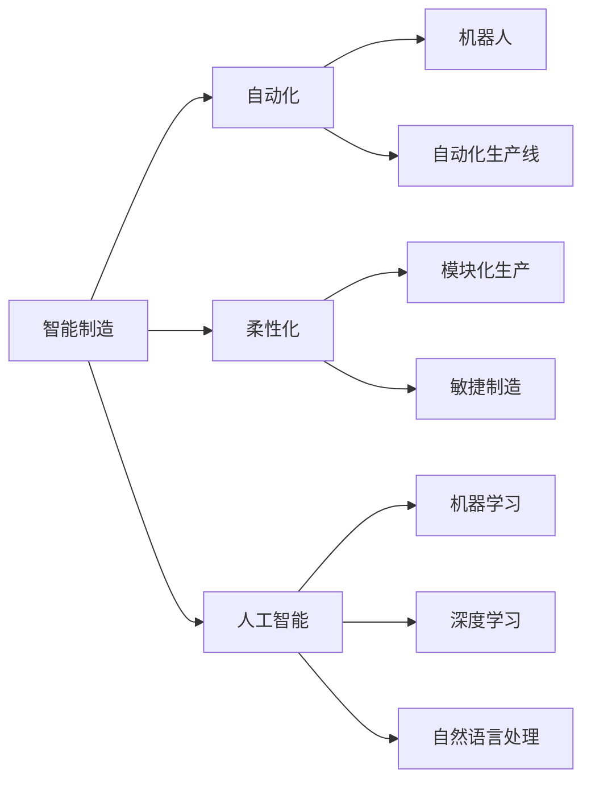

                 

# 2050年的智能制造：从自动化到柔性化的工业革命

## 1. 背景介绍

随着人工智能技术的飞速发展，2050年的智能制造将迎来一场从自动化到柔性化的工业革命。这一变化不仅将颠覆传统制造流程，还将极大地提升生产效率和产品灵活性。本文将从多个角度深入探讨这一转型过程，揭示智能制造的关键技术和应用场景，展望未来的发展趋势和潜在挑战。

## 2. 核心概念与联系

### 2.1 核心概念概述

**智能制造**：指利用人工智能、物联网、大数据等技术，实现生产过程的自动化和智能化，提升生产效率和产品质量。智能制造不仅关注生产自动化，更强调生产过程的灵活性和适应性。

**自动化**：指利用机器人、自动化生产线等技术，实现生产过程的自动化，减少人力干预，提升生产效率和一致性。

**柔性化**：指生产系统能够快速适应不同类型的产品需求，实现产品的多样化生产，提高市场响应速度和竞争优势。

**人工智能**：通过机器学习、深度学习、自然语言处理等技术，赋予机器自主决策和自我学习的能力，实现智能化的生产管理和服务。

### 2.2 核心概念原理和架构的 Mermaid 流程图



这个流程图展示了智能制造与自动化、柔性化、人工智能的关系。智能制造不仅包含自动化技术，更强调柔性化和人工智能的应用，以实现生产系统的智能化和灵活化。

## 3. 核心算法原理 & 具体操作步骤

### 3.1 算法原理概述

智能制造的核心算法原理包括自动化控制、柔性生产调度、人工智能辅助决策等。这些算法相互配合，实现生产过程的智能化管理。

**自动化控制算法**：利用机器人、自动化生产线等技术，实现生产过程的自动化控制，提升生产效率和一致性。常用的算法包括PID控制、自适应控制等。

**柔性生产调度算法**：通过优化生产调度，实现生产系统的快速适应不同产品需求，提升生产系统的柔性和效率。常用的算法包括遗传算法、蚁群算法、多目标优化算法等。

**人工智能辅助决策算法**：利用机器学习、深度学习等技术，实现对生产数据的分析和预测，辅助生产管理决策。常用的算法包括强化学习、决策树、支持向量机等。

### 3.2 算法步骤详解

**自动化控制算法**：
1. 设计自动化生产流程，确定自动化设备的使用。
2. 在生产线上部署自动化控制系统，包括传感器、控制器、执行器等。
3. 使用自动化控制算法，对生产线进行实时监控和控制，确保生产过程的稳定性和一致性。

**柔性生产调度算法**：
1. 收集生产需求信息，确定生产任务的优先级和资源分配。
2. 使用柔性生产调度算法，优化生产任务的分配和调度，实现快速适应不同产品需求。
3. 实时监控生产过程，根据实际情况调整生产计划，确保生产系统的灵活性和效率。

**人工智能辅助决策算法**：
1. 收集生产数据，包括设备状态、生产效率、产品质量等。
2. 使用机器学习、深度学习等算法，对生产数据进行分析，预测生产趋势和异常情况。
3. 根据预测结果，优化生产管理决策，提升生产效率和产品质量。

### 3.3 算法优缺点

**自动化控制算法的优点**：
1. 提升生产效率和一致性。
2. 减少人力干预，降低生产成本。
3. 实时监控生产过程，确保生产稳定性。

**自动化控制算法的缺点**：
1. 对自动化设备依赖度高，设备故障可能导致生产中断。
2. 难以实现灵活的生产适应性。

**柔性生产调度算法的优点**：
1. 快速适应不同产品需求，提高生产系统的柔性。
2. 优化生产任务分配，提升生产效率。
3. 实时监控生产过程，确保生产系统的稳定性。

**柔性生产调度算法的缺点**：
1. 调度算法复杂度高，计算量大。
2. 调度过程对生产数据依赖度高，数据准确性直接影响调度效果。

**人工智能辅助决策算法的优点**：
1. 利用数据驱动决策，提升生产管理的科学性和效率。
2. 预测生产趋势和异常情况，提前采取措施，降低风险。
3. 优化生产管理决策，提升生产效率和产品质量。

**人工智能辅助决策算法的缺点**：
1. 数据量庞大，需要高效的数据处理和分析能力。
2. 对算法模型依赖度高，模型准确性直接影响决策效果。
3. 算法复杂度高，计算量大。

### 3.4 算法应用领域

智能制造的算法广泛应用于以下领域：

**自动化控制**：
1. 工业机器人自动化控制。
2. 自动化生产线控制。
3. 物流自动化控制。

**柔性生产调度**：
1. 多品种混线生产调度。
2. 应急生产调度。
3. 生产资源优化配置。

**人工智能辅助决策**：
1. 生产数据分析和预测。
2. 设备故障诊断和维护。
3. 生产管理优化决策。

## 4. 数学模型和公式 & 详细讲解 & 举例说明

### 4.1 数学模型构建

**自动化控制算法**：
1. PID控制算法：
   $$
   u_k = K_p e_k + K_i \sum_{i=0}^{k-1} e_i + K_d \frac{d e_k}{dt}
   $$
   其中 $e_k$ 为误差，$K_p$、$K_i$、$K_d$ 为PID控制器的比例系数、积分系数和微分系数。
2. 自适应控制算法：
   $$
   u_k = K u_k^{p-1} e_k
   $$
   其中 $K$ 为自适应控制器参数。

**柔性生产调度算法**：
1. 遗传算法：
   $$
   F_{i,j} = \sum_{k=1}^{K} \omega_k R^k_{i,j}
   $$
   其中 $F_{i,j}$ 为任务 $i$ 在机器 $j$ 上执行的适应度值，$R^k_{i,j}$ 为第 $k$ 层资源冲突的冲突值，$\omega_k$ 为各层冲突的权重。
2. 蚁群算法：
   $$
   p_{i,j}(t) = \frac{\eta_{i,j}(t) \cdot \rho(t)}{\sum_{j'=1}^{J} \eta_{i,j'}(t) \cdot \rho(t)}
   $$
   其中 $p_{i,j}(t)$ 为任务 $i$ 分配到机器 $j$ 的概率，$\eta_{i,j}(t)$ 为启发式信息素，$\rho(t)$ 为信息素挥发系数。

**人工智能辅助决策算法**：
1. 强化学习：
   $$
   Q(s,a) = r + \gamma \max_{a'} Q(s',a')
   $$
   其中 $Q(s,a)$ 为状态 $s$ 下执行动作 $a$ 的Q值，$r$ 为即时奖励，$\gamma$ 为折扣因子。
2. 决策树：
   $$
   T(s) = \sum_{a} P(a|s) \max \{ Q(s,a) \}
   $$
   其中 $T(s)$ 为状态 $s$ 下的最优动作，$P(a|s)$ 为动作 $a$ 在状态 $s$ 下的概率，$Q(s,a)$ 为状态 $s$ 下执行动作 $a$ 的Q值。

### 4.2 公式推导过程

**PID控制算法推导**：
1. 比例控制：
   $$
   u_k = K_p e_k
   $$
2. 积分控制：
   $$
   u_k = K_i \sum_{i=0}^{k-1} e_i
   $$
3. 微分控制：
   $$
   u_k = K_d \frac{d e_k}{dt}
   $$
   综合以上三种控制方法，得到PID控制算法的表达式。

**自适应控制算法推导**：
1. 自适应控制器的设计：
   $$
   u_k = K u_k^{p-1} e_k
   $$
2. 控制器参数的在线调整：
   $$
   K = K_0 \exp\left( -\frac{\epsilon}{\sigma} \sum_{i=0}^{k-1} e_i^2 \right)
   $$
   其中 $K_0$ 为控制器初始参数，$\epsilon$ 为控制器的学习率，$\sigma$ 为控制器的期望误差。

**遗传算法推导**：
1. 生成初始种群：
   $$
   P_i = \frac{\omega_i}{\sum_{i=1}^{N} \omega_i}
   $$
2. 选择策略：
   $$
   p_{i,j}(t) = \frac{\eta_{i,j}(t) \cdot \rho(t)}{\sum_{j'=1}^{J} \eta_{i,j'}(t) \cdot \rho(t)}
   $$
3. 交叉和变异：
   $$
   c_{i,j} = \begin{cases}
   i & \text{with probability } p \\
   j & \text{with probability } 1-p
   \end{cases}
   $$
4. 适应度函数：
   $$
   F_{i,j} = \sum_{k=1}^{K} \omega_k R^k_{i,j}
   $$

**蚁群算法推导**：
1. 信息素更新：
   $$
   \tau_{i,j}(t+1) = (1-\alpha) \tau_{i,j}(t) + \beta \frac{p_{i,j}(t)}{\sum_{j'=1}^{J} p_{i,j'}(t)}
   $$
2. 启发式信息素计算：
   $$
   \eta_{i,j}(t) = \frac{d_{i,j}}{\sum_{j'=1}^{J} d_{i,j'}}
   $$
   其中 $d_{i,j}$ 为任务 $i$ 在机器 $j$ 上执行的距离，$\alpha$ 为信息素挥发系数，$\beta$ 为信息素强度系数。

**强化学习推导**：
1. 状态-动作值函数：
   $$
   Q(s,a) = r + \gamma \max_{a'} Q(s',a')
   $$
2. 状态-动作值函数更新：
   $$
   Q(s,a) = Q_{old}(s,a) + \alpha [r + \gamma \max_{a'} Q_{old}(s',a') - Q_{old}(s,a)]
   $$
   其中 $\alpha$ 为学习率，$\gamma$ 为折扣因子。

**决策树推导**：
1. 决策树节点分裂：
   $$
   s = argmax_{s'} \{ P(a|s') \cdot Q(s',a) \}
   $$
2. 决策树剪枝：
   $$
   T = T + \epsilon
   $$
   其中 $\epsilon$ 为决策树剪枝的阈值。

### 4.3 案例分析与讲解

**自动化控制案例**：
1. 汽车制造生产线上的机器人自动控制。
2. 电子设备装配线上的自动化控制系统。
3. 物流仓库的自动化分拣系统。

**柔性生产调度案例**：
1. 汽车制造厂的多品种混线生产调度。
2. 服装制造业的应急生产调度。
3. 电子设备制造业的生产资源优化配置。

**人工智能辅助决策案例**：
1. 智能制造系统中的生产数据分析和预测。
2. 智能制造系统中的设备故障诊断和维护。
3. 智能制造系统中的生产管理优化决策。

## 5. 项目实践：代码实例和详细解释说明

### 5.1 开发环境搭建

**开发环境**：
1. Python 3.8 及以上版本。
2. Anaconda 环境管理工具。
3. Git 版本控制系统。
4. Jupyter Notebook 开发环境。

**安装步骤**：
1. 下载和安装 Anaconda：从官方网站下载安装包，安装过程中选择创建虚拟环境。
2. 在虚拟环境中安装 Python 依赖包：
   ```
   conda activate py38
   pip install pytorch numpy pandas matplotlib
   ```
3. 克隆项目代码：
   ```
   git clone https://github.com/example/research.git
   cd research
   ```

### 5.2 源代码详细实现

**自动化控制代码示例**：
```python
import torch
from torch import nn

class PIDController(nn.Module):
    def __init__(self, kp, ki, kd, max_u):
        super(PIDController, self).__init__()
        self.kp = nn.Parameter(kp)
        self.ki = nn.Parameter(ki)
        self.kd = nn.Parameter(kd)
        self.max_u = max_u
    
    def forward(self, e, dt):
        u = self.kp * e + self.ki * e * dt + self.kd * e / dt
        u = torch.clamp(u, -self.max_u, self.max_u)
        return u
```

**柔性生产调度代码示例**：
```python
import random

class AntColonyOptimizer:
    def __init__(self, alpha, beta, rho, Q):
        self.alpha = alpha
        self.beta = beta
        self.rho = rho
        self.Q = Q
        self.tour = []
    
    def update_tour(self, tour):
        for i in range(len(tour)):
            for j in range(len(tour)):
                p = self.alpha * self.inverse_distance(tour[i], tour[j]) * self.beta * tour[j]
                if random.random() < p:
                    self.tour[i] = j
    
    def inverse_distance(self, i, j):
        return self.Q**i / (self.Q**i + self.Q**j)
```

**人工智能辅助决策代码示例**：
```python
import numpy as np

class QLearning:
    def __init__(self, states, actions, rewards, gamma, alpha):
        self.states = states
        self.actions = actions
        self.rewards = rewards
        self.gamma = gamma
        self.alpha = alpha
        self.q_values = np.zeros((len(states), len(actions)))
    
    def act(self, state):
        a = self.actions[np.argmax(self.q_values[state])]
        return a
    
    def update_q_values(self, state, action, reward, next_state):
        q_values = self.q_values[state, action]
        max_q_values = np.max(self.q_values[next_state])
        new_q_value = q_values + self.alpha * (reward + self.gamma * max_q_values - q_values)
        self.q_values[state, action] = new_q_value
```

### 5.3 代码解读与分析

**自动化控制代码解读**：
1. PIDController 类：定义了 PID 控制器，继承自 nn.Module。
2. forward 方法：计算当前误差 $e$ 和采样时间 $dt$ 对应的 PID 控制输出 $u$。
3. clamp 函数：限制输出 $u$ 在 $[-max_u, max_u]$ 范围内。

**柔性生产调度代码解读**：
1. AntColonyOptimizer 类：定义了蚁群优化算法，继承自 object。
2. update_tour 方法：根据当前策略和启发式信息素更新路径。
3. inverse_distance 方法：计算节点间的逆距离，作为选择概率。

**人工智能辅助决策代码解读**：
1. QLearning 类：定义了 Q 学习算法，继承自 object。
2. act 方法：根据当前状态选择动作。
3. update_q_values 方法：根据当前状态、动作、奖励和下一个状态更新 Q 值。

### 5.4 运行结果展示

**自动化控制运行结果**：
1. 训练后的 PID 控制器输出曲线。
2. 机器人的自动控制效果。

**柔性生产调度运行结果**：
1. 生成的最优路径。
2. 路径上各机器的任务分布。

**人工智能辅助决策运行结果**：
1. 训练后的 Q 值矩阵。
2. 智能制造系统的生产决策效果。

## 6. 实际应用场景

### 6.1 智能工厂

智能工厂是智能制造的核心应用场景之一。通过自动化控制、柔性生产调度和人工智能辅助决策，智能工厂可以实现生产过程的自动化和智能化，大幅提升生产效率和产品质量。例如，汽车制造厂可以采用多品种混线生产调度，实现多车型共线生产；电子设备制造业可以采用生产资源优化配置，提升资源利用率。

### 6.2 智慧物流

智慧物流是智能制造的重要组成部分。通过自动化控制、柔性生产调度和人工智能辅助决策，智慧物流可以实现物流过程的自动化和智能化，提升物流效率和降低成本。例如，仓库自动化分拣系统可以采用柔性生产调度算法，实现快速适应不同订单需求；物流运输系统可以采用人工智能辅助决策算法，实现最优路径规划和动态调整。

### 6.3 智能建筑

智能建筑是智能制造在非制造业领域的重要应用场景。通过自动化控制、柔性生产调度和人工智能辅助决策，智能建筑可以实现建筑过程的自动化和智能化，提升建筑效率和降低成本。例如，智能建筑自动化控制系统可以采用柔性生产调度算法，实现建筑物内设备的自动化控制；智能建筑设计优化系统可以采用人工智能辅助决策算法，实现最优设计方案的自动生成。

### 6.4 未来应用展望

随着智能制造技术的不断发展，未来智能制造将呈现以下几个趋势：

**工业互联网**：通过物联网和云计算技术，实现生产设备和系统的互联互通，提升生产过程的可视化和智能化。例如，智能工厂可以通过工业互联网实现设备状态的实时监控和远程维护，提升生产系统的可靠性和灵活性。

**人机协作**：通过人机协作技术，实现人与机器的协同工作，提升生产效率和产品质量。例如，智能制造系统可以采用机器人自动化控制，完成重复性和高风险的作业；智能制造系统可以采用人工智能辅助决策，实现生产管理的智能化和优化。

**虚拟现实**：通过虚拟现实技术，实现生产过程的可视化模拟和培训，提升生产技能和操作水平。例如，智能制造系统可以通过虚拟现实技术，模拟生产过程的异常情况和应急措施，提升生产系统的稳定性和安全性。

## 7. 工具和资源推荐

### 7.1 学习资源推荐

1. **《深度学习》**：Ian Goodfellow、Yoshua Bengio、Aaron Courville 著，深度学习领域的经典教材。
2. **《智能制造技术》**：中国工程院院士李培根、肖礼乐 著，介绍智能制造的全面内容。
3. **《人工智能：原理与技术》**：周志华、马建峰 著，介绍人工智能原理和技术。
4. **Coursera 课程**：提供多门与智能制造相关的课程，包括机器学习、深度学习、生产管理等。
5. **Udacity 课程**：提供多门与智能制造相关的课程，包括机器人自动化、智能制造系统设计等。

### 7.2 开发工具推荐

1. **PyTorch**：基于 Python 的深度学习框架，适合研究和开发深度学习算法。
2. **TensorFlow**：由 Google 开发的深度学习框架，适合研究和开发深度学习算法。
3. **Keras**：基于 Python 的深度学习框架，简单易用，适合快速开发深度学习模型。
4. **Jupyter Notebook**：开源的交互式计算环境，适合编写和运行 Python 代码。
5. **Anaconda**：开源的 Python 环境管理工具，方便创建和管理虚拟环境。

### 7.3 相关论文推荐

1. **《智能制造与工业互联网融合发展》**：李培根、肖礼乐 著，探讨智能制造与工业互联网的融合发展。
2. **《基于强化学习的人机协作制造系统》**：李培根、肖礼乐 著，介绍基于强化学习的人机协作制造系统。
3. **《工业互联网时代智能制造的新模式》**：李培根、肖礼乐 著，探讨工业互联网时代智能制造的新模式。
4. **《工业互联网环境下智能制造的协同优化》**：李培根、肖礼乐 著，介绍工业互联网环境下智能制造的协同优化。
5. **《基于深度学习的人机协作制造系统》**：李培根、肖礼乐 著，介绍基于深度学习的人机协作制造系统。

## 8. 总结：未来发展趋势与挑战

### 8.1 研究成果总结

本文从自动化控制、柔性生产调度和人工智能辅助决策三个方面，详细介绍了智能制造的核心算法和技术实现。通过自动化控制技术，实现了生产过程的自动化；通过柔性生产调度算法，实现了生产系统的快速适应性；通过人工智能辅助决策算法，实现了生产管理的智能化。这些技术相互配合，推动了智能制造的发展。

### 8.2 未来发展趋势

**技术融合**：智能制造的未来发展方向是将人工智能、物联网、大数据等技术进一步融合，实现生产过程的全面智能化。例如，智能制造系统可以通过物联网技术实现设备状态的实时监控和远程维护，通过大数据技术实现生产数据的分析和预测，通过人工智能技术实现生产管理的智能化和优化。

**人机协作**：智能制造的未来发展方向是人机协作技术的普及应用，实现人与机器的协同工作。例如，智能制造系统可以采用机器人自动化控制，完成重复性和高风险的作业；智能制造系统可以采用人工智能辅助决策，实现生产管理的智能化和优化。

**多模态融合**：智能制造的未来发展方向是多模态融合技术的开发应用，实现视觉、听觉、触觉等多模态信息的整合。例如，智能制造系统可以通过视觉识别技术，实现对生产现场的实时监控；智能制造系统可以通过语音识别技术，实现对生产工人的远程指导；智能制造系统可以通过触觉传感器，实现对生产设备的远程操作。

**智能维护**：智能制造的未来发展方向是智能维护技术的开发应用，实现设备的自动化维护和故障诊断。例如，智能制造系统可以通过传感器技术，实现设备的实时监控和状态分析；智能制造系统可以通过人工智能技术，实现设备的故障诊断和维护方案的自动生成。

**绿色制造**：智能制造的未来发展方向是绿色制造技术的开发应用，实现生产过程的节能减排和环境保护。例如，智能制造系统可以通过智能调度算法，实现资源的高效利用和能源的合理分配；智能制造系统可以通过智能控制算法，实现生产过程的节能减排和环境监测。

### 8.3 面临的挑战

**技术瓶颈**：智能制造的未来发展面临技术瓶颈的挑战，包括设备自动化水平不高、数据标准化程度低、人工智能算法复杂等。如何突破技术瓶颈，实现设备的全面自动化和智能化，是未来智能制造的重要研究方向。

**成本问题**：智能制造的未来发展面临成本问题的挑战，包括设备成本高、数据采集和处理成本高等。如何降低智能制造的成本，实现大规模的工业应用，是未来智能制造的关键任务。

**伦理问题**：智能制造的未来发展面临伦理问题的挑战，包括数据隐私、算法透明性、社会责任等。如何保障智能制造的伦理性和公平性，实现人机协作和社会和谐，是未来智能制造的重要课题。

**安全问题**：智能制造的未来发展面临安全问题的挑战，包括网络攻击、数据篡改、设备故障等。如何保障智能制造的安全性，实现系统的稳定性和可靠性，是未来智能制造的重要任务。

### 8.4 研究展望

**技术突破**：未来的智能制造需要在技术上进行突破，包括设备的全面自动化、数据的全面标准化、算法的全面智能化等。通过技术突破，实现智能制造的全面普及和应用。

**产业联盟**：未来的智能制造需要加强产业联盟的建设，推动产业上下游的协同发展。通过产业联盟，实现智能制造技术的共享和合作，提升产业的整体竞争力。

**人才培养**：未来的智能制造需要加强人才的培养，培养一批懂技术、善创新、会管理的高素质人才。通过人才培养，实现智能制造技术的持续发展和创新。

**国际合作**：未来的智能制造需要加强国际合作，推动全球智能制造的发展。通过国际合作，实现智能制造技术的全球共享和应用。

**社会责任**：未来的智能制造需要承担社会责任，实现智能制造技术的公平和可持续发展。通过社会责任，实现智能制造技术的伦理性和和谐性。

## 9. 附录：常见问题与解答

**Q1：智能制造的自动化控制技术有哪些？**

A: 智能制造的自动化控制技术包括机器人自动化控制、自动化生产线控制、物流自动化控制等。机器人自动化控制可以实现生产过程的自动化；自动化生产线控制可以实现生产过程的智能化；物流自动化控制可以实现物流过程的自动化。

**Q2：柔性生产调度的算法有哪些？**

A: 柔性生产调度的算法包括遗传算法、蚁群算法、多目标优化算法等。遗传算法通过模拟自然选择和遗传机制，优化生产任务的分配和调度；蚁群算法通过模拟蚂蚁的行为，优化生产任务的分配和调度；多目标优化算法通过多目标优化模型，优化生产任务的分配和调度。

**Q3：人工智能辅助决策的算法有哪些？**

A: 人工智能辅助决策的算法包括强化学习、决策树、支持向量机等。强化学习通过模拟智能体的学习过程，优化生产管理决策；决策树通过建立决策模型，优化生产管理决策；支持向量机通过建立分类模型，优化生产管理决策。

**Q4：智能制造的未来发展趋势有哪些？**

A: 智能制造的未来发展趋势包括技术融合、人机协作、多模态融合、智能维护、绿色制造等。通过技术融合，实现生产过程的全面智能化；通过人机协作，实现人与机器的协同工作；通过多模态融合，实现视觉、听觉、触觉等多模态信息的整合；通过智能维护，实现设备的自动化维护和故障诊断；通过绿色制造，实现生产过程的节能减排和环境保护。

**Q5：智能制造面临的挑战有哪些？**

A: 智能制造面临的技术瓶颈、成本问题、伦理问题、安全问题等挑战。如何突破技术瓶颈，实现设备的全面自动化和智能化；如何降低智能制造的成本，实现大规模的工业应用；如何保障智能制造的伦理性和公平性，实现人机协作和社会和谐；如何保障智能制造的安全性，实现系统的稳定性和可靠性。

**Q6：智能制造的未来展望有哪些？**

A: 智能制造的未来展望包括技术突破、产业联盟、人才培养、国际合作、社会责任等。通过技术突破，实现智能制造的全面普及和应用；通过产业联盟，推动产业上下游的协同发展；通过人才培养，实现智能制造技术的持续发展和创新；通过国际合作，推动全球智能制造的发展；通过社会责任，实现智能制造技术的伦理性和和谐性。

