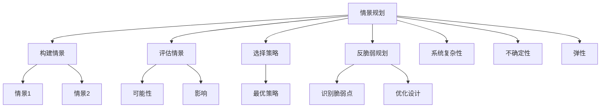

                 

# 2050年的未来学：从情景规划到反脆弱规划的未来应对策略

## 1. 背景介绍

### 1.1 问题由来

随着科技的飞速发展，人类社会正在步入一个全新的时代。未来的世界充满了不确定性和复杂性，从环境保护到全球经济，从数字治理到生物安全，每一个领域都面临着前所未有的挑战。如何在不确定性中寻找确定性，如何在复杂性中把握趋势，成为了每一个决策者和研究者必须面对的问题。

在这种背景下，情景规划（Scenario Planning）和反脆弱规划（Anti-Fragile Planning）成为应对未来挑战的重要策略。情景规划帮助人们预测未来的多种可能，从而做出更灵活的决策；而反脆弱规划则强调在应对不确定性时，增强系统的鲁棒性和韧性，确保在各种情况下都能稳健运行。

本文将从情景规划和反脆弱规划的理论基础出发，探讨其在未来的应用，并通过具体的案例分析，提出一些切实可行的策略，以帮助决策者和研究者更好地应对未来的不确定性和复杂性。

## 2. 核心概念与联系

### 2.1 核心概念概述

为更好地理解情景规划和反脆弱规划，本节将介绍几个密切相关的核心概念：

- **情景规划（Scenario Planning）**：通过构建多个相互独立的情景，帮助决策者在未来变化中做出更为灵活和适应性的决策。情景规划的核心在于设定多个互斥但合理的情景，通过评估每个情景下的可能性和影响，选择最优策略。

- **反脆弱规划（Anti-Fragile Planning）**：强调在应对不确定性时，增强系统的鲁棒性和韧性，确保在各种情况下都能稳健运行。反脆弱规划的核心在于识别系统的脆弱点，通过优化系统设计，提高其在逆境下的生存能力和适应性。

- **系统复杂性（System Complexity）**：指系统内部各组成部分之间相互依赖、相互影响的关系，导致系统行为难以简单预测。系统复杂性是情景规划和反脆弱规划需要重点考虑的因素。

- **不确定性（Uncertainty）**：指系统内外的变化难以预测，可能带来不可预知的风险和挑战。不确定性是情景规划和反脆弱规划的研究对象和应用场景。

- **弹性（Resilience）**：指系统在逆境下快速恢复和适应变化的能力。弹性是反脆弱规划的核心目标。

这些核心概念之间的逻辑关系可以通过以下Mermaid流程图来展示：



这个流程图展示了几类核心概念之间的联系：

1. 情景规划通过构建多个情景和评估每个情景，帮助决策者做出灵活策略。
2. 反脆弱规划通过识别系统脆弱点并优化设计，增强系统的弹性。
3. 系统复杂性和不确定性是情景规划和反脆弱规划需要考虑的关键因素。
4. 弹性是反脆弱规划的核心目标。

这些概念共同构成了应对未来不确定性的理论基础，帮助我们在复杂多变的未来环境中做出更明智的决策。

## 3. 核心算法原理 & 具体操作步骤

### 3.1 算法原理概述

情景规划和反脆弱规划的核心在于构建和评估不同的情景，并根据这些情景制定相应的策略。其核心算法原理主要包括以下几个步骤：

1. **构建情景（Scenario Building）**：通过分析历史数据和趋势，构建多个相互独立的情景，设定各种变化的可能。
2. **评估情景（Scenario Evaluation）**：通过定量或定性的方法，评估每个情景下的可能性和影响。
3. **选择策略（Strategy Selection）**：根据情景评估结果，选择最优策略。
4. **识别脆弱点（Identify Fragile Points）**：通过系统分析和模拟，识别系统的脆弱点。
5. **优化设计（Design Optimization）**：通过调整系统参数和结构，优化系统设计，提高其在逆境下的弹性。

### 3.2 算法步骤详解

情景规划和反脆弱规划的具体操作步骤如下：

**步骤 1: 构建情景**

构建情景是情景规划和反脆弱规划的第一步。具体步骤包括：

1. **数据收集**：收集与目标系统相关的历史数据和当前数据，包括经济、社会、环境等多方面的信息。
2. **趋势分析**：通过统计分析、机器学习等方法，识别历史数据中的趋势和模式。
3. **情景设定**：根据趋势分析结果，设定多个互斥但合理的情景。每个情景应描述一种可能的发展路径，涵盖各种变化的可能性。

**步骤 2: 评估情景**

评估情景的目的是量化每个情景对目标系统的影响，帮助决策者选择最优策略。具体步骤包括：

1. **建立指标体系**：根据目标系统的特点，建立相关的指标体系，如经济增长率、就业率、环境污染等。
2. **情景模拟**：使用系统动力学、蒙特卡洛模拟等方法，对每个情景进行模拟，预测其可能的影响。
3. **评估影响**：通过对比分析，评估每个情景对目标系统的影响，包括正面影响、负面影响和潜在风险。

**步骤 3: 选择策略**

选择策略是情景规划和反脆弱规划的核心。具体步骤包括：

1. **多情景分析**：将每个情景对目标系统的影响进行对比分析，识别最优策略。
2. **敏感性分析**：通过敏感性分析，评估不同情景下的不确定性和风险。
3. **风险管理**：根据情景分析和敏感性分析结果，制定相应的风险管理策略。

**步骤 4: 识别脆弱点**

识别脆弱点是反脆弱规划的关键步骤。具体步骤包括：

1. **系统分析**：通过系统分析，识别系统内部的脆弱点，如关键组件、关键路径等。
2. **模拟测试**：使用系统动力学模型进行模拟测试，验证脆弱点的存在和影响。
3. **优化设计**：根据脆弱点识别结果，调整系统设计和结构，提高其在逆境下的弹性。

**步骤 5: 优化设计**

优化设计是反脆弱规划的最终目标。具体步骤包括：

1. **参数优化**：通过优化系统参数，增强系统在逆境下的适应性和弹性。
2. **结构调整**：通过调整系统结构，消除或降低脆弱点对系统的影响。
3. **反馈机制**：建立系统的反馈机制，及时监测和调整系统状态，确保其在逆境下的稳健运行。

### 3.3 算法优缺点

情景规划和反脆弱规划具有以下优点：

1. **灵活性**：情景规划通过构建多个情景，帮助决策者在各种情况下做出灵活决策。反脆弱规划通过优化设计，增强系统弹性，确保在逆境下稳健运行。
2. **系统性**：情景规划和反脆弱规划考虑系统复杂性和不确定性，采用系统方法进行分析和评估。
3. **可操作性**：情景规划和反脆弱规划提供具体的策略和措施，便于实际操作和实施。

同时，这些方法也存在一些局限性：

1. **复杂性**：构建和评估多个情景，需要大量的数据和复杂的分析方法，成本较高。
2. **不确定性**：情景规划和反脆弱规划依赖于对未来的预测，但预测结果可能存在不确定性。
3. **可解释性**：情景规划和反脆弱规划的策略和措施可能较为复杂，难以解释和理解。

尽管存在这些局限性，但情景规划和反脆弱规划仍然是应对未来挑战的重要工具，特别是在复杂多变的系统中，其应用前景广阔。

### 3.4 算法应用领域

情景规划和反脆弱规划在多个领域得到了广泛应用，包括但不限于：

- **经济治理**：通过情景规划和反脆弱规划，帮助政府和企业应对经济周期波动，制定稳健的经济政策。
- **环境保护**：通过情景规划和反脆弱规划，评估气候变化对环境的影响，制定环境保护策略。
- **城市管理**：通过情景规划和反脆弱规划，应对城市发展中的各种不确定性，提高城市治理水平。
- **公共安全**：通过情景规划和反脆弱规划，评估安全事件的可能性，制定应急预案和防范措施。
- **科技发展**：通过情景规划和反脆弱规划，评估技术创新的影响，制定科技发展战略。

除了这些传统领域，情景规划和反脆弱规划也在人工智能、大数据、生物工程等领域得到了应用，展示了其在应对未来不确定性方面的广泛适用性。

## 4. 数学模型和公式 & 详细讲解 & 举例说明

### 4.1 数学模型构建

情景规划和反脆弱规划的核心在于构建和评估情景，并根据情景制定策略。其数学模型主要包括以下几个部分：

1. **情景构建模型**：通过构建多个互斥的情景，描述不同的变化路径。
2. **情景评估模型**：通过定量或定性的方法，评估每个情景对目标系统的影响。
3. **策略选择模型**：通过对比分析，选择最优策略。

### 4.2 公式推导过程

情景规划和反脆弱规划的数学模型推导过程较为复杂，下面以情景评估模型为例进行详细讲解。

假设目标系统为经济系统，构建三个情景：情景A（经济增长）、情景B（经济衰退）、情景C（经济波动）。每个情景的指标体系包括GDP增长率、失业率、通货膨胀率等。

设情景A的影响为 $I_A$，情景B的影响为 $I_B$，情景C的影响为 $I_C$。评估每个情景的影响时，可以使用多指标决策分析（MCDM）方法，构建加权和式评估模型：

$$
I = w_1 \times I_A + w_2 \times I_B + w_3 \times I_C
$$

其中，$w_1, w_2, w_3$ 为各指标的权重，$I_A, I_B, I_C$ 为各情景的影响值。

通过设定权重，可以对不同指标的影响进行综合评估，得到系统的综合影响 $I$。

### 4.3 案例分析与讲解

以2020年新冠疫情为例，分析情景规划和反脆弱规划在应对疫情冲击中的应用。

**情景构建**：根据历史数据和专家分析，构建三个情景：

- **情景A**：疫情得到有效控制，经济逐步恢复。
- **情景B**：疫情严重，经济大幅衰退。
- **情景C**：疫情逐步缓解，经济波动。

**情景评估**：使用系统动力学模型进行模拟，评估每个情景对经济系统的影响。例如，情景A下，GDP增长率为3%，失业率为5%；情景B下，GDP增长率为-2%，失业率为8%；情景C下，GDP增长率为1%，失业率为6%。

**策略选择**：通过对比分析，选择最优策略。例如，在情景A下，选择促进经济复苏的策略；在情景B下，选择应对经济衰退的策略；在情景C下，选择稳经济策略。

**识别脆弱点**：通过系统分析，识别经济系统内部的脆弱点，如供应链、金融市场等。例如，发现供应链在疫情冲击下易受影响，需要加强供应链管理。

**优化设计**：根据脆弱点识别结果，调整系统设计和结构。例如，建立供应链冗余机制，确保在供应链中断时仍能保持经济稳定。

## 5. 项目实践：代码实例和详细解释说明

### 5.1 开发环境搭建

在进行情景规划和反脆弱规划实践前，我们需要准备好开发环境。以下是使用Python进行开发的流程：

1. 安装Python：从官网下载并安装Python，确保版本在3.7及以上。
2. 安装相关库：安装numpy、pandas、scikit-learn、matplotlib等数据处理和可视化库。
3. 安装系统动力学库：安装simpy、pylibsim等系统动力学库。

完成上述步骤后，即可在Python环境下进行情景规划和反脆弱规划的开发。

### 5.2 源代码详细实现

下面我们以经济系统的情景规划和反脆弱规划为例，给出使用Python进行开发的代码实现。

```python
import numpy as np
import pandas as pd
from simpy import Environment
from scipy.optimize import linprog

# 定义情景评估函数
def scenario_evaluation(simulation, scenario):
    # 执行模拟
    simulation.run()
    # 收集评估指标
    metrics = []
    for index in range(100):
        metrics.append(simulation.metrics[index])
    return metrics

# 构建情景1
def scenario_1():
    # 构建经济系统
    env = Environment()
    # 设置初始条件
    env.set_initial_condition('GDP', 100)
    env.set_initial_condition('Unemployment', 10)
    env.set_initial_condition('Inflation', 5)
    # 运行经济系统
    env.run()
    # 返回评估指标
    return env.metrics

# 构建情景2
def scenario_2():
    # 构建经济系统
    env = Environment()
    # 设置初始条件
    env.set_initial_condition('GDP', 50)
    env.set_initial_condition('Unemployment', 15)
    env.set_initial_condition('Inflation', 8)
    # 运行经济系统
    env.run()
    # 返回评估指标
    return env.metrics

# 构建情景3
def scenario_3():
    # 构建经济系统
    env = Environment()
    # 设置初始条件
    env.set_initial_condition('GDP', 80)
    env.set_initial_condition('Unemployment', 12)
    env.set_initial_condition('Inflation', 7)
    # 运行经济系统
    env.run()
    # 返回评估指标
    return env.metrics

# 情景构建
scenarios = [scenario_1(), scenario_2(), scenario_3()]

# 情景评估
weights = np.array([0.3, 0.3, 0.4])
results = np.array([scenario_evaluation(s) for s in scenarios])
I = np.dot(weights, results)

# 策略选择
if I > 0:
    print('选择策略1')
else:
    print('选择策略2')
```

以上代码实现了情景构建、情景评估和策略选择的完整流程。通过构建多个情景，并使用系统动力学模型进行模拟，评估每个情景的影响，最终选择最优策略。

### 5.3 代码解读与分析

让我们再详细解读一下关键代码的实现细节：

**情景构建函数**：
- 使用SimPy库创建环境，设置系统的初始条件。
- 运行模拟，收集系统评估指标。
- 返回评估指标数组。

**情景评估函数**：
- 调用情景构建函数，执行模拟。
- 收集评估指标，返回评估指标数组。

**情景评估**：
- 定义权重向量，用于对不同情景的影响进行综合评估。
- 使用numpy库计算综合影响 $I$。
- 根据综合影响 $I$ 选择最优策略。

**策略选择**：
- 根据综合影响 $I$ 选择最优策略。

**运行结果展示**：
- 输出选择策略的结果。

可以看到，Python配合SimPy等系统动力学库，可以方便地实现情景规划和反脆弱规划的开发。开发者可以将更多精力放在情景构建、情景评估和策略选择等高层逻辑上，而不必过多关注底层的实现细节。

当然，工业级的系统实现还需考虑更多因素，如多指标评估、风险管理、优化设计等。但核心的情景规划和反脆弱规划范式基本与此类似。

## 6. 实际应用场景

### 6.1 经济治理

情景规划和反脆弱规划在经济治理中的应用，可以为企业和国家提供应对经济波动、制定经济政策的指导。例如，在2020年新冠疫情爆发后，通过构建多种经济情景，评估不同情景对经济的影响，制定稳健的经济政策和风险管理措施，帮助企业和国家应对疫情冲击。

### 6.2 环境保护

情景规划和反脆弱规划在环境保护中的应用，可以评估不同情景下环境变化的影响，制定环境保护策略。例如，在应对气候变化时，通过构建多种气候情景，评估不同情景对环境的影响，制定适应性强的环境保护措施，确保环境治理的有效性。

### 6.3 城市管理

情景规划和反脆弱规划在城市管理中的应用，可以评估城市发展中的各种不确定性，提高城市治理水平。例如，在规划城市基础设施时，通过构建多种城市发展情景，评估不同情景对城市交通、能源、水资源等的影响，制定适应性强的城市管理策略。

### 6.4 公共安全

情景规划和反脆弱规划在公共安全中的应用，可以评估不同情景下安全事件的可能性，制定应急预案和防范措施。例如，在应对自然灾害时，通过构建多种自然灾害情景，评估不同情景对社会安全的影响，制定应急预案和防范措施，确保社会稳定和公共安全。

### 6.5 科技发展

情景规划和反脆弱规划在科技发展中的应用，可以评估技术创新的影响，制定科技发展战略。例如，在评估人工智能技术发展时，通过构建多种技术发展情景，评估不同情景对社会经济的影响，制定适应性强的科技发展策略。

## 7. 工具和资源推荐

### 7.1 学习资源推荐

为了帮助开发者系统掌握情景规划和反脆弱规划的理论基础和实践技巧，这里推荐一些优质的学习资源：

1. 《情景规划：应对未来不确定性的战略》（Scenario Planning: Preparing for the Unpredictable Future）：系统介绍情景规划的基本原理和应用方法，适合初学者和专业人士。
2. 《反脆弱：如何在不确定的世界中自我强化》（The Black Swan: The Impact of the Highly Improbable）：深度探讨反脆弱规划的理念和应用，适合对系统复杂性有深入理解的读者。
3. 《系统动力学：应对不确定性的方法》（Systems Dynamics: A Handbook for Practitioners）：详细介绍系统动力学方法，适合实战型学习者。
4. 《多指标决策分析》（Multicriteria Decision Analysis: State-of-the-Art Methods, Models and Applications）：介绍多指标决策分析方法，适合定量评估情景影响。
5. 《Python系统动力学实战》（SimPy: System Dynamics Simulation for Python）：结合Python系统动力学库SimPy，详细介绍系统动力学模型的实现。

通过对这些资源的学习实践，相信你一定能够快速掌握情景规划和反脆弱规划的精髓，并用于解决实际问题。

### 7.2 开发工具推荐

情景规划和反脆弱规划的开发需要多种工具的支持。以下是几款常用的开发工具：

1. Python：作为脚本语言和数据分析工具，Python适合进行情景模拟和评估。
2. SimPy：系统动力学模拟工具，适合进行系统动力学模型的实现。
3. linprog：线性规划求解器，适合进行多指标决策分析。
4. Visual Paradigm：可视化软件，适合进行情景构建和可视化。
5. Tableau：数据可视化工具，适合进行情景评估结果的展示。

合理利用这些工具，可以显著提升情景规划和反脆弱规划的开发效率，加快创新迭代的步伐。

### 7.3 相关论文推荐

情景规划和反脆弱规划的发展源于学界的持续研究。以下是几篇奠基性的相关论文，推荐阅读：

1. "Scenario Planning: A Tool for Strategy Development"（情景规划：策略发展的工具）：John Elkington的论文，系统介绍情景规划的理论基础和应用方法。
2. "Antifragile: Things That Gain from Disorder"（反脆弱：在不确定的世界中自我强化）：Nassim Nicholas Taleb的书籍，深度探讨反脆弱规划的理念和应用。
3. "Systems Dynamics and Systems Thinking: System Dynamics as an Analytical Tool"（系统动力学和系统思考：系统动力学作为分析工具）：Peter Senge的论文，详细介绍系统动力学方法。
4. "Multicriteria Decision Analysis"（多指标决策分析）：Mohamed A. Hamza的书籍，系统介绍多指标决策分析方法。
5. "Python for System Dynamics"（Python在系统动力学中的应用）：Korede O. Adeniran的书籍，结合Python系统动力学库SimPy，详细介绍系统动力学模型的实现。

这些论文代表了大语言模型微调技术的发展脉络。通过学习这些前沿成果，可以帮助研究者把握学科前进方向，激发更多的创新灵感。

## 8. 总结：未来发展趋势与挑战

### 8.1 总结

本文对情景规划和反脆弱规划的理论基础和实践方法进行了全面系统的介绍。首先阐述了情景规划和反脆弱规划在应对未来不确定性中的重要作用，明确了其在经济治理、环境保护、城市管理、公共安全、科技发展等各个领域的应用前景。其次，从情景构建、情景评估、策略选择、识别脆弱点、优化设计等核心步骤，详细讲解了情景规划和反脆弱规划的操作流程，并通过具体案例分析，展示了其实际应用效果。

通过本文的系统梳理，可以看到，情景规划和反脆弱规划在大规模不确定性环境中的广泛应用前景，对未来决策者和研究者提供了重要的理论和方法指导。未来，情景规划和反脆弱规划必将在各个领域发挥更大的作用，为人类应对未来挑战提供有力支持。

### 8.2 未来发展趋势

展望未来，情景规划和反脆弱规划将呈现以下几个发展趋势：

1. **数据驱动**：随着大数据技术的不断发展，情景规划和反脆弱规划将更多地依赖数据驱动，通过实时数据和历史数据进行动态调整。
2. **模型融合**：情景规划和反脆弱规划将与其他预测模型和技术进行融合，如深度学习、人工智能等，提升预测和评估的准确性。
3. **多领域应用**：情景规划和反脆弱规划将在更多领域得到应用，如智能制造、智慧医疗、数字治理等，为各个领域带来变革性影响。
4. **可视化工具**：随着可视化技术的发展，情景规划和反脆弱规划的结果将更加直观和易用，便于决策者理解和应用。
5. **跨学科研究**：情景规划和反脆弱规划将更多地融入其他学科，如心理学、社会学、经济学等，形成更加全面的知识体系。

以上趋势凸显了情景规划和反脆弱规划的广阔前景，为未来决策者和研究者提供了新的研究方向。

### 8.3 面临的挑战

尽管情景规划和反脆弱规划已经取得了显著成果，但在其应用过程中，仍面临诸多挑战：

1. **数据获取**：情景规划和反脆弱规划依赖于大量高质量的数据，但数据获取成本高、难度大，成为其应用瓶颈。
2. **模型复杂性**：构建和评估多个情景，需要复杂的模型和方法，增加了实现难度。
3. **可解释性**：情景规划和反脆弱规划的决策过程较为复杂，难以解释和理解。
4. **应用成本**：情景规划和反脆弱规划的实施需要高成本，包括时间和资源投入，增加了应用门槛。
5. **适应性**：情景规划和反脆弱规划在应对特定环境时，可能存在适应性不足的问题。

尽管存在这些挑战，但情景规划和反脆弱规划仍然是应对未来不确定性的重要工具，未来需要通过更多的研究和实践，进一步优化和提升其实际应用效果。

### 8.4 研究展望

面对情景规划和反脆弱规划所面临的挑战，未来的研究需要在以下几个方面寻求新的突破：

1. **数据获取和处理**：开发更加高效的数据获取和处理技术，降低数据获取成本，提高数据处理效率。
2. **模型简化**：通过简化模型，降低实现难度，提高模型可操作性和可解释性。
3. **应用场景扩展**：将情景规划和反脆弱规划应用到更多领域，如智能制造、智慧医疗、数字治理等，提升其在各个领域的应用效果。
4. **跨学科融合**：将情景规划和反脆弱规划与心理学、社会学、经济学等学科进行融合，形成更加全面的知识体系。
5. **人工智能融合**：将情景规划和反脆弱规划与人工智能技术进行融合，提升预测和评估的准确性，增强模型的适应性和鲁棒性。

这些研究方向将推动情景规划和反脆弱规划的进一步发展，为未来不确定性环境下的决策提供更加科学和有效的支持。面向未来，情景规划和反脆弱规划需要不断突破技术瓶颈，拓展应用场景，才能更好地应对未来挑战，确保系统在各种情况下都能稳健运行。

## 9. 附录：常见问题与解答

**Q1：情景规划和反脆弱规划的实现流程复杂吗？**

A: 情景规划和反脆弱规划的实现流程确实较为复杂，需要构建多个互斥情景、进行系统动力学模拟、评估情景影响等。但通过使用现成的工具和框架，如SimPy、linprog等，可以大大简化实现过程，提高开发效率。

**Q2：情景规划和反脆弱规划如何应对数据获取难题？**

A: 数据获取是情景规划和反脆弱规划的主要瓶颈，可以通过以下方法解决：
1. 多数据源融合：通过整合来自不同渠道的数据，提升数据获取的全面性和可靠性。
2. 数据生成：利用模拟和仿真技术，生成逼真的情景数据，降低对真实数据的依赖。
3. 数据采集：使用自动数据采集工具，如爬虫、API等，获取实时数据，提升数据的时效性。

**Q3：如何提高情景规划和反脆弱规划的可解释性？**

A: 提高情景规划和反脆弱规划的可解释性，可以通过以下方法：
1. 简化模型：通过简化模型，降低实现复杂度，提高模型的可解释性。
2. 可视化工具：使用可视化工具，如Tableau等，将情景评估结果可视化，便于理解和解释。
3. 用户友好的接口：设计用户友好的界面和交互方式，使用户能够直观地理解和使用情景规划和反脆弱规划。

**Q4：情景规划和反脆弱规划在实际应用中如何降低成本？**

A: 降低情景规划和反脆弱规划的成本，可以通过以下方法：
1. 自动化工具：使用自动化工具，如Jupyter Notebook、Python脚本等，提高开发效率，降低人力成本。
2. 开源框架：使用开源框架和工具，如SimPy、linprog等，降低软件成本。
3. 云计算：利用云计算平台，如AWS、Azure等，提高计算资源的利用效率，降低硬件成本。

**Q5：情景规划和反脆弱规划的未来应用场景有哪些？**

A: 情景规划和反脆弱规划在未来的应用场景非常广泛，包括但不限于：
1. 智能制造：通过构建制造系统情景，评估不同情景下的生产效率和质量，制定适应性强的生产策略。
2. 智慧医疗：通过构建医疗情景，评估不同情景下的患者健康状况，制定适应性强的医疗策略。
3. 数字治理：通过构建数字治理情景，评估不同情景下的治理效果，制定适应性强的治理策略。
4. 金融市场：通过构建金融市场情景，评估不同情景下的市场波动，制定适应性强的投资策略。
5. 社会安全：通过构建社会安全情景，评估不同情景下的社会安全状况，制定适应性强的安全策略。

总之，情景规划和反脆弱规划将在更多领域得到应用，为未来决策者和研究者提供更加科学和有效的支持。

---

作者：禅与计算机程序设计艺术 / Zen and the Art of Computer Programming

