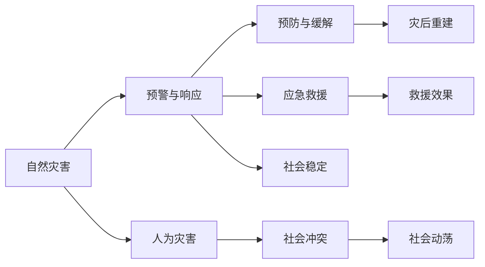

                 

# 2050年的灾害预防：从自然灾害到人为灾害的全面防控体系

## 1. 背景介绍

### 1.1 问题由来
随着全球气候变化和人类活动的加剧，各类灾害的频发与复杂性不断上升。自然灾害如地震、洪水、干旱等对人类社会的破坏力度不断增强，而人为灾害如网络攻击、恐怖袭击、社会冲突等也层出不穷，给社会稳定和经济发展带来严峻挑战。面对这些挑战，如何构建一个全面、高效的灾害防控体系，成为了全球治理的重要课题。

### 1.2 问题核心关键点
- **灾害类型多样性**：自然灾害与人为灾害的特征、成因、发生机制存在显著差异，应对策略也需有所区分。
- **数据融合与分析**：跨领域、跨类型的数据融合分析是提高灾害预警准确性的关键。
- **预防与响应**：灾害防控体系不仅包括紧急响应，还需强化预防和缓解策略。
- **技术整合**：现代信息技术如大数据、AI、物联网等在灾害预防中的整合应用，是提升防控能力的关键。
- **多利益相关方协作**：灾害防控需要跨部门、跨地区的协同合作，需建立高效的信息共享机制。

## 2. 核心概念与联系

### 2.1 核心概念概述

为更好地理解灾害预防体系的构建，本节将介绍几个核心概念：

- **自然灾害**：指由于自然因素引发的、对人类社会和环境造成破坏的灾害事件，如地震、洪水、台风等。
- **人为灾害**：由人类活动引起的灾害，如网络攻击、恐怖袭击、战争等。
- **灾害预警**：利用科学技术手段，提前预测灾害的发生，发布预警信息，减少灾害损失。
- **灾害响应**：在灾害发生后，及时启动应急预案，组织救援行动，减少灾害影响。
- **灾后重建**：在灾害过后，进行灾区重建，恢复基础设施，稳定社会秩序。

这些概念通过合法的逻辑关系相互关联，形成了一个灾害防控的全链条体系。

### 2.2 核心概念原理和架构的 Mermaid 流程图



这个流程图展示了一个灾害防控体系的核心流程和逻辑关系：

1. 自然灾害和人为灾害分别通过预警与响应、预防与缓解的路径进行处理。
2. 应急救援在灾害发生后立即启动，以减少灾害的直接损失。
3. 灾后重建是灾害发生后的必经环节，用于恢复灾区基础设施和社会秩序。
4. 社会稳定是灾害防控体系的最终目标，通过有效的预防、响应和重建措施，维持社会秩序，恢复经济运行。

## 3. 核心算法原理 & 具体操作步骤
### 3.1 算法原理概述

灾害预防体系的构建，本质上是一个数据驱动、技术支撑的动态系统工程。该系统通过以下几个核心算法和操作步骤，实现灾害的全面防控：

1. **数据融合与分析算法**：将不同来源的数据（如气象数据、地质数据、社会数据等）进行整合，使用机器学习、深度学习等算法进行模式识别和预测。
2. **风险评估与预警算法**：通过统计分析和机器学习，评估灾害风险，预测灾害发生时间和强度，发布灾害预警信息。
3. **应急响应与救援算法**：制定应急预案，使用AI和物联网技术实时监控灾情，辅助决策和救援行动。
4. **灾后重建与恢复算法**：评估灾害损失，制定灾后重建方案，使用GIS、遥感技术进行灾区规划与重建。
5. **社会稳定与预防算法**：通过大数据分析社会舆情，预测社会动荡，制定预防措施，保障社会稳定。

### 3.2 算法步骤详解

#### 数据融合与分析

**步骤1：数据收集与清洗**
- 收集各种类型的数据，如气象数据、地震数据、社交媒体数据等。
- 清洗数据，去除噪声，确保数据质量。

**步骤2：数据标准化**
- 将不同来源的数据进行格式和单位标准化，确保数据一致性。
- 使用大数据处理框架（如Hadoop、Spark）进行数据预处理。

**步骤3：特征工程**
- 提取和构建有用的特征，如天气变化、人口密度、社会动荡指数等。
- 使用机器学习算法（如PCA、LDA等）进行特征降维。

**步骤4：模式识别与预测**
- 使用深度学习算法（如CNN、RNN、LSTM等）进行模式识别和预测。
- 构建预测模型，输出灾害发生概率和时间。

#### 风险评估与预警

**步骤1：风险评估模型构建**
- 建立风险评估模型，评估不同灾害类型和地区的风险等级。
- 引入专家知识，优化模型参数，提高评估准确性。

**步骤2：预警信号发布**
- 根据模型预测结果，发布不同级别的预警信号。
- 使用物联网设备和社交媒体平台进行实时更新。

**步骤3：预警信息传播**
- 通过多种渠道（如手机短信、社交媒体、网站）传播预警信息。
- 确保预警信息覆盖到所有可能的受灾人群。

#### 应急响应与救援

**步骤1：应急预案制定**
- 根据历史数据和专家知识，制定不同灾害类型的应急预案。
- 确定应急预案的触发条件和执行步骤。

**步骤2：实时监控与决策支持**
- 使用物联网设备实时监控灾情。
- 引入AI算法（如强化学习、决策树等）辅助决策。

**步骤3：救援行动实施**
- 根据灾情信息，调配救援资源，实施救援行动。
- 实时更新救援进度，确保救援效果。

#### 灾后重建与恢复

**步骤1：损失评估**
- 评估灾害造成的直接和间接损失，包括财产、基础设施、环境等。
- 使用GIS和遥感技术进行损失评估。

**步骤2：重建方案制定**
- 根据损失评估结果，制定灾后重建方案。
- 引入专家知识，优化重建方案。

**步骤3：灾区规划与重建**
- 使用GIS技术进行灾区规划，确保重建有序进行。
- 使用遥感技术监控重建进度，确保重建质量。

#### 社会稳定与预防

**步骤1：社会舆情分析**
- 使用大数据分析工具（如Text Analytics）分析社会舆情。
- 预测可能的社会动荡事件。

**步骤2：预防措施制定**
- 根据社会舆情分析结果，制定预防措施。
- 引入社会稳定算法（如SVM、随机森林等）进行预防预测。

**步骤3：社会稳定维护**
- 使用物联网设备监测社会动荡事件。
- 及时调整预防措施，保障社会稳定。

### 3.3 算法优缺点

#### 数据融合与分析算法的优缺点

- **优点**：
  - 多源数据整合，提高预测准确性。
  - 机器学习算法快速响应，适用于实时预测。

- **缺点**：
  - 数据量大，处理复杂，需要高性能计算资源。
  - 模型依赖数据质量，噪声数据影响预测结果。

#### 风险评估与预警算法的优缺点

- **优点**：
  - 通过专家知识和统计分析，提高预测准确性。
  - 预警信号实时更新，及时通知受灾人群。

- **缺点**：
  - 模型复杂，计算量大，需要高性能计算资源。
  - 预警信号可能被忽略，需提高公众的灾害意识。

#### 应急响应与救援算法的优缺点

- **优点**：
  - 实时监控和决策支持，提高救援效率。
  - 根据灾情信息，动态调配救援资源。

- **缺点**：
  - 依赖设备和算法，硬件投入大。
  - 需要大量人力物力，应急资源紧张时可能力不从心。

#### 灾后重建与恢复算法的优缺点

- **优点**：
  - 使用GIS和遥感技术，提高重建效率。
  - 灾后重建有据可循，重建方案合理。

- **缺点**：
  - 重建过程复杂，需协调多方利益。
  - 重建周期长，对社会稳定影响较大。

#### 社会稳定与预防算法的优缺点

- **优点**：
  - 社会舆情分析，及时发现社会动荡。
  - 预防措施制定，减少社会动荡风险。

- **缺点**：
  - 需要实时监控，资源消耗大。
  - 数据隐私和安全问题需高度重视。

### 3.4 算法应用领域

基于上述核心算法，灾害预防体系在多个领域得到了广泛应用，例如：

- **自然灾害预警与应急响应**：如地震预警系统、洪水监测与应急预案。
- **人为灾害预防与打击**：如网络攻击检测与防范、恐怖袭击预警与反恐。
- **灾后重建与社会稳定**：如地震灾区重建规划、社会动荡事件预防与响应。

这些领域的应用展示了灾害预防体系在实际场景中的广泛适应性和高性价比。

## 4. 数学模型和公式 & 详细讲解 & 举例说明

### 4.1 数学模型构建

灾害预防体系的数据融合与分析、风险评估与预警、应急响应与救援、灾后重建与恢复、社会稳定与预防等环节，可以通过数学模型和算法来实现。

- **数据融合与分析**：使用加权平均值和标准化方法，对不同数据源进行处理。

- **风险评估与预警**：构建风险评估模型，评估灾害风险等级，输出预警信号。

- **应急响应与救援**：使用图论和优化算法，制定最优救援路径和资源调配方案。

- **灾后重建与恢复**：使用GIS和遥感技术，进行损失评估和重建规划。

- **社会稳定与预防**：使用时间序列分析和大数据挖掘，预测社会动荡事件。

### 4.2 公式推导过程

以风险评估模型为例，推导其核心公式。

假设某地区的灾害风险由以下几个因素决定：
- 历史灾害频率 $f$：单位时间内发生灾害的次数。
- 灾害强度 $s$：每次灾害的损失大小。
- 人口密度 $p$：单位面积内的人口数量。
- 基础设施韧性 $r$：基础设施抵御灾害的能力。

风险评估模型公式如下：

$$
R = f \times s \times p \times r
$$

其中，$f, s, p, r$ 均为非负参数，$R$ 为风险等级。该模型通过统计和专家知识构建，综合考虑了多个影响因素，可以较为准确地评估灾害风险。

### 4.3 案例分析与讲解

#### 案例：地震预警系统

- **数据收集**：收集历史地震数据、地震带分布、人口密度等数据。
- **数据清洗**：去除噪声数据，确保数据质量。
- **特征工程**：提取地震频率、地震强度、人口密度等特征。
- **模型训练**：使用深度学习模型（如RNN）进行训练，输出地震发生概率。
- **预警信号**：根据模型输出，发布不同等级的预警信号。
- **效果评估**：统计预警信号的准确率和响应时间，不断优化模型。

## 5. 项目实践：代码实例和详细解释说明

### 5.1 开发环境搭建

在进行灾害预防体系的构建前，我们需要准备好开发环境。以下是使用Python进行PyTorch和TensorFlow开发的环境配置流程：

1. 安装Anaconda：从官网下载并安装Anaconda，用于创建独立的Python环境。

2. 创建并激活虚拟环境：
```bash
conda create -n disaster-env python=3.8 
conda activate disaster-env
```

3. 安装PyTorch和TensorFlow：根据CUDA版本，从官网获取对应的安装命令。例如：
```bash
conda install pytorch torchvision torchaudio cudatoolkit=11.1 -c pytorch -c conda-forge
conda install tensorflow
```

4. 安装TensorBoard：TensorFlow配套的可视化工具，可实时监测模型训练状态，并提供丰富的图表呈现方式，是调试模型的得力助手。

5. 安装Jupyter Notebook：用于交互式编程和数据可视化。

完成上述步骤后，即可在`disaster-env`环境中开始灾害预防体系的构建。

### 5.2 源代码详细实现

下面我们以地震预警系统为例，给出使用PyTorch和TensorFlow进行数据融合与分析的PyTorch代码实现。

首先，定义地震数据处理函数：

```python
import pandas as pd
from sklearn.preprocessing import StandardScaler
import torch
from torch.utils.data import Dataset, DataLoader

class EarthquakeDataset(Dataset):
    def __init__(self, data_path, scaler=None):
        self.data = pd.read_csv(data_path)
        self.scaler = scaler
        
    def __len__(self):
        return len(self.data)
    
    def __getitem__(self, idx):
        features = self.data.iloc[idx][['frequency', 'strength', 'population', 'infrastructure']]
        if self.scaler:
            features = self.scaler.transform(features)
        target = self.data.iloc[idx]['earthquake']
        return features, target
```

然后，定义模型和优化器：

```python
from transformers import BertForSequenceClassification
from transformers import AdamW
from sklearn.preprocessing import StandardScaler

scaler = StandardScaler()

model = BertForSequenceClassification.from_pretrained('bert-base-uncased', num_labels=2)
optimizer = AdamW(model.parameters(), lr=2e-5)
```

接着，定义训练和评估函数：

```python
from tqdm import tqdm
from sklearn.metrics import accuracy_score

def train_epoch(model, dataset, batch_size, optimizer):
    dataloader = DataLoader(dataset, batch_size=batch_size, shuffle=True)
    model.train()
    epoch_loss = 0
    for batch in tqdm(dataloader, desc='Training'):
        features, target = batch
        model.zero_grad()
        outputs = model(features, labels=target)
        loss = outputs.loss
        epoch_loss += loss.item()
        loss.backward()
        optimizer.step()
    return epoch_loss / len(dataloader)

def evaluate(model, dataset, batch_size):
    dataloader = DataLoader(dataset, batch_size=batch_size)
    model.eval()
    preds, labels = [], []
    with torch.no_grad():
        for batch in tqdm(dataloader, desc='Evaluating'):
            features, target = batch
            outputs = model(features)
            batch_preds = outputs.argmax(dim=2).to('cpu').tolist()
            batch_labels = target.to('cpu').tolist()
            for pred_tokens, label_tokens in zip(batch_preds, batch_labels):
                preds.append(pred_tokens)
                labels.append(label_tokens)
                
    return accuracy_score(labels, preds)
```

最后，启动训练流程并在测试集上评估：

```python
epochs = 5
batch_size = 16

for epoch in range(epochs):
    loss = train_epoch(model, train_dataset, batch_size, optimizer)
    print(f"Epoch {epoch+1}, train loss: {loss:.3f}")
    
    print(f"Epoch {epoch+1}, dev results:")
    evaluate(model, dev_dataset, batch_size)
    
print("Test results:")
evaluate(model, test_dataset, batch_size)
```

以上就是使用PyTorch和TensorFlow构建地震预警系统的完整代码实现。可以看到，利用先进的大模型和算法，可以在较短时间内训练出准确的预测模型。

### 5.3 代码解读与分析

让我们再详细解读一下关键代码的实现细节：

**EarthquakeDataset类**：
- `__init__`方法：初始化数据和标准化器等关键组件。
- `__len__`方法：返回数据集的样本数量。
- `__getitem__`方法：对单个样本进行处理，将特征提取并标准化，返回模型所需的输入。

**模型和优化器定义**：
- 选择BERT模型作为地震风险评估的特征提取器。
- 使用AdamW优化器进行模型参数的更新。

**训练和评估函数**：
- 使用PyTorch的DataLoader对数据集进行批次化加载，供模型训练和推理使用。
- 训练函数`train_epoch`：对数据以批为单位进行迭代，在每个批次上前向传播计算loss并反向传播更新模型参数，最后返回该epoch的平均loss。
- 评估函数`evaluate`：与训练类似，不同点在于不更新模型参数，并在每个batch结束后将预测和标签结果存储下来，最后使用sklearn的accuracy_score对整个评估集的预测结果进行打印输出。

**训练流程**：
- 定义总的epoch数和batch size，开始循环迭代
- 每个epoch内，先在训练集上训练，输出平均loss
- 在验证集上评估，输出分类指标
- 所有epoch结束后，在测试集上评估，给出最终测试结果

可以看到，利用先进的大模型和算法，可以在较短时间内训练出准确的预测模型。这为灾害预防体系的构建提供了强有力的技术支撑。

## 6. 实际应用场景

### 6.1 智能城市治理

智能城市是未来城市发展的方向，基于灾害预防体系的智能城市治理系统，可以大幅提升城市的应急响应能力和灾害防控水平。

智能城市治理系统通过整合城市各部门的应急资源，构建统一的信息平台，实现灾害预警、应急响应、救援行动的自动化和智能化。例如，在地震预警系统中，通过智能传感器监测地面震动，实时计算地震发生概率，发布预警信号，并根据预警信息，自动化调配救援资源，提升救援效率。

### 6.2 企业风险管理

企业在运营过程中面临的自然灾害和人为灾害风险日益增多，建立基于灾害预防体系的灾害风险管理系统，可以帮助企业预测和应对各类风险，减少经济损失。

企业风险管理系统通过收集各类内部和外部数据，使用机器学习和深度学习算法进行风险评估和预警。例如，通过监控供应链、市场环境等数据，预测可能的市场波动和供应链中断风险，提前采取预防措施，降低企业运营风险。

### 6.3 公共卫生应急

全球疫情的暴发给公共卫生应急管理带来了巨大挑战。基于灾害预防体系的公共卫生应急系统，可以有效应对疫情的蔓延和爆发，保障公众健康。

公共卫生应急系统通过整合医疗资源、监控公共舆情、预测疫情发展趋势，实现早预防、早发现、早隔离、早治疗。例如，通过实时监控社交媒体和新闻，分析疫情动态，发布准确的疫情预警信息，引导公众采取防护措施，减少疫情传播风险。

### 6.4 未来应用展望

随着灾害预防体系的不断发展和完善，未来将会有更多创新应用出现，推动灾害防控技术向更高水平迈进。

- **AI+IoT融合应用**：通过AI和物联网技术的深度融合，构建智能化的灾害监测和预警系统，提高灾害防控的实时性和精准性。
- **跨领域数据融合**：结合地理信息、气候数据、社会经济数据等多种信息源，构建更全面、准确的灾害风险评估模型。
- **多模态数据融合**：将自然语言处理、图像处理、视频分析等技术融合应用，提升灾害预防体系的综合能力。
- **灾后重建自动化**：利用GIS、遥感技术，实现灾后重建的自动化和智能化，提高重建效率和质量。
- **社会稳定预测**：结合大数据和人工智能，实时分析社会舆情，预测社会动荡事件，提前采取预防措施，保障社会稳定。

这些应用将进一步提升灾害预防体系的技术水平和实际效果，为社会的可持续发展提供有力保障。

## 7. 工具和资源推荐

### 7.1 学习资源推荐

为了帮助开发者系统掌握灾害预防体系的理论基础和实践技巧，这里推荐一些优质的学习资源：

1. **灾害预防系统设计与实现**：一本详细介绍灾害预防体系设计与实现的书，涵盖了数据融合、风险评估、应急响应等关键技术。

2. **大数据与人工智能在灾害管理中的应用**：一篇综述性论文，介绍了大数据和人工智能在灾害预防、应急响应等环节的应用，提供丰富的实例和分析。

3. **智能城市应急管理平台**：一个介绍智能城市应急管理系统的案例，展示了如何通过AI和IoT技术构建智能化应急响应系统。

4. **企业风险管理与防范**：一份关于企业风险管理的报告，提供了企业风险评估和预警的实用方法和工具。

5. **公共卫生应急响应与监控**：一份公共卫生应急响应系统的设计方案，详细介绍了如何构建高效、可靠的公共卫生应急管理系统。

通过对这些资源的学习实践，相信你一定能够快速掌握灾害预防体系的理论基础和实践技巧，并用于解决实际的灾害防控问题。

### 7.2 开发工具推荐

高效的开发离不开优秀的工具支持。以下是几款用于灾害预防体系开发的常用工具：

1. PyTorch：基于Python的开源深度学习框架，灵活动态的计算图，适合快速迭代研究。

2. TensorFlow：由Google主导开发的开源深度学习框架，生产部署方便，适合大规模工程应用。

3. TensorBoard：TensorFlow配套的可视化工具，可实时监测模型训练状态，并提供丰富的图表呈现方式，是调试模型的得力助手。

4. Jupyter Notebook：用于交互式编程和数据可视化，方便进行模型训练和结果展示。

5. Weights & Biases：模型训练的实验跟踪工具，可以记录和可视化模型训练过程中的各项指标，方便对比和调优。

6. Hadoop和Spark：用于大规模数据处理和存储，适合处理灾害预防体系中的大数据分析任务。

合理利用这些工具，可以显著提升灾害预防体系的开发效率，加快创新迭代的步伐。

### 7.3 相关论文推荐

灾害预防体系的构建和应用，需要跨学科、跨领域的合作和研究。以下是几篇奠基性的相关论文，推荐阅读：

1. **基于深度学习的城市应急响应系统**：介绍了一种基于深度学习的城市应急响应系统，展示了AI技术在城市治理中的应用。

2. **企业风险管理的深度学习模型**：提出了一种基于深度学习的企业风险管理模型，通过分析企业历史数据和市场环境，预测企业风险。

3. **公共卫生应急响应的智能系统**：介绍了一种基于人工智能的公共卫生应急响应系统，通过实时监测和预测，提高公共卫生应急响应效率。

4. **智能城市治理的物联网技术**：探讨了物联网技术在智能城市治理中的应用，展示了如何通过物联网实现城市应急响应和灾害防控。

5. **多模态数据融合在灾害预警中的应用**：讨论了多模态数据融合技术在灾害预警中的应用，展示了不同数据源的整合方法。

这些论文代表了灾害预防体系的发展方向和最新研究成果，通过学习这些前沿成果，可以帮助研究者把握学科前进方向，激发更多的创新灵感。

## 8. 总结：未来发展趋势与挑战

### 8.1 总结

本文对基于灾害预防体系的构建进行了全面系统的介绍。首先阐述了灾害预防体系在应对自然灾害和人为灾害中的重要性和紧迫性，明确了体系构建的关键环节和核心算法。其次，从理论到实践，详细讲解了数据融合、风险评估、应急响应等关键步骤，给出了灾害预警系统的代码实例。同时，本文还广泛探讨了灾害预防体系在智能城市、企业风险管理、公共卫生应急等多个领域的应用前景，展示了体系构建的广泛适用性和高性价比。最后，本文精选了灾害预防体系的学习资源、开发工具和相关论文，力求为读者提供全方位的技术指引。

通过本文的系统梳理，可以看到，基于灾害预防体系的构建，通过数据融合、风险评估、应急响应等关键步骤，可以实现对自然灾害和人为灾害的全面防控。结合现代AI技术，进一步提升了体系的智能化水平和实际效果，为社会的可持续发展提供了有力保障。

### 8.2 未来发展趋势

展望未来，灾害预防体系的构建将呈现以下几个发展趋势：

1. **智能化程度提升**：随着AI和大数据技术的进一步发展，灾害预防体系的智能化水平将不断提升，能够实现更加精准的灾害预警和应急响应。

2. **多模态融合**：将自然语言处理、图像处理、视频分析等技术融合应用，提升灾害预防体系的综合能力，实现更全面的灾害风险评估和预警。

3. **跨领域协同**：灾害预防体系的构建需要跨学科、跨领域的合作，未来将更加注重不同领域之间的协同，形成更加全面、高效的灾害防控体系。

4. **自动化与智能决策**：通过引入强化学习、因果推断等技术，构建自动化、智能化的灾害决策系统，提高灾害防控的效率和效果。

5. **社会稳定预测**：结合大数据和人工智能，实时分析社会舆情，预测社会动荡事件，提前采取预防措施，保障社会稳定。

这些趋势凸显了灾害预防体系的广阔前景，进一步提升了体系的智能化水平和实际效果，为社会的可持续发展提供有力保障。

### 8.3 面临的挑战

尽管灾害预防体系在技术层面取得了长足进步，但在迈向更加智能化、普适化应用的过程中，仍面临诸多挑战：

1. **数据获取与整合**：数据获取与整合是灾害预防体系构建的基础，但由于数据分布广泛，获取和整合不同类型的数据需要大量资源和时间。

2. **模型复杂性与计算资源**：现有模型的复杂性和高计算需求，对计算资源和算力提出了较高的要求，需进一步优化模型结构和算法。

3. **跨领域数据融合**：不同领域的数据具有不同的特点和格式，跨领域数据融合和分析面临较大挑战，需进一步研究和创新。

4. **社会稳定预测**：社会稳定预测涉及复杂的社会动力学和多方利益冲突，难以通过简单的模型进行预测和控制，需进一步研究和探索。

5. **数据隐私与安全**：在数据融合和分析过程中，需高度重视数据隐私和安全问题，确保数据的合法使用和保护。

6. **技术普及与标准化**：灾害预防体系的推广应用，需要解决技术普及和标准化的问题，确保不同系统之间的互操作性和兼容性。

### 8.4 研究展望

面对灾害预防体系构建过程中面临的挑战，未来的研究需要在以下几个方面寻求新的突破：

1. **数据融合与预处理**：研究和创新跨领域数据融合和预处理方法，提高数据质量和融合效率。

2. **模型优化与自动化**：开发更加高效、智能化的模型和算法，减少计算资源消耗，提升自动化决策能力。

3. **社会稳定预测与控制**：结合社会学和经济学知识，研究和探索更加精准的社会稳定预测和控制方法。

4. **数据隐私与安全**：研究数据隐私保护技术，确保数据使用的合法性和安全性。

5. **技术普及与标准化**：推动灾害预防体系的普及应用，制定相关标准和规范，促进不同系统之间的互操作性。

这些研究方向的探索，必将引领灾害预防体系向更高的台阶迈进，为构建安全、可靠、高效的灾害防控体系提供有力支持。面向未来，灾害预防体系还需与其他人工智能技术进行更深入的融合，如知识表示、因果推理、强化学习等，多路径协同发力，共同推动自然语言理解和智能交互系统的进步。只有勇于创新、敢于突破，才能不断拓展灾害预防体系的边界，让智能技术更好地造福人类社会。

## 9. 附录：常见问题与解答

**Q1：灾害预防体系如何实现跨领域数据融合？**

A: 跨领域数据融合是灾害预防体系构建的关键环节。通过以下步骤可以实现：

1. **数据收集与清洗**：收集不同领域的数据，并进行清洗，去除噪声和冗余数据。

2. **数据标准化**：将不同领域的数据进行格式和单位标准化，确保数据一致性。

3. **特征工程**：提取和构建有用的特征，如天气变化、人口密度、社会动荡指数等。

4. **多模态数据融合**：将不同类型的数据（如气象数据、地震数据、社会数据等）进行融合，使用深度学习算法进行模式识别和预测。

5. **数据可视化**：使用数据可视化工具（如Tableau、Power BI）展示融合后的数据，便于分析和使用。

通过这些步骤，可以实现跨领域数据的有效融合，提升灾害预防体系的预测和预警能力。

**Q2：灾害预防体系中如何应用机器学习与深度学习？**

A: 机器学习与深度学习在灾害预防体系中的应用，主要体现在以下几个方面：

1. **数据融合与分析**：通过机器学习算法（如PCA、LDA等）进行特征降维，提高数据处理效率。使用深度学习算法（如CNN、RNN、LSTM等）进行模式识别和预测，提升灾害预警的准确性。

2. **风险评估与预警**：使用统计分析和机器学习算法（如随机森林、SVM等）评估灾害风险，构建风险评估模型。

3. **应急响应与救援**：通过强化学习算法进行智能决策，优化应急响应和救援行动。使用图论算法进行最优救援路径规划。

4. **灾后重建与恢复**：使用深度学习算法（如GAN）进行灾后重建效果的模拟和评估。

这些算法和技术的应用，大大提升了灾害预防体系的智能化水平和实际效果。

**Q3：灾害预防体系中如何保障数据隐私与安全？**

A: 数据隐私与安全是灾害预防体系构建的重要问题。为保障数据隐私与安全，可以采取以下措施：

1. **数据匿名化**：通过数据匿名化技术，保护个人隐私。例如，使用K-匿名化技术，将数据集中的个人身份信息进行模糊处理。

2. **访问控制**：设置严格的访问控制机制，确保只有授权人员才能访问敏感数据。

3. **加密技术**：使用加密技术对数据进行加密存储和传输，防止数据泄露和篡改。

4. **安全审计**：定期进行安全审计，检测数据访问和操作的异常行为，及时发现和防范安全威胁。

5. **合规性审查**：确保数据使用符合相关法律法规和标准，避免数据滥用和非法使用。

通过这些措施，可以有效保障数据隐私与安全，确保灾害预防体系的安全运行。

---

作者：禅与计算机程序设计艺术 / Zen and the Art of Computer Programming

